# primevat: User Manual

**Software purpose:** Generate manual

**Target audience:** client

## 1. Client Integration Module

### Page: Client Integration

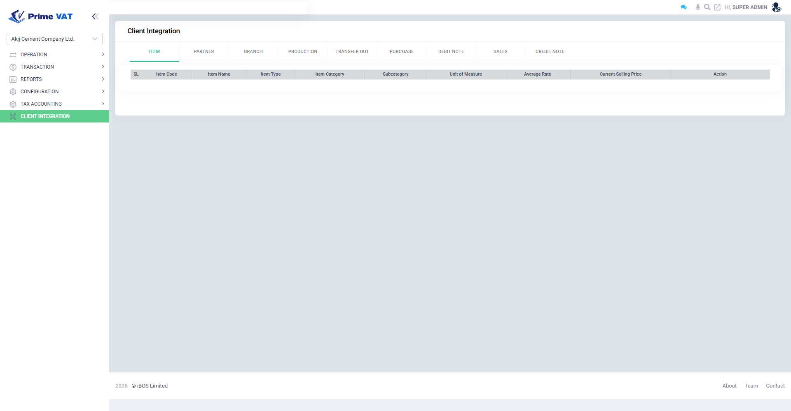

**Page purpose:** This page provides an interface to manage and view integrations for various business modules, including Items, Partners, Branches, Production, Transfers, Purchases, Debit Notes, Sales, and Credit Notes.

**Route:** `/client-integration`

<!-- manual-meta: {"module": "Client Integration", "page": "Client Integration", "task": "View Item Integration Data", "action": "view", "roles": [], "route": "/client-integration", "screenshots": ["screenshots/client_integration/client_integration.png"], "keywords": ["item list", "integration view", "product integration"], "task_order": 1} -->
#### Task: View Item Integration Data

**Purpose:** To monitor and review the details of items currently integrated within the system.

**Required roles:**
* No role restriction was identified

**Prerequisites:**
* User must be logged in.
* User must have access to the Client Integration module.

**Steps:**
1. Navigate to the 'CLIENT INTEGRATION' module in the sidebar.
2. Click on the 'ITEM' tab.
3. Review the data displayed in the table.

**Fields and controls:**
* **SL:** Serial number of the item.
* **Item Code:** Unique identifier for the item.
* **Item Name:** Descriptive name of the item.
* **Item Type:** Classification of the item.
* **Item Category:** Category to which the item belongs.
* **Subcategory:** Specific subcategory of the item.
* **Unit of Measure:** Standard unit for quantity measurement.
* **Average Rate:** The average cost or rate of the item.
* **Current Selling Price:** The latest price at which the item is sold.
* **Action:** Controls available for the specific item row.

**Expected result:** A table populated with list items showing their specific attributes.

**Warnings:**
* No specific warning was identified

**Search keywords:** item list, integration view, product integration

## 2. Configuration Module

### Page: Branch

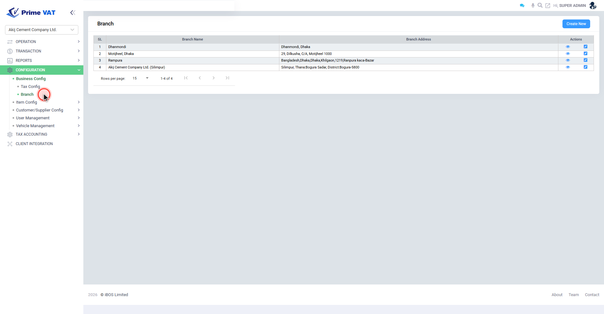

**Page purpose:** Manages branch locations for the business.

**Route:** `https://devprimevat.ibos.io/configuration/businessConfig/branch`

<!-- manual-meta: {"module": "Configuration", "page": "Branch", "task": "View branch list", "action": "view", "roles": [], "route": "https://devprimevat.ibos.io/configuration/businessConfig/branch", "screenshots": ["screenshots/configuration/branch.png"], "keywords": ["branch", "location", "business"], "task_order": 1} -->
#### Task: View branch list

**Purpose:** To see all configured business branches.

**Required roles:**
* No role restriction was identified

**Prerequisites:**
* User must be authenticated

**Steps:**
1. Navigate to CONFIGURATION > Business Config > Branch
2. Review the list of branches in the table

**Fields and controls:**
* **SL:** Serial number.
* **Branch Name:** The name assigned to the branch.
* **Branch Address:** The physical address of the branch.

**Expected result:** A list of branches is displayed.

**Warnings:**
* No specific warning was identified

**Search keywords:** branch, location, business

### Page: User Profile

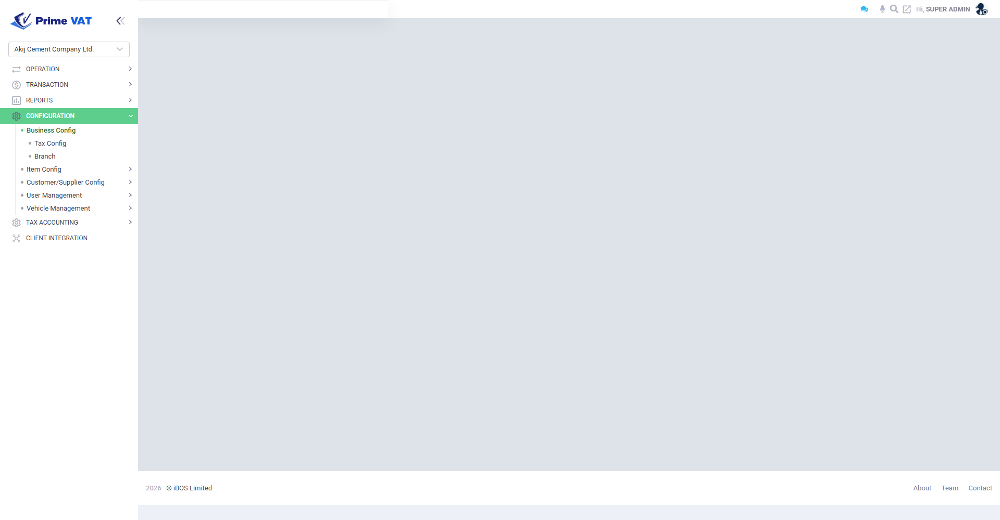

**Page purpose:** This page contains the controls and information shown in the captured interface.

**Route:** `https://devprimevat.ibos.io/configuration/businessConfig`

<!-- manual-meta: {"module": "Configuration", "page": "User Profile", "task": "Use User Profile", "action": "view", "roles": [], "route": "https://devprimevat.ibos.io/configuration/businessConfig", "screenshots": ["screenshots/configuration/business_config.png"], "keywords": ["User Profile", "business config"], "task_order": 1} -->
#### Task: Use User Profile

**Purpose:** Review and use the visible page functions.

**Required roles:**
* No role restriction was identified

**Prerequisites:**
* None identified from the interface

**Steps:**
1. Open the User Profile page.
2. Review the visible controls, fields, and table columns.
3. Choose the required available action for your work.

**Fields and controls:**
* No specific fields were identified from the available evidence.

**Expected result:** The requested page information or form is displayed.

**Warnings:**
* Only actions visible in the captured interface are documented.

**Search keywords:** User Profile, business config

### Page: Change Password

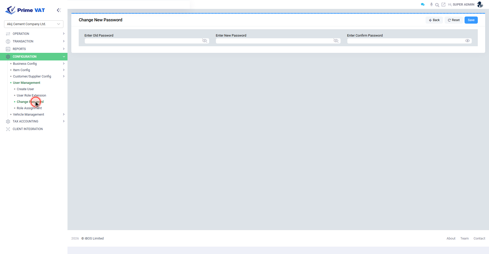

**Page purpose:** Allows users to update their account credentials.

**Route:** `https://devprimevat.ibos.io/configuration/roleManagement/changePassword`

<!-- manual-meta: {"module": "Configuration", "page": "Change Password", "task": "Change account password", "action": "configure", "roles": [], "route": "https://devprimevat.ibos.io/configuration/roleManagement/changePassword", "screenshots": ["screenshots/configuration/change_password.png"], "keywords": ["password", "security", "credentials"], "task_order": 1} -->
#### Task: Change account password

**Purpose:** To update user account security settings.

**Required roles:**
* No role restriction was identified

**Prerequisites:**
* User must be logged in

**Steps:**
1. Navigate to CONFIGURATION > User Management > Change Password
2. Enter current password in Enter Old Password field
3. Enter new password in Enter New Password field
4. Enter new password again in Enter Confirm Password field

**Fields and controls:**
* **Enter Old Password:** Current password.
* **Enter New Password:** New password.
* **Enter Confirm Password:** Re-enter new password.

**Expected result:** Password updated successfully after clicking Save.

**Warnings:**
* Ensure the new password meets security requirements.

**Search keywords:** password, security, credentials

### Page: User Profile

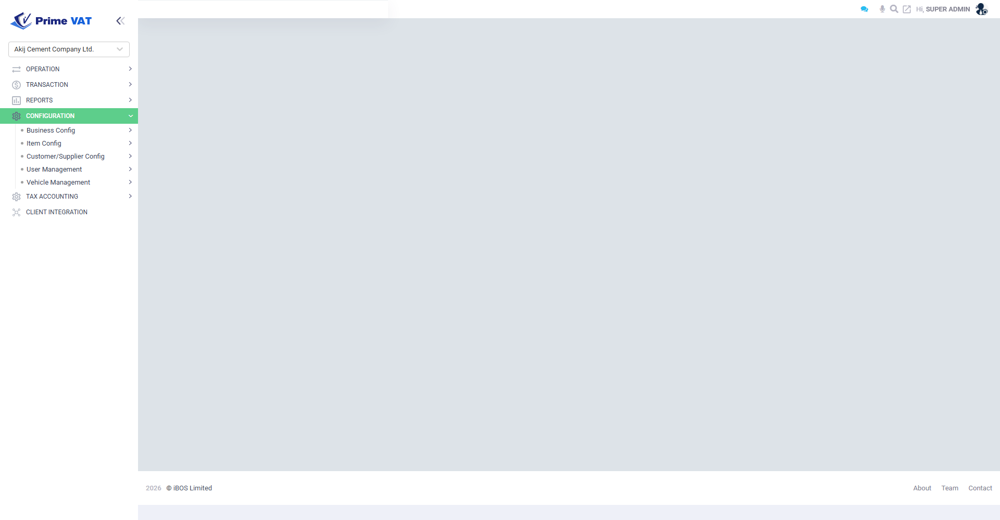

**Page purpose:** This page contains the controls and information shown in the captured interface.

**Route:** `https://devprimevat.ibos.io/configuration`

<!-- manual-meta: {"module": "Configuration", "page": "User Profile", "task": "Use User Profile", "action": "view", "roles": [], "route": "https://devprimevat.ibos.io/configuration", "screenshots": ["screenshots/configuration/configuration.png"], "keywords": ["User Profile", "configuration"], "task_order": 1} -->
#### Task: Use User Profile

**Purpose:** Review and use the visible page functions.

**Required roles:**
* No role restriction was identified

**Prerequisites:**
* None identified from the interface

**Steps:**
1. Open the User Profile page.
2. Review the visible controls, fields, and table columns.
3. Choose the required available action for your work.

**Fields and controls:**
* No specific fields were identified from the available evidence.

**Expected result:** The requested page information or form is displayed.

**Warnings:**
* Only actions visible in the captured interface are documented.

**Search keywords:** User Profile, configuration

### Page: User List

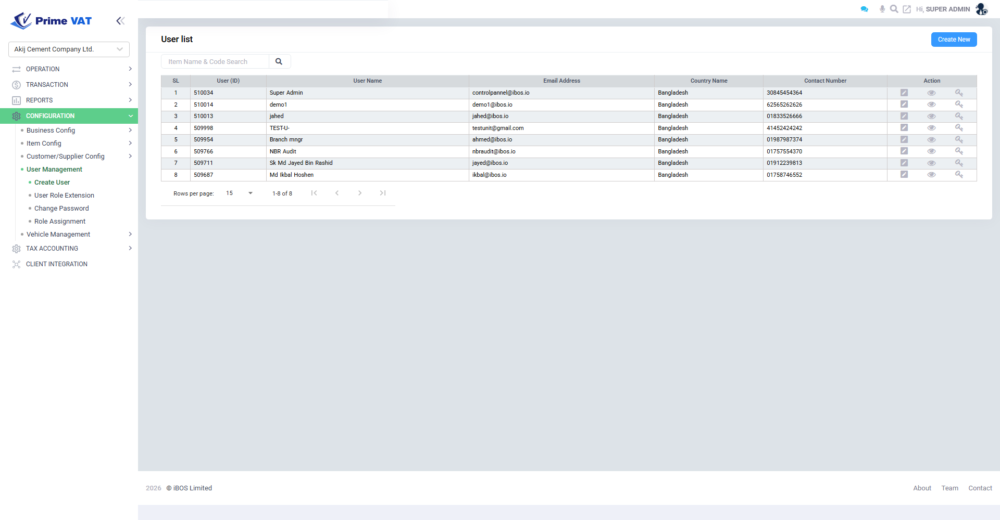

**Page purpose:** Management screen for user accounts.

**Route:** `https://devprimevat.ibos.io/configuration/roleManagement/createUser`

<!-- manual-meta: {"module": "Configuration", "page": "User List", "task": "View user list", "action": "view", "roles": [], "route": "https://devprimevat.ibos.io/configuration/roleManagement/createUser", "screenshots": ["screenshots/configuration/create_user.png"], "keywords": ["user", "list", "account"], "task_order": 1} -->
#### Task: View user list

**Purpose:** To verify existing users in the system.

**Required roles:**
* No role restriction was identified

**Prerequisites:**
* User must have proper permissions

**Steps:**
1. Navigate to CONFIGURATION > User Management > Create User
2. Review the table for user details

**Fields and controls:**
* **User (ID):** Unique identifier for the user.
* **User Name:** The name of the user.
* **Email Address:** The user's registered email.

**Expected result:** A table showing all registered users.

**Warnings:**
* No specific warning was identified

**Search keywords:** user, list, account

### Page: Customer/Supplier Profile

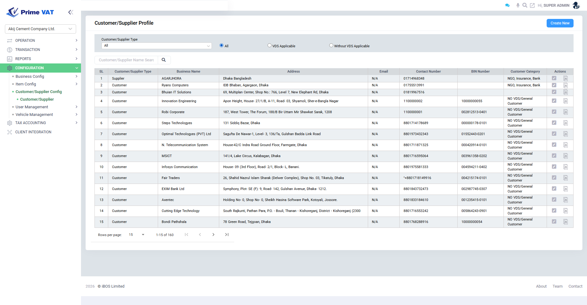

**Page purpose:** Maintain records of customers and suppliers.

**Route:** `https://devprimevat.ibos.io/configuration/partnerConfig/partner`

<!-- manual-meta: {"module": "Configuration", "page": "Customer/Supplier Profile", "task": "Filter customer/supplier list", "action": "filter", "roles": [], "route": "https://devprimevat.ibos.io/configuration/partnerConfig/partner", "screenshots": ["screenshots/configuration/customer_supplier.png"], "keywords": ["customer", "supplier", "partner", "VDS"], "task_order": 1} -->
#### Task: Filter customer/supplier list

**Purpose:** To narrow down the list of partners by type.

**Required roles:**
* No role restriction was identified

**Prerequisites:**
* Access to customer/supplier configuration

**Steps:**
1. Navigate to CONFIGURATION > Customer/Supplier Config > Customer/Supplier
2. Select one of the radio buttons: All, VDS Applicable, or Without VDS Applicable

**Fields and controls:**
* **Customer/Supplier Type:** Filter by business partner type.

**Expected result:** The table content updates to show only matching types.

**Warnings:**
* No specific warning was identified

**Search keywords:** customer, supplier, partner, VDS

### Page: User Profile

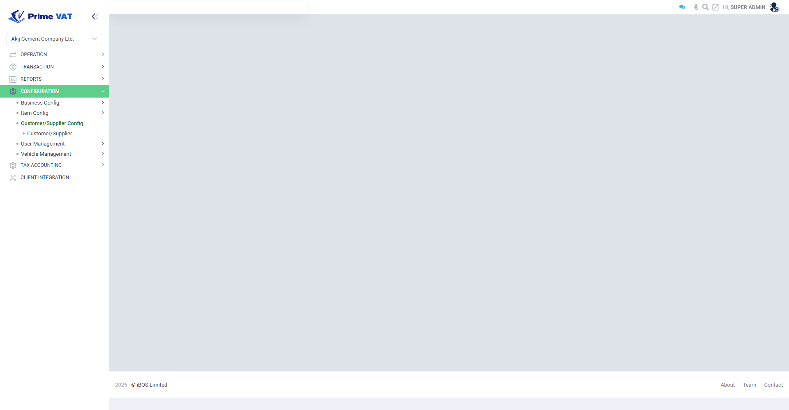

**Page purpose:** This page contains the controls and information shown in the captured interface.

**Route:** `https://devprimevat.ibos.io/configuration/partnerConfig`

<!-- manual-meta: {"module": "Configuration", "page": "User Profile", "task": "Use User Profile", "action": "view", "roles": [], "route": "https://devprimevat.ibos.io/configuration/partnerConfig", "screenshots": ["screenshots/configuration/customer_supplier_config.png"], "keywords": ["User Profile", "customer supplier config"], "task_order": 1} -->
#### Task: Use User Profile

**Purpose:** Review and use the visible page functions.

**Required roles:**
* No role restriction was identified

**Prerequisites:**
* None identified from the interface

**Steps:**
1. Open the User Profile page.
2. Review the visible controls, fields, and table columns.
3. Choose the required available action for your work.

**Fields and controls:**
* No specific fields were identified from the available evidence.

**Expected result:** The requested page information or form is displayed.

**Warnings:**
* Only actions visible in the captured interface are documented.

**Search keywords:** User Profile, customer supplier config

### Page: Item

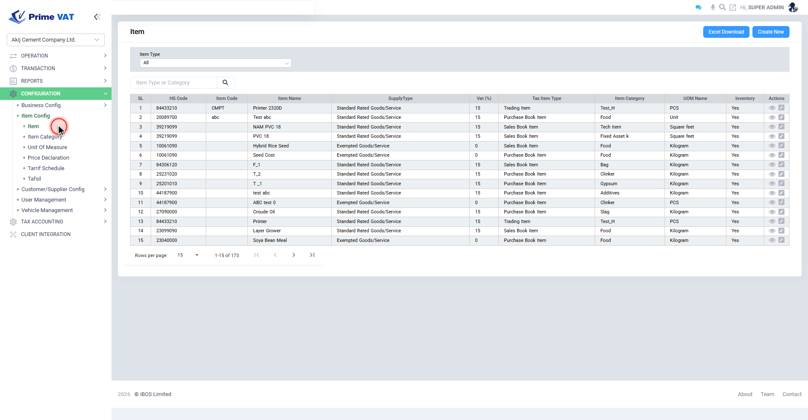

**Page purpose:** View and manage inventory items.

**Route:** `https://devprimevat.ibos.io/configuration/itemConfig/item`

<!-- manual-meta: {"module": "Configuration", "page": "Item", "task": "Export item data", "action": "export", "roles": [], "route": "https://devprimevat.ibos.io/configuration/itemConfig/item", "screenshots": ["screenshots/configuration/item.png"], "keywords": ["item", "inventory", "excel", "download"], "task_order": 1} -->
#### Task: Export item data

**Purpose:** To download item data for external usage.

**Required roles:**
* No role restriction was identified

**Prerequisites:**
* Items must be present in the system

**Steps:**
1. Navigate to CONFIGURATION > Item Config > Item
2. Click the Excel Download button

**Fields and controls:**
* No specific fields were identified from the available evidence.

**Expected result:** An Excel file containing the item list is downloaded.

**Warnings:**
* No specific warning was identified

**Search keywords:** item, inventory, excel, download

### Page: Item Category

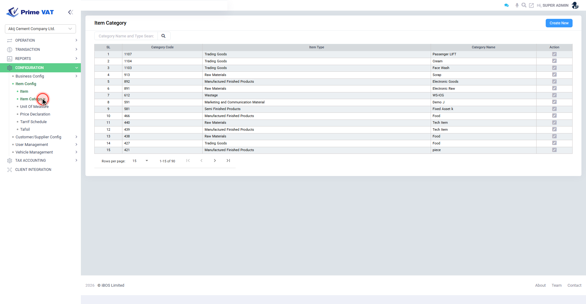

**Page purpose:** This page allows users to manage and view categories for items.

**Route:** `/configuration/itemConfig/itemCategory`

<!-- manual-meta: {"module": "Configuration", "page": "Item Category", "task": "Search for an item category", "action": "search", "roles": [], "route": "/configuration/itemConfig/itemCategory", "screenshots": ["screenshots/configuration/item_category.png"], "keywords": ["find", "lookup", "filter"], "task_order": 1} -->
#### Task: Search for an item category

**Purpose:** To quickly locate a specific category by name or type.

**Required roles:**
* No role restriction was identified

**Prerequisites:**
* The user has access to the configuration module.

**Steps:**
1. Go to Configuration > Item Config > Item Category
2. Enter the term into the 'Category Name and Type Search' field.

**Fields and controls:**
* **Category Name and Type Search:** Text input for filtering item categories.

**Expected result:** The table will display only rows matching the search criteria.

**Warnings:**
* No specific warning was identified

**Search keywords:** find, lookup, filter

### Page: User Profile

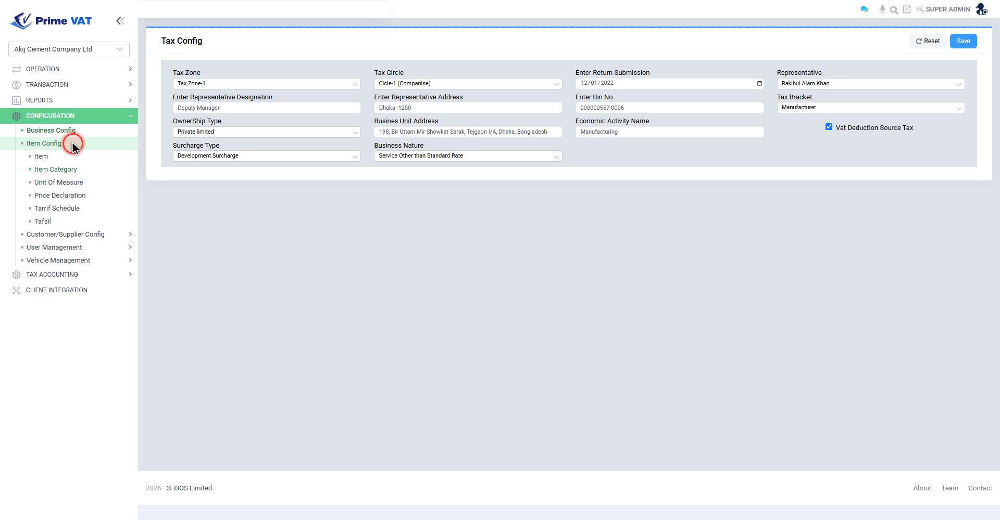

**Page purpose:** This page contains the controls and information shown in the captured interface.

**Route:** `https://devprimevat.ibos.io/configuration/itemConfig`

<!-- manual-meta: {"module": "Configuration", "page": "User Profile", "task": "Use User Profile", "action": "view", "roles": [], "route": "https://devprimevat.ibos.io/configuration/itemConfig", "screenshots": ["screenshots/configuration/item_config.png"], "keywords": ["User Profile", "item config"], "task_order": 1} -->
#### Task: Use User Profile

**Purpose:** Review and use the visible page functions.

**Required roles:**
* No role restriction was identified

**Prerequisites:**
* None identified from the interface

**Steps:**
1. Open the User Profile page.
2. Review the visible controls, fields, and table columns.
3. Choose the required available action for your work.

**Fields and controls:**
* No specific fields were identified from the available evidence.

**Expected result:** The requested page information or form is displayed.

**Warnings:**
* Only actions visible in the captured interface are documented.

**Search keywords:** User Profile, item config

### Page: Price Declaration

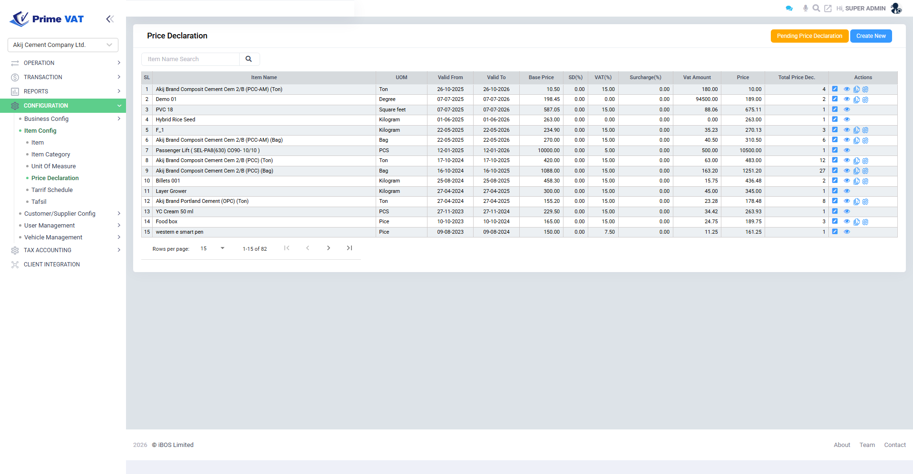

**Page purpose:** This page manages item price declarations, including base price, VAT, and surcharge details.

**Route:** `/configuration/itemConfig/priceDeclaration`

<!-- manual-meta: {"module": "Configuration", "page": "Price Declaration", "task": "View price declarations", "action": "view", "roles": [], "route": "/configuration/itemConfig/priceDeclaration", "screenshots": ["screenshots/configuration/price_declaration.png"], "keywords": ["list", "records", "price view"], "task_order": 1} -->
#### Task: View price declarations

**Purpose:** To monitor current price declarations and their associated tax values.

**Required roles:**
* No role restriction was identified

**Prerequisites:**
* The user has access to the price declaration module.

**Steps:**
1. Go to Configuration > Item Config > Price Declaration

**Fields and controls:**
* **Item Name Search:** Text input to search for a specific item's price declaration.

**Expected result:** A table showing Item Name, UOM, dates, prices, and tax information will be displayed.

**Warnings:**
* No specific warning was identified

**Search keywords:** list, records, price view

### Page: Role Assignment

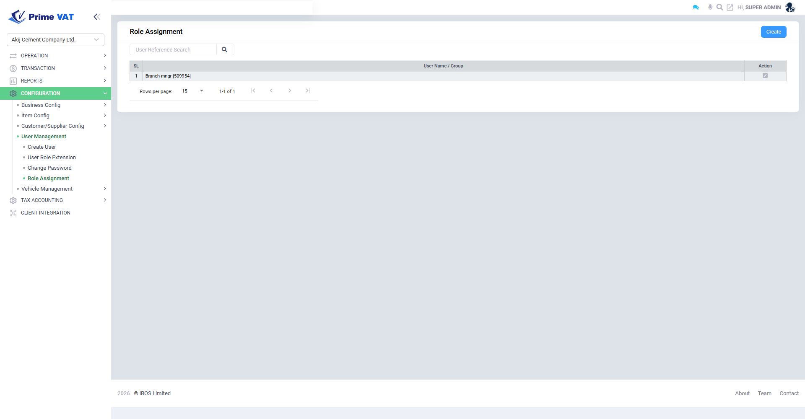

**Page purpose:** This page manages the assignment of user roles and groups within the system.

**Route:** `/configuration/roleManagement/roleAssignment`

<!-- manual-meta: {"module": "Configuration", "page": "Role Assignment", "task": "Search for a role assignment", "action": "search", "roles": [], "route": "/configuration/roleManagement/roleAssignment", "screenshots": ["screenshots/configuration/role_assignment.png"], "keywords": ["user assignment", "role search"], "task_order": 1} -->
#### Task: Search for a role assignment

**Purpose:** To find specific user roles or groups to review or update assignments.

**Required roles:**
* No role restriction was identified

**Prerequisites:**
* The user has administrative access to User Management.

**Steps:**
1. Go to Configuration > User Management > Role Assignment
2. Enter the user name or group into the 'User Reference Search' field.

**Fields and controls:**
* **User Reference Search:** Input field for searching assigned user roles or groups.

**Expected result:** The list of assignments will filter based on the search query.

**Warnings:**
* No specific warning was identified

**Search keywords:** user assignment, role search

### Page: Tafsil

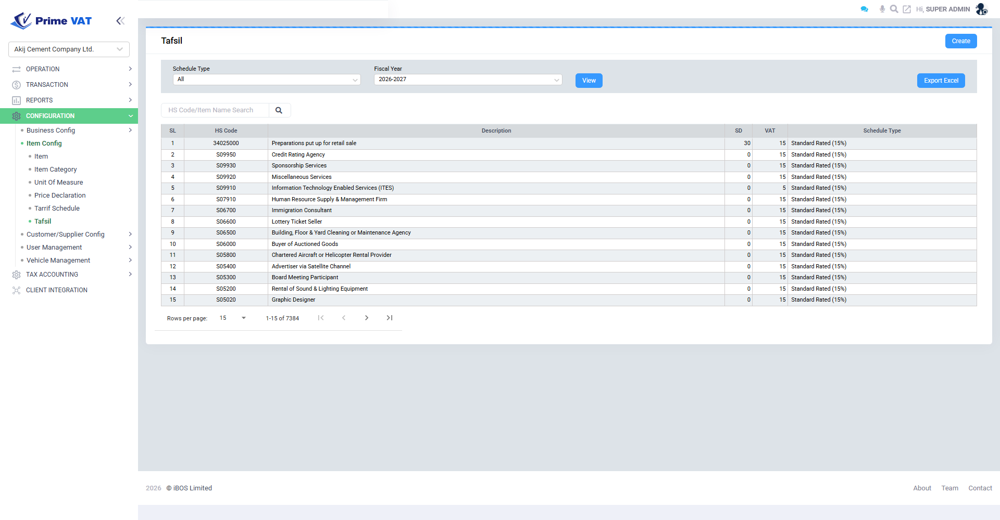

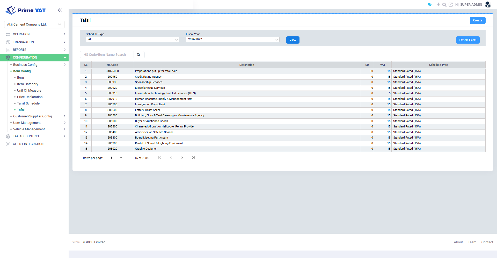

**Page purpose:** This page provides a list of HS codes and associated VAT/SD details, typically used for regulatory compliance.

**Route:** `/configuration/itemConfig/tafsil`

<!-- manual-meta: {"module": "Configuration", "page": "Tafsil", "task": "Filter Tafsil schedule", "action": "filter", "roles": [], "route": "/configuration/itemConfig/tafsil", "screenshots": ["screenshots/configuration/tafsil.png", "screenshots/configuration/tafsil_show.png"], "keywords": ["search", "compliance", "tax lookup"], "task_order": 1} -->
#### Task: Filter Tafsil schedule

**Purpose:** To view records by specific schedule type and fiscal year.

**Required roles:**
* No role restriction was identified

**Prerequisites:**
* User is on the Tafsil configuration page.

**Steps:**
1. Go to Configuration > Item Config > Tafsil
2. Select 'Schedule Type' and 'Fiscal Year' from the dropdown menus
3. Click the 'View' button.

**Fields and controls:**
* **Schedule Type:** Dropdown to select the category of the schedule.
* **Fiscal Year:** Dropdown to select the relevant fiscal year.

**Expected result:** The table updates to show records corresponding to the selected fiscal filters.

**Warnings:**
* No specific warning was identified

**Search keywords:** search, compliance, tax lookup

### Page: Tarrif Schedule

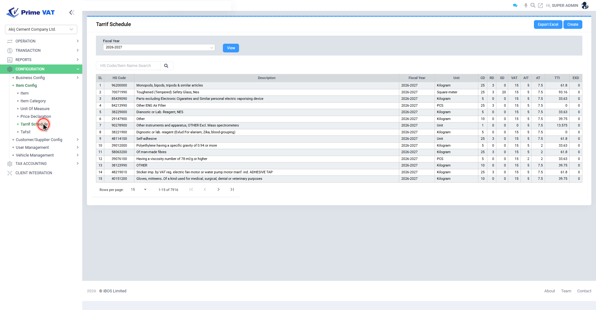

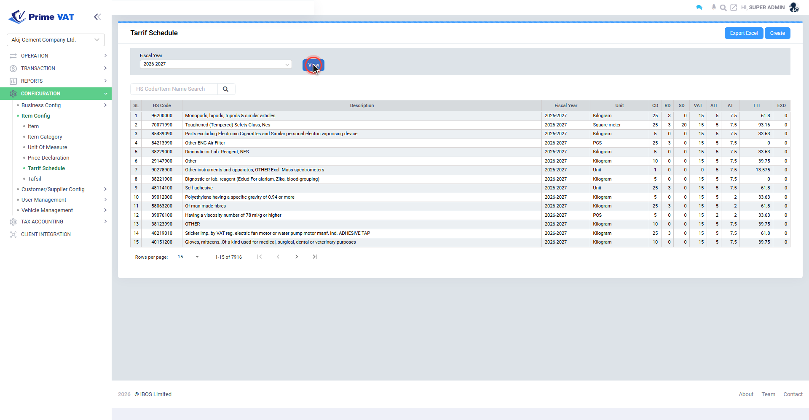

**Page purpose:** This page lists tariff schedules with detailed tax components like CD, RD, SD, and VAT for different items.

**Route:** `/configuration/itemConfig/tarrifSchedule`

<!-- manual-meta: {"module": "Configuration", "page": "Tarrif Schedule", "task": "Export tariff schedule", "action": "export", "roles": [], "route": "/configuration/itemConfig/tarrifSchedule", "screenshots": ["screenshots/configuration/tarrif_schedule.png", "screenshots/configuration/tarrif_schedule_show.png"], "keywords": ["download", "report", "save as"], "task_order": 1} -->
#### Task: Export tariff schedule

**Purpose:** To download the full list of tariff schedules for external reporting or offline review.

**Required roles:**
* No role restriction was identified

**Prerequisites:**
* User has permission to export data.

**Steps:**
1. Go to Configuration > Item Config > Tarrif Schedule
2. Click the 'Export Excel' button.

**Fields and controls:**
* No specific fields were identified from the available evidence.

**Expected result:** An Excel file containing the tariff schedule data will begin downloading.

**Warnings:**
* No specific warning was identified

**Search keywords:** download, report, save as

### Page: Tax Config

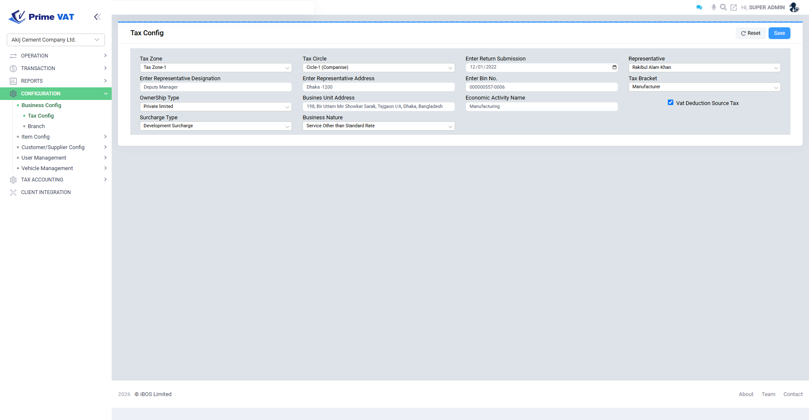

**Page purpose:** This page allows the configuration of tax-related settings and business information.

**Route:** `/configuration/businessConfig/taxConfig`

<!-- manual-meta: {"module": "Configuration", "page": "Tax Config", "task": "Update tax configuration settings", "action": "configure", "roles": [], "route": "/configuration/businessConfig/taxConfig", "screenshots": ["screenshots/configuration/tax_config.png"], "keywords": ["settings", "business profile", "tax details"], "task_order": 1} -->
#### Task: Update tax configuration settings

**Purpose:** To update enterprise business settings, tax zones, and contact information.

**Required roles:**
* No role restriction was identified

**Prerequisites:**
* User has administrative access to business configurations.

**Steps:**
1. Go to Configuration > Business Config > Tax Config
2. Update fields such as Tax Zone, Tax Circle, Representative information, and Economic Activity Name
3. Check or uncheck 'Vat Deduction Source Tax' as required.

**Fields and controls:**
* **Vat Deduction Source Tax:** Checkbox for enabling or disabling source tax deduction.
* **Tax Zone:** Selector for the organizational tax zone.

**Expected result:** Verify changes reflect the desired business tax settings after saving.

**Warnings:**
* No specific warning was identified

**Search keywords:** settings, business profile, tax details

### Page: Unit Of Measure

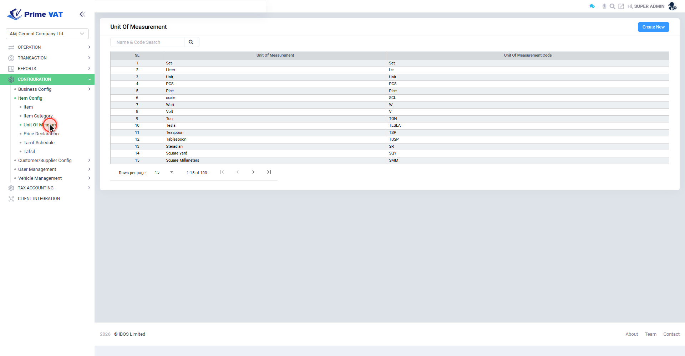

**Page purpose:** This page lists all defined units of measure and their associated codes.

**Route:** `/configuration/itemConfig/unitOfMeasure`

<!-- manual-meta: {"module": "Configuration", "page": "Unit Of Measure", "task": "Search for a unit of measure", "action": "search", "roles": [], "route": "/configuration/itemConfig/unitOfMeasure", "screenshots": ["screenshots/configuration/unit_of_measure.png"], "keywords": ["unit lookup", "find unit"], "task_order": 1} -->
#### Task: Search for a unit of measure

**Purpose:** To find the code or name for a specific measurement unit.

**Required roles:**
* No role restriction was identified

**Prerequisites:**
* The user has access to item configuration.

**Steps:**
1. Go to Configuration > Item Config > Unit Of Measure
2. Enter the unit name or code into the 'Name & Code Search' field.

**Fields and controls:**
* **Name & Code Search:** Text field to find a specific unit or code.

**Expected result:** The grid displays the unit matching the searched term.

**Warnings:**
* No specific warning was identified

**Search keywords:** unit lookup, find unit

### Page: User Management

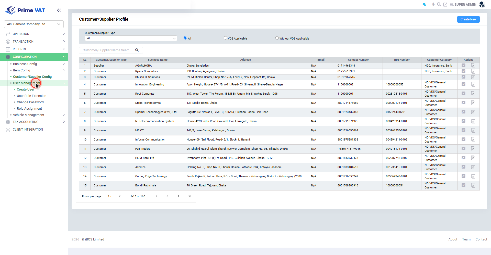

**Page purpose:** Central dashboard for managing user accounts, roles, and security settings within the system.

**Route:** `/configuration/roleManagement`

<!-- manual-meta: {"module": "Configuration", "page": "User Management", "task": "Navigate to User Management sub-modules", "action": "view", "roles": [], "route": "/configuration/roleManagement", "screenshots": ["screenshots/configuration/user_management.png"], "keywords": ["user administration", "account settings", "permissions"], "task_order": 1} -->
#### Task: Navigate to User Management sub-modules

**Purpose:** To access specific user administration tasks like creating users or changing passwords.

**Required roles:**
* No role restriction was identified

**Prerequisites:**
* User must be logged in with administrative privileges.

**Steps:**
1. Click on the 'CONFIGURATION' menu in the sidebar.
2. Select 'User Management' to expand the sub-menu.
3. Choose from available sub-options: 'Create User', 'User Role Extension', 'Change Password', or 'Role Assignment'.

**Fields and controls:**
* No specific fields were identified from the available evidence.

**Expected result:** The user is navigated to the selected administrative page.

**Warnings:**
* No specific warning was identified

**Search keywords:** user administration, account settings, permissions

### Page: User Role Extension

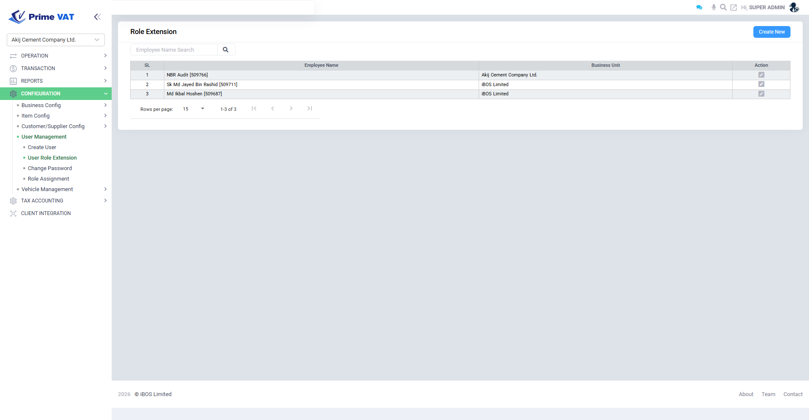

**Page purpose:** Used to view and manage role extensions for specific employees in the business unit.

**Route:** `/configuration/roleManagement/roleExtension`

<!-- manual-meta: {"module": "Configuration", "page": "User Role Extension", "task": "Search for employee role extensions", "action": "search", "roles": [], "route": "/configuration/roleManagement/roleExtension", "screenshots": ["screenshots/configuration/user_role_extension.png"], "keywords": ["search employee", "filter roles", "find user role"], "task_order": 1} -->
#### Task: Search for employee role extensions

**Purpose:** To quickly locate role information for a specific employee.

**Required roles:**
* No role restriction was identified

**Prerequisites:**
* User is on the Role Extension page.

**Steps:**
1. Locate the 'Employee Name Search' field.
2. Type the employee name or identification code.
3. The system will filter the table results automatically based on the input.

**Fields and controls:**
* **Employee Name Search:** Text input to filter the employee list by name or ID.

**Expected result:** The list of employees in the table is filtered to match the search term.

**Warnings:**
* No specific warning was identified

**Search keywords:** search employee, filter roles, find user role

### Page: Vehicle Management

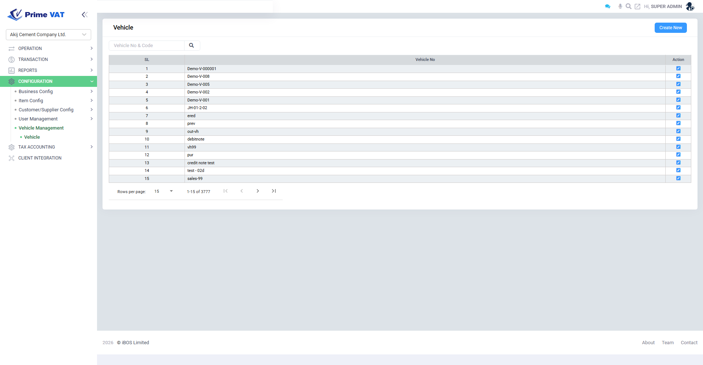

**Page purpose:** A directory of registered vehicles used within the system operations.

**Route:** `/configuration/vehicleManagement/vehicle`

<!-- manual-meta: {"module": "Configuration", "page": "Vehicle Management", "task": "Search for a vehicle", "action": "search", "roles": [], "route": "/configuration/vehicleManagement/vehicle", "screenshots": ["screenshots/configuration/vehicle.png"], "keywords": ["find vehicle", "vehicle search", "vehicle code"], "task_order": 1} -->
#### Task: Search for a vehicle

**Purpose:** To find a specific vehicle record by its number or code.

**Required roles:**
* No role restriction was identified

**Prerequisites:**
* User is on the Vehicle page.

**Steps:**
1. Click into the 'Vehicle No & Code' search bar.
2. Enter the partial or full vehicle number or identification code.
3. View the updated table list below.

**Fields and controls:**
* **Vehicle No & Code:** Search input to filter vehicles by ID or code.

**Expected result:** The vehicle table displays records matching the search criteria.

**Warnings:**
* No specific warning was identified

**Search keywords:** find vehicle, vehicle search, vehicle code

### Page: Vehicle Management Overview

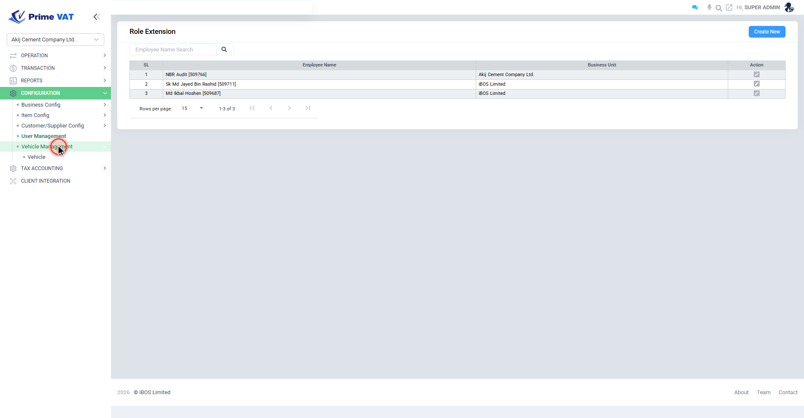

**Page purpose:** Administrative section to manage vehicle-related configurations.

**Route:** `/configuration/vehicleManagement`

<!-- manual-meta: {"module": "Configuration", "page": "Vehicle Management Overview", "task": "Access vehicle configuration", "action": "view", "roles": [], "route": "/configuration/vehicleManagement", "screenshots": ["screenshots/configuration/vehicle_management.png"], "keywords": ["manage vehicles", "vehicle config"], "task_order": 1} -->
#### Task: Access vehicle configuration

**Purpose:** To navigate to the detailed vehicle management screen.

**Required roles:**
* No role restriction was identified

**Prerequisites:**
* Access to the Configuration module.

**Steps:**
1. Click on 'CONFIGURATION' in the side navigation.
2. Expand 'Vehicle Management'.
3. Click on 'Vehicle' to view the full register.

**Fields and controls:**
* No specific fields were identified from the available evidence.

**Expected result:** The application redirects to the vehicle register list.

**Warnings:**
* No specific warning was identified

**Search keywords:** manage vehicles, vehicle config

## 3. Operation Module

### Page: Contract Manufacturing Issue

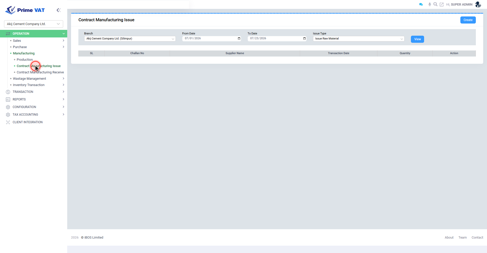

**Page purpose:** This page is used to manage and track the issuance of materials for contract manufacturing.

**Route:** `/operation/manufacturing/contactManufacturing`

<!-- manual-meta: {"module": "Operation", "page": "Contract Manufacturing Issue", "task": "Filter contract manufacturing issues", "action": "filter", "roles": [], "route": "/operation/manufacturing/contactManufacturing", "screenshots": ["screenshots/operation/contract_manufacturing_issue.png", "screenshots/operation/contract_manufacturing_issue_show.png"], "keywords": ["filter", "search", "contract", "issue", "manufacturing"], "task_order": 1} -->
#### Task: Filter contract manufacturing issues

**Purpose:** To view a list of specific contract manufacturing issue records within a selected time range.

**Required roles:**
* No role restriction was identified

**Prerequisites:**
* User must be logged in.
* User must have access to the Operation module.

**Steps:**
1. Navigate to Operation > Manufacturing > Contract Manufacturing Issue.
2. Select the desired Branch.
3. Choose the From Date.
4. Choose the To Date.
5. Select the Issue Type.
6. Click the View button.

**Fields and controls:**
* **Branch:** The business location for the transaction.
* **From Date:** Start date of the search period.
* **To Date:** End date of the search period.
* **Issue Type:** The category of the material issue.

**Expected result:** The table displays the relevant contract manufacturing records based on the filters applied.

**Warnings:**
* No specific warning was identified

**Search keywords:** filter, search, contract, issue, manufacturing

### Page: Contract Manufacturing Receive

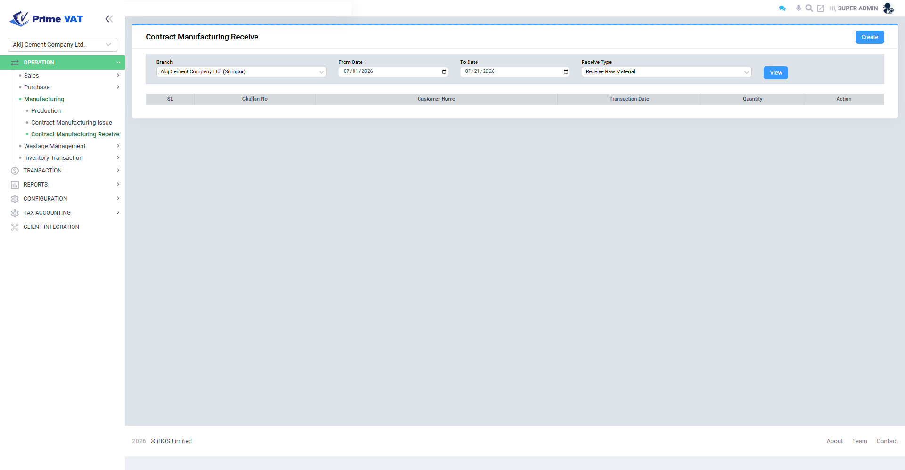

**Page purpose:** This page is used to manage and view records of materials received from contract manufacturing.

**Route:** `/operation/manufacturing/contactMFGReceive`

<!-- manual-meta: {"module": "Operation", "page": "Contract Manufacturing Receive", "task": "Filter contract manufacturing receipts", "action": "filter", "roles": [], "route": "/operation/manufacturing/contactMFGReceive", "screenshots": ["screenshots/operation/contract_manufacturing_receive.png", "screenshots/operation/contract_manufacturing_receive_show.png"], "keywords": ["filter", "search", "receive", "manufacturing"], "task_order": 1} -->
#### Task: Filter contract manufacturing receipts

**Purpose:** To view a list of received material records from contract manufacturing within a specific date range.

**Required roles:**
* No role restriction was identified

**Prerequisites:**
* User must be logged in.
* User must have access to the Operation module.

**Steps:**
1. Navigate to Operation > Manufacturing > Contract Manufacturing Receive.
2. Select the desired Branch.
3. Choose the From Date.
4. Choose the To Date.
5. Select the Receive Type.
6. Click the View button.

**Fields and controls:**
* **Branch:** The business location for the transaction.
* **From Date:** Start date of the search period.
* **To Date:** End date of the search period.
* **Receive Type:** The category of the material received.

**Expected result:** The table displays the relevant contract manufacturing receipts based on the filters applied.

**Warnings:**
* No specific warning was identified

**Search keywords:** filter, search, receive, manufacturing

### Page: Credit Note

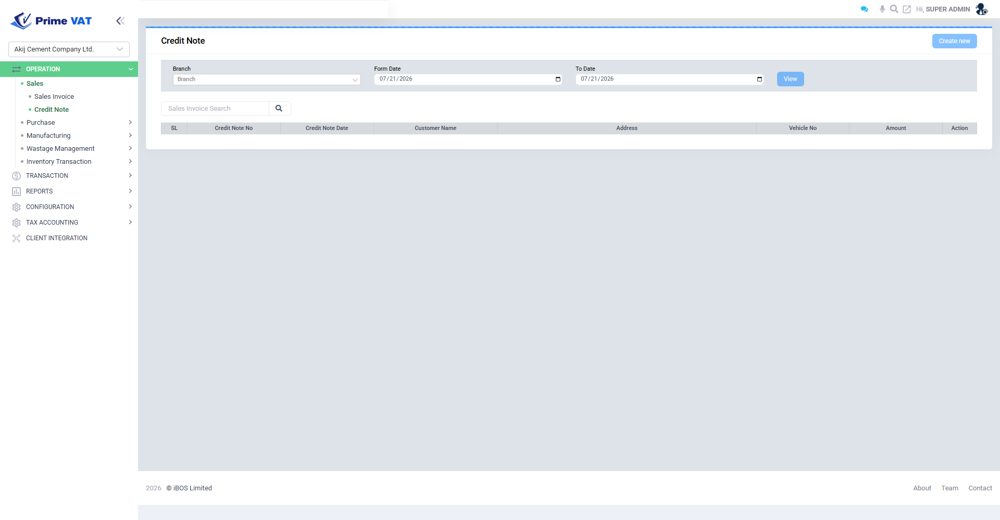

**Page purpose:** This page provides a list of credit notes associated with sales invoices.

**Route:** `/operation/sales/credit-note`

<!-- manual-meta: {"module": "Operation", "page": "Credit Note", "task": "View credit notes", "action": "view", "roles": [], "route": "/operation/sales/credit-note", "screenshots": ["screenshots/operation/credit_note.png"], "keywords": ["credit", "note", "sales", "search"], "task_order": 1} -->
#### Task: View credit notes

**Purpose:** To view, search, or filter existing credit note records.

**Required roles:**
* No role restriction was identified

**Prerequisites:**
* User must be logged in.

**Steps:**
1. Navigate to Operation > Sales > Credit Note.
2. Select the Branch.
3. Specify the date range using Form Date and To Date.
4. Use the Sales Invoice Search field to locate a specific note.
5. Click the View button to update the list.

**Fields and controls:**
* **Branch:** Selection of the business branch.
* **Form Date:** Start date filter for the report.
* **To Date:** End date filter for the report.
* **Sales Invoice Search:** Search by sales invoice number.

**Expected result:** A table populated with credit note data matching the search criteria.

**Warnings:**
* No specific warning was identified

**Search keywords:** credit, note, sales, search

### Page: Debit Note

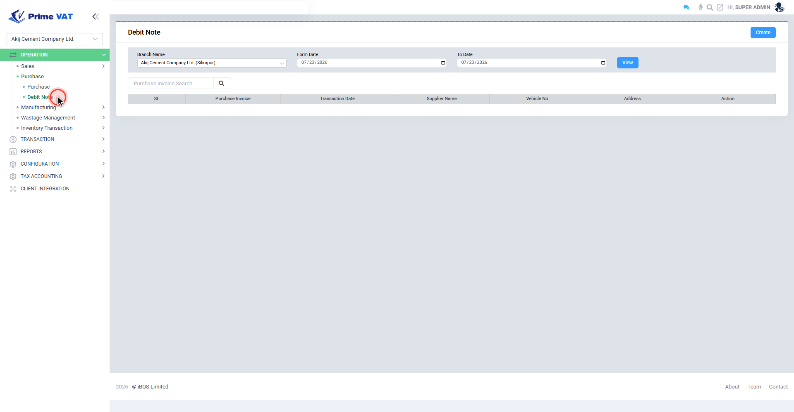

**Page purpose:** This page is used to manage and search for purchase-related debit notes.

**Route:** `/operation/purchase/debit-note`

<!-- manual-meta: {"module": "Operation", "page": "Debit Note", "task": "Search for debit notes", "action": "search", "roles": [], "route": "/operation/purchase/debit-note", "screenshots": ["screenshots/operation/debit_note.png", "screenshots/operation/debit_note_show.png"], "keywords": ["debit", "note", "purchase", "search"], "task_order": 1} -->
#### Task: Search for debit notes

**Purpose:** To find specific debit notes associated with purchase invoices.

**Required roles:**
* No role restriction was identified

**Prerequisites:**
* User must be logged in.

**Steps:**
1. Navigate to Operation > Purchase > Debit Note.
2. Select the Branch Name.
3. Enter the Form Date and To Date.
4. Enter a keyword in the Purchase Invoice Search field.
5. Click View to apply the filters.

**Fields and controls:**
* **Branch Name:** The business entity or branch.
* **Purchase Invoice Search:** Lookup field for purchase invoices.

**Expected result:** The list of debit notes matching the provided invoice search and date criteria appears.

**Warnings:**
* No specific warning was identified

**Search keywords:** debit, note, purchase, search

### Page: User Profile

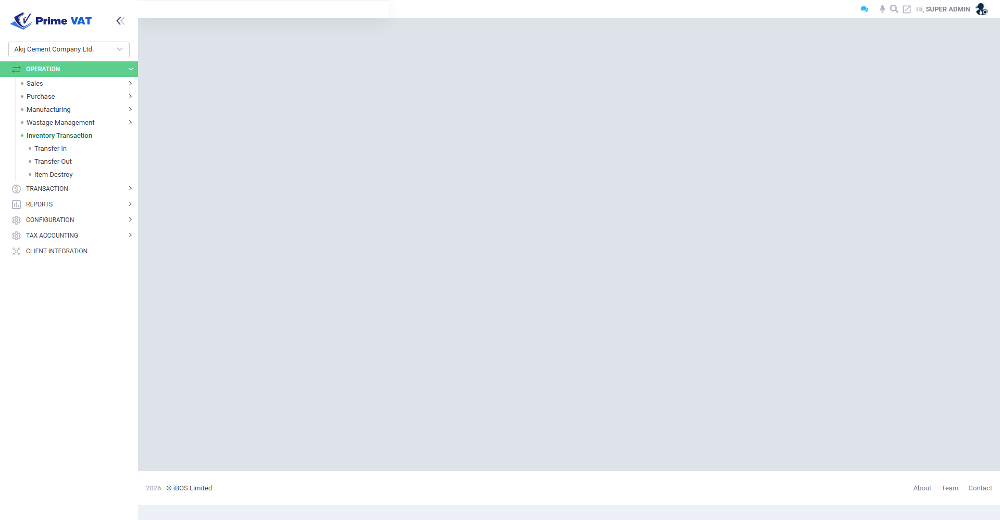

**Page purpose:** This page contains the controls and information shown in the captured interface.

**Route:** `https://devprimevat.ibos.io/operation/inventoryTransaction`

<!-- manual-meta: {"module": "Operation", "page": "User Profile", "task": "Use User Profile", "action": "view", "roles": [], "route": "https://devprimevat.ibos.io/operation/inventoryTransaction", "screenshots": ["screenshots/operation/inventory_transaction.png"], "keywords": ["User Profile", "inventory transaction"], "task_order": 1} -->
#### Task: Use User Profile

**Purpose:** Review and use the visible page functions.

**Required roles:**
* No role restriction was identified

**Prerequisites:**
* None identified from the interface

**Steps:**
1. Open the User Profile page.
2. Review the visible controls, fields, and table columns.
3. Choose the required available action for your work.

**Fields and controls:**
* No specific fields were identified from the available evidence.

**Expected result:** The requested page information or form is displayed.

**Warnings:**
* Only actions visible in the captured interface are documented.

**Search keywords:** User Profile, inventory transaction

### Page: Item Destroy

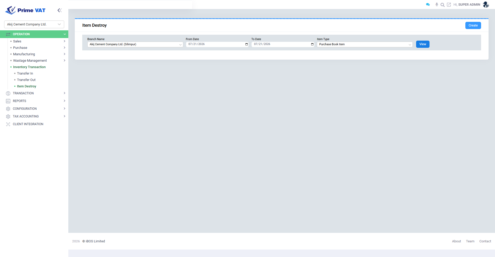

**Page purpose:** This page is used to track and view records of items that have been destroyed or removed from inventory.

**Route:** `/operation/inventoryTransaction/itemDestroy`

<!-- manual-meta: {"module": "Operation", "page": "Item Destroy", "task": "Filter destroyed items", "action": "filter", "roles": [], "route": "/operation/inventoryTransaction/itemDestroy", "screenshots": ["screenshots/operation/item_destroy.png", "screenshots/operation/item_destroy_show.png"], "keywords": ["inventory", "destroy", "wastage"], "task_order": 1} -->
#### Task: Filter destroyed items

**Purpose:** To list items that have been destroyed within a specified date range and type.

**Required roles:**
* No role restriction was identified

**Prerequisites:**
* User must be logged in.

**Steps:**
1. Navigate to Operation > Inventory Transaction > Item Destroy.
2. Select the Branch Name.
3. Define the From Date and To Date.
4. Select the Item Type.
5. Click View.

**Fields and controls:**
* **Branch Name:** The business location for the transaction.
* **Item Type:** The category of item to view.

**Expected result:** A list of destroyed item records that match the selected parameters.

**Warnings:**
* No specific warning was identified

**Search keywords:** inventory, destroy, wastage

### Page: User Profile

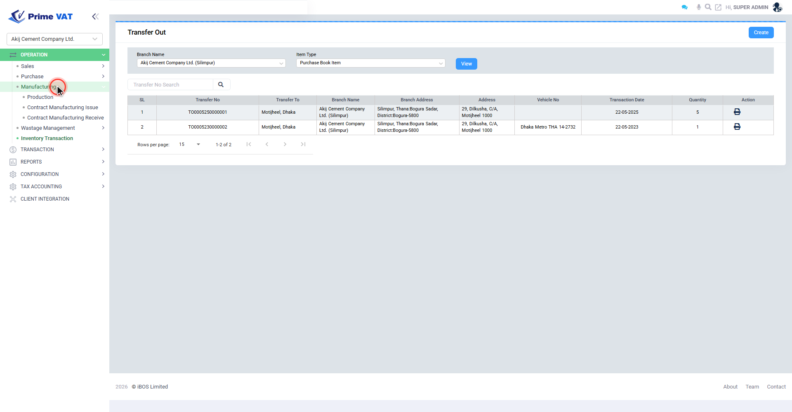

**Page purpose:** This page contains the controls and information shown in the captured interface.

**Route:** `https://devprimevat.ibos.io/operation/manufacturing`

<!-- manual-meta: {"module": "Operation", "page": "User Profile", "task": "Use User Profile", "action": "view", "roles": [], "route": "https://devprimevat.ibos.io/operation/manufacturing", "screenshots": ["screenshots/operation/manufacturing.png"], "keywords": ["User Profile", "manufacturing"], "task_order": 1} -->
#### Task: Use User Profile

**Purpose:** Review and use the visible page functions.

**Required roles:**
* No role restriction was identified

**Prerequisites:**
* None identified from the interface

**Steps:**
1. Open the User Profile page.
2. Review the visible controls, fields, and table columns.
3. Choose the required available action for your work.

**Fields and controls:**
* No specific fields were identified from the available evidence.

**Expected result:** The requested page information or form is displayed.

**Warnings:**
* Only actions visible in the captured interface are documented.

**Search keywords:** User Profile, manufacturing

### Page: User Profile

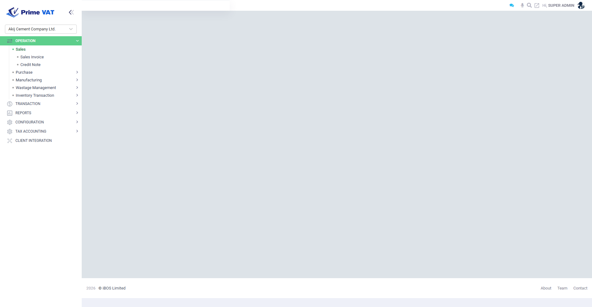

**Page purpose:** This page contains the controls and information shown in the captured interface.

**Route:** `https://devprimevat.ibos.io/operation`

<!-- manual-meta: {"module": "Operation", "page": "User Profile", "task": "Use User Profile", "action": "view", "roles": [], "route": "https://devprimevat.ibos.io/operation", "screenshots": ["screenshots/operation/operation.png"], "keywords": ["User Profile", "operation"], "task_order": 1} -->
#### Task: Use User Profile

**Purpose:** Review and use the visible page functions.

**Required roles:**
* No role restriction was identified

**Prerequisites:**
* None identified from the interface

**Steps:**
1. Open the User Profile page.
2. Review the visible controls, fields, and table columns.
3. Choose the required available action for your work.

**Fields and controls:**
* No specific fields were identified from the available evidence.

**Expected result:** The requested page information or form is displayed.

**Warnings:**
* Only actions visible in the captured interface are documented.

**Search keywords:** User Profile, operation

### Page: Price Declaration Wastage

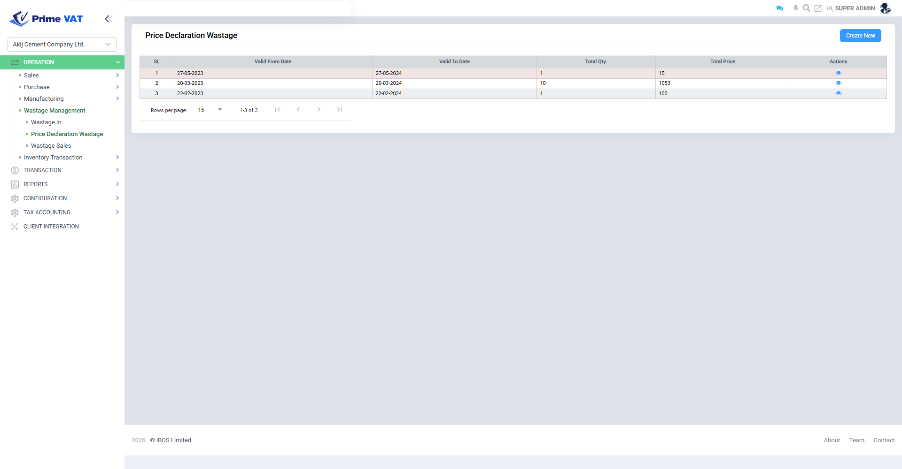

**Page purpose:** This page allows users to view and manage price declarations for wastage.

**Route:** `/operation/wastageManagement/priceDeclarationWastage`

<!-- manual-meta: {"module": "Operation", "page": "Price Declaration Wastage", "task": "View Price Declaration Wastage", "action": "view", "roles": [], "route": "/operation/wastageManagement/priceDeclarationWastage", "screenshots": ["screenshots/operation/price_declaration_wastage.png"], "keywords": ["price declaration", "wastage", "price list"], "task_order": 1} -->
#### Task: View Price Declaration Wastage

**Purpose:** To view the list of declared wastage prices and their validity periods.

**Required roles:**
* No role restriction was identified

**Prerequisites:**
* None identified from the interface

**Steps:**
1. Navigate to Operation > Wastage Management > Price Declaration Wastage.
2. Review the list of records in the table.
3. Use the 'Rows per page' dropdown to adjust the number of visible entries if necessary.

**Fields and controls:**
* **SL:** Serial number of the entry.
* **Valid From Date:** The start date for the price declaration.
* **Valid To Date:** The end date for the price declaration.
* **Total Qty.:** The quantity associated with the wastage price.
* **Total Price:** The declared price for the wastage.

**Expected result:** A table displaying existing price declaration records.

**Warnings:**
* No specific warning was identified

**Search keywords:** price declaration, wastage, price list

### Page: Production

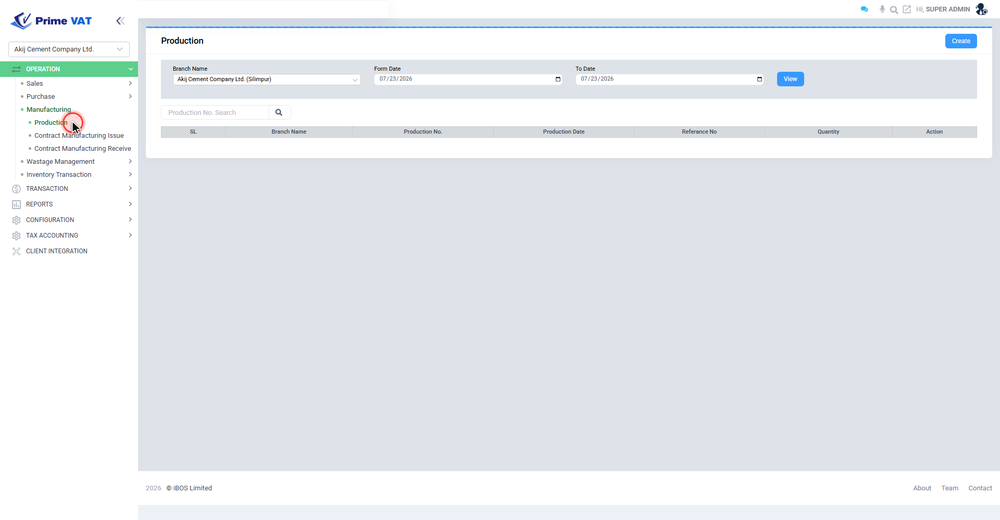

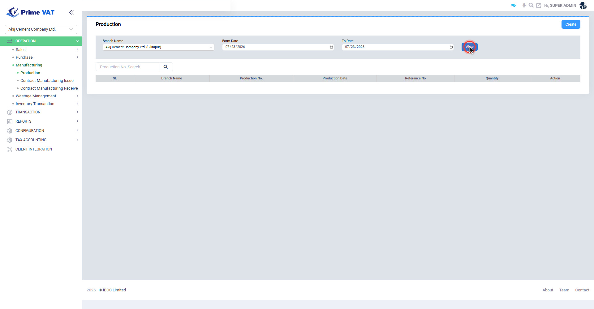

**Page purpose:** This page allows users to track and view production records for selected branches.

**Route:** `/operation/manufacturing/production`

<!-- manual-meta: {"module": "Operation", "page": "Production", "task": "Search Production Records", "action": "search", "roles": [], "route": "/operation/manufacturing/production", "screenshots": ["screenshots/operation/production.png", "screenshots/operation/production_show.png"], "keywords": ["manufacturing", "production report", "factory output"], "task_order": 1} -->
#### Task: Search Production Records

**Purpose:** To filter production records by branch and date range.

**Required roles:**
* No role restriction was identified

**Prerequisites:**
* None identified from the interface

**Steps:**
1. Navigate to Operation > Manufacturing > Production.
2. Select the 'Branch Name'.
3. Enter the 'Form Date' and 'To Date'.
4. Click the 'View' button.

**Fields and controls:**
* **Branch Name:** The branch where the production occurred.
* **Form Date:** Starting date filter.
* **To Date:** Ending date filter.
* **Production No. Search:** Direct search by production number.

**Expected result:** A list of production records matching the selected branch and date criteria will be displayed in the table.

**Warnings:**
* No specific warning was identified

**Search keywords:** manufacturing, production report, factory output

### Page: Purchase

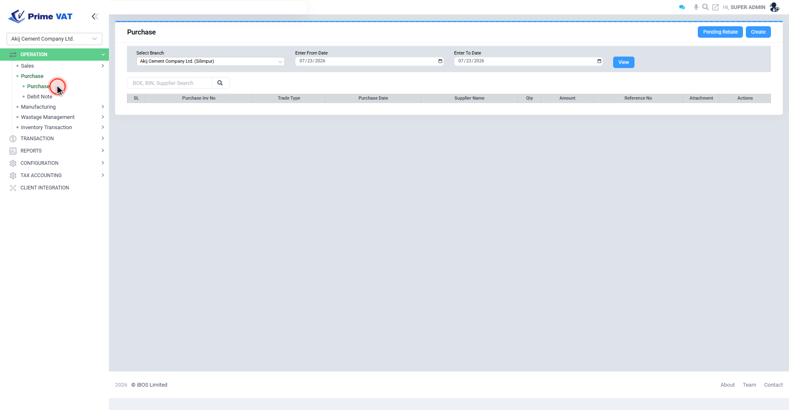

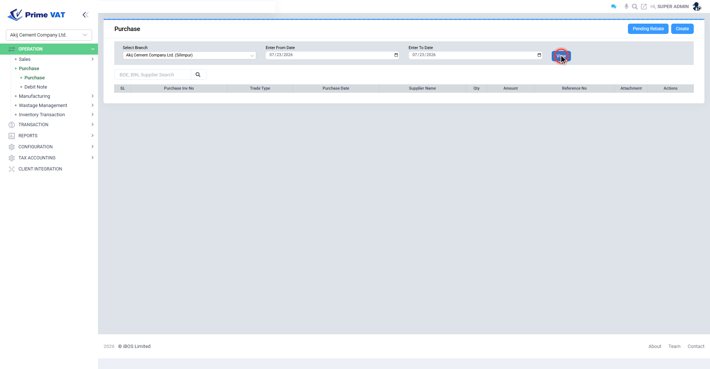

**Page purpose:** This page provides an overview of purchase transactions.

**Route:** `/operation/purchase/purchase`

<!-- manual-meta: {"module": "Operation", "page": "Purchase", "task": "Filter Purchase Invoices", "action": "filter", "roles": [], "route": "/operation/purchase/purchase", "screenshots": ["screenshots/operation/purchase.png", "screenshots/operation/purchase_show.png"], "keywords": ["purchase history", "vendor invoices", "procurement"], "task_order": 1} -->
#### Task: Filter Purchase Invoices

**Purpose:** To find specific purchase invoices for a specific branch and date range.

**Required roles:**
* No role restriction was identified

**Prerequisites:**
* None identified from the interface

**Steps:**
1. Navigate to Operation > Purchase > Purchase.
2. Select the 'Select Branch'.
3. Define the 'Enter From Date' and 'Enter To Date'.
4. Click the 'View' button.

**Fields and controls:**
* **Select Branch:** The branch context for the purchase.
* **Enter From Date:** Start date for filtering.
* **Enter To Date:** End date for filtering.
* **BOE, BIN, Supplier Search:** Search by Bill of Entry, Business Identification Number, or Supplier name.

**Expected result:** The table will populate with relevant purchase invoices based on the selected filters.

**Warnings:**
* No specific warning was identified

**Search keywords:** purchase history, vendor invoices, procurement

### Page: User Profile

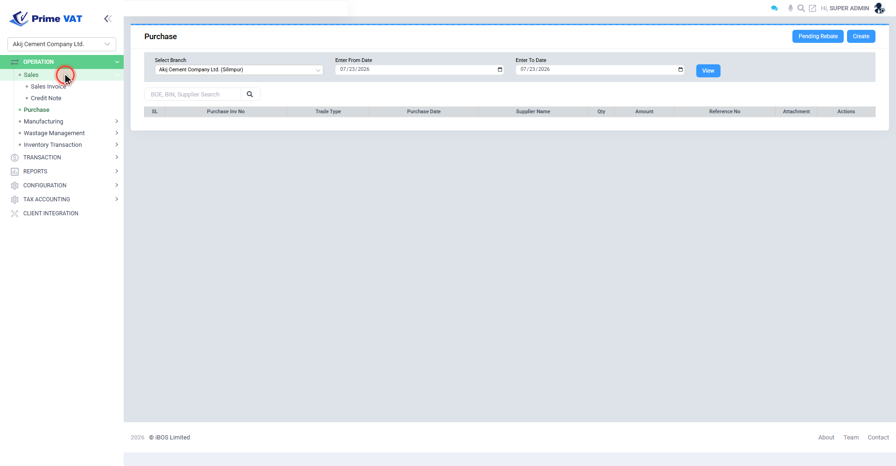

**Page purpose:** This page contains the controls and information shown in the captured interface.

**Route:** `https://devprimevat.ibos.io/operation/sales`

<!-- manual-meta: {"module": "Operation", "page": "User Profile", "task": "Use User Profile", "action": "view", "roles": [], "route": "https://devprimevat.ibos.io/operation/sales", "screenshots": ["screenshots/operation/sales.png"], "keywords": ["User Profile", "sales"], "task_order": 1} -->
#### Task: Use User Profile

**Purpose:** Review and use the visible page functions.

**Required roles:**
* No role restriction was identified

**Prerequisites:**
* None identified from the interface

**Steps:**
1. Open the User Profile page.
2. Review the visible controls, fields, and table columns.
3. Choose the required available action for your work.

**Fields and controls:**
* No specific fields were identified from the available evidence.

**Expected result:** The requested page information or form is displayed.

**Warnings:**
* Only actions visible in the captured interface are documented.

**Search keywords:** User Profile, sales

### Page: Sales Invoice

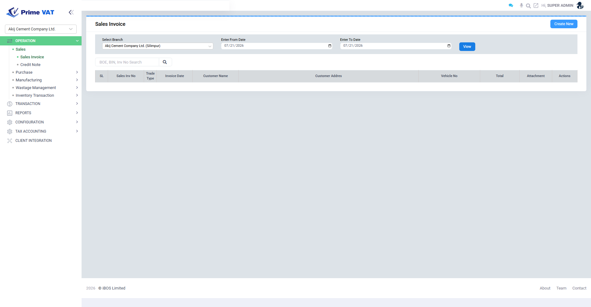

**Page purpose:** This page allows users to view and manage sales invoices.

**Route:** `/operation/sales/salesInvoice`

<!-- manual-meta: {"module": "Operation", "page": "Sales Invoice", "task": "Filter Sales Invoices", "action": "filter", "roles": [], "route": "/operation/sales/salesInvoice", "screenshots": ["screenshots/operation/sales_invoice.png", "screenshots/operation/sales_invoice_show.png"], "keywords": ["invoices", "sales history", "billing"], "task_order": 1} -->
#### Task: Filter Sales Invoices

**Purpose:** To locate sales invoices generated within a specific timeframe for a branch.

**Required roles:**
* No role restriction was identified

**Prerequisites:**
* None identified from the interface

**Steps:**
1. Navigate to Operation > Sales > Sales Invoice.
2. Select the 'Select Branch'.
3. Input the 'Enter From Date' and 'Enter To Date'.
4. Click the 'View' button.

**Fields and controls:**
* **Select Branch:** The branch where the sale occurred.
* **Enter From Date:** Start of the date range.
* **Enter To Date:** End of the date range.
* **BOE, BIN, Inv No Search:** Search field to refine by identifier.

**Expected result:** The table displays matching sales invoice records.

**Warnings:**
* No specific warning was identified

**Search keywords:** invoices, sales history, billing

### Page: Item Transfer-In

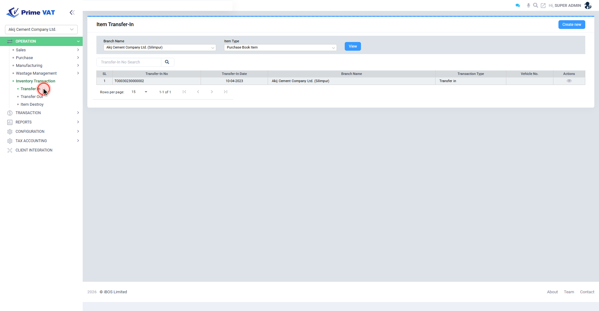

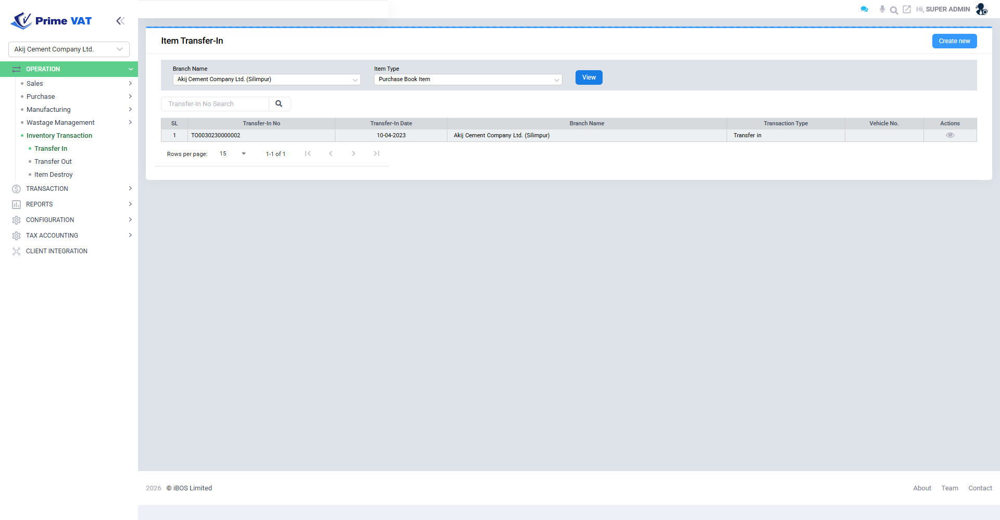

**Page purpose:** This page displays all incoming item transfers into a specific branch.

**Route:** `/operation/inventoryTransaction/transferIn`

<!-- manual-meta: {"module": "Operation", "page": "Item Transfer-In", "task": "View Incoming Transfers", "action": "view", "roles": [], "route": "/operation/inventoryTransaction/transferIn", "screenshots": ["screenshots/operation/transfer_in.png", "screenshots/operation/transfer_in_show.png"], "keywords": ["inbound inventory", "stock transfer", "logistics"], "task_order": 1} -->
#### Task: View Incoming Transfers

**Purpose:** To see incoming inventory movements.

**Required roles:**
* No role restriction was identified

**Prerequisites:**
* None identified from the interface

**Steps:**
1. Navigate to Operation > Inventory Transaction > Transfer In.
2. Select the 'Branch Name'.
3. Select the 'Item Type'.
4. Click 'View'.

**Fields and controls:**
* **Branch Name:** Target branch for the transfer.
* **Item Type:** Type of inventory being transferred.

**Expected result:** A table showing details of the transfer, such as date, transfer number, and origin branch.

**Warnings:**
* No specific warning was identified

**Search keywords:** inbound inventory, stock transfer, logistics

### Page: Transfer Out

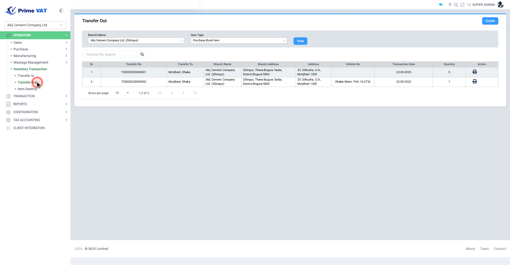

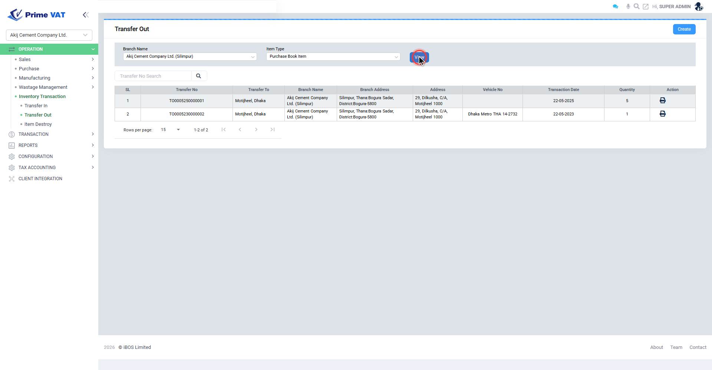

**Page purpose:** This page manages outbound inventory transfers between branches.

**Route:** `/operation/inventoryTransaction/transferOut`

<!-- manual-meta: {"module": "Operation", "page": "Transfer Out", "task": "View Outbound Transfers", "action": "view", "roles": [], "route": "/operation/inventoryTransaction/transferOut", "screenshots": ["screenshots/operation/transfer_out.png", "screenshots/operation/transfer_out_show.png"], "keywords": ["outbound stock", "shipment", "inventory movement"], "task_order": 1} -->
#### Task: View Outbound Transfers

**Purpose:** To monitor inventory sent to other locations.

**Required roles:**
* No role restriction was identified

**Prerequisites:**
* None identified from the interface

**Steps:**
1. Navigate to Operation > Inventory Transaction > Transfer Out.
2. Select the 'Branch Name'.
3. Select the 'Item Type'.
4. Click 'View'.

**Fields and controls:**
* **Branch Name:** The branch initiating the transfer.
* **Item Type:** Category of inventory to view.
* **Transfer No Search:** Search by transfer document number.

**Expected result:** A list of outbound transfer records is displayed.

**Warnings:**
* No specific warning was identified

**Search keywords:** outbound stock, shipment, inventory movement

### Page: Wastage In

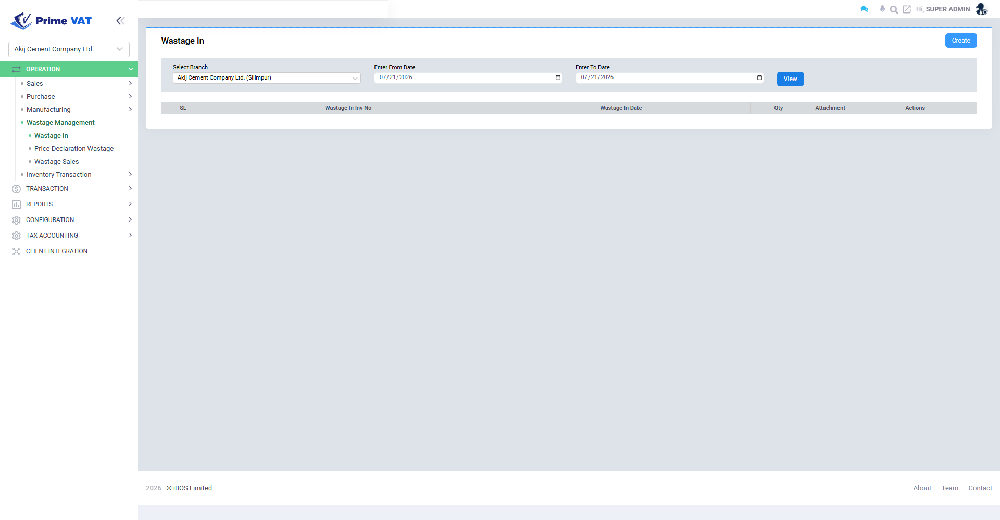

**Page purpose:** This page is used to manage and view incoming wastage records.

**Route:** `/operation/wastageManagement/wastageIn`

<!-- manual-meta: {"module": "Operation", "page": "Wastage In", "task": "List Wastage In Records", "action": "filter", "roles": [], "route": "/operation/wastageManagement/wastageIn", "screenshots": ["screenshots/operation/wastage_in.png", "screenshots/operation/wastage_in_show.png"], "keywords": ["scrap management", "wastage report", "inventory damage"], "task_order": 1} -->
#### Task: List Wastage In Records

**Purpose:** To retrieve and view records of incoming wastage within a date range.

**Required roles:**
* No role restriction was identified

**Prerequisites:**
* None identified from the interface

**Steps:**
1. Navigate to Operation > Wastage Management > Wastage In.
2. Select the 'Select Branch'.
3. Set the 'Enter From Date' and 'Enter To Date'.
4. Click 'View'.

**Fields and controls:**
* **Select Branch:** Branch where wastage was recorded.
* **Enter From Date:** Start date for reporting.
* **Enter To Date:** End date for reporting.

**Expected result:** The wastage records will appear in the result table.

**Warnings:**
* No specific warning was identified

**Search keywords:** scrap management, wastage report, inventory damage

### Page: User Profile

**Page purpose:** This page contains the controls and information shown in the captured interface.

**Route:** `https://devprimevat.ibos.io/operation/wastageManagement`

<!-- manual-meta: {"module": "Operation", "page": "User Profile", "task": "Use User Profile", "action": "view", "roles": [], "route": "https://devprimevat.ibos.io/operation/wastageManagement", "screenshots": ["screenshots/operation/wastage_management.png"], "keywords": ["User Profile", "wastage management"], "task_order": 1} -->
#### Task: Use User Profile

**Purpose:** Review and use the visible page functions.

**Required roles:**
* No role restriction was identified

**Prerequisites:**
* None identified from the interface

**Steps:**
1. Open the User Profile page.
2. Review the visible controls, fields, and table columns.
3. Choose the required available action for your work.

**Fields and controls:**
* No specific fields were identified from the available evidence.

**Expected result:** The requested page information or form is displayed.

**Warnings:**
* Only actions visible in the captured interface are documented.

**Search keywords:** User Profile, wastage management

### Page: Wastage Sales

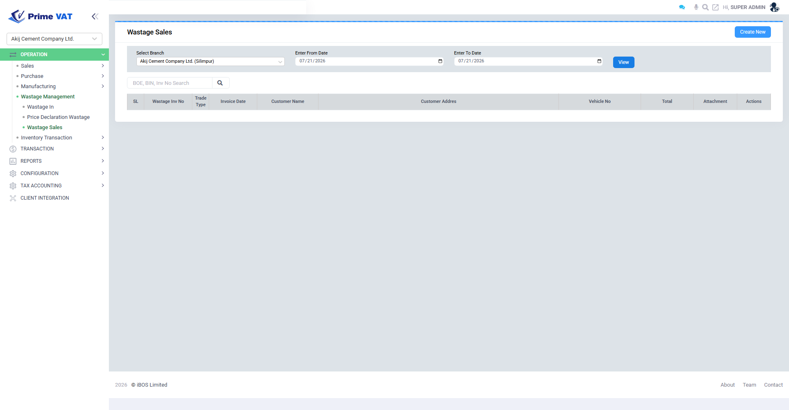

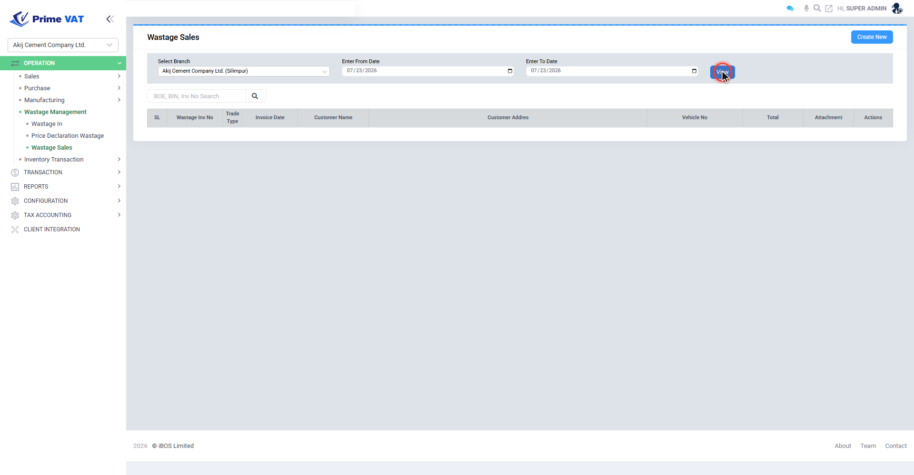

**Page purpose:** This page allows users to view, search, and manage records related to the sales of wastage items.

**Route:** `/operation/wastageManagement/wastageSalesInvoice`

<!-- manual-meta: {"module": "Operation", "page": "Wastage Sales", "task": "View wastage sales records", "action": "view", "roles": [], "route": "/operation/wastageManagement/wastageSalesInvoice", "screenshots": ["screenshots/operation/wastage_sales.png", "screenshots/operation/wastage_sales_show.png"], "keywords": ["wastage invoice", "sales history", "view wastage"], "task_order": 1} -->
#### Task: View wastage sales records

**Purpose:** To list and monitor existing wastage sales transactions within a specific branch and time frame.

**Required roles:**
* No role restriction was identified

**Prerequisites:**
* User must be logged in.
* Wastage sales records must exist for the selected branch and date range.

**Steps:**
1. Navigate to Operation > Wastage Management > Wastage Sales.
2. Select the desired branch from the 'Select Branch' dropdown.
3. Choose a start date in the 'Enter From Date' field.
4. Choose an end date in the 'Enter To Date' field.
5. Click the 'View' button.

**Fields and controls:**
* **Select Branch:** Dropdown to filter records by company branch.
* **Enter From Date:** Start date for the report range.
* **Enter To Date:** End date for the report range.

**Expected result:** A table populated with wastage sales records matching the search criteria.

**Warnings:**
* No specific warning was identified

**Search keywords:** wastage invoice, sales history, view wastage

<!-- manual-meta: {"module": "Operation", "page": "Wastage Sales", "task": "Search wastage sales", "action": "search", "roles": [], "route": "/operation/wastageManagement/wastageSalesInvoice", "screenshots": ["screenshots/operation/wastage_sales.png", "screenshots/operation/wastage_sales_show.png"], "keywords": ["find invoice", "search wastage", "filter records"], "task_order": 2} -->
#### Task: Search wastage sales

**Purpose:** To quickly locate specific wastage sales records using invoice or identifier details.

**Required roles:**
* No role restriction was identified

**Prerequisites:**
* User must be on the Wastage Sales page.

**Steps:**
1. Navigate to the search bar labeled 'BOE, BIN, Inv No Search'.
2. Enter the BOE (Bill of Export), BIN (Business Identification Number), or Invoice Number.
3. Click the search icon.

**Fields and controls:**
* **BOE, BIN, Inv No Search:** Input field to filter results by specific document numbers.

**Expected result:** The table displays only records corresponding to the entered search term.

**Warnings:**
* No specific warning was identified

**Search keywords:** find invoice, search wastage, filter records

## 4. Reports Module

### Page: Audit Report

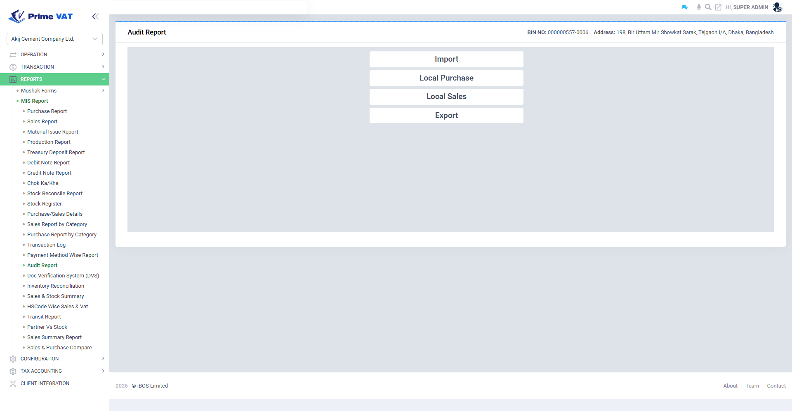

**Page purpose:** This page provides an interface to access and manage audit-related data reports, including import, local purchase, local sales, and export activities.

**Route:** `/reports/otherReports/auditReport`

<!-- manual-meta: {"module": "Reports", "page": "Audit Report", "task": "View Audit Report Options", "action": "view", "roles": [], "route": "/reports/otherReports/auditReport", "screenshots": ["screenshots/reports/audit_report.png"], "keywords": ["audit", "report", "import", "sales", "purchase"], "task_order": 1} -->
#### Task: View Audit Report Options

**Purpose:** To see available categories of audit reports.

**Required roles:**
* No role restriction was identified

**Prerequisites:**
* User must be logged in

**Steps:**
1. Navigate to the Reports menu.
2. Click on 'Audit Report'.

**Fields and controls:**
* No specific fields were identified from the available evidence.

**Expected result:** The screen displays buttons for 'Import', 'Local Purchase', 'Local Sales', and 'Export'.

**Warnings:**
* No specific warning was identified

**Search keywords:** audit, report, import, sales, purchase

### Page: Chok Ka/Kha Report

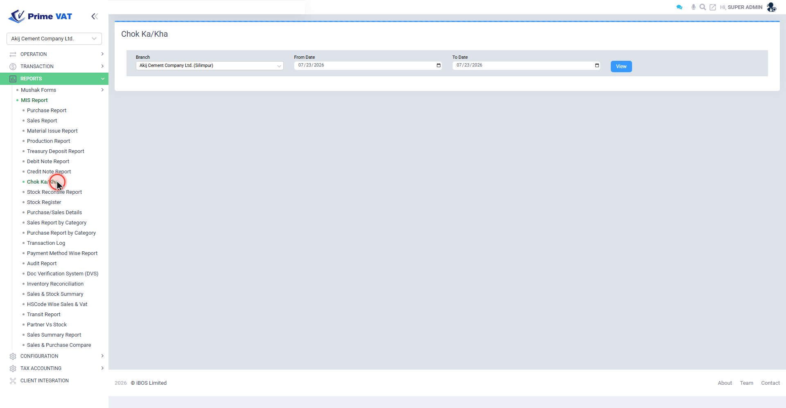

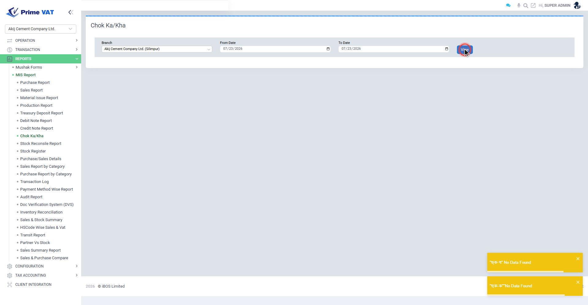

**Page purpose:** This page allows users to filter and view 'Chok Ka' and 'Chok Kha' report data by branch and date range.

**Route:** `/reports/otherReports/chok-ka/kha`

<!-- manual-meta: {"module": "Reports", "page": "Chok Ka/Kha Report", "task": "Filter Chok Ka/Kha Report", "action": "filter", "roles": [], "route": "/reports/otherReports/chok-ka/kha", "screenshots": ["screenshots/reports/chok_ka_kha.png", "screenshots/reports/chok_ka_kha_show.png"], "keywords": ["chok ka", "chok kha", "report", "filter"], "task_order": 1} -->
#### Task: Filter Chok Ka/Kha Report

**Purpose:** To retrieve report data for a specific branch and period.

**Required roles:**
* No role restriction was identified

**Prerequisites:**
* Data exists for the selected criteria

**Steps:**
1. Select the 'Branch'.
2. Select the 'From Date'.
3. Select the 'To Date'.
4. Click 'View'.

**Fields and controls:**
* **Branch:** The specific branch to filter data by.
* **From Date:** Start date for the report range.
* **To Date:** End date for the report range.

**Expected result:** The report data will be displayed or a 'No Data Found' message will appear if no records match the criteria.

**Warnings:**
* If no records match, the interface will display 'No Data Found' for the report types.

**Search keywords:** chok ka, chok kha, report, filter

### Page: Credit Note Report

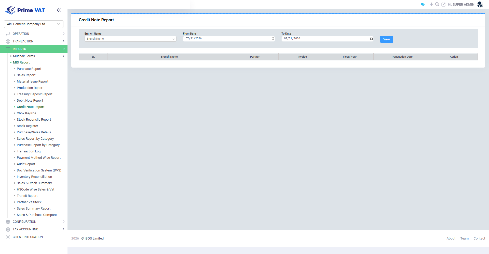

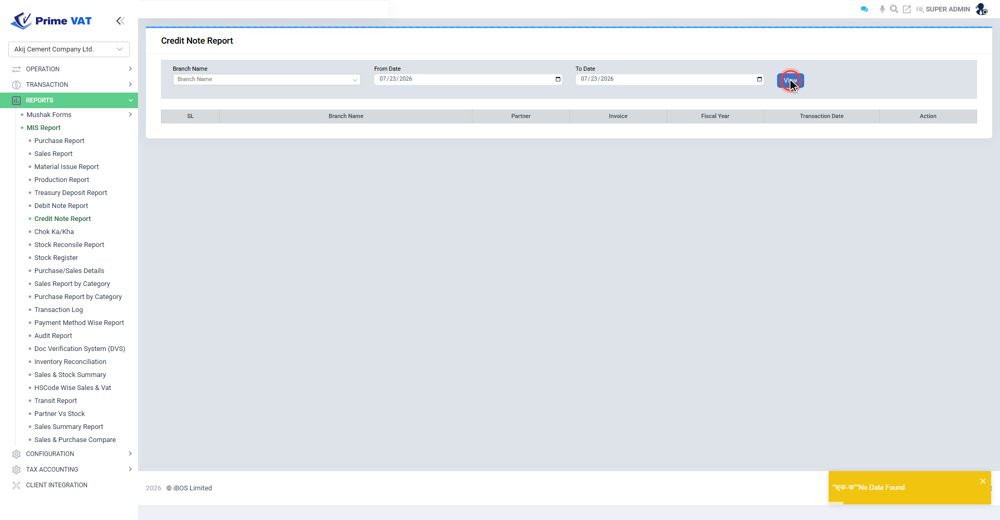

**Page purpose:** This page allows users to search for and view credit note records based on branch and date range.

**Route:** `/reports/otherReports/creditNoteReport`

<!-- manual-meta: {"module": "Reports", "page": "Credit Note Report", "task": "Search Credit Note Records", "action": "search", "roles": [], "route": "/reports/otherReports/creditNoteReport", "screenshots": ["screenshots/reports/credit_note_report.png", "screenshots/reports/credit_note_report_show.png"], "keywords": ["credit note", "report", "invoice"], "task_order": 1} -->
#### Task: Search Credit Note Records

**Purpose:** To generate a list of credit note transactions for audit or review.

**Required roles:**
* No role restriction was identified

**Prerequisites:**
* Authorized access to reports

**Steps:**
1. Select 'Branch Name' from the dropdown.
2. Select 'From Date'.
3. Select 'To Date'.
4. Click 'View'.

**Fields and controls:**
* **Branch Name:** The branch associated with the credit note.
* **From Date:** The start of the search period.
* **To Date:** The end of the search period.

**Expected result:** A table populated with SL, Branch Name, Partner, Invoice, Fiscal Year, and Transaction Date will appear.

**Warnings:**
* No specific warning was identified

**Search keywords:** credit note, report, invoice

### Page: Debit Note Report

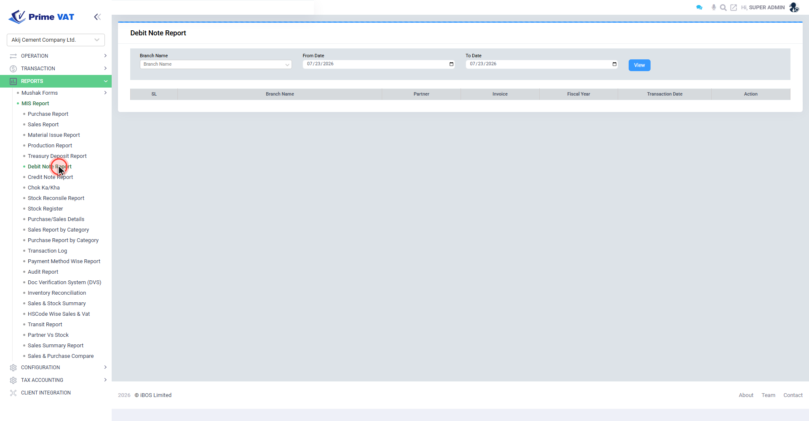

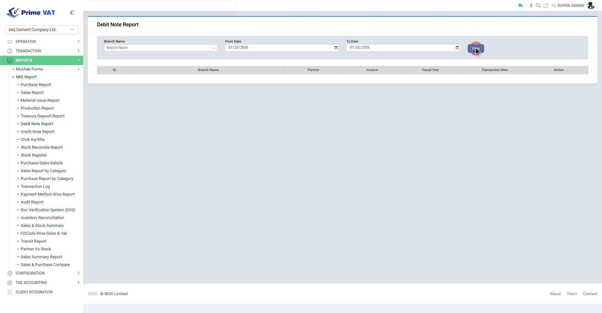

**Page purpose:** This page provides a search interface to list debit note transactions for specific branches and periods.

**Route:** `/reports/otherReports/debitNoteReport`

<!-- manual-meta: {"module": "Reports", "page": "Debit Note Report", "task": "View Debit Note Report", "action": "search", "roles": [], "route": "/reports/otherReports/debitNoteReport", "screenshots": ["screenshots/reports/debit_note_report.png", "screenshots/reports/debit_note_report_show.png"], "keywords": ["debit note", "report", "transaction"], "task_order": 1} -->
#### Task: View Debit Note Report

**Purpose:** To list debit note entries for a specified time frame.

**Required roles:**
* No role restriction was identified

**Prerequisites:**
* User is logged in

**Steps:**
1. Choose a 'Branch Name'.
2. Set the 'From Date' and 'To Date'.
3. Click 'View'.

**Fields and controls:**
* **Branch Name:** The branch to search.
* **From Date:** Start date for filtering records.
* **To Date:** End date for filtering records.

**Expected result:** Displays a table with debit note transaction details.

**Warnings:**
* No specific warning was identified

**Search keywords:** debit note, report, transaction

### Page: Document Verification System (DVS)

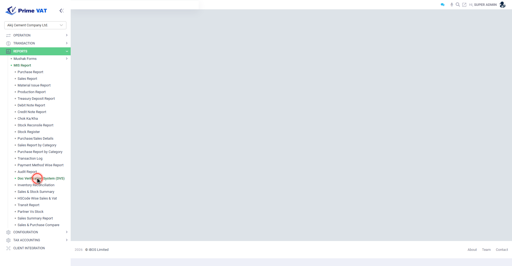

**Page purpose:** This page is used for the verification of documents.

**Route:** `/reports/otherReports/docVerificationSystem(DVS)`

<!-- manual-meta: {"module": "Reports", "page": "Document Verification System (DVS)", "task": "Verify Documents", "action": "view", "roles": [], "route": "/reports/otherReports/docVerificationSystem(DVS)", "screenshots": ["screenshots/reports/doc_verification_system_dvs.png"], "keywords": ["dvs", "verification", "document"], "task_order": 1} -->
#### Task: Verify Documents

**Purpose:** To access the document verification system interface.

**Required roles:**
* No role restriction was identified

**Prerequisites:**
* User has permission to access DVS

**Steps:**
1. Navigate to the Reports module.
2. Select 'Doc Verification System (DVS)'.

**Fields and controls:**
* No specific fields were identified from the available evidence.

**Expected result:** The DVS interface loads for document entry or searching.

**Warnings:**
* No specific warning was identified

**Search keywords:** dvs, verification, document

### Page: HSCode Wise Sales & Vat Report

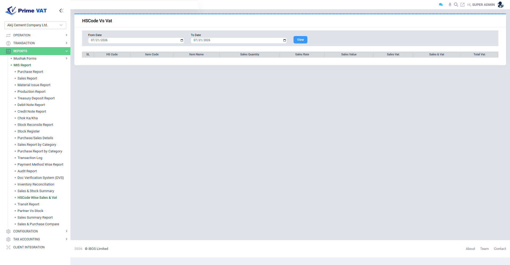

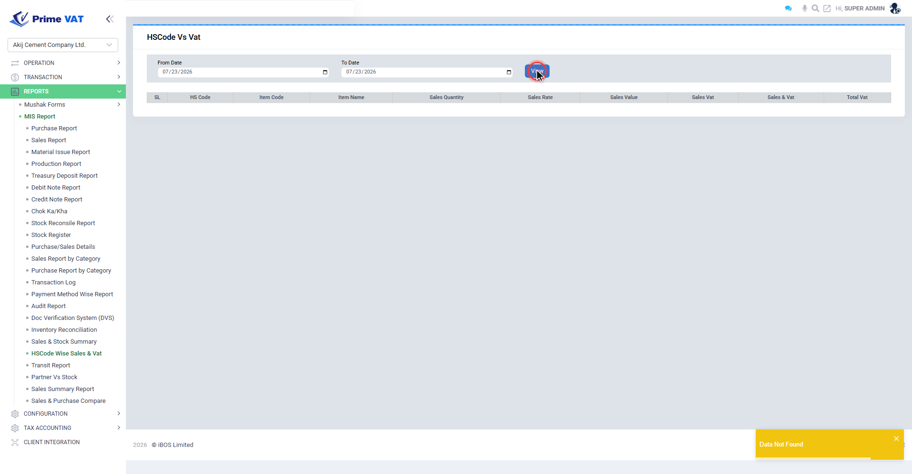

**Page purpose:** This page allows users to view sales and VAT information categorized by HS Code for a specific time range.

**Route:** `/reports/otherReports/hsCodeVatSummary`

<!-- manual-meta: {"module": "Reports", "page": "HSCode Wise Sales & Vat Report", "task": "Filter HSCode Sales Report", "action": "filter", "roles": [], "route": "/reports/otherReports/hsCodeVatSummary", "screenshots": ["screenshots/reports/hscode_wise_sales_vat.png", "screenshots/reports/hscode_wise_sales_vat_show.png"], "keywords": ["hscode", "vat", "sales", "report"], "task_order": 1} -->
#### Task: Filter HSCode Sales Report

**Purpose:** To generate a report showing sales quantity, value, and VAT per HS Code.

**Required roles:**
* No role restriction was identified

**Prerequisites:**
* Data exists for selected date range

**Steps:**
1. Select the 'From Date'.
2. Select the 'To Date'.
3. Click 'View'.

**Fields and controls:**
* **From Date:** Start date.
* **To Date:** End date.

**Expected result:** A table displaying columns including HS Code, Item Name, Sales Value, Sales VAT, and Total VAT.

**Warnings:**
* If no data is found, the system will display a notification message.

**Search keywords:** hscode, vat, sales, report

### Page: Inventory Reconciliation

**Page purpose:** This page facilitates the generation of inventory reports based on specific view types and dates.

**Route:** `/reports/otherReports/inventoryReport`

<!-- manual-meta: {"module": "Reports", "page": "Inventory Reconciliation", "task": "Generate Inventory Report", "action": "view", "roles": [], "route": "/reports/otherReports/inventoryReport", "screenshots": ["screenshots/reports/inventory_reconciliation.png"], "keywords": ["inventory", "reconciliation", "stock", "report"], "task_order": 1} -->
#### Task: Generate Inventory Report

**Purpose:** To compare or review inventory levels.

**Required roles:**
* No role restriction was identified

**Prerequisites:**
* System has data to reconcile

**Steps:**
1. Select 'View Type'.
2. Enter 'From Date'.
3. Enter 'To Date'.
4. Click 'View'.

**Fields and controls:**
* **View Type:** Determines the mode of the report output.
* **From Date:** Reporting start date.
* **To Date:** Reporting end date.

**Expected result:** The reconciliation report will be displayed in the interface.

**Warnings:**
* No specific warning was identified

**Search keywords:** inventory, reconciliation, stock, report

### Page: Material Issue Report

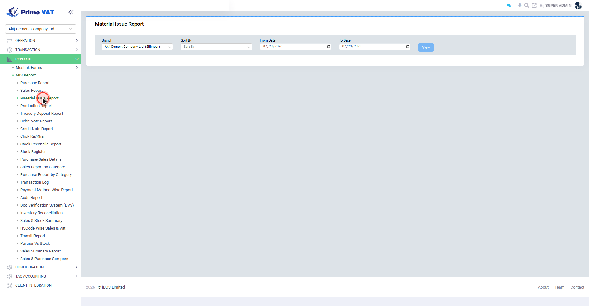

**Page purpose:** This page allows users to view reports detailing material issue transactions by branch and sorting criteria.

**Route:** `/reports/otherReports/materialIssueReport`

<!-- manual-meta: {"module": "Reports", "page": "Material Issue Report", "task": "View Material Issue Details", "action": "view", "roles": [], "route": "/reports/otherReports/materialIssueReport", "screenshots": ["screenshots/reports/material_issue_report.png"], "keywords": ["material", "issue", "stock", "report"], "task_order": 1} -->
#### Task: View Material Issue Details

**Purpose:** To track materials issued from inventory for specific dates.

**Required roles:**
* No role restriction was identified

**Prerequisites:**
* Valid branch selection

**Steps:**
1. Select the 'Branch'.
2. Select 'Sort By' criteria.
3. Select 'From Date'.
4. Select 'To Date'.
5. Click 'View'.

**Fields and controls:**
* **Branch:** Branch from which the material was issued.
* **Sort By:** Sorting preference for the report results.

**Expected result:** Displays a list of material issue records.

**Warnings:**
* No specific warning was identified

**Search keywords:** material, issue, stock, report

### Page: MIS Report

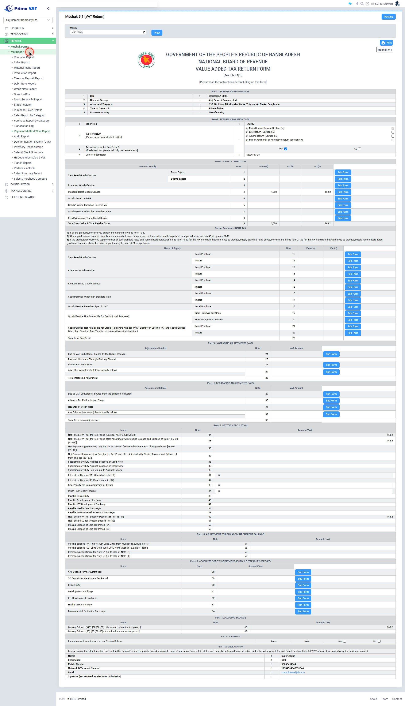

**Page purpose:** Central dashboard or list for accessing various Management Information System (MIS) reports.

**Route:** `/reports/otherReports`

<!-- manual-meta: {"module": "Reports", "page": "MIS Report", "task": "View MIS Reports", "action": "view", "roles": [], "route": "/reports/otherReports", "screenshots": ["screenshots/reports/mis_report.png"], "keywords": ["reports", "MIS", "dashboard"], "task_order": 1} -->
#### Task: View MIS Reports

**Purpose:** Access specific management reports from the system.

**Required roles:**
* No role restriction was identified

**Prerequisites:**
* Log in to the system
* Navigate to the Reports module

**Steps:**
1. Click on 'REPORTS' in the side menu
2. Select 'MIS Report' from the dropdown
3. Click on any report name (e.g., 'Purchase Report', 'Sales Report') to view its details

**Fields and controls:**
* No specific fields were identified from the available evidence.

**Expected result:** The selected report screen will open.

**Warnings:**
* No specific warning was identified

**Search keywords:** reports, MIS, dashboard

### Page: Mushak 4.3 (Price Declaration)

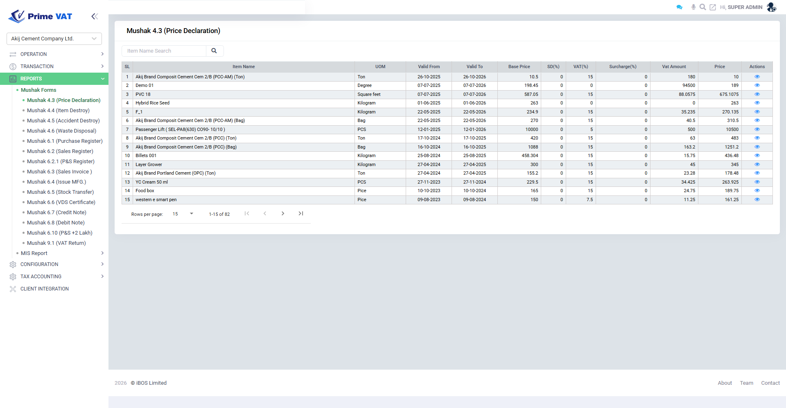

**Page purpose:** List of price declarations for items, including tax and price details.

**Route:** `/reports/mushakForms/mushak4.3`

<!-- manual-meta: {"module": "Reports", "page": "Mushak 4.3 (Price Declaration)", "task": "Search Items", "action": "search", "roles": [], "route": "/reports/mushakForms/mushak4.3", "screenshots": ["screenshots/reports/mushak_4_3_price_declaration.png"], "keywords": ["price declaration", "mushak 4.3"], "task_order": 1} -->
#### Task: Search Items

**Purpose:** Find specific item price declarations.

**Required roles:**
* No role restriction was identified

**Prerequisites:**
* None identified from the interface

**Steps:**
1. Type the item name into the 'Item Name Search' field
2. Observe the filtered result in the table

**Fields and controls:**
* **Item Name Search:** Filter by item name.

**Expected result:** The table updates to show matching price declarations.

**Warnings:**
* No specific warning was identified

**Search keywords:** price declaration, mushak 4.3

<!-- manual-meta: {"module": "Reports", "page": "Mushak 4.3 (Price Declaration)", "task": "Adjust Pagination", "action": "configure", "roles": [], "route": "/reports/mushakForms/mushak4.3", "screenshots": ["screenshots/reports/mushak_4_3_price_declaration.png"], "keywords": ["pagination", "view"], "task_order": 2} -->
#### Task: Adjust Pagination

**Purpose:** Control how many records are shown per page.

**Required roles:**
* No role restriction was identified

**Prerequisites:**
* None identified from the interface

**Steps:**
1. Click on the 'rows per page' dropdown
2. Select the desired number of rows (e.g., 15, 25, 50)

**Fields and controls:**
* **rows per page:** Dropdown to select display count.

**Expected result:** The table refreshes to display the selected number of rows.

**Warnings:**
* No specific warning was identified

**Search keywords:** pagination, view

### Page: Mushak 4.4 (Item Destroy)

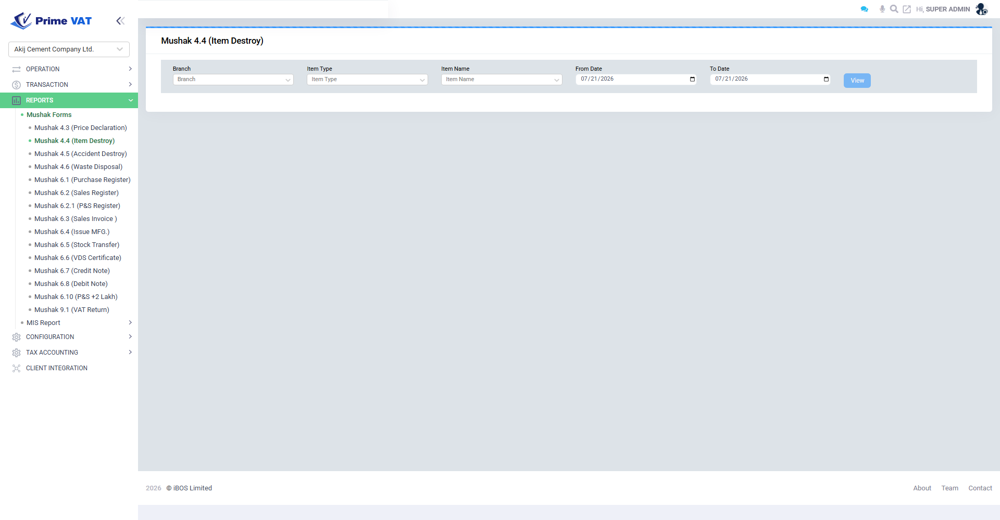

**Page purpose:** Report screen for destroyed items.

**Route:** `/reports/mushakForms/mushak4.4`

<!-- manual-meta: {"module": "Reports", "page": "Mushak 4.4 (Item Destroy)", "task": "Filter Destroyed Item Records", "action": "filter", "roles": [], "route": "/reports/mushakForms/mushak4.4", "screenshots": ["screenshots/reports/mushak_4_4_item_destroy.png"], "keywords": ["item destroy", "mushak 4.4"], "task_order": 1} -->
#### Task: Filter Destroyed Item Records

**Purpose:** View item destruction records for a specific date range or category.

**Required roles:**
* No role restriction was identified

**Prerequisites:**
* None identified from the interface

**Steps:**
1. Select Branch, Item Type, and Item Name from the respective dropdowns
2. Set the 'From Date' and 'To Date'
3. Click the 'View' button

**Fields and controls:**
* **Branch:** Select the branch.
* **Item Type:** Select the item category.
* **Item Name:** Select the specific item.
* **From Date:** Filter start date.
* **To Date:** Filter end date.

**Expected result:** The system displays the records matching the chosen filters.

**Warnings:**
* No specific warning was identified

**Search keywords:** item destroy, mushak 4.4

### Page: Mushak 4.5 (Accident Destroy)

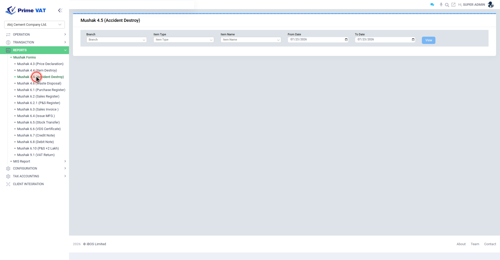

**Page purpose:** Report screen for items destroyed due to accidents.

**Route:** `/reports/mushakForms/mushak4.5`

<!-- manual-meta: {"module": "Reports", "page": "Mushak 4.5 (Accident Destroy)", "task": "Filter Accident Destroy Records", "action": "filter", "roles": [], "route": "/reports/mushakForms/mushak4.5", "screenshots": ["screenshots/reports/mushak_4_5_accident_destroy.png"], "keywords": ["accident destroy", "mushak 4.5"], "task_order": 1} -->
#### Task: Filter Accident Destroy Records

**Purpose:** Search for specific accident destruction reports.

**Required roles:**
* No role restriction was identified

**Prerequisites:**
* None identified from the interface

**Steps:**
1. Input criteria in Branch, Item Type, and Item Name fields
2. Set the date range using 'From Date' and 'To Date'
3. Click the 'View' button

**Fields and controls:**
* **Branch:** Select a branch.
* **Item Type:** Select item type.
* **Item Name:** Select an item.
* **From Date:** Start date for report.
* **To Date:** End date for report.

**Expected result:** The system populates results based on your criteria.

**Warnings:**
* No specific warning was identified

**Search keywords:** accident destroy, mushak 4.5

### Page: Mushak 4.6 (Waste Disposal)

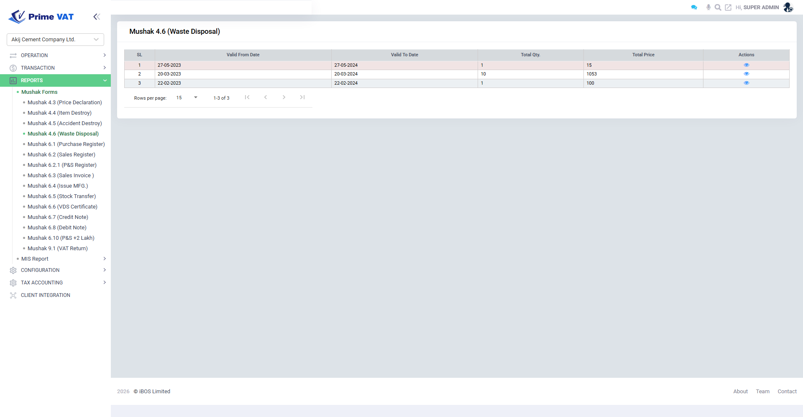

**Page purpose:** List of waste disposal records with quantities and dates.

**Route:** `/reports/mushakForms/mushak4.6`

<!-- manual-meta: {"module": "Reports", "page": "Mushak 4.6 (Waste Disposal)", "task": "View Waste Disposal History", "action": "view", "roles": [], "route": "/reports/mushakForms/mushak4.6", "screenshots": ["screenshots/reports/mushak_4_6_waste_disposal.png"], "keywords": ["waste disposal", "mushak 4.6"], "task_order": 1} -->
#### Task: View Waste Disposal History

**Purpose:** Review historical waste disposal entries.

**Required roles:**
* No role restriction was identified

**Prerequisites:**
* None identified from the interface

**Steps:**
1. Open the page to load the default table of waste disposal records
2. Use the pagination dropdown to adjust how many rows appear

**Fields and controls:**
* **rows per page:** Adjust list size.

**Expected result:** The disposal table displays the requested number of entries.

**Warnings:**
* No specific warning was identified

**Search keywords:** waste disposal, mushak 4.6

### Page: Mushak 6.10 (P&S +2 Lakh)

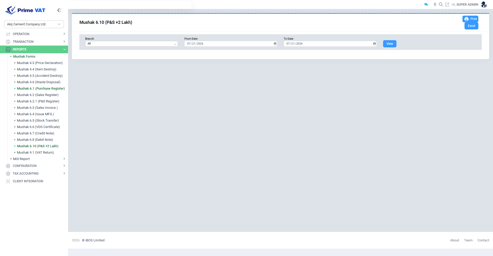

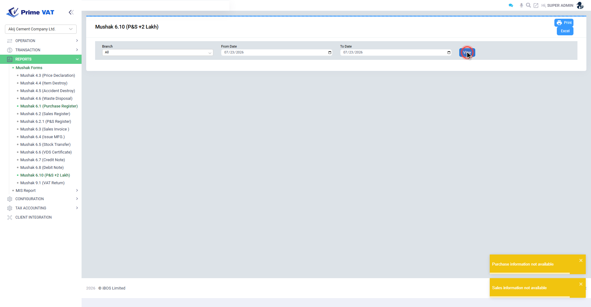

**Page purpose:** Report of Purchase and Sales records exceeding 2 Lakh.

**Route:** `/reports/mushakForms/mushak6.10`

<!-- manual-meta: {"module": "Reports", "page": "Mushak 6.10 (P&S +2 Lakh)", "task": "Generate P&S +2 Lakh Report", "action": "view", "roles": [], "route": "/reports/mushakForms/mushak6.10", "screenshots": ["screenshots/reports/mushak_6_10_p_s_2_lakh.png", "screenshots/reports/mushak_6_10_p_s_2_lakh_show.png"], "keywords": ["p&s 2 lakh", "mushak 6.10"], "task_order": 1} -->
#### Task: Generate P&S +2 Lakh Report

**Purpose:** View transactional data for values over 2 Lakh.

**Required roles:**
* No role restriction was identified

**Prerequisites:**
* None identified from the interface

**Steps:**
1. Select the 'Branch' from the dropdown
2. Select the 'From Date' and 'To Date'
3. Click the 'View' button

**Fields and controls:**
* **Branch:** Select the business unit.
* **From Date:** Filter starting date.
* **To Date:** Filter ending date.

**Expected result:** Report data is loaded or a 'not available' message is displayed.

**Warnings:**
* If the report is empty, the system may show a 'Purchase/Sales information not available' alert.

**Search keywords:** p&s 2 lakh, mushak 6.10

<!-- manual-meta: {"module": "Reports", "page": "Mushak 6.10 (P&S +2 Lakh)", "task": "Export Report to Excel", "action": "export", "roles": [], "route": "/reports/mushakForms/mushak6.10", "screenshots": ["screenshots/reports/mushak_6_10_p_s_2_lakh.png", "screenshots/reports/mushak_6_10_p_s_2_lakh_show.png"], "keywords": ["export", "excel", "report"], "task_order": 2} -->
#### Task: Export Report to Excel

**Purpose:** Download the generated report in Excel format.

**Required roles:**
* No role restriction was identified

**Prerequisites:**
* Report data must be generated

**Steps:**
1. Click the 'Excel' button at the top right

**Fields and controls:**
* No specific fields were identified from the available evidence.

**Expected result:** An Excel file will be downloaded to your device.

**Warnings:**
* No specific warning was identified

**Search keywords:** export, excel, report

### Page: Mushak 6.1 (Purchase Register)

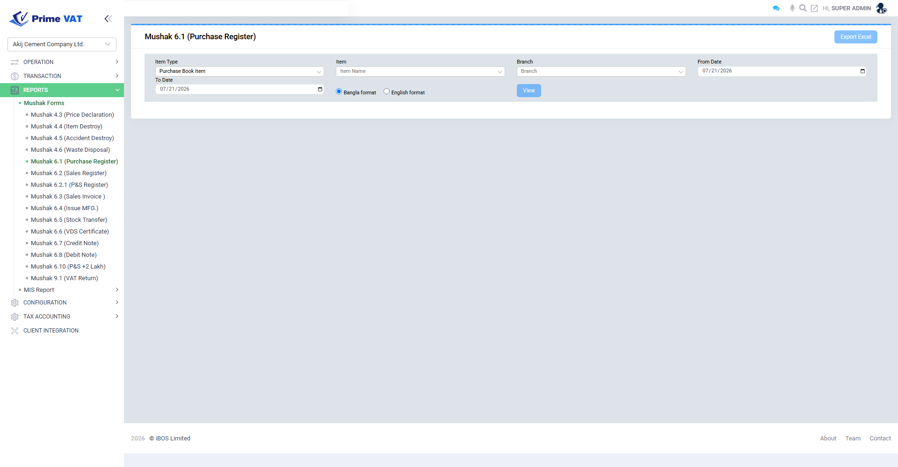

**Page purpose:** Comprehensive register for all purchase transactions.

**Route:** `/reports/mushakForms/mushak6.1`

<!-- manual-meta: {"module": "Reports", "page": "Mushak 6.1 (Purchase Register)", "task": "View Purchase Register", "action": "view", "roles": [], "route": "/reports/mushakForms/mushak6.1", "screenshots": ["screenshots/reports/mushak_6_1_purchase_register.png"], "keywords": ["purchase register", "mushak 6.1"], "task_order": 1} -->
#### Task: View Purchase Register

**Purpose:** Examine purchase records.

**Required roles:**
* No role restriction was identified

**Prerequisites:**
* None identified from the interface

**Steps:**
1. Select 'Item Type', 'Item', and 'Branch' from dropdowns
2. Select the 'From Date' and 'To Date'
3. Choose a display format (Bangla or English)
4. Click 'View'

**Fields and controls:**
* **Item Type:** Type of item purchased.
* **Item:** Specific item name.
* **Branch:** Relevant branch.
* **Bangla format / English format:** Select language output.

**Expected result:** The purchase register will be displayed based on the filters.

**Warnings:**
* No specific warning was identified

**Search keywords:** purchase register, mushak 6.1

### Page: Mushak 6.2.1 (P&S Register)

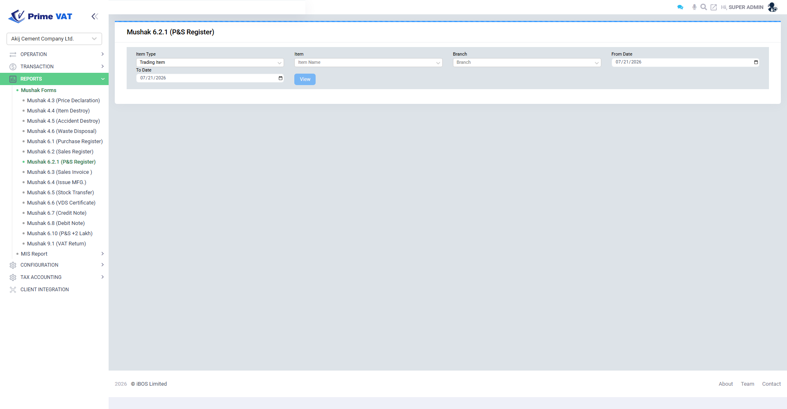

**Page purpose:** Combined register for Purchase and Sales transactions.

**Route:** `/reports/mushakForms/mushak6-2-1`

<!-- manual-meta: {"module": "Reports", "page": "Mushak 6.2.1 (P&S Register)", "task": "Filter P&S Register", "action": "filter", "roles": [], "route": "/reports/mushakForms/mushak6-2-1", "screenshots": ["screenshots/reports/mushak_6_2_1_p_s_register.png"], "keywords": ["p&s register", "mushak 6.2.1"], "task_order": 1} -->
#### Task: Filter P&S Register

**Purpose:** Search for specific purchase and sales register data.

**Required roles:**
* No role restriction was identified

**Prerequisites:**
* None identified from the interface

**Steps:**
1. Select Item Type, Item, and Branch
2. Set the 'From Date' and 'To Date'
3. Click 'View'

**Fields and controls:**
* **Item Type:** Category for filtering.
* **Item Name:** Specific product.
* **Branch:** Filter by branch.
* **From Date:** Filter period start.
* **To Date:** Filter period end.

**Expected result:** The screen displays the filtered register records.

**Warnings:**
* No specific warning was identified

**Search keywords:** p&s register, mushak 6.2.1

### Page: Mushak 6.2 (Sales Register)

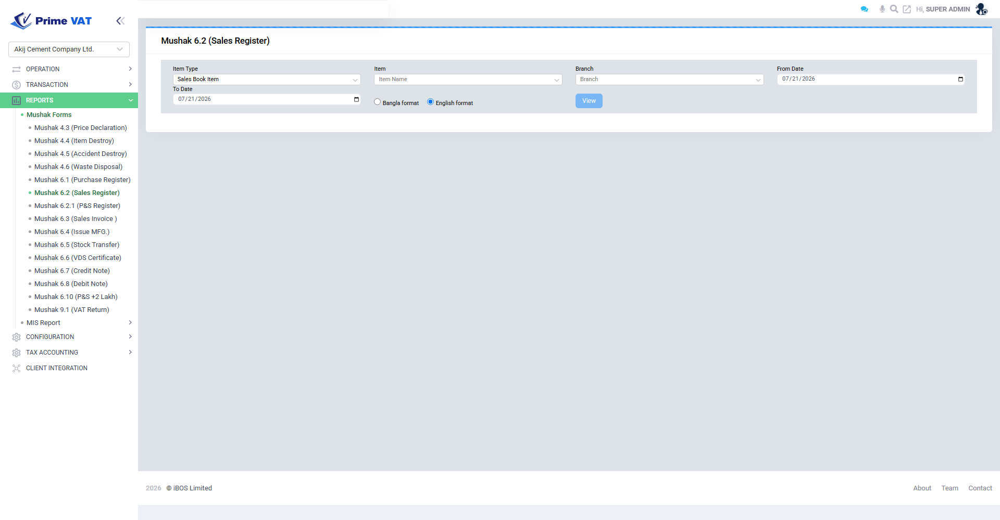

**Page purpose:** Used to view the sales register for specific items, branches, and date ranges.

**Route:** `/reports/mushakForms/mushak6.2`

<!-- manual-meta: {"module": "Reports", "page": "Mushak 6.2 (Sales Register)", "task": "Generate Sales Register report", "action": "view", "roles": [], "route": "/reports/mushakForms/mushak6.2", "screenshots": ["screenshots/reports/mushak_6_2_sales_register.png"], "keywords": ["sales register", "Mushak 6.2"], "task_order": 1} -->
#### Task: Generate Sales Register report

**Purpose:** To view a summary of sales transactions for a chosen period and filter settings.

**Required roles:**
* No role restriction was identified

**Prerequisites:**
* User has access to the Reports module

**Steps:**
1. Navigate to Reports > Mushak Forms > Mushak 6.2 (Sales Register)
2. Select Item Type and Item from the dropdowns
3. Select the Branch
4. Pick the From Date and To Date using the date picker
5. Select either 'Bangla format' or 'English format'
6. Click the 'View' button

**Fields and controls:**
* **Item Type:** Category of items to include in the report.
* **Item:** Specific item name.
* **Branch:** Organizational branch for the report.
* **From Date:** Start date for the report period.
* **To Date:** End date for the report period.
* **Format radio buttons:** Select between Bangla or English language format.

**Expected result:** The sales register report is displayed based on the selected criteria.

**Warnings:**
* No specific warning was identified

**Search keywords:** sales register, Mushak 6.2

### Page: Mushak 6.3 (Sales Invoice)

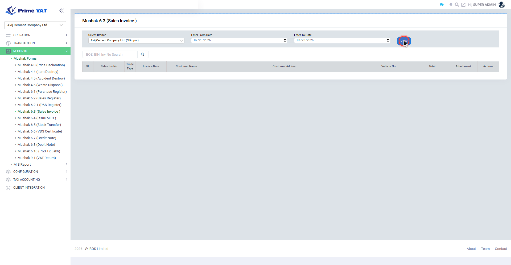

**Page purpose:** Used to search and view sales invoices.

**Route:** `/reports/mushakForms/mushak6.3`

<!-- manual-meta: {"module": "Reports", "page": "Mushak 6.3 (Sales Invoice)", "task": "Search for Sales Invoices", "action": "search", "roles": [], "route": "/reports/mushakForms/mushak6.3", "screenshots": ["screenshots/reports/mushak_6_3_sales_invoice.png", "screenshots/reports/mushak_6_3_sales_invoice_show.png"], "keywords": ["sales invoice", "search invoice"], "task_order": 1} -->
#### Task: Search for Sales Invoices

**Purpose:** To quickly locate a specific sales invoice using identifiers.

**Required roles:**
* No role restriction was identified

**Prerequisites:**
* Invoices must exist for the selected branch

**Steps:**
1. Navigate to Reports > Mushak Forms > Mushak 6.3 (Sales Invoice)
2. Select the Branch
3. Enter the BOE, BIN, or Invoice Number in the search field
4. Click the search icon

**Fields and controls:**
* **Select Branch:** The branch to pull invoices from.
* **Enter From Date:** Start date of the search range.
* **Enter To Date:** End date of the search range.
* **BOE, BIN, Inv No Search:** Input field for invoice, bill of entry, or tax ID search.

**Expected result:** Invoices matching the criteria are listed in the table.

**Warnings:**
* No specific warning was identified

**Search keywords:** sales invoice, search invoice

### Page: Mushak 6.4 (Issue MFG.)

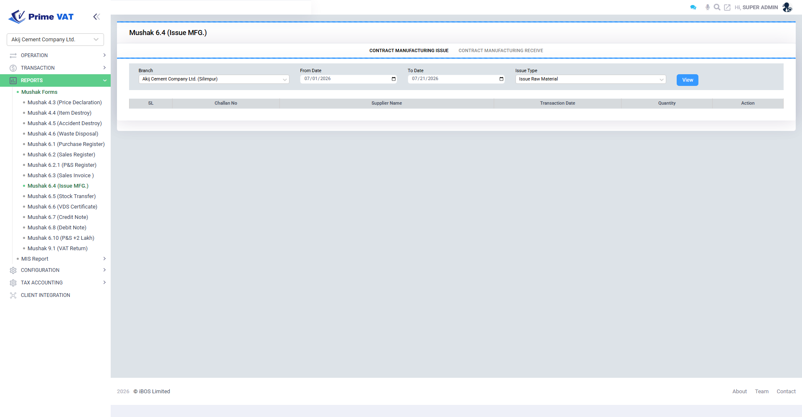

**Page purpose:** Used to monitor contract manufacturing issue and receive transactions.

**Route:** `/reports/mushakForms/mushak6.4`

<!-- manual-meta: {"module": "Reports", "page": "Mushak 6.4 (Issue MFG.)", "task": "View Contract Manufacturing Reports", "action": "view", "roles": [], "route": "/reports/mushakForms/mushak6.4", "screenshots": ["screenshots/reports/mushak_6_4_issue_mfg.png", "screenshots/reports/mushak_6_4_issue_mfg_show.png"], "keywords": ["issue mfg", "contract manufacturing"], "task_order": 1} -->
#### Task: View Contract Manufacturing Reports

**Purpose:** To track raw materials issued or received for contract manufacturing.

**Required roles:**
* No role restriction was identified

**Prerequisites:**
* User has access to Reports module

**Steps:**
1. Navigate to Reports > Mushak Forms > Mushak 6.4 (Issue MFG.)
2. Select between 'CONTRACT MANUFACTURING ISSUE' or 'CONTRACT MANUFACTURING RECEIVE' tabs
3. Select the Branch
4. Set the date range
5. Select the Issue Type
6. Click the 'View' button

**Fields and controls:**
* **Branch:** The branch to view.
* **From Date:** Start date.
* **To Date:** End date.
* **Issue Type:** The category of issued materials.

**Expected result:** A table showing challans, suppliers, and quantities appears.

**Warnings:**
* No specific warning was identified

**Search keywords:** issue mfg, contract manufacturing

### Page: Mushak 6.5 (Stock Transfer)

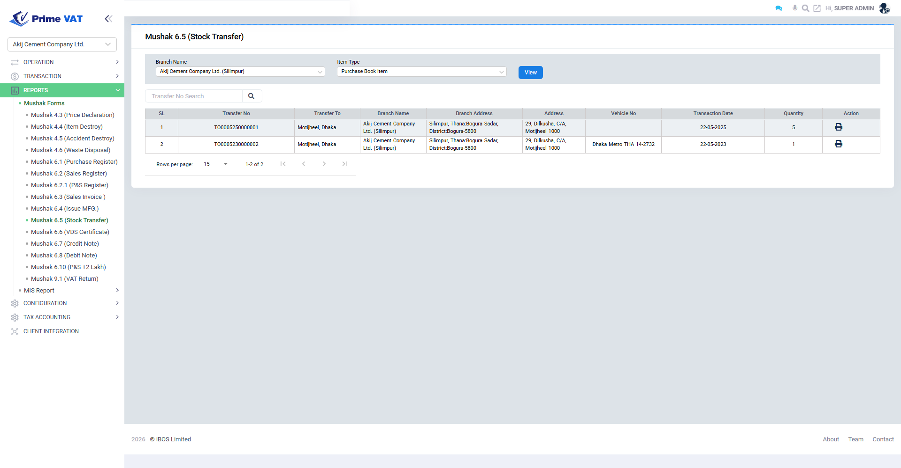

**Page purpose:** Used to view records of stock transfers between branches.

**Route:** `/reports/mushakForms/mushak6.5`

<!-- manual-meta: {"module": "Reports", "page": "Mushak 6.5 (Stock Transfer)", "task": "View Stock Transfer list", "action": "view", "roles": [], "route": "/reports/mushakForms/mushak6.5", "screenshots": ["screenshots/reports/mushak_6_5_stock_transfer.png", "screenshots/reports/mushak_6_5_stock_transfer_show.png"], "keywords": ["stock transfer", "transfer history"], "task_order": 1} -->
#### Task: View Stock Transfer list

**Purpose:** To verify the history of stock transferred from a selected branch.

**Required roles:**
* No role restriction was identified

**Prerequisites:**
* Transfers must have been performed

**Steps:**
1. Navigate to Reports > Mushak Forms > Mushak 6.5 (Stock Transfer)
2. Select Branch Name
3. Select Item Type
4. Click 'View'

**Fields and controls:**
* **Branch Name:** Originating branch of the transfer.
* **Item Type:** The type of items transferred.

**Expected result:** A list of transfers with details like transfer number, destination, and vehicle number is displayed.

**Warnings:**
* No specific warning was identified

**Search keywords:** stock transfer, transfer history

### Page: Mushak 6.6 (VDS Certificate)

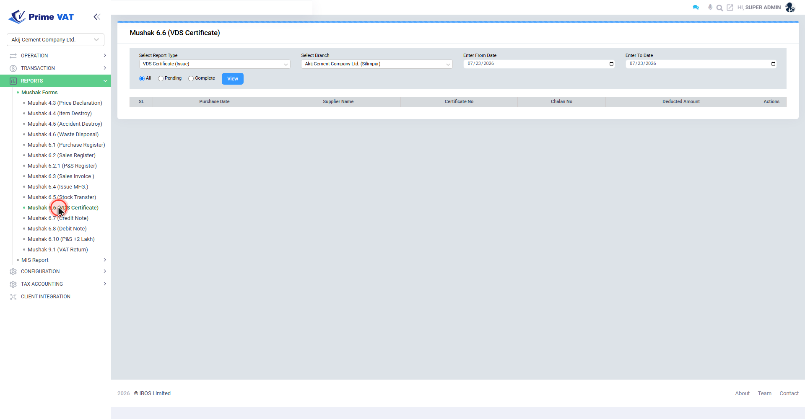

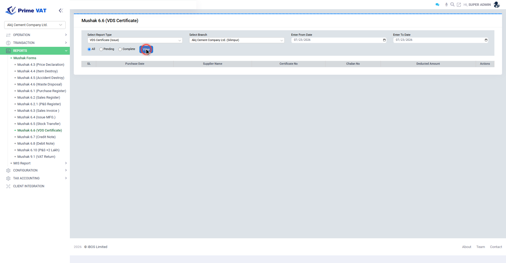

**Page purpose:** Used to track and issue VDS certificates.

**Route:** `/reports/mushakForms/mushak6.6`

<!-- manual-meta: {"module": "Reports", "page": "Mushak 6.6 (VDS Certificate)", "task": "Filter VDS Certificates", "action": "filter", "roles": [], "route": "/reports/mushakForms/mushak6.6", "screenshots": ["screenshots/reports/mushak_6_6_vds_certificate.png", "screenshots/reports/mushak_6_6_vds_certificate_show.png"], "keywords": ["vds", "certificate", "tax deduction"], "task_order": 1} -->
#### Task: Filter VDS Certificates

**Purpose:** To list VDS certificates based on their status.

**Required roles:**
* No role restriction was identified

**Prerequisites:**
* User has access to Reports module

**Steps:**
1. Navigate to Reports > Mushak Forms > Mushak 6.6 (VDS Certificate)
2. Select the Report Type
3. Select the Branch
4. Select a status (All, Pending, or Complete)
5. Click 'View'

**Fields and controls:**
* **Select Report Type:** The specific certificate report type.
* **Select Branch:** Branch to query.
* **Status radio buttons:** Filters for certificate completion status.

**Expected result:** The report table is updated to show certificates matching the selected status.

**Warnings:**
* No specific warning was identified

**Search keywords:** vds, certificate, tax deduction

### Page: Mushak 6.7 (Credit Note)

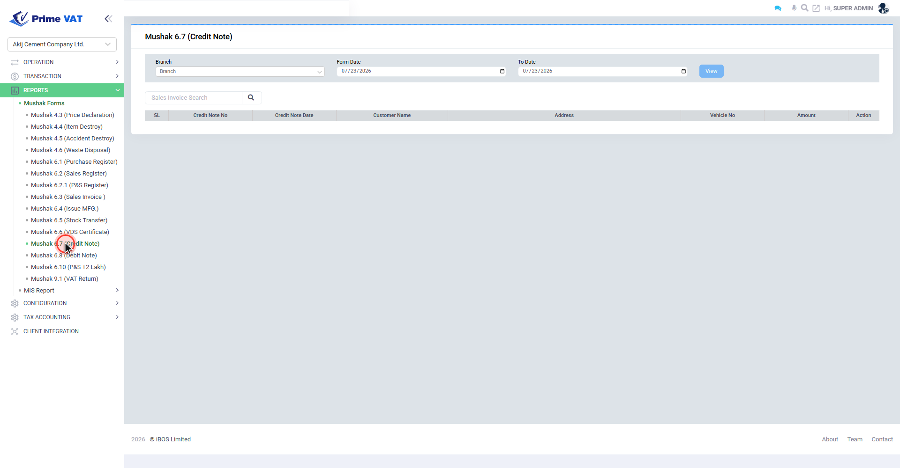

**Page purpose:** Used to view sales credit notes.

**Route:** `/reports/mushakForms/mushak6.7`

<!-- manual-meta: {"module": "Reports", "page": "Mushak 6.7 (Credit Note)", "task": "View Credit Notes", "action": "view", "roles": [], "route": "/reports/mushakForms/mushak6.7", "screenshots": ["screenshots/reports/mushak_6_7_credit_note.png"], "keywords": ["credit note", "sales return"], "task_order": 1} -->
#### Task: View Credit Notes

**Purpose:** To list generated credit notes for customer sales.

**Required roles:**
* No role restriction was identified

**Prerequisites:**
* Sales invoices must exist

**Steps:**
1. Navigate to Reports > Mushak Forms > Mushak 6.7 (Credit Note)
2. Select the Branch
3. Set the Date range
4. Click 'View'

**Fields and controls:**
* **Branch:** Selected business branch.
* **Form Date:** Start date for credit notes.
* **To Date:** End date for credit notes.

**Expected result:** Table displays existing credit notes.

**Warnings:**
* No specific warning was identified

**Search keywords:** credit note, sales return

### Page: Mushak 6.8 (Debit Note)

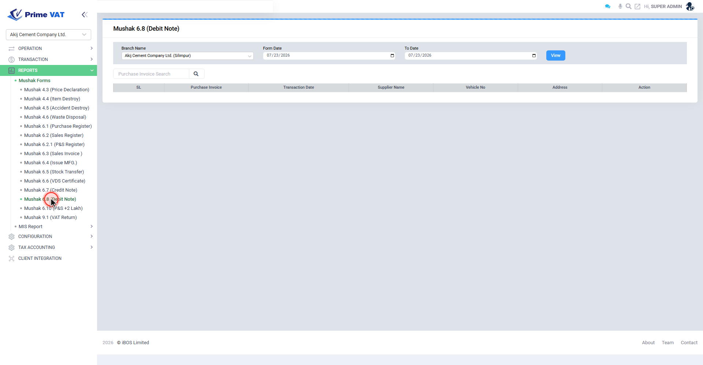

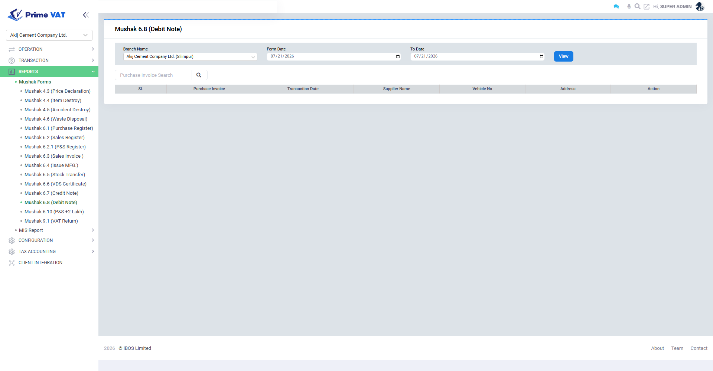

**Page purpose:** Used to view purchase debit notes.

**Route:** `/reports/mushakForms/mushak6.8`

<!-- manual-meta: {"module": "Reports", "page": "Mushak 6.8 (Debit Note)", "task": "View Debit Notes", "action": "view", "roles": [], "route": "/reports/mushakForms/mushak6.8", "screenshots": ["screenshots/reports/mushak_6_8_debit_note.png", "screenshots/reports/mushak_6_8_debit_note_show.png"], "keywords": ["debit note", "purchase return"], "task_order": 1} -->
#### Task: View Debit Notes

**Purpose:** To list generated debit notes for purchase invoices.

**Required roles:**
* No role restriction was identified

**Prerequisites:**
* Purchase invoices must exist

**Steps:**
1. Navigate to Reports > Mushak Forms > Mushak 6.8 (Debit Note)
2. Select the Branch
3. Set the Date range
4. Click 'View'

**Fields and controls:**
* **Branch Name:** Selected business branch.
* **Form Date:** Start date.
* **To Date:** End date.

**Expected result:** Table displays existing debit notes.

**Warnings:**
* No specific warning was identified

**Search keywords:** debit note, purchase return

### Page: Mushak 9.1 (VAT Return)

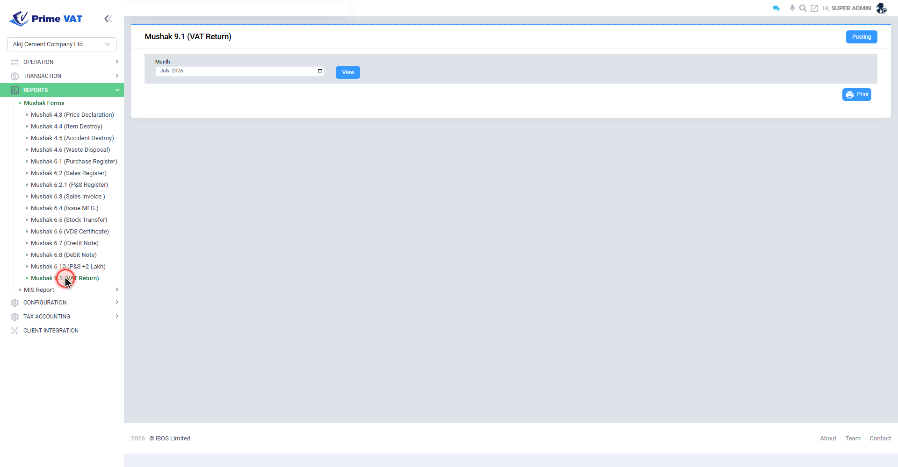

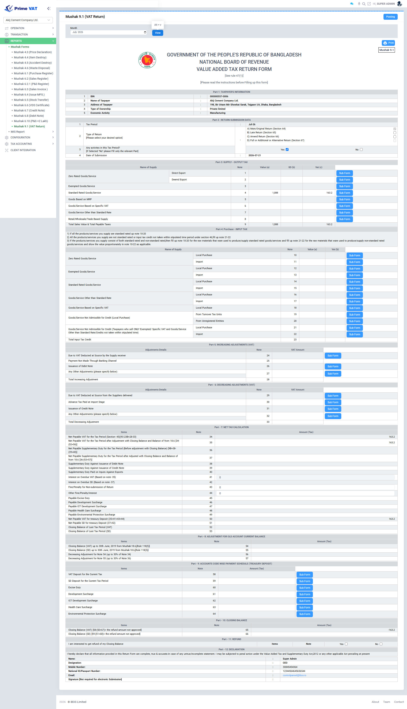

**Page purpose:** Used to prepare, view, and post VAT returns for a specific month.

**Route:** `/reports/mushakForms/mushak9.1`

<!-- manual-meta: {"module": "Reports", "page": "Mushak 9.1 (VAT Return)", "task": "Generate VAT Return", "action": "view", "roles": [], "route": "/reports/mushakForms/mushak9.1", "screenshots": ["screenshots/reports/mushak_9_1_vat_return.png", "screenshots/reports/mushak_9_1_vat_return_show.png"], "keywords": ["vat return", "mushak 9.1", "tax return"], "task_order": 1} -->
#### Task: Generate VAT Return

**Purpose:** To view the compiled VAT return form for the selected month.

**Required roles:**
* No role restriction was identified

**Prerequisites:**
* Transactions for the period are complete

**Steps:**
1. Navigate to Reports > Mushak Forms > Mushak 9.1 (VAT Return)
2. Select the Month
3. Click the 'View' button

**Fields and controls:**
* **Month:** Target month for the VAT return.

**Expected result:** The full VAT return form is rendered.

**Warnings:**
* No specific warning was identified

**Search keywords:** vat return, mushak 9.1, tax return

### Page: Mushak Forms

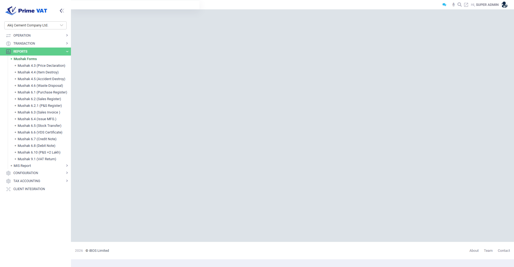

**Page purpose:** This page provides access to various regulatory Mushak forms and reports for VAT compliance.

**Route:** `/reports/mushakForms`

<!-- manual-meta: {"module": "Reports", "page": "Mushak Forms", "task": "Access Regulatory Mushak Forms", "action": "view", "roles": [], "route": "/reports/mushakForms", "screenshots": ["screenshots/reports/mushak_forms.png"], "keywords": ["VAT", "statutory report", "Mushak"], "task_order": 1} -->
#### Task: Access Regulatory Mushak Forms

**Purpose:** To view or generate specific statutory VAT documents.

**Required roles:**
* No role restriction was identified

**Prerequisites:**
* The user must be logged into the system.
* The user must have navigation access to the Reports module.

**Steps:**
1. Navigate to the Reports module in the sidebar.
2. Select 'Mushak Forms'.
3. Choose a specific form (e.g., Mushak 4.3, 6.1, or 9.1) from the provided list.

**Fields and controls:**
* No specific fields were identified from the available evidence.

**Expected result:** The selected Mushak report or form generation interface is displayed.

**Warnings:**
* No specific warning was identified

**Search keywords:** VAT, statutory report, Mushak

### Page: Partner Vs Stock Report

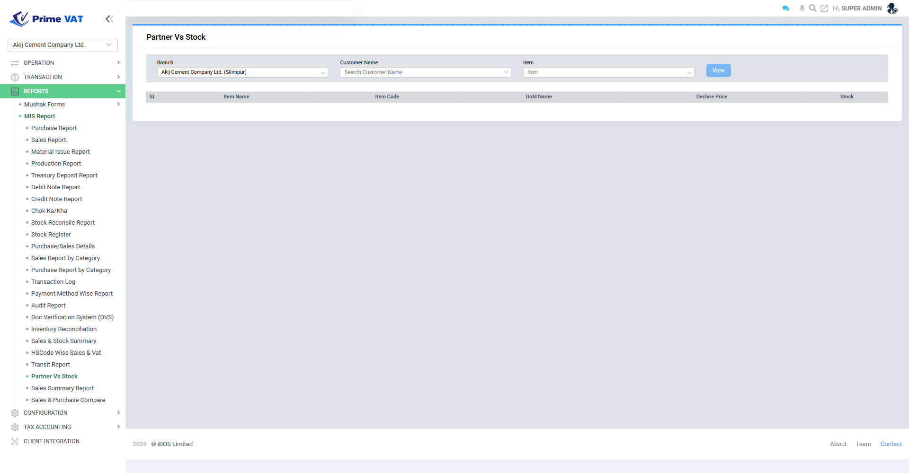

**Page purpose:** This report displays a comparison of stock levels associated with specific partners.

**Route:** `/reports/otherReports/partnerVsStock`

<!-- manual-meta: {"module": "Reports", "page": "Partner Vs Stock Report", "task": "Filter Partner vs Stock Data", "action": "filter", "roles": [], "route": "/reports/otherReports/partnerVsStock", "screenshots": ["screenshots/reports/partner_vs_stock.png"], "keywords": ["inventory", "stock report", "customer stock"], "task_order": 1} -->
#### Task: Filter Partner vs Stock Data

**Purpose:** To view stock inventory levels filtered by specific branch, customer, or item.

**Required roles:**
* No role restriction was identified

**Prerequisites:**
* User must be on the Partner Vs Stock report page.

**Steps:**
1. Select a branch from the 'Branch' dropdown.
2. Select or search for a customer name in the 'Customer Name' field.
3. Select an item from the 'Item' dropdown.
4. Click the 'View' button to display the results.

**Fields and controls:**
* **Branch:** Select the location branch.
* **Customer Name:** Filter by specific customer.
* **Item:** Filter by specific inventory item.

**Expected result:** The table below populates with SL, Item Name, Item Code, UoM Name, Declare Price, and Stock values based on the filters.

**Warnings:**
* No specific warning was identified

**Search keywords:** inventory, stock report, customer stock

### Page: Payment Method Wise Report

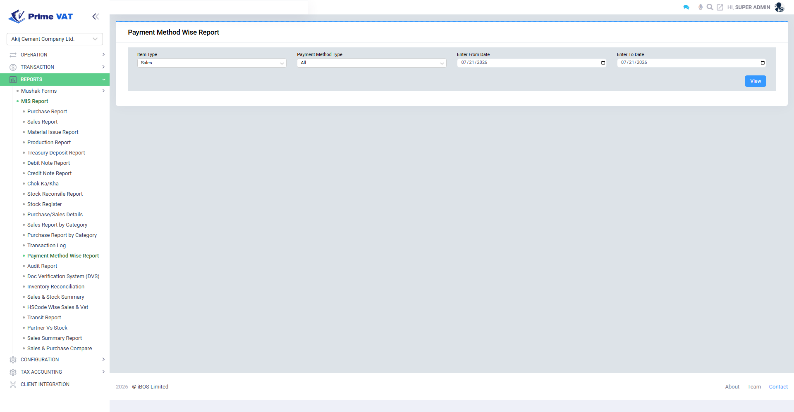

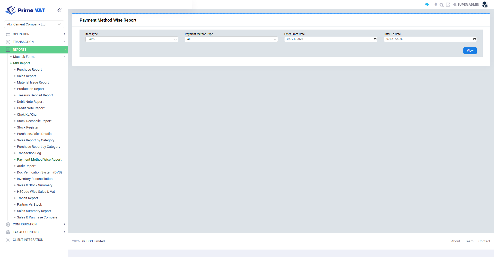

**Page purpose:** This report tracks sales transactions grouped by their respective payment methods within a defined date range.

**Route:** `/reports/otherReports/paymentMethodWiseReport`

<!-- manual-meta: {"module": "Reports", "page": "Payment Method Wise Report", "task": "View Payment Method Wise Report", "action": "view", "roles": [], "route": "/reports/otherReports/paymentMethodWiseReport", "screenshots": ["screenshots/reports/payment_method_wise_report.png", "screenshots/reports/payment_method_wise_report_show.png"], "keywords": ["sales report", "payment tracking", "financial report"], "task_order": 1} -->
#### Task: View Payment Method Wise Report

**Purpose:** To analyze sales based on payment methods used over a specific time period.

**Required roles:**
* No role restriction was identified

**Prerequisites:**
* User must have access to the MIS Report section.

**Steps:**
1. Select the Item Type (e.g., Sales).
2. Select the Payment Method Type (e.g., All).
3. Input the 'From Date' and 'To Date'.
4. Click the 'View' button.

**Fields and controls:**
* **Item Type:** The category of transaction to filter.
* **Payment Method Type:** Specific payment mode (e.g., Cash, Bank).
* **Enter From Date:** Start date for report range.
* **Enter To Date:** End date for report range.

**Expected result:** The system generates the payment method report for the selected criteria.

**Warnings:**
* No specific warning was identified

**Search keywords:** sales report, payment tracking, financial report

### Page: Production Report

**Page purpose:** This report provides a breakdown of production activity by branch and date.

**Route:** `/reports/otherReports/productionReport`

<!-- manual-meta: {"module": "Reports", "page": "Production Report", "task": "Generate Production Report", "action": "view", "roles": [], "route": "/reports/otherReports/productionReport", "screenshots": ["screenshots/reports/production_report.png"], "keywords": ["production output", "manufacturing report"], "task_order": 1} -->
#### Task: Generate Production Report

**Purpose:** To monitor production output over a specific period.

**Required roles:**
* No role restriction was identified

**Prerequisites:**
* None identified from the interface

**Steps:**
1. Select the 'Branch'.
2. Select the 'Sort By' preference.
3. Select 'From Date' and 'To Date'.
4. Click the 'View' button.

**Fields and controls:**
* **Branch:** The site of production.
* **Sort By:** Criteria for ordering data.

**Expected result:** A detailed production report is displayed based on inputs.

**Warnings:**
* No specific warning was identified

**Search keywords:** production output, manufacturing report

### Page: Purchase Report

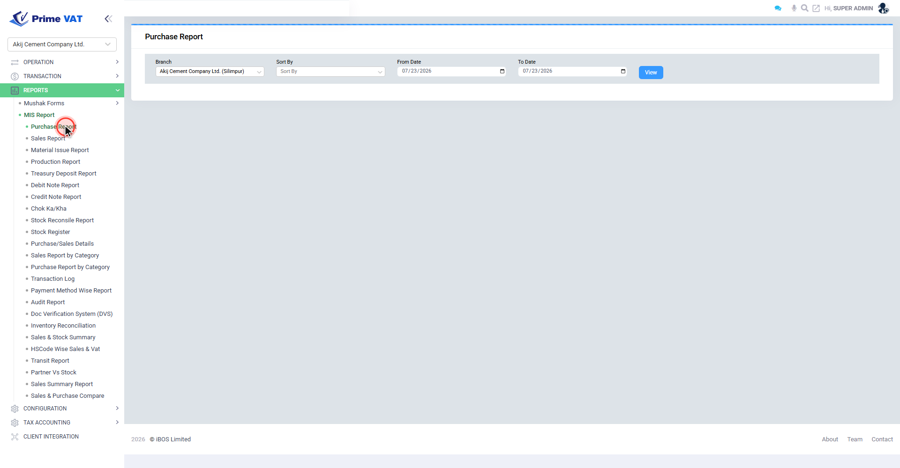

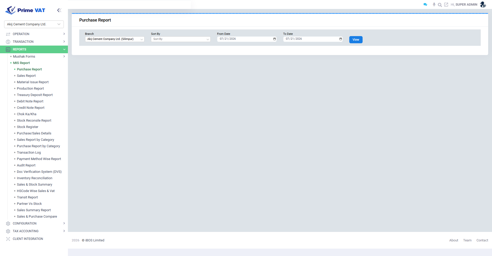

**Page purpose:** A comprehensive view of purchase transactions.

**Route:** `/reports/otherReports/purchaseReport`

<!-- manual-meta: {"module": "Reports", "page": "Purchase Report", "task": "Filter Purchase Transactions", "action": "filter", "roles": [], "route": "/reports/otherReports/purchaseReport", "screenshots": ["screenshots/reports/purchase_report.png", "screenshots/reports/purchase_report_show.png"], "keywords": ["procurement", "purchase history"], "task_order": 1} -->
#### Task: Filter Purchase Transactions

**Purpose:** To view purchase data for specific operational branches and timeframes.

**Required roles:**
* No role restriction was identified

**Prerequisites:**
* None identified from the interface

**Steps:**
1. Choose a 'Branch'.
2. Select sorting criteria via 'Sort By'.
3. Specify 'From Date' and 'To Date'.
4. Click 'View'.

**Fields and controls:**
* No specific fields were identified from the available evidence.

**Expected result:** Purchase report data is filtered according to user input.

**Warnings:**
* No specific warning was identified

**Search keywords:** procurement, purchase history

### Page: Category Wise Purchase Report

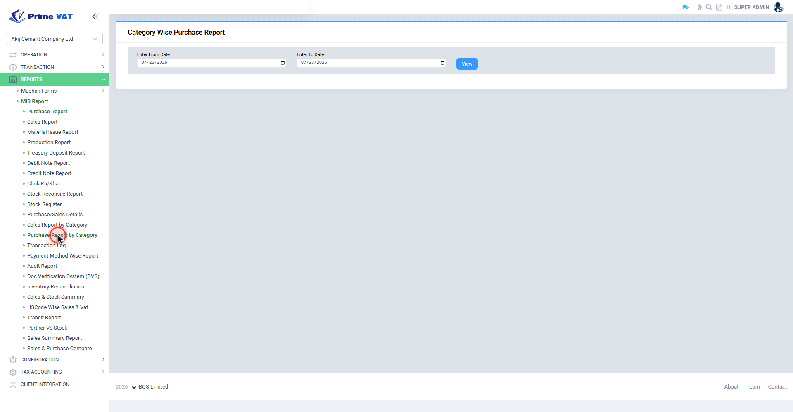

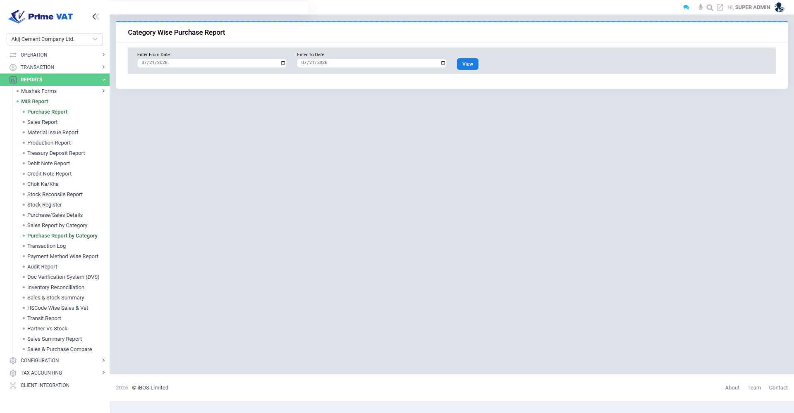

**Page purpose:** This report displays purchases aggregated by product categories.

**Route:** `/reports/otherReports/purchaseReportByCategory`

<!-- manual-meta: {"module": "Reports", "page": "Category Wise Purchase Report", "task": "View Purchase Data by Category", "action": "view", "roles": [], "route": "/reports/otherReports/purchaseReportByCategory", "screenshots": ["screenshots/reports/purchase_report_by_category.png", "screenshots/reports/purchase_report_by_category_show.png"], "keywords": ["spending analysis", "procurement category"], "task_order": 1} -->
#### Task: View Purchase Data by Category

**Purpose:** To analyze spending or procurement by category types.

**Required roles:**
* No role restriction was identified

**Prerequisites:**
* None identified from the interface

**Steps:**
1. Input the 'Enter From Date'.
2. Input the 'Enter To Date'.
3. Click 'View'.

**Fields and controls:**
* **Enter From Date:** Start of report period.
* **Enter To Date:** End of report period.

**Expected result:** A category-wise summary of purchases is rendered.

**Warnings:**
* No specific warning was identified

**Search keywords:** spending analysis, procurement category

### Page: Purchase/Sales Details

**Page purpose:** This report allows for deep-dive analysis into specific transaction types within a date range.

**Route:** `/reports/otherReports/purchaseSalesDetails`

<!-- manual-meta: {"module": "Reports", "page": "Purchase/Sales Details", "task": "Generate Detailed Transaction Report", "action": "view", "roles": [], "route": "/reports/otherReports/purchaseSalesDetails", "screenshots": ["screenshots/reports/purchase_sales_details.png"], "keywords": ["transaction log", "sales details", "purchase details"], "task_order": 1} -->
#### Task: Generate Detailed Transaction Report

**Purpose:** To retrieve granular details of either purchases or sales.

**Required roles:**
* No role restriction was identified

**Prerequisites:**
* None identified from the interface

**Steps:**
1. Select the 'From Date'.
2. Select the 'To Date'.
3. Choose the transaction type in 'Select Type'.
4. Click 'View'.

**Fields and controls:**
* **Select Type:** Choose between purchase or sales records.

**Expected result:** The page displays the requested transaction details.

**Warnings:**
* No specific warning was identified

**Search keywords:** transaction log, sales details, purchase details

### Page: User Profile

**Page purpose:** This page contains the controls and information shown in the captured interface.

**Route:** `https://devprimevat.ibos.io/reports`

<!-- manual-meta: {"module": "Reports", "page": "User Profile", "task": "Use User Profile", "action": "view", "roles": [], "route": "https://devprimevat.ibos.io/reports", "screenshots": ["screenshots/reports/reports.png"], "keywords": ["User Profile", "reports"], "task_order": 1} -->
#### Task: Use User Profile

**Purpose:** Review and use the visible page functions.

**Required roles:**
* No role restriction was identified

**Prerequisites:**
* None identified from the interface

**Steps:**
1. Open the User Profile page.
2. Review the visible controls, fields, and table columns.
3. Choose the required available action for your work.

**Fields and controls:**
* No specific fields were identified from the available evidence.

**Expected result:** The requested page information or form is displayed.

**Warnings:**
* Only actions visible in the captured interface are documented.

**Search keywords:** User Profile, reports

### Page: Sales & Purchase Compare

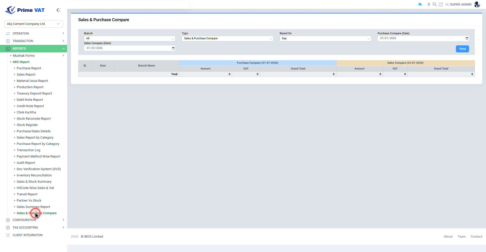

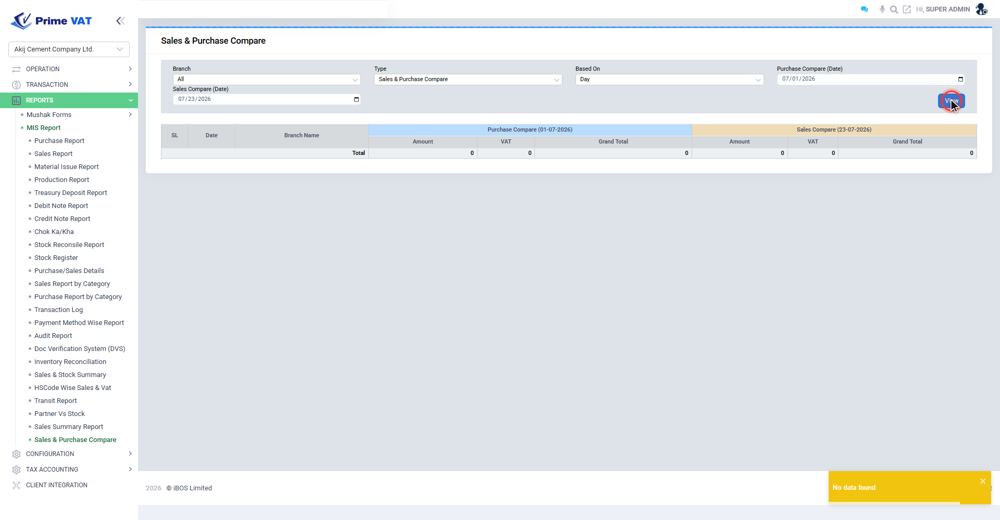

**Page purpose:** Used to compare sales and purchase data between different dates.

**Route:** `/reports/otherReports/salesAndPurchaseCompare`

<!-- manual-meta: {"module": "Reports", "page": "Sales & Purchase Compare", "task": "Generate sales and purchase comparison report", "action": "view", "roles": [], "route": "/reports/otherReports/salesAndPurchaseCompare", "screenshots": ["screenshots/reports/sales_purchase_compare.png", "screenshots/reports/sales_purchase_compare_show.png"], "keywords": ["compare", "VAT", "sales", "purchase", "report"], "task_order": 1} -->
#### Task: Generate sales and purchase comparison report

**Purpose:** To compare transaction volumes and VAT between specified dates.

**Required roles:**
* No role restriction was identified

**Prerequisites:**
* None identified from the interface

**Steps:**
1. Navigate to Reports > MIS Report > Sales & Purchase Compare.
2. Select Branch.
3. Select Type.
4. Select 'Based On' option (e.g., Day).
5. Select Purchase Compare (Date) and Sales Compare (Date).
6. Click 'View'.

**Fields and controls:**
* **Branch:** Branch selector.
* **Type:** Report type selector.
* **Based On:** Filtering basis (e.g., Day).
* **Purchase Compare (Date):** Start date for purchase records.
* **Sales Compare (Date):** Start date for sales records.

**Expected result:** View the comparison table containing SL, Date, Branch Name, Purchase Compare details, and Sales Compare details.

**Warnings:**
* No specific warning was identified

**Search keywords:** compare, VAT, sales, purchase, report

### Page: Sales Report

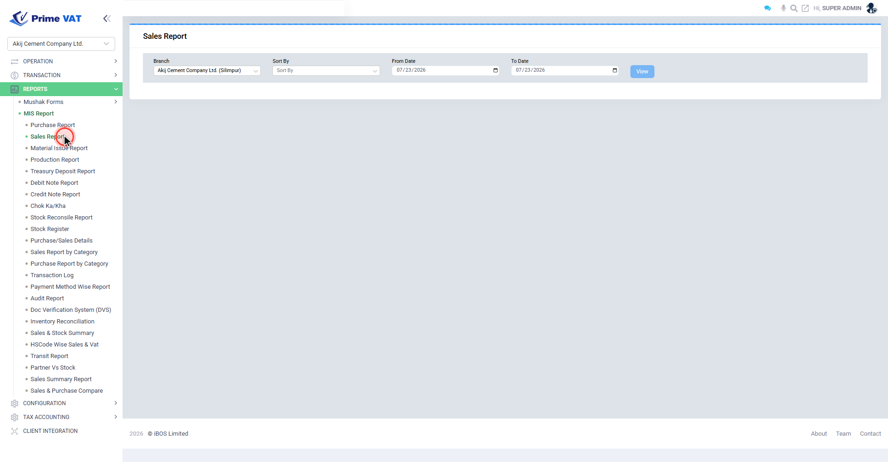

**Page purpose:** Provides a detailed report of sales transactions.

**Route:** `/reports/otherReports/salesReport`

<!-- manual-meta: {"module": "Reports", "page": "Sales Report", "task": "View sales report", "action": "view", "roles": [], "route": "/reports/otherReports/salesReport", "screenshots": ["screenshots/reports/sales_report.png"], "keywords": ["sales", "invoices", "transactions"], "task_order": 1} -->
#### Task: View sales report

**Purpose:** To retrieve and review sales transactions within a specific date range.

**Required roles:**
* No role restriction was identified

**Prerequisites:**
* None identified from the interface

**Steps:**
1. Navigate to Reports > MIS Report > Sales Report.
2. Select the Branch.
3. Choose sorting criteria in 'Sort By'.
4. Enter 'From Date' and 'To Date'.
5. Click 'View'.

**Fields and controls:**
* **Branch:** Select the company branch.
* **Sort By:** Sorting criteria for the list.
* **From Date:** Start date range.
* **To Date:** End date range.

**Expected result:** Displays a filtered list of sales records based on selected parameters.

**Warnings:**
* No specific warning was identified

**Search keywords:** sales, invoices, transactions

### Page: Sales Report by Category

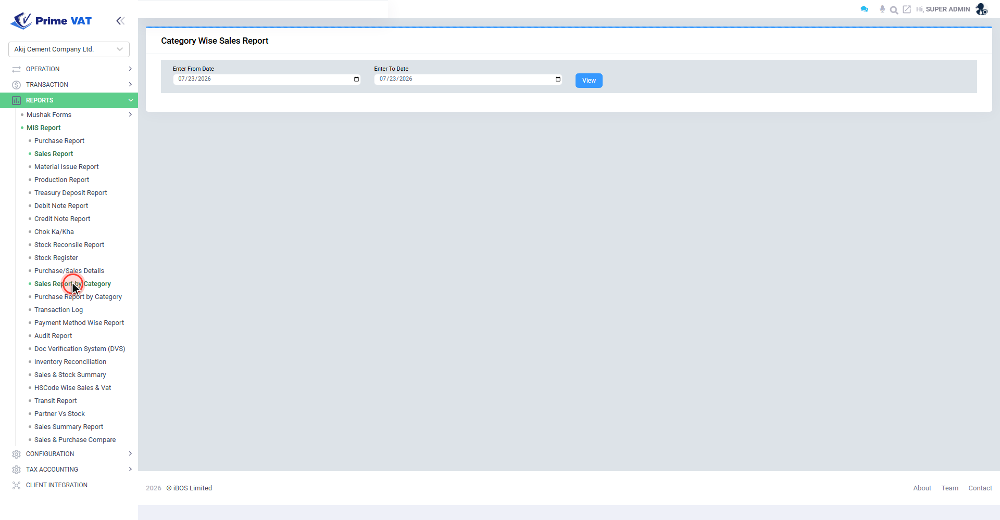

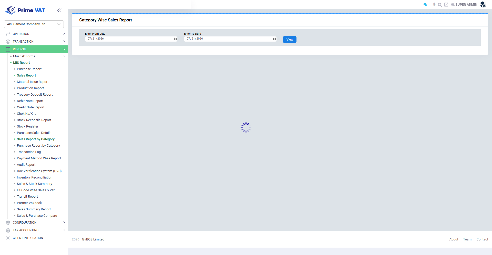

**Page purpose:** Displays sales data categorized by product or service types.

**Route:** `/reports/otherReports/salesReportByCategory`

<!-- manual-meta: {"module": "Reports", "page": "Sales Report by Category", "task": "View category-wise sales", "action": "view", "roles": [], "route": "/reports/otherReports/salesReportByCategory", "screenshots": ["screenshots/reports/sales_report_by_category.png", "screenshots/reports/sales_report_by_category_show.png"], "keywords": ["category", "sales", "report"], "task_order": 1} -->
#### Task: View category-wise sales

**Purpose:** To analyze sales performance segmented by categories.

**Required roles:**
* No role restriction was identified

**Prerequisites:**
* None identified from the interface

**Steps:**
1. Navigate to Reports > MIS Report > Sales Report by Category.
2. Enter 'Enter From Date'.
3. Enter 'Enter To Date'.
4. Click 'View'.

**Fields and controls:**
* **Enter From Date:** Start date of the sales report.
* **Enter To Date:** End date of the sales report.

**Expected result:** A list of sales figures grouped by category.

**Warnings:**
* No specific warning was identified

**Search keywords:** category, sales, report

### Page: Sales & Stock Summary

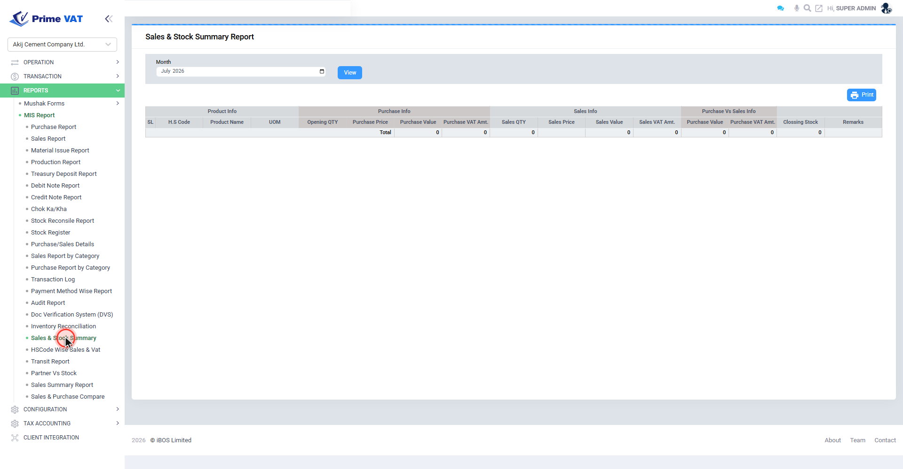

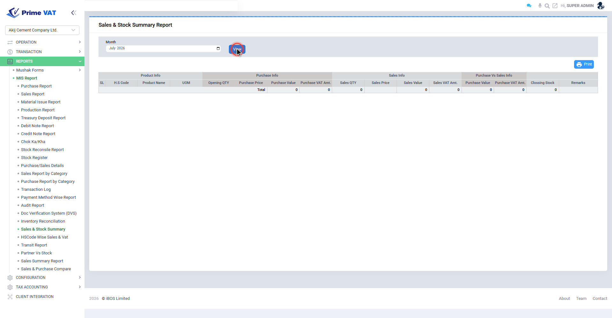

**Page purpose:** Provides a comprehensive view of stock movements versus sales activity.

**Route:** `/reports/otherReports/SalesStockSummary`

<!-- manual-meta: {"module": "Reports", "page": "Sales & Stock Summary", "task": "Generate sales and stock summary report", "action": "view", "roles": [], "route": "/reports/otherReports/SalesStockSummary", "screenshots": ["screenshots/reports/sales_stock_summary.png", "screenshots/reports/sales_stock_summary_show.png"], "keywords": ["inventory", "stock", "sales", "summary"], "task_order": 1} -->
#### Task: Generate sales and stock summary report

**Purpose:** To track inventory, purchase, and sales details for a given month.

**Required roles:**
* No role restriction was identified

**Prerequisites:**
* None identified from the interface

**Steps:**
1. Navigate to Reports > MIS Report > Sales & Stock Summary.
2. Select the Month.
3. Click 'View'.

**Fields and controls:**
* **Month:** Calendar month selector.

**Expected result:** Summary table displaying product, purchase, sales, and closing stock information.

**Warnings:**
* No specific warning was identified

**Search keywords:** inventory, stock, sales, summary

### Page: Sales Summary Report

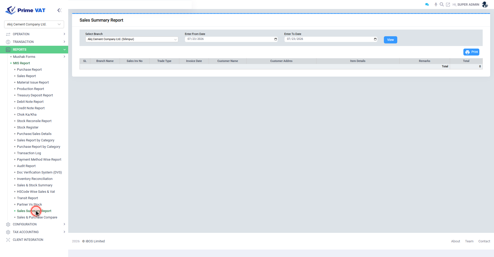

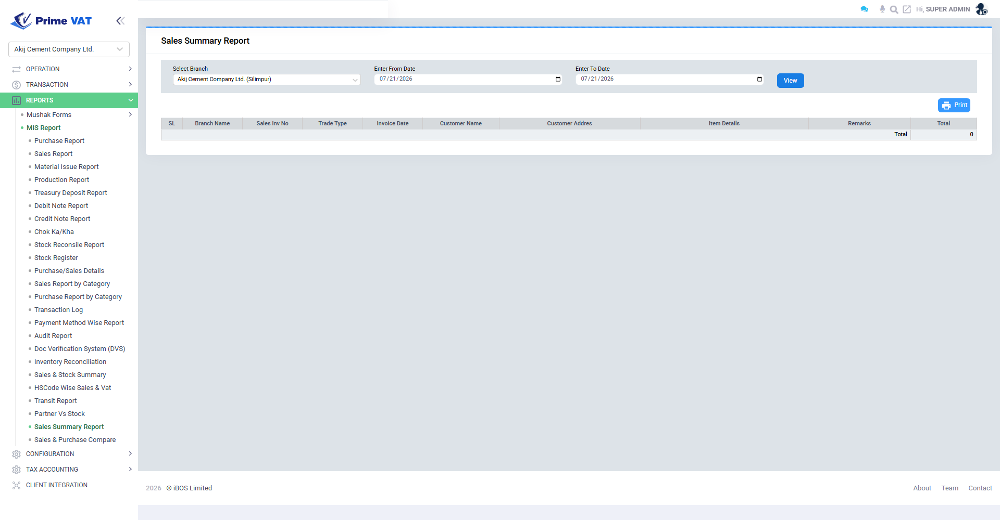

**Page purpose:** Summarizes sales invoice data by branch and date.

**Route:** `/reports/otherReports/salesSummaryReport`

<!-- manual-meta: {"module": "Reports", "page": "Sales Summary Report", "task": "View sales summary", "action": "view", "roles": [], "route": "/reports/otherReports/salesSummaryReport", "screenshots": ["screenshots/reports/sales_summary_report.png", "screenshots/reports/sales_summary_report_show.png"], "keywords": ["sales", "summary", "invoices"], "task_order": 1} -->
#### Task: View sales summary

**Purpose:** To monitor sales invoices and associated customer details.

**Required roles:**
* No role restriction was identified

**Prerequisites:**
* None identified from the interface

**Steps:**
1. Navigate to Reports > MIS Report > Sales Summary Report.
2. Select the 'Select Branch'.
3. Set the 'Enter From Date' and 'Enter To Date'.
4. Click 'View'.

**Fields and controls:**
* **Select Branch:** Filter by business unit.
* **Enter From Date:** Beginning of the date range.
* **Enter To Date:** End of the date range.

**Expected result:** Displays a summary list of sales transactions.

**Warnings:**
* No specific warning was identified

**Search keywords:** sales, summary, invoices

### Page: Stock Reconcile Report

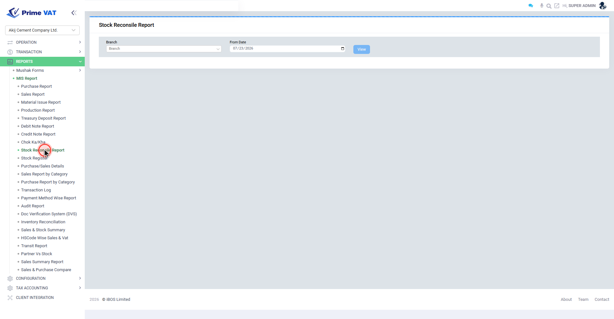

**Page purpose:** Used for verifying stock levels and performing reconciliation.

**Route:** `/reports/otherReports/stockReconsileReport`

<!-- manual-meta: {"module": "Reports", "page": "Stock Reconcile Report", "task": "Run stock reconciliation report", "action": "view", "roles": [], "route": "/reports/otherReports/stockReconsileReport", "screenshots": ["screenshots/reports/stock_reconsile_report.png"], "keywords": ["reconcile", "stock", "audit"], "task_order": 1} -->
#### Task: Run stock reconciliation report

**Purpose:** To compare physical stock against system records.

**Required roles:**
* No role restriction was identified

**Prerequisites:**
* None identified from the interface

**Steps:**
1. Navigate to Reports > MIS Report > Stock Reconsile Report.
2. Select the Branch.
3. Select the From Date.
4. Click 'View'.

**Fields and controls:**
* **Branch:** Branch selector.
* **From Date:** Start date for reconciliation.

**Expected result:** The screen will display current reconciliations for the selected criteria.

**Warnings:**
* No specific warning was identified

**Search keywords:** reconcile, stock, audit

### Page: Stock Register

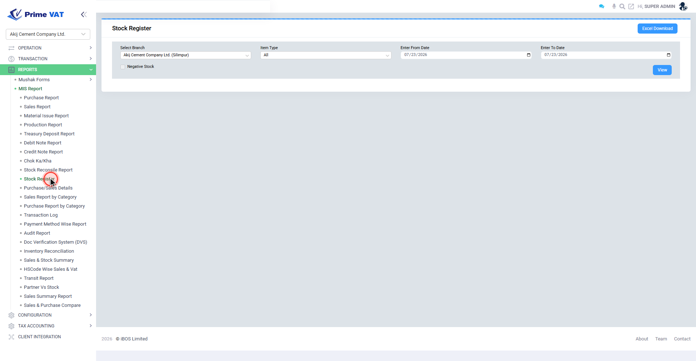

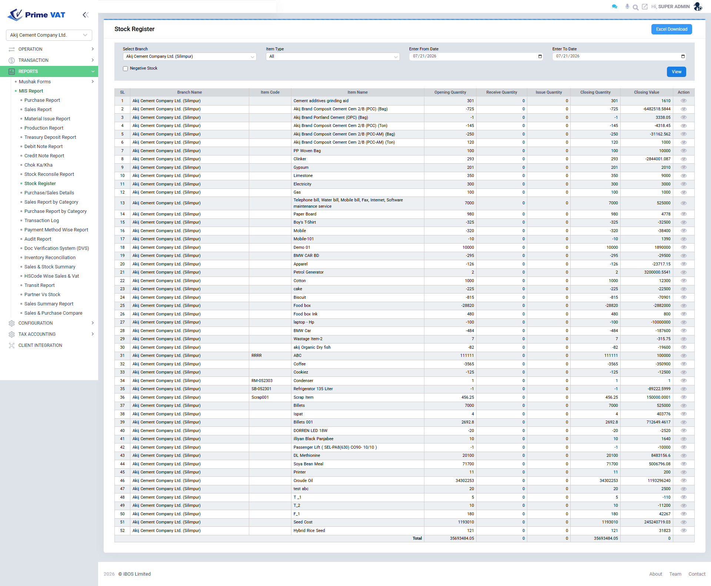

**Page purpose:** Detailed ledger of stock movements including openings, receipts, and issues.

**Route:** `/reports/otherReports/stockRegister`

<!-- manual-meta: {"module": "Reports", "page": "Stock Register", "task": "View stock register report", "action": "view", "roles": [], "route": "/reports/otherReports/stockRegister", "screenshots": ["screenshots/reports/stock_register.png", "screenshots/reports/stock_register_show.png"], "keywords": ["ledger", "stock", "quantity", "movements"], "task_order": 1} -->
#### Task: View stock register report

**Purpose:** To maintain visibility over item-level stock changes.

**Required roles:**
* No role restriction was identified

**Prerequisites:**
* None identified from the interface

**Steps:**
1. Navigate to Reports > MIS Report > Stock Register.
2. Select Branch.
3. Select Item Type.
4. Select date range using 'Enter From Date' and 'Enter To Date'.
5. Toggle 'Negative Stock' if needed.
6. Click 'View'.

**Fields and controls:**
* **Select Branch:** Filter by branch.
* **Item Type:** Category or type of items.
* **Enter From Date:** Report start date.
* **Enter To Date:** Report end date.
* **Negative Stock:** Checkbox to display items with negative balances.

**Expected result:** Table showing detailed stock quantities, values, and movements.

**Warnings:**
* No specific warning was identified

**Search keywords:** ledger, stock, quantity, movements

### Page: Transaction Log

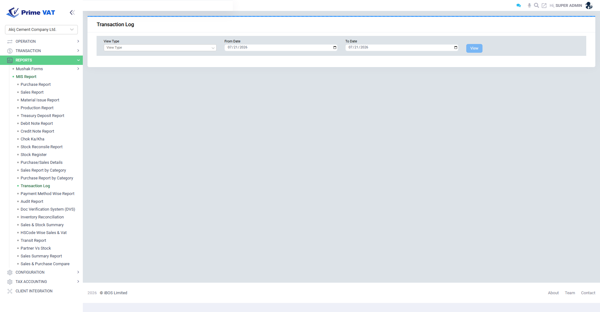

**Page purpose:** Audit trail for system transactions.

**Route:** `/reports/otherReports/auditLog`

<!-- manual-meta: {"module": "Reports", "page": "Transaction Log", "task": "Query transaction logs", "action": "search", "roles": [], "route": "/reports/otherReports/auditLog", "screenshots": ["screenshots/reports/transaction_log.png"], "keywords": ["audit", "log", "transaction", "history"], "task_order": 1} -->
#### Task: Query transaction logs

**Purpose:** To audit and track activities within the system.

**Required roles:**
* No role restriction was identified

**Prerequisites:**
* None identified from the interface

**Steps:**
1. Navigate to Reports > MIS Report > Transaction Log.
2. Select 'View Type'.
3. Set 'From Date' and 'To Date'.
4. Click 'View'.

**Fields and controls:**
* **View Type:** Category of log to display.
* **From Date:** Log start date.
* **To Date:** Log end date.

**Expected result:** List of system transactions corresponding to the selected dates.

**Warnings:**
* No specific warning was identified

**Search keywords:** audit, log, transaction, history

### Page: Transit Report

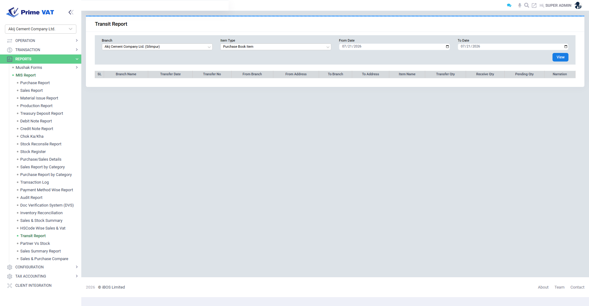

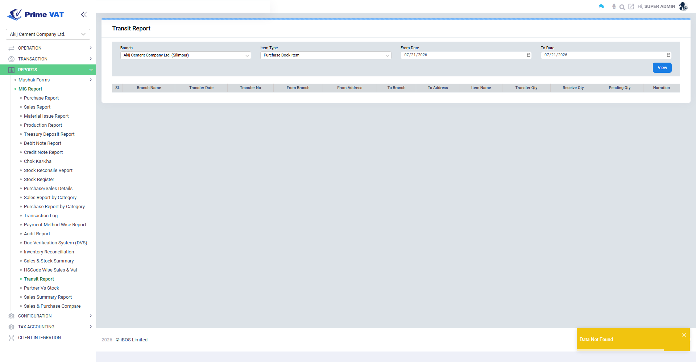

**Page purpose:** This page provides a report on items currently in transit between branches, allowing for monitoring of transfer details and quantities.

**Route:** `/reports/otherReports/transitReport`

<!-- manual-meta: {"module": "Reports", "page": "Transit Report", "task": "View Transit Report", "action": "view", "roles": [], "route": "/reports/otherReports/transitReport", "screenshots": ["screenshots/reports/transit_report.png", "screenshots/reports/transit_report_show.png"], "keywords": ["transit", "stock transfer", "branch report"], "task_order": 1} -->
#### Task: View Transit Report

**Purpose:** To monitor stock transfer statuses between different branches within a selected date range.

**Required roles:**
* No role restriction was identified

**Prerequisites:**
* Access to the Reports module.

**Steps:**
1. Navigate to Reports > MIS Report > Transit Report.
2. Select the Branch from the dropdown menu.
3. Select the Item Type from the dropdown menu.
4. Select the From Date using the calendar picker.
5. Select the To Date using the calendar picker.
6. Click the View button.

**Fields and controls:**
* **Branch:** The specific branch from which the transit report is generated.
* **Item Type:** The category or type of item being tracked in transit.
* **From Date:** The start date for the reporting period.
* **To Date:** The end date for the reporting period.

**Expected result:** The system displays a table containing SL, Branch Name, Transfer Date, Transfer No, From Branch, From Address, To Branch, To Address, Item Name, Transfer Qty, Receive Qty, Pending Qty, and Narration. If no records exist, a 'Data Not Found' message is displayed.

**Warnings:**
* No specific warning was identified

**Search keywords:** transit, stock transfer, branch report

### Page: Treasury Deposit Report

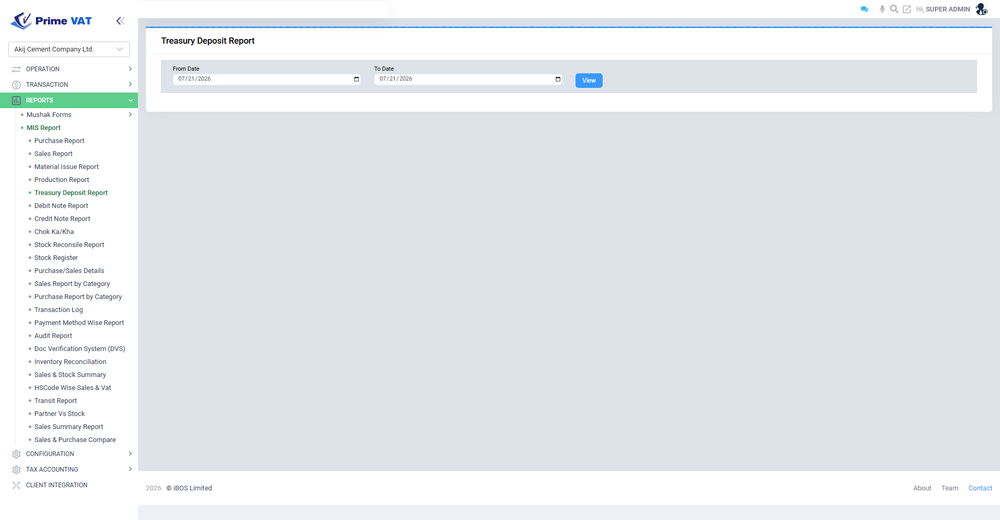

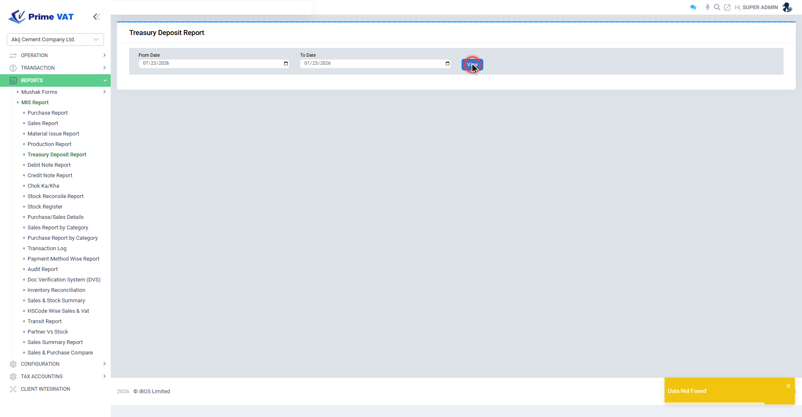

**Page purpose:** This page provides a view of treasury deposit transactions within a specified date range.

**Route:** `/reports/otherReports/treasuryDepositReport`

<!-- manual-meta: {"module": "Reports", "page": "Treasury Deposit Report", "task": "View Treasury Deposit Report", "action": "view", "roles": [], "route": "/reports/otherReports/treasuryDepositReport", "screenshots": ["screenshots/reports/treasury_deposit_report.png", "screenshots/reports/treasury_deposit_report_show.png"], "keywords": ["treasury", "deposit", "financial report"], "task_order": 1} -->
#### Task: View Treasury Deposit Report

**Purpose:** To track and audit treasury deposit records for a specific time frame.

**Required roles:**
* No role restriction was identified

**Prerequisites:**
* Access to the Reports module.

**Steps:**
1. Navigate to Reports > MIS Report > Treasury Deposit Report.
2. Select the From Date using the calendar picker.
3. Select the To Date using the calendar picker.
4. Click the View button.

**Fields and controls:**
* **From Date:** The beginning of the date range for the deposit report.
* **To Date:** The conclusion of the date range for the deposit report.

**Expected result:** The report displays the relevant treasury deposit data for the selected period. If no records are found, a 'Data Not Found' message appears.

**Warnings:**
* No specific warning was identified

**Search keywords:** treasury, deposit, financial report

## 5. Tax Accounting Module

### Page: Adjustment Journal

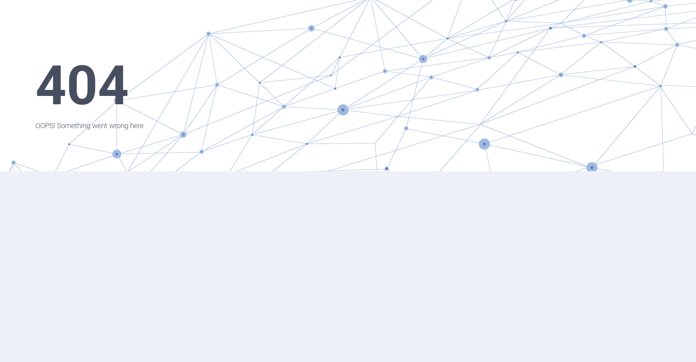

**Page purpose:** This page is intended for managing adjustment journal entries.

**Route:** `/tax-accounting/financials/adjustmentjournal`

<!-- manual-meta: {"module": "Tax Accounting", "page": "Adjustment Journal", "task": "Access Adjustment Journal", "action": "view", "roles": [], "route": "/tax-accounting/financials/adjustmentjournal", "screenshots": ["screenshots/tax_accounting/adjustment_journal.png"], "keywords": ["adjustment", "journal", "entries"], "task_order": 1} -->
#### Task: Access Adjustment Journal

**Purpose:** To view or record adjustments to financial journals.

**Required roles:**
* No role restriction was identified

**Prerequisites:**
* User must have access to the Tax Accounting module.

**Steps:**
1. Navigate to the Adjustment Journal page via the Tax Accounting menu.

**Fields and controls:**
* No specific fields were identified from the available evidence.

**Expected result:** The user should see the Adjustment Journal interface.

**Warnings:**
* The page currently displays a 404 error, indicating the feature is unavailable.

**Search keywords:** adjustment, journal, entries

### Page: Bank Journal

**Page purpose:** This page is intended for managing bank-related journal entries.

**Route:** `/tax-accounting/financials/bankjournal`

<!-- manual-meta: {"module": "Tax Accounting", "page": "Bank Journal", "task": "Access Bank Journal", "action": "view", "roles": [], "route": "/tax-accounting/financials/bankjournal", "screenshots": ["screenshots/tax_accounting/bank_journal.png"], "keywords": ["bank", "journal", "transactions"], "task_order": 1} -->
#### Task: Access Bank Journal

**Purpose:** To track and manage banking transactions within the tax accounting framework.

**Required roles:**
* No role restriction was identified

**Prerequisites:**
* User must have access to the Tax Accounting module.

**Steps:**
1. Navigate to the Bank Journal page via the Tax Accounting menu.

**Fields and controls:**
* No specific fields were identified from the available evidence.

**Expected result:** The user should see the Bank Journal interface.

**Warnings:**
* The page currently displays a 404 error, indicating the feature is unavailable.

**Search keywords:** bank, journal, transactions

### Page: Cash Journal

**Page purpose:** This page is intended for managing cash-related journal entries.

**Route:** `/tax-accounting/financials/cashjournal`

<!-- manual-meta: {"module": "Tax Accounting", "page": "Cash Journal", "task": "Access Cash Journal", "action": "view", "roles": [], "route": "/tax-accounting/financials/cashjournal", "screenshots": ["screenshots/tax_accounting/cash_journal.png"], "keywords": ["cash", "journal", "transactions"], "task_order": 1} -->
#### Task: Access Cash Journal

**Purpose:** To track and manage cash transactions within the tax accounting framework.

**Required roles:**
* No role restriction was identified

**Prerequisites:**
* User must have access to the Tax Accounting module.

**Steps:**
1. Navigate to the Cash Journal page via the Tax Accounting menu.

**Fields and controls:**
* No specific fields were identified from the available evidence.

**Expected result:** The user should see the Cash Journal interface.

**Warnings:**
* The page currently displays a 404 error, indicating the feature is unavailable.

**Search keywords:** cash, journal, transactions

### Page: Financials

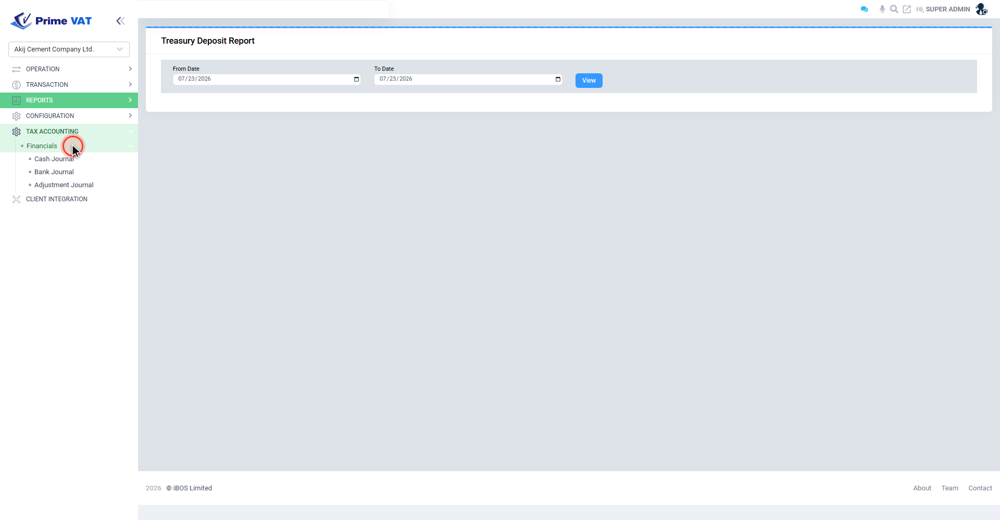

**Page purpose:** A hub for accessing various financial journals and accounting reports.

**Route:** `/tax-accounting/financials`

<!-- manual-meta: {"module": "Tax Accounting", "page": "Financials", "task": "Access Financials", "action": "view", "roles": [], "route": "/tax-accounting/financials", "screenshots": ["screenshots/tax_accounting/financials.png"], "keywords": ["financials", "journals", "accounting"], "task_order": 1} -->
#### Task: Access Financials

**Purpose:** To view the overview of financial journals.

**Required roles:**
* No role restriction was identified

**Prerequisites:**
* User must have access to the Tax Accounting module.

**Steps:**
1. Navigate to the Financials page via the Tax Accounting menu.

**Fields and controls:**
* No specific fields were identified from the available evidence.

**Expected result:** The user should see the Financials summary dashboard.

**Warnings:**
* The page currently displays a 404 error, indicating the feature is unavailable.

**Search keywords:** financials, journals, accounting

### Page: Tax Accounting

**Page purpose:** The main landing page for tax accounting operations.

**Route:** `/tax-accounting`

<!-- manual-meta: {"module": "Tax Accounting", "page": "Tax Accounting", "task": "Access Tax Accounting Module", "action": "view", "roles": [], "route": "/tax-accounting", "screenshots": ["screenshots/tax_accounting/tax_accounting.png"], "keywords": ["tax", "accounting", "module"], "task_order": 1} -->
#### Task: Access Tax Accounting Module

**Purpose:** To enter the Tax Accounting module for further navigation.

**Required roles:**
* No role restriction was identified

**Prerequisites:**
* User must be authenticated.

**Steps:**
1. Click on the Tax Accounting link in the navigation menu.

**Fields and controls:**
* No specific fields were identified from the available evidence.

**Expected result:** The user should see the Tax Accounting module interface.

**Warnings:**
* The page currently displays a 404 error, indicating the feature is unavailable.

**Search keywords:** tax, accounting, module

## 6. Transaction Module

### Page: Adjustment

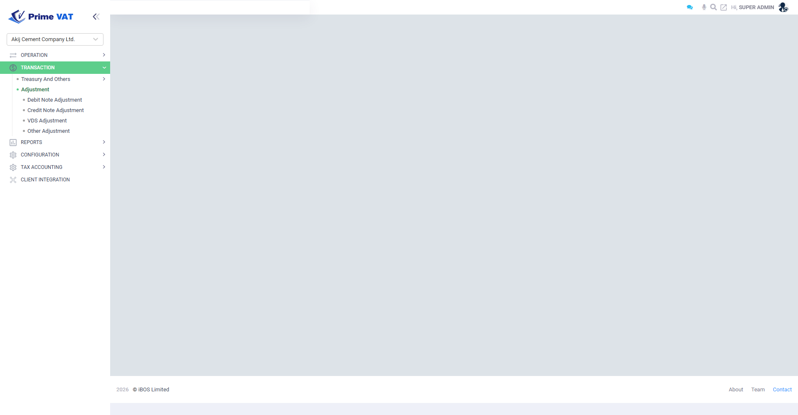

**Page purpose:** This page provides a centralized menu for managing various types of adjustments such as Debit Note, Credit Note, VDS, and Other adjustments.

**Route:** `/transaction/adjustment`

<!-- manual-meta: {"module": "Transaction", "page": "Adjustment", "task": "Navigate to Adjustment sub-modules", "action": "view", "roles": [], "route": "/transaction/adjustment", "screenshots": ["screenshots/transaction/adjustment.png"], "keywords": ["adjustment", "debit note", "credit note", "vds", "other adjustment"], "task_order": 1} -->
#### Task: Navigate to Adjustment sub-modules

**Purpose:** Access specific adjustment modules like Debit Note, Credit Note, VDS, or Other Adjustment.

**Required roles:**
* No role restriction was identified

**Prerequisites:**
* User must have appropriate access rights.

**Steps:**
1. Click on 'TRANSACTION' in the side menu.
2. Click on 'Adjustment'.
3. Select the desired adjustment type from the dropdown list.

**Fields and controls:**
* No specific fields were identified from the available evidence.

**Expected result:** The user is redirected to the selected adjustment module page.

**Warnings:**
* No specific warning was identified

**Search keywords:** adjustment, debit note, credit note, vds, other adjustment

### Page: Credit Note Adjustment

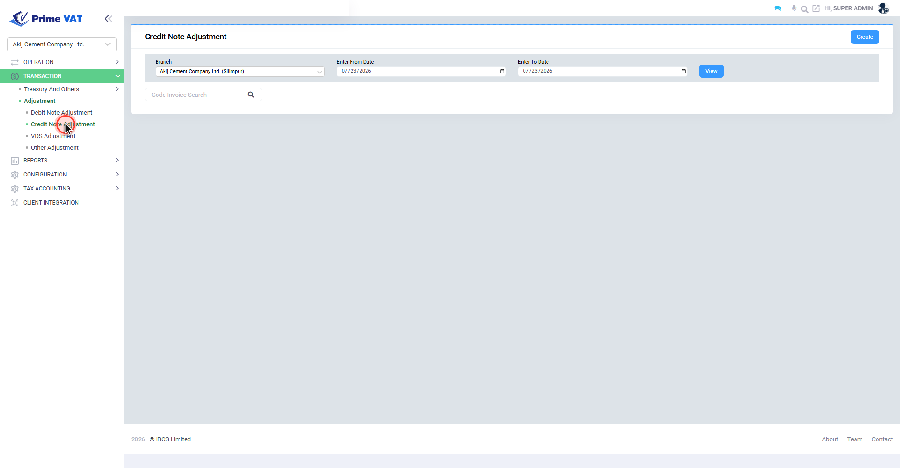

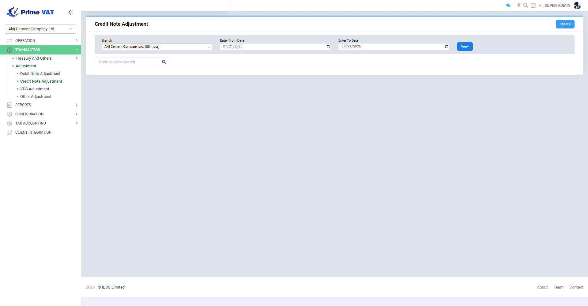

**Page purpose:** This page allows users to view and manage credit note adjustments.

**Route:** `/transaction/adjustment/creditNoteAdjustment`

<!-- manual-meta: {"module": "Transaction", "page": "Credit Note Adjustment", "task": "Filter Credit Note Adjustments", "action": "filter", "roles": [], "route": "/transaction/adjustment/creditNoteAdjustment", "screenshots": ["screenshots/transaction/credit_note_adjustment.png", "screenshots/transaction/credit_note_adjustment_show.png"], "keywords": ["filter", "credit note", "adjustment", "date range"], "task_order": 1} -->
#### Task: Filter Credit Note Adjustments

**Purpose:** Find specific credit note adjustments for a specific branch and date range.

**Required roles:**
* No role restriction was identified

**Prerequisites:**
* Existing credit note adjustment records.

**Steps:**
1. Select the branch from the dropdown.
2. Enter the 'From Date'.
3. Enter the 'To Date'.
4. Click 'View'.

**Fields and controls:**
* **Branch:** The branch associated with the credit note adjustment.
* **Enter From Date:** The start date for the search range.
* **Enter To Date:** The end date for the search range.

**Expected result:** The page displays the relevant credit note adjustment records based on the filter criteria.

**Warnings:**
* No specific warning was identified

**Search keywords:** filter, credit note, adjustment, date range

### Page: Debit Note Adjustment

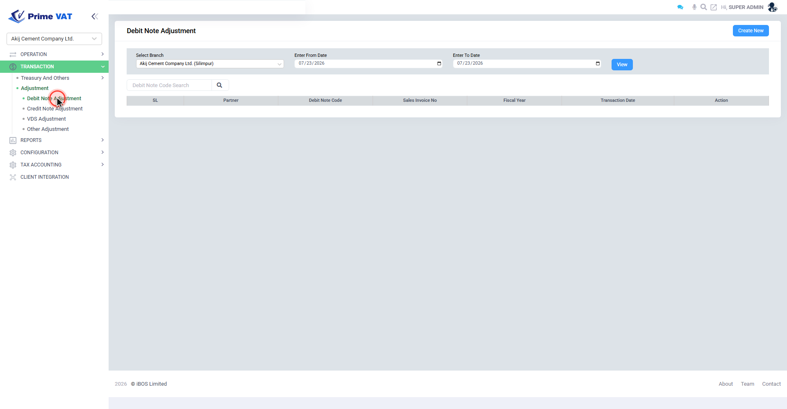

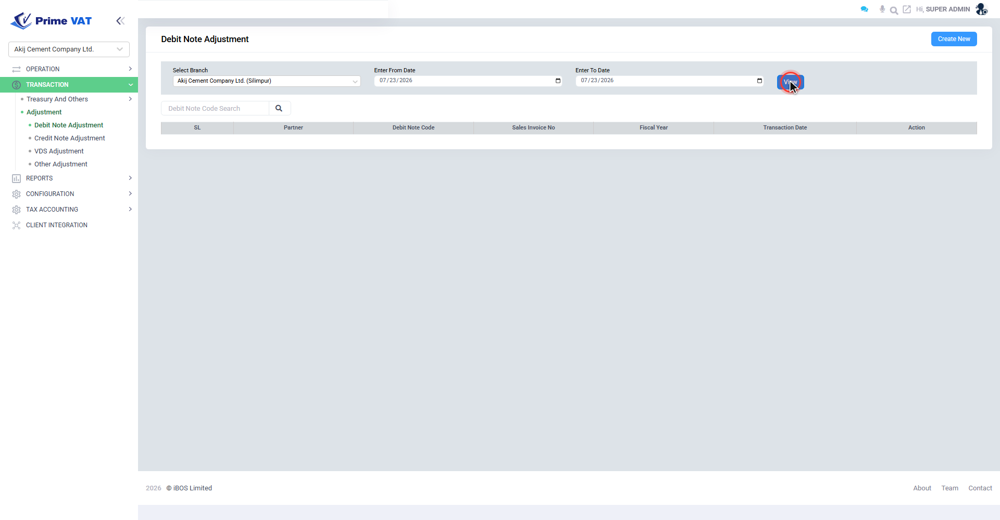

**Page purpose:** This page is used for managing and viewing debit note adjustments.

**Route:** `/transaction/adjustment/debitNoteAdjustment`

<!-- manual-meta: {"module": "Transaction", "page": "Debit Note Adjustment", "task": "View Debit Note Adjustments", "action": "view", "roles": [], "route": "/transaction/adjustment/debitNoteAdjustment", "screenshots": ["screenshots/transaction/debit_note_adjustment.png", "screenshots/transaction/debit_note_adjustment_show.png"], "keywords": ["debit note", "adjustment", "view", "transaction"], "task_order": 1} -->
#### Task: View Debit Note Adjustments

**Purpose:** Display debit note adjustment records.

**Required roles:**
* No role restriction was identified

**Prerequisites:**
* None.

**Steps:**
1. Select the branch from the dropdown.
2. Enter the 'From Date'.
3. Enter the 'To Date'.
4. Click 'View'.

**Fields and controls:**
* **SL:** Serial number of the entry.
* **Partner:** The partner involved in the transaction.
* **Debit Note Code:** Unique code for the debit note.
* **Sales Invoice No:** The associated sales invoice number.
* **Fiscal Year:** The fiscal year of the transaction.
* **Transaction Date:** The date the transaction occurred.

**Expected result:** List of debit note adjustments appears in the table.

**Warnings:**
* No specific warning was identified

**Search keywords:** debit note, adjustment, view, transaction

### Page: Other Adjustment

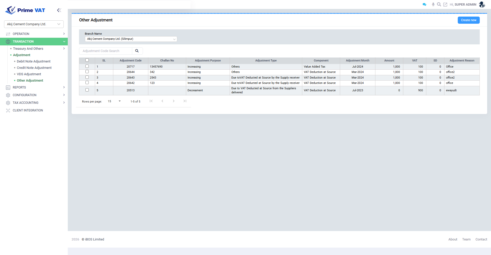

**Page purpose:** Displays a summary list of other types of financial adjustments.

**Route:** `/transaction/adjustment/otherAdjustment`

<!-- manual-meta: {"module": "Transaction", "page": "Other Adjustment", "task": "View Other Adjustments", "action": "view", "roles": [], "route": "/transaction/adjustment/otherAdjustment", "screenshots": ["screenshots/transaction/other_adjustment.png"], "keywords": ["other adjustment", "miscellaneous", "list"], "task_order": 1} -->
#### Task: View Other Adjustments

**Purpose:** Review a list of miscellaneous adjustments.

**Required roles:**
* No role restriction was identified

**Prerequisites:**
* None.

**Steps:**
1. Click on 'Transaction' in the menu.
2. Click on 'Adjustment'.
3. Select 'Other Adjustment'.

**Fields and controls:**
* **Adjustment Code:** The unique identification code for the adjustment.
* **Challan No:** The challan reference number.
* **Adjustment Purpose:** The intent or purpose of the adjustment.
* **Amount:** The monetary value of the adjustment.

**Expected result:** A table showing recorded other adjustments is displayed.

**Warnings:**
* No specific warning was identified

**Search keywords:** other adjustment, miscellaneous, list

### Page: User Profile

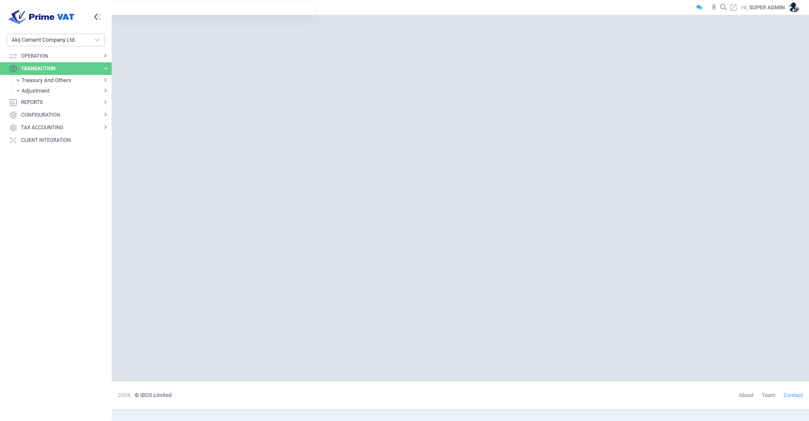

**Page purpose:** This page contains the controls and information shown in the captured interface.

**Route:** `https://devprimevat.ibos.io/transaction`

<!-- manual-meta: {"module": "Transaction", "page": "User Profile", "task": "Use User Profile", "action": "view", "roles": [], "route": "https://devprimevat.ibos.io/transaction", "screenshots": ["screenshots/transaction/transaction.png"], "keywords": ["User Profile", "transaction"], "task_order": 1} -->
#### Task: Use User Profile

**Purpose:** Review and use the visible page functions.

**Required roles:**
* No role restriction was identified

**Prerequisites:**
* None identified from the interface

**Steps:**
1. Open the User Profile page.
2. Review the visible controls, fields, and table columns.
3. Choose the required available action for your work.

**Fields and controls:**
* No specific fields were identified from the available evidence.

**Expected result:** The requested page information or form is displayed.

**Warnings:**
* Only actions visible in the captured interface are documented.

**Search keywords:** User Profile, transaction

### Page: User Profile

**Page purpose:** This page contains the controls and information shown in the captured interface.

**Route:** `https://devprimevat.ibos.io/transaction/treasuryAndOthers`

<!-- manual-meta: {"module": "Transaction", "page": "User Profile", "task": "Use User Profile", "action": "view", "roles": [], "route": "https://devprimevat.ibos.io/transaction/treasuryAndOthers", "screenshots": ["screenshots/transaction/treasury_and_others.png"], "keywords": ["User Profile", "treasury and others"], "task_order": 1} -->
#### Task: Use User Profile

**Purpose:** Review and use the visible page functions.

**Required roles:**
* No role restriction was identified

**Prerequisites:**
* None identified from the interface

**Steps:**
1. Open the User Profile page.
2. Review the visible controls, fields, and table columns.
3. Choose the required available action for your work.

**Fields and controls:**
* No specific fields were identified from the available evidence.

**Expected result:** The requested page information or form is displayed.

**Warnings:**
* Only actions visible in the captured interface are documented.

**Search keywords:** User Profile, treasury and others

### Page: Treasury Deposit

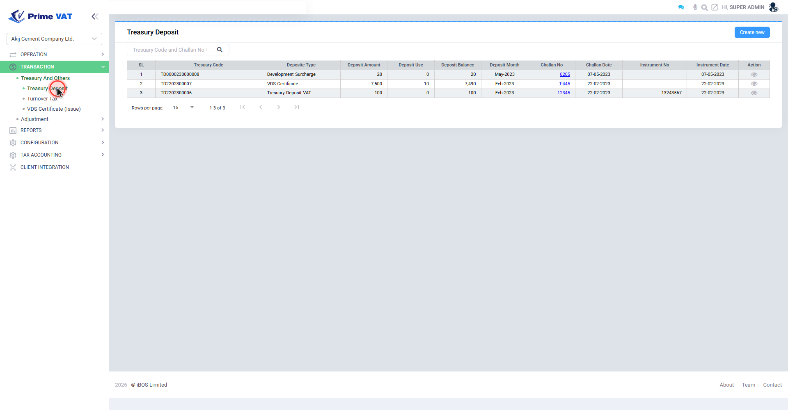

**Page purpose:** This page manages treasury deposit records.

**Route:** `/transaction/treasuryAndOthers/treasuryDeposit`

<!-- manual-meta: {"module": "Transaction", "page": "Treasury Deposit", "task": "Search Treasury Deposit", "action": "search", "roles": [], "route": "/transaction/treasuryAndOthers/treasuryDeposit", "screenshots": ["screenshots/transaction/treasury_deposit.png"], "keywords": ["search", "treasury deposit", "challan"], "task_order": 1} -->
#### Task: Search Treasury Deposit

**Purpose:** Find a specific treasury deposit record using its code or challan number.

**Required roles:**
* No role restriction was identified

**Prerequisites:**
* At least one treasury deposit record must exist.

**Steps:**
1. Enter the treasury code or challan number in the search bar.
2. Click the search icon.

**Fields and controls:**
* **Tresuary Code and Challan No Search:** Input field for finding records.

**Expected result:** Relevant record(s) matching the search term are displayed.

**Warnings:**
* No specific warning was identified

**Search keywords:** search, treasury deposit, challan

### Page: Turnover Tax

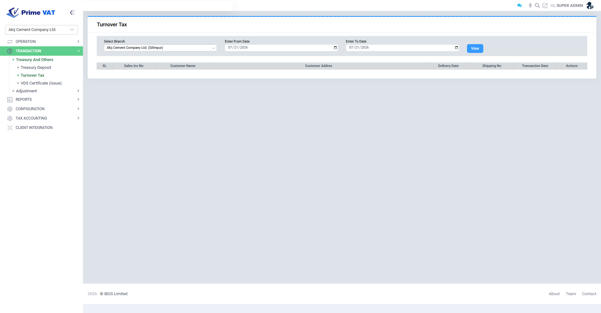

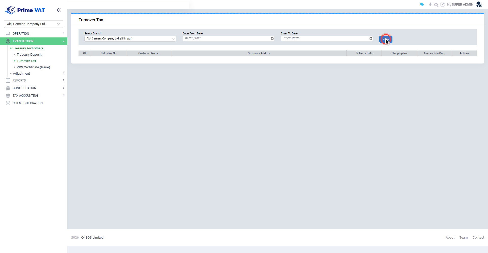

**Page purpose:** This page allows users to view turnover tax information based on branch and date criteria.

**Route:** `/transaction/treasuryAndOthers/turnoverTax`

<!-- manual-meta: {"module": "Transaction", "page": "Turnover Tax", "task": "Filter Turnover Tax Records", "action": "filter", "roles": [], "route": "/transaction/treasuryAndOthers/turnoverTax", "screenshots": ["screenshots/transaction/turnover_tax.png", "screenshots/transaction/turnover_tax_show.png"], "keywords": ["turnover tax", "filter", "transaction"], "task_order": 1} -->
#### Task: Filter Turnover Tax Records

**Purpose:** Retrieve turnover tax transactions within a specific timeframe.

**Required roles:**
* No role restriction was identified

**Prerequisites:**
* None.

**Steps:**
1. Select the branch.
2. Select the start date.
3. Select the end date.
4. Click 'View'.

**Fields and controls:**
* **Select Branch:** The business branch to filter by.
* **Enter From Date:** The start date of the reporting period.
* **Enter To Date:** The end date of the reporting period.

**Expected result:** Transactions related to turnover tax for the selected branch and period are displayed.

**Warnings:**
* No specific warning was identified

**Search keywords:** turnover tax, filter, transaction

### Page: VDS Adjustment

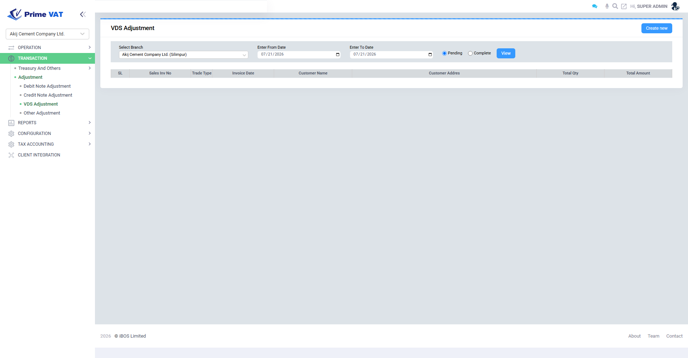

**Page purpose:** Used to view and manage Value Deducted at Source (VDS) adjustments for sales invoices.

**Route:** `/transaction/adjustment/vdsAdjustment`

<!-- manual-meta: {"module": "Transaction", "page": "VDS Adjustment", "task": "Search VDS Adjustments", "action": "filter", "roles": [], "route": "/transaction/adjustment/vdsAdjustment", "screenshots": ["screenshots/transaction/vds_adjustment.png", "screenshots/transaction/vds_adjustment_show.png"], "keywords": ["VDS", "adjustment", "search", "filter", "VAT"], "task_order": 1} -->
#### Task: Search VDS Adjustments

**Purpose:** To find specific VDS adjustment records based on branch, date range, and status.

**Required roles:**
* No role restriction was identified

**Prerequisites:**
* User must be logged in.
* Must have access to the Transaction module.

**Steps:**
1. Navigate to Transaction > Adjustment > VDS Adjustment.
2. Select a branch from the 'Select Branch' dropdown.
3. Enter the 'From Date' and 'To Date'.
4. Select the status ('Pending' or 'Complete') using the radio buttons.
5. Click the 'View' button.

**Fields and controls:**
* **Select Branch:** Dropdown to select the operating branch.
* **Enter From Date:** Start date for the search range.
* **Enter To Date:** End date for the search range.
* **Pending:** Filter for adjustments awaiting action.
* **Complete:** Filter for finalized adjustments.

**Expected result:** The table below will populate with records matching the selected criteria.

**Warnings:**
* No specific warning was identified

**Search keywords:** VDS, adjustment, search, filter, VAT

### Page: VAT Deduct at Source (VDS Certificate)

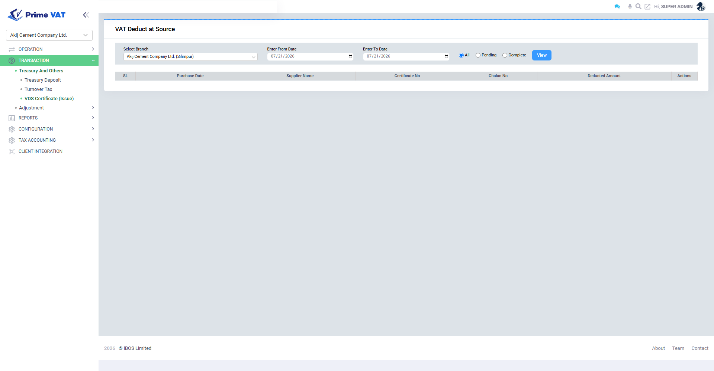

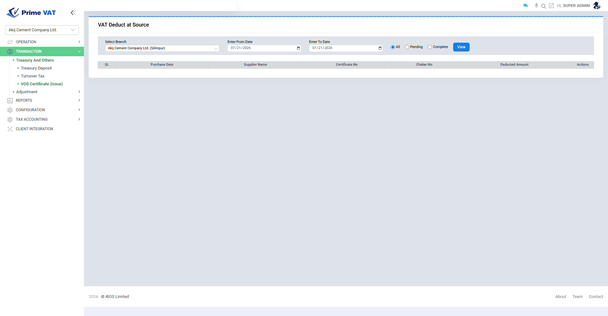

**Page purpose:** Used to view and manage issued VAT Deduct at Source certificates.

**Route:** `/transaction/treasuryAndOthers/varDeductatSource`

<!-- manual-meta: {"module": "Transaction", "page": "VAT Deduct at Source (VDS Certificate)", "task": "View VDS Certificates", "action": "filter", "roles": [], "route": "/transaction/treasuryAndOthers/varDeductatSource", "screenshots": ["screenshots/transaction/vds_certificate_issue.png", "screenshots/transaction/vds_certificate_issue_show.png"], "keywords": ["VDS", "Certificate", "VAT", "deduct at source", "treasury"], "task_order": 1} -->
#### Task: View VDS Certificates

**Purpose:** To list VDS certificates based on status and date range.

**Required roles:**
* No role restriction was identified

**Prerequisites:**
* User must be logged in.
* Must have access to the Treasury And Others sub-module.

**Steps:**
1. Navigate to Transaction > Treasury And Others > VDS Certificate (Issue).
2. Select the 'Select Branch'.
3. Enter 'From Date' and 'To Date'.
4. Select the filter status: 'All', 'Pending', or 'Complete'.
5. Click the 'View' button.

**Fields and controls:**
* **Select Branch:** The branch associated with the VDS issuance.
* **All:** Show certificates regardless of status.
* **Pending:** Show unissued or pending certificates.
* **Complete:** Show finalized/issued certificates.

**Expected result:** A table displays records including Purchase Date, Supplier Name, Certificate No, Chalan No, and Deducted Amount.

**Warnings:**
* No specific warning was identified

**Search keywords:** VDS, Certificate, VAT, deduct at source, treasury
