# PeopleDesk — User Manual

## 1. 🚀 Introduction & Overview

**PeopleDesk** is a comprehensive, web-based Human Resource Information System (HRIS) that covers the full employee lifecycle — from hiring and onboarding, through attendance, leave, payroll, performance, and benefits, to separation and retirement. It is organized as a set of independent modules reachable from a central app-launcher style overview page, each covering one HR function area in depth.

The system supports multiple companies/organizations under one login (shown in the top bar, e.g. "PeopleDesk Demo") and is role-based: what a given user sees and can do depends on their assigned role (Employee, Supervisor, HR Admin, etc.).

**Who this tool is for:**
- **Employees**, who use **Employee Self Service** to check their own attendance, apply for leave, request loans, view payslips, and more.
- **HR administrators**, who use **Employee Management**, **Administration**, and **Compensation & Benefits** to maintain employee records, company policies, and run payroll.
- **Managers/Supervisors**, who review and approve requests via the **Approval** module.
- **Finance/payroll teams**, who manage salary generation, provident fund, gratuity, and loans via **Compensation & Benefits**, **Benefits Management**, and **Loan Management**.
- **Department heads**, who track team performance via the **Performance Management System**.

## 2. 🗺️ UI Navigation Map (Layout Breakdown)

Every page in PeopleDesk shares the same layout:

| Zone | Location | What you'll find |
|---|---|---|
| **Top Bar** | Full width, top of screen | Hamburger menu (☰, opens the full module tree), global search, active company selector, notifications, chat, and the logged-in user's account menu. |
| **Overview / Home** | Landing page after login | A grid of module tiles — Dashboard, Employee Management, Administration, Approval, Employee Self Service, Compensation & Benefits, Asset Management, Performance Management System, Training & Development, Retirement, Log Monitor, Benefits Management, and Loan Management. Clicking a tile opens that module. |
| **Left Sidebar** | Fixed left column, inside each module | The selected module's own menu, organized into groups (e.g. Administration's sidebar groups: Role Management, Leave And Movement, Time Management, Control Panel). Click a group to see its pages. |
| **Main Content Area** | Center/right, largest area | The active page: typically a filter bar (branch/date/status) and a **Create**-style action button top-right, with a data table or form below. |

**A note on the "Recruitment" tile**: the overview page shows a Recruitment tile, but in this demo account it is not a functional module — it does not appear in the real navigation menu (opened via the ☰ hamburger icon), and clicking it simply reloads the homepage. It has been left out of this manual.

Each of the 13 functional modules is documented in its own section below, page by page — every visible button (Create, Edit, View/Search, Export, Bulk Upload, etc.) is explained, with an accompanying screenshot.

## 3. Dashboard Module

Quick personal-attendance and org-context views. Four lenses on the same information: your own record, your team's, a management rollup, and your official service book.

#### Employee (Dashboard)

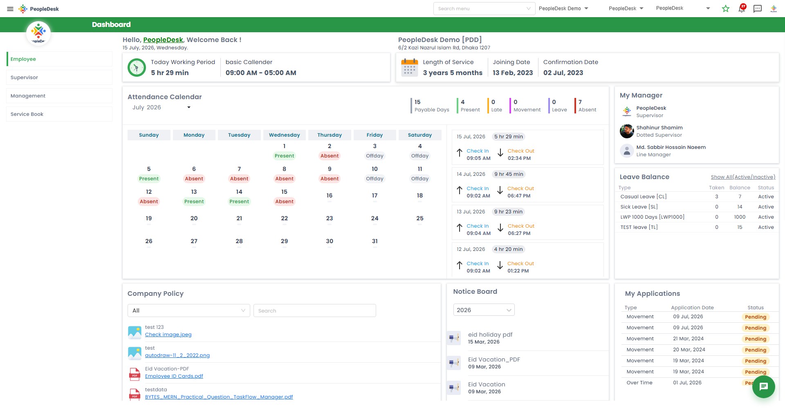

**What it does**: This is the personal landing page every employee sees after logging in. It gives a quick snapshot of the day's attendance, leave balances, length of service, company documents, and personal application history, all in one place.

**Key fields / columns**:
- Today Working Period, basic Caller (shift time)
- Length of Service, Joining Date, Confirmation Date
- Attendance Calendar: Payable Days, Present, Late, Movement, Leave, Absent counters, plus a day-by-day calendar grid (Present/Absent/Offday tags)
- Check In / Check Out list with worked hours per day
- My Manager panel: Supervisor, Dotted Supervisor, Line Manager (with photos/roles)
- Leave Balance table: Type, Taken, Balance, Status
- Company Policy list: file name and download link
- Notice Board list: file name and posted date
- My Applications table: Type, Application Date, Status

**Buttons & actions**:
- Left-side tabs (Employee, Supervisor, Management, Service Book) switch between dashboard views.
- Month dropdown on the Attendance Calendar to browse other months.
- "Show All (Active/Inactive)" link next to Leave Balance opens the full leave-type list, including inactive ones.
- Dropdown filter ("All") and Search box under Company Policy to filter uploaded documents.
- Year dropdown under Notice Board to filter notices by year.
- File links (e.g., "Check image.jpeg", "Employee ID Cards.pdf") open/download the attached documents.

**How to use it**: 1. Log in and land on this page automatically. 2. Check your today's working hours and leave balances at a glance. 3. Use the Attendance Calendar month dropdown to review past attendance. 4. Open Company Policy or Notice Board files for reference. 5. Track pending applications (e.g., Movement, Overtime) in the My Applications table.

**Pro-tip**: The Leave Balance panel only shows active leave types by default — click "Show All (Active/Inactive)" if a leave type you expect (like a special one-off leave) seems to be missing.

---

#### Supervisor (Dashboard)

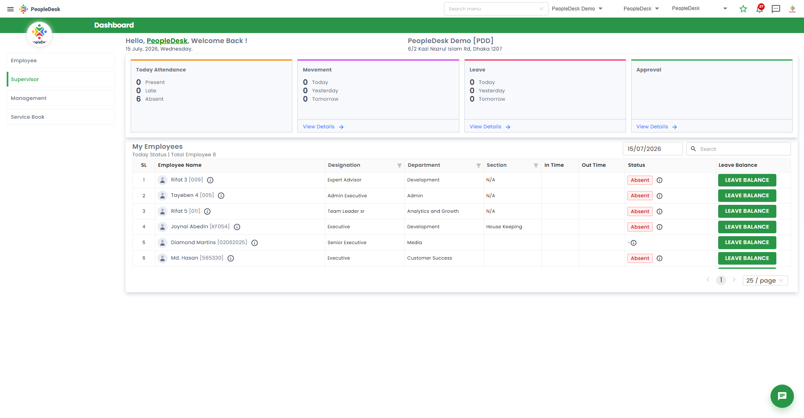

**What it does**: Gives supervisors a team-level overview of today's attendance, movement, leave, and pending approvals for the people who report to them, plus a live list of their direct reports.

**Key fields / columns**:
- Today Attendance: Present, Late, Absent counts
- Movement: Today, Yesterday, Tomorrow counts
- Leave: Today, Yesterday, Tomorrow counts
- Approval summary card
- My Employees table: SL, Employee Name, Designation, Department, Section, In Time, Out Time, Status, Leave Balance

**Buttons & actions**:
- "View Details" links on the Today Attendance, Movement, Leave, and Approval cards drill into the full report for each.
- Date field (defaults to today) to check team status for a specific day.
- Search box to find a specific employee in the My Employees table.
- Column filter icons (funnel) on Designation and Department to narrow the list.
- "LEAVE BALANCE" button per row opens that employee's leave balance detail.
- Pagination controls and "25 / page" page-size selector at the bottom.

**How to use it**: 1. Open the Supervisor tab from the dashboard sidebar. 2. Scan the top summary cards for today's team attendance/movement/leave snapshot. 3. Click "View Details" on any card for the full breakdown. 4. Use the date field or search box to check a different day or find a specific team member. 5. Click "LEAVE BALANCE" next to an employee to see their available leave.

**Pro-tip**: Change the date field to a past date to quickly audit whether a specific team member was marked Present/Absent on that day, without leaving the dashboard.

---

#### Management (Dashboard)

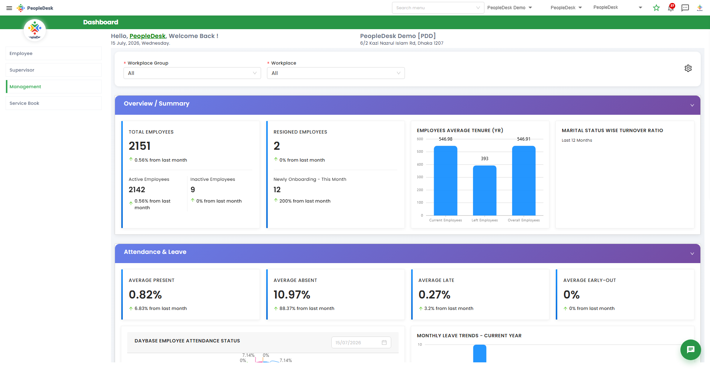

**What it does**: A company-wide analytics dashboard for management, summarizing headcount, turnover, tenure, and attendance/leave trends across the whole organization.

**Key fields / columns**:
- Workplace Group and Workplace filter dropdowns
- Overview/Summary: Total Employees, Active Employees, Inactive Employees, Resigned Employees, Newly Onboarding – This Month, Employees Average Tenure (yr) bar chart (Current/Left/Overall Employees), Marital Status Wise Turnover Ratio (last 12 months)
- Attendance & Leave: Average Present, Average Absent, Average Late, Average Early-Out percentages, Daybase Employee Attendance Status, Monthly Leave Trends – Current Year chart

**Buttons & actions**:
- Workplace Group and Workplace dropdowns filter every metric on the page to a specific location/group.
- Gear/settings icon (top right) to configure the dashboard widgets.
- Collapsible section headers ("Overview / Summary", "Attendance & Leave") with a chevron to expand/collapse each block.
- Date field next to "Daybase Employee Attendance Status" to pick the day shown.

**How to use it**: 1. Select a Workplace Group and Workplace (or leave as "All" for the whole company). 2. Review the Overview/Summary cards for headcount and turnover trends. 3. Expand the Attendance & Leave section to check average attendance percentages and monthly leave trends. 4. Use the date picker to inspect attendance on a specific day.

**Pro-tip**: Filter by Workplace before reading the turnover/tenure charts — the "All" view blends every location together and can mask problems specific to one site.

---

#### Service Book (Dashboard)

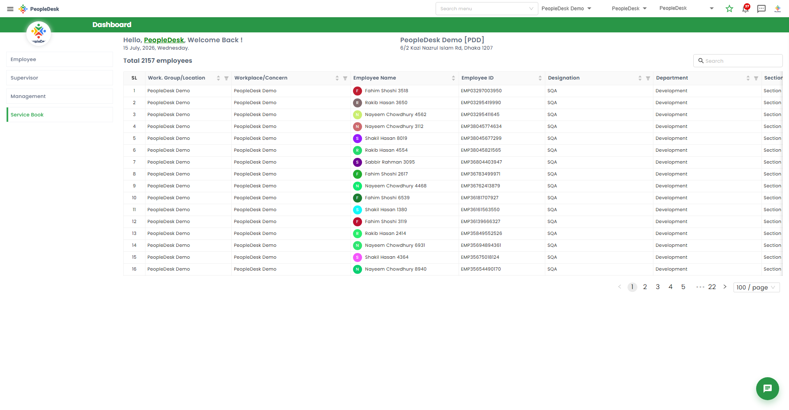

**What it does**: A master, searchable directory of every employee in the system with their workplace, ID, designation, department, and section — useful as a quick company-wide employee register.

**Key fields / columns**:
- Work. Group/Location, Workplace/Concern, Employee Name, Employee ID, Designation, Department, Section (and more columns off-screen)

**Buttons & actions**:
- Search box (top right) to find an employee by name or ID.
- Sort arrows and filter icons on column headers (Work. Group/Location, Workplace/Concern, Employee Name, Employee ID, Designation, Department, Section) to sort or filter the list.
- Pagination controls with page numbers and a "100 / page" page-size dropdown to browse the full roster (2,157 employees across 22 pages in this example).

**How to use it**: 1. Open the Service Book tab. 2. Use the Search box to jump to a specific employee. 3. Click a column's filter icon to narrow results (e.g., by Department). 4. Page through the roster using the pagination controls, or increase the page size to see more rows at once.

**Pro-tip**: Sort by "Department" or "Designation" first if you need to review an entire team's records together, rather than scrolling through the full alphabetical list.

---

## 4. Employee Management Module

The HR admin's day-to-day workspace for maintaining every employee record and processing the requests employees submit — confirmations, attendance adjustments, leave, loans, transfers, and the full library of HR reports.

#### Employee

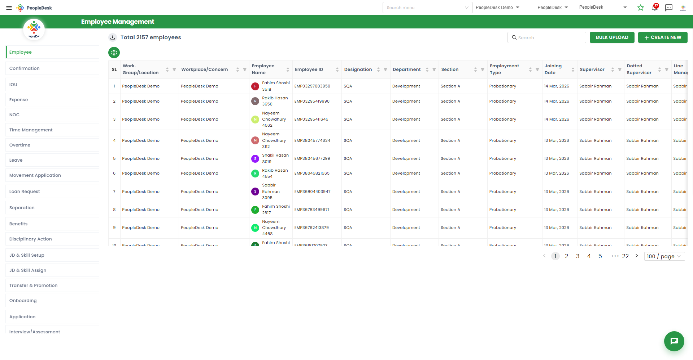

**What it does**: This is the master employee database for the whole organization — a searchable, sortable directory of every employee record in PeopleDesk. The header confirms the scale of this table: "Total 2157 employees."

**Key fields / columns**: Work Group/Location, Workplace/Concern, Employee Name (with avatar), Employee ID, Designation, Department, Section, Employment Type, Joining Date, Supervisor, Dotted Supervisor, Line Manager, and more columns that continue off-screen to the right (the visible view is cut off after "Line Manager" — because this is the largest table in the system, scroll right to see additional columns not captured in the screenshot).

**Buttons & actions**:
- **Download icon** (top left, next to the title): exports the employee list.
- **Search box**: filters the table by typing a name, ID, or other visible text.
- **BULK UPLOAD**: opens a bulk import flow to add or update many employee records at once via a spreadsheet template, instead of creating them one by one.
- **+ CREATE NEW**: opens the Create Employee form (see below).
- **Gear/settings icon** (below the header row): lets you customize which columns are shown in the table.
- Column headers have **sort arrows** and **filter funnels** (visible on Work. Group/Location, Workplace/Concern, Employee Name, Employee ID, Designation, Department, Section, Employment Type, Joining Date, Supervisor, Dotted Supervisor) to sort or filter the list by that column.
- **Pagination controls** at the bottom (page numbers 1–22, and a "100 / page" selector) let you move through the 2,157 records.

If a `_create` file is listed for this page: embed it too.

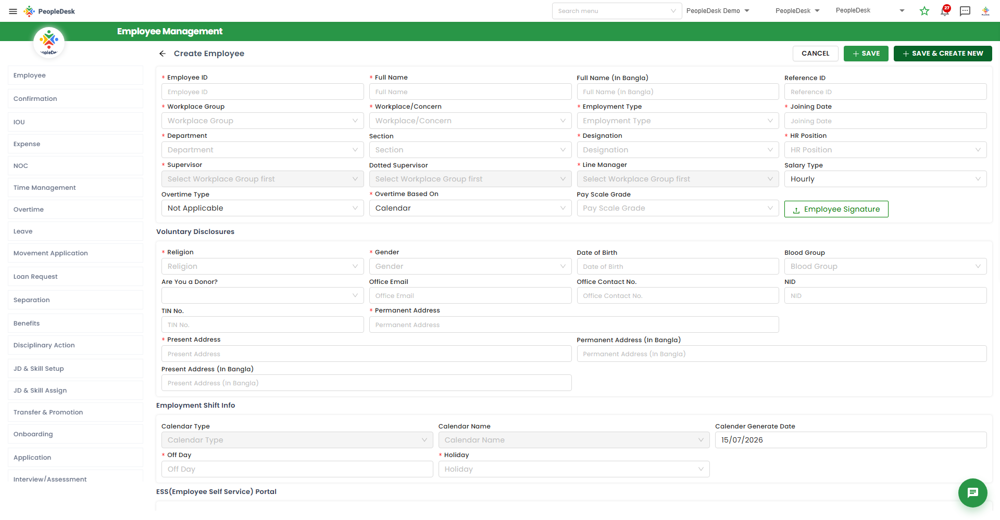

The Create form is organized into clear sections:
- **Core identity/assignment fields** (required, marked with red asterisks): Employee ID, Full Name, Full Name (In Bangla), Reference ID, Workplace Group, Workplace/Concern, Employment Type, Joining Date, Department, Section, Designation, HR Position, Supervisor, Dotted Supervisor, Line Manager, Salary Type (defaults to "Hourly"), Overtime Type (defaults to "Not Applicable"), Overtime Based On (defaults to "Calendar"), Pay Scale Grade, and an **Employee Signature** upload button.
- **Voluntary Disclosures** section: Religion, Gender, Date of Birth, Blood Group, Are You a Donor?, Office Email, Office Contact No., NID, TIN No., Permanent Address, Present Address, and Bangla versions of both addresses.
- **Employment Shift Info** section: Calendar Type, Calendar Name, Calendar Generate Date (pre-filled with today's date), Off Day, Holiday.
- **ESS (Employee Self Service) Portal** section (partially visible at the bottom).

**Buttons & actions on the Create form**: **CANCEL** (discards and returns to the list), **+ SAVE** (creates the employee and returns to the list), **+ SAVE & CREATE NEW** (creates this employee and immediately reopens a blank form for the next one — useful for onboarding several employees in a row).

**How to use it**:
1. Click **Employee** in the left menu to open the directory.
2. Use **Search** or the column filters/sort arrows to locate a specific person in the 2,157-row table.
3. Click **+ CREATE NEW** to add a single employee, fill in the required (red asterisk) fields across all sections, then click **SAVE** (or **SAVE & CREATE NEW** to keep adding more).
4. For onboarding many employees at once, use **BULK UPLOAD** instead of filling the form repeatedly.

**Pro-tip**: Before creating employees one at a time, check whether **BULK UPLOAD** already has a template — it is far faster when onboarding a batch of new hires, and it reduces the risk of typos across required fields like Employee ID and Workplace Group.

---

#### Confirmation

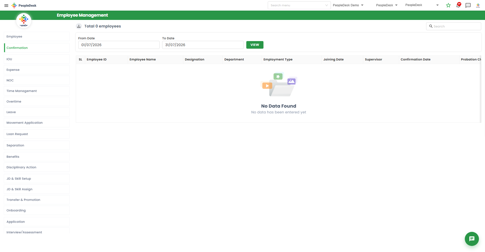

**What it does**: Tracks employees whose probation period is ending and who are due for confirmation (converting from probationary to permanent status) within a chosen date range.

**Key fields / columns**: Employee ID, Employee Name, Designation, Department, Employment Type, Joining Date, Supervisor, Confirmation Date, Probation Close (column partially cut off on the right, indicating more columns exist beyond the visible frame).

**Buttons & actions**:
- **From Date** / **To Date**: date pickers to define the reporting window.
- **VIEW**: runs the search and populates the table for the selected date range.
- **Search box** (top right): filters the results list.
- **Download icon**: exports the report.

**Show/detail view**: The `confirmation_show.png` screenshot is identical to the default list view — clicking **VIEW** for the pre-filled date range (01/07/2026 to 31/07/2026) simply returned "No Data Found. No data has been entered yet," meaning no employees currently fall due for confirmation in that window. It is not a separate record-detail screen.

**How to use it**:
1. Click **Confirmation** in the left menu.
2. Set the **From Date** and **To Date** to the period you want to review.
3. Click **VIEW** to load matching employees.
4. If the table is empty, widen the date range or confirm that eligible employees exist for that period.

**Pro-tip**: If you expect results but see "No Data Found," double-check the date range first — this page only shows employees whose confirmation/probation-close dates fall inside the selected window.

---

#### Application

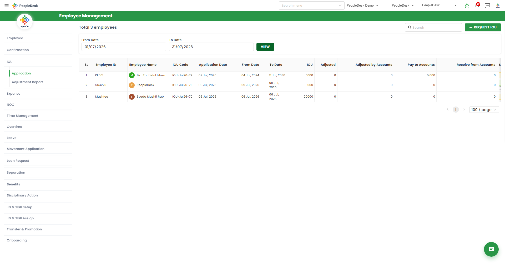

**What it does**: This is the **IOU** (an advance/loan-style request an employee raises against future settlement — literally "I Owe You") Application list, showing all IOU requests raised by employees within a date range, along with their adjustment/repayment status.

**Key fields / columns**: Employee ID, Employee Name, IOU Code, Application Date, From Date, To Date, IOU (amount requested), Adjusted, Adjusted by Accounts, Pay to Accounts, Receive from Accounts, and at least one more column cut off on the right edge (marked with an info icon).

**Buttons & actions**:
- **From Date** / **To Date** + **VIEW**: filters the list to IOUs raised in that period.
- **Search box**: searches within the results.
- **+ REQUEST IOU**: opens the form to submit a new IOU request.
- Left sub-menu under IOU: **Application** (this list) and **Adjustment Report** (see next section).

**Show view**: `application_show.png` is the same list (filtered to the same date range), confirming this is a live results view rather than a separate modal.

**How to use it**:
1. Click **IOU > Application** in the left menu.
2. Set **From Date**/**To Date** and click **VIEW** to see IOUs raised in that period.
3. Click **+ REQUEST IOU** to submit a new advance request.
4. Track each request's **Adjusted**, **Pay to Accounts**, and **Receive from Accounts** columns to see repayment progress.

**Pro-tip**: Use the **Search** box combined with a wide date range when tracing a specific employee's full IOU history rather than repeatedly narrowing the date filter.

---

#### Adjustment Report

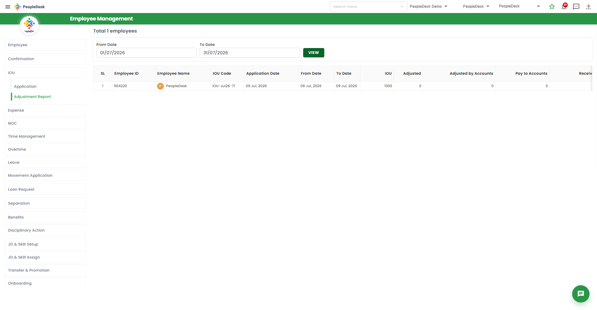

**What it does**: Shows the same IOU records filtered specifically for reviewing how each advance is being adjusted (repaid or offset) — a sub-view under IOU used to reconcile outstanding IOU balances.

**Key fields / columns**: Employee ID, Employee Name, IOU Code, Application Date, From Date, To Date, IOU, Adjusted, Adjusted by Accounts, Pay to Accounts, Receive (column cut off on the right — more columns exist beyond the visible frame).

**Buttons & actions**:
- **From Date** / **To Date** + **VIEW**: filters the adjustment report to a specific period.
- **Search box**: filters within results.

**Show view**: `adjustment_report_show.png` displays the identical single-row result (Employee 564220 / IOU-Jul26-71) as the default view — this is the live filtered list, not a separate popup.

**How to use it**:
1. Click **IOU > Adjustment Report** in the left menu.
2. Set the date range and click **VIEW**.
3. Review the **Adjusted**, **Adjusted by Accounts**, and **Pay to Accounts** columns to confirm how much of each IOU has been settled.

**Pro-tip**: Cross-check this report against the **Application** list periodically — an IOU with a non-zero balance and no recent adjustment activity may need a follow-up with Accounts.

---

#### Expense Application

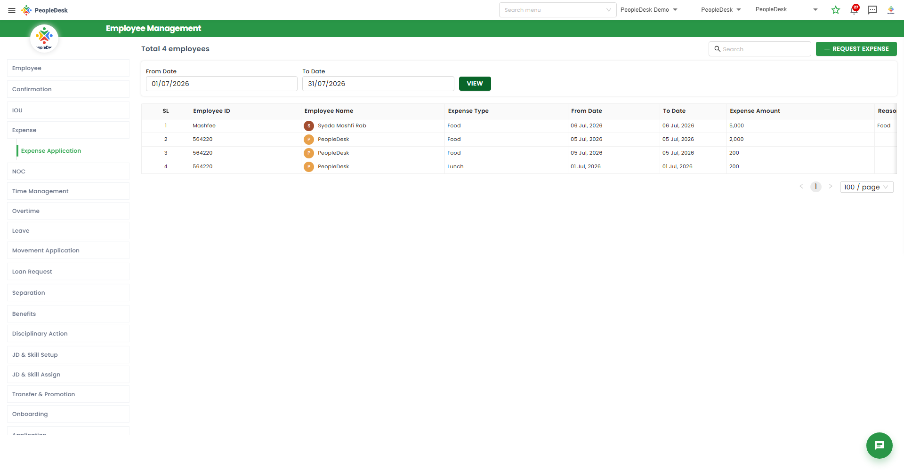

**What it does**: Lists employee expense reimbursement requests (e.g., food, lunch, travel expenses) submitted for a given date range.

**Key fields / columns**: Employee ID, Employee Name, Expense Type, From Date, To Date, Expense Amount, Reason (column cut off on the right edge).

**Buttons & actions**:
- **From Date** / **To Date** + **VIEW**: filters expenses to a specific period.
- **Search box**: searches the results.
- **+ REQUEST EXPENSE**: opens a form to submit a new expense reimbursement claim.

**Show view**: `expense_application_show.png` is identical to the default list — the same 4 expense records for the same date range, confirming this is the live table rather than a distinct detail screen.

**How to use it**:
1. Click **Expense > Expense Application** in the left menu.
2. Set the date range and click **VIEW** to see submitted claims.
3. Click **+ REQUEST EXPENSE** to file a new expense claim (e.g., for food or travel).
4. Review the **Expense Amount** and **Reason** columns to verify each claim before approval/processing.

**Pro-tip**: Group similar expense types (e.g., multiple "Food" entries) together when reviewing, since the table doesn't total amounts by type automatically — export the list if you need a summed total.

---

#### NOC Application

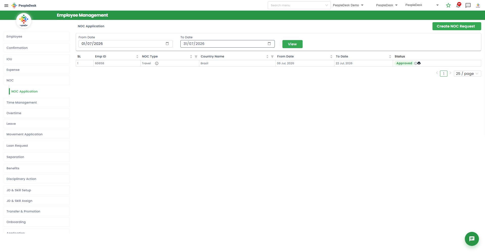

**What it does**: Manages **NOC** (No Objection Certificate — an official letter confirming the employer has no objection to an employee's request, e.g., for travel abroad) applications, showing their type, destination country, date range, and approval status.

**Key fields / columns**: Emp ID, NOC Type, Country Name, From Date, To Date, Status (e.g., "Approved").

**Buttons & actions**:
- **From Date** / **To Date** + **View**: filters NOC applications by date.
- **Create NOC Request**: opens the NOC Application Form to submit a new request.
- Column headers for NOC Type and Country Name have **sort/filter icons**.
- The **Status** column shows an info icon (for details) and a **print icon** to print the approved NOC.
- **Pagination** ("25 / page") at the bottom.

If a `_create` file is listed for this page: embed it too.

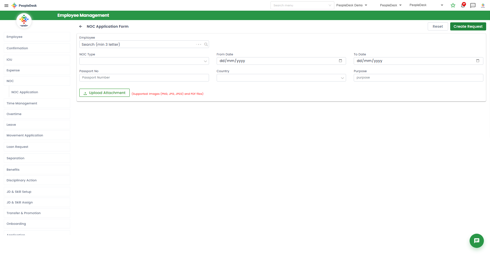

**Create form fields**: Employee (search, min 3 letters), NOC Type (dropdown), From Date, To Date, Passport No, Country (dropdown), Purpose, and an **Upload Attachment** button (supports Images: PNG, JPG, JPEG, and PDF files).

**Buttons & actions on the Create form**: **Reset** (clears the form), **Create Request** (submits the NOC application).

**How to use it**:
1. Click **NOC > NOC Application** in the left menu.
2. Set a date range and click **View** to see existing NOC requests and their status.
3. Click **Create NOC Request**, search for and select the employee, choose the NOC Type and Country, fill in the Passport No and Purpose, optionally attach supporting documents, then click **Create Request**.
4. Use the print icon next to an approved NOC to generate a printable certificate.

**Pro-tip**: Attach the passport copy or travel itinerary at request time using **Upload Attachment** — it speeds up approval since reviewers won't need to request it separately.

---

#### Attendance Adjust

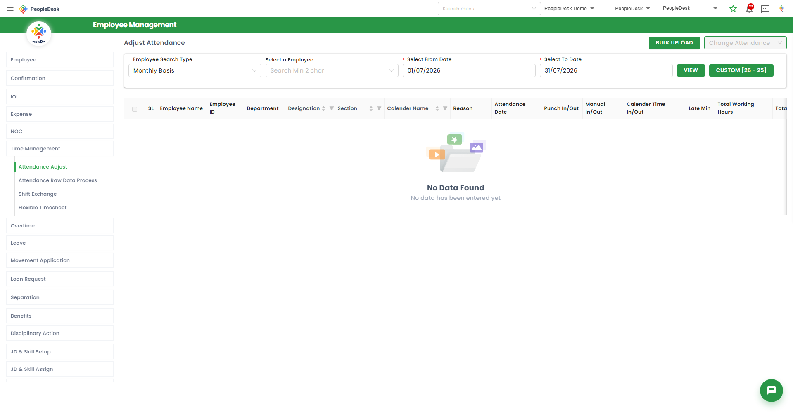

**What it does**: Lets HR or supervisors review and manually correct an employee's daily punch-in/punch-out attendance records — useful when the biometric/calendar system missed a punch or logged it incorrectly.

**Key fields / columns**: Employee Name, Employee ID, Department, Designation, Section, Calender Name, Reason, Attendance Date, Punch In/Out, Manual In/Out, Calender Time In/Out, Late Min, Total Working Hours, and further columns cut off on the right (more columns exist beyond the visible frame).

**Buttons & actions**:
- **Employee Search Type** dropdown (e.g., "Monthly Basis"): changes how results are grouped/searched.
- **Select a Employee**: search box (min 2 characters) to filter to one person.
- **Select From Date** / **Select To Date**: defines the reporting window.
- **VIEW**: loads records for the selected criteria.
- **CUSTOM [26 - 25]**: a custom date-range shortcut button.
- **BULK UPLOAD**: imports attendance corrections in bulk via spreadsheet.
- **Change Attendance** dropdown (top right): likely offers actions to change/adjust attendance entries in bulk.
- **Checkboxes** in the first column of each row let you select multiple records for a bulk action.

**Show view**: `attendance_adjust_show.png` shows the same page after a search returned real data — 11+ rows for employee "PeopleDesk" (564220) across July 2026, with Punch In/Out times, Late Min, and Total Working Hours populated. This confirms the page is a live, working attendance table (the first screenshot simply had no results for its default filter).

**How to use it**:
1. Click **Time Management > Attendance Adjust** in the left menu.
2. Choose an **Employee Search Type**, optionally search for a specific employee, and set the date range.
3. Click **VIEW** to load attendance rows.
4. Review **Punch In/Out** vs **Calender Time In/Out** to spot discrepancies, then correct entries as needed (via the row actions) or use **BULK UPLOAD** for many corrections at once.

**Pro-tip**: Watch the **Late Min** column — it flags exactly how many minutes late an employee's punch-in was relative to their scheduled Calendar Time, which is useful for late-arrival policy enforcement.

---

#### Attendance Raw Data Process

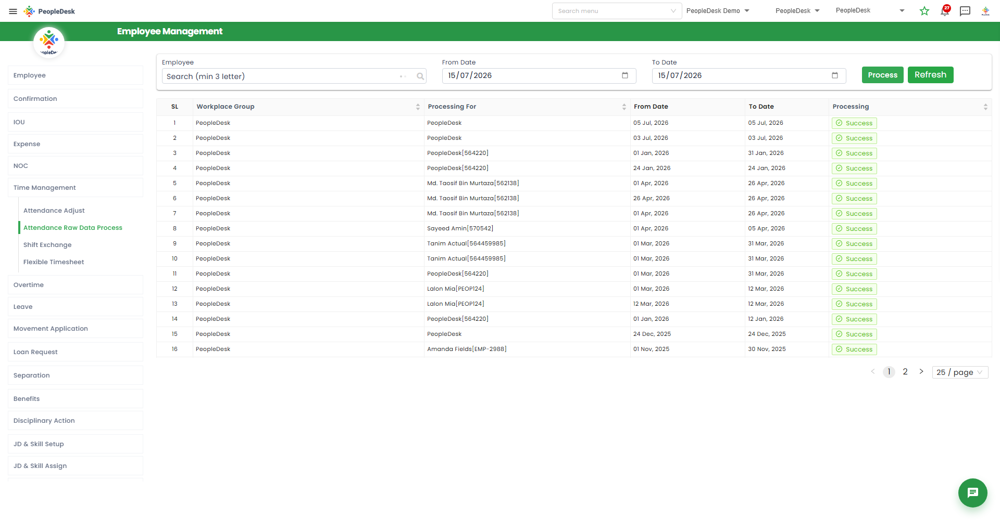

**What it does**: Processes raw punch/biometric attendance data into the system's usable attendance records for a chosen employee and date range, and shows a log of past processing runs.

**Key fields / columns**: SL, Workplace Group, Processing For (employee or group), From Date, To Date, Processing (status, e.g., "Success").

**Buttons & actions**:
- **Employee** search box (min 3 letters): target a specific employee for processing.
- **From Date** / **To Date**: date range for the raw data to process.
- **Process**: runs the raw-data-to-attendance conversion for the selected employee/date range.
- **Refresh**: reloads the processing log/table.
- **Pagination** ("25 / page", pages 1–2) at the bottom of the log table.

**How to use it**:
1. Click **Time Management > Attendance Raw Data Process** in the left menu.
2. Search for the employee (or leave blank for a workplace-wide run) and set the From/To Date.
3. Click **Process** to convert raw punch data into attendance records.
4. Check the log table below — each row shows whether the run for a given employee/date range succeeded.

**Pro-tip**: If an employee's Attendance Adjust page is missing recent punches, run this Raw Data Process for their date range first — attendance often needs to be processed from raw data before it appears elsewhere.

---

#### Shift Exchange

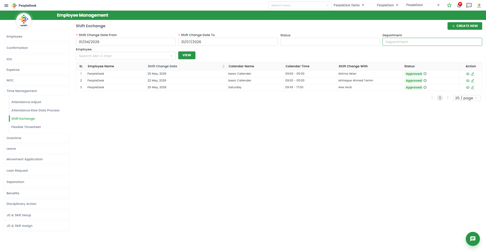

**What it does**: Manages requests where two employees swap their scheduled work shifts/calendars on a given date, and tracks the approval status of each swap.

**Key fields / columns**: Employee Name, Shift Change Date, Calendar Name, Calendar Time, Shift Change With (the other employee), Status (e.g., "Approved"), Action.

**Buttons & actions**:
- **Shift Change Date From** / **To**: filters the list by date range.
- **Status** and **Department** filter fields.
- **Employee** search box + **VIEW** button: filters to a specific employee.
- **+ CREATE NEW**: opens the Shift Exchange Request form.
- **Action column** icons: an **eye/info icon** to view details and a **pencil icon** to edit the request.

If a `_create` file is listed for this page: embed it too.

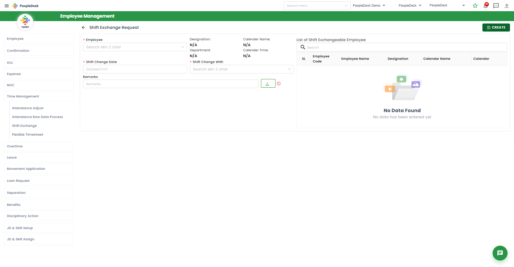

**Create form fields**: Employee (search), Shift Change Date, Shift Change With (search for the other employee), Remarks, plus read-only info fields that auto-fill once an employee is selected: Designation, Department, Calender Name, Calender Time. There is also an attachment upload button and a **List of Shift Exchangeable Employee** panel on the right with its own search box (shows "No Data Found" until an employee and date are selected).

**Buttons & actions on the Create form**: **CREATE** (submits the shift exchange request).

**How to use it**:
1. Click **Time Management > Shift Exchange** in the left menu to see existing requests.
2. Click **+ CREATE NEW**, select the requesting Employee and the Shift Change Date.
3. Search and select who to swap shifts with under **Shift Change With**; the right panel lists employees eligible for exchange.
4. Add Remarks if needed, then click **CREATE**.

**Pro-tip**: Select the Employee and Shift Change Date first — the "List of Shift Exchangeable Employee" panel only populates with valid swap candidates once those fields are filled in.

---

#### Flexible Timesheet

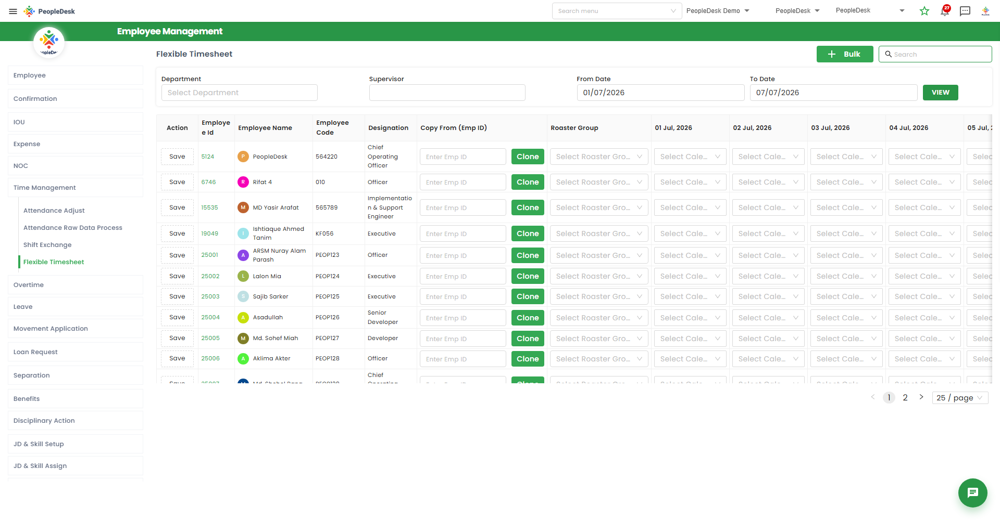

**What it does**: A bulk grid for assigning or copying each employee's daily work calendar/roster (per day, per employee) over a date range — useful for teams with flexible or rotating schedules.

**Key fields / columns**: Employee Id, Employee Name, Employee Code, Designation, Copy From (Emp ID), Roaster Group, and then one column per day in the selected range (01 Jul, 2026, 02 Jul, 2026, 03 Jul, 2026, etc., continuing off-screen — more date columns exist beyond the visible frame).

**Buttons & actions**:
- **Department** / **Supervisor** filters, **From Date** / **To Date** + **VIEW**: scopes which employees and days are shown.
- **+ Bulk** button: opens a dropdown (see `_create` screenshot) with **Download Template** and **Bulk Upload** options for mass-updating timesheets via spreadsheet.
- **Search box**: filters the employee list.
- Per-row **Save** button: saves that employee's row after manual edits.
- Per-row **Clone** button (next to "Copy From (Emp ID)"): copies another employee's calendar assignment into this row by entering their Emp ID.
- Each date column has a **Select Roaster Group** / **Select Calendar** dropdown per employee, per day.

If a `_create` file is listed for this page: embed it too.

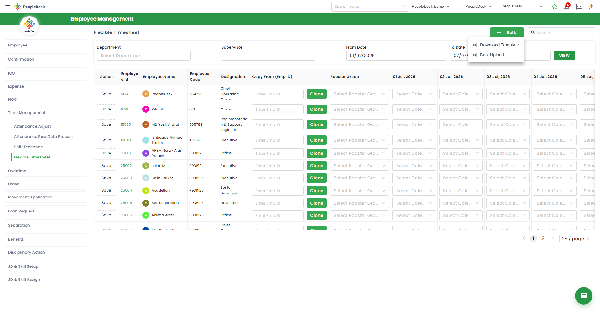

The "create" screenshot shows the **+ Bulk** button's dropdown menu open, revealing two options: **Download Template** (get the spreadsheet format to fill in offline) and **Bulk Upload** (import the completed spreadsheet back into the system). This is not a separate creation form — it's the bulk-import mechanism for this grid.

**Show view**: `flexible_timesheet_show.png` shows the same grid slightly dimmed/loading, consistent with the page having just processed an action (like opening the Bulk menu) — it is the same table, not a distinct detail page.

**How to use it**:
1. Click **Time Management > Flexible Timesheet** in the left menu.
2. Filter by Department/Supervisor and date range, then click **VIEW**.
3. To edit a single employee's day, pick a Calendar/Roaster from the dropdown under that date column and click **Save** on that row.
4. To copy one employee's schedule to another, enter the source Emp ID in **Copy From (Emp ID)** and click **Clone**.
5. For bulk changes, click **+ Bulk > Download Template**, fill it in offline, then **+ Bulk > Bulk Upload** it back.

**Pro-tip**: When many employees share the same rotating schedule, set up one employee's timesheet correctly first, then use **Clone** to copy it to the rest — it's much faster than setting each day's dropdown individually per person.

---

#### Bulk Overtime

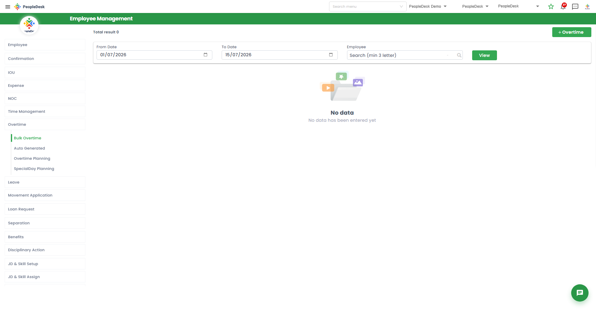

**What it does**: Lists overtime (OT) entries recorded for employees over a date range, and provides a way to add new OT entries either one at a time or in bulk.

**Key fields / columns**: The table was empty in this view ("No data. No data has been entered yet"), so no data columns are visible; the page provides From Date, To Date, and Employee search filters instead.

**Buttons & actions**:
- **From Date** / **To Date** + **Employee** search + **View**: filters existing OT entries.
- **+ Overtime**: opens a dropdown with two entry modes — **Single Entry** and **Bulk Entry** (see `_create` screenshot) — for recording new overtime.
- Left sub-menu under Overtime: **Bulk Overtime** (this page), **Auto Generated**, **Overtime Planning**, **SpecialDay Planning**.

If a `_create` file is listed for this page: embed it too.

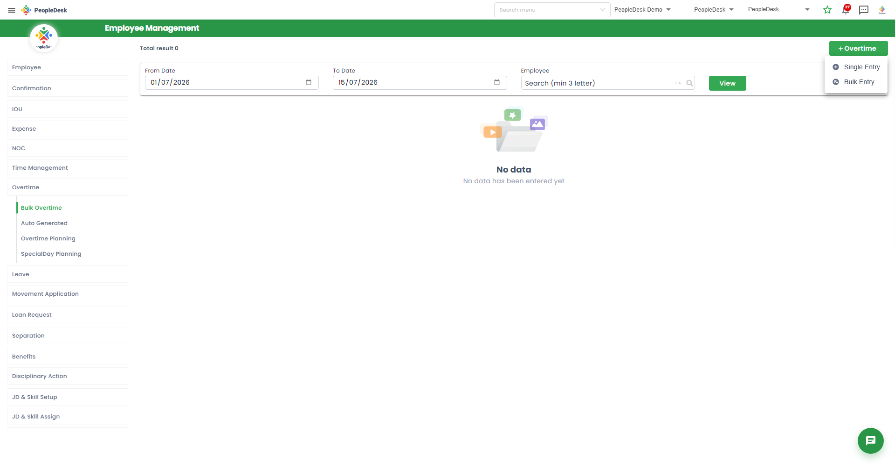

The "create" screenshot shows the **+ Overtime** button's dropdown open with two choices: **Single Entry** (record OT for one employee/date) and **Bulk Entry** (record OT for multiple employees/dates at once).

**Show view**: `bulk_overtime_show.png` is identical to the base list view (still "No data" for the same filter) — confirming this is the same live table, not a distinct detail screen.

**How to use it**:
1. Click **Overtime > Bulk Overtime** in the left menu.
2. Set the date range (and optionally an employee) and click **View** to see existing OT records.
3. Click **+ Overtime**, then choose **Single Entry** to log OT for one person, or **Bulk Entry** to log OT for many employees at once.

**Pro-tip**: Use **Bulk Entry** whenever an entire team worked overtime on the same date (e.g., a weekend release) — it avoids repeating the same date and reason across dozens of Single Entry forms.

---

#### Auto Generated

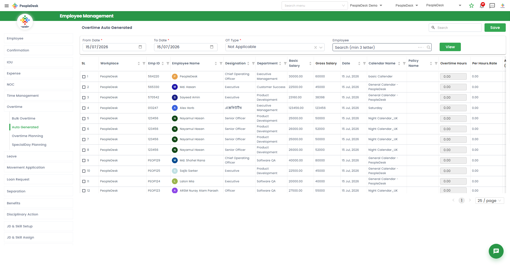

**What it does**: Automatically calculates and displays potential overtime for employees based on their salary and calendar data for a selected date and OT Type, so HR can review and approve system-calculated OT hours rather than entering them manually.

**Key fields / columns**: Workplace, Emp ID, Employee Name, Designation, Department, Basic Salary, Gross Salary, Date, Calendar Name, Policy Name, Overtime Hours, Per Hours Rate, and additional columns cut off on the right.

**Buttons & actions**:
- **From Date** / **To Date**: the date(s) to auto-generate OT for.
- **OT Type** dropdown (defaults to "Not Applicable"): filters/selects which overtime policy type to calculate.
- **Employee** search box + **View**: filters to a specific employee.
- **Save**: commits the calculated overtime hours shown in the table.
- **Checkboxes** per row (plus a header checkbox) to select multiple employees at once before saving.
- Column sort/filter icons on Emp ID, Employee Name, Designation, Department, Calendar Name, Policy Name.
- Editable **Overtime Hours** and **Per Hours Rate** fields directly in the table (shown as input boxes, defaulting to 0.00) so values can be adjusted before saving.

**Show view**: `auto_generated_show.png` shows the same page with a different employee set/results after re-running the view for the same date (15 Jul 2026) — it is the live filtered table, not a separate detail popup.

**How to use it**:
1. Click **Overtime > Auto Generated** in the left menu.
2. Set the From/To Date and OT Type, optionally search for a specific employee, then click **View**.
3. Review the auto-populated Basic Salary, Gross Salary, and Overtime Hours per employee.
4. Adjust the **Overtime Hours** or **Per Hours Rate** fields if needed, check the boxes for the rows to confirm, and click **Save**.

**Pro-tip**: Double-check the **OT Type** filter before reviewing — leaving it on "Not Applicable" may hide rows that belong to a specific overtime policy your organization uses.

---

#### Overtime Planning

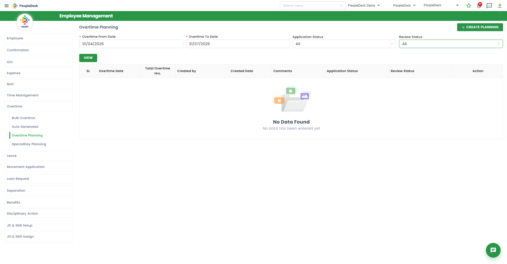

**What it does**: Lets HR pre-plan overtime for employees ahead of time (rather than recording it after the fact), and tracks each plan through an application/review approval status.

**Key fields / columns**: Overtime Date, Total Overtime Hrs., Created by, Created Date, Comments, Application Status, Review Status, Action.

**Buttons & actions**:
- **Overtime From Date** / **Overtime To Date**: filters the planning list by date range.
- **Application Status** / **Review Status** dropdowns (both default to "All"): filters by approval stage.
- **VIEW**: loads plans matching the filters.
- **+ CREATE PLANNING**: opens the Create Overtime Planning form.

If a `_create` file is listed for this page: embed it too.

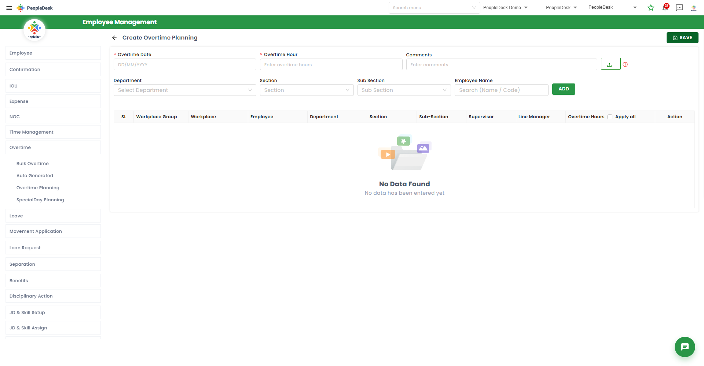

**Create form fields**: Overtime Date, Overtime Hour, Comments (plus an attachment upload icon), and an employee-targeting section: Department, Section, Sub Section, Employee Name (search by Name/Code) with an **ADD** button. Once added, employees appear in a table below with columns: Workplace Group, Workplace, Employee, Department, Section, Sub-Section, Supervisor, Line Manager, Overtime Hours (editable, with an "Apply all" checkbox to apply the same hours to every added employee), and Action (to remove a row).

**Buttons & actions on the Create form**: **SAVE** (submits the overtime plan).

**How to use it**:
1. Click **Overtime > Overtime Planning** in the left menu.
2. Set the date range and status filters, then click **VIEW** to see existing plans.
3. Click **+ CREATE PLANNING**, enter the Overtime Date and Overtime Hour, add Comments if needed.
4. Use Department/Section/Sub Section or the Employee Name search plus **ADD** to build the list of employees covered by this plan.
5. Set individual Overtime Hours per employee, or check **Apply all** to apply one value to everyone added, then click **SAVE**.

**Pro-tip**: Use the **Apply all** checkbox when planning overtime for an entire section working the same extra hours (e.g., a weekend shift) — it saves you from re-entering the same hour value on every row.

---

#### SpecialDay Planning

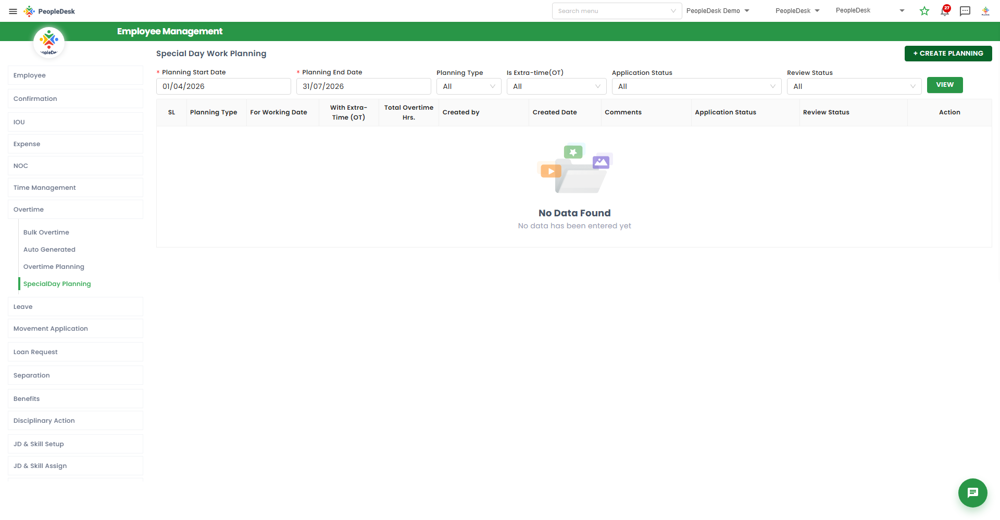

**What it does**: Similar to Overtime Planning, but specifically for planning work on special/non-standard days (e.g., holidays or weekends), optionally combined with extra-time (OT) tracking.

**Key fields / columns**: Planning Type, For Working Date, With Extra-Time (OT), Total Overtime Hrs., Created by, Created Date, Comments, Application Status, Review Status, Action.

**Buttons & actions**:
- **Planning Start Date** / **Planning End Date**: date range filter.
- **Planning Type**, **Is Extra-time (OT)**, **Application Status**, **Review Status** dropdowns (all default to "All"): narrows the list.
- **VIEW**: loads plans matching the filters.
- **+ CREATE PLANNING**: opens the Create Special Day Work Planning form.

If a `_create` file is listed for this page: embed it too.

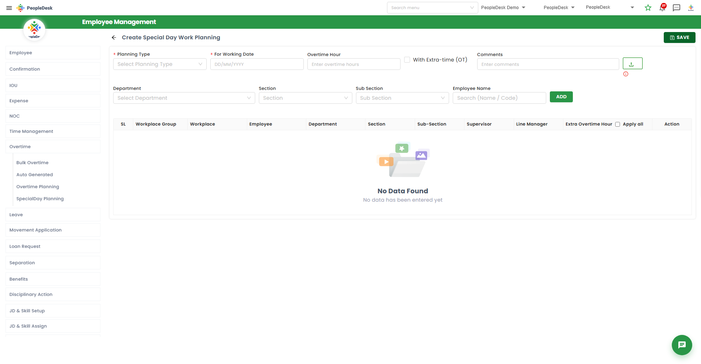

**Create form fields**: Planning Type (dropdown, required), For Working Date (required), Overtime Hour, a **With Extra-time (OT)** checkbox, Comments (with attachment upload), and the same employee-targeting section as Overtime Planning: Department, Section, Sub Section, Employee Name search with **ADD**. Added employees appear in a table with Workplace Group, Workplace, Employee, Department, Section, Sub-Section, Supervisor, Line Manager, Extra Overtime Hour (editable, with "Apply all" checkbox), and Action.

**Buttons & actions on the Create form**: **SAVE** (submits the special day plan).

**How to use it**:
1. Click **Overtime > SpecialDay Planning** in the left menu.
2. Set the planning date range and filters, then click **VIEW** to review existing plans.
3. Click **+ CREATE PLANNING**, choose the Planning Type and For Working Date, check **With Extra-time (OT)** if overtime applies.
4. Add employees via Department/Section filters or name search + **ADD**, set hours per employee (or use **Apply all**), then click **SAVE**.

**Pro-tip**: Only check **With Extra-time (OT)** if the special day work should also count toward overtime pay/hours — leaving it unchecked records the planned work day without treating it as OT.

---

#### Leave Application

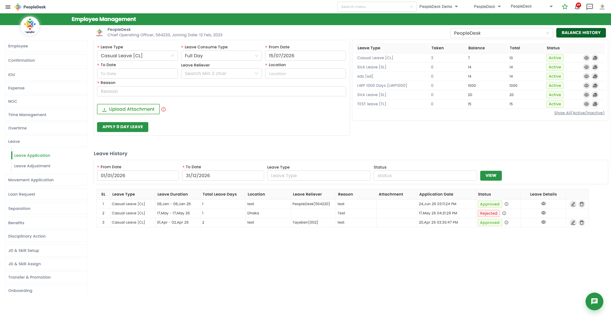

**What it does**: The self-service leave request page for an employee — shows their current leave balances by type, lets them apply for new leave, and displays their full leave application history with status.

**Key fields / columns**:
- Apply form: Leave Type, Leave Consume Type, From Date, To Date, Leave Reliever, Location, Reason.
- Balance panel (right side): Leave Type, Taken, Balance, Total, Status — for each leave type (e.g., Casual Leave [CL], Sick Leave [SL], LWP 1000 Days, TEST leave).
- Leave History table: Leave Type, Leave Duration, Total Leave Days, Location, Leave Reliever, Reason, Attachment, Application Date, Status, Leave Details.

**Buttons & actions**:
- Employee/profile selector dropdown (top right, e.g., "PeopleDesk") to switch whose leave is being viewed/applied for.
- **BALANCE HISTORY**: shows the historical trend of leave balance changes.
- **Upload Attachment**: attach supporting documents (e.g., medical certificate) to the application.
- **APPLY 0 DAY LEAVE** (button label updates to reflect the number of days once dates are set): submits the leave request.
- Balance panel row icons: an **eye icon** (view details) and a **chart icon** (view balance trend) per leave type.
- **Show All (Active/Inactive)** link: reveals leave types not currently active.
- Leave History filters: From Date, To Date, Leave Type, Status + **VIEW** button.
- Leave History row actions: **eye icon** (view), **pencil icon** (edit), **trash icon** (delete) — available on editable/pending requests.

**Show view**: `leave_application_show.png` is identical to the default view, confirming this is the live page rather than a separate modal.

**How to use it**:
1. Click **Leave > Leave Application** in the left menu.
2. Review your leave balances in the right-hand panel before applying.
3. To request leave, select Leave Type, Leave Consume Type (e.g., Full Day), From/To Date, Leave Reliever, Location, and Reason, then click **APPLY [n] DAY LEAVE**.
4. Use the Leave History filters and **VIEW** to check past applications and their approval Status.

**Pro-tip**: Check the **Balance** column before applying — the Apply button will calculate the day count automatically once From/To Date are set, so you can confirm you have enough balance before submitting.

---

#### Leave Adjustment

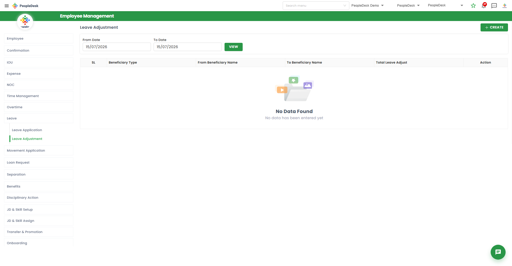

**What it does**: Allows administrators to transfer or adjust leave balance between two employees or leave policies (e.g., correcting an incorrect balance, or moving unused leave from one type to another).

**Key fields / columns**: Beneficiary Type, From Beneficiary Name, To Beneficiary Name, Total Leave Adjust, Action.

**Buttons & actions**:
- **From Date** / **To Date** + **VIEW**: filters the list of past adjustments by date.
- **+ CREATE**: opens the Create Adjustment modal.

If a `_create` file is listed for this page: embed it too.

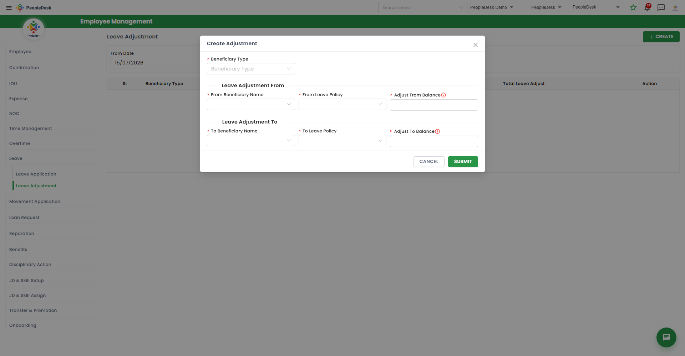

**Create form fields** (modal titled "Create Adjustment"): Beneficiary Type (dropdown), then two mirrored sections — **Leave Adjustment From** (From Beneficiary Name, From Leave Policy, Adjust From Balance) and **Leave Adjustment To** (To Beneficiary Name, To Leave Policy, Adjust To Balance).

**Buttons & actions on the Create form**: **CANCEL** (closes without saving), **SUBMIT** (creates the leave adjustment).

**Show view**: `leave_adjustment_show.png` is identical to the base list view ("No Data Found") — the same live table, not a distinct detail screen.

**How to use it**:
1. Click **Leave > Leave Adjustment** in the left menu.
2. Set a date range and click **VIEW** to see past adjustments.
3. Click **+ CREATE**, choose the Beneficiary Type, then fill in the "From" side (whose balance is reduced) and the "To" side (whose balance is increased), along with the leave policies and balance amounts.
4. Click **SUBMIT** to apply the adjustment.

**Pro-tip**: Double check **From Leave Policy** and **To Leave Policy** match the intended leave types — adjusting between mismatched policies (e.g., Casual Leave to Sick Leave) may not be reversible from this screen.

---

#### Movement Application

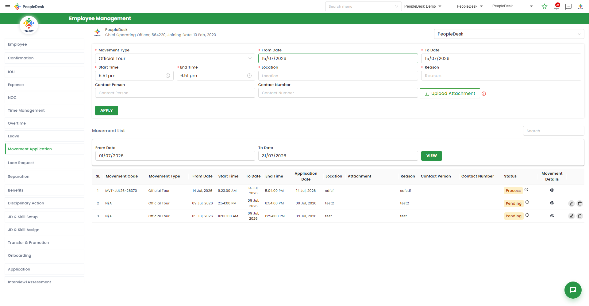

**What it does**: Lets an employee log official movement out of the office (e.g., an official tour) during work hours, with start/end times and location/contact details, and shows a history of past movement requests with their approval status.

**Key fields / columns**: Movement Code, Movement Type, From Date, Start Time, To Date, End Time, Application Date, Location, Attachment, Reason, Contact Person, Contact Number, Status, Movement Details.

**Buttons & actions**:
- Apply form fields: Movement Type (e.g., "Official Tour"), From Date, To Date, Start Time, End Time, Location, Reason, Contact Person, Contact Number, **Upload Attachment** button.
- **APPLY**: submits the movement request.
- Employee/profile selector dropdown (top right) to switch context.
- Movement List filters: From Date, To Date + **VIEW**.
- **Search box** for the movement list.
- Row action icons: **eye icon** (view details), **pencil icon** (edit — only shown on Pending rows), **trash icon** (delete — only shown on Pending rows). Rows already in "Process" status don't show edit/delete, only view.
- **Status** column shows values like "Process" and "Pending" with an info icon for more detail.

**Show view**: `movement_application_show.png` is identical to the default view — same three movement records and same form state, confirming it's the live page.

**How to use it**:
1. Click **Movement Application** in the left menu.
2. Fill in the Movement Type, dates, times, Location, Reason, and contact details, then click **APPLY**.
3. Use the Movement List filters and **VIEW** to review past requests and their Status.
4. Edit or delete a request while it is still **Pending** using the pencil/trash icons.

**Pro-tip**: Fill in **Contact Person** and **Contact Number** even though they're optional — it helps whoever approves the movement reach the employee quickly if plans change while they're out of office.

---

#### Loan Request

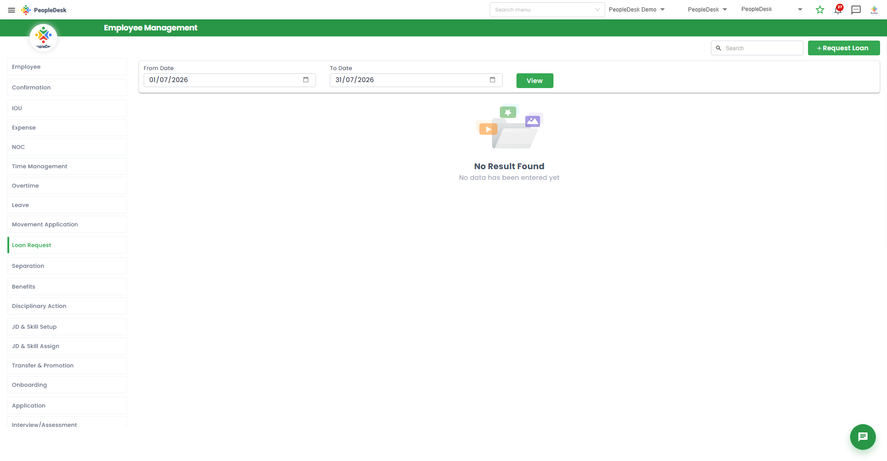

**What it does**: Manages formal employee loan applications (distinct from the smaller/short-term IOU) — including loan amount, interest, and installment repayment terms.

**Key fields / columns**: The list was empty in this view ("No Result Found. No data has been entered yet"); the page provides From Date, To Date filters and a Search box instead.

**Buttons & actions**:
- **From Date** / **To Date** + **View**: filters loan requests by date.
- **Search box**: searches existing requests.
- **+ Request Loan**: opens the Create Loan Application modal.

If a `_create` file is listed for this page: embed it too.

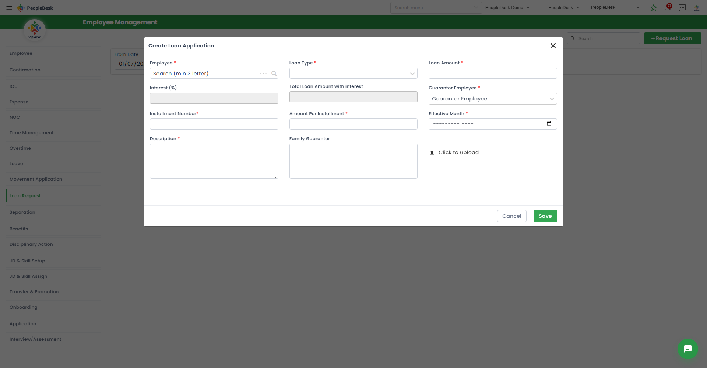

**Create form fields** (modal titled "Create Loan Application"): Employee (search, min 3 letters), Loan Type, Loan Amount, Interest (%), Total Loan Amount with interest (auto-calculated), Guarantor Employee, Installment Number, Amount Per Installment, Effective Month, Description, Family Guarantor, and a **Click to upload** attachment area.

**Buttons & actions on the Create form**: **Cancel** (closes without saving), **Save** (submits the loan application).

**Show view**: `loan_request_show.png` is identical to the base list view ("No Result Found") for the same date range — the same live table, not a distinct detail screen.

**How to use it**:
1. Click **Loan Request** in the left menu.
2. Set a date range and click **View** to see existing loan requests.
3. Click **+ Request Loan**, search for and select the Employee, choose the Loan Type, enter the Loan Amount and Interest (%) — the Total Loan Amount with interest calculates automatically.
4. Select a Guarantor Employee, set the Installment Number, Amount Per Installment, and Effective Month, add a Description, then click **Save**.

**Pro-tip**: Confirm the **Amount Per Installment × Installment Number** roughly matches the **Total Loan Amount with interest** before saving — this page doesn't appear to validate that the numbers reconcile automatically.

---

#### Separation

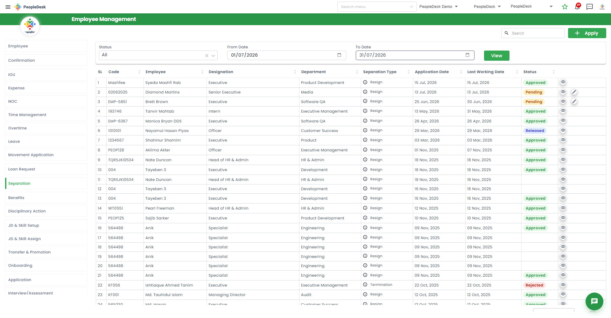

**What it does**: Tracks employee separations (resignations and terminations) from application through to approval, including last working date and current approval status — this is the formal offboarding request list.

**Key fields / columns**: Code, Employee, Designation, Department, Separation Type (e.g., "Resign"), Application Date, Last Working Date, Status (e.g., Approved, Pending, Released, Rejected).

**Buttons & actions**:
- **Status** dropdown (defaults to "All"), **From Date** / **To Date**, and **View**: filters the separation list.
- **Search box**: searches within results.
- **+ Apply**: opens the Separation Application form.
- Column sort/filter icons on Code, Employee, Designation, Department, Separation Type, Application Date, Last Working Date, Status.
- Row action icons: **eye icon** (view details, available on all rows) and **pencil icon** (edit, only available on Pending rows).

If a `_create` file is listed for this page: embed it too.

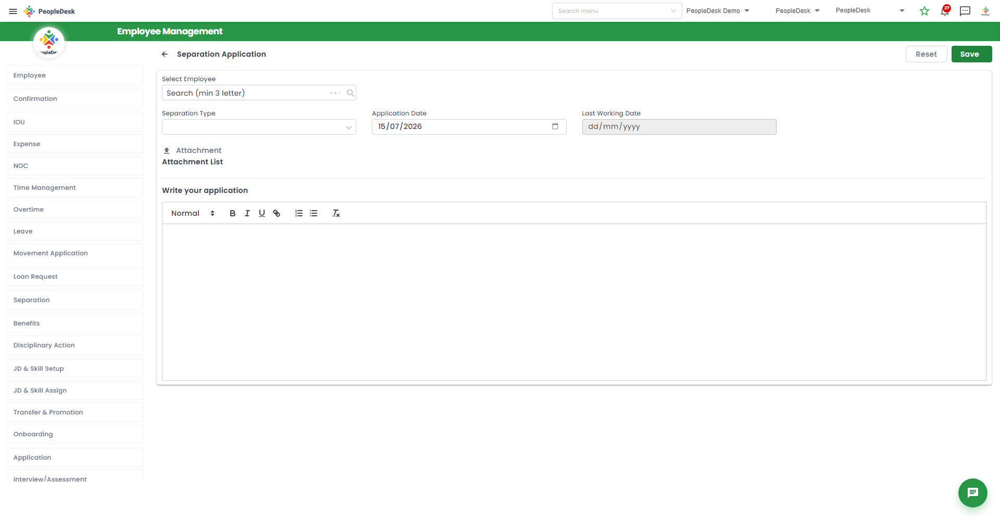

**Create form fields** (titled "Separation Application"): Select Employee (search, min 3 letters), Separation Type (dropdown), Application Date (defaults to today), Last Working Date, an **Attachment** upload with an Attachment List, and a rich-text **Write your application** editor (with Normal/Bold/Italic/Underline/Link/list formatting) for the resignation/termination letter text.

**Buttons & actions on the Create form**: **Reset** (clears the form), **Save** (submits the separation application).

**How to use it**:
1. Click **Separation** in the left menu.
2. Filter by Status and date range, click **View** to review existing separation cases.
3. Click **+ Apply**, select the Employee, choose the Separation Type (e.g., Resign or Termination), set the Last Working Date, attach any documentation, and write the application text.
4. Click **Save** to submit; track its progress through the Status column (Pending → Approved/Rejected/Released).

**Pro-tip**: Use the rich-text editor's formatting (bold, lists) to structure a clear resignation letter directly in the application — it becomes part of the employee's official separation record without needing a separate uploaded document.

#### Leave Benefits

**What it does**: This page lets HR record and track "leave encashment" payouts — a benefit where an employee's unused leave days are converted into a cash payment, either alongside their regular salary or separately.

**Key fields / columns**: SL, Employee, Application Date, Disbursement Type, Total Benefits Amount, Status.

**Buttons & actions**:
- **From Date / To Date** — date-range filters that scope which benefit applications are listed.
- **Status** (dropdown, defaults to "All") — filters the list by approval status.
- **VIEW** — applies the date range and status filter and refreshes the table.
- **Search** box — searches the list by keyword (e.g. employee name).
- **+ CREATE NEW** — opens the leave benefit creation form for a new employee.

**How to use it**:
1. Set the From Date and To Date to the period you want to review.
2. Optionally narrow the Status filter, then click VIEW.
3. Use Search to quickly locate a specific employee's benefit record.
4. Click + CREATE NEW to start a new leave-benefit application.

**Pro-tip**: If the table shows "No Data Found," double-check your date range first — a common mistake is leaving the default range set to a period with no applications.

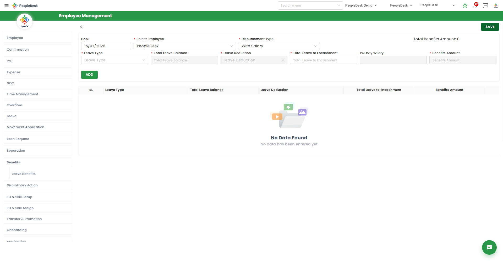

**Create form fields**: Date, Select Employee, Disbursement Type (e.g. "With Salary"), Leave Type, Total Leave Balance, Leave Deduction, Total Leave to Encashment, Per Day Salary, Benefits Amount — plus a running **Total Benefits Amount** counter at the top right. An **ADD** button adds the configured leave-type row to a table below (columns: Leave Type, Total Leave Balance, Leave Deduction, Total Leave to Encashment, Benefits Amount), so multiple leave types can be encashed in one application. **SAVE** commits the whole application.

1. Pick the employee and disbursement type.
2. Choose a leave type and fill in its balance, deduction, encashment days, and amount, then click ADD.
3. Repeat for additional leave types if needed.
4. Click SAVE to submit.

---

#### Disciplinary Action

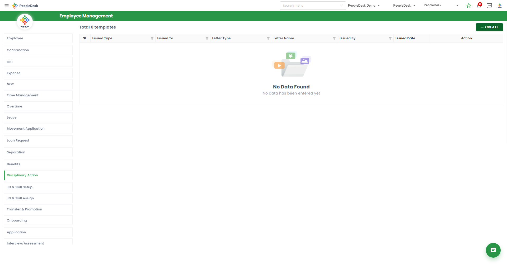

**What it does**: This page manages formal disciplinary letters and punishment records issued to employees (e.g. warning or punishment letters), tracking who issued them and when.

**Key fields / columns**: SL, Letter Type, Letter Name, Issued To, Issued By, Issued Date, Action.

**Buttons & actions**:
- **+ GENERATE LETTER** — opens the disciplinary letter creation flow to issue a new letter to an employee.
- **Column filter icons** (funnel icons on Letter Type, Letter Name, Issued To, Issued By) — filter the table by that column's value.
- **Action column icons** — an eye icon to view the generated letter and a print icon to print it directly from the list.
- **Pagination controls** (bottom right) — page through results and change the page size (25/page shown).

**How to use it**:
1. Browse the list of previously issued letters, using column filters to narrow results.
2. Click the eye icon to review a letter, or the print icon to print it.
3. Click + GENERATE LETTER to issue a new disciplinary/punishment letter.

**Pro-tip**: Use the Letter Type filter if your organization issues multiple templates (e.g. warning vs. punishment) — it's faster than scanning the whole list.

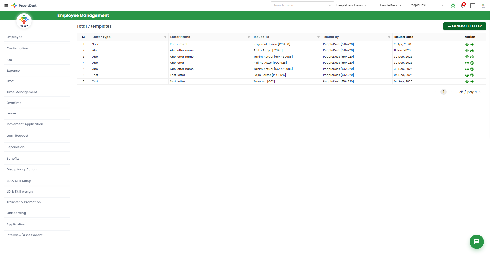

**Create form**: The create screen is the same list view before any letters exist — it shows "Total 0 templates" with an empty table (SL, Issued Type, Issued To, Letter Type, Letter Name, Issued By, Issued Date, Action) and a **+ CREATE** button in the top-right to begin generating the first letter template/record.

---

#### JD Bank

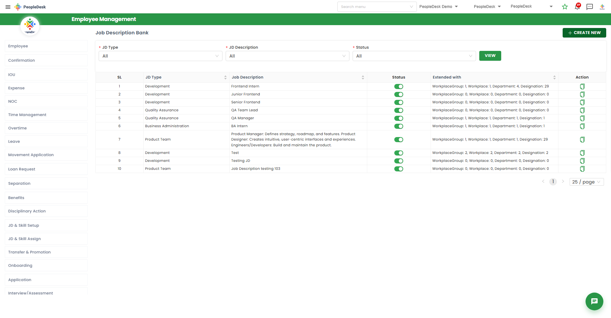

**What it does**: JD Bank ("Job Description Bank") is the central repository of job description templates, organized by JD Type (e.g. Development, Quality Assurance, Business Administration), which can later be extended/assigned to specific workplace groups, departments, or designations.

**Key fields / columns**: SL, JD Type, Job Description, Status (enabled/disabled toggle), Extended With (shows counts of WorkplaceGroup, Workplace, Department, Designation the JD has been extended to), Action.

**Buttons & actions**:
- **JD Type / JD Description / Status** filters, each defaulting to "All" — narrow the list before viewing.
- **VIEW** — applies the selected filters.
- **+ CREATE NEW** — opens the Create Job Description form to add a new JD entry.
- **Status toggle** (green switch per row) — enables or disables that job description.
- **Action icon** (copy/duplicate icon) — duplicates an existing JD entry as a starting point for a new one.

**How to use it**:
1. Filter by JD Type, JD Description, or Status, then click VIEW.
2. Review existing job descriptions and their "Extended With" reach.
3. Click + CREATE NEW to add a fresh job description.
4. Use the duplicate icon to clone a similar JD instead of typing from scratch.

**Pro-tip**: Toggle a JD's Status off instead of deleting it if it's temporarily out of use — the Extended With counts show you it may still be tied to active departments/designations.

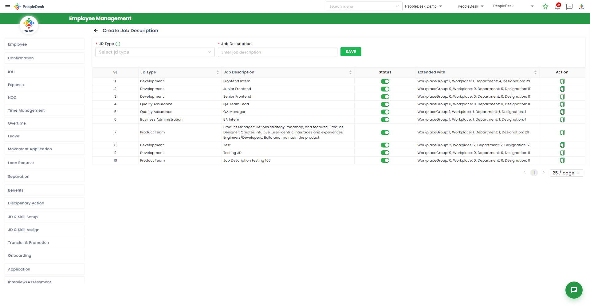

**Create form fields**: JD Type (with a "+" quick-add icon to create a new type on the fly) and Job Description (free-text). Click **SAVE** to add it to the table below, which lists all existing JD entries for reference while you create a new one.

---

#### JD Extend

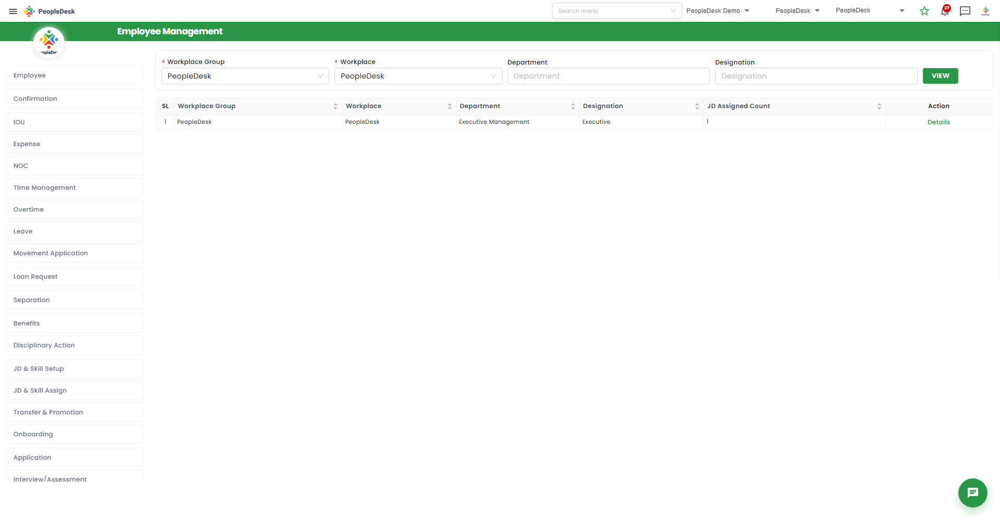

**What it does**: JD Extend lets you see how many job descriptions have been assigned ("extended") to a specific Workplace Group / Workplace / Department / Designation combination, so you can confirm coverage before assigning JDs to more roles.

**Key fields / columns**: SL, Workplace Group, Workplace, Department, Designation, JD Assigned Count, Action.

**Buttons & actions**:
- **Workplace Group** and **Workplace** dropdowns (required) — select the organizational scope to check.
- **Department** and **Designation** text filters (optional) — narrow further.
- **VIEW** — runs the search and populates the results table.
- **Details** link (in the Action column) — opens the detailed breakdown of which JDs are assigned for that row.

**How to use it**:
1. Select a Workplace Group and Workplace (both required).
2. Optionally type a Department or Designation to narrow the search.
3. Click VIEW to see the JD Assigned Count per department/designation combination.
4. Click Details to drill into a specific row's assigned job descriptions.

**Pro-tip**: A JD Assigned Count of 0 or a missing row for a designation is a quick way to spot roles that still need a job description extended to them.

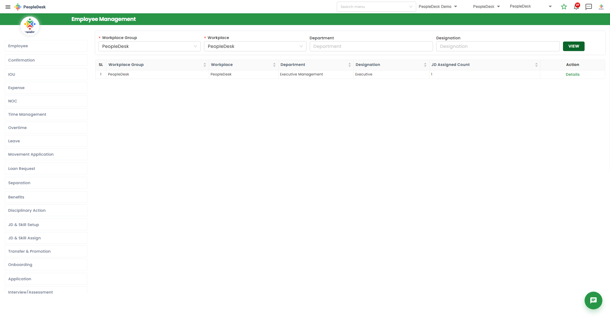

**Shows**: This screenshot is functionally identical to the main JD Extend list — it displays the same Workplace Group/Workplace/Department/Designation search with one result row and a "Details" action link. There is no separate detail modal visible; the "Details" link is where a fuller breakdown would open.

---

#### Skills Bank

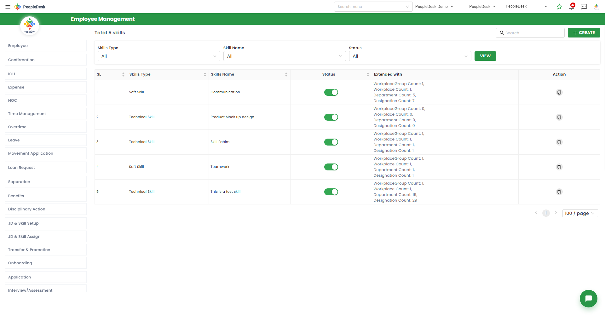

**What it does**: Skills Bank is the master repository of defined skills (both Soft Skills and Technical Skills) that can later be assigned to employees, departments, or designations across the organization.

**Key fields / columns**: SL, Skills Type, Skills Name, Status (toggle), Extended With (WorkplaceGroup Count, Workplace Count, Department Count, Designation Count), Action.

**Buttons & actions**:
- **Skills Type / Skill Name / Status** filters (default "All") with a **VIEW** button to apply them.
- **Search** box (top right) — quick keyword search across the list.
- **+ CREATE** — opens the "Create Skill Bank" modal to add a new skill.
- **Status toggle** — enable/disable a skill.
- **Action icon** (copy icon) — duplicates a skill entry.

**How to use it**:
1. Filter by Skills Type or Skill Name and click VIEW, or use Search for a quick lookup.
2. Review each skill's reach via the Extended With counts.
3. Click + CREATE to add a new skill to the bank.

**Pro-tip**: Group related skills under a consistent Skills Type (Soft Skill vs. Technical Skill) so filtering and reporting stay meaningful as the bank grows.

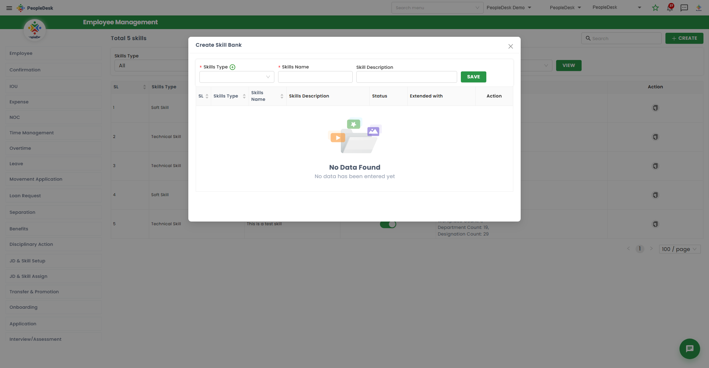

**Create form fields**: Skills Type (dropdown with a "+" quick-add), Skills Name, Skill Description. Click **SAVE** to add the new skill; the modal also lists existing skill-bank entries for reference (currently empty in this view).

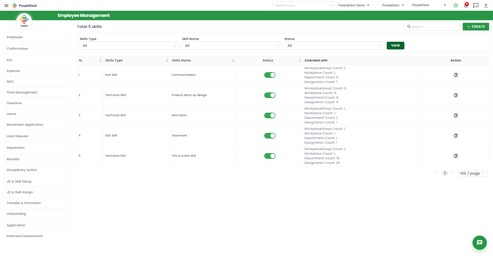

**Shows**: This is the same Skills Bank list screen as the main view (5 skills, same columns and filters) — it does not display a distinct detail page; it confirms the list state after a search/view action.

---

#### Skills Extend

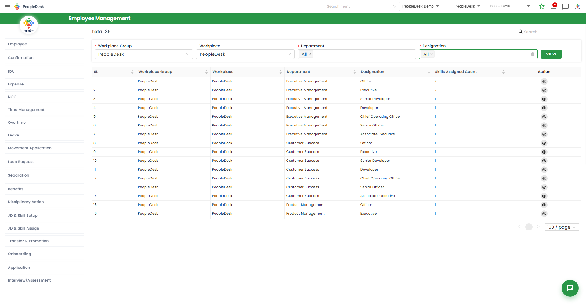

**What it does**: Skills Extend shows how many skills have been extended to each Workplace Group / Workplace / Department / Designation, mirroring JD Extend but for the skills catalogue.

**Key fields / columns**: SL, Workplace Group, Workplace, Department, Designation, Skills Assigned Count, Action.

**Buttons & actions**:
- **Workplace Group, Workplace** (required dropdowns), **Department, Designation** (optional multi-select filters, default "All") — define the scope.
- **VIEW** — runs the query.
- **Eye icon** (Action column) — opens the details of skills assigned for that department/designation row.

**How to use it**:
1. Choose the Workplace Group and Workplace.
2. Optionally filter by Department/Designation.
3. Click VIEW to list Skills Assigned Count per row.
4. Click the eye icon on a row to see which specific skills are extended there.

**Pro-tip**: Sort by Skills Assigned Count (column header) to quickly find departments/designations with zero skills mapped, so you can prioritize extending skills there.

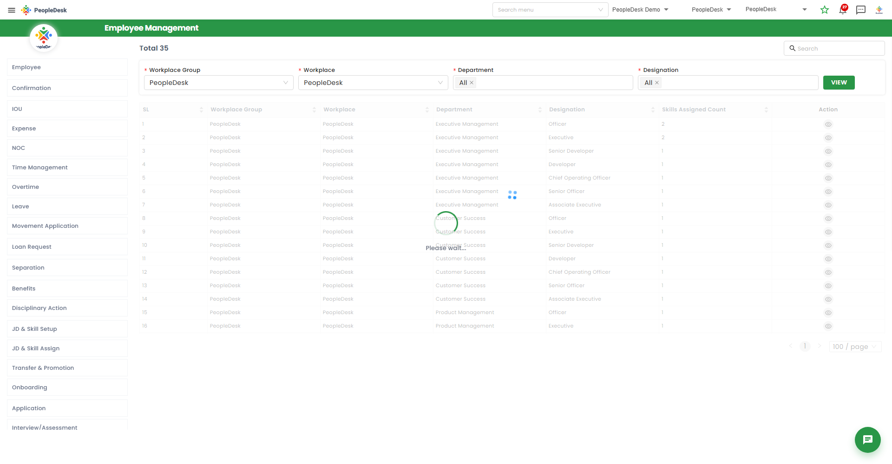

**Shows**: This screenshot captures the same list mid-refresh (a "Please wait..." loading spinner overlays the table after clicking an eye icon), confirming this is a loading state of the Skills Extend list rather than a separate detail screen.

---

#### JD Assign

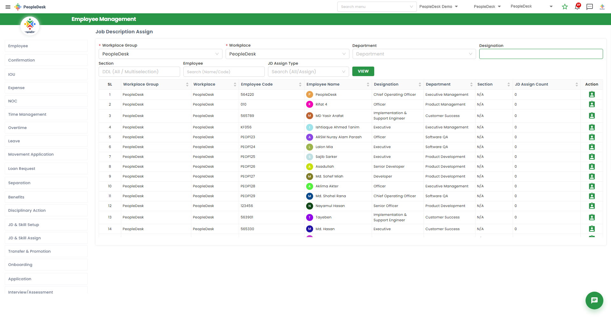

**What it does**: JD Assign is where individual employees are linked to a specific job description, based on their workplace, department, section, and designation.

**Key fields / columns**: SL, Workplace Group, Workplace, Employee Code, Employee Name, Designation, Department, Section, JD Assign Count, Action.

**Buttons & actions**:
- **Workplace Group / Workplace** (required), **Department, Designation** (dropdowns) — scope filters.
- **Section** (multi-select "DDL (All/Multiselection)") and **Employee** (search by name/code) — further narrows the employee list.
- **JD Assign Type** dropdown ("Search (All/Assign)") — filter to show all employees or only those already assigned a JD.
- **VIEW** — applies filters and lists matching employees.
- **Action icon** (person-with-badge icon) — opens the assignment screen for that employee to attach/change their JD.

**How to use it**:
1. Select Workplace Group and Workplace.
2. Optionally filter by Department, Designation, Section, or search for an employee by name/code.
3. Use JD Assign Type to see everyone or just already-assigned employees.
4. Click VIEW, then click the assign icon next to an employee to attach a job description.

**Pro-tip**: Use JD Assign Type = "Assign" (already assigned) periodically to audit who has a JD vs. who's still missing one.

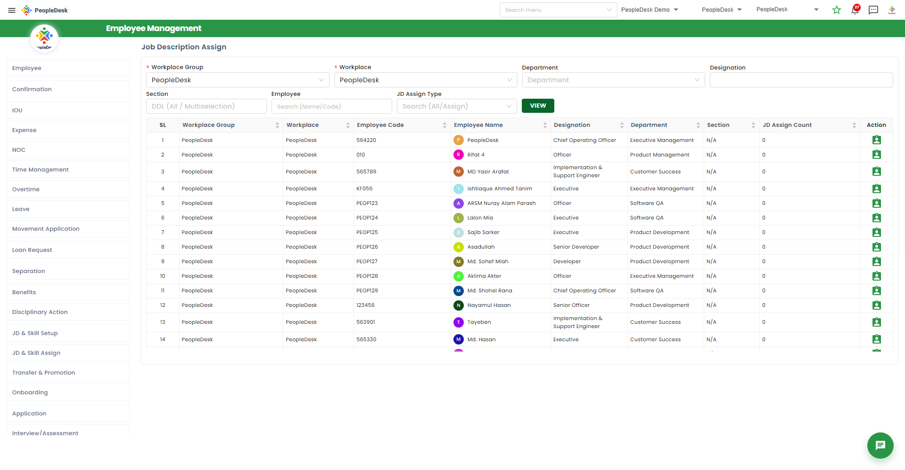

**Shows**: Identical to the main JD Assign list (same 14+ employee rows and filters) — this is the resulting list view, not a separate detail popup.

---

#### Skills Assign

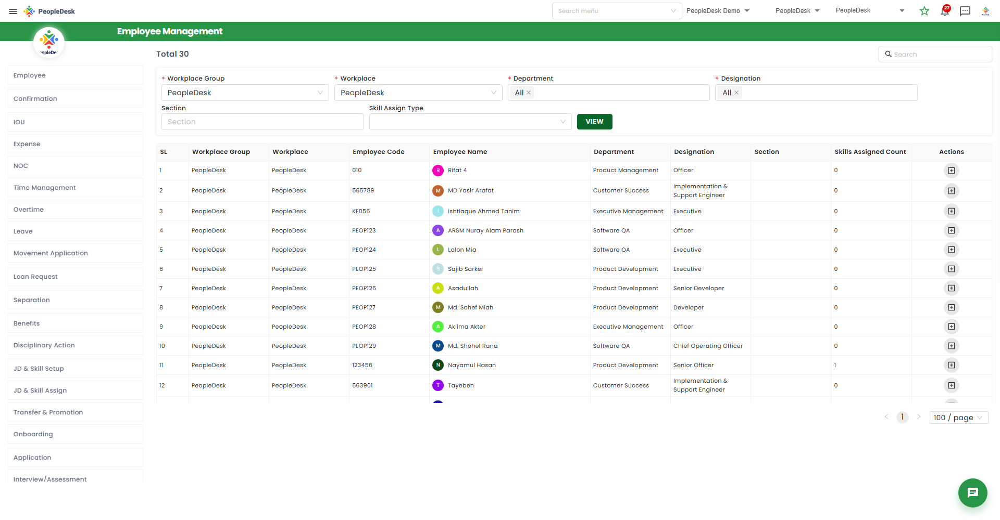

**What it does**: Skills Assign links specific skills from the Skills Bank to individual employees, so each person's profile reflects the skills they've been credited with.

**Key fields / columns**: SL, Workplace Group, Workplace, Employee Code, Employee Name, Department, Designation, Section, Skills Assigned Count, Actions.

**Buttons & actions**:
- **Workplace Group / Workplace** (required), **Department, Designation** (multi-select, default "All") — scope filters.
- **Section** and **Skill Assign Type** — additional narrowing filters.
- **VIEW** — applies the filters.
- **Actions icon** ("+" in a circle) — opens the skill-assignment screen for that employee to add skills.

**How to use it**:
1. Choose Workplace Group and Workplace, and optionally Department/Designation/Section.
2. Click VIEW to list employees and their current Skills Assigned Count.
3. Click the "+" action icon next to an employee to assign additional skills.

**Pro-tip**: Sort by the Skills Assigned Count column to quickly spot employees with 0 skills recorded and prioritize updating their profiles.

**Shows**: Same list view as the main Skills Assign screen (12+ rows, same columns) — confirms the filtered results rather than showing a distinct modal.

---

#### Transfer & Promotion

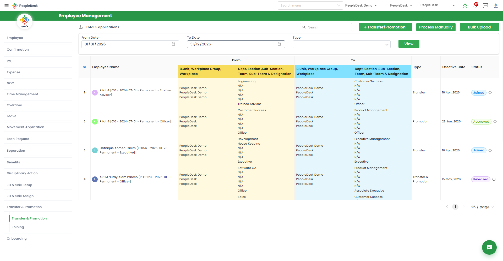

**What it does**: This page records and tracks employee transfers (moving between departments/workplaces) and promotions (moving to a higher designation), showing the "from" and "to" organizational details side by side.

**Key fields / columns**: SL, Employee Name, From (B.Unit/Workplace Group/Workplace and Dept/Section/Sub-Section/Team/Sub-Team & Designation), To (same breakdown), Type (Transfer / Promotion / Transfer & Promotion), Effective Date, Status (e.g. Joined, Approved, Released).

**Buttons & actions**:
- **From Date / To Date** — date range filter for applications.
- **Type** dropdown — filter by Transfer, Promotion, or combined records.
- **View** — applies the filters.
- **Search** box — quick keyword search.
- **+ Transfer/Promotion** — opens the form to create a new transfer/promotion record.
- **Process Manually** — lets HR manually process a transfer/promotion outside the standard flow.
- **Bulk Upload** — uploads multiple transfer/promotion records at once via file (e.g. for mass reorganizations).
- **Download icon** (top left, next to "Total 5 applications") — exports the current list.
- **Info icon** (ⓘ) per row — shows extra status detail for that record.

**How to use it**:
1. Set the From/To Date range and optionally the Type, then click View.
2. Use + Transfer/Promotion to create a single new record, or Bulk Upload for many at once.
3. Use Process Manually for exceptional cases needing manual handling.
4. Monitor Status to see where each transfer/promotion stands (Joined, Approved, Released).

**Pro-tip**: Use Bulk Upload when restructuring an entire department at once — it saves you from creating dozens of individual transfer records by hand.

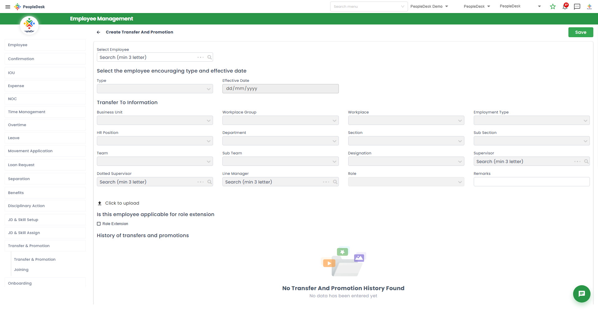

**Create form fields**: Select Employee (search), Type and Effective Date, then "Transfer To Information": Business Unit, Workplace Group, Workplace, Employment Type, HR Position, Department, Section, Sub Section, Team, Sub Team, Designation, Supervisor, Dotted Supervisor, Line Manager, Role, Remarks, a file upload ("Click to upload"), a "Role Extension" checkbox for role-extension eligibility, and a "History of transfers and promotions" panel showing the employee's past records. **Save** commits the new transfer/promotion.

---

#### Joining

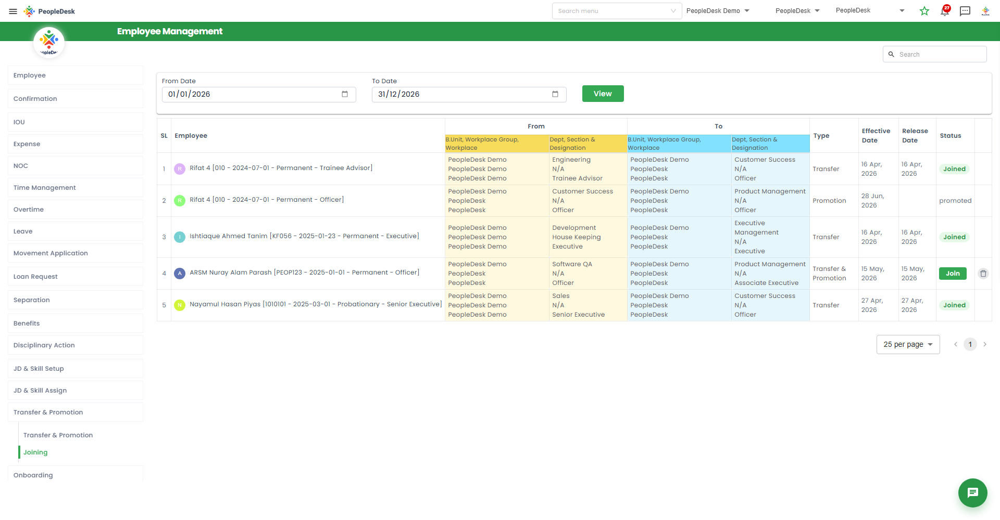

**What it does**: The Joining page tracks employees who have been transferred or promoted and shows whether they have actually "joined" their new position, including release dates from the old role.

**Key fields / columns**: SL, Employee, From (B.Unit/Workplace Group/Workplace and Dept/Section & Designation), To (same), Type, Effective Date, Release Date, Status (Joined / promoted).

**Buttons & actions**:
- **From Date / To Date** — date range filter.
- **View** — applies the filter and refreshes the list.
- **Search** box — quick keyword search.
- **Join** button (green, per row where applicable) — confirms/finalizes that employee's joining into the new role.
- **Delete icon** (trash can, per row) — removes a pending joining record.

**How to use it**:
1. Set the From/To Date range and click View.
2. Locate an employee whose transfer/promotion needs confirming.
3. Click Join to mark them as joined in their new role, or the trash icon to delete an erroneous record.

**Pro-tip**: Records still showing "promoted" instead of "Joined" in Status are awaiting confirmation — review these regularly so promotions don't sit unconfirmed.

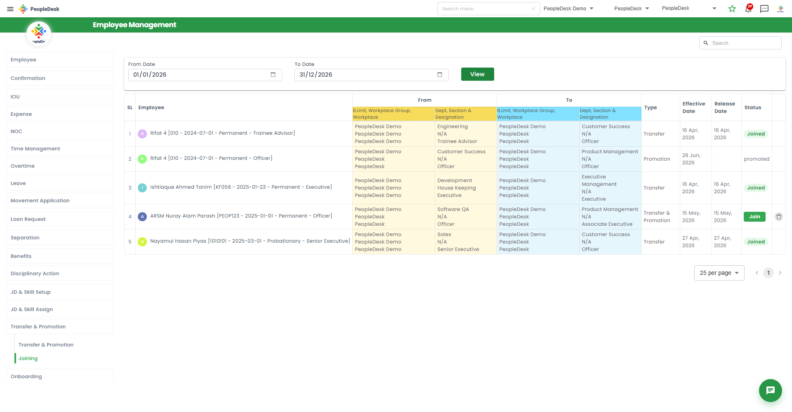

**Shows**: Identical to the main Joining list (same 5 records, same From/To breakdown and Join/Delete actions) — this is the standard list view rather than a separate record detail.

---

#### Onboarding

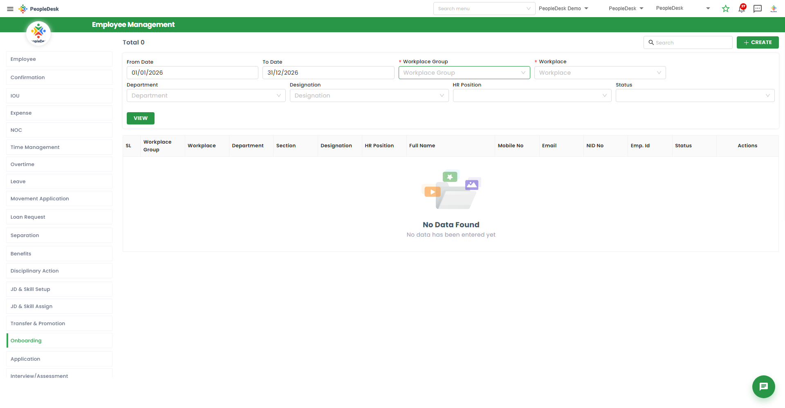

**What it does**: Onboarding is where new hires are registered into the system before or as they join — capturing their basic identity and organizational placement.

**Key fields / columns**: SL, Workplace Group, Workplace, Department, Section, Designation, HR Position, Full Name, Mobile No, Email, NID No, Emp. Id, Status, Actions.

**Buttons & actions**:
- **From Date / To Date** — date range filter for onboarding entries.
- **Workplace Group / Workplace** (required), **Department, Designation, HR Position, Status** — additional filters.
- **VIEW** — applies filters.
- **Search** box — quick keyword search.
- **+ CREATE** — opens the Onboard Create modal to register a new hire.

**How to use it**:
1. Set the date range and required Workplace Group/Workplace, and optionally narrow by Department, Designation, HR Position, or Status.
2. Click VIEW to see matching onboarding records.
3. Click + CREATE to onboard a new employee.

**Pro-tip**: Workplace Group and Workplace are mandatory before you can view results — if VIEW shows validation errors, fill these two in first.

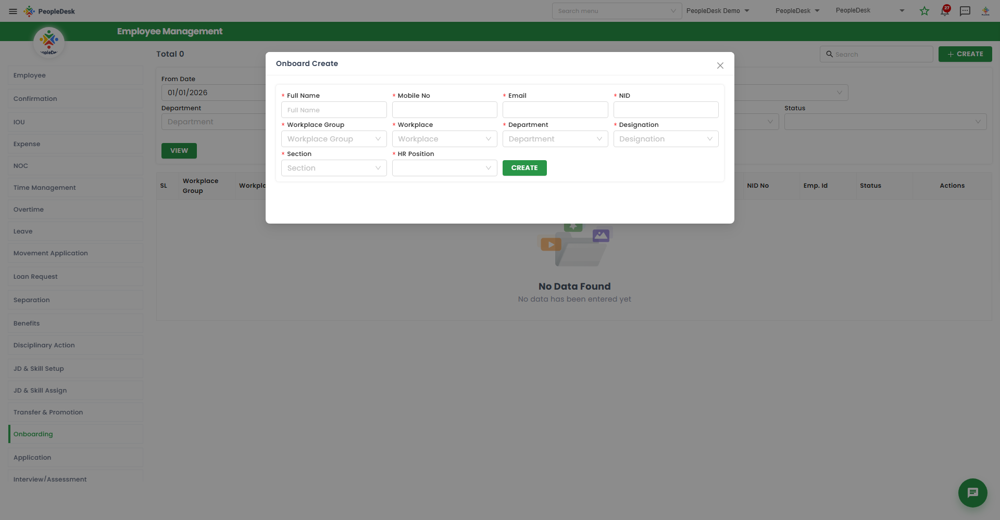

**Create form fields** (in the "Onboard Create" modal): Full Name, Mobile No, Email, NID, Workplace Group, Workplace, Department, Designation, Section, HR Position. Click **CREATE** to save the new onboarding record.

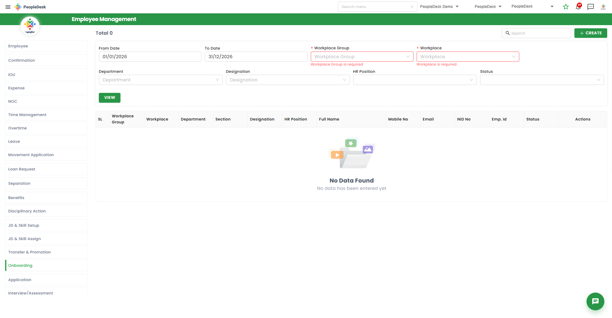

**Shows**: This is the same Onboarding list screen after clicking VIEW without filling the required fields — it displays validation errors "Workplace Group is required" and "Workplace is required" in red beneath those dropdowns. It is not a record detail screen; it demonstrates the required-field validation on this filter form.

---

#### Apply For Documents

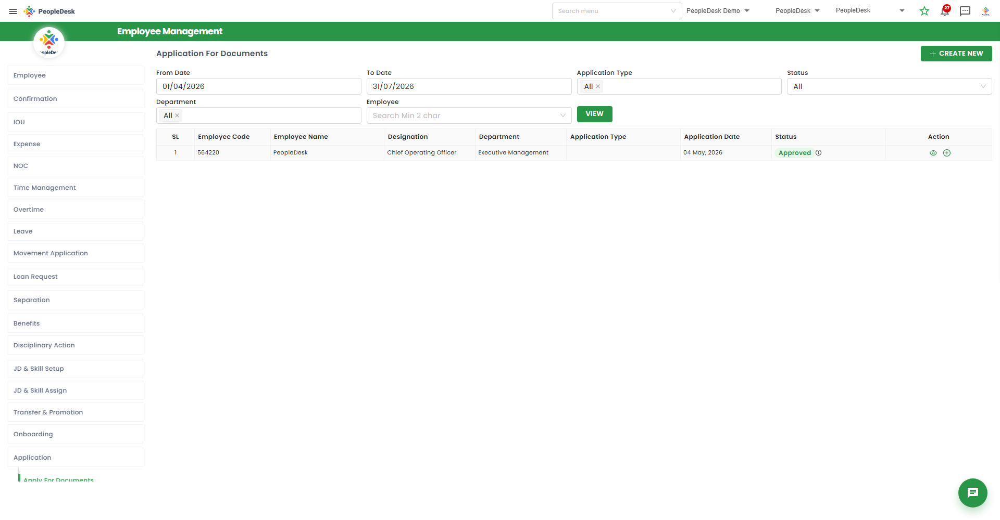

**What it does**: This page lets employees (or HR on their behalf) apply for official documents (such as certificates or letters) and tracks the status of those applications.

**Key fields / columns**: SL, Employee Code, Employee Name, Designation, Department, Application Type, Application Date, Status, Action.

**Buttons & actions**:
- **From Date / To Date** — date range filter.
- **Application Type** (multi-select, default "All") and **Status** (default "All") — filter by type of document and approval state.
- **Department** (multi-select, default "All") and **Employee** (search, min 2 characters) — filter by org unit or specific person.
- **VIEW** — applies all filters.
- **+ CREATE NEW** — opens the document application form.
- **Action icons** — an eye icon to view the application and a "+" icon (likely to attach/generate the document) per row.
- **Info icon** (ⓘ) next to Status — shows extra approval detail.

**How to use it**:
1. Set the date range and optionally Application Type, Status, Department, or a specific Employee.
2. Click VIEW to list matching applications.
3. Click + CREATE NEW to submit a new document request.
4. Use the eye icon to review an existing application's details.

**Pro-tip**: Use the Employee search (minimum 2 characters) instead of scrolling the full list when you just need to check one person's document request status.

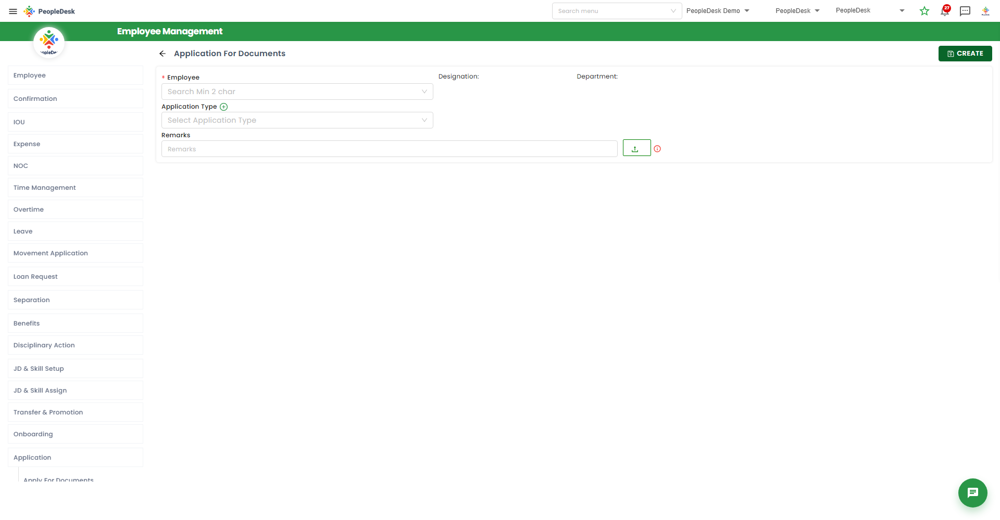

**Create form fields**: Employee (search, min 2 characters — auto-fills Designation and Department once selected), Application Type (with a "+" quick-add to define new types), Remarks, and a file-upload control (with an info icon for upload guidance). Click **CREATE** (top right) to submit.

---

#### Employee Assessment

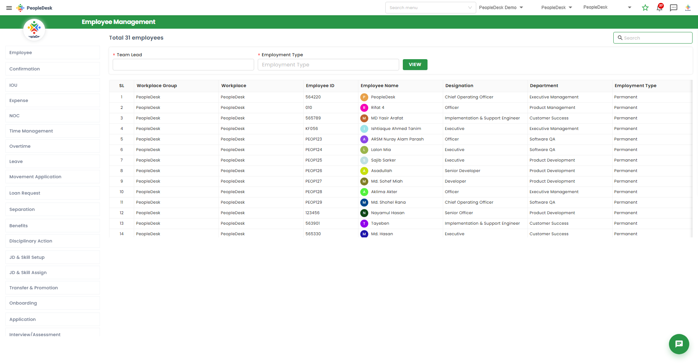

**What it does**: This page lists employees for assessment purposes, filterable by their Team Lead (supervisor) and Employment Type, as part of the exit-interview/assessment workflow.

**Key fields / columns**: SL, Workplace Group, Workplace, Employee ID, Employee Name, Designation, Department, Employment Type.

**Buttons & actions**:
- **Team Lead** (required text field) and **Employment Type** (required dropdown) — filters used to scope the employee list.
- **VIEW** — applies the filters.
- **Search** box (top right) — quick keyword search across the list.

**How to use it**:
1. Enter a Team Lead and select an Employment Type (both required).
2. Click VIEW to list the matching employees.
3. Use Search to quickly find a specific person within the results.

**Pro-tip**: Both Team Lead and Employment Type are mandatory — if the VIEW button doesn't seem to do anything, check for the red "required" validation messages under these two fields.

**Shows**: This is the same Employee Assessment list after clicking VIEW without filling the required fields — it displays "Supervisor is required" and "Employment Type is required" validation messages in red. It is a validation-error state of the filter form, not a separate detail screen.

---

#### Question Creation

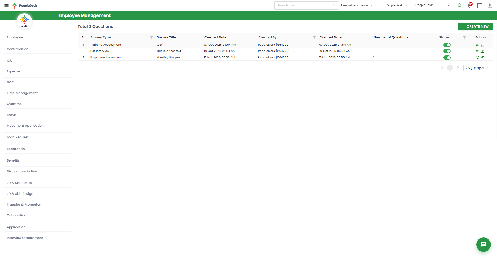

**What it does**: Question Creation manages the survey/questionnaire bank used for things like exit interviews, training assessments, and employee assessments — each entry defines a survey type, title, and its questions.

**Key fields / columns**: SL, Survey Type, Survey Title, Created Date, Created By, Created Date (repeated), Number of Questions, Status (toggle), Action.

**Buttons & actions**:
- **Column filter icons** (on Survey Type and Created By) — filter the table by those values.
- **+ CREATE NEW** — opens the Create Question form to build a new survey.
- **Status toggle** — enable/disable a survey.
- **Action icons** — an eye icon to view the survey's questions and a pencil icon to edit it.
- **Pagination controls** — page through results and adjust page size.

**How to use it**:
1. Browse existing surveys (Training Assessment, Exit Interview, Employee Assessment, etc.).
2. Click + CREATE NEW to define a new survey.
3. Use the eye/pencil icons to review or edit an existing survey's questions.

**Pro-tip**: Toggle Status off for retired surveys instead of deleting them, so historical responses tied to that survey remain intact and viewable.

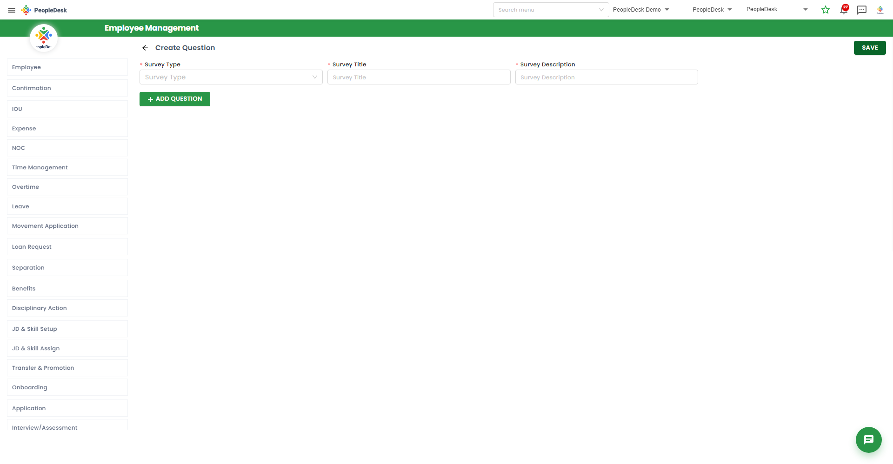

**Create form fields**: Survey Type, Survey Title, Survey Description. Click **ADD QUESTION** to start building out the individual questions for this survey, then **SAVE** (top right) to save the whole questionnaire.

---

#### Interview

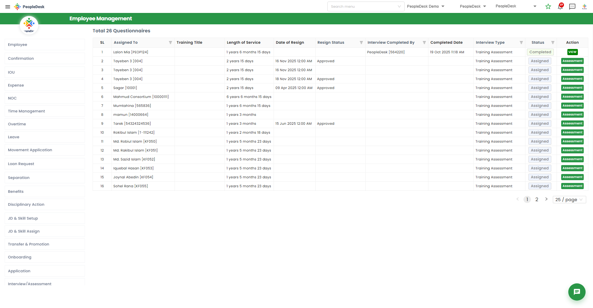

**What it does**: The Interview page tracks questionnaires assigned to employees (e.g. training assessments, exit interviews) and whether each has been completed, including length of service and resignation details where relevant.

**Key fields / columns**: SL, Assigned To, Training Title, Length of Service, Date of Resign, Resign Status, Interview Completed By, Completed Date, Interview Type, Status (Assigned/Completed), Action.

**Buttons & actions**:
- **Column filter icons** (Assigned To, Resign Status, Interview Completed By, Interview Type, Status) — filter the table.
- **VIEW** button (green, on completed rows) — opens the completed interview's submitted answers.
- **Assessment** button (green, on assigned/incomplete rows) — opens the assessment for the assigned employee to fill in or review.
- **Pagination** (bottom right, e.g. pages 1–2) — navigate additional questionnaire records.

**How to use it**:
1. Use the column filters to narrow by interview type or status.
2. Click Assessment on a row still "Assigned" to conduct/complete that interview.
3. Click VIEW on a "Completed" row to review the submitted answers.

**Pro-tip**: Filter by Status = Assigned to quickly get a to-do list of outstanding interviews/assessments that still need action.

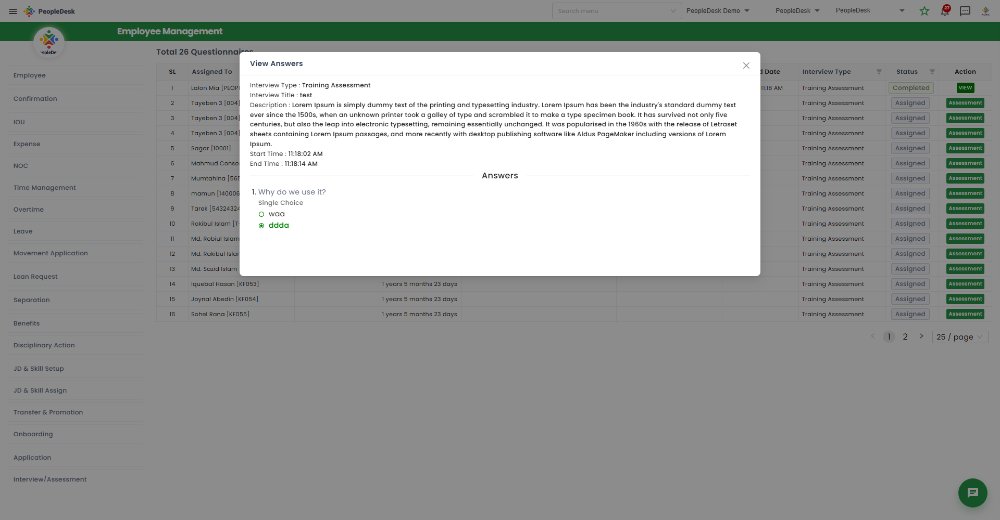

**Shows**: Clicking VIEW opens a genuine "View Answers" detail modal. It displays the Interview Type (Training Assessment), Interview Title, Description, Start Time and End Time of the session, and the actual **Answers** section — showing each question (e.g. "Why do we use it?"), its type (Single Choice), and which option the respondent selected (highlighted in green).

---

#### Workforce Planning

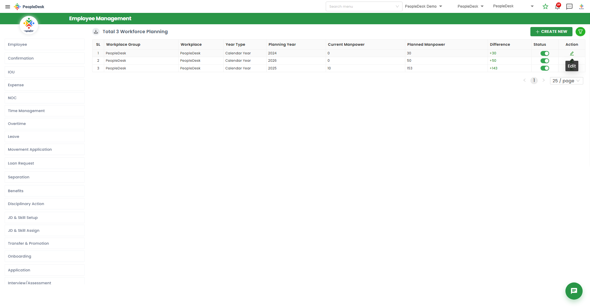

**What it does**: Workforce Planning lets HR set and track staffing targets — comparing current headcount against planned/budgeted headcount for a given year and workplace.

**Key fields / columns**: SL, Workplace Group, Workplace, Year Type, Planning Year, Current Manpower, Planned Manpower, Difference (color-coded, e.g. +30), Status (toggle), Action.

**Buttons & actions**:
- **+ CREATE NEW** — opens the workforce planning form to define a new plan for a year/workplace.
- **Download icon** (top left) — exports the workforce planning list.
- **Filter icon** (green circle, bottom right) — opens filtering options for the list.
- **Edit icon** (pencil, per row) — edits an existing plan's figures.
- **Status toggle** — activates/deactivates a plan.

**How to use it**:
1. Review current plans and their Difference (planned minus current manpower).
2. Click + CREATE NEW to add a plan for a new year/workplace.
3. Click the pencil icon to adjust an existing plan's manpower figures.

**Pro-tip**: A large positive Difference signals significant planned hiring — cross-check these rows against your recruitment pipeline to make sure hiring plans are realistic.

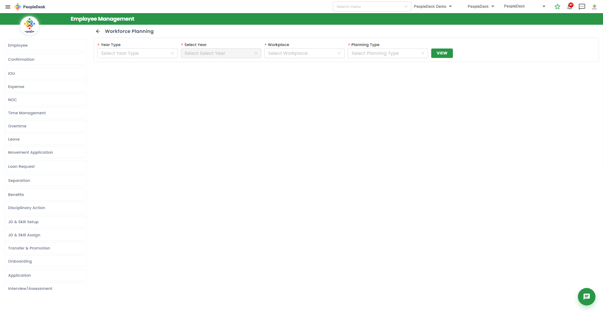

**Create form fields**: Year Type, Select Year, Workplace, Planning Type — all required. Click **VIEW** to proceed (this screen is the entry filter/setup step before the actual planning figures are entered).

**Shows**: The same Workforce Planning setup form after clicking VIEW with no fields filled in — it displays red validation messages: "Year Type is required," "Select Year selection is required," "Workplace is required," and "Planning Type is required." This confirms all four fields must be completed before the plan can be viewed or created.

---

#### Workforce Comparison

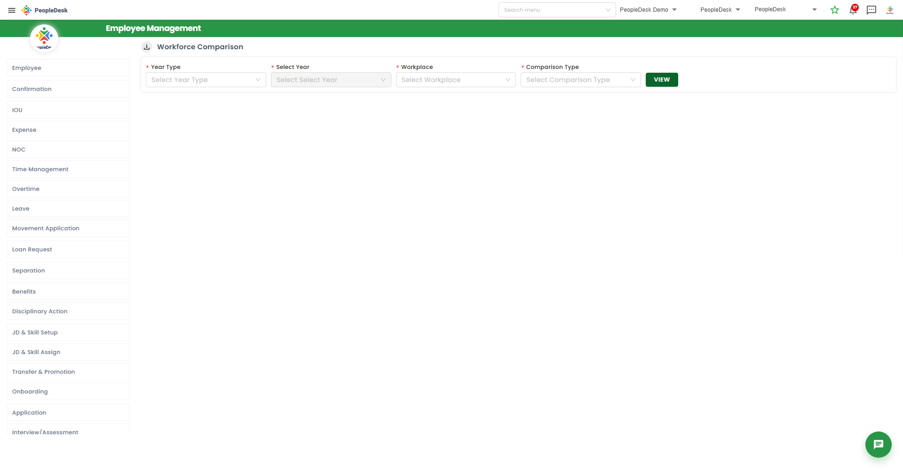

**What it does**: Workforce Comparison lets HR compare workforce planning figures (e.g. across years or planning types) for a selected workplace, to analyze headcount trends over time.

**Key fields / columns**: This is a setup/filter screen with no result table shown — filters are Year Type, Select Year, Workplace, Comparison Type.

**Buttons & actions**:
- **Year Type, Select Year, Workplace, Comparison Type** (all required dropdowns) — define what to compare.
- **VIEW** — runs the comparison and would display results.
- **Download icon** (top left, next to "Workforce Comparison" title) — exports comparison data.

**How to use it**:
1. Select the Year Type and specific Year.
2. Select the Workplace to analyze.
3. Choose a Comparison Type (e.g. year-over-year).
4. Click VIEW to generate the comparison.

**Pro-tip**: Have your Workforce Planning entries (previous section) filled in first — Workforce Comparison depends on that planning data existing to produce meaningful results.

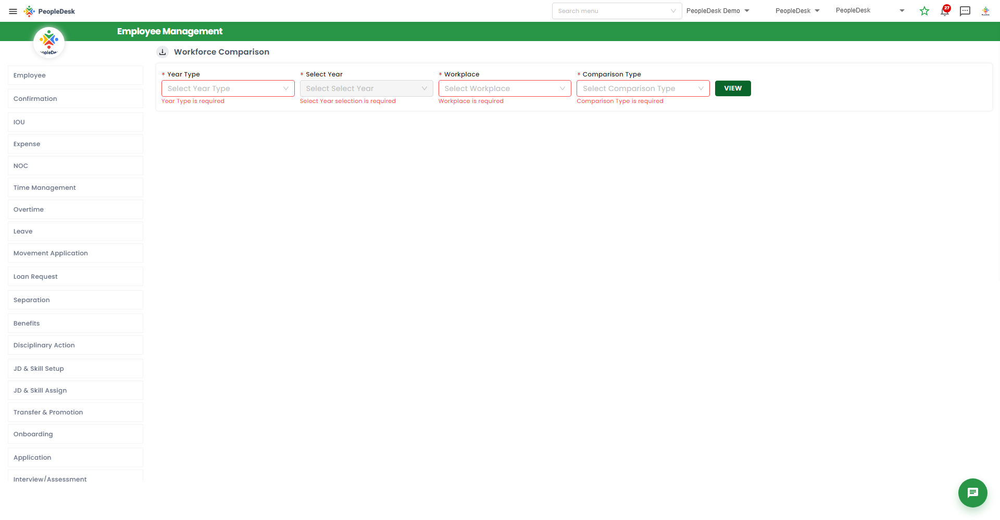

**Shows**: The same Workforce Comparison form after clicking VIEW with all fields empty — it displays red validation messages: "Year Type is required," "Select Year selection is required," "Workplace is required," and "Comparison Type is required." This is a validation-error state, not a populated comparison result.

---

#### Employee Locations

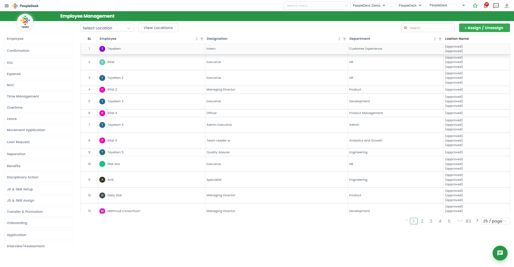

**What it does**: Employee Locations tracks which physical/remote work locations each employee is assigned to, useful for organizations managing remote or multi-site staff.

**Key fields / columns**: SL, Employee, Designation, Department, Location Name (shows one or more location entries per employee, each marked "(approved)").

**Buttons & actions**:
- **Select Location** dropdown — filter the list to a specific location.
- **View Locations** button — displays/refreshes the list of locations.
- **Search** box — quick keyword search across employees.
- **+ Assign / Unassign** — opens options to assign or remove an employee's location(s).
- **Column sort/filter icons** (Employee, Designation, Department, Loation Name) — sort or filter each column.
- **Pagination controls** (bottom right, e.g. 83 pages) — navigate the large employee list.

**How to use it**:
1. Optionally pick a location from Select Location and click View Locations to filter.
2. Use Search to find a specific employee.
3. Click + Assign / Unassign, then choose "Employee Wise Location" or "Location Wise Employee" to manage assignments.

**Pro-tip**: Use "Location Wise Employee" (from the Assign/Unassign menu) when you need to see everyone tied to one office/site at a glance, rather than paging through the full employee-wise list.

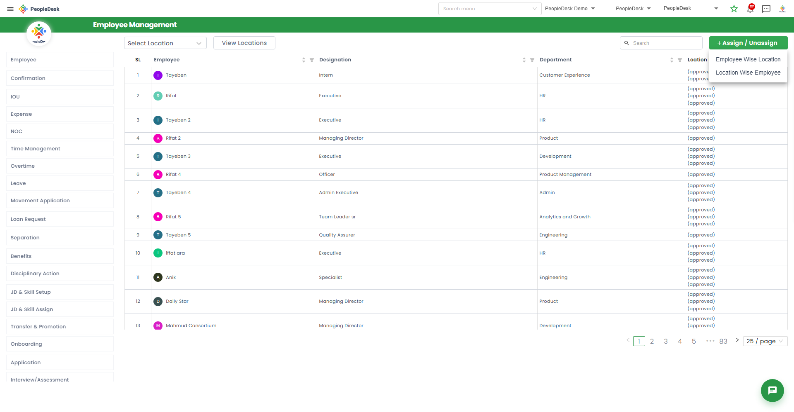

**Shows the Assign/Unassign menu**: Clicking **+ Assign / Unassign** reveals two options — **Employee Wise Location** (assign locations starting from an employee) and **Location Wise Employee** (assign employees starting from a location). There is no separate "create" form beyond this menu; selecting either option would open the corresponding assignment screen.

---

#### Employee List

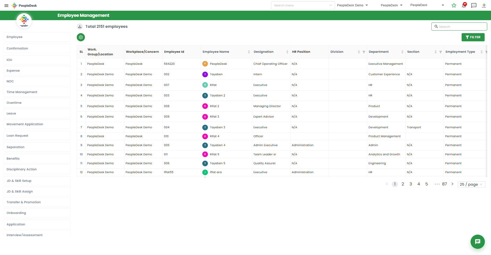

**What it does**: Employee List is the master roster of all employees in the organization, showing their organizational placement and employment details in one exportable table.

**Key fields / columns**: SL, Work Group/Location, Workplace/Concern, Employee Id, Employee Name, Designation, HR Position, Division, Department, Section, Employment Type (and additional columns off-screen to the right).

**Buttons & actions**:
- **Search** box (top right) — quick keyword search across all employees.
- **FILTER** button — opens advanced filtering options for the report.
- **Download icon** (top left, next to "Total 2151 employees") — exports the employee list.
- **Settings/gear icon** (green, below the title) — likely configures which columns are shown or report preferences.
- **Column sort/filter icons** (Employee Name, Designation, Section, etc.) — sort or filter individual columns.
- **Pagination controls** (bottom right, e.g. 87 pages, adjustable page size) — navigate the full 2,151-employee list.

**How to use it**:
1. Use Search for a quick lookup, or click FILTER for more precise criteria.
2. Sort/filter individual columns (e.g. Department, Section) to focus on a subset.
3. Click the download icon to export the full or filtered list for reporting.

**Pro-tip**: With 2,151+ employees, always apply a FILTER or Search before exporting — an unfiltered export can be unwieldy and slow to open.

#### Contract Closing

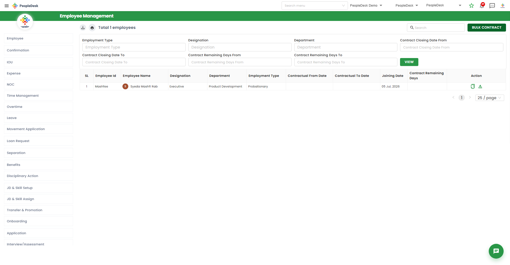

**What it does**: Lists employees whose employment contracts are ending, so HR can track and act on contract renewals or closures before the contractual end date arrives.

**Key fields / columns**: Employment Type, Designation, Department, Contract Closing Date From, Contract Closing Date To, Contract Remaining Days From, Contract Remaining Days To (filters); SL, Employee Id, Employee Name, Designation, Department, Employment Type, Contractual From Date, Contractual To Date, Joining Date, Contract Remaining Days, Action (table columns).

**Buttons & actions**:
- **Download icon** (top left, next to the print icon) — exports the current result list.
- **Print icon** — sends the list to a printer-friendly view.
- **Search box** (top right) — free-text search within the loaded results.
- **BULK CONTRACT** (green button) — opens a bulk-action flow to extend/renew contracts for multiple employees at once.
- **VIEW** (green button) — applies the filter values above the table and refreshes the results.
- **Action column icons** — a document/edit icon to update the employee's contract record, and a warning-triangle icon flagging an employee whose contract needs attention (e.g., closing soon).
- **Pagination controls** and **"25 / page"** dropdown at the bottom to move through pages and change page size.

**How to use it**: 1. Optionally narrow results using Employment Type, Designation, Department, or the Contract Closing/Remaining Days ranges. 2. Click **VIEW** to load matching employees. 3. Review the Contract Remaining Days column to spot upcoming expirations. 4. Use the Action icons to edit an individual record, or click **BULK CONTRACT** to process several employees together. 5. Use **Download** or **Print** to share the report.

**Pro-tip**: Filter by "Contract Remaining Days To" (e.g., 30) to get a quick list of everyone whose contract closes within the next month, so renewals don't slip through the cracks.

---

#### Need Confirmation

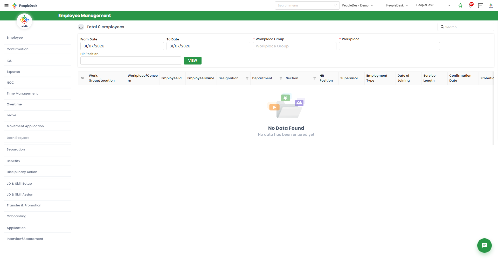

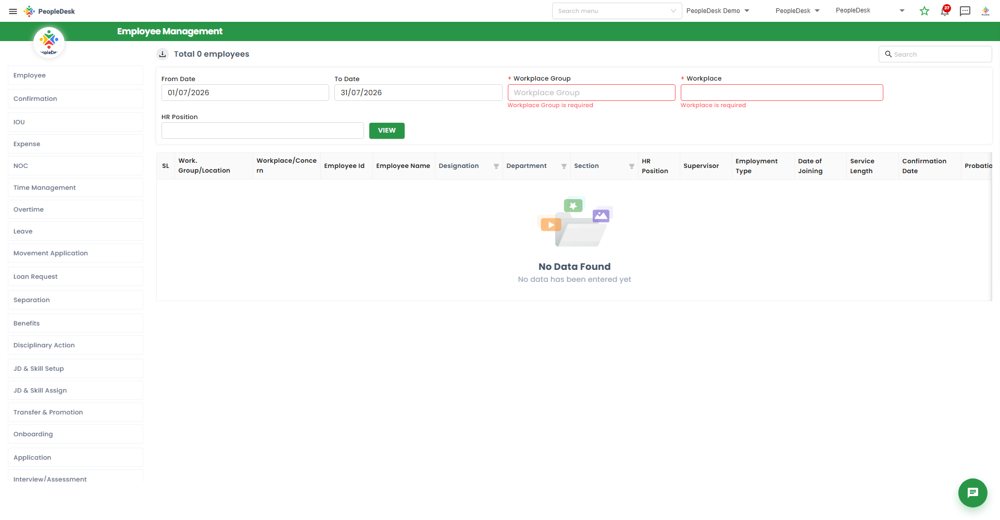

**What it does**: Helps HR identify employees who are due for confirmation (i.e., moving from probationary to permanent status) within a date range and workplace.

**Key fields / columns**: From Date, To Date, Workplace Group (required), Workplace (required), HR Position (filters); SL, Work. Group/Location, Workplace/Concern, Employee Id, Employee Name, Designation, Department, Section, HR Position, Supervisor, Employment Type, Date of Joining, Service Length, Confirmation Date, Probation... (table columns, additional columns scroll further right).

**Buttons & actions**:
- **Download icon** — exports the visible list.
- **Search box** (top right) — searches within loaded results.
- **VIEW** (green button) — runs the report using the filter values.

**How to use it**: 1. Set the From Date and To Date range. 2. Select a Workplace Group and Workplace — both are mandatory. 3. Optionally narrow by HR Position. 4. Click **VIEW**. 5. Review employees listed to plan confirmation reviews before their probation ends.

The second screenshot shows what happens when **VIEW** is clicked without filling the required fields: the Workplace Group and Workplace boxes are outlined in red with "Workplace Group is required" and "Workplace is required" messages, and the table stays empty. This is a validation state, not a detail view.

**Pro-tip**: Always select both Workplace Group and Workplace before clicking VIEW — the report will not run and will instead show inline validation errors if either is left blank.

---

#### Employee ID Card

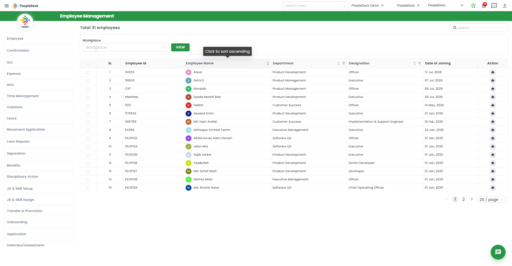

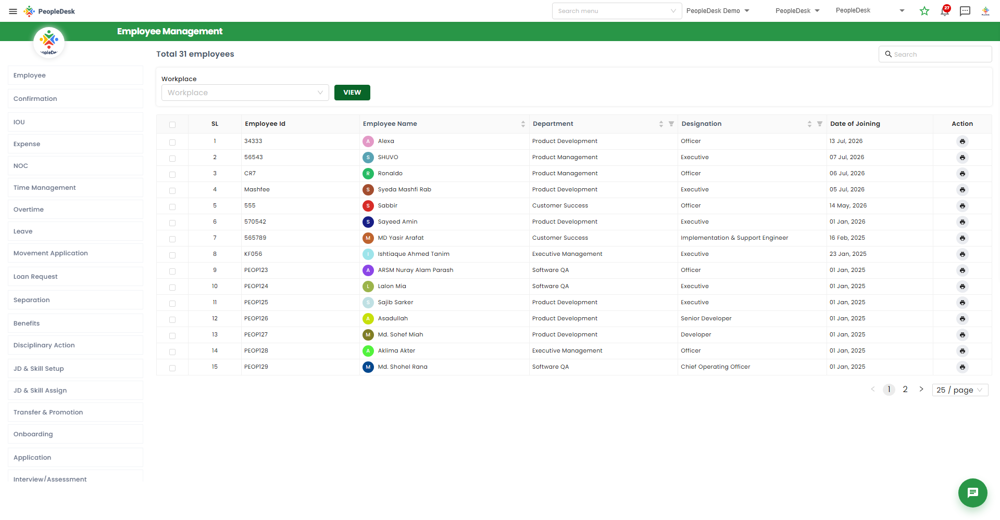

**What it does**: Lists all employees so HR can generate or print physical/digital ID cards for them.

**Key fields / columns**: Workplace (filter); SL, Employee Id, Employee Name, Department, Designation, Date of Joining, Action (table columns). Employee Name, Department, and Designation columns are sortable.

**Buttons & actions**:
- **Workplace dropdown** and **VIEW** button — filter the employee list to a specific workplace.
- **Search box** (top right) — free-text search across the list.
- **Action column printer icon** (one per row) — generates/prints that employee's ID card.
- **Sort arrows** on Employee Name, Department, and Designation column headers — reorder the list ascending/descending.
- **Pagination controls** and **"25 / page"** dropdown.

Both screenshots show the same populated list of 31 employees — the second is simply the result of the page (a tooltip "Click to sort ascending" is visible from hovering a sort arrow), not a separate detail screen.

**How to use it**: 1. Optionally select a Workplace and click **VIEW** to filter. 2. Locate the employee you need. 3. Click the printer icon in that employee's Action column to generate their ID card. 4. Use the sort arrows or Search box to find employees quickly in a long list.

**Pro-tip**: Sort by Department first if you're printing ID cards in batches for one team — it groups employees together so you don't have to hunt through the full list.

---

#### Inactive Employees

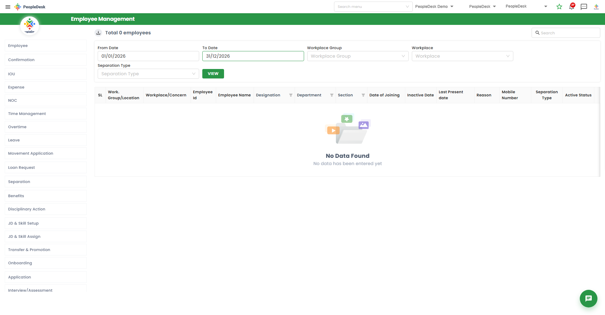

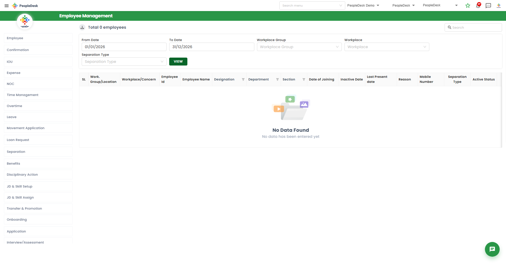

**What it does**: Reports employees who have become inactive (e.g., separated or deactivated) within a chosen date range, workplace, and separation type.

**Key fields / columns**: From Date, To Date, Workplace Group, Workplace, Separation Type (filters); SL, Work. Group/Location, Workplace/Concern, Employee Id, Employee Name, Designation, Department, Section, Date of Joining, Inactive Date, Last Present date, Reason, Mobile Number, Separation Type, Active Status (table columns).

**Buttons & actions**:
- **Download icon** — exports the report.
- **Search box** (top right) — searches within loaded results.
- **VIEW** (green button) — runs the report with the selected filters.

Both screenshots show the same "No Data Found" empty state for the demo account's current filter selection — no validation errors are shown, meaning the filters here are optional.

**How to use it**: 1. Set the From Date/To Date range. 2. Optionally choose a Workplace Group, Workplace, and Separation Type. 3. Click **VIEW**. 4. If no inactive employees match, you'll see "No data has been entered yet" instead of a table.

**Pro-tip**: Leave Workplace Group/Workplace blank and widen the date range first to confirm the report works before narrowing down — an overly specific filter combination is often why the list comes back empty.

---

#### Daily Attendance Report

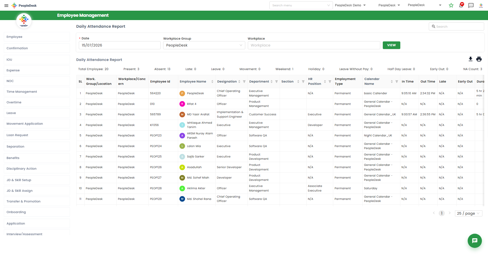

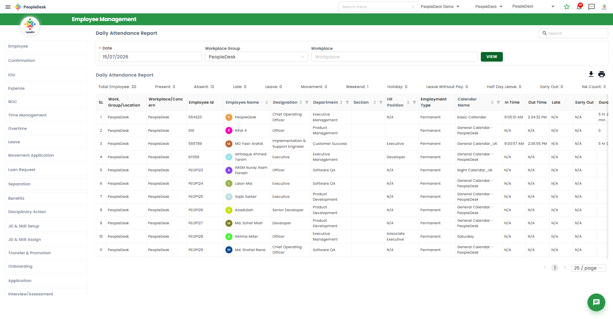

**What it does**: Shows a single day's attendance snapshot for all employees in a workplace, including headline counts (Present, Absent, Late, Leave, etc.) and each employee's in/out times.

**Key fields / columns**: Date (required), Workplace Group, Workplace (filters); summary counters — Total Employee, Present, Absent, Late, Leave, Movement, Weekend, Holiday, Leave Without Pay, Half Day Leave, Early Out, NA Count; table columns — SL, Work. Group/Location, Workplace/Concern, Employee Id, Employee Name, Designation, Department, Section, HR Position, Employment Type, Calendar Name, In Time, Out Time, Late, Early Out, Duration.

**Buttons & actions**:
- **Download icon** and **Print icon** (above the table) — export or print the report.
- **VIEW** (green button) — reloads the report for the selected Date/Workplace Group/Workplace.
- **Search box** (top right) — searches within loaded results.

Both screenshots show the same populated report for 15 Jul 2026 — the second is just the same view after running VIEW, not a separate detail screen.

**How to use it**: 1. Pick the Date you want to review. 2. Optionally filter by Workplace Group and Workplace. 3. Click **VIEW**. 4. Scan the summary counters for a quick daily headcount, then check individual rows for in/out times and lateness. 5. Use Download/Print to distribute the report.

**Pro-tip**: Check the "NA Count" in the summary bar — it flags employees with no calendar/shift assigned, which is often the root cause of "missing" attendance data.

---

#### Monthly Attendance Report

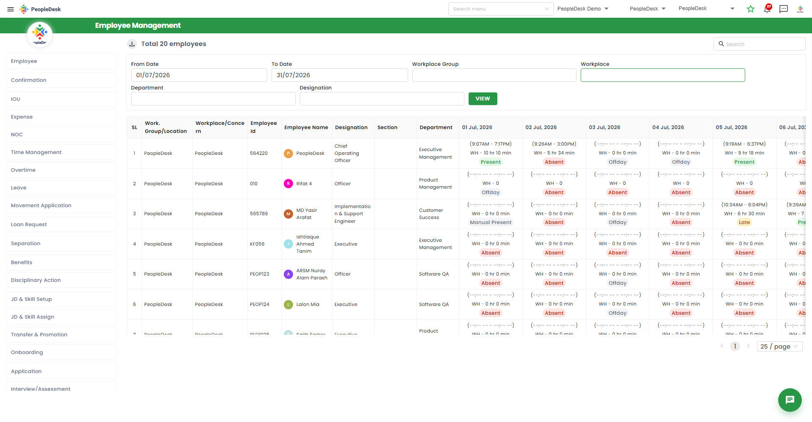

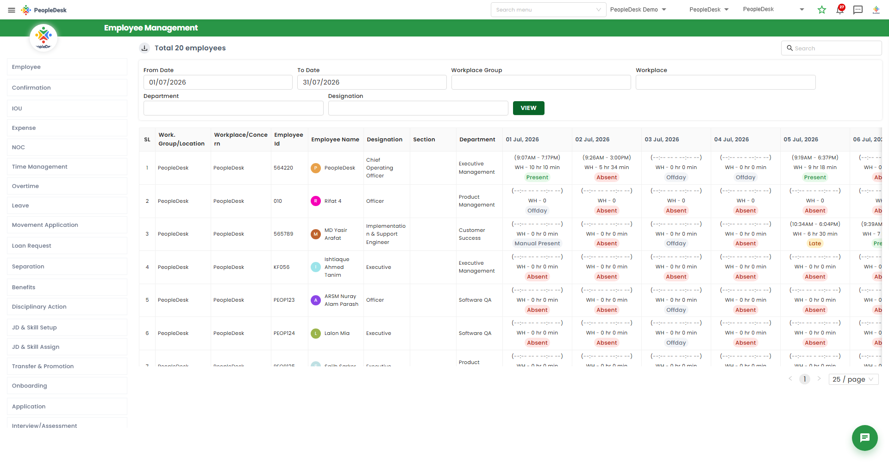

**What it does**: Displays a calendar-style grid of each employee's daily attendance status (Present, Absent, Offday, Manual Present, Late, etc.) across a date range, typically a full month.

**Key fields / columns**: From Date, To Date, Workplace Group, Workplace, Department, Designation (filters); SL, Work. Group/Location, Workplace/Concern, Employee Id, Employee Name, Designation, Section, Department, then one column per calendar date showing time-in/time-out and status (Present, Absent, Offday, Manual Present, Late).

**Buttons & actions**:
- **Download icon** (top left) — exports the grid.
- **VIEW** (green button) — refreshes the grid for the chosen date range and filters.
- **Search box** (top right).
- **Pagination controls** and **"25 / page"** dropdown.

Both screenshots are identical, showing the same 20-employee, July 2026 grid — the second is simply the same page reloaded, not a distinct detail view.

**How to use it**: 1. Set From Date and To Date to cover the period you want (e.g., a full month). 2. Optionally filter by Workplace Group, Workplace, Department, or Designation. 3. Click **VIEW**. 4. Scroll horizontally to see each date's status per employee. 5. Use Download to archive the monthly record.

**Pro-tip**: Scroll right slowly and look for repeated "Absent" strings on the same row — it's the fastest way to catch employees who may need a calendar/shift assignment fix rather than a genuine attendance issue.

---

#### Attendance Details With Location Report

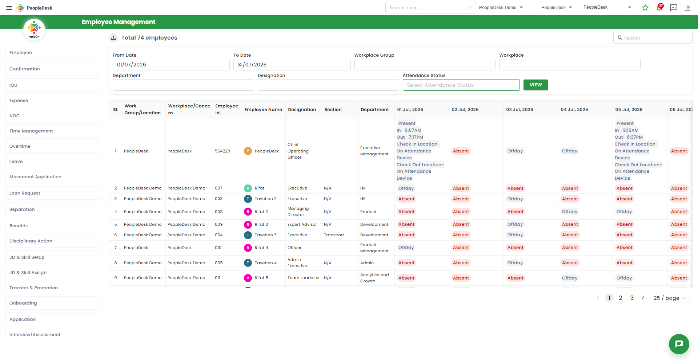

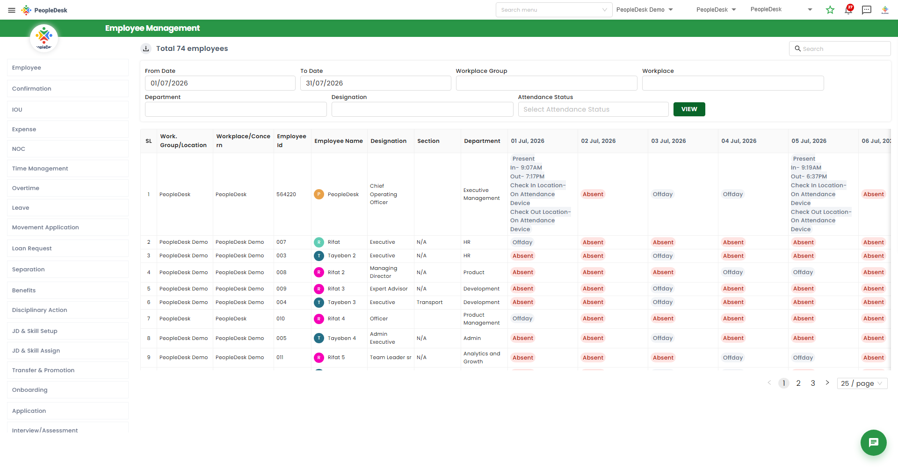

**What it does**: Extends the monthly attendance grid with check-in/check-out location context (e.g., "Check In Location - On Attendance Device") so HR can verify where an employee punched in from each day.

**Key fields / columns**: From Date, To Date, Workplace Group, Workplace, Department, Designation, Attendance Status (filters); SL, Work. Group/Location, Workplace/Concern, Employee Id, Employee Name, Designation, Section, Department, then per-date cells showing Present/Absent/Offday plus In/Out times and check-in/out location detail.

**Buttons & actions**:
- **Download icon** — exports the report.
- **Select Attendance Status** dropdown — filters rows to a specific status (e.g., Present, Absent).
- **VIEW** (green button) — runs the report.
- **Search box** (top right).
- **Pagination controls** ("1 2 3" and "25 / page").

Both screenshots show the same 74-employee report; the second is the same data reloaded, not a separate record view.

**How to use it**: 1. Set the date range. 2. Optionally filter by Workplace Group, Workplace, Department, Designation, or Attendance Status. 3. Click **VIEW**. 4. Expand a day's cell to see the location text confirming the device/location used for that punch.

**Pro-tip**: Use the Attendance Status filter to isolate "Present" days only when you specifically need to audit punch locations — it removes the clutter of Absent/Offday cells.

---

#### Monthly IN/OUT Report

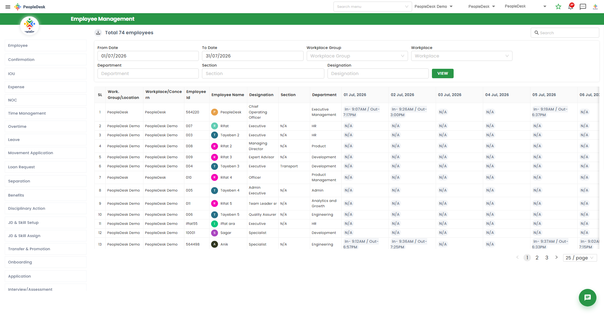

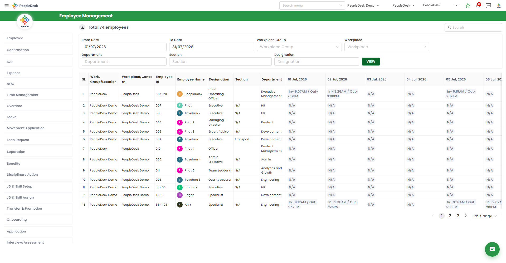

**What it does**: Shows a simplified per-date grid of just each employee's clock-in and clock-out times for the selected period, without the fuller status/location detail of the other attendance reports.

**Key fields / columns**: From Date, To Date, Workplace Group, Workplace, Department, Section, Designation (filters); SL, Work. Group/Location, Workplace/Concern, Employee Id, Employee Name, Designation, Department, Section, then one column per date showing "In-" and "Out-" times or N/A.

**Buttons & actions**:
- **Download icon** — exports the grid.
- **VIEW** (green button) — refreshes the report with the chosen filters.
- **Search box** (top right).
- **Pagination controls** ("1 2 3" and "25 / page").

Both screenshots show the same 74-employee In/Out grid — the second is a reload of the same data, not a distinct detail screen.

**How to use it**: 1. Set the date range. 2. Optionally filter by Workplace Group, Workplace, Department, Section, or Designation. 3. Click **VIEW**. 4. Scan across the date columns to see raw punch times per employee, useful for payroll cross-checks.

**Pro-tip**: This report is the fastest way to eyeball raw punch times without status labels getting in the way — pair it with the Daily Attendance Report when you need to explain *why* a day was marked Absent or Late.

---

#### Invalid IN/OUT Report

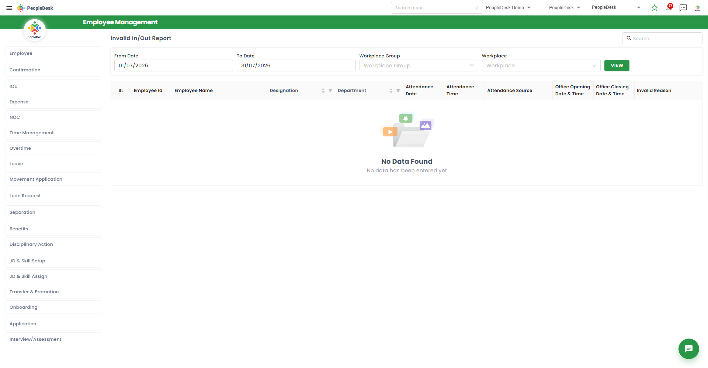

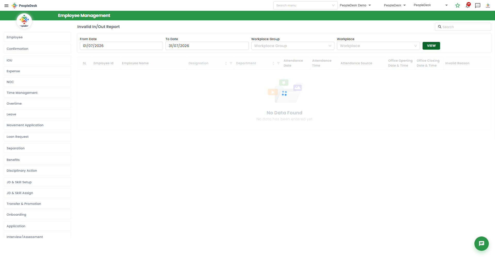

**What it does**: Flags attendance punches that fall outside expected office hours or otherwise look invalid (e.g., a check-in recorded after office closing time), so HR can investigate device or policy issues.

**Key fields / columns**: From Date, To Date, Workplace Group, Workplace (filters); SL, Employee Id, Employee Name, Designation, Department, Attendance Date, Attendance Time, Attendance Source, Office Opening Date & Time, Office Closing Date & Time, Invalid Reason (table columns).

**Buttons & actions**:
- **VIEW** (green button) — runs the report for the selected date range and workplace.
- **Search box** (top right).

Both screenshots show a "No Data Found" empty state (no invalid punches in this date range) — the second image is simply the same empty result re-rendered, not a genuine detail screen.

**How to use it**: 1. Set From Date/To Date. 2. Optionally filter by Workplace Group and Workplace. 3. Click **VIEW**. 4. If results appear, check the Invalid Reason column to understand why each punch was flagged (e.g., outside office hours).

**Pro-tip**: An empty result here is good news — it means every recorded punch fell within valid office hours for the period checked.

---

#### Attendance Report

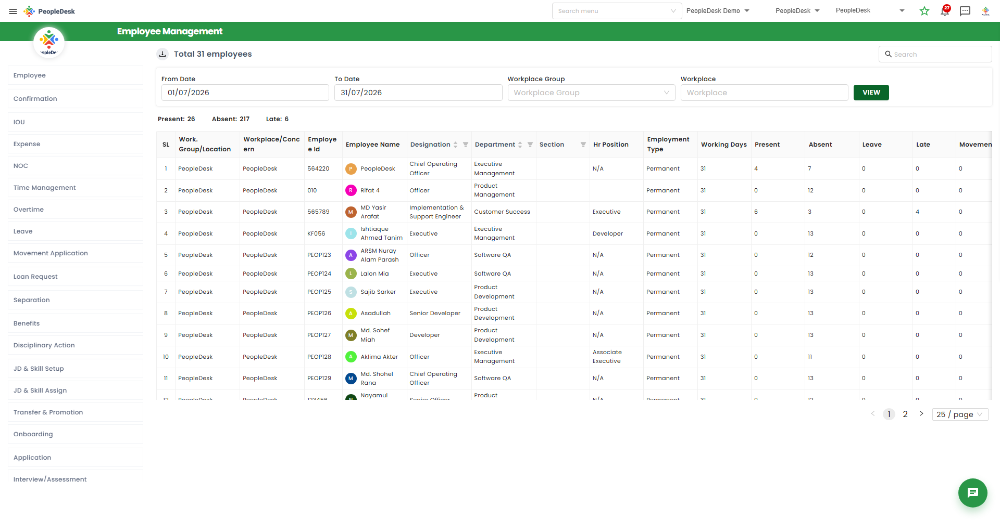

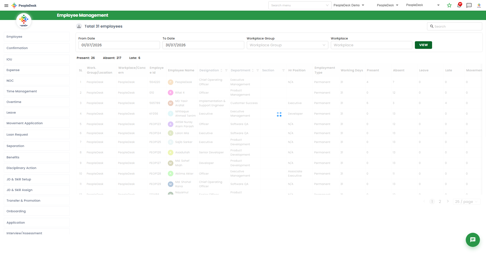

**What it does**: Gives a summarized attendance scorecard per employee over a date range — total working days versus days present, absent, on leave, late, or on movement — rather than a day-by-day grid.

**Key fields / columns**: From Date, To Date, Workplace Group, Workplace (filters); summary counters — Present, Absent, Late; table columns — SL, Work. Group/Location, Workplace/Concern, Employee Id, Employee Name, Designation, Department, Section, Hr Position, Employment Type, Working Days, Present, Absent, Leave, Late, Movement (and further columns off-screen).

**Buttons & actions**:
- **VIEW** (green button) — runs the summary for the chosen filters.
- **Search box** (top right).
- **Pagination controls** ("1 2" and "25 / page").

Both screenshots show the same 31-employee summary; the second appears mid-render (slightly faded) but carries identical data — it is the same report reloading, not a separate detail view.

**How to use it**: 1. Set the From Date/To Date. 2. Optionally filter by Workplace Group and Workplace. 3. Click **VIEW**. 4. Use the Working Days vs. Present/Absent/Leave/Late columns to quickly compare attendance reliability across employees.

**Pro-tip**: Sort mentally by the Absent column (or export and sort in a spreadsheet) to prioritize follow-up conversations with employees who have unusually high absence counts for the period.

---

#### Emp Roster Report

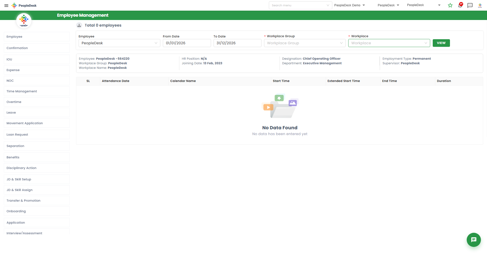

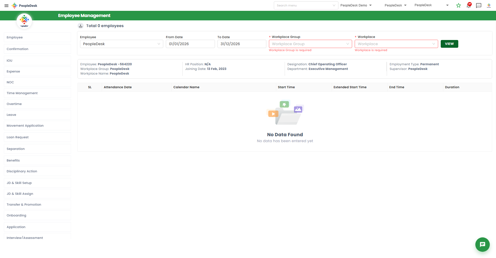

**What it does**: Shows an individual employee's assigned work calendar/roster entries (attendance date, calendar name, shift start/end times, and duration) for a selected period.

**Key fields / columns**: Employee, From Date, To Date, Workplace Group (required), Workplace (required) (filters); employee info panel — Employee, Workplace Group, Workplace Name, HR Position, Joining Date, Designation, Department, Employment Type, Supervisor; table columns — SL, Attendance Date, Calendar Name, Start Time, Extended Start Time, End Time, Duration.

**Buttons & actions**:
- **VIEW** (green button) — runs the roster report.
- **Download icon** — exports the result.
- **Search box** (top right).

The second screenshot shows what happens when **VIEW** is clicked without selecting Workplace Group and Workplace: both fields are outlined in red with "Workplace Group is required" and "Workplace is required" messages, and the table remains empty. This is a validation state.

**How to use it**: 1. Choose the Employee. 2. Set the From Date/To Date. 3. Select both Workplace Group and Workplace (mandatory). 4. Click **VIEW** to see that employee's roster entries for the period.

**Pro-tip**: The employee info panel above the table (Designation, Department, Supervisor, etc.) is a quick way to confirm you've selected the right person before reading the roster detail below it.

---

#### Roster Report

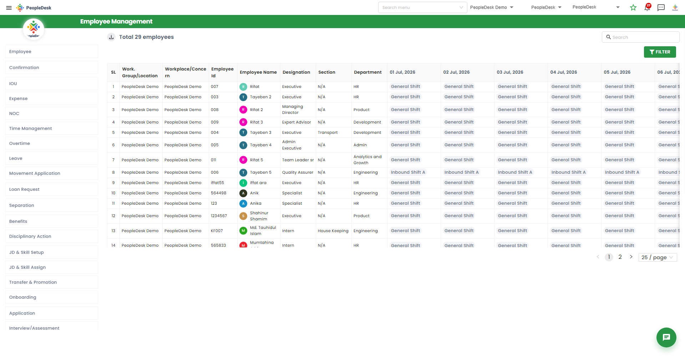

**What it does**: Shows the assigned shift/calendar name (e.g., "General Shift", "Inbound Shift A") for every employee across a range of dates, useful for confirming who is scheduled on which shift.

**Key fields / columns**: SL, Work. Group/Location, Workplace/Concern, Employee Id, Employee Name, Designation, Section, Department, then one column per date showing the assigned shift/calendar name.

**Buttons & actions**:
- **Download icon** — exports the roster grid.
- **FILTER** (green button, top right) — opens a filter panel (collapsed by default in this screenshot) to narrow the employee list by criteria such as workplace, department, or date range.
- **Search box** (top right).
- **Pagination controls** ("1 2" and "25 / page").

**How to use it**: 1. Click **FILTER** to open filtering options if you need to narrow the list. 2. Scroll horizontally across the date columns to see each employee's scheduled shift per day. 3. Use Download to export the roster for distribution or payroll planning.

**Pro-tip**: Look for employees showing a shift name different from "General Shift" (like "Inbound Shift A") — these are your exceptions worth double-checking before the schedule goes live.

---

#### Separation Report

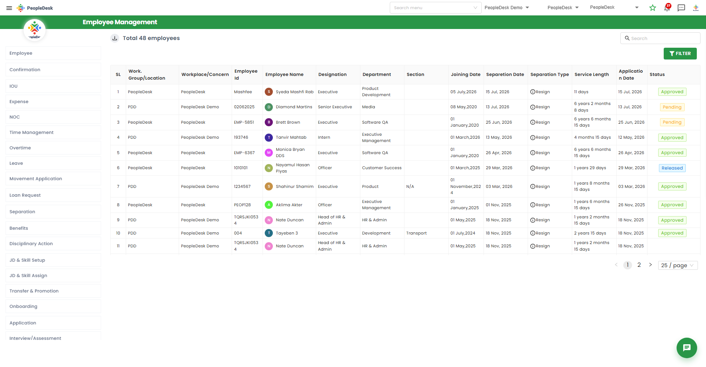

**What it does**: Lists employees who have separated (e.g., resigned) from the company, along with their separation type, service length, and approval status.

**Key fields / columns**: SL, Work. Group/Location, Workplace/Concern, Employee Id, Employee Name, Designation, Department, Section, Joining Date, Separation Date, Separation Type, Service Length, Application Date, Status.

**Buttons & actions**:
- **Download icon** — exports the report.
- **FILTER** (green button) — opens a filter panel to narrow by date range, workplace, department, or status.
- **Search box** (top right).
- **Status badges** in the table — color-coded labels (Approved in green, Pending in yellow, Released in blue) showing where each separation stands in the approval workflow.
- **Pagination controls** ("1 2" and "25 / page").

**How to use it**: 1. Click **FILTER** to set a date range or other criteria if needed. 2. Review the Status column to see which separations are still Pending versus Approved or Released. 3. Use the Service Length column to understand tenure at exit. 4. Export via Download for record-keeping.

**Pro-tip**: Filter or scan for "Pending" status rows first — these are the separations still awaiting HR sign-off and need action.

---

#### Monthly Punch Details Report

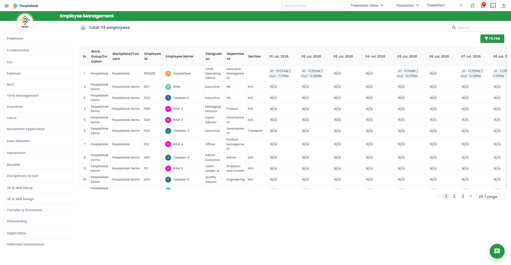

**What it does**: Provides a detailed month-long, per-date breakdown of each employee's raw in/out punch times, similar to the Monthly IN/OUT Report but scoped as its own report entry point.

**Key fields / columns**: SL, Work. Group/Location, Workplace/Concern, Employee Id, Employee Name, Designation, Department, Section, then one column per date showing "In-"/"Out-" timestamps or N/A.

**Buttons & actions**:
- **FILTER** (green button) — opens a filter panel for date range, workplace, department, etc.
- **Search box** (top right).
- **Pagination controls** ("1 2 3" and "25 / page").

**How to use it**: 1. Click **FILTER** to set the date range and any workplace/department filters. 2. Scroll horizontally through the date columns to review punch times for each employee. 3. Use this alongside payroll processing to verify recorded work hours.

**Pro-tip**: Because this report can span many date columns, use the FILTER panel to shrink the date range to just the pay period you're validating — it makes horizontal scanning much faster.

---

#### Loan History

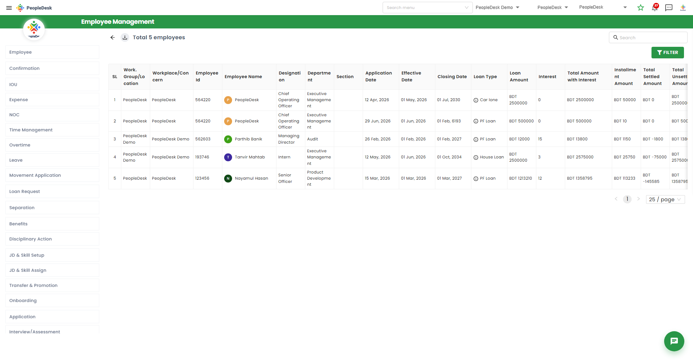

**What it does**: Shows the loan records for employees — loan type, amount, interest, and how much has been settled versus is still outstanding.

**Key fields / columns**: SL, Work. Group/Location, Workplace/Concern, Employee Id, Employee Name, Designation, Department, Section, Application Date, Effective Date, Closing Date, Loan Type, Loan Amount, Interest, Total Amount with Interest, Installment Amount, Total Settled Amount, Total Unsettled Amount.

**Buttons & actions**:
- **Back arrow** (top left) — returns to the previous reports page.
- **Download icon** — exports the loan history list.
- **FILTER** (green button) — opens a filter panel (e.g., by employee, loan type, or date).
- **Search box** (top right).
- **Pagination controls**.

**How to use it**: 1. Use **FILTER** to narrow by employee or loan type if the list is long. 2. Review Total Settled Amount vs. Total Unsettled Amount to see repayment progress for each loan. 3. Use Download to share the ledger with finance/payroll.

**Pro-tip**: Watch for negative values in Total Unsettled Amount (seen in this data) — that typically indicates an overpayment or a data-entry issue worth reconciling with finance.

---

#### Leave History

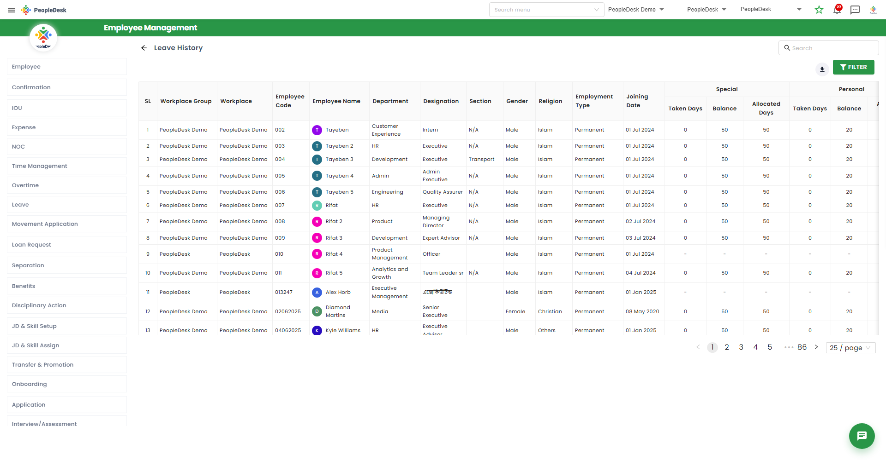

**What it does**: Shows each employee's leave balances and usage, broken out by leave category (e.g., Special, Personal), including days taken and remaining balance.

**Key fields / columns**: SL, Workplace Group, Workplace, Employee Code, Employee Name, Department, Designation, Section, Gender, Religion, Employment Type, Joining Date, and paired Taken Days/Balance/Allocated Days columns for each leave category (Special, Personal, and additional categories further right).

**Buttons & actions**:
- **Back arrow** (top left) — returns to the previous page.
- **Download icon** — exports the leave history.
- **FILTER** (green button) — opens a filter panel to narrow by employee, department, or leave type.
- **Search box** (top right).
- **Pagination controls** (multiple pages — up to 86 pages in this dataset — with a "25 / page" size selector).

**How to use it**: 1. Use **FILTER** to scope down to a specific department or employee if needed. 2. Compare Allocated Days against Balance to see how much leave an employee has left in each category. 3. Export via Download for HR record audits.

**Pro-tip**: With large datasets (86 pages here), increase the page size dropdown or apply a Department filter first — it saves a lot of clicking through pagination.

---

#### Movement History

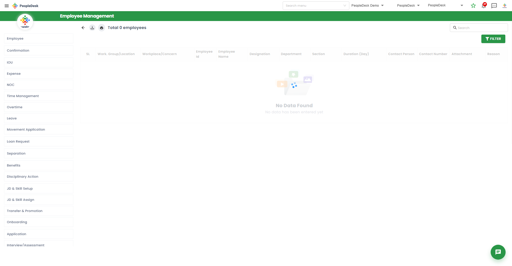

**What it does**: Tracks employee movement applications (e.g., approved off-site trips or field visits) including duration, contact details, and reason — this view currently shows no records.

**Key fields / columns**: SL, Work. Group/Location, Workplace/Concern, Employee Id, Employee Name, Designation, Department, Section, Duration (Day), Contact Person, Contact Number, Attachment, Reason.

**Buttons & actions**:
- **Back arrow** (top left) — returns to the previous page.
- **Download icon** and **Print icon** — export or print the report.
- **FILTER** (green button) — opens a filter panel to narrow by date range, employee, or workplace.

The screenshot shows a "No Data Found" empty state, meaning no movement records exist for the currently applied (default) filters.

**How to use it**: 1. Click **FILTER** to set a date range or employee. 2. Review resulting rows for Duration, Contact Person/Number, and Reason for each movement. 3. Use the Attachment column link (when populated) to view supporting documents.

**Pro-tip**: If you expect movement records to appear but see "No Data Found," double check the FILTER panel's date range — it may default to a period with no activity.

---

#### OverTime Report

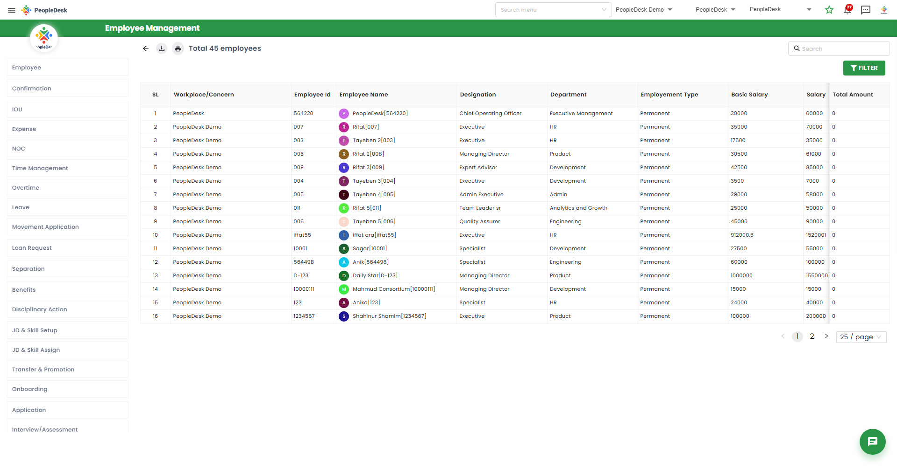

**What it does**: Summarizes overtime-related pay figures per employee — basic salary, salary, and total amount — for payroll and overtime cost tracking.

**Key fields / columns**: SL, Workplace/Concern, Employee Id, Employee Name, Designation, Department, Employement Type, Basic Salary, Salary, Total Amount.

**Buttons & actions**:
- **Back arrow** (top left) — returns to the previous page.
- **Download icon** and **Print icon** — export or print the report.
- **FILTER** (green button) — opens a filter panel to narrow by date range, department, or employee.
- **Pagination controls** ("1 2" and "25 / page").

**How to use it**: 1. Click **FILTER** to set the period and any department/employee criteria. 2. Review the Total Amount column to identify high overtime cost outliers. 3. Export via Download or Print for payroll processing.

**Pro-tip**: Cross-check high Total Amount entries against the Daily/Monthly Attendance reports to confirm the overtime hours were actually logged and approved, not just calculated from a salary formula.

---

#### Job Card

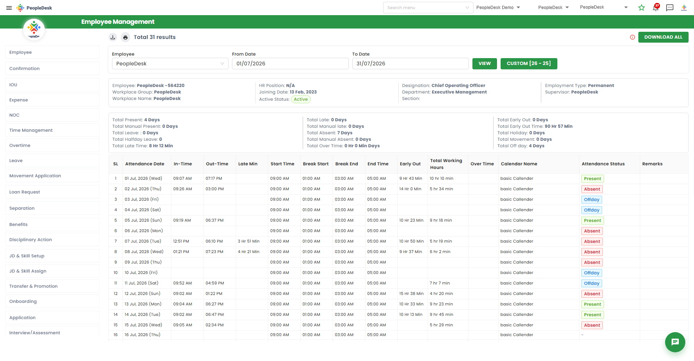

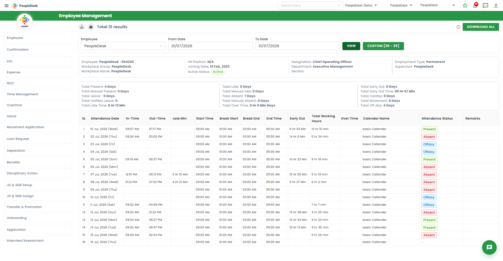

**What it does**: Provides a full attendance "job card" for one employee — profile summary, aggregate stats (present/absent/late/overtime/holiday/off-day totals), and a day-by-day breakdown for the selected period.

**Key fields / columns**: Employee, From Date, To Date (filters); profile panel — Employee, HR Position, Designation, Employment Type, Workplace Group, Joining Date, Department, Supervisor, Workplace Name, Active Status; summary stats — Total Present, Total Manual Present, Total Leave, Total Halfday Leave, Total Late Time, Total Late, Total Manual late, Total Absent, Total Manual Absent, Total Over Time, Total Early Out, Total Early Out Time, Total Holiday, Total Movement, Total Off day; table columns — SL, Attendance Date, In-Time, Out-Time, Late Min, Start Time, Break Start, Break End, End Time, Early Out, Total Working Hours, Over Time, Calendar Name, Attendance Status, Remarks.

**Buttons & actions**:
- **VIEW** (green button) — runs the job card for the selected Employee and date range.
- **CUSTOM [26-25]** (green button) — applies a custom/alternate date range shortcut (shown here as a preset like "26th to 25th" of the month, common for payroll cycles).
- **DOWNLOAD ALL** (button, top right) — exports the complete job card.
- **Download icon** and **Print icon** (next to the results count) — export or print just the table.
- **Search box** (top right).

Both screenshots show the identical job card for employee "PeopleDesk" over 01–31 Jul 2026 — the second is the same rendered report, not a separate detail popup.

**How to use it**: 1. Select the Employee from the dropdown. 2. Set From Date and To Date, or use **CUSTOM [26-25]** for a standard payroll-cycle range. 3. Click **VIEW**. 4. Review the profile panel to confirm the right employee, scan the summary stats for a quick health check, then check the day-by-day table for specifics like Late Min or Attendance Status. 5. Use **DOWNLOAD ALL** to archive or share the full record.

**Pro-tip**: The Attendance Status column's color-coded badges (Present/green, Absent/red, Offday/blue) make it easy to visually scan a whole month at a glance before diving into the numeric columns.

#### Joinee Attendance Report

**What it does**: Lists newly joined employees alongside their attendance-related details, using the same list layout as the core Employee directory so HR can track how recent hires are settling into the attendance system.

**Key fields / columns**: 
- SL (serial number)
- Work. Group/Location
- Workplace/Concern
- Employee Id
- Employee Name
- Designation
- Department

**Buttons & actions**: 
- **Download icon** (top left, next to the row count) — exports the current list.
- **FILTER** (top right, green button) — opens filter options to narrow the list (e.g. by workplace, department, or joining date range).

**How to use it**: 
1. Open **Reports > Joinee Attendance Report** from the Employee Management menu.
2. Click **FILTER** to set the criteria you want (workplace, department, date range).
3. Review the resulting list of joinees and their attendance columns.
4. Use the download icon to export the list if you need to share it offline.

**Pro-tip**: If the table shows "No Data Found," check that a workplace/date filter hasn't been left too narrow — this report only returns rows for employees whose joining and attendance records match the active filter.

---

#### Early Out Report

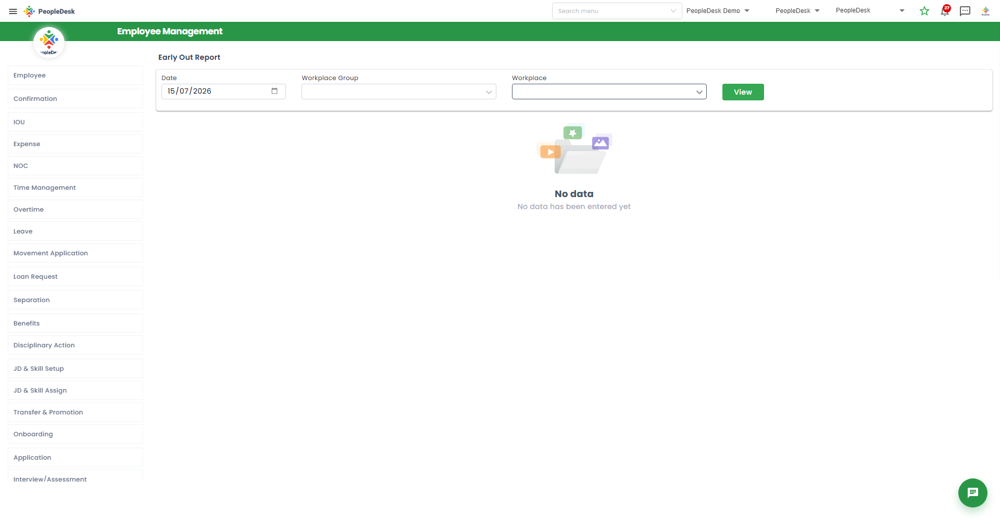

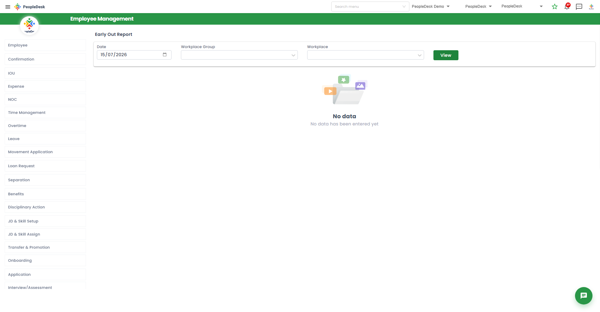

**What it does**: Shows employees who checked out earlier than their scheduled shift end time on a selected date, helping supervisors spot early departures.

**Key fields / columns**: 
- Date (defaults to today's date)
- Workplace Group
- Workplace

**Buttons & actions**: 
- **View** (green button) — runs the report for the selected date, workplace group, and workplace.

**How to use it**: 
1. Go to **Reports > Early Out Report**.
2. Confirm or change the **Date**.
3. Select a **Workplace Group** and then a **Workplace**.
4. Click **View** to load the results.

**Pro-tip**: The Workplace field only populates useful options once a Workplace Group is chosen first — select Workplace Group before trying to pick a Workplace.

---

#### Absent Report

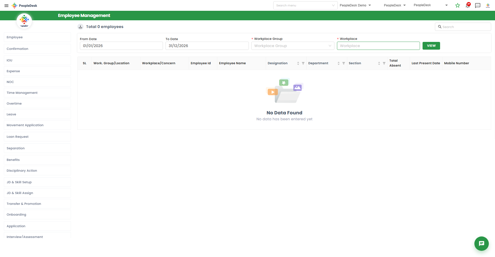

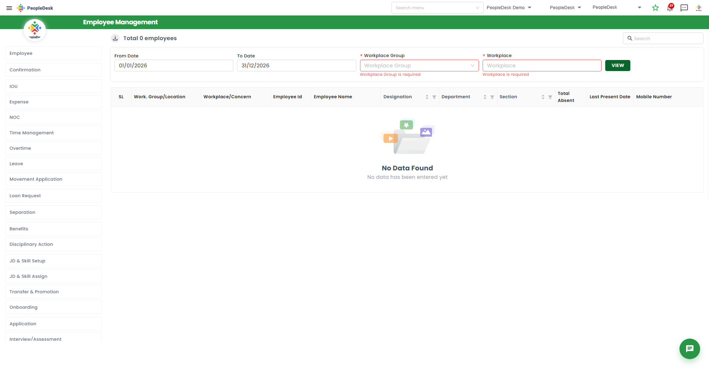

**What it does**: Lists employees who were absent within a chosen date range for a specific workplace, showing how long they've been away and when they were last present.

**Key fields / columns**: 
- From Date / To Date
- Workplace Group (required)
- Workplace (required)
- SL, Work. Group/Location, Workplace/Concern, Employee Id, Employee Name, Designation, Department, Section, Total Absent, Last Present Date, Mobile Number

**Buttons & actions**: 
- **Search** (top right search box) — quick text search within the loaded results.
- **Download icon** — exports the current results.
- **VIEW** (green button) — runs the report with the chosen filters.

**How to use it**: 
1. Open **Reports > Absent Report**.
2. Set the **From Date** and **To Date** range.
3. Select the required **Workplace Group** and **Workplace**.
4. Click **VIEW** to generate the report.

**Pro-tip**: Both Workplace Group and Workplace are mandatory — if you click VIEW without picking them, the page displays "Workplace Group is required" and "Workplace is required" in red under each field (as shown in the second screenshot), so fill both before viewing.

---

#### Employee Breakdown By Designation

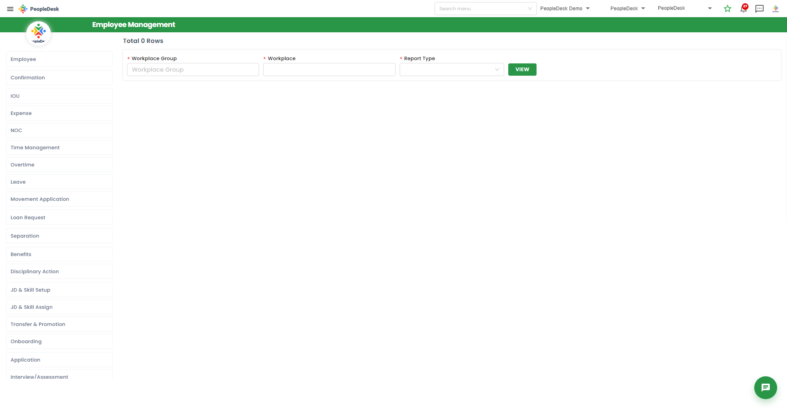

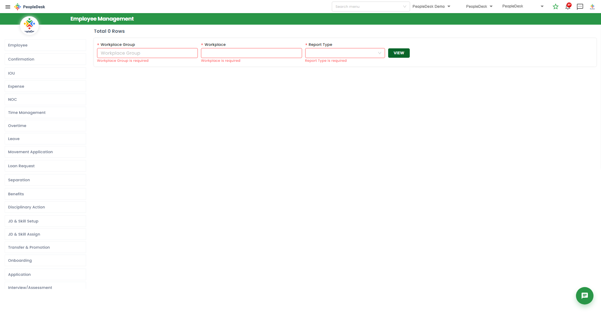

**What it does**: Breaks down headcount by designation (job title) for a chosen workplace, letting HR see how many employees hold each role.

**Key fields / columns**: 
- Workplace Group (required)
- Workplace (required)
- Report Type (required)

**Buttons & actions**: 
- **VIEW** (green button) — generates the breakdown once all three filters are set.

**How to use it**: 
1. Open **Reports > Employee Breakdown by Designation**.
2. Select **Workplace Group**, **Workplace**, and **Report Type**.
3. Click **VIEW** to display the breakdown.

**Pro-tip**: All three fields are mandatory. Leaving any of them blank and clicking VIEW triggers "Workplace Group is required," "Workplace is required," and "Report Type is required" messages, as seen in the second screenshot — fill in every field before viewing.

---

#### Joining Report

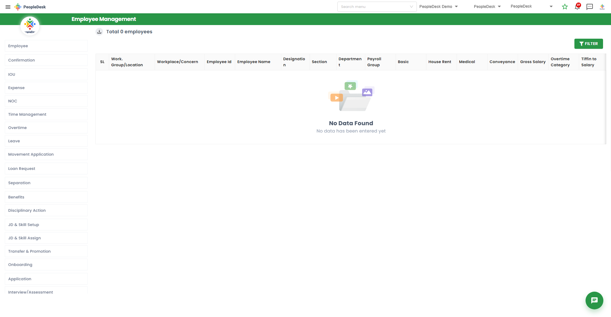

**What it does**: Lists employees who joined the organization along with their designation, department, payroll, and salary breakdown details, useful for tracking new-hire onboarding and pay setup.

**Key fields / columns**: 
- SL, Work. Group/Location, Workplace/Concern, Employee Id, Employee Name, Designation, Section, Department
- Payroll Group, Basic, House Rent, Medical, Conveyance, Gross Salary, Overtime Category, Tiffin to Salary

**Buttons & actions**: 
- **Download icon** — exports the current employee list.
- **FILTER** (green button) — opens filter options (e.g. joining date range, workplace, department) to narrow the list.

**How to use it**: 
1. Open **Reports > Joining Report**.
2. Click **FILTER** and set your date range/workplace criteria.
3. Review the joined employees and their salary/payroll breakdown.
4. Use the download icon to export if needed.

**Pro-tip**: Because this report also lists salary components (Basic, House Rent, Medical, etc.), it doubles as a quick check that new joiners have been correctly set up in payroll.

---

#### Late Report

**What it does**: Shows employees who clocked in late relative to their assigned calendar's in-time, along with how many minutes late they were.

**Key fields / columns**: 
- SL, Employee Id, Employee, Designation, Department, Section, Calender Name, In Time, Late (mins)

**Buttons & actions**: 
- **Download icon** — exports the current list.
- **FILTER** (green button) — opens filters (e.g. date range, workplace, department) to narrow the results.

**How to use it**: 
1. Open **Reports > Late Report**.
2. Click **FILTER** and choose the date range and workplace/department you need.
3. Review employees along with their late-arrival minutes.
4. Export via the download icon if a copy is needed.

**Pro-tip**: Sort or scan the "Late (mins)" column to quickly identify repeat latecomers rather than reading the list top to bottom.

---

#### Employee Data Checklist

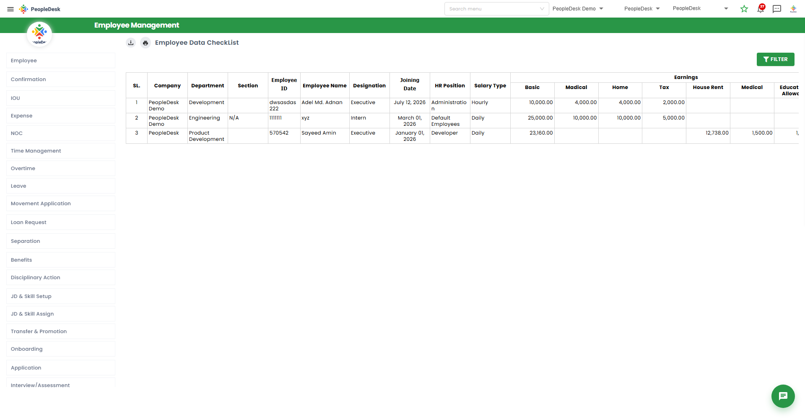

**What it does**: Provides a consolidated checklist view of each employee's core HR and payroll data — company, department, designation, joining date, HR position, salary type, and full earnings breakdown — useful for auditing that employee records are complete and correct.

**Key fields / columns**: 
- SL, Company, Department, Section, Employee ID, Employee Name, Designation, Joining Date, HR Position, Salary Type
- Earnings breakdown: Basic, Madical, Home, Tax, House Rent, Medical, Education Allowance (and further columns off-screen)

**Buttons & actions**: 
- **Download icon** — exports the checklist.
- **Print icon** — sends the checklist to print.
- **FILTER** (green button) — opens filter options to narrow which employees are listed.

**How to use it**: 
1. Open **Reports > Employee Data Checklist**.
2. Click **FILTER** to select the company/department/employee scope you want to audit.
3. Review each row for missing or inconsistent earnings/HR data.
4. Use the print or download icon to produce a hard copy or file for record-keeping.

**Pro-tip**: Use this report right after onboarding a batch of new employees to catch any missing salary components (like House Rent or Medical) before the first payroll run.

---

#### PF Fund Report

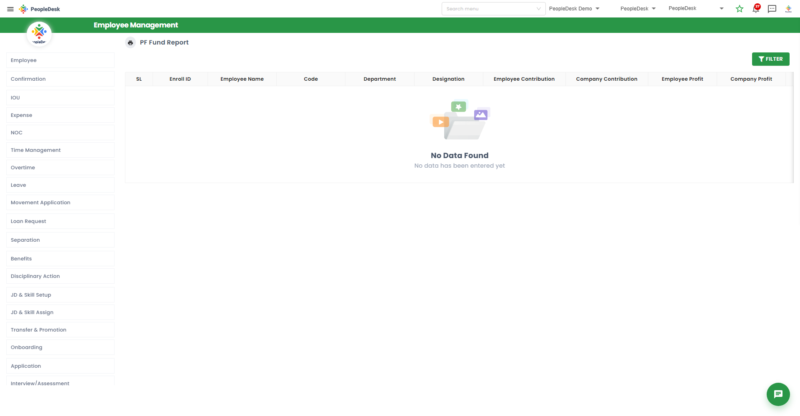

**What it does**: Reports each employee's Provident Fund (PF — a retirement savings scheme) contributions and profit, comparing what the employee contributed versus what the company contributed.

**Key fields / columns**: 
- SL, Enroll ID, Employee Name, Code, Department, Designation
- Employee Contribution, Company Contribution, Employee Profit, Company Profit

**Buttons & actions**: 
- **Print icon** — sends the report to print.
- **FILTER** (green button) — opens filter options to select the employees/date range/workplace to report on.

**How to use it**: 
1. Open **Reports > PF Fund Report**.
2. Click **FILTER** and choose the workplace, department, or specific employees.
3. Review the contribution and profit columns for each employee.
4. Print the report if a physical or PDF copy is required for records.

**Pro-tip**: Compare "Employee Contribution" against "Company Contribution" periodically to confirm the PF matching ratio configured in payroll is being applied correctly.

---

#### Daily Overtime Report

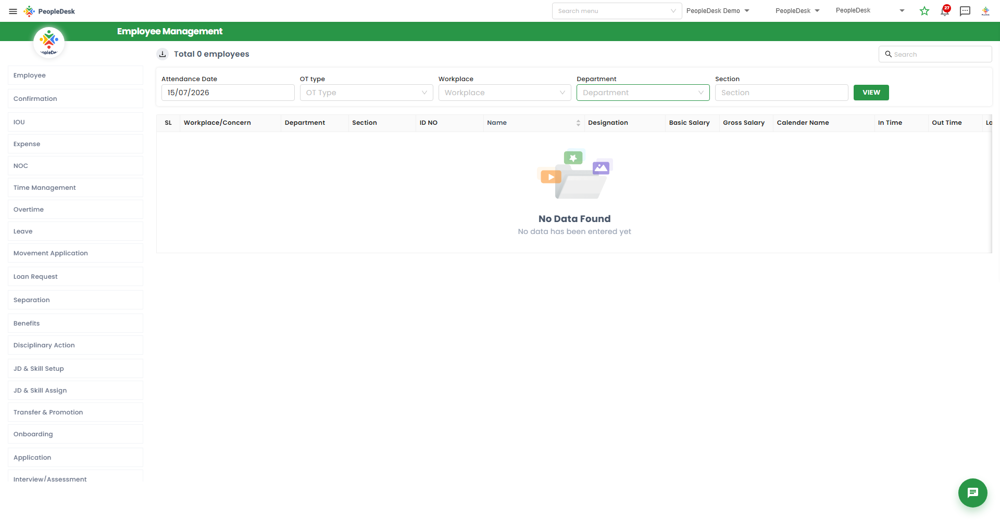

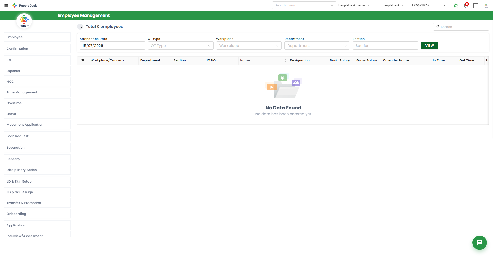

**What it does**: Shows employees' overtime (OT) hours for a specific attendance date, filterable by OT type, workplace, department, and section.

**Key fields / columns**: 
- Attendance Date, OT type, Workplace, Department, Section
- SL, Workplace/Concern, Department, Section, ID NO, Name, Designation, Basic Salary, Gross Salary, Calender Name, In Time, Out Time, Late (and further columns off-screen)

**Buttons & actions**: 
- **Download icon** — exports the results.
- **Search box** (top right) — quickly filters the loaded rows.
- **VIEW** (green button) — runs the report for the selected date/OT type/workplace/department/section.

**How to use it**: 
1. Open **Reports > Daily Overtime Report**.
2. Set the **Attendance Date**.
3. Optionally choose an **OT type**, **Workplace**, **Department**, and **Section** to narrow results.
4. Click **VIEW** to display matching overtime records.

**Pro-tip**: Leave Department/Section blank on the first pass to see overtime across the whole workplace, then drill down with those filters once you spot a department with unusually high OT.

---

#### Monthly Leave Report

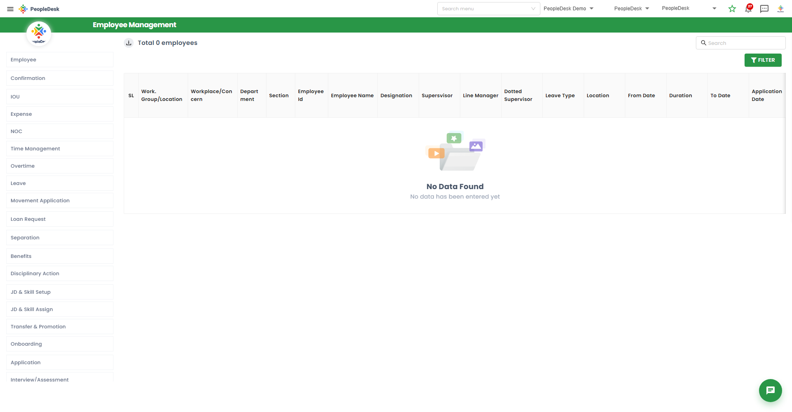

**What it does**: Lists employees' leave applications for a month, including who approved the chain of command (supervisor, line manager, dotted supervisor) and the leave type, duration, and dates.

**Key fields / columns**: 
- SL, Work.Group/Location, Workplace/Concern, Department, Section, Employee Id, Employee Name, Designation
- Supervisor, Line Manager, Dotted Supervisor, Leave Type, Location, From Date, Duration, To Date, Application Date

**Buttons & actions**: 
- **Download icon** — exports the current list.
- **FILTER** (green button) — opens filters (e.g. month, workplace, leave type) to scope the report.

**How to use it**: 
1. Open **Reports > Monthly Leave Report**.
2. Click **FILTER** and select the month, workplace, and leave type you want.
3. Review each employee's leave record, including approver chain and duration.
4. Export via the download icon if needed.

**Pro-tip**: The Supervisor/Line Manager/Dotted Supervisor columns are useful for confirming that leave approvals followed the correct reporting hierarchy.

---

#### Attendance Summary Report

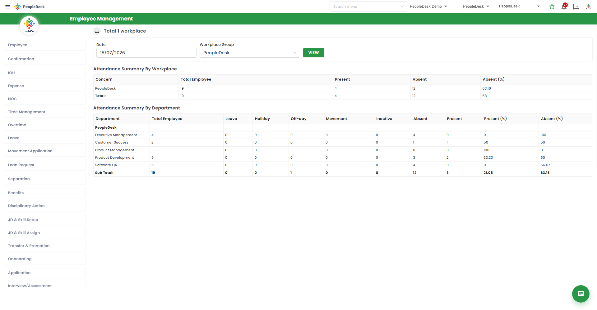

**What it does**: Gives a same-day snapshot of attendance across the whole workplace and broken down by department, showing present/absent counts and percentages.

**Key fields / columns**: 
- Date, Workplace Group
- "Attendance Summary By Workplace" table: Concern, Total Employee, Present, Absent, Absent (%)
- "Attendance Summary By Department" table: Department, Total Employee, Leave, Holiday, Off-day, Movement, Inactive, Absent, Present, Present (%), Absent (%)

**Buttons & actions**: 
- **Download icon** — exports the summary.
- **VIEW** (green button) — refreshes the summary for the chosen date and workplace group.

**How to use it**: 
1. Open **Reports > Attendance Summary Report**.
2. Confirm or change the **Date**.
3. Select the **Workplace Group**.
4. Click **VIEW** to refresh both the workplace-level and department-level summary tables.

**Pro-tip**: Use the department-level "Absent (%)" column to quickly spot which teams need attention — in the sample data, Executive Management shows 100% absent while Product Management shows 0%, a gap worth investigating.

---

#### Attendance Logs

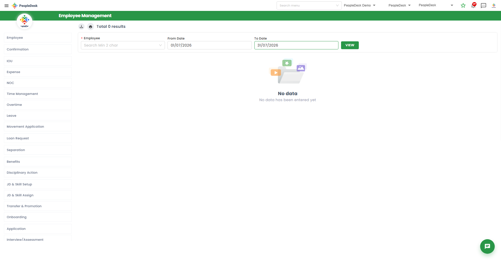

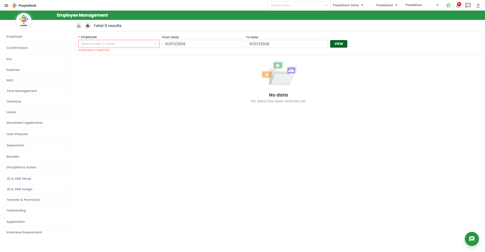

**What it does**: Retrieves the raw attendance/punch logs for a specific employee across a date range, useful for verifying exact clock-in/clock-out records.

**Key fields / columns**: 
- Employee (required, searchable — minimum 2 characters)
- From Date / To Date

**Buttons & actions**: 
- **Download icon** — exports the log results.
- **Print icon** — prints the log results.
- **VIEW** (green button) — fetches the logs for the selected employee and date range.

**How to use it**: 
1. Open **Reports > Attendance Logs**.
2. Type at least 2 characters in the **Employee** field and select the employee from the dropdown.
3. Adjust the **From Date** / **To Date** range if needed.
4. Click **VIEW** to load the attendance logs.

**Pro-tip**: The Employee field is mandatory — clicking VIEW without selecting one shows "Employee is required" in red, as captured in the second screenshot, so always pick an employee first.

---

#### Food Allowence Report

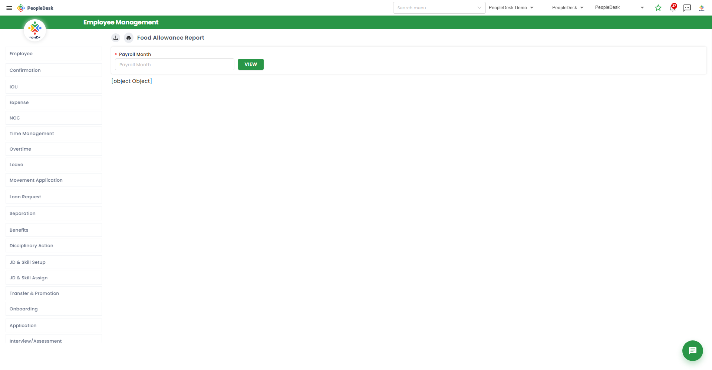

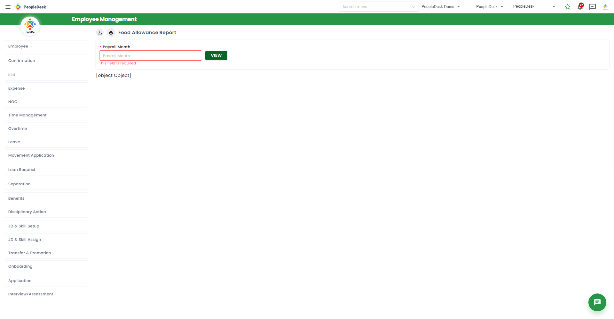

**What it does**: Reports the food allowance amounts disbursed to employees for a selected payroll month.

**Key fields / columns**: 
- Payroll Month (required)

**Buttons & actions**: 
- **Download icon** — exports the report.
- **Print icon** — prints the report.
- **VIEW** (green button) — generates the report for the chosen payroll month.

**How to use it**: 
1. Open **Reports > Food Allowance Report**.
2. Select the **Payroll Month**.
3. Click **VIEW** to generate the report.

**Pro-tip**: The Payroll Month field is mandatory — leaving it blank and clicking VIEW shows "This field is required" under the field. Note the page also displays a raw "[object Object]" placeholder below the filter row in both screenshots, which appears to be a display glitch rather than actual report content — if you see this after selecting a valid month, try reloading the page.

---

#### Movement Details History

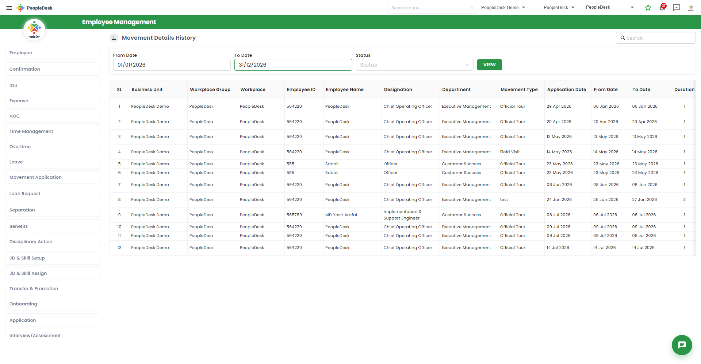

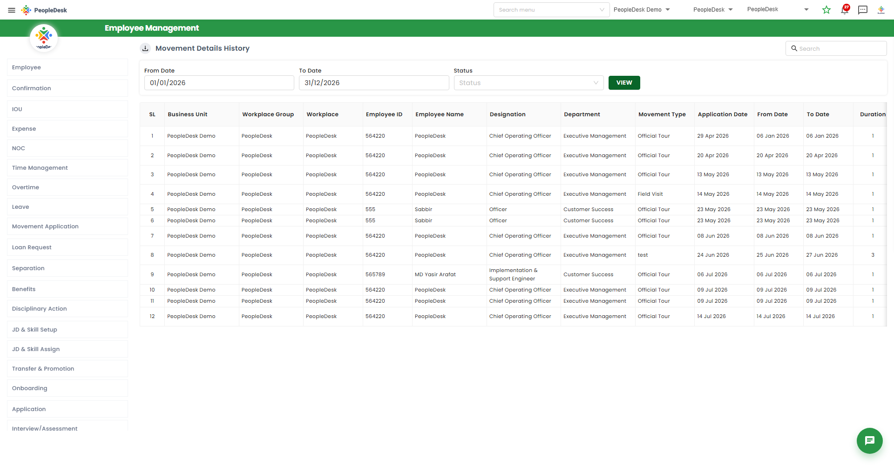

**What it does**: Lists employees' movement applications (official tours, field visits, and similar out-of-office movements) over a date range, including who applied, when, and for how long.

**Key fields / columns**: 
- From Date / To Date, Status
- SL, Business Unit, Workplace Group, Workplace, Employee ID, Employee Name, Designation, Department, Movement Type, Application Date, From Date, To Date, Duration

**Buttons & actions**: 
- **Download icon** — exports the movement history.
- **Search box** (top right) — filters the loaded rows.
- **VIEW** (green button) — refreshes results for the selected date range and status.

**How to use it**: 
1. Open **Reports > Movement Details History**.
2. Set the **From Date** and **To Date**.
3. Optionally filter by **Status**.
4. Click **VIEW** to load matching movement applications.

**Pro-tip**: The "Movement Type" column (Official Tour, Field Visit, etc.) lets you quickly separate routine business travel from ad-hoc field work when reviewing employee time away from the desk.

---

#### Market Visit Report

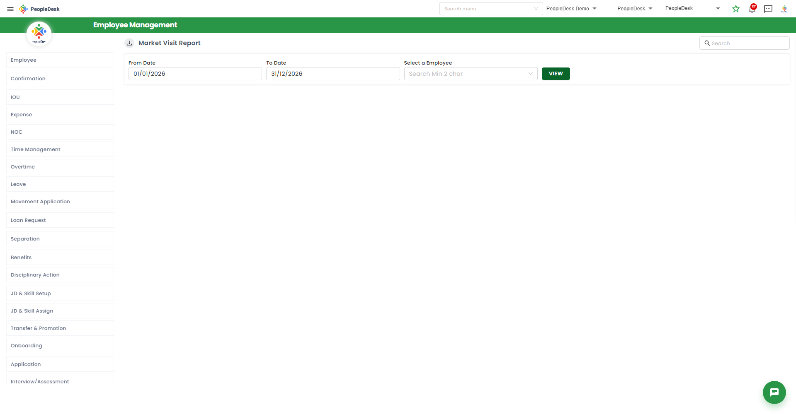

**What it does**: Reports on field/market visits logged by a specific employee (typically sales or field staff) over a date range.

**Key fields / columns**: 
- From Date / To Date
- Select a Employee (searchable, minimum 2 characters)

**Buttons & actions**: 
- **Download icon** — exports the visit report.
- **VIEW** (green button) — loads the visits for the selected employee and date range.

**How to use it**: 
1. Open **Reports > Market Visit Report**.
2. Set the **From Date** / **To Date**.
3. Type at least 2 characters and select an employee in **Select a Employee**.
4. Click **VIEW** to load their market visit records.

**Pro-tip**: Because Employee is not visibly marked required here (unlike some other reports), remember to still pick one — without it the report has no data to show.

---

#### Type Wise Leave Report

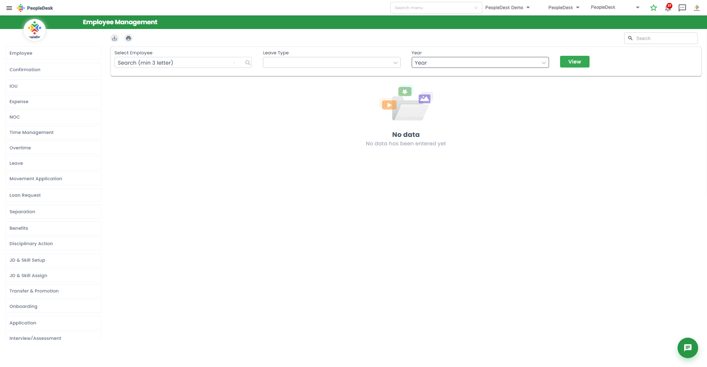

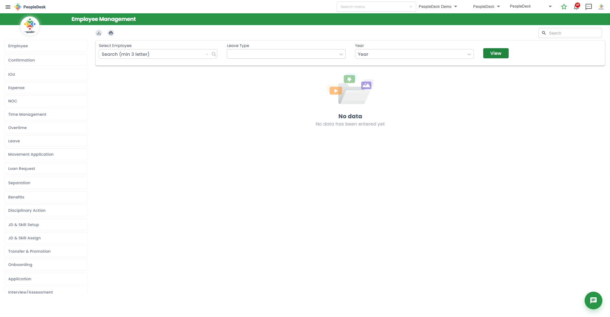

**What it does**: Reports how much leave of each type (e.g. casual, sick, earned) an employee has used within a given year.

**Key fields / columns**: 
- Select Employee (searchable, minimum 3 letters)
- Leave Type
- Year

**Buttons & actions**: 
- **Download icon** — exports the report.
- **Print icon** — prints the report.
- **View** (green button) — generates the report for the selected employee, leave type, and year.

**How to use it**: 
1. Open **Reports > Type Wise Leave Report**.
2. Search and select an employee under **Select Employee**.
3. Choose a **Leave Type** and **Year**.
4. Click **View** to see the leave breakdown.

**Pro-tip**: Leave the Leave Type dropdown empty to see all leave types used by the employee in one pass, rather than running the report once per leave type.

---

#### Custom Report Builder

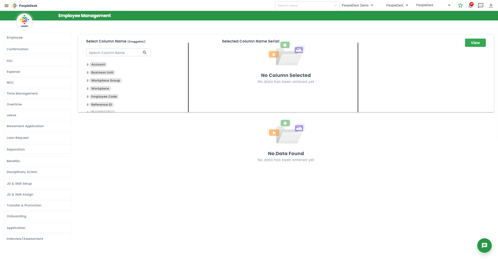

**What it does**: Lets HR build an ad-hoc report by dragging the data columns they want (from a large library of available fields) into a selected-columns list, then running that custom combination as a report.

**Key fields / columns**: 
- "Select Column Name (Draggable)" panel with a **Search Column Name** box and a scrollable list of available fields, including Account, Business Unit, Workplace Group, Workplace, Employee Code, Reference ID, Card Number, and more
- "Selected Column Name Serial" panel — shows the columns you've chosen, in order

**Buttons & actions**: 
- **Search Column Name** — filters the draggable column list to find a field quickly.
- **View** (green button, top right) — runs the report using whichever columns have been dragged into the Selected Column Name Serial panel.
- Drag-and-drop of column chips from the left panel into the right panel to build the report layout.

**How to use it**: 
1. Open **Custom Report Builder** (under the Custom Reports Builder area).
2. Use the search box to find the fields you need, or scroll the draggable list.
3. Drag each desired column from "Select Column Name" into "Selected Column Name Serial" in the order you want them to appear.
4. Click **View** to generate the report with your chosen columns.

**Pro-tip**: If you click View without dragging any columns across, the panel simply shows "No Column Selected" and "No Data Found" (as seen in the screenshots) — always drag at least one column into the right-hand panel before viewing.

---

#### Letter Configuration

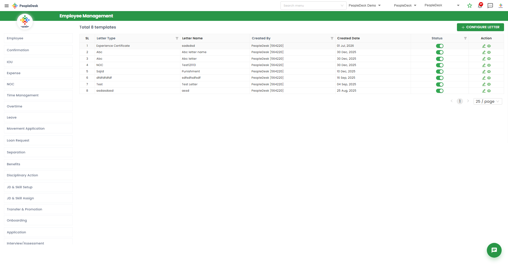

**What it does**: Manages the library of letter templates (e.g. Experience Certificate, NOC, warning/punishment letters) that can later be used to generate official letters for employees.

**Key fields / columns**: 
- SL, Letter Type, Letter Name, Created By, Created Date, Status (enabled/disabled toggle)

**Buttons & actions**: 
- **CONFIGURE LETTER** (green button, top right, "+" icon) — opens a form to create a new letter template.
- **Status toggle** (per row) — turns a template on (green) or off, controlling whether it's available for generating letters.
- **Edit icon** (pencil, per row) — opens the template for editing.
- **View icon** (eye, per row) — opens the template to preview its content.
- **Filter icons** on the Letter Type, Letter Name, and Created Date column headers — sort/filter the table by that column.
- **Pagination controls** (bottom right) — navigate pages and set rows-per-page (default 25/page).

**How to use it**: 
1. Open **Custom Reports Builder > Letter Configuration**.
2. Click **CONFIGURE LETTER** to create a new template, or use the edit/view icons on an existing row.
3. Toggle **Status** on for templates that should be usable, off to retire them.
4. Use the column filter icons to locate a specific template quickly.

**Pro-tip**: Turn a template's Status off instead of deleting it if you're unsure whether it'll be needed again — disabled templates stay in the list (and its history) but won't appear as an option when generating new letters.

---

#### Letter Generate

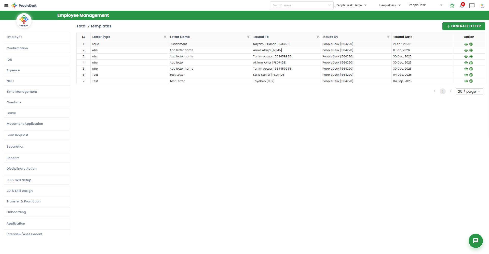

**What it does**: Issues an actual letter to an employee based on one of the configured templates, and keeps a log of every letter generated so far.

**Key fields / columns**: 
- SL, Letter Type, Letter Name, Issued To, Issued By, Issued Date

**Buttons & actions**: 
- **GENERATE LETTER** (green button, top right, "+" icon) — opens a form to issue a new letter to an employee using an existing template.
- **View icon** (eye, per row) — opens/previews the generated letter.
- **Print icon** (per row) — prints the generated letter.
- **Filter icons** on the Letter Type, Letter Name, and Issued By column headers — sort/filter the table by that column.
- **Pagination controls** (bottom right) — navigate pages and set rows-per-page (default 25/page).

**How to use it**: 
1. Open **Custom Reports Builder > Letter Generate**.
2. Click **GENERATE LETTER** to issue a new letter, choosing the template and the employee it's issued to.
3. Find a past letter using the column filters, then use the view icon to review it or the print icon to print a copy.

**Pro-tip**: Before generating a letter, make sure the right template is enabled in Letter Configuration — only active templates are available for issuing new letters here.

## 5. Administration Module

Company-wide configuration: roles and permissions, leave/movement policy, time and shift setup, organizational master data, payroll configuration, and punishment/policy rules.

#### Users Info

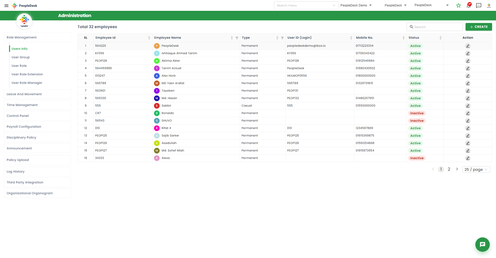

**What it does**: This is the master list of every employee who has been granted a system login to PeopleDesk. It shows each user's employment type, login ID, and whether their account is active or inactive.

**Key fields / columns**:
- SL (serial number)
- Employee Id
- Employee Name (with a colored avatar)
- Type (e.g. Permanent, Casual)
- User ID (Login)
- Mobile No.
- Status (Active / Inactive)
- Action (edit)

**Buttons & actions**:
- **Search** box (top right) — filters the list as you type, by name, ID, or other visible text.
- **+ CREATE** (green, top right) — opens the employee-selection screen to grant a new user login (see below).
- **Column sort arrows** on Employee Id and Employee Name headers, plus a filter icon on Employee Name and Type — narrow or reorder the list.
- **Edit (pencil) icon** on each row — opens that user's login/account details for editing.
- Pagination controls and a "25 / page" page-size selector at the bottom right.

Clicking **+ CREATE** does not open a blank form — it opens a list of employees from the HR master data (Name, Designation, Department, Code, Type) who do not yet have a system login. Each row has a **+** action button used to grant that specific employee a user account. A back arrow at the top returns to the Users Info list.

**How to use it**: 
1. Open Administration > Role Management > Users Info.
2. Use Search to locate an existing user, or click **+ CREATE** to grant access to a new employee.
3. On the employee-selection screen, find the employee and click the **+** button next to their name to start creating their login.
4. Complete the resulting login details and save.
5. Back on the main list, use the pencil icon any time to edit a user's login information or status.

**Pro-tip**: If an employee doesn't appear when you click Create, check that their record already exists in the HR/employee master data — Users Info only grants logins to employees who are already on file, it doesn't create new employee records.

---

#### User Group

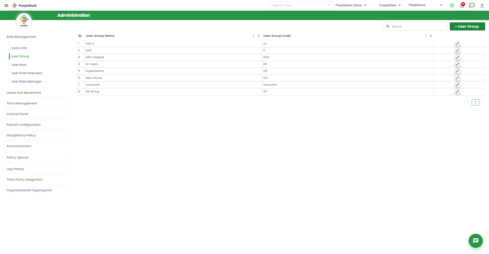

**What it does**: User Groups let you bundle multiple users together under a single named group (e.g. "HR Team", "Accounts") so that permissions or actions can be managed for the whole group at once instead of one user at a time.

**Key fields / columns**:
- SL
- User Group Name
- User Group Code
- Action (edit)

**Buttons & actions**:
- **Search** box (top right) — filters groups by name or code.
- **+ User Group** (green, top right) — opens the Create User Group modal.
- **Edit (pencil) icon** on each row — opens the group to add/remove members or rename it.
- Pagination at the bottom.

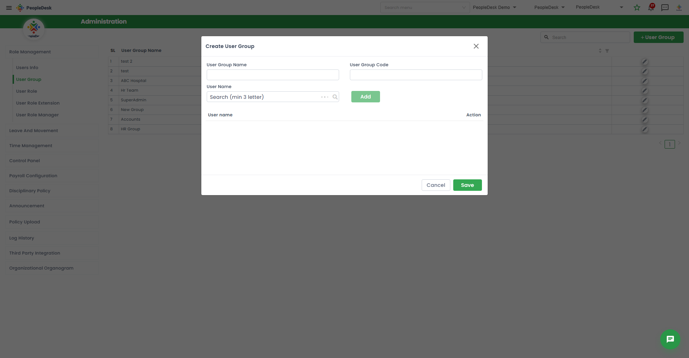

**Create form fields**:
- User Group Name
- User Group Code
- User Name — a "Search (min 3 letter)" box used to look up individual users
- **Add** button — adds the searched user into the group's member list below (User name / Action table)
- **Cancel** / **Save** buttons

**How to use it**:
1. Open Administration > Role Management > User Group.
2. Click **+ User Group**.
3. Enter a User Group Name and a User Group Code.
4. Type at least 3 letters in the User Name search box to find a user, then click **Add** to add them to the group. Repeat for each member.
5. Click **Save** to create the group, or **Cancel** to discard.

**Pro-tip**: Give the group a short, memorable User Group Code (like "HR" or "Accounts") — it's what shows up in dropdowns elsewhere in the system, so a clear code saves time later.

---

#### User Role

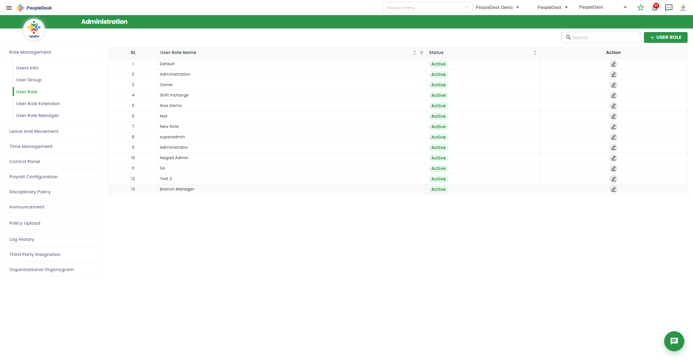

**What it does**: Defines the named roles (e.g. Administration, Owner, Shift Incharge) that determine what a user can see and do in PeopleDesk. Roles are later linked to features and users via User Role Manager.

**Key fields / columns**:
- SL
- User Role Name
- Status (Active)
- Action (edit)

**Buttons & actions**:
- **Search** box (top right) — filters roles by name.
- **+ USER ROLE** (green, top right) — opens a form to create a new role.
- **Edit (pencil) icon** on each row — opens the role for renaming or status changes.
- Sort/filter icons on the User Role Name and Status columns.

**How to use it**:
1. Open Administration > Role Management > User Role.
2. Review existing roles (Default, Administration, Owner, Branch Manager, etc.).
3. Click **+ USER ROLE** to add a new role, name it, and save.
4. Use the pencil icon to edit an existing role's name or status.
5. Once a role exists here, go to User Role Manager to attach specific features/permissions to it.

**Pro-tip**: Create roles that map to job functions (e.g. "Branch Manager") rather than to individual people — this makes it much easier to onboard new hires by just assigning them an existing role.

---

#### User Role Extension

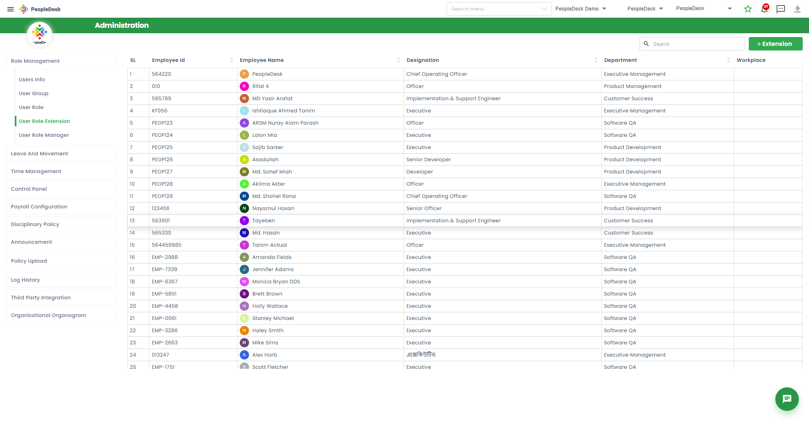

**What it does**: Shows which employees have an extended role assignment tied to a specific organization/workplace — useful when someone needs elevated or cross-branch access beyond their default role.

**Key fields / columns**:
- SL
- Employee Id
- Employee Name
- Designation
- Department
- Workplace

**Buttons & actions**:
- **Search** box (top right) — filters the list.
- **+ Extension** (green, top right) — opens the Create Role Extension screen.
- Sort arrows on the Employee Id, Employee Name, Designation, and Department columns.

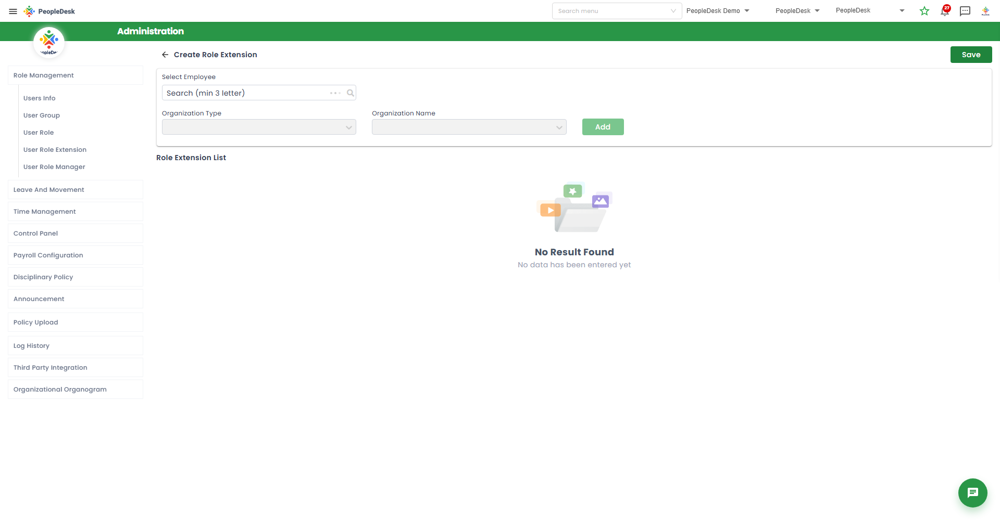

**Create form fields**:
- Select Employee — "Search (min 3 letter)" lookup
- Organization Type — dropdown
- Organization Name — dropdown
- **Add** button — adds the entry to the Role Extension List below (which shows "No Result Found" until at least one extension is added)
- **Save** button (top right)

**How to use it**:
1. Open Administration > Role Management > User Role Extension.
2. Click **+ Extension**.
3. Search for and select the employee.
4. Choose the Organization Type and Organization Name they need extended access to.
5. Click **Add**, then **Save** to confirm.

**Pro-tip**: Use this only for genuine exceptions (e.g. a regional manager covering two branches) — for anything role-wide, it's simpler to adjust the User Role itself via User Role Manager.

---

#### User Role Manager

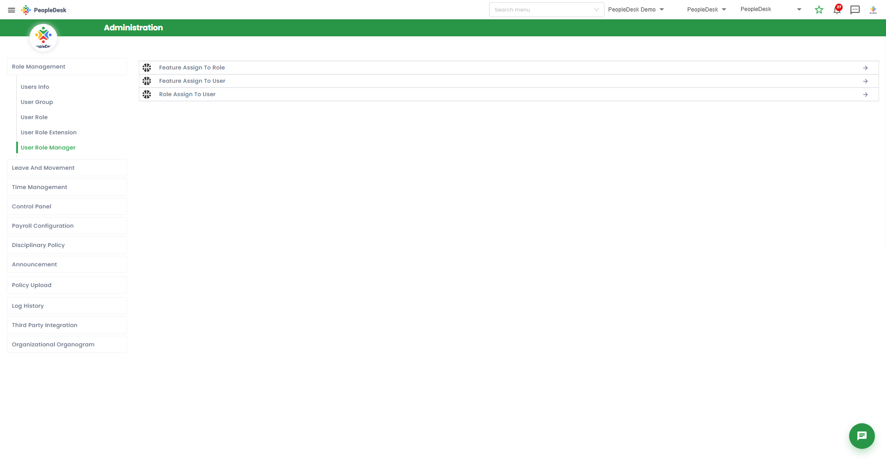

**What it does**: A hub page that links to the three tools used to actually wire up permissions: assigning features to roles, assigning features directly to individual users, and assigning roles to users.

**Key fields / columns**: This page has no table — it lists three navigable options, each with an icon and a forward arrow:
- Feature Assign To Role
- Feature Assign To User
- Role Assign To User

**Buttons & actions**:
- **Feature Assign To Role** row — click (or the arrow icon) to open the screen where menu/feature permissions are granted to a whole User Role.
- **Feature Assign To User** row — opens the screen to grant or restrict specific features for one individual user, overriding their role defaults.
- **Role Assign To User** row — opens the screen to assign one of the User Roles (created earlier) to a specific user.

**How to use it**:
1. Open Administration > Role Management > User Role Manager.
2. To control what an entire role can access, click **Feature Assign To Role**.
3. To give or remove access for just one person, click **Feature Assign To User**.
4. To put a user into a role, click **Role Assign To User**.

**Pro-tip**: Set up permissions at the role level first (Feature Assign To Role) and only use Feature Assign To User for one-off exceptions — this keeps your access model easy to audit later.

---

#### Leave Type

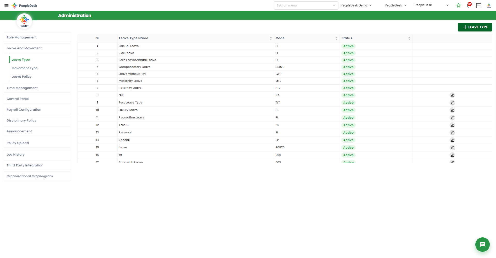

**What it does**: Maintains the master list of leave categories (Casual Leave, Sick Leave, Maternity Leave, etc.) that are available across the system before any leave policy or quota is configured.

**Key fields / columns**:
- SL
- Leave Type Name
- Code
- Status (Active)

**Buttons & actions**:
- **+ LEAVE TYPE** (green, top right) — opens the Create Leave Type modal.
- **Edit (pencil) icon** on each row (visible from row 8 onward) — edits that leave type.
- Sort arrows on Leave Type Name, Code, and Status columns.

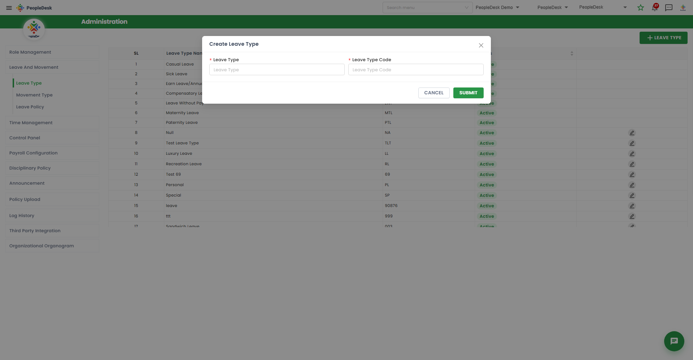

**Create form fields**:
- Leave Type (required)
- Leave Type Code (required)
- **CANCEL** / **SUBMIT** buttons

**How to use it**:
1. Open Administration > Leave And Movement > Leave Type.
2. Click **+ LEAVE TYPE**.
3. Enter the Leave Type name (e.g. "Bereavement Leave") and a short Leave Type Code (e.g. "BL").
4. Click **SUBMIT** to save.
5. This leave type will now be selectable when building a Leave Policy.

**Pro-tip**: Keep leave type codes short and unique (2-4 letters) — they appear as compact labels in leave request forms, calendars, and reports throughout PeopleDesk.

---

#### Movement Type

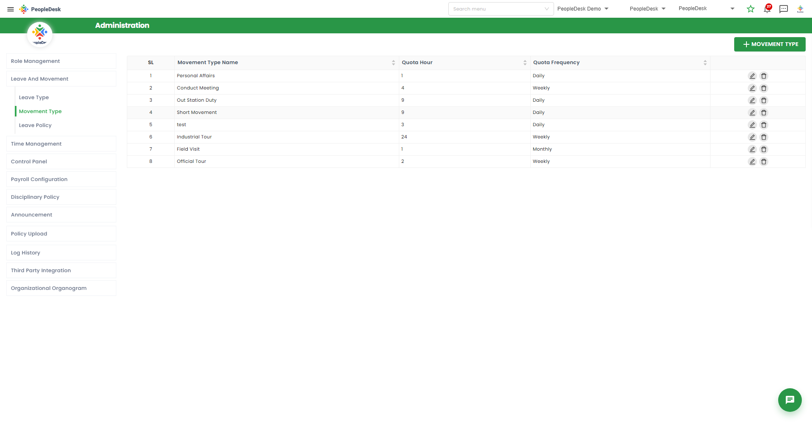

**What it does**: Defines the categories of "movement" (time an employee spends away from their desk during work hours, such as Personal Affairs, Field Visit, or Official Tour) along with the quota of time allowed for each.

**Key fields / columns**:
- SL
- Movement Type Name
- Quota Hour
- Quota Frequency (Daily, Weekly, Monthly)

**Buttons & actions**:
- **+ MOVEMENT TYPE** (green, top right) — opens the Create Movement Type modal.
- **Edit (pencil) icon** on each row — modifies the movement type.
- **Delete (trash) icon** on each row — removes the movement type.

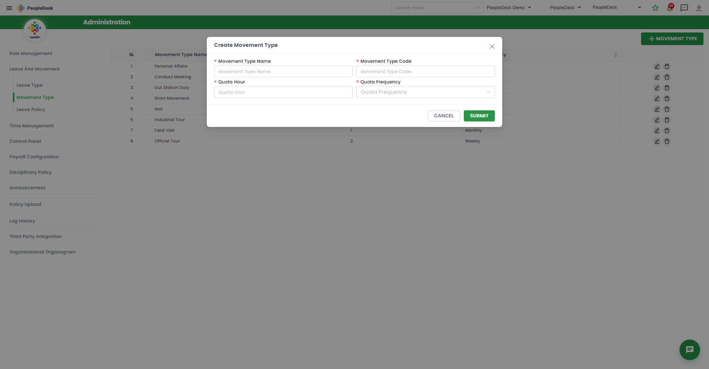

**Create form fields**:
- Movement Type Name (required)
- Movement Type Code (required)
- Quota Hour (required)
- Quota Frequency (required, dropdown)
- **CANCEL** / **SUBMIT** buttons

**How to use it**:
1. Open Administration > Leave And Movement > Movement Type.
2. Click **+ MOVEMENT TYPE**.
3. Fill in the movement type name, a code, the allowed Quota Hour, and how often that quota resets (Quota Frequency).
4. Click **SUBMIT**.
5. Use the trash icon to delete movement types that are no longer used, or the pencil to adjust quotas.

**Pro-tip**: Set the Quota Frequency to match how the business actually monitors movement time (e.g. Daily for short errands, Weekly for field visits) so employees don't get blocked mid-week by an overly tight quota.

---

#### Leave Policy

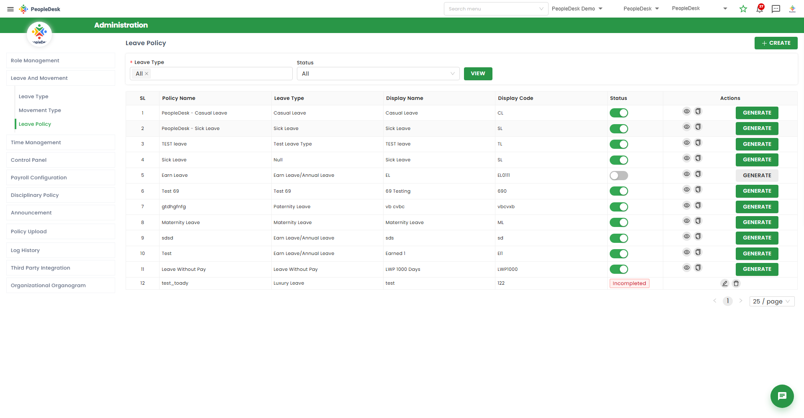

**What it does**: This is where full leave policies are built — combining a leave type with eligibility rules (workplace, designation, employment type, gender, religion), pay treatment, carry-forward, encashment, and lapse rules — and then generated for use.

**Key fields / columns**:
- SL
- Policy Name
- Leave Type
- Display Name
- Display Code
- Status (toggle, Active/Inactive)
- Actions (view/eye icon, copy icon, and either a **GENERATE** button or, for incomplete policies, edit and delete icons)

**Buttons & actions**:
- **Leave Type** filter (required, marked with a red asterisk) — restrict the list to one or more leave types; defaults to "All".
- **Status** filter — restrict to Active/Inactive/All.
- **VIEW** button — applies the Leave Type/Status filters to refresh the table.
- **+ CREATE** (green, top right) — starts the multi-step Leave Policy wizard.
- **Status toggle** per row — turns a policy on/off without deleting it.
- **Eye (view) icon** — opens a read-only view of the policy.
- **Copy icon** — duplicates the policy as a starting point for a new one.
- **GENERATE** button — finalizes/activates the policy for use (greyed out for the Earn Leave row where the toggle is off).
- For rows marked **Incompleted** (e.g. "test_toady"), the Actions column instead shows edit and delete icons so the unfinished policy can be completed or removed.

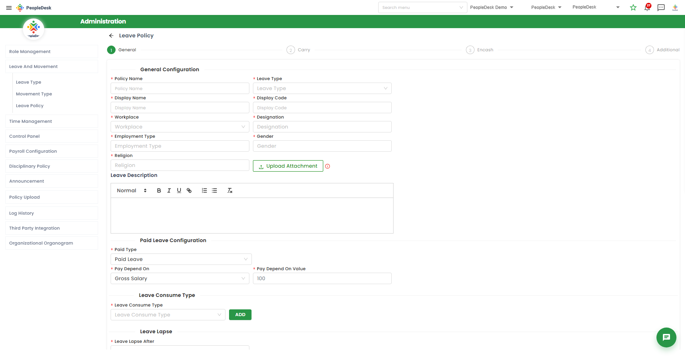

The Create screen is a 4-step wizard: **1 General**, **2 Carry**, **3 Encash**, **4 Additional**. The General step shown includes:
- General Configuration: Policy Name, Leave Type, Display Name, Display Code, Workplace, Designation, Employment Type, Gender, Religion, an **Upload Attachment** button, and a rich-text **Leave Description** editor.
- Paid Leave Configuration: Paid Type (e.g. "Paid Leave"), Pay Depend On (e.g. "Gross Salary"), Pay Depend On Value (e.g. 100).
- Leave Consume Type — a dropdown plus an **ADD** button to attach one or more consume types.
- Leave Lapse — a "Leave Lapse After" setting (further fields are below the visible area).

**How to use it**:
1. Open Administration > Leave And Movement > Leave Policy.
2. Select a Leave Type filter and click **VIEW** to see existing policies for that type (or leave it as "All").
3. Click **+ CREATE** to start a new policy.
4. On the General step, fill in the policy name, link it to a Leave Type, set eligibility (workplace, designation, employment type, gender, religion), and configure pay and lapse rules.
5. Continue through the Carry, Encash, and Additional steps.
6. Save, then click **GENERATE** on the list to activate the policy.

**Pro-tip**: Use the copy icon to clone a working policy (like "PeopleDesk - Casual Leave") when creating a similar policy for a different workplace or designation — it's much faster than filling the wizard from scratch, and reduces the chance of missing a required field.

---

#### Holiday Setup

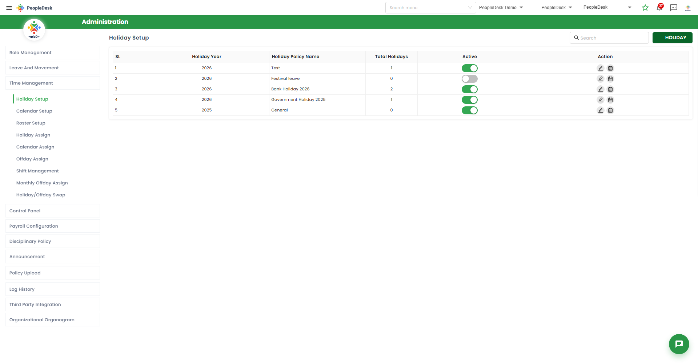

**What it does**: Maintains named holiday policies (holiday lists) per year, such as "Bank Holiday 2026" or "Government Holiday 2025", which are later assigned to employees via Holiday Assign.

**Key fields / columns**:
- SL
- Holiday Year
- Holiday Policy Name
- Total Holidays (count of holidays defined under that policy)
- Active (toggle)
- Action (edit pencil icon, calendar icon)

**Buttons & actions**:
- **Search** box (top right) — filters by policy name or year.
- **+ HOLIDAY** (green, top right) — creates a new holiday policy.
- **Active toggle** per row — enables/disables the holiday policy.
- **Edit (pencil) icon** — edit the policy's name/year.
- **Calendar icon** — opens the list of individual holiday dates within that policy to add or review specific dates.

**How to use it**:
1. Open Administration > Time Management > Holiday Setup.
2. Click **+ HOLIDAY** to create a new yearly holiday policy, naming it and setting its year.
3. Click the calendar icon on a policy to add the actual holiday dates.
4. Use the Active toggle to control whether a policy is currently in effect.
5. Once set up, go to Holiday Assign to apply the policy to employees.

**Pro-tip**: Keep a separate holiday policy per office/region (e.g. "General" vs. "Bank Holiday 2026") if different employee groups observe different holidays — this avoids one-size-fits-all lists that don't fit everyone.

---

#### Calendar Setup

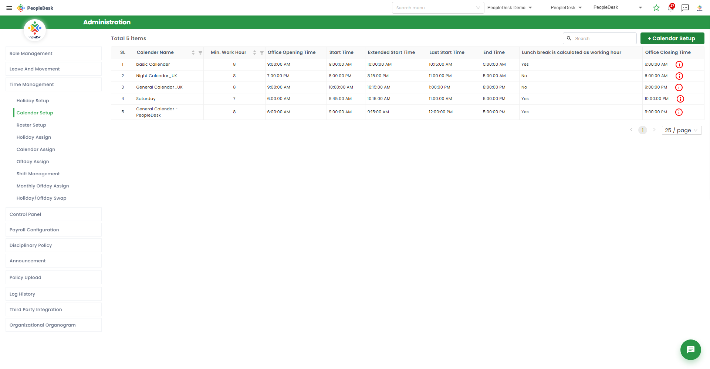

**What it does**: Defines named work calendars — the office timing rules (opening/closing time, shift start/end, grace periods, lunch handling) that get applied to employees to govern attendance and lateness calculations.

**Key fields / columns**:
- SL
- Calender Name
- Min. Work Hour
- Office Opening Time
- Start Time
- Extended Start Time
- Last Start Time
- End Time
- Lunch break is calculated as working hour (Yes/No)
- Office Closing Time
- Info (i) icon per row

**Buttons & actions**:
- **Search** box (top right) — filters calendars by name.
- **+ Calendar Setup** (green, top right) — opens the Create Calendar Setup modal.
- **Info (i) icon** on each row — shows more detail about that calendar's rules.
- Sort/filter icons on Calender Name and Min. Work Hour columns.
- Pagination and "25 / page" size selector.

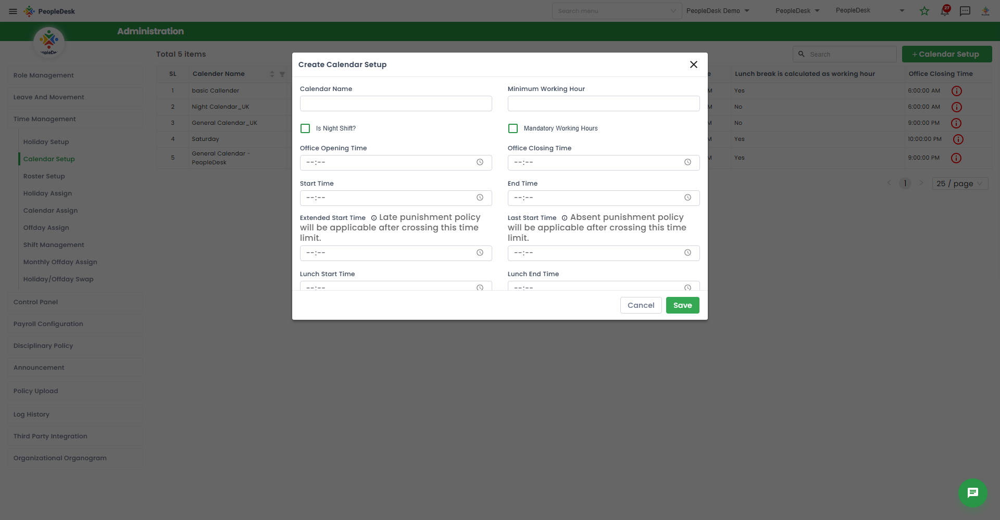

**Create form fields**:
- Calendar Name
- Minimum Working Hour
- **Is Night Shift?** checkbox
- **Mandatory Working Hours** checkbox
- Office Opening Time / Office Closing Time
- Start Time / End Time
- Extended Start Time (tooltip: "Late punishment policy will be applicable after crossing this time limit")
- Last Start Time (tooltip: "Absent punishment policy will be applicable after crossing this time limit")
- Lunch Start Time / Lunch End Time
- **Cancel** / **Save** buttons

**How to use it**:
1. Open Administration > Time Management > Calendar Setup.
2. Click **+ Calendar Setup**.
3. Name the calendar and set the Minimum Working Hour.
4. Tick **Is Night Shift?** if this calendar covers overnight work, and **Mandatory Working Hours** if strict hour compliance is required.
5. Fill in Office Opening/Closing Time, Start/End Time, Extended Start Time, Last Start Time, and lunch times.
6. Click **Save**.

**Pro-tip**: Set Extended Start Time and Last Start Time carefully — they directly control when the system marks an employee as "late" versus "absent," so double-check these against your actual attendance policy before saving.

---

#### Roster Setup

**What it does**: Creates rotating roster cycles that automatically switch employees between different calendars (e.g. alternating day/night shifts) after a defined number of days, rather than requiring manual reassignment.

**Key fields / columns**:
- SL
- Roster Name
- Work. Group/Location
- Workplace/Concern
- Created By

**Buttons & actions**:
- **Search** box (top right) — filters rosters by name.
- **+ Roster Setup** (green, top right) — opens the Create Roster screen.
- Sort/filter icons on Roster Name, Workplace/Concern, and Created By columns.

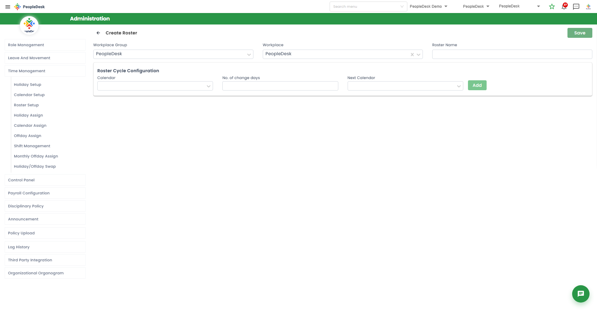

**Create form fields**:
- Workplace Group
- Workplace
- Roster Name
- Roster Cycle Configuration: Calendar (dropdown), No. of change days, Next Calendar (dropdown), and an **Add** button to append each cycle step
- **Save** button (top right)

**How to use it**:
1. Open Administration > Time Management > Roster Setup.
2. Click **+ Roster Setup**.
3. Select the Workplace Group and Workplace, and name the roster.
4. Under Roster Cycle Configuration, pick a starting Calendar, set the No. of change days, choose the Next Calendar, and click **Add** to build out the rotation sequence.
5. Click **Save**.
6. Apply the finished roster to employees from Roster Setup or via Calendar Assign.

**Pro-tip**: Add every leg of the rotation (e.g. Day Calendar -> Night Calendar -> back to Day) before saving — the "No. of change days" on each step is what drives the automatic switch-over, so an incomplete cycle will leave employees stuck on one calendar.

---

#### Holiday Assign

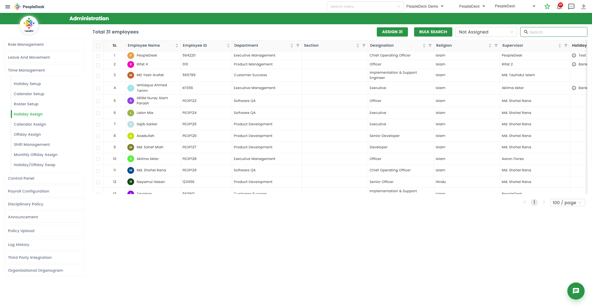

**What it does**: Assigns a Holiday Setup policy to individual employees so their attendance and payroll calculations correctly recognize the holidays that apply to them.

**Key fields / columns**:
- SL (with checkbox for multi-select)
- Employee Name
- Employee ID
- Department
- Section
- Designation
- Religion
- Supervisor
- Holiday (partially visible column showing the currently assigned holiday policy, with an info icon)

**Buttons & actions**:
- **ASSIGN 31** (green) — assigns the selected employees (here, all 31 shown as "Not Assigned") to a chosen holiday policy.
- **BULK SEARCH** (green) — searches/filters across employees in bulk, e.g. by department or designation, rather than one at a time.
- **"Not Assigned"** dropdown filter — switches the view between employees who are Not Assigned vs. already assigned a holiday policy.
- **Search** box — free-text search across the list.
- Checkboxes per row and a select-all checkbox in the header — used together with **ASSIGN 31** to bulk-assign.
- Sort/filter icons on Employee Name and Department columns.

**How to use it**:
1. Open Administration > Time Management > Holiday Assign.
2. Use the "Not Assigned" filter to see who still needs a holiday policy.
3. Tick the checkboxes for the employees to update (or select all).
4. Click **ASSIGN 31** (the number reflects how many are selected) and choose the Holiday Setup policy to apply.
5. Use **BULK SEARCH** to narrow the list first if you're working with a large employee base.

**Pro-tip**: Switch the "Not Assigned" filter to see already-assigned employees before running a bulk assign — this prevents accidentally overwriting holiday policies that were already correctly set for some employees.

---

#### Calendar Assign

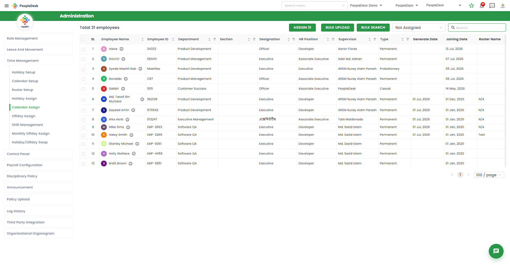

**What it does**: Assigns a work Calendar Setup (office timing rules) to individual employees, including tracking when the assignment takes effect and which roster (if any) drives it.

**Key fields / columns**:
- SL (with checkbox)
- Employee Name
- Employee ID
- Department
- Section
- Designation
- HR Position
- Supervisor
- Type (Permanent, Probationary, Casual)
- Generate Date
- Joining Date
- Roster Name (shows "N/A" or a specific roster like "Test")

**Buttons & actions**:
- **ASSIGN 31** — bulk-assigns a calendar to the selected/checked employees.
- **BULK UPLOAD** — uploads calendar assignments in bulk via a file rather than assigning one by one.
- **BULK SEARCH** — filters employees in bulk ahead of assignment.
- **"Not Assigned"** dropdown filter — toggles between assigned and not-assigned employees.
- **Search** box — free-text filter.
- **Export/download icon** (top left of the table) — exports the current list.
- Sort/filter icons on Employee Name, Department, Section, Designation, and Supervisor columns.

**How to use it**:
1. Open Administration > Time Management > Calendar Assign.
2. Filter to "Not Assigned" to find employees who still need a calendar.
3. Select employees via checkboxes and click **ASSIGN 31**, or use **BULK UPLOAD** for a spreadsheet-driven assignment.
4. Use **BULK SEARCH** to pre-filter a large list before assigning.
5. Use the export icon to download the current assignment status for review.

**Pro-tip**: If an employee is on a rotating shift, assign them a Roster (from Roster Setup) instead of a single Calendar here — the Roster Name column will show the roster driving their schedule instead of "N/A".

---

#### Offday Assign

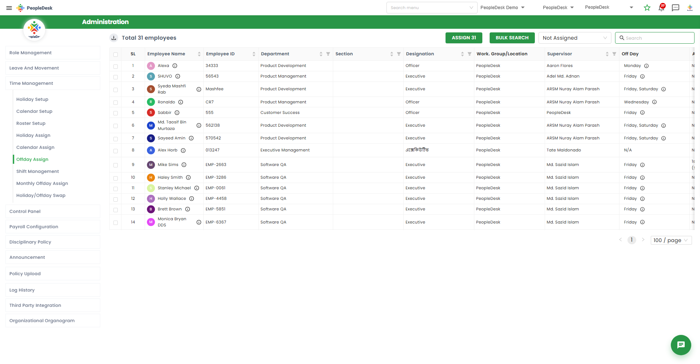

**What it does**: Assigns each employee's weekly off day(s) — the day(s) of the week they are not expected to work — such as Friday, or Friday and Saturday.

**Key fields / columns**:
- SL (with checkbox)
- Employee Name
- Employee ID
- Department
- Section
- Designation
- Work. Group/Location
- Supervisor
- Off Day (e.g. Monday, Friday, Friday & Saturday, N/A) with an info icon
- An additional column visible at the far right edge

**Buttons & actions**:
- **ASSIGN 31** — bulk-assigns an off day pattern to the checked employees.
- **BULK SEARCH** — filters employees in bulk before assignment.
- **"Not Assigned"** dropdown filter — toggles the view.
- **Search** box — free-text filter.
- **Export/download icon** (top left) — downloads the list.
- Sort/filter icons on Employee Name and Department columns.

**How to use it**:
1. Open Administration > Time Management > Offday Assign.
2. Filter by "Not Assigned" to see who needs an off day set.
3. Select the relevant employees using the checkboxes.
4. Click **ASSIGN 31** and choose the off day(s) to apply.
5. Use **BULK SEARCH** or the Search box to locate specific employees or departments first.

**Pro-tip**: Employees with multiple off days (e.g. "Friday, Saturday") show both days together in the Off Day column with an info icon — click it to confirm exactly which days are set before assuming a single-day default.

---

#### Shift Management

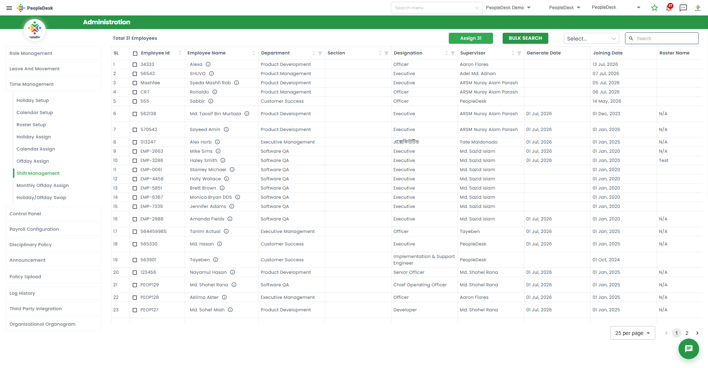

**What it does**: Central listing of employees together with their generated schedule details — showing which roster or calendar the shift generation is based on, plus generate and joining dates — used to manage and review shift assignments in bulk.

**Key fields / columns**:
- SL (with checkbox)
- Employee Id
- Employee Name
- Department
- Section
- Designation
- Supervisor
- Generate Date
- Joining Date
- Roster Name (or "N/A")

**Buttons & actions**:
- **Assign 31** (green) — bulk-assigns/generates shifts for the selected employees.
- **BULK SEARCH** — filters employees in bulk.
- **"Select..."** dropdown filter — narrows the list by a chosen criterion.
- **Search** box — free-text filter.
- Sort/filter icons on Employee Id, Department, and Supervisor columns.
- Pagination with "25 per page" selector at the bottom.

**How to use it**:
1. Open Administration > Time Management > Shift Management.
2. Use **Select...** or the Search box to find the employees you need.
3. Check the boxes for the employees whose shift needs generating/updating.
4. Click **Assign 31** to apply the shift generation.
5. Use **BULK SEARCH** for larger, criteria-based selections.

**Pro-tip**: Check the Generate Date and Joining Date columns before reassigning shifts — employees with a blank Generate Date haven't had their schedule generated yet and should be prioritized.

---

#### Monthly Offday Assign

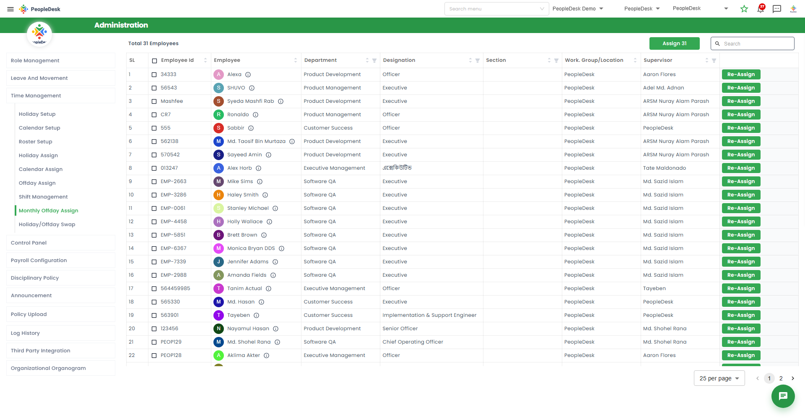

**What it does**: Lets you re-assign or review each employee's off days on a month-by-month basis, rather than the standing weekly pattern set in Offday Assign — useful for months where off days need to shift temporarily.

**Key fields / columns**:
- SL (with checkbox)
- Employee Id
- Employee
- Department
- Designation
- Section
- Work.Group/Location
- Supervisor

**Buttons & actions**:
- **Assign 31** (green, top right) — bulk-assigns monthly off days to the selected employees.
- **Search** box — free-text filter.
- **Re-Assign** button on every row — opens that individual employee's monthly off-day assignment to change it directly.
- Sort/filter icons on Employee Id, Department, and Section columns.
- Pagination with "25 per page" selector.

**How to use it**:
1. Open Administration > Time Management > Monthly Offday Assign.
2. To update one person, click **Re-Assign** on their row and set the new monthly off days.
3. To update several employees at once, tick their checkboxes and click **Assign 31**.
4. Use Search to quickly locate a specific employee first.

**Pro-tip**: Use this page for temporary, month-specific off-day changes (e.g. a holiday-swap month) and keep the standing weekly pattern in Offday Assign — that way you don't lose track of each employee's normal default.

---

#### Holiday/Offday Swap

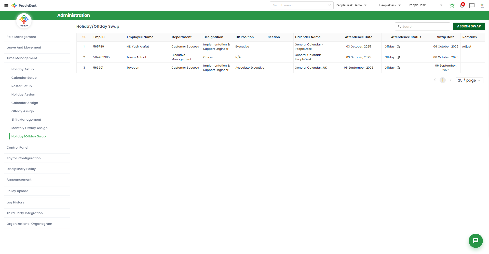

**What it does**: Records requests where an employee's holiday or off day is swapped with a different working day — i.e. they work on what would normally be a holiday/off day, in exchange for taking a different day off (the Swap Date).

**Key fields / columns**:
- SL
- Emp ID
- Employee Name
- Department
- Designation
- HR Position
- Section
- Calender Name
- Attendence Date (the original holiday/off day being worked)
- Attendence Status (e.g. Offday, with an info icon)
- Swap Date (the replacement day off)
- Remarks (free-text note, e.g. "Adjust")

**Buttons & actions**:
- **Search** box (top right) — filters the swap records.
- **ASSIGN SWAP** (green, top right) — opens the form to create a new holiday/offday swap for an employee.
- **Info (i) icon** next to Attendence Status — shows more detail on that attendance record.
- Pagination and "25 / page" selector at the bottom.

**How to use it**:
1. Open Administration > Time Management > Holiday/Offday Swap.
2. Review existing swaps in the list, including the original Attendence Date and the new Swap Date.
3. Click **ASSIGN SWAP** to record a new swap: select the employee, the holiday/off day they'll work, and the replacement day off.
4. Add a Remarks note if needed (e.g. reason for the adjustment) and save.

**Pro-tip**: Always double check the Attendence Status info icon before approving a swap — it confirms the day being swapped really is a recognized holiday or off day for that employee's assigned calendar, avoiding mismatched swap requests.

#### Account

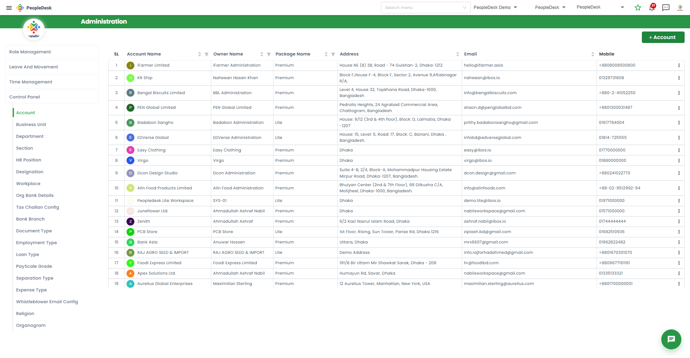

**What it does**: Lists every client account (tenant/organization) provisioned on this PeopleDesk instance, showing subscription package and contact details for each.

**Key fields / columns**: SL, Account Name, Owner Name, Package Name, Address, Email, Mobile.

**Buttons & actions**:
- **+ Account** (top right) — starts the process of provisioning a new account/tenant.
- Sort/filter icons on the **Account Name**, **Owner Name**, and **Email** column headers — sort or filter the list by that column.
- Three-dot menu at the end of each row — row-level actions (e.g. edit/manage) for that account.

**How to use it**: 1. Open Control Panel > Account. 2. Scan the table to find the account you need, or use a column filter to narrow the list. 3. Click **+ Account** to add a new tenant, or use the row's three-dot menu to manage an existing one.

**Pro-tip**: The "Package Name" column (Lite/Premium) tells you at a glance which accounts are on trial-level plans versus premium — useful when triaging support requests tied to plan limits.

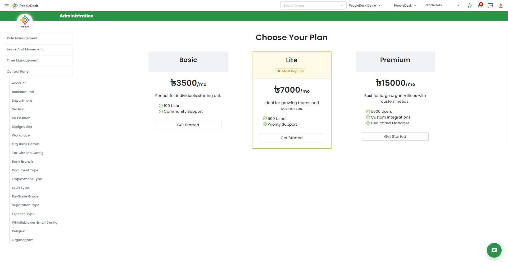

**What it does**: Clicking **+ Account** does not open a data-entry form — it opens a "Choose Your Plan" pricing page where you pick a subscription tier before creating the account.

**Key fields / columns**: Not applicable — this is a plan comparison screen, not a field form. It presents three plan cards: **Basic** (৳3500/mo, 100 Users, Community Support), **Lite** (৳7000/mo, "Most Popular", 500 Users, Priority Support), and **Premium** (৳15000/mo, 5000 Users, Custom Integrations, Dedicated Manager).

**Buttons & actions**:
- **Get Started** button on each of the three plan cards — begins account creation/checkout under that specific plan.

**How to use it**: 1. Click **+ Account** on the Account list page. 2. Compare the Basic, Lite, and Premium cards by user limit and support level. 3. Click **Get Started** on the plan that matches the new client's needs to continue setting up the account.

**Pro-tip**: Confirm the expected employee headcount before choosing a plan — picking Basic for a client that will exceed 100 users means an upgrade (and possible data migration) later.

---

#### Business Unit

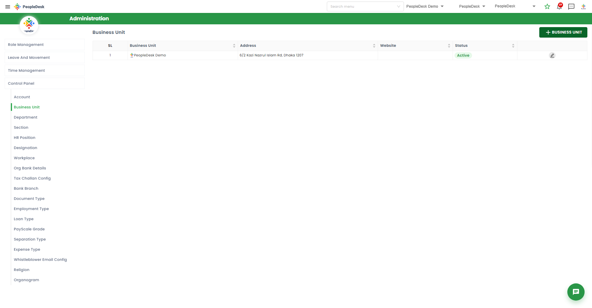

**What it does**: A Business Unit is the top level of the organization structure (the legal entity or company). This page lists the business unit(s) configured for the account.

**Key fields / columns**: SL, Business Unit, Address, Website, Status.

**Buttons & actions**:
- **+ BUSINESS UNIT** (top right) — opens the Create Business Unit form.
- Sort arrows on each column header — reorder the list.
- Edit (pencil) icon per row — opens the record for editing.

**How to use it**: 1. Go to Control Panel > Business Unit. 2. Review existing entries (name, address, status). 3. Click **+ BUSINESS UNIT** to add a new one, or the pencil icon to edit an existing entry.

**Pro-tip**: Since Department, Workplace, and other configuration pages all reference a Business Unit, set this up first before configuring anything else.

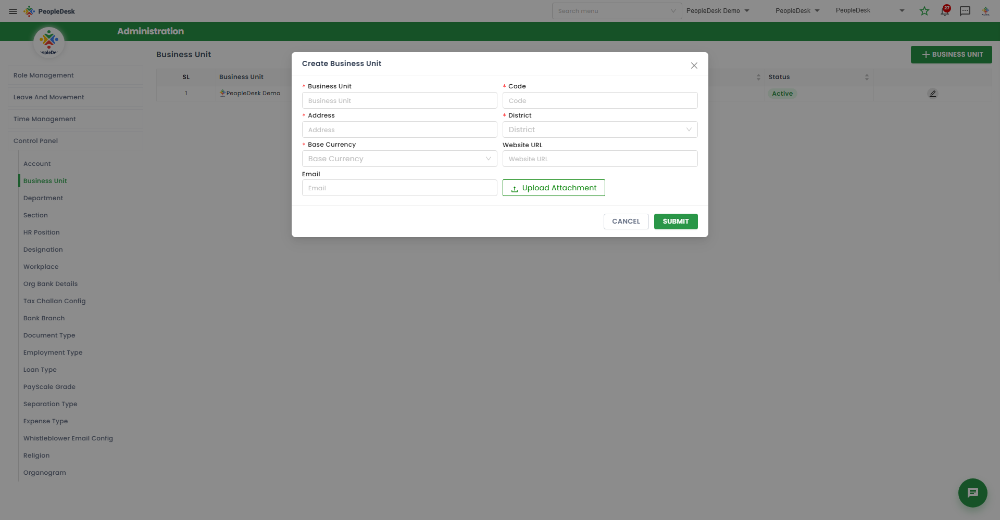

**What it does**: Form for registering a new business unit (company/legal entity) under the account.

**Key fields / columns**:
- Business Unit (name, required)
- Code (required)
- Address (required)
- District (required, dropdown)
- Base Currency (required, dropdown)
- Website URL
- Email
- Upload Attachment (e.g. trade license or registration document)

**Buttons & actions**:
- **Upload Attachment** — attaches a supporting document to the record.
- **CANCEL** — closes the form without saving.
- **SUBMIT** — saves the new business unit.

**How to use it**: 1. Click **+ BUSINESS UNIT**. 2. Fill in Business Unit name, Code, Address, and select District and Base Currency. 3. Optionally add a Website URL, Email, and attachment. 4. Click **SUBMIT**.

**Pro-tip**: Base Currency cannot typically be changed once payroll data exists against the business unit, so set it correctly the first time.

---

#### Department

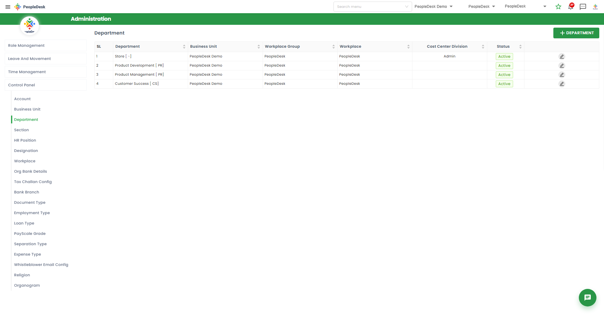

**What it does**: Lists all departments defined under the organization, linking each to its Business Unit, Workplace Group, and Workplace.

**Key fields / columns**: SL, Department, Business Unit, Workplace Group, Workplace, Cost Center Division, Status.

**Buttons & actions**:
- **+ DEPARTMENT** (top right) — opens the Create Department form.
- Edit (pencil) icon per row — edits that department.

**How to use it**: 1. Go to Control Panel > Department. 2. Review the list of departments and the Business Unit/Workplace each belongs to. 3. Click **+ DEPARTMENT** to create a new one, or the pencil icon to modify an existing entry.

**Pro-tip**: The bracketed code shown next to each department name (e.g. "Product Development [ PR ]") is the department's short code used elsewhere in reports and IDs — keep these unique and meaningful.

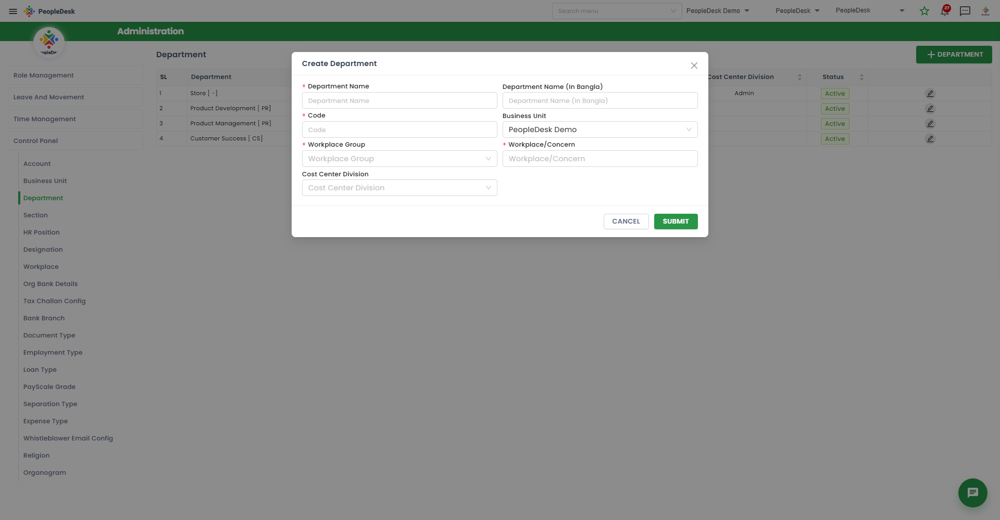

**What it does**: Form to register a new department.

**Key fields / columns**:
- Department Name (required)
- Department Name (In Bangla)
- Code (required)
- Business Unit (dropdown, defaults to the current business unit)
- Workplace Group (required, dropdown)
- Workplace/Concern (required)
- Cost Center Division (dropdown)

**Buttons & actions**:
- **CANCEL** — discards the form.
- **SUBMIT** — creates the department.

**How to use it**: 1. Click **+ DEPARTMENT**. 2. Enter the Department Name (and Bangla name if needed) and a unique Code. 3. Confirm Business Unit, and select Workplace Group and Workplace/Concern. 4. Optionally assign a Cost Center Division. 5. Click **SUBMIT**.

**Pro-tip**: Set up Workplace Group and Workplace records before creating departments — both are required fields here.

---

#### Section

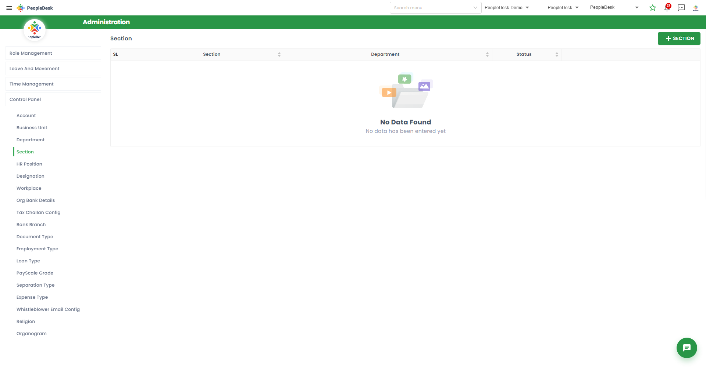

**What it does**: Sections are a sub-division of a Department (e.g. a team within a department). The screenshot shows an empty list — no sections have been created yet for this account.

**Key fields / columns**: SL, Section, Department, Status.

**Buttons & actions**:
- **+ SECTION** (top right) — opens the Create Section form.
- Sort arrows on the Section and Status column headers.

**How to use it**: 1. Go to Control Panel > Section. 2. If the list is empty ("No Data Found"), click **+ SECTION** to create the first one. 3. Fill in the required details and submit.

**Pro-tip**: Sections are optional — only create them if you need a finer breakdown than Department for reporting or approvals.

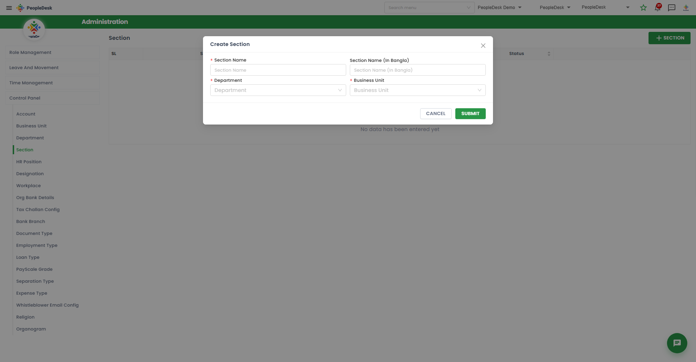

**What it does**: Form to create a new section under a department.

**Key fields / columns**:
- Section Name (required)
- Section Name (In Bangla)
- Department (required, dropdown)
- Business Unit (required, dropdown)

**Buttons & actions**:
- **CANCEL** — closes without saving.
- **SUBMIT** — creates the section.

**How to use it**: 1. Click **+ SECTION**. 2. Enter the Section Name. 3. Select the parent Department and Business Unit. 4. Click **SUBMIT**.

**Pro-tip**: Make sure the correct Department is selected before submitting — a section can only belong to one department.

---

#### HR Position

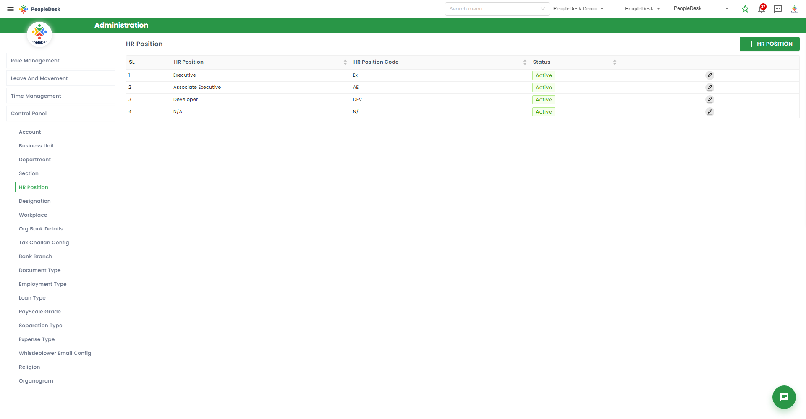

**What it does**: HR Position defines broad job-grouping labels (e.g. Executive, Developer) used to classify employees, separate from Designation.

**Key fields / columns**: SL, HR Position, HR Position Code, Status.

**Buttons & actions**:
- **+ HR POSITION** (top right) — opens the Create HR Position form.
- Edit (pencil) icon per row.

**How to use it**: 1. Go to Control Panel > HR Position. 2. Review existing positions and their codes. 3. Click **+ HR POSITION** to add a new one, or the pencil icon to edit.

**Pro-tip**: Keep HR Position codes short and consistent (e.g. "DEV", "AE") since they may appear alongside employee IDs in reports.

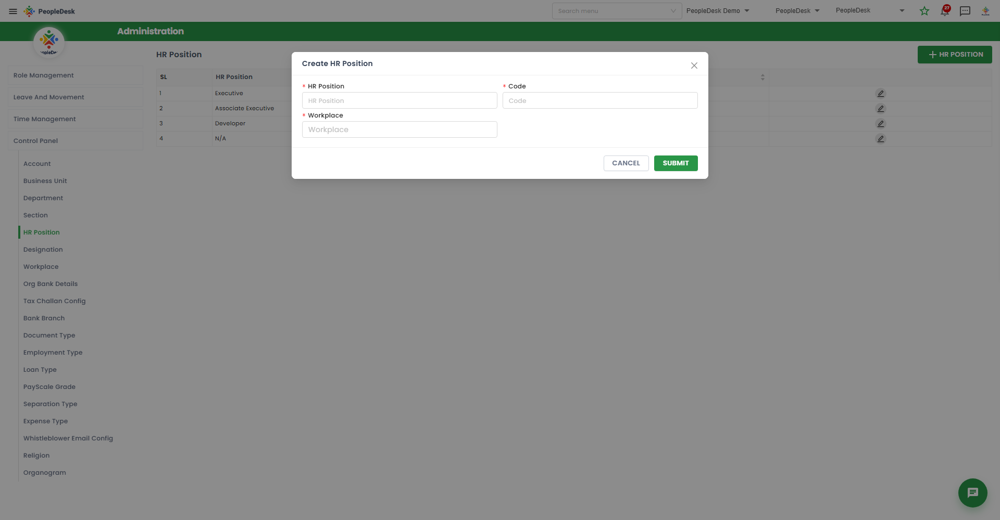

**What it does**: Form to add a new HR Position.

**Key fields / columns**:
- HR Position (required)
- Code (required)
- Workplace (required)

**Buttons & actions**:
- **CANCEL** — discards the form.
- **SUBMIT** — saves the new HR Position.

**How to use it**: 1. Click **+ HR POSITION**. 2. Enter the position name and a unique Code. 3. Select the Workplace it applies to. 4. Click **SUBMIT**.

**Pro-tip**: Since Workplace is required, confirm the Workplace list (see the Workplace page below) is already populated before adding positions.

---

#### Designation

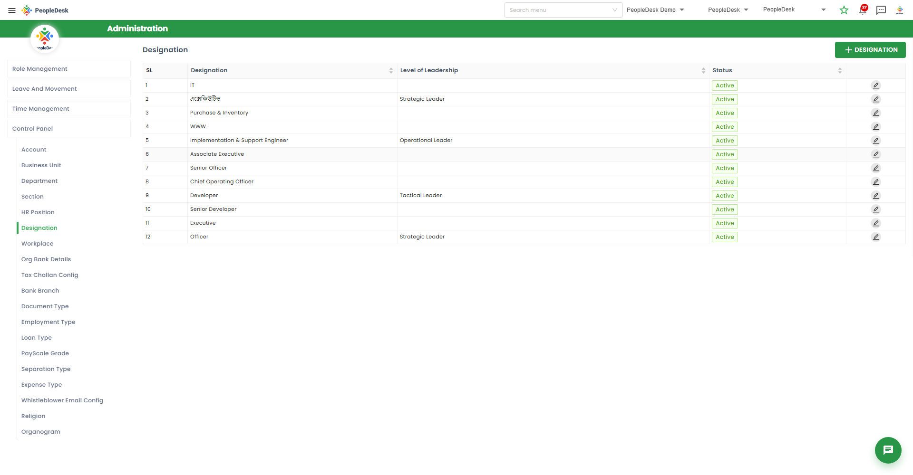

**What it does**: Designation is the employee's formal job title (e.g. Developer, Chief Operating Officer), optionally tagged with a leadership level.

**Key fields / columns**: SL, Designation, Level of Leadership, Status.

**Buttons & actions**:
- **+ DESIGNATION** (top right) — opens the Create Designation form.
- Edit (pencil) icon per row.

**How to use it**: 1. Go to Control Panel > Designation. 2. Review the list of designations and their leadership levels (Strategic Leader, Operational Leader, Tactical Leader, or blank). 3. Click **+ DESIGNATION** to add a new title, or the pencil icon to edit one.

**Pro-tip**: Assigning a "Level of Leadership" to designations lets approval workflows and org-chart views group employees by seniority tier, not just title.

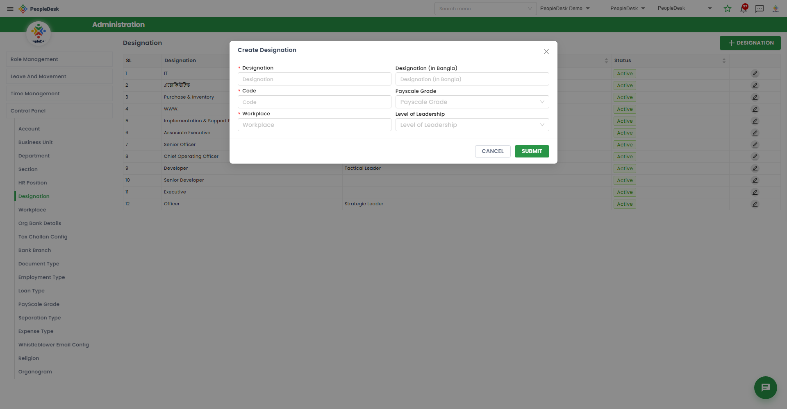

**What it does**: Form to create a new designation.

**Key fields / columns**:
- Designation (required)
- Designation (In Bangla)
- Code (required)
- Payscale Grade (dropdown)
- Workplace (required)
- Level of Leadership (dropdown)

**Buttons & actions**:
- **CANCEL** — closes the form without saving.
- **SUBMIT** — creates the designation.

**How to use it**: 1. Click **+ DESIGNATION**. 2. Enter the Designation name and Code. 3. Select the Workplace, and optionally a Payscale Grade and Level of Leadership. 4. Click **SUBMIT**.

**Pro-tip**: Linking a Payscale Grade here lets salary bands automatically pre-fill when an employee is hired into this designation.

---

#### Workplace

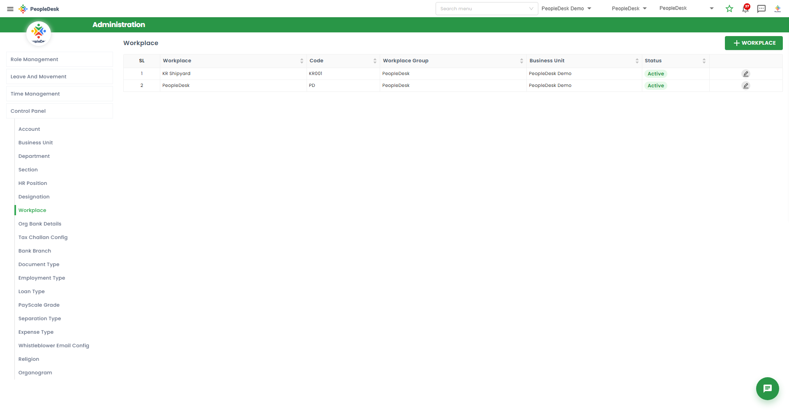

**What it does**: Workplace represents a physical office/site or branch under a Business Unit, grouped by Workplace Group.

**Key fields / columns**: SL, Workplace, Code, Workplace Group, Business Unit, Status.

**Buttons & actions**:
- **+ WORKPLACE** (top right) — opens the Create Workplace form.
- Edit (pencil) icon per row.

**How to use it**: 1. Go to Control Panel > Workplace. 2. Review existing workplaces, their codes, and parent Workplace Group/Business Unit. 3. Click **+ WORKPLACE** to add a new site, or the pencil icon to edit one.

**Pro-tip**: Workplace is a required field on many other configuration pages (HR Position, Designation, Department), so set this up early in the org-structure build-out.

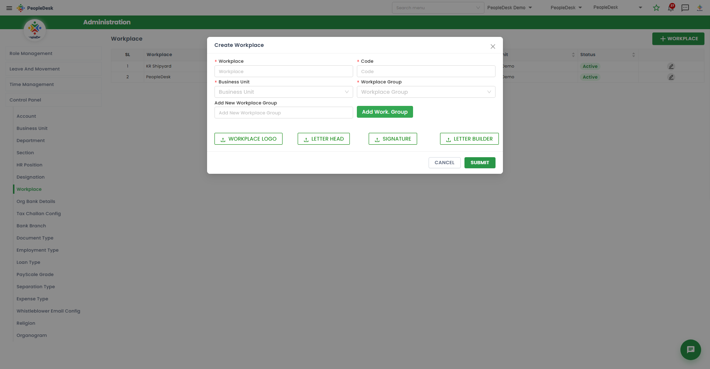

**What it does**: Form to register a new workplace/site, including branding assets used on official documents.

**Key fields / columns**:
- Workplace (required)
- Code (required)
- Business Unit (required, dropdown)
- Workplace Group (required, dropdown)
- Add New Workplace Group (free-text field to create a group on the fly)

**Buttons & actions**:
- **Add Work. Group** — creates a new Workplace Group from the adjacent text field without leaving the form.
- **WORKPLACE LOGO** — upload the workplace's logo image.
- **LETTER HEAD** — upload a letterhead template for official letters.
- **SIGNATURE** — upload an authorized signature image.
- **LETTER BUILDER** — upload/configure a letter-builder template.
- **CANCEL** — discards the form.
- **SUBMIT** — saves the new workplace.

**How to use it**: 1. Click **+ WORKPLACE**. 2. Enter Workplace name and Code. 3. Select Business Unit and Workplace Group (or type a new group name and click **Add Work. Group**). 4. Upload logo, letterhead, signature, and letter-builder assets as needed. 5. Click **SUBMIT**.

**Pro-tip**: Uploading the Letter Head and Signature here means these assets automatically appear on auto-generated HR letters (offer letters, certificates) for this workplace — set them up once to save re-uploading per document.

---

#### Org Bank Details

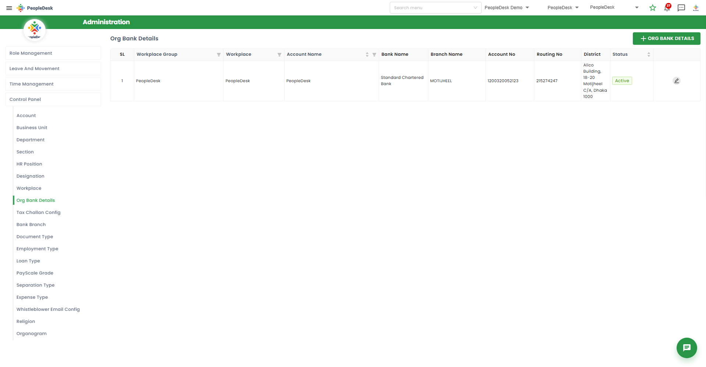

**What it does**: Stores the organization's own bank account details (used for payroll disbursement, tax challan payments, etc.), linked to a Workplace Group/Workplace.

**Key fields / columns**: SL, Workplace Group, Workplace, Account Name, Bank Name, Branch Name, Account No, Routing No, District, Status.

**Buttons & actions**:
- **+ ORG BANK DETAILS** (top right) — opens the Create Organization Bank Details form.
- Filter icons on the Workplace Group and Account Name columns — filter the list.
- Edit (pencil) icon per row.

**How to use it**: 1. Go to Control Panel > Org Bank Details. 2. Review the organization's registered bank accounts. 3. Click **+ ORG BANK DETAILS** to add a new account, or the pencil icon to edit one.

**Pro-tip**: Since these accounts feed payroll disbursement, double-check the Account No and Routing No against the bank statement before saving — a typo here can misroute salary payments.

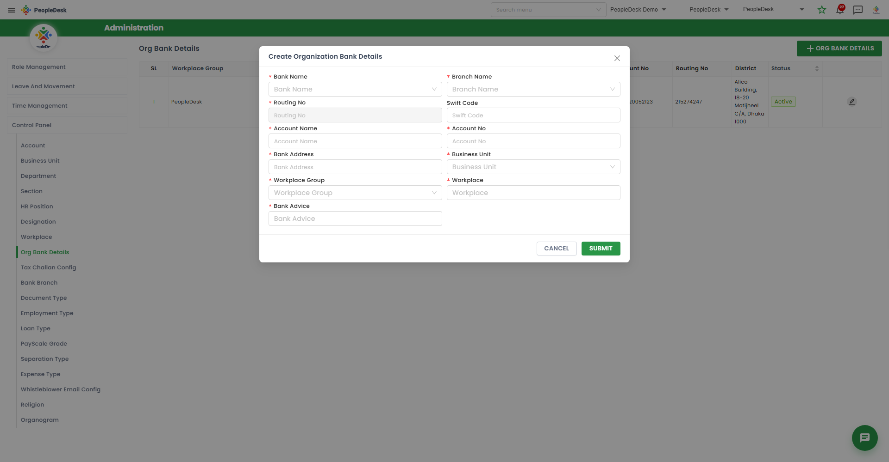

**What it does**: Form to register a new organizational bank account.

**Key fields / columns**:
- Bank Name (required, dropdown)
- Branch Name (required, dropdown)
- Routing No (required)
- Swift Code
- Account Name (required)
- Account No (required)
- Bank Address (required)
- Business Unit (required, dropdown)
- Workplace Group (required, dropdown)
- Workplace (required)
- Bank Advice (required)

**Buttons & actions**:
- **CANCEL** — closes without saving.
- **SUBMIT** — saves the new bank account record.

**How to use it**: 1. Click **+ ORG BANK DETAILS**. 2. Select Bank Name and Branch Name, then enter Routing No, Account Name, and Account No. 3. Fill in Bank Address and select Business Unit, Workplace Group, and Workplace. 4. Provide the Bank Advice value. 5. Click **SUBMIT**.

**Pro-tip**: Select Bank Name and Branch Name from the Bank Branch master list (covered below) so Routing No auto-populates correctly rather than being typed by hand.

---

#### Tax Challan Config

**What it does**: This page manages tax challan (official tax payment receipt) configuration on a per-employee basis. Rather than a distinct settings form, opening this page surfaces the employee list interface (Employee Id, Name, Type, User ID, Mobile, Status) so an employee can be selected for tax challan setup.

**Key fields / columns**: SL, Employee Id, Employee Name, Type, User ID (Login), Mobile No., Status, Action.

**Buttons & actions**:
- **Search** box (top right) — filters the employee list by name/ID.
- **+ CREATE** (top right) — opens the employee-selection list used to start a new tax challan configuration.
- Sort/filter icons on Employee Name, Type, and User ID columns.
- Edit (pencil) icon in the **Action** column per row.
- Pagination controls and **25 / page** page-size selector at the bottom.

**How to use it**: 1. Go to Control Panel > Tax Challan Config. 2. Use the Search box or column filters to locate an employee. 3. Click **+ CREATE** to configure tax challan details for an employee, or use the row's pencil icon to edit an existing configuration.

**Pro-tip**: If you can't find an employee here, check their **Status** column first — inactive employees may still be listed but excluded from active tax challan processing.

**What it does**: Clicking **+ CREATE** opens a searchable employee-picker list (Name, Designation, Department, Code, Type) rather than a direct form — you choose which employee to configure a tax challan for from here.

**Key fields / columns**: SL, Name, Designation, Department, Code, Type.

**Buttons & actions**:
- **Back arrow** (top left) — returns to the Tax Challan Config list.
- **Search** box (top right) — filters the employee picker by name.
- **+** button per row — selects that employee and proceeds to create/set their tax challan configuration.
- **25 per page** selector and pagination controls at the bottom.

**How to use it**: 1. From the Tax Challan Config list, click **+ CREATE**. 2. Search for the employee by name if needed. 3. Click the **+** icon next to the correct employee to begin their tax challan configuration.

**Pro-tip**: Use the Search box rather than scrolling — with dozens of employees per department, filtering by name is much faster than paging through the list.

---

#### Bank Branch

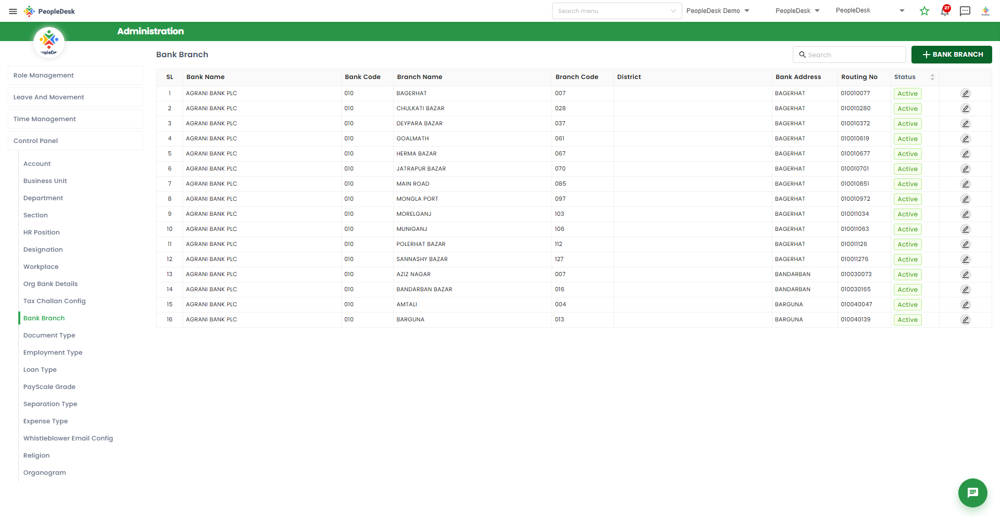

**What it does**: A master reference list of bank branches (bank name, branch, routing number, district) used across the system wherever a bank/branch needs to be selected — e.g. Org Bank Details or employee bank information.

**Key fields / columns**: SL, Bank Name, Bank Code, Branch Name, Branch Code, District, Bank Address, Routing No, Status.

**Buttons & actions**:
- **Search** box (top right) — searches the branch list.
- **+ BANK BRANCH** (top right) — opens the Create Bank Branch form.
- Edit (pencil) icon per row.

**How to use it**: 1. Go to Control Panel > Bank Branch. 2. Search for a specific bank/branch using the Search box. 3. Click **+ BANK BRANCH** to add a branch that isn't already listed, or the pencil icon to correct an existing entry.

**Pro-tip**: This list is typically pre-loaded with national bank branch data (e.g. Agrani Bank branches shown here) — only add a branch manually if it's genuinely missing.

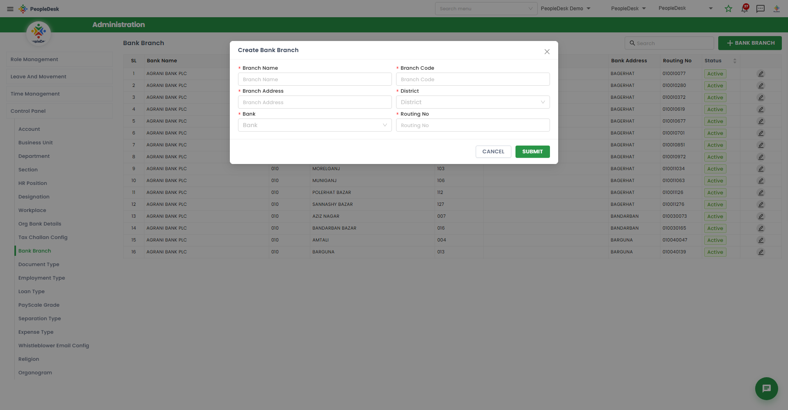

**What it does**: Form to add a new bank branch to the master reference list.

**Key fields / columns**:
- Branch Name (required)
- Branch Code (required)
- Branch Address (required)
- District (required, dropdown)
- Bank (required, dropdown)
- Routing No (required)

**Buttons & actions**:
- **CANCEL** — discards the form.
- **SUBMIT** — saves the new branch.

**How to use it**: 1. Click **+ BANK BRANCH**. 2. Select the parent Bank, then enter Branch Name, Branch Code, and Branch Address. 3. Select the District and enter the Routing No. 4. Click **SUBMIT**.

**Pro-tip**: Confirm the Routing No against Bangladesh Bank's published routing number list before saving — this value is used for bank transfer/payroll disbursement matching.

---

#### Document Type

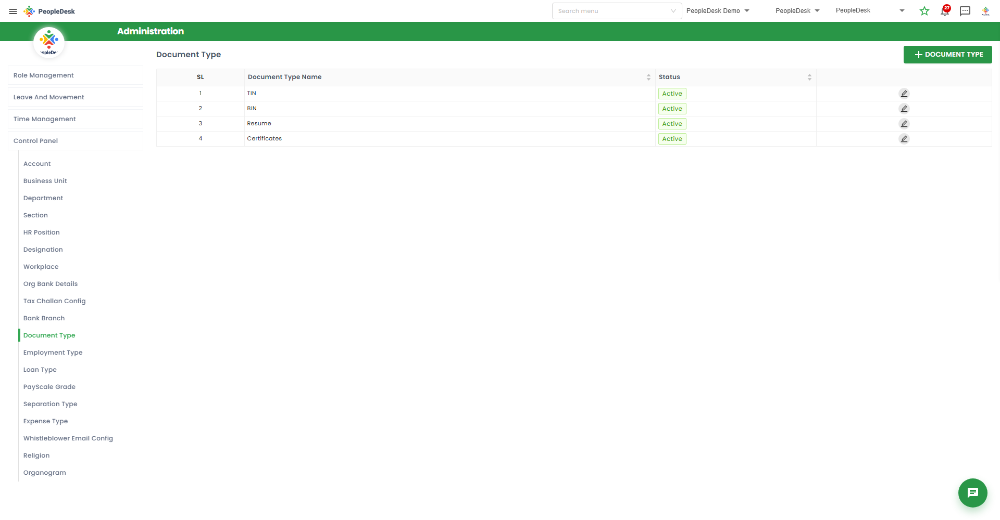

**What it does**: Defines the categories of documents (e.g. TIN, BIN, Resume, Certificates) that can be attached to employee or organization records elsewhere in the system.

**Key fields / columns**: SL, Document Type Name, Status.

**Buttons & actions**:
- **+ DOCUMENT TYPE** (top right) — opens the Create Document Type form.
- Edit (pencil) icon per row.

**How to use it**: 1. Go to Control Panel > Document Type. 2. Review the existing document categories. 3. Click **+ DOCUMENT TYPE** to add a new category, or the pencil icon to edit/deactivate one.

**Pro-tip**: Keep this list to genuinely distinct categories — too many overlapping document types makes it harder for employees to pick the right one when uploading files.

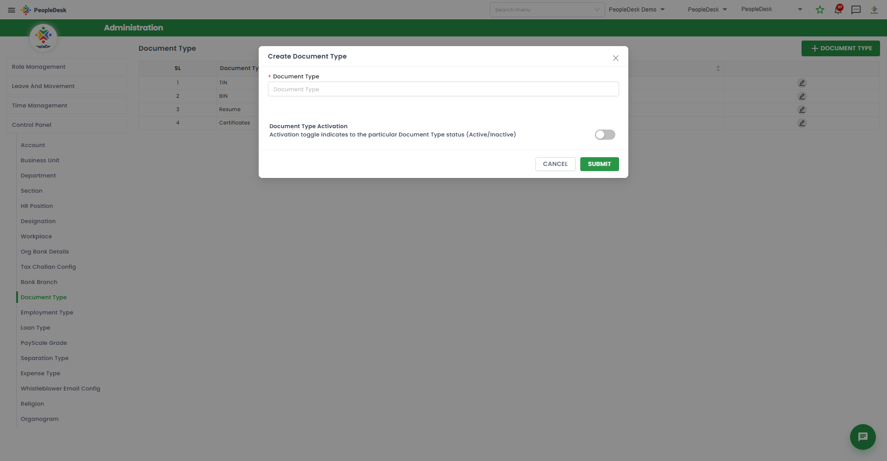

**What it does**: Form to add a new document type.

**Key fields / columns**:
- Document Type (required)
- Document Type Activation (toggle — Active/Inactive)

**Buttons & actions**:
- **Document Type Activation toggle** — sets whether the new type is immediately Active or Inactive.
- **CANCEL** — closes without saving.
- **SUBMIT** — creates the document type.

**How to use it**: 1. Click **+ DOCUMENT TYPE**. 2. Enter the Document Type name. 3. Set the Activation toggle as needed. 4. Click **SUBMIT**.

**Pro-tip**: Leave a new type Inactive if you're preparing it ahead of a policy rollout — it won't appear as a selectable option for uploads until you flip it Active.

---

#### Employment Type

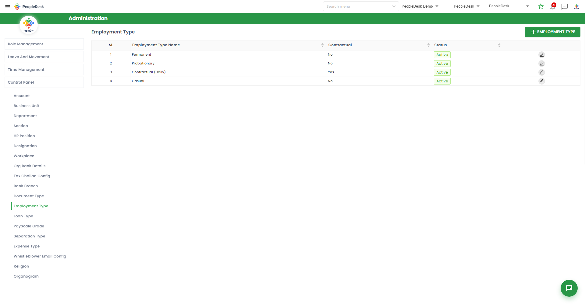

**What it does**: Defines the employment categories (Permanent, Probationary, Contractual, Casual) available for classifying employees, and whether each type is contractual in nature.

**Key fields / columns**: SL, Employment Type Name, Contractual (Yes/No), Status.

**Buttons & actions**:
- **+ EMPLOYMENT TYPE** (top right) — opens the Create Employment Type form.
- Edit (pencil) icon per row.

**How to use it**: 1. Go to Control Panel > Employment Type. 2. Review the existing types and their Contractual flag. 3. Click **+ EMPLOYMENT TYPE** to add a new type, or the pencil icon to edit one.

**Pro-tip**: The "Contractual" flag likely drives downstream logic (e.g. contract-end reminders or different leave/benefit rules) — set it correctly rather than leaving it as an afterthought.

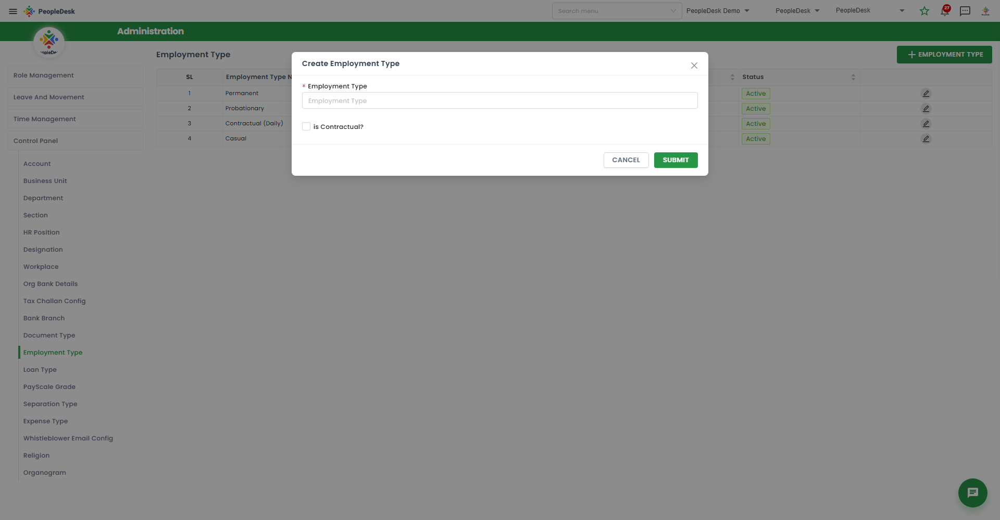

**What it does**: Form to add a new employment type.

**Key fields / columns**:
- Employment Type (required)
- Is Contractual? (checkbox)

**Buttons & actions**:
- **CANCEL** — discards the form.
- **SUBMIT** — creates the employment type.

**How to use it**: 1. Click **+ EMPLOYMENT TYPE**. 2. Enter the type name (e.g. "Internship"). 3. Check "Is Contractual?" if applicable. 4. Click **SUBMIT**.

**Pro-tip**: Only tick "Is Contractual?" for types that have a fixed end date (e.g. Contractual, Casual) — leaving it unchecked for Permanent/Probationary keeps reporting accurate.

---

#### Loan Type

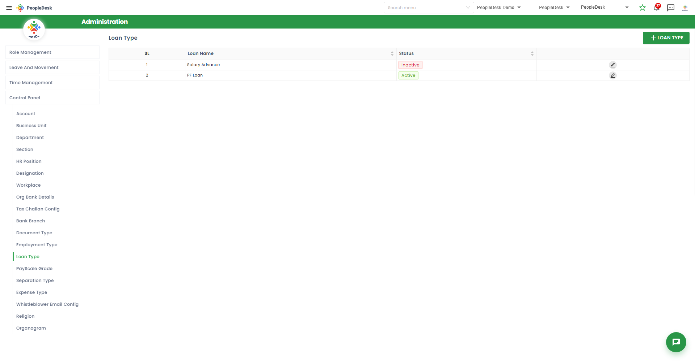

**What it does**: Defines the categories of employee loans (e.g. Salary Advance, PF Loan) that can be issued and tracked through the system.

**Key fields / columns**: SL, Loan Name, Status.

**Buttons & actions**:
- **+ LOAN TYPE** (top right) — opens the Create Loan Type form.
- Edit (pencil) icon per row.

**How to use it**: 1. Go to Control Panel > Loan Type. 2. Review existing loan categories and their status. 3. Click **+ LOAN TYPE** to add a new category, or the pencil icon to edit/deactivate one.

**Pro-tip**: Set unused loan types (like the "Salary Advance" entry shown as Inactive) to Inactive rather than deleting them, so historical loan records referencing that type remain intact.

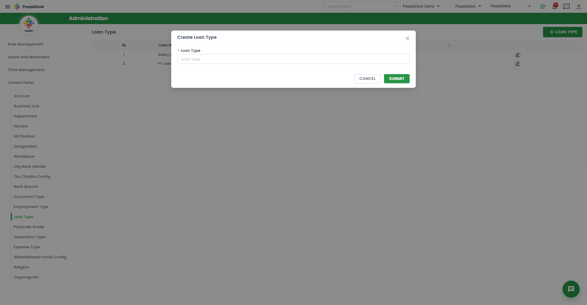

**What it does**: Form to add a new loan type.

**Key fields / columns**:
- Loan Type (required)

**Buttons & actions**:
- **CANCEL** — closes without saving.
- **SUBMIT** — creates the loan type.

**How to use it**: 1. Click **+ LOAN TYPE**. 2. Enter the loan type name. 3. Click **SUBMIT**.

**Pro-tip**: This is a single-field form — get the naming convention right up front (e.g. consistent capitalization) since it will show up as-is in employee loan applications.

---

#### PayScale Grade

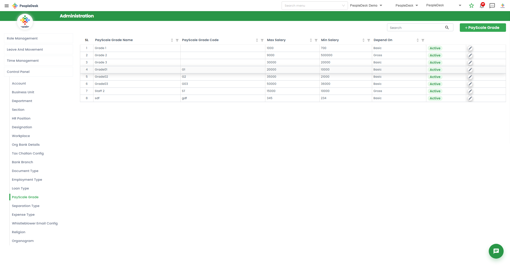

**What it does**: Defines salary grade bands (e.g. Grade 1, Grade 2) with min/max salary limits, used to standardize compensation ranges tied to designations.

**Key fields / columns**: SL, PayScale Grade Name, PayScale Grade Code, Max Salary, Min Salary, Depend On (Basic/Gross), Status.

**Buttons & actions**:
- **Search** box (top right) — searches the grade list.
- **+ PayScale Grade** (top right) — opens the Create PayScale Grade form.
- Sort/filter icons on PayScale Grade Name, PayScale Grade Code, Max Salary, Min Salary, and Depend On columns.
- Edit (pencil) icon per row.

**How to use it**: 1. Go to Control Panel > PayScale Grade. 2. Review the grade bands and their salary ranges. 3. Click **+ PayScale Grade** to add a new grade, or the pencil icon to adjust an existing one's salary range.

**Pro-tip**: The "Depend On" column shows whether Min/Max Salary is validated against Basic pay or Gross pay — check this matches your organization's compensation policy before assigning grades to designations.

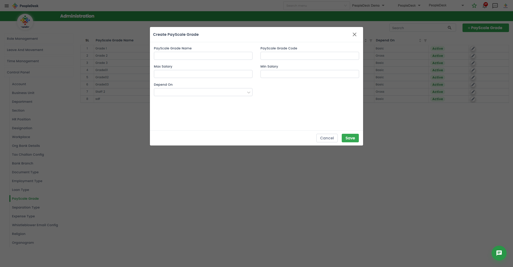

**What it does**: Form to create a new payscale grade.

**Key fields / columns**:
- PayScale Grade Name
- PayScale Grade Code
- Max Salary
- Min Salary
- Depend On (dropdown)

**Buttons & actions**:
- **Cancel** — closes the form without saving.
- **Save** — creates the new grade.

**How to use it**: 1. Click **+ PayScale Grade**. 2. Enter the Grade Name and Code. 3. Enter Max Salary and Min Salary. 4. Select what the range Depends On (e.g. Basic or Gross). 5. Click **Save**.

**Pro-tip**: Double check Min Salary is actually lower than Max Salary before saving — the table shows at least one existing grade (Grade 2) where Min (500000) exceeds Max (9000), which is likely a data-entry error worth fixing.

---

#### Separation Type

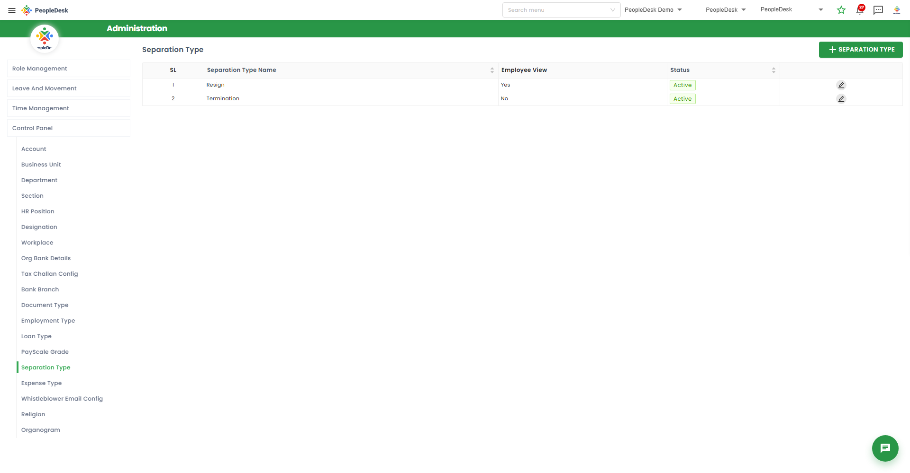

**What it does**: Defines the reasons/categories used when an employee leaves the organization (e.g. Resign, Termination), and whether that type is visible to the employee themselves.

**Key fields / columns**: SL, Separation Type Name, Employee View (Yes/No), Status.

**Buttons & actions**:
- **+ SEPARATION TYPE** (top right) — opens the Create Separation Type form.
- Edit (pencil) icon per row.

**How to use it**: 1. Go to Control Panel > Separation Type. 2. Review the separation categories and whether each is employee-visible. 3. Click **+ SEPARATION TYPE** to add a new category, or the pencil icon to edit one.

**Pro-tip**: Set "Employee View" to No for sensitive categories like Termination so employees can't self-select that reason when submitting a separation request — reserve it for HR-initiated actions.

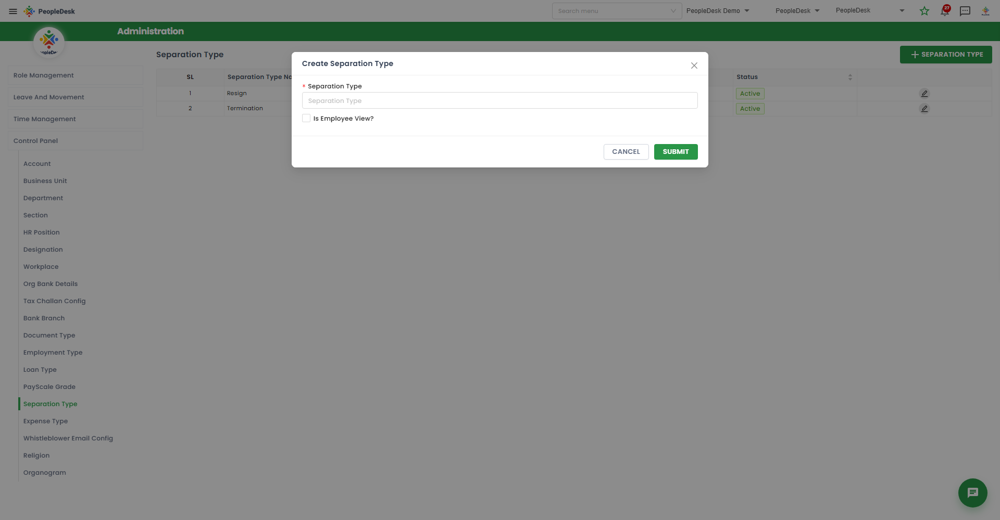

**What it does**: Form to add a new separation type.

**Key fields / columns**:
- Separation Type (required)
- Is Employee View? (checkbox)

**Buttons & actions**:
- **CANCEL** — discards the form.
- **SUBMIT** — creates the separation type.

**How to use it**: 1. Click **+ SEPARATION TYPE**. 2. Enter the type name (e.g. "Retirement"). 3. Check "Is Employee View?" only if employees should be able to select this reason themselves. 4. Click **SUBMIT**.

**Pro-tip**: Keep this list aligned with your offboarding policy document so HR and system records use identical terminology in reports.

---

#### Expense Type

**What it does**: Defines the categories of reimbursable expenses (e.g. Food, Transport) employees can claim through the expense/claim module.

**Key fields / columns**: SL, Expense Name, Status.

**Buttons & actions**:
- **+ EXPENSE TYPE** (top right) — opens the Create Expense Type form.
- Edit (pencil) icon per row.

**How to use it**: 1. Go to Control Panel > Expense Type. 2. Review the existing expense categories. 3. Click **+ EXPENSE TYPE** to add a new category, or the pencil icon to edit/deactivate one.

**Pro-tip**: Keep expense type names short and specific (e.g. split "Travel" into "Transport" and "Accommodation") so expense reports break down cleanly by category.

**What it does**: Form to add a new expense type.

**Key fields / columns**:
- Expense Type (required)

**Buttons & actions**:
- **CANCEL** — closes without saving.
- **SUBMIT** — creates the expense type.

**How to use it**: 1. Click **+ EXPENSE TYPE**. 2. Enter the expense type name. 3. Click **SUBMIT**.

**Pro-tip**: This is a simple single-field form, but changes here affect every future expense claim form — coordinate naming with Finance before adding new categories.

---

#### Whistleblower Email Config

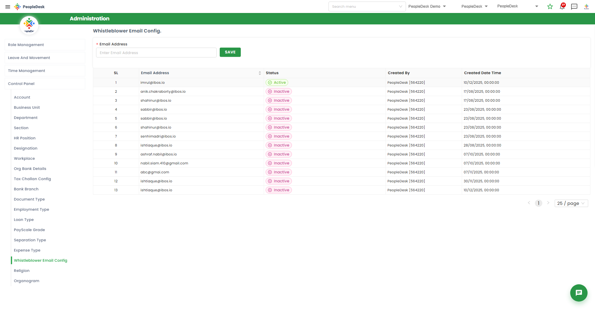

**What it does**: Configures which email addresses receive whistleblower/anonymous reporting notifications, and tracks the history of addresses added, including who added them and when.

**Key fields / columns**: Email Address (input field), and in the table below: SL, Email Address, Status (Active/Inactive), Created By, Created Date Time.

**Buttons & actions**:
- **Email Address** input field (top) — enter a new recipient email.
- **SAVE** — adds the entered email address to the notification list.
- Sort arrow on the Email Address column header.
- Pagination controls and **25 / page** page-size selector at the bottom.

**How to use it**: 1. Go to Control Panel > Whistleblower Email Config. 2. Type the email address that should receive whistleblower reports into the Email Address field. 3. Click **SAVE**. 4. Review the table below to see all addresses ever added, their current Active/Inactive status, who added them, and when.

**Pro-tip**: Only one address is shown Active in the example (the rest are Inactive) — periodically review this list and deactivate old addresses (e.g. from employees who've left) so sensitive reports don't get routed to former staff.

#### Religion

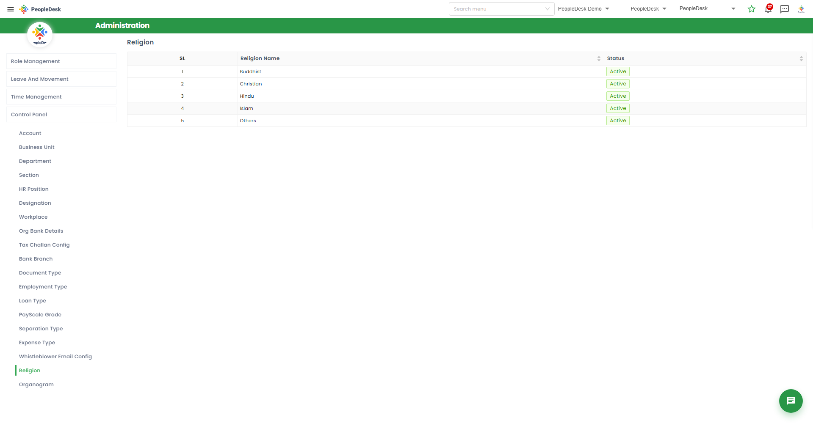

**What it does**: A simple reference-data screen that maintains the list of religions available for selection on employee profile forms elsewhere in PeopleDesk.

**Key fields / columns**:
- SL (row number)
- Religion Name
- Status

**Buttons & actions**: No add/create button is visible in this screenshot — the list (Buddhist, Christian, Hindu, Islam, Others) appears to be a fixed, pre-seeded set. Each column header has a sort control. The Status column shows a green "Active" badge for every row, indicating all religions are currently enabled for use in other forms (e.g., Employee Profile).

**How to use it**: 1. Open Administration > Control Panel > Religion. 2. Review the list of religion values and their Active/Inactive status. 3. Use these values as the reference list wherever a "Religion" field appears on employee or policy forms (for example, Bonus Setup filters by Religion).

**Pro-tip**: Since this list feeds dropdowns across the system (such as the Religion filter in Bonus Setup), keep entries limited to what your organization actually needs — unused entries only clutter other forms' dropdowns.

---

#### Organogram

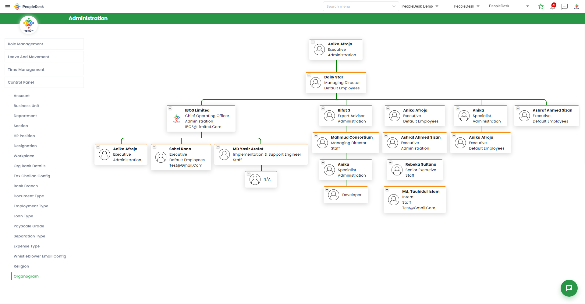

**What it does**: Renders the company's reporting structure as a visual, collapsible org chart, showing each employee's name, designation, and department/team grouping beneath their manager.

**Key fields / columns**: Each node card displays:
- Employee Name
- Designation
- Department / Team label (e.g., "Administration", "Default Employees", "Staff")
- Email (shown on some nodes, e.g., "Test@Gmail.Com")

**Buttons & actions**: Every box has a small expand/collapse toggle (the "−" icon in the top-left corner of each card) that lets you fold or unfold that branch of the hierarchy. There are no create/edit buttons on this screen — it is a read-only visualization built from data set up elsewhere (Employee Profile "Reporting To" fields).

**How to use it**: 1. Open Administration > Control Panel > Organogram. 2. Use the collapse ("−") icons to hide branches you don't need to review. 3. Trace a reporting line from the top executive down to any individual employee to confirm supervisory relationships.

**Pro-tip**: If a node shows "N/A" instead of a name, it means a reporting-line placeholder exists without an assigned employee — check Employee Profile or Bulk Reporter Update to fill the gap.

---

#### Common Approval Pipeline

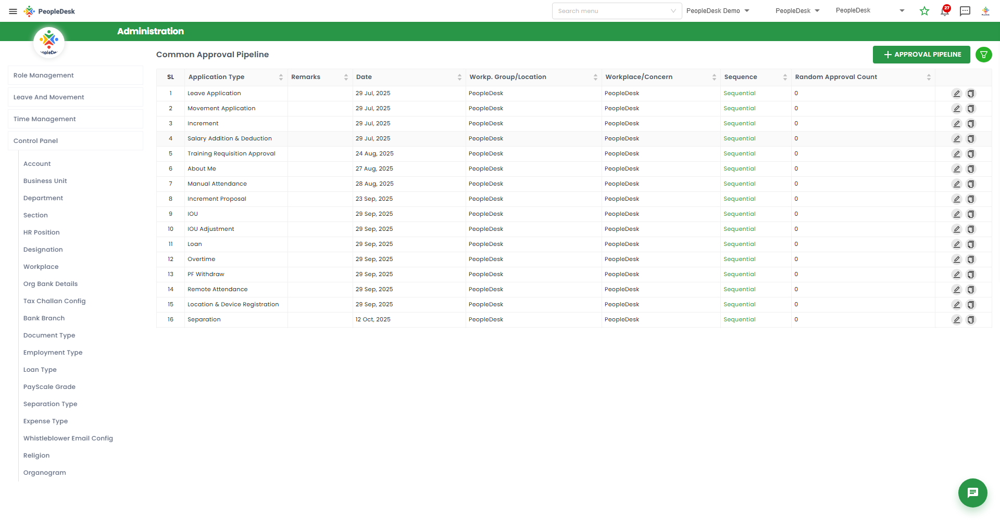

**What it does**: Defines the approval workflow (who approves what, and in what order) for each type of employee application — leave, movement, increment, loans, overtime, separation, and more — per workplace.

**Key fields / columns**:
- SL
- Application Type (e.g., Leave Application, Movement Application, Increment, Salary Addition & Deduction, Training Requisition Approval, About Me, Manual Attendance, Increment Proposal, IOU, IOU Adjustment, Loan, Overtime, PF Withdraw, Remote Attendance, Location & Device Registration, Separation)
- Remarks
- Date
- Workp. Group/Location
- Workplace/Concern
- Sequence (e.g., "Sequential")
- Random Approval Count

**Buttons & actions**:
- **+ APPROVAL PIPELINE** (top right, green) — opens the Create Approval Pipeline modal to define a new pipeline for an application type.
- **Filter icon** (green circular funnel button next to it) — opens filtering options for the list.
- **Edit (pencil)** icon per row — modify that pipeline's settings.
- **Copy/duplicate** icon per row — clone an existing pipeline's configuration as a starting point for a new one.

**How to use it**: 1. Open Administration > Control Panel > Common Approval Pipeline. 2. Locate the Application Type you want to configure. 3. Click the pencil icon to edit its approver chain, or click **+ APPROVAL PIPELINE** to create a new one. 4. Use the duplicate icon to quickly reuse an existing pipeline for a similar application type.

**Pro-tip**: Every listed pipeline currently uses "Sequential" mode with a Random Approval Count of 0 — meaning approvers are contacted strictly in order. Only switch on Random Count if you want any one of several approvers to be able to approve, in no fixed order.

##### Create Approval Pipeline

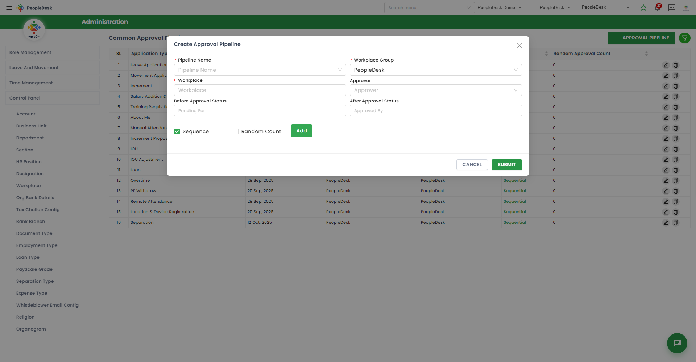

The **+ APPROVAL PIPELINE** button opens this form with the following fields:
- **Pipeline Name*** — dropdown/searchable field to select the application type this pipeline governs.
- **Workplace Group*** — dropdown, defaults to "PeopleDesk".
- **Workplace*** — text field to specify the workplace this pipeline applies to.
- **Approver** — dropdown to choose the approving employee/role.
- **Before Approval Status** — free text (placeholder "Pending For") describing the status label shown while pending.
- **After Approval Status** — free text (placeholder "Approved By") describing the status label after approval.
- **Sequence** checkbox (checked by default) — enforces ordered approval.
- **Random Count** checkbox — allows any approver in the list to approve without a fixed order.
- **Add** button (green) — adds the configured approver step to the pipeline's approval chain before final submission.
- **Cancel** / **Submit** buttons to close or save the pipeline.

**Pro-tip**: Add each approval step one at a time using the **Add** button — a pipeline usually needs multiple approvers chained together (e.g., supervisor, then HR), so don't submit after adding just the first one if more approvers are required.

---

#### Notification Setup

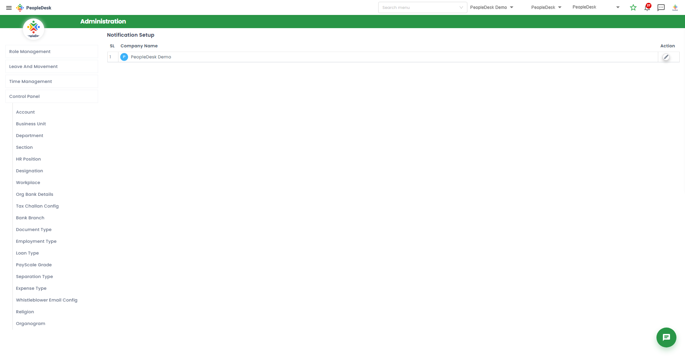

**What it does**: Lets administrators configure system notification settings (such as email/alert triggers) on a per-company basis.

**Key fields / columns**:
- SL
- Company Name
- Action

**Buttons & actions**: A single **Edit (pencil)** icon appears in the Action column for the one listed company ("PeopleDesk Demo"), opening that company's notification configuration for editing. No create button is shown, since notification setup appears to be a one-per-company configuration rather than a list of multiple free-form records.

**How to use it**: 1. Open Administration > Control Panel > Notification Setup. 2. Find your company row. 3. Click the edit (pencil) icon to open and adjust its notification settings.

**Pro-tip**: Since there's only one row per company, revisit this screen whenever you rebrand or change core communication channels, rather than expecting to add new "notification setups."

---

#### Management Dashboard Permission

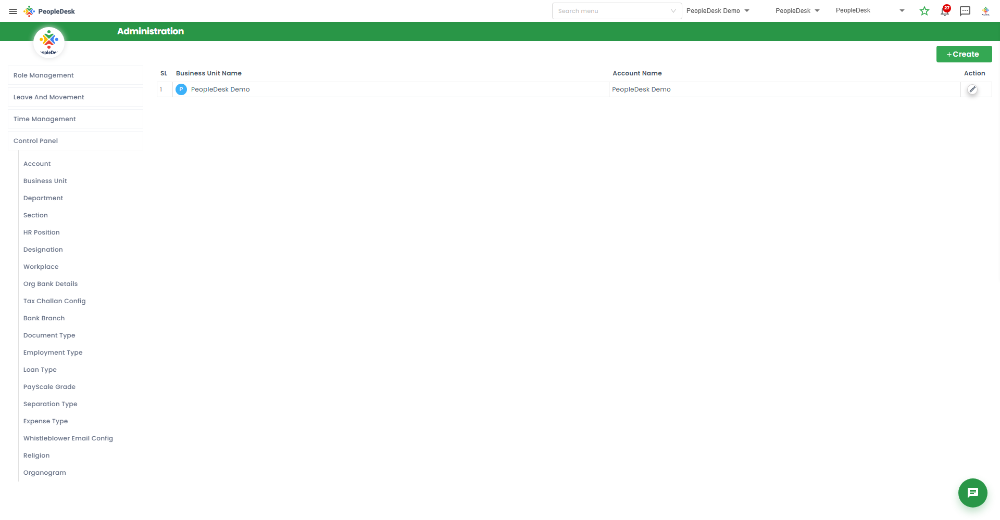

**What it does**: This screen manages access at the business-unit level. The screenshot captured for this page shows a simple two-column list rather than a detailed permission matrix.

**Key fields / columns**:
- SL
- Business Unit Name
- Account Name
- Action

**Buttons & actions**: A **+Create** button (top right, green) adds a new record; an **Edit (pencil)** icon in the Action column lets you modify the existing entry. The single row shown ("PeopleDesk Demo" business unit under "PeopleDesk Demo" account) represents the scope you would drill into to assign management dashboard visibility.

**How to use it**: 1. Open Administration > Control Panel > Management Dashboard Permission. 2. Select or edit the business unit/account entry relevant to your organization. 3. Proceed to the linked permission assignment (see the Create screen below) to choose which employees can view management dashboards.

**Pro-tip**: If your organization only has one business unit, you likely only need to configure this once — but revisit it whenever a new business unit or account is added.

##### Management Dashboard Permission — Create / Assign

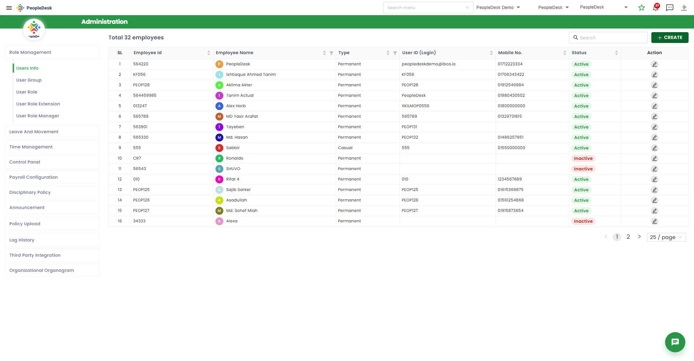

This screen shows the **Users Info** employee list ("Total 32 employees") rather than a dedicated permission form — this is the screen used to pick which employees to grant management dashboard access to.

**Key fields / columns**:
- SL
- Employee Id
- Employee Name
- Type (e.g., Permanent, Casual)
- User ID (Login)
- Mobile No.
- Status (Active/Inactive)
- Action

**Buttons & actions**: A **Search** box (top right) filters the employee list. A **+ CREATE** button opens a new-user form. An **Edit (pencil)** icon per row opens that employee's record (where dashboard-permission flags would be toggled). Pagination controls (page numbers and a "25 / page" selector) sit at the bottom for browsing all 32 employees.

**How to use it**: 1. Search for the employee you want to grant or revoke management dashboard access for. 2. Click the edit (pencil) icon on their row. 3. Locate and toggle the management dashboard permission setting within their profile, then save.

**Pro-tip**: Use the Search box rather than paging through — with 32+ employees across two pages, searching by name or ID is much faster than scanning the list manually.

---

#### Bulk Reporter Change

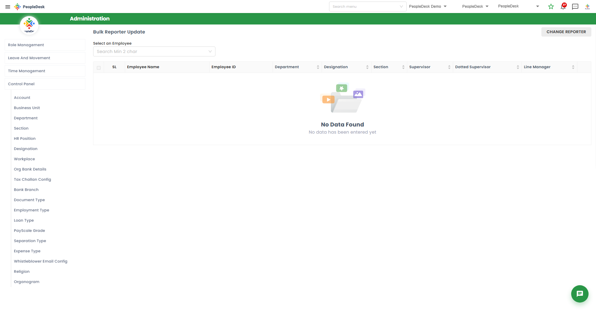

**What it does**: Allows an administrator to reassign the Supervisor, Dotted Supervisor, or Line Manager for multiple employees at once, rather than editing each employee's profile individually.

**Key fields / columns**:
- Select an Employee (search box, "Search Min 2 char")
- Checkbox column (for multi-select)
- SL
- Employee Name
- Employee ID
- Department
- Designation
- Section
- Supervisor
- Dotted Supervisor
- Line Manager

**Buttons & actions**: **CHANGE REPORTER** button (top right) applies a reporter change to the selected employee(s). The "Select an Employee" search field lets you find and add employees to the batch before changing their reporting lines. In this screenshot, no employees have been selected yet, so the table shows "No Data Found / No data has been entered yet."

**How to use it**: 1. Open Administration > Control Panel > Bulk Reporter Change. 2. Type at least 2 characters in "Select an Employee" to search and add employees to the list. 3. Select the checkboxes for the employees whose reporting line you want to change. 4. Click **CHANGE REPORTER** and specify the new Supervisor, Dotted Supervisor, or Line Manager.

**Pro-tip**: Use this page during org restructuring or when a manager leaves — it saves you from opening dozens of individual employee profiles just to update the reporting line.

---

#### Deposit Type

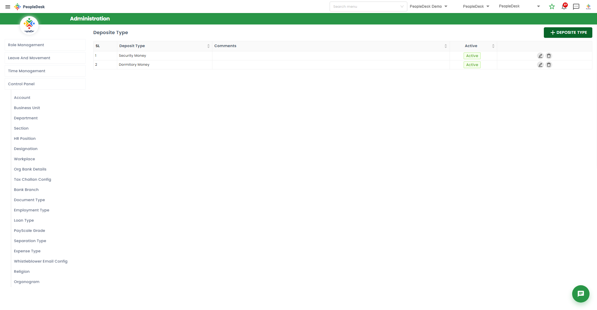

**What it does**: Maintains the list of deposit types (such as security deposits or dormitory deposits) that can be deducted from or tracked for employees, typically used in payroll or HR finance modules.

**Key fields / columns**:
- SL
- Deposit Type
- Comments
- Active (status badge)
- Action

**Buttons & actions**: **+ DEPOSITE TYPE** button (top right, green) opens the create form. Each row has an **Edit (pencil)** icon and a **Delete (trash)** icon. The two existing entries, "Security Money" and "Dormitory Money," are both marked Active.

**How to use it**: 1. Open Administration > Control Panel > Deposit Type. 2. Click **+ DEPOSITE TYPE** to add a new deposit category, or use the pencil/trash icons to edit or remove an existing one. 3. Reference these deposit types wherever employee deposits are recorded.

**Pro-tip**: Deactivate a deposit type you no longer use instead of deleting it, if past records still reference it — check the Edit form for an active/inactive toggle before deleting outright.

##### Create Deposit Type

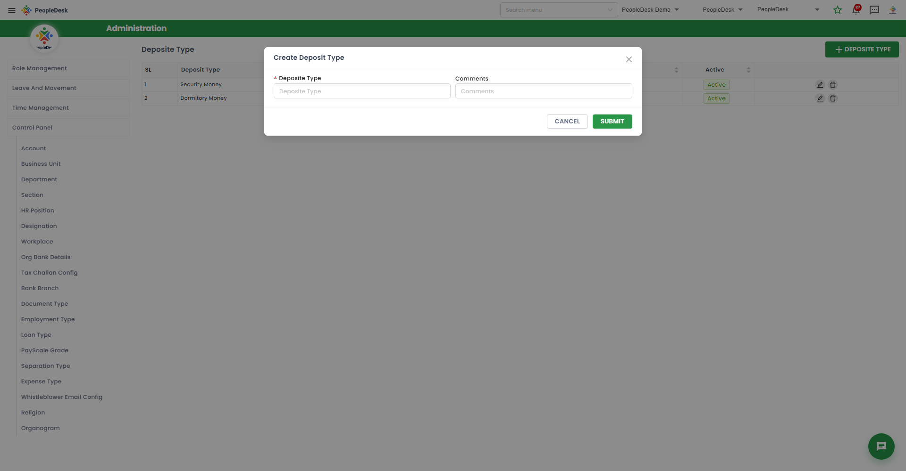

The **+ DEPOSITE TYPE** button opens this modal with:
- **Deposite Type*** — required text field naming the new deposit type.
- **Comments** — optional free-text notes.
- **CANCEL** / **SUBMIT** buttons.

**Pro-tip**: Use the Comments field to note the purpose or applicable policy for each deposit type (e.g., "refundable on separation") so other admins understand its intent later.

---

#### Product Creation

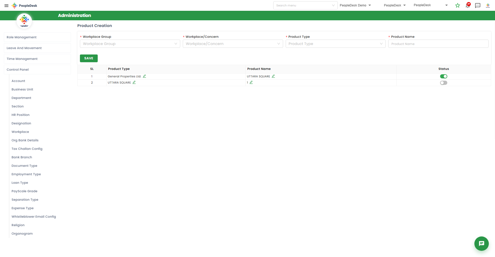

**What it does**: Lets administrators define "products" (e.g., properties or business offerings tied to a workplace) that can later be associated with workplace records elsewhere in the system.

**Key fields / columns**:
- Workplace Group* (dropdown)
- Workplace/Concern* (dropdown)
- Product Type* (dropdown)
- Product Name* (text)
- Table: SL, Product Type, Product Name, Status (toggle)

**Buttons & actions**: **SAVE** button (green) submits the form above to create a new product entry. Each Product Type and Product Name cell in the table has an inline **edit (pencil)** icon for quick renaming. The **Status** column uses a toggle switch to enable/disable the product — row 1 ("General Properties Ltd." / "UTTARA SQUARE") is enabled (green toggle), while row 2 ("UTTARA SQUARE" / "1") is disabled (grey toggle).

**How to use it**: 1. Open Administration > Control Panel > Product Creation. 2. Select the Workplace Group, Workplace/Concern, and Product Type from their dropdowns. 3. Enter a Product Name. 4. Click **SAVE**. 5. Use the inline pencil icons or the Status toggle to edit or disable products later.

**Pro-tip**: Toggle a product's Status off instead of trying to delete it if it's still referenced elsewhere — this keeps historical data intact while hiding it from active use.

---

#### Manpower Category

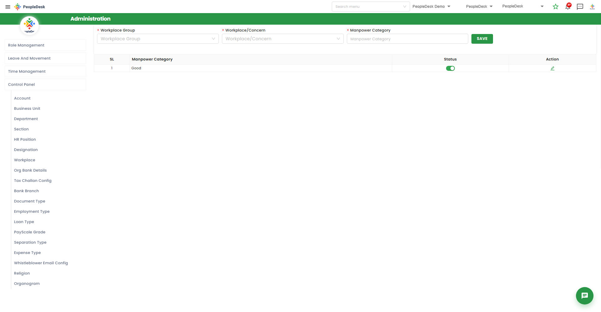

**What it does**: Defines categories used to classify manpower/workforce quality or type (e.g., "Good") for a given workplace, likely used in staffing or manpower planning reports.

**Key fields / columns**:
- Workplace Group* (dropdown)
- Workplace/Concern* (dropdown)
- Manpower Category* (text)
- Table: SL, Manpower Category, Status (toggle), Action

**Buttons & actions**: **SAVE** button (green) creates the new category after selecting the Workplace Group/Concern and entering a category name. The **Status** toggle in the table (shown green/on for "Good") enables or disables that category. An **Edit (pencil)** icon in the Action column lets you rename it.

**How to use it**: 1. Open Administration > Control Panel > Manpower Category. 2. Choose the Workplace Group and Workplace/Concern. 3. Type the category name and click **SAVE**. 4. Use the pencil icon to edit an existing category, or the toggle to activate/deactivate it.

**Pro-tip**: Keep manpower category names short and standardized (like "Good," "Skilled," "Unskilled") so they stay meaningful across different workplaces and reports.

---

#### Workforce Hierarchy

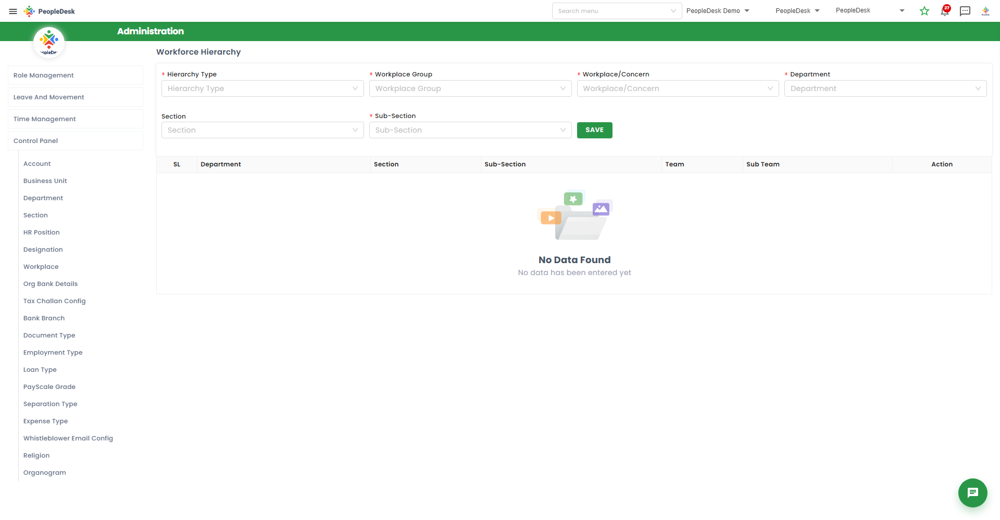

**What it does**: Configures an organization's workforce structure hierarchy (Department, Section, Sub-Section, Team, Sub Team) tied to a specific Hierarchy Type and workplace, for use in staffing/reporting structures separate from the general org chart.

**Key fields / columns**:
- Hierarchy Type* (dropdown)
- Workplace Group* (dropdown)
- Workplace/Concern* (dropdown)
- Department* (dropdown)
- Section (dropdown)
- Sub-Section* (dropdown)
- Table: SL, Department, Section, Sub-Section, Team, Sub Team, Action

**Buttons & actions**: **SAVE** button (green) commits the selected hierarchy levels as a new record. The table below is currently empty, showing "No Data Found / No data has been entered yet" since no hierarchy has been saved yet in this environment.

**How to use it**: 1. Open Administration > Control Panel > Workforce Hierarchy. 2. Select the Hierarchy Type, Workplace Group, and Workplace/Concern. 3. Choose the Department, Section, and Sub-Section that make up this hierarchy level. 4. Click **SAVE** to add it to the table.

**Pro-tip**: Set up Department, Section, and Sub-Section records (under their own Control Panel pages) before attempting to build a Workforce Hierarchy — the dropdowns here depend on those being defined first.

---

#### Payroll Element

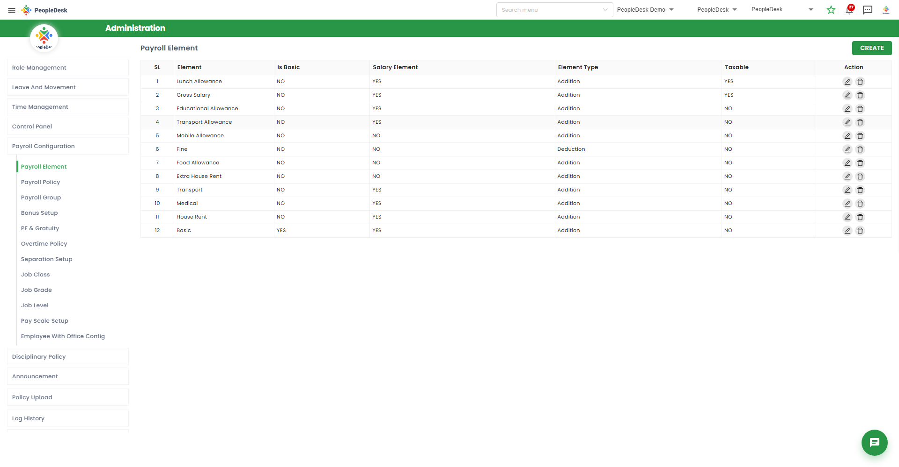

**What it does**: Defines the individual pay components (allowances, deductions, and the Basic/Gross Salary elements) that make up an employee's salary structure, each flagged for whether it's basic, part of the salary calculation, and taxable.

**Key fields / columns**:
- SL
- Element (e.g., Lunch Allowance, Gross Salary, Educational Allowance, Transport Allowance, Mobile Allowance, Fine, Food Allowance, Extra House Rent, Transport, Medical, House Rent, Basic)
- Is Basic (Yes/No)
- Salary Element (Yes/No)
- Element Type (Addition / Deduction)
- Taxable (Yes/No)
- Action

**Buttons & actions**: **CREATE** button (top right, green) opens the Create Payroll Element form. Each row has **Edit (pencil)** and **Delete (trash)** icons to modify or remove that pay element.

**How to use it**: 1. Open Administration > Payroll Configuration > Payroll Element. 2. Review existing elements — note which are Additions (allowances) vs. Deductions (e.g., "Fine"). 3. Click **CREATE** to add a new element, or use the pencil/trash icons to manage existing ones.

**Pro-tip**: Only one element should typically be marked "Is Basic = YES" (here, "Basic") since this underpins calculations like PF, Gratuity, and Overtime that reference the Basic component.

##### Create Payroll Element

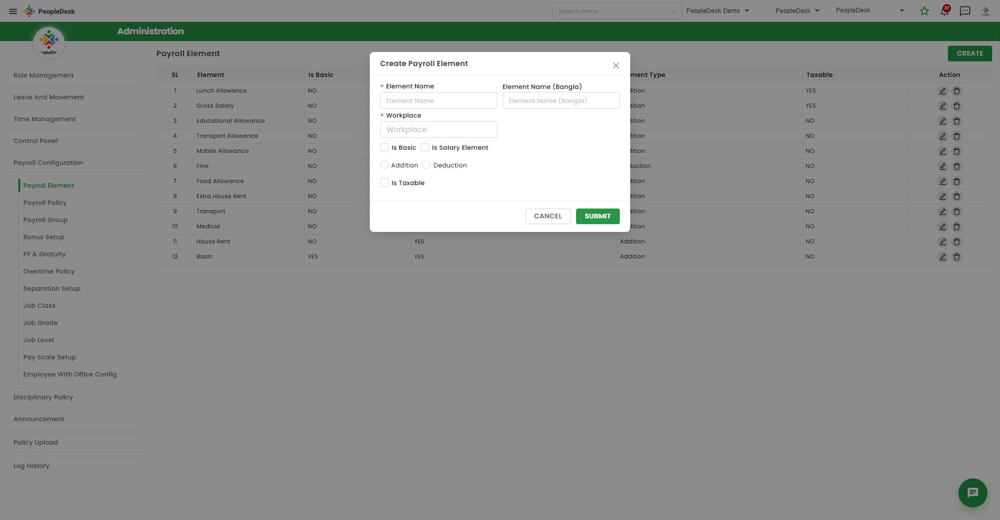

The **CREATE** button opens this modal with:
- **Element Name*** — required text field.
- **Element Name (Bangla)** — optional localized name.
- **Workplace*** — required text field.
- **Is Basic** checkbox.
- **Is Salary Element** checkbox.
- **Addition / Deduction** radio buttons — determines whether this element adds to or subtracts from gross pay.
- **Is Taxable** checkbox.
- **CANCEL** / **SUBMIT** buttons.

**Pro-tip**: Decide Addition vs. Deduction carefully before submitting — this determines how the element behaves in every payroll run once employees are attached to it.

---

#### Payroll Policy

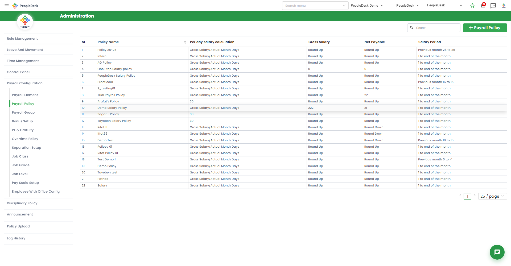

**What it does**: Defines the salary calculation rules a payroll group can follow — how per-day salary is calculated, how gross and net payable amounts are rounded, and what date range constitutes the salary period.

**Key fields / columns**:
- SL
- Policy Name (e.g., Policy 26-25, Intern, AG Policy, One Stop Salary policy, PeopleDesk Salary Policy, Trial Payroll Policy, Demo Salary Policy, etc.)
- Per day salary calculation (e.g., "Gross Salary/Actual Month Days" or a fixed number like "30")
- Gross Salary (e.g., "Round Up," or a fixed number)
- Net Payable (e.g., "Round Up," "Round Down," or a fixed number)
- Salary Period (e.g., "1 to end of the month," "Previous month 26 to 25," "Previous month 16 to 15," "Previous month 0 to -1")

**Buttons & actions**: A **Search** box (top right) filters the policy list. **+ Payroll Policy** button (green) opens the create form. Pagination controls ("25 / page") sit at the bottom for browsing all 22 listed policies.

**How to use it**: 1. Open Administration > Payroll Configuration > Payroll Policy. 2. Use Search to find a specific policy by name. 3. Click **+ Payroll Policy** to define a new salary calculation rule. 4. Assign the resulting policy to a Payroll Group.

**Pro-tip**: Standardize on as few payroll policies as possible — this list already has over 20 similarly named policies, which makes it easy to accidentally assign the wrong one to a payroll group.

##### Create Salary Policy

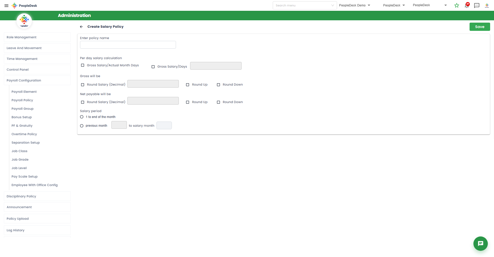

The **+ Payroll Policy** button opens this full-page form with:
- **Enter policy name** — text field for naming the policy.
- **Per day salary calculation** — choose "Gross Salary/Actual Month Days" or "Gross Salary/Days" (with a custom day count).
- **Gross will be** — optionally round the gross salary to a decimal, with **Round Up** / **Round Down** options.
- **Net payable will be** — the same rounding options applied to the net payable amount.
- **Salary period** — choose "1 to end of the month" or a custom "previous month [X] to salary month [Y]" range.
- **Save** button (top right) commits the new policy.

**Pro-tip**: If your pay cycle doesn't run calendar-month to calendar-month (e.g., 26th to 25th), use the "previous month to salary month" option rather than trying to force it into the default "1 to end of month" setting.

---

#### Payroll Group

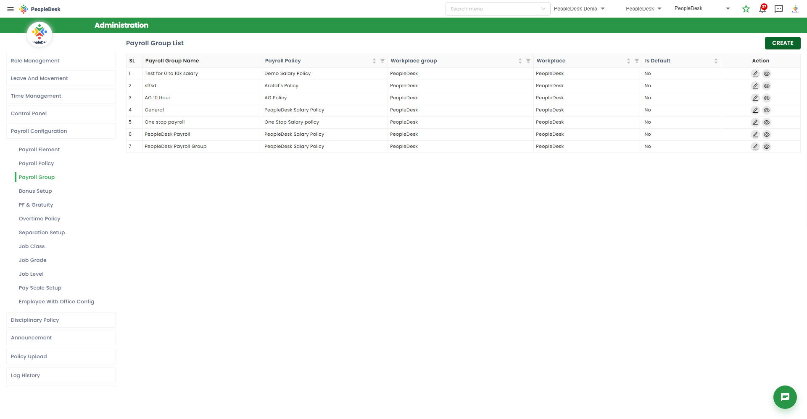

**What it does**: Groups employees under a specific Payroll Policy and workplace, bundling the payroll elements that apply to that group — this is the entity actually assigned to employees to determine how they get paid.

**Key fields / columns**:
- SL
- Payroll Group Name (e.g., Test for 0 to 10k salary, sffsd, AG 10 Hour, General, One stop payroll, PeopleDesk Payroll, PeopleDesk Payroll Group)
- Payroll Policy (linked policy name)
- Workplace group
- Workplace
- Is Default (Yes/No)
- Action

**Buttons & actions**: **CREATE** button (top right, green) opens the Create Payroll Group form. Each row has an **Edit (pencil)** icon and a **View (eye)** icon to inspect the group's full configuration.

**How to use it**: 1. Open Administration > Payroll Configuration > Payroll Group. 2. Review existing groups and their linked Payroll Policy. 3. Click **CREATE** to define a new group, or use the eye icon to view a group's details before assigning employees to it.

**Pro-tip**: Mark exactly one payroll group per workplace as "Is Default = Yes" so new employees automatically fall into a sensible payroll group if none is explicitly assigned.

##### Create Payroll Group

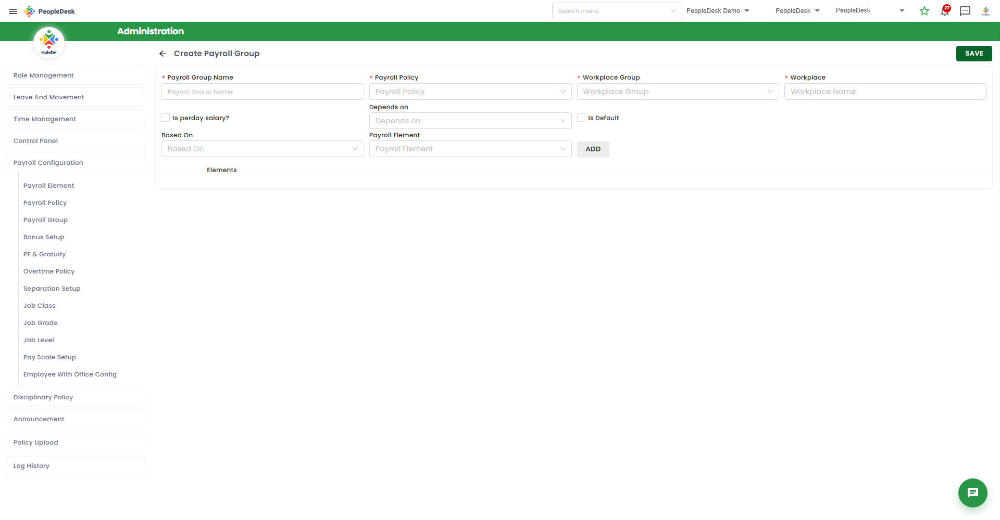

The **CREATE** button opens this form with:
- **Payroll Group Name*** — required text field.
- **Payroll Policy*** — required dropdown.
- **Workplace Group*** — required dropdown.
- **Workplace*** — required text field.
- **Is perday salary?** checkbox.
- **Depends on** — dropdown.
- **Is Default** checkbox.
- **Based On** — dropdown.
- **Payroll Element** — dropdown, paired with an **ADD** button to attach elements one at a time.
- **Elements** — list area below where added elements accumulate.
- **SAVE** button (top right) commits the group.

**Pro-tip**: Add each Payroll Element via the **ADD** button before saving — the group is only useful once it has the right combination of allowances/deductions attached to it.

---

#### Bonus Setup

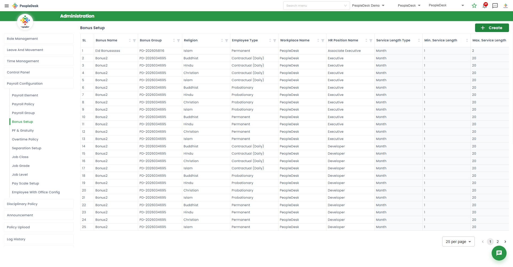

**What it does**: Configures bonus rules (e.g., Eid bonus) that apply to employees based on combinations of Religion, Employee Type, HR Position, workplace, and length of service.

**Key fields / columns**:
- SL
- Bonus Name (e.g., Eid Bonusssss, Bonus2)
- Bonus Group (an internal code, e.g., "PD-2026058116")
- Religion (Islam, Buddhist, Hindu, Christian)
- Employee Type (Permanent, Contractual (Daily), Probationary)
- Workplace Name
- HR Position Name (Associate Executive, Executive, Developer)
- Service Length Type (Month)
- Min. Service Length
- Max. Service Length

**Buttons & actions**: **+ Create** button (top right, green) opens the Create Bonus Setup form. Column filter icons appear on Bonus Name, Bonus Group, Religion, and Employee Type headers for narrowing the list. Pagination ("25 per page", page 1/2) sits at the bottom.

**How to use it**: 1. Open Administration > Payroll Configuration > Bonus Setup. 2. Use the column filters to find bonus rules for a specific Religion or Employee Type. 3. Click **+ Create** to define a new bonus rule combination.

**Pro-tip**: Because a single bonus (like "Bonus2") can generate many rows — one per Religion/Employee Type/HR Position combination — use the filters rather than scrolling to confirm a specific combination's min/max service length before editing.

##### Create Bonus Setup

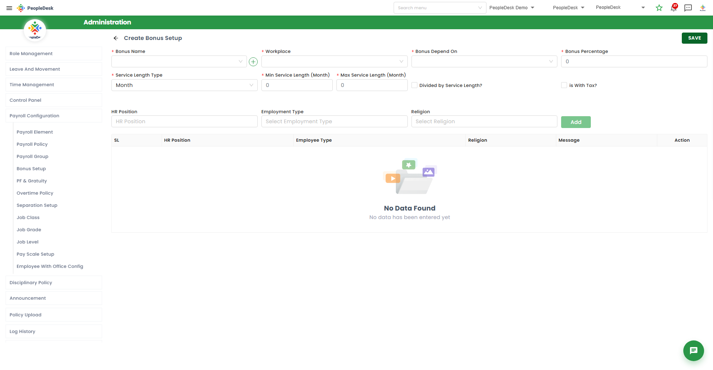

The **+ Create** button opens this form with:
- **Bonus Name*** — searchable/creatable dropdown (with a "+" icon to add a brand-new bonus name).
- **Workplace*** — required dropdown.
- **Bonus Depend On*** — required dropdown (e.g., which salary element the bonus is calculated from).
- **Bonus Percentage*** — numeric field (default 0).
- **Service Length Type*** — dropdown, defaults to "Month."
- **Min Service Length (Month)*** and **Max Service Length (Month)*** — numeric range fields.
- **Divided by Service Length?** checkbox.
- **is With Tax?** checkbox.
- **HR Position**, **Employment Type**, **Religion** — three filter fields plus an **Add** button to attach a specific eligibility combination.
- A table (SL, HR Position, Employee Type, Religion, Message, Action) accumulates each added combination — currently empty ("No Data Found").
- **SAVE** button (top right) commits the bonus rule.

**Pro-tip**: Use the **Add** button to build up multiple HR Position/Employment Type/Religion combinations under one Bonus Name — this is how a single bonus (like "Bonus2") ends up covering dozens of eligibility rows in the list view.

---

#### PF & Gratuity

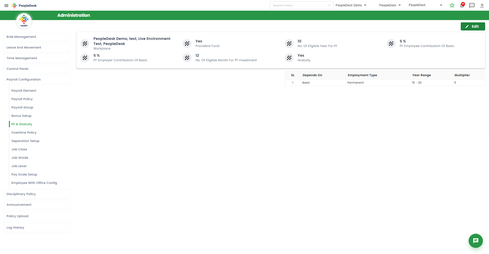

**What it does**: Displays the current Provident Fund (PF) and Gratuity configuration for the organization's workplaces — a read-only summary of retirement/end-of-service benefit rules.

**Key fields / columns** (shown as summary tiles):
- Workplace (e.g., "PeopleDesk Demo, test, Live Environment Test, PeopleDesk")
- Provident Fund (Yes/No)
- No. Of Eligible Year For PF
- PF Employee Contribution Of Basic (%)
- PF Employer Contribution Of Basic (%)
- No. Of Eligible Month For PF Investment
- Gratuity (Yes/No)
- Table below: SL, Depends On, Employment Type, Year Range, Multiplier

**Buttons & actions**: **Edit** button (top right, green) is the only action available — it opens the Edit PF & Gratuity form shown below. The lower table lists the gratuity multiplier rule (Basic / Permanent / 15–20 years / multiplier 5).

**How to use it**: 1. Open Administration > Payroll Configuration > PF & Gratuity to review the current PF and gratuity settings. 2. Click **Edit** to make changes.

**Pro-tip**: Check "No. Of Eligible Year For PF" and "No. Of Eligible Month For PF Investment" together — an employee only starts accruing PF investment eligibility after both the service-length and monthly-investment thresholds are met.

##### Edit PF & Gratuity

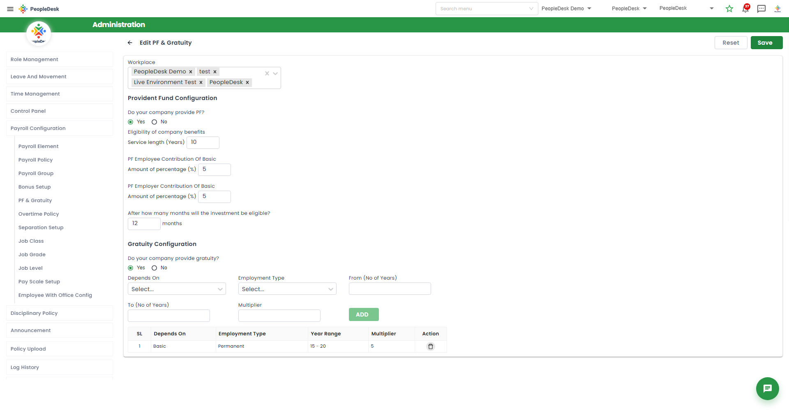

Clicking **Edit** opens this form with:
- **Workplace** — multi-select tag field (e.g., PeopleDesk Demo, test, Live Environment Test, PeopleDesk).
- **Provident Fund Configuration**: "Do your company provide PF?" (Yes/No radio); "Service length (Years)" eligibility field; "PF Employee Contribution Of Basic — Amount of percentage (%)"; "PF Employer Contribution Of Basic — Amount of percentage (%)"; "After how many months will the investment be eligible?" (in months).
- **Gratuity Configuration**: "Do your company provide gratuity?" (Yes/No radio); Depends On dropdown; Employment Type dropdown; From (No of Years); To (No of Years); Multiplier; **ADD** button to append a new year-range/multiplier rule; a table listing added rules with a delete (trash) icon per row.
- **Reset** and **Save** buttons (top right).

**Pro-tip**: Use the **ADD** button to define multiple gratuity multiplier tiers (e.g., 0–5 years, 5–15 years, 15–20 years) with increasing multipliers — a single flat multiplier rarely reflects real-world tenure-based gratuity policies.

---

#### Overtime Policy

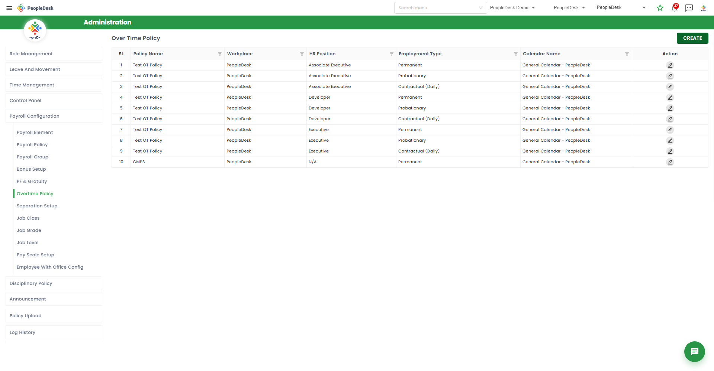

**What it does**: Defines overtime (OT) pay rules per workplace, HR position, and employment type, linking each rule to a work calendar that determines what counts as overtime hours.

**Key fields / columns**:
- SL
- Policy Name (e.g., Test OT Policy, GMPS)
- Workplace
- HR Position (Associate Executive, Developer, Executive, N/A)
- Employment Type (Permanent, Probationary, Contractual (Daily))
- Calendar Name (e.g., "General Calendar - PeopleDesk")
- Action

**Buttons & actions**: **CREATE** button (top right, green) opens the Create OT Policy form. Column filter icons appear on Policy Name, Workplace, HR Position, Employment Type, and Calendar Name for narrowing results. Each row has an **Edit (pencil)** icon.

**How to use it**: 1. Open Administration > Payroll Configuration > Overtime Policy. 2. Filter or scan for the HR Position/Employment Type combination you need. 3. Click **CREATE** to add a new OT rule, or the pencil icon to adjust an existing one.

**Pro-tip**: Notice that "Test OT Policy" repeats across all combinations of 3 HR Positions × 3 Employment Types (9 rows) — this pattern shows one policy can be efficiently duplicated across every position/employment-type pair rather than written from scratch each time.

##### Create OT Policy

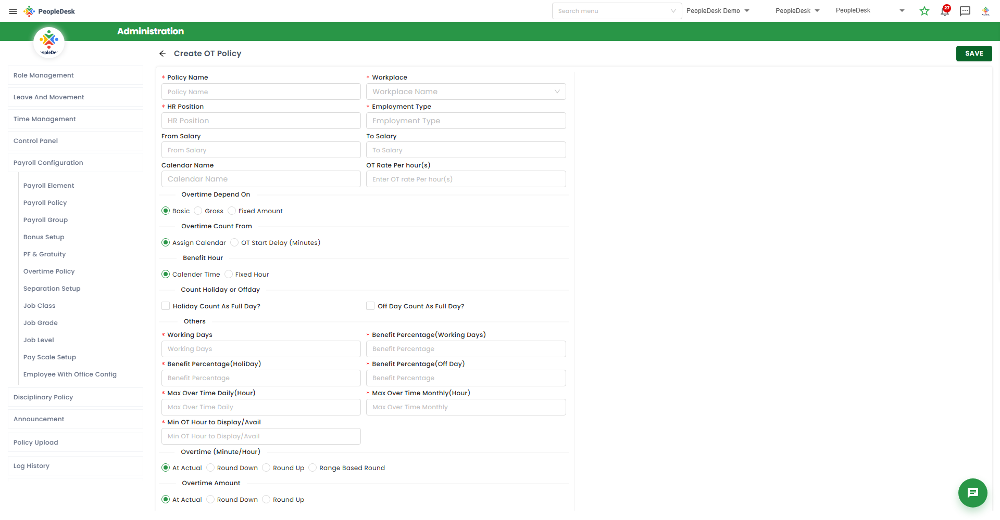

The **CREATE** button opens this detailed form with:
- **Policy Name***, **Workplace***, **HR Position***, **Employment Type*** — required identification fields.
- **From Salary** / **To Salary** — optional salary range this policy applies to.
- **Calendar Name** and **OT Rate Per hour(s)**.
- **Overtime Depend On** — radio: Basic / Gross / Fixed Amount.
- **Overtime Count From** — radio: Assign Calendar / OT Start Delay (Minutes).
- **Benefit Hour** — radio: Calendar Time / Fixed Hour.
- **Count Holiday or Offday** — checkboxes: "Holiday Count As Full Day?" and "Off Day Count As Full Day?"
- **Others** section (all required): Working Days, Benefit Percentage (Working Days), Benefit Percentage (HoliDay), Benefit Percentage (Off Day), Max Over Time Daily (Hour), Max Over Time Monthly (Hour), Min OT Hour to Display/Avail.
- **Overtime (Minute/Hour)** — radio: At Actual / Round Down / Round Up / Range Based Round.
- **Overtime Amount** — radio: At Actual / Round Down / Round Up.
- **SAVE** button (top right).

**Pro-tip**: Set "Max Over Time Daily (Hour)" and "Max Over Time Monthly (Hour)" conservatively to enforce labor-law compliance limits automatically, rather than relying on manual review of overtime claims.

---

#### Separation Setup

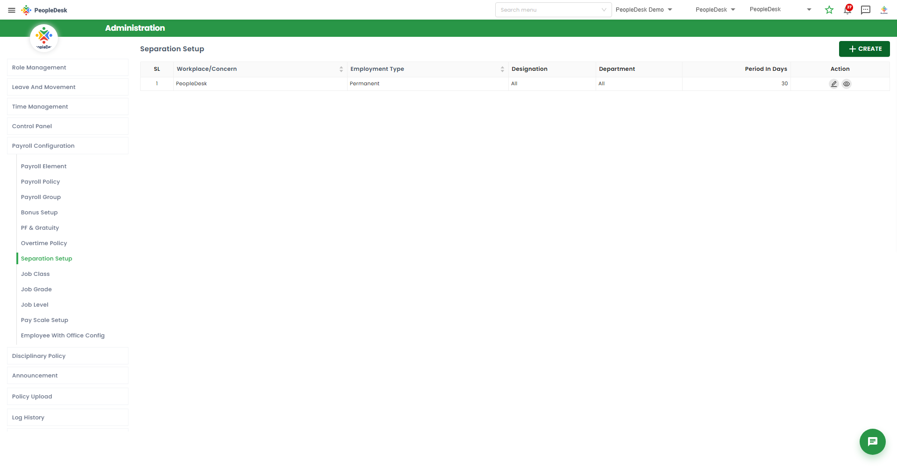

**What it does**: Configures the notice-period rules (in days) that apply when an employee separates from the company, based on their workplace, employment type, designation, and department.

**Key fields / columns**:
- SL
- Workplace/Concern
- Employment Type
- Designation
- Department
- Period In Days
- Action

**Buttons & actions**: **CREATE** button (top right, green) opens the Create Separation Setup modal. Each row has an **Edit (pencil)** icon and a **View (eye)** icon. The single listed rule applies to Workplace "PeopleDesk," Employment Type "Permanent," Designation "All," Department "All," with a 30-day notice period.

**How to use it**: 1. Open Administration > Payroll Configuration > Separation Setup. 2. Review existing notice-period rules. 3. Click **CREATE** to add a rule for a specific workplace/employment type/designation/department combination, or use the pencil icon to adjust the days.

**Pro-tip**: Use "All" for Designation and Department (as in the existing rule) to set a company-wide default notice period, then add narrower rules only for exceptions (e.g., a longer notice period for senior designations).

##### Create Separation Setup

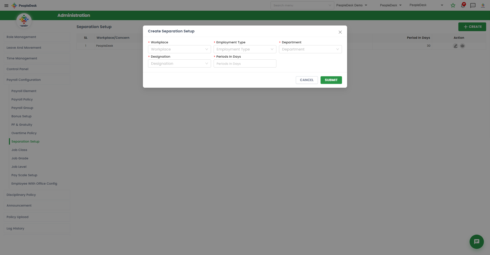

The **CREATE** button opens this modal with:
- **Workplace*** — required dropdown.
- **Employment Type*** — required dropdown.
- **Department*** — required dropdown.
- **Designation*** — required dropdown.
- **Periods In Days*** — required numeric field.
- **CANCEL** / **SUBMIT** buttons.

**Pro-tip**: Set up broader rules (Designation = All, Department = All) first, then layer more specific rules on top — the system will apply the most specific matching rule when an employee's separation is processed.

#### Job Class

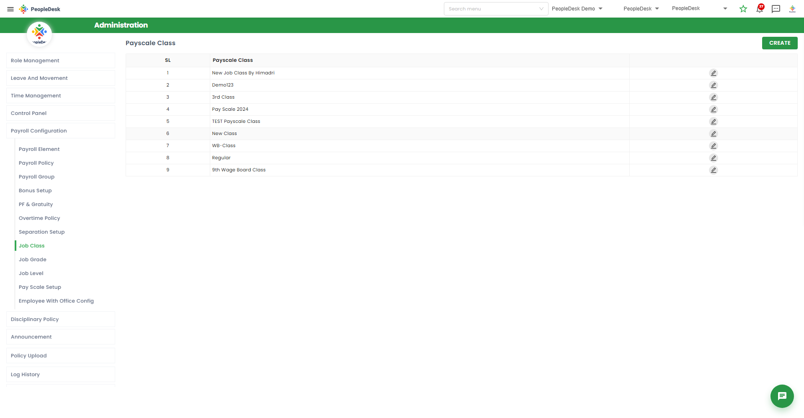

**What it does**: Lets administrators define "Payscale Classes" — the top-level grouping used to build an organization's salary structure (Payscale Class → Payscale Grade → Payscale Level → Payscale Setup). Job Class is the broadest tier in that hierarchy.

**Key fields / columns**:
- SL (serial number)
- Payscale Class (the class name, e.g. "New Job Class By Himadri", "Regular", "9th Wage Board Class")

**Buttons & actions**:
- **CREATE** (top-right) — opens the "Create Job Class" modal to add a new payscale class.
- **Edit icon** (pencil, per row) — opens the row for editing its class name.

**How to use it**:
1. Navigate to Administration > Payroll Configuration > Job Class.
2. Review the existing list of payscale classes.
3. Click **CREATE** to add a new one, or click the pencil icon on a row to rename an existing class.

**Pro-tip**: Set up Job Class before Job Grade and Job Level — each of those screens requires you to pick an existing Payscale Class first, so building the hierarchy top-down avoids empty dropdowns.

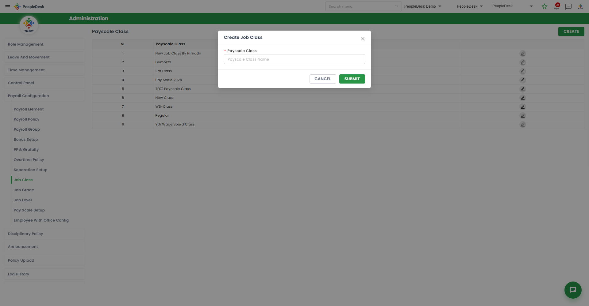

**Create form fields**:
- **Payscale Class** (required) — free-text name for the new class (placeholder: "Payscale Class Name").

Submit with **SUBMIT**, or **CANCEL** to close without saving.

---

#### Job Grade

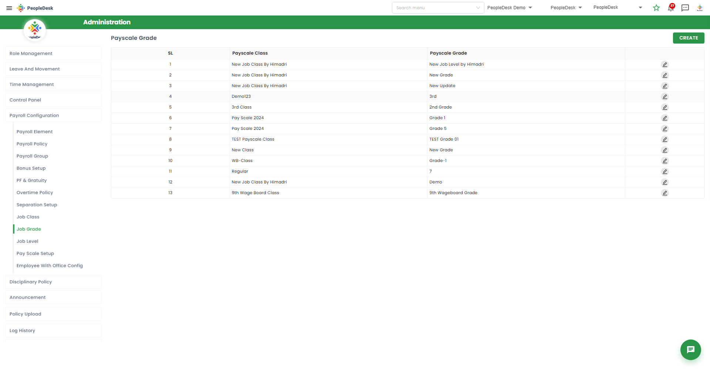

**What it does**: Defines "Payscale Grades," the second tier of the pay-structure hierarchy, each linked to a parent Payscale Class.

**Key fields / columns**:
- SL
- Payscale Class (parent class, e.g. "Demo123", "3rd Class")
- Payscale Grade (grade name, e.g. "3rd", "2nd Grade", "Grade 1")

**Buttons & actions**:
- **CREATE** (top-right) — opens the "Create Job Grade" modal.
- **Edit icon** (pencil, per row) — edits that row's class/grade assignment.

**How to use it**:
1. Navigate to Administration > Payroll Configuration > Job Grade.
2. Click **CREATE** to add a new grade under an existing class.
3. Select the parent **Payscale Class**, type the **Payscale Grade** name, then submit.
4. Use the pencil icon to correct any existing grade.

**Pro-tip**: Grade names don't need to be numeric — the demo data mixes "Grade 1," "3rd," and "Demo," so use whatever naming convention matches your company's pay bands.

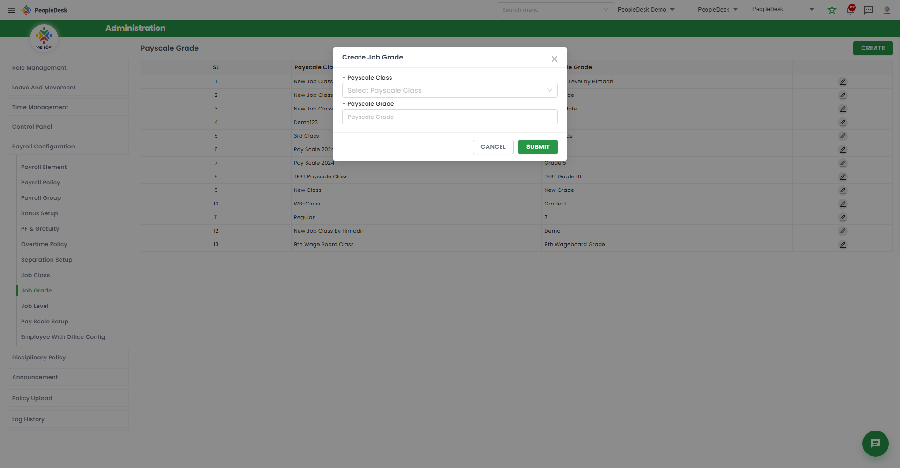

**Create form fields**:
- **Payscale Class** (required, dropdown "Select Payscale Class")
- **Payscale Grade** (required, free text)

Submit with **SUBMIT**, or **CANCEL**.

---

#### Job Level

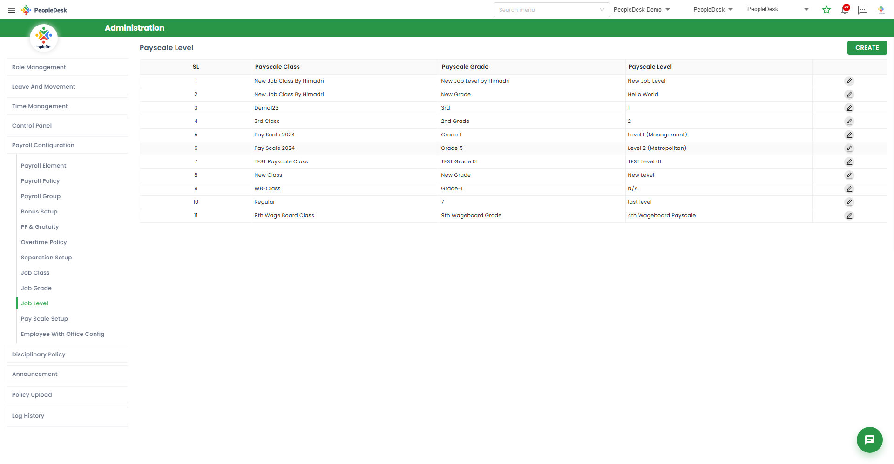

**What it does**: Defines "Payscale Levels," the third tier of the pay hierarchy, each tied to a specific Payscale Class + Payscale Grade combination.

**Key fields / columns**:
- SL
- Payscale Class
- Payscale Grade
- Payscale Level (e.g. "Level 1 (Management)," "last level," "N/A")

**Buttons & actions**:
- **CREATE** (top-right) — opens the "Create Job Level" modal.
- **Edit icon** (pencil, per row) — edits that row.

**How to use it**:
1. Navigate to Administration > Payroll Configuration > Job Level.
2. Click **CREATE**.
3. Select **Payscale Class**, then **Payscale Grade**, then type the **Payscale Level** name.
4. Submit to save.

**Pro-tip**: Because Level depends on both Class and Grade, create the Class and Grade records first — otherwise the two dropdowns in the Create form will be empty.

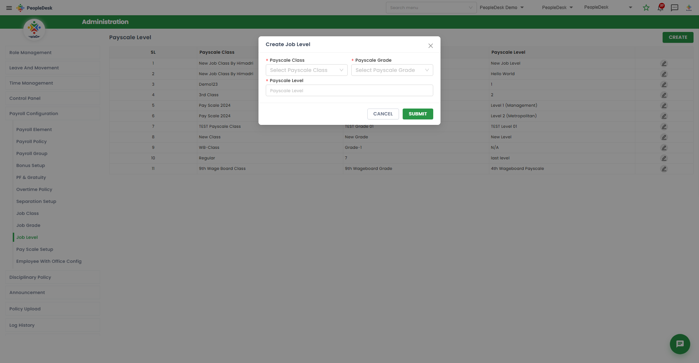

**Create form fields**:
- **Payscale Class** (required, dropdown)
- **Payscale Grade** (required, dropdown)
- **Payscale Level** (required, free text)

Submit with **SUBMIT**, or **CANCEL**.

---

#### Pay Scale Setup

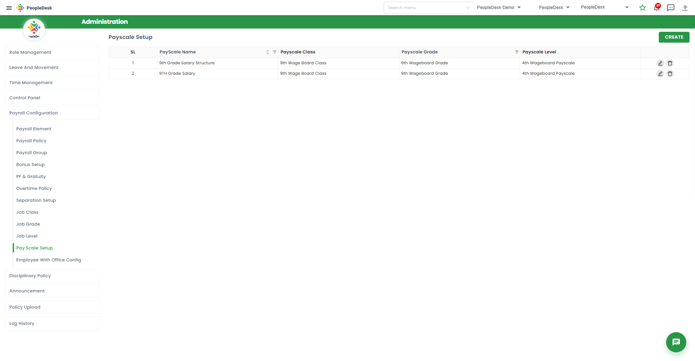

**What it does**: Assembles the final salary structure ("Payscale") by combining a Payscale Class, Grade, and Level with a Payroll Policy, payroll elements, and increment rules — this is where the actual, usable pay scale is created.

**Key fields / columns**:
- SL
- PayScale Name (sortable, filterable)
- Payscale Class (filterable)
- Payscale Grade
- Payscale Level

**Buttons & actions**:
- **CREATE** (top-right) — opens the "Create Payscale" modal.
- **Sort arrows** on the PayScale Name column header — re-order the list.
- **Filter icons** on PayScale Name and Payscale Grade columns — narrow the list to matching values.
- **Edit icon** (pencil, per row) — edit an existing payscale.
- **Delete icon** (trash, per row) — remove a payscale.

**How to use it**:
1. Navigate to Administration > Payroll Configuration > Pay Scale Setup.
2. Click **CREATE**.
3. Fill in the Payscale Name, Payroll Policy, Class, Grade, and Level.
4. Optionally attach Payroll Elements (with a "Based On" rule) via **ADD**, and configure Increment Amount / Slabs Count via **ADD**.
5. Scroll down to complete the Efficiency Bar section, then **SUBMIT**.
6. Use the trash icon to delete an obsolete payscale, or the pencil icon to update one.

**Pro-tip**: The small green **+** buttons beside the Class/Grade/Level dropdowns in the Create form let you add a brand-new class, grade, or level on the fly without leaving the payscale form.

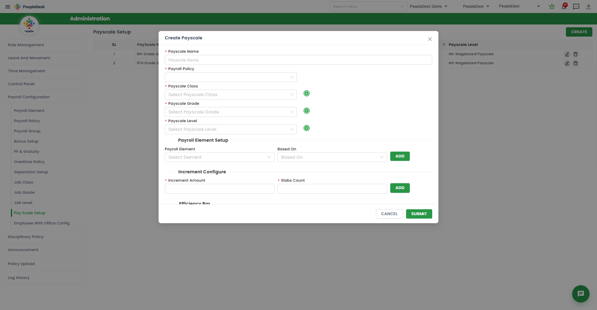

**Create form fields**:
- **Payscale Name** (required)
- **Payroll Policy** (required, dropdown)
- **Payscale Class** (required, dropdown, with quick-add "+")
- **Payscale Grade** (required, dropdown, with quick-add "+")
- **Payscale Level** (required, dropdown, with quick-add "+")
- **Payroll Element Setup**: Payroll Element (dropdown) + Based On (dropdown), added via **ADD**
- **Increment Configure**: Increment Amount (required) + Slabs Count (required), added via **ADD**
- **Efficiency Bar** section (visible on scroll)

Submit with **SUBMIT**, or **CANCEL**.

---

#### Employee With Office Config

**What it does**: Shows the master list of all employees in the system, giving admins a quick view of each employee's ID, type, login, mobile number, and active/inactive status before drilling into office-level configuration.

**Key fields / columns**:
- SL
- Employee Id
- Employee Name (with colored avatar initial)
- Type (e.g. Permanent, Casual)
- User ID (Login)
- Mobile No.
- Status (Active / Inactive badge)
- Action

**Buttons & actions**:
- **Search** box (top-right) — filters the employee list by typed text.
- **+ CREATE** (top-right) — starts a new employee/office-config entry.
- **Sort/filter icons** on Employee Name, Type, and User ID columns.
- **Edit icon** (pencil, per row, under Action) — opens that employee's office configuration.
- **Pagination controls** (bottom-right: page numbers, arrows, "25 / page" selector) — navigate the 32-employee list.

**How to use it**:
1. Navigate to Administration > Payroll Configuration > Employee With Office Config.
2. Use **Search** to locate a specific employee, or page through the list.
3. Click the pencil icon on an employee's row to configure their office assignment.
4. Click **+ CREATE** to add configuration for a new employee.

**Pro-tip**: Sort by the Status column pattern visually — Inactive rows (red badge) are easy to spot and worth auditing periodically to confirm they should remain inactive.

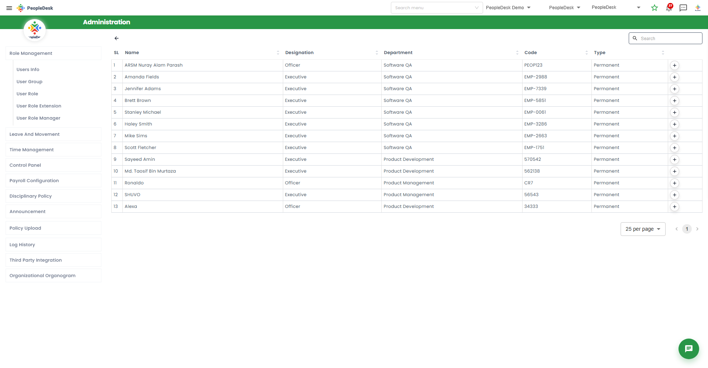

**Create screen**: Selecting Create shows a second employee-picker list with columns Name, Designation, Department, Code, and Type, plus a **+** action button per row to add that specific employee's office configuration, a **Search** box, a back arrow to return to the main list, and pagination controls.

---

#### Sandwich Leave

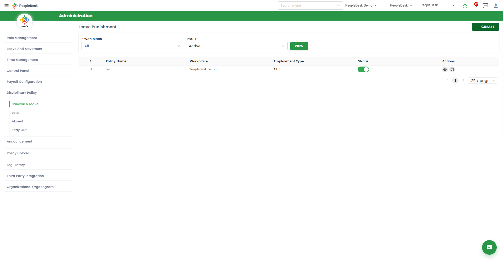

**What it does**: Configures "sandwich leave" punishment rules — policies that treat off-days/holidays falling between two leave days as leave too (so employees can't "sandwich" a holiday between two single leave days to get extra time off free).

**Key fields / columns**:
- Filters: Workplace (required dropdown), Status (dropdown, e.g. Active)
- Table: SL, Policy Name, Workplace, Employment Type, Status (toggle), Actions

**Buttons & actions**:
- **VIEW** — applies the Workplace/Status filters and reloads the table.
- **+ CREATE** (top-right) — opens the "Leave Punishment Configuration" modal.
- **Status toggle** (per row) — enables/disables that policy.
- **Eye icon** (per row, under Actions) — view the policy's details.
- **Trash icon** (per row, under Actions) — delete the policy.
- **Pagination** ("25 / page" and page arrows).

**How to use it**:
1. Navigate to Administration > Disciplinary Policy > Sandwich Leave.
2. Select a **Workplace** and **Status**, then click **VIEW** to filter the list.
3. Click **+ CREATE** to define a new sandwich-leave punishment policy.
4. Toggle **Status** to activate/deactivate a policy without deleting it.
5. Use the eye icon to review a policy or the trash icon to remove it.

**Pro-tip**: Workplace is a required filter — leave it on "All" if you want to see policies across every workplace at once.

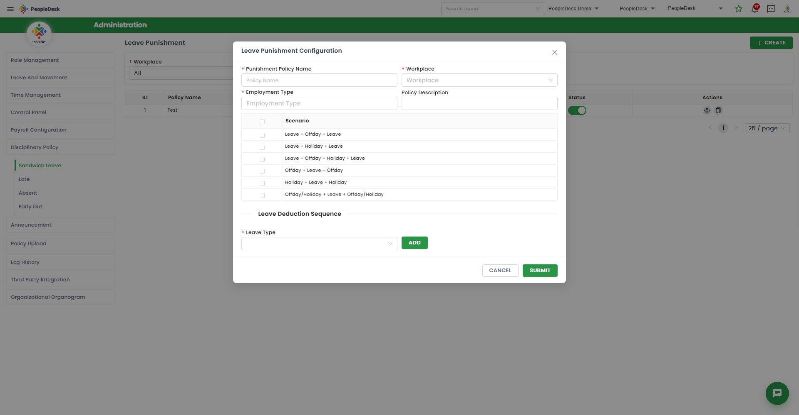

**Create form fields**:
- **Punishment Policy Name** (required)
- **Workplace** (required, dropdown)
- **Employment Type** (required)
- **Policy Description**
- **Scenario** — checklist of sandwich patterns to penalize: Leave + Offday + Leave, Leave + Holiday + Leave, Leave + Offday + Holiday + Leave, Offday + Leave + Offday, Holiday + Leave + Holiday, Offday/Holiday + Leave + Offday/Holiday (with a "select all" checkbox)
- **Leave Deduction Sequence**: Leave Type (dropdown) added via **ADD**

Submit with **SUBMIT**, or **CANCEL**.

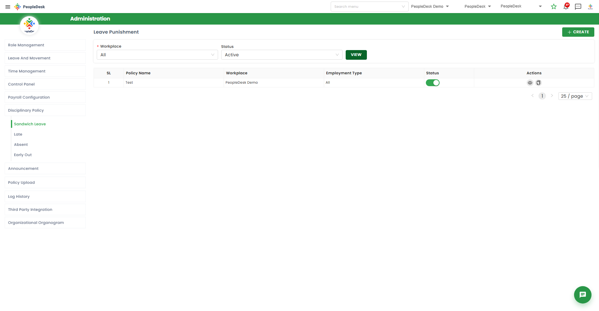

**Show screen**: This screenshot is visually identical to the main Sandwich Leave list — same "Test" policy row, same Workplace/Status filters. It appears clicking the eye/view action on this page simply re-displays the same policy list rather than opening a distinct detail view.

---

#### Late

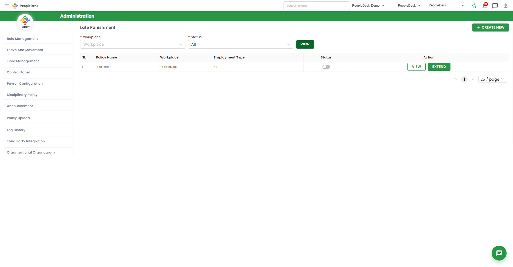

**What it does**: Configures punishment policies for employees who clock in late, defining how lateness is calculated and what penalty applies.

**Key fields / columns**:
- Filters: workplace (required dropdown), status (dropdown, e.g. All)
- Table: SL, Policy Name, Workplace, Employment Type, Status (toggle), Action

**Buttons & actions**:
- **VIEW** — applies filters and refreshes the list.
- **+ CREATE NEW** (top-right) — opens the Late Punishment Configuration page.
- **Status toggle** (per row) — enable/disable the policy.
- **VIEW** button (per row, under Action) — view that policy's configuration.
- **EXTEND** button (per row, under Action) — extend/apply the policy further (e.g. to additional scopes).
- **Pagination** ("25 / page").

**How to use it**:
1. Navigate to Administration > Disciplinary Policy > Late.
2. Set workplace/status filters and click **VIEW** to load matching policies.
3. Click **+ CREATE NEW** to define a new late-punishment policy.
4. Use the row-level **VIEW**/**EXTEND** buttons to inspect or expand an existing policy's coverage.

**Pro-tip**: Use **EXTEND** rather than creating a duplicate policy when you just need to apply an existing late policy to more departments or designations.

**Create form fields** (Late Punishment Configuration page):
- **Punishment Policy Name** (required)
- **Workplace** (required, dropdown)
- **Employment Type** (required, dropdown)
- **Designation** (required, dropdown)
- **Department** (dropdown)
- **Policy Description**
- **Late Calculation Type** (required, dropdown)
- **Late Time Calculated By** (required, dropdown)
- **Minimum Late Time (Minutes)** (required)
- **Maximum Late Time (Minutes)** (required)
- **Punishment Type** (dropdown), added via **ADD**

Save with **SAVE** (top-right), or use the back arrow to cancel.

---

#### Absent

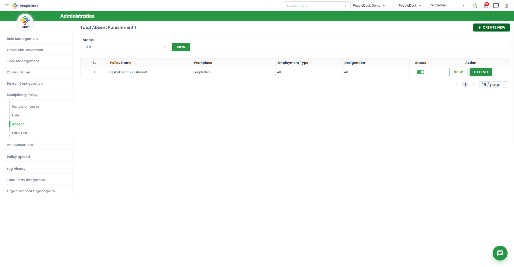

**What it does**: Configures punishment policies for unexcused absences, including whether "sandwich absence" logic applies and how much salary/amount is deducted.

**Key fields / columns**:
- Filter: Status (dropdown, e.g. All)
- Table: SL, Policy Name, Workplace, Employment Type, Designation, Status (toggle), Action

**Buttons & actions**:
- **VIEW** — applies the Status filter.
- **+ CREATE NEW** (top-right) — opens the Absent Punishment Configuration page.
- **Status toggle** (per row).
- **VIEW** button (per row) — view the policy.
- **EXTEND** button (per row) — extend the policy's scope.
- **Pagination** ("25 / page").

**How to use it**:
1. Navigate to Administration > Disciplinary Policy > Absent.
2. Filter by Status and click **VIEW**.
3. Click **+ CREATE NEW** to add a new absent-punishment policy.
4. Use **VIEW**/**EXTEND** per row to inspect or broaden coverage.

**Pro-tip**: Set "Sandwich Absent Applicable?" to Yes only if your organization wants surrounding off-days/holidays counted as absent too — otherwise leave it at "No" (the default) to penalize only the actual absent day.

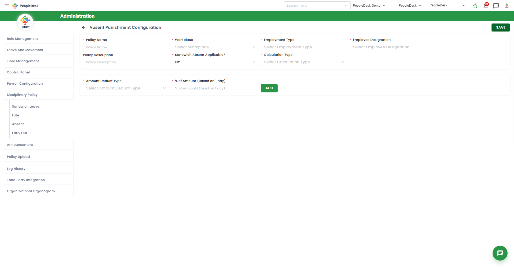

**Create form fields** (Absent Punishment Configuration page):
- **Policy Name** (required)
- **Workplace** (required, dropdown)
- **Employment Type** (required, dropdown)
- **Employee Designation** (required, dropdown)
- **Policy Description**
- **Sandwich Absent Applicable?** (required, dropdown, default "No")
- **Calculation Type** (required, dropdown)
- **Amount Deduct Type** (required, dropdown)
- **% of Amount (Based on 1 day)** (required), added via **ADD**

Save with **SAVE**, or use the back arrow to cancel.

---

#### Early Out

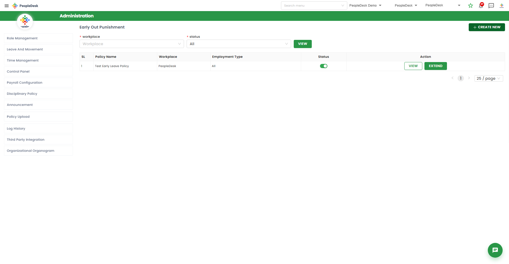

**What it does**: Configures punishment policies for employees who leave before their scheduled shift end time.

**Key fields / columns**:
- Filters: workplace (required dropdown), status (dropdown)
- Table: SL, Policy Name, Workplace, Employment Type, Status (toggle), Action

**Buttons & actions**:
- **VIEW** — applies filters.
- **+ CREATE NEW** (top-right) — opens the Early Out Punishment Configuration page.
- **Status toggle** (per row).
- **VIEW** button (per row) — view the policy.
- **EXTEND** button (per row) — extend the policy.
- **Pagination** ("25 / page").

**How to use it**:
1. Navigate to Administration > Disciplinary Policy > Early Out.
2. Filter by workplace/status and click **VIEW**.
3. Click **+ CREATE NEW** to add a new early-leave policy.
4. Use **VIEW**/**EXTEND** per row for existing policies.

**Pro-tip**: This screen mirrors the Late policy layout closely — if you've configured Late punishment already, Early Out setup will feel immediately familiar.

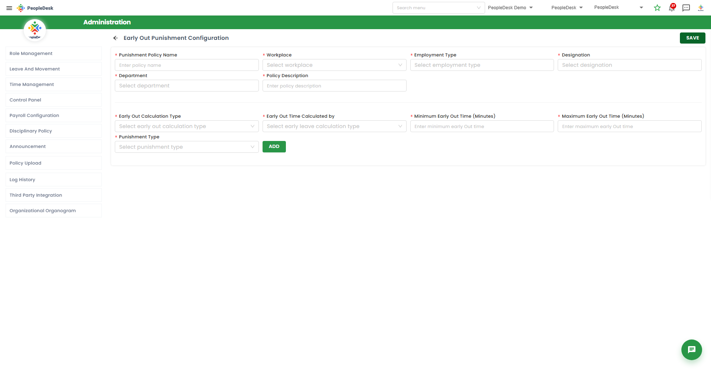

**Create form fields** (Early Out Punishment Configuration page):
- **Punishment Policy Name** (required)
- **Workplace** (required, dropdown)
- **Employment Type** (required, dropdown)
- **Designation** (required, dropdown)
- **Department** (dropdown)
- **Policy Description**
- **Early Out Calculation Type** (required, dropdown)
- **Early Out Time Calculated by** (required, dropdown)
- **Minimum Early Out Time (Minutes)** (required)
- **Maximum Early Out Time (Minutes)** (required)
- **Punishment Type** (dropdown), added via **ADD**

Save with **SAVE**, or use the back arrow to cancel.

---

#### Announcement

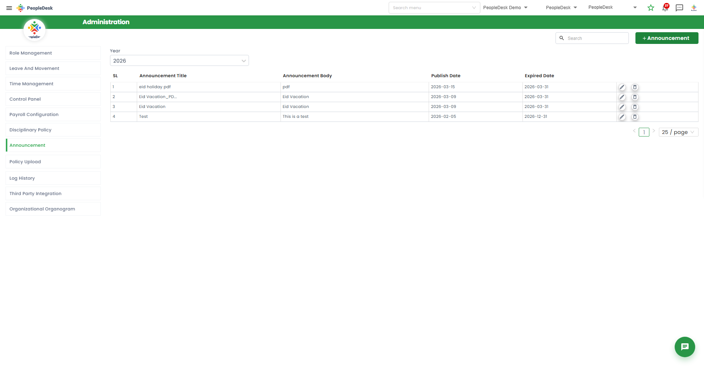

**What it does**: Publishes company-wide or targeted announcements (news, notices, holiday PDFs, etc.) that employees see, each with a publish date and an expiry date.

**Key fields / columns**:
- Filter: Year (dropdown, e.g. 2026)
- Table: SL, Announcement Title, Announcement Body, Publish Date, Expired Date
- Edit and Delete icons per row

**Buttons & actions**:
- **Search** box (top-right) — filters announcements by text.
- **+ Announcement** (top-right) — opens the Create Announcement page.
- **Year** dropdown — switches the list to announcements from a different year.
- **Edit icon** (pencil, per row) — edit that announcement.
- **Delete icon** (trash, per row) — remove that announcement.
- **Pagination** ("25 / page").

**How to use it**:
1. Navigate to Administration > Announcement.
2. Pick a **Year** to browse past or upcoming announcements.
3. Click **+ Announcement** to publish a new one.
4. Use the pencil/trash icons to edit or delete existing announcements.

**Pro-tip**: Set the **Expired Date** deliberately — announcements remain visible to employees only until this date, so use it to auto-retire time-sensitive notices like holiday schedules.

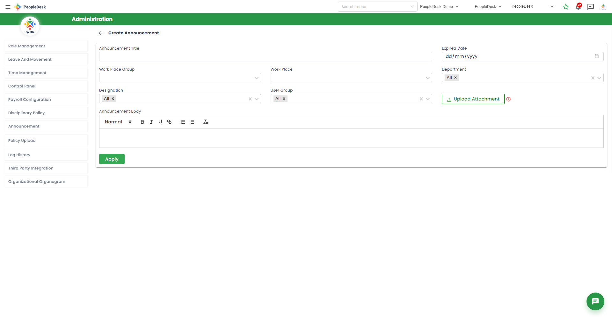

**Create form fields**:
- **Announcement Title**
- **Expired Date** (date picker)
- **Work Place Group** (dropdown)
- **Work Place** (dropdown)
- **Department** (multi-select, defaults to "All")
- **Designation** (multi-select, defaults to "All")
- **User Group** (multi-select, defaults to "All")
- **Upload Attachment** button (with an info icon explaining allowed formats)
- **Announcement Body** — rich-text editor (paragraph style, bold/italic/underline, link, ordered/unordered list, clear formatting)

Submit with **Apply**.

---

#### Policy Upload

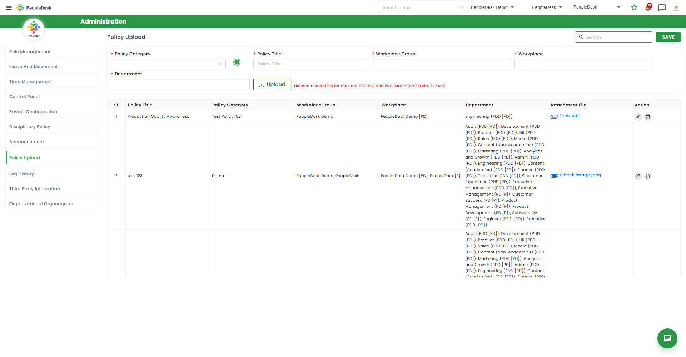

**What it does**: Lets administrators upload official company policy documents (PDFs, images) and scope them to specific policy categories, workplace groups, workplaces, and departments so the right documents are visible to the right teams.

**Key fields / columns**:
- Form: Policy Category (dropdown, with quick-add "+"), Policy Title, Workplace Group, Workplace, Department
- Table: SL, Policy Title, Policy Category, WorkplaceGroup, Workplace, Department, Attachment File, Action

**Buttons & actions**:
- **Search** box (top-right) — searches uploaded policies.
- **SAVE** (top-right) — saves changes.
- **Upload** button — uploads the selected file after the form is filled in (recommended formats: PDF, JPG, PNG; max size 2 MB).
- **+ (green circle)** beside Policy Category — quickly add a new policy category.
- **Attachment File link** (per row, e.g. "2mb.pdf", "Check image.jpeg") — opens/downloads the uploaded file.
- **Edit icon** (pencil, per row) — edit that policy entry.
- **Delete icon** (trash, per row) — remove that policy entry.

**How to use it**:
1. Navigate to Administration > Policy Upload.
2. Select or create a **Policy Category**, enter the **Policy Title**, and choose the **Workplace Group**, **Workplace**, and **Department** scope.
3. Click **Upload** and choose the file from your computer (PDF/JPG/PNG, up to 2 MB).
4. Review uploaded policies in the table below; click the attachment link to open a file, or use the pencil/trash icons to edit/remove an entry.

**Pro-tip**: Scope Department broadly (multiple departments can show in one row, as seen in the "test 123" example) when a policy applies company-wide, rather than uploading the same file once per department.

---

#### Shift Management Log

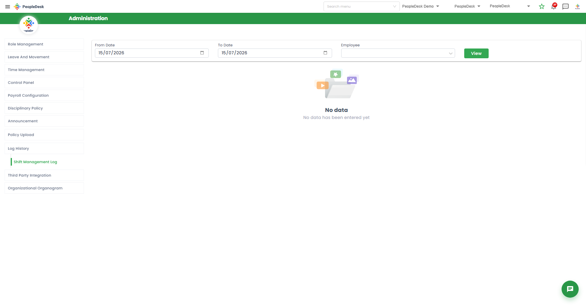

**What it does**: Provides an audit log of shift-management changes for a specific employee over a date range — useful for tracing who changed an employee's shift and when.

**Key fields / columns**:
- **From Date** (date picker, defaults to today)
- **To Date** (date picker, defaults to today)
- **Employee** (dropdown, required to see results)

**Buttons & actions**:
- **View** — loads the shift-change log for the selected employee and date range.

**How to use it**:
1. Navigate to Administration > Log History > Shift Management Log.
2. Set the **From Date** and **To Date** range.
3. Select an **Employee** from the dropdown.
4. Click **View** to display that employee's shift-management log entries.

**Pro-tip**: If you click **View** without picking an Employee, the page shows a validation error ("Employee is required") — always select an employee first, since this log is per-person, not company-wide.

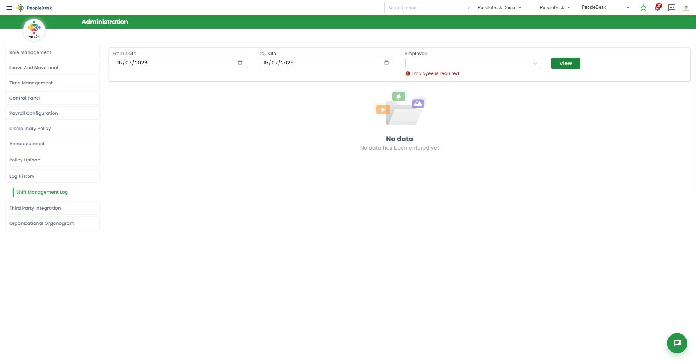

**Show screen**: This is the result of clicking **View** without selecting an Employee. The page displays a red validation message "Employee is required" beneath the Employee field, and the results area still shows "No data / No data has been entered yet" with a placeholder illustration — confirming this is a required-filter validation state, not a populated log view.

---

#### Hire Desk

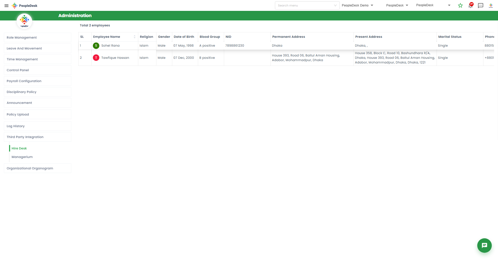

**What it does**: Displays employee records that have been synced from or are available to the "Hire Desk" third-party integration (a recruitment/onboarding tool), showing personal details captured during hiring.

**Key fields / columns**:
- SL
- Employee Name
- Religion
- Gender
- Date of Birth
- Blood Group
- NID (National ID number)
- Permanent Address
- Present Address
- Marital Status
- Phone (partially visible, truncated by table width)

**Buttons & actions**: No action buttons are visible on this page — it is a read-only list showing "Total 2 employees" synced via the Hire Desk integration.

**How to use it**:
1. Navigate to Administration > Third Party Integration > Hire Desk.
2. Review the list of employees whose data has come through the Hire Desk integration, including personal and contact details.

**Pro-tip**: Use this page to spot-check that data flowing in from your recruitment system (name, NID, addresses) matches what's expected before those employees are fully onboarded into payroll.

---

#### Managerium

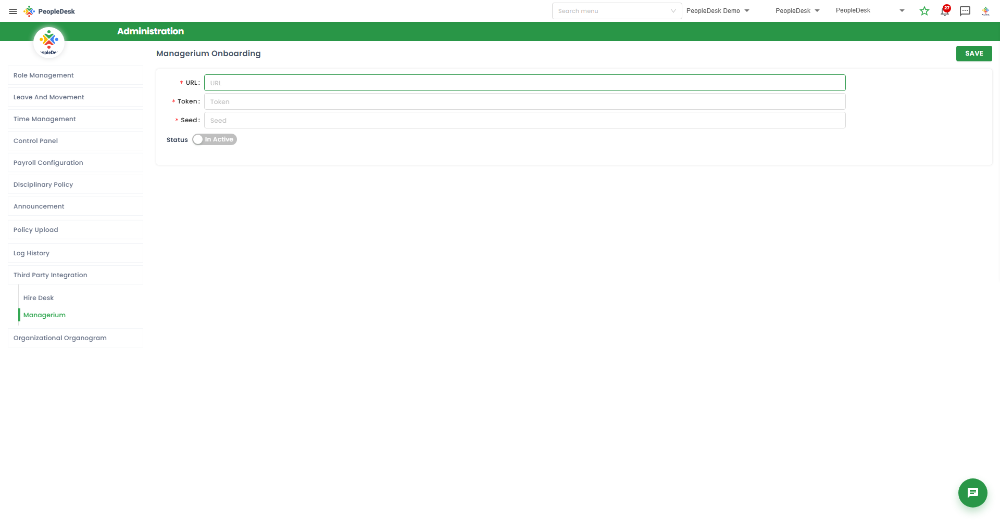

**What it does**: Configures the connection settings for the "Managerium" third-party integration, allowing PeopleDesk to exchange data with that external system.

**Key fields / columns**:
- **URL** (required text field)
- **Token** (required text field)
- **Seed** (required text field)
- **Status** toggle (In Active / Active)

**Buttons & actions**:
- **SAVE** (top-right) — saves the URL/Token/Seed credentials.
- **Status toggle** — switches the integration between Active and In Active.

**How to use it**:
1. Navigate to Administration > Third Party Integration > Managerium.
2. Enter the integration **URL**, **Token**, and **Seed** provided by Managerium.
3. Toggle **Status** to Active once configured.
4. Click **SAVE** to apply.

**Pro-tip**: Keep the Status toggled to "In Active" until you've fully verified the URL/Token/Seed values — an incorrect token saved while Active could cause failed sync attempts against the external service.

---

#### Company Organogram

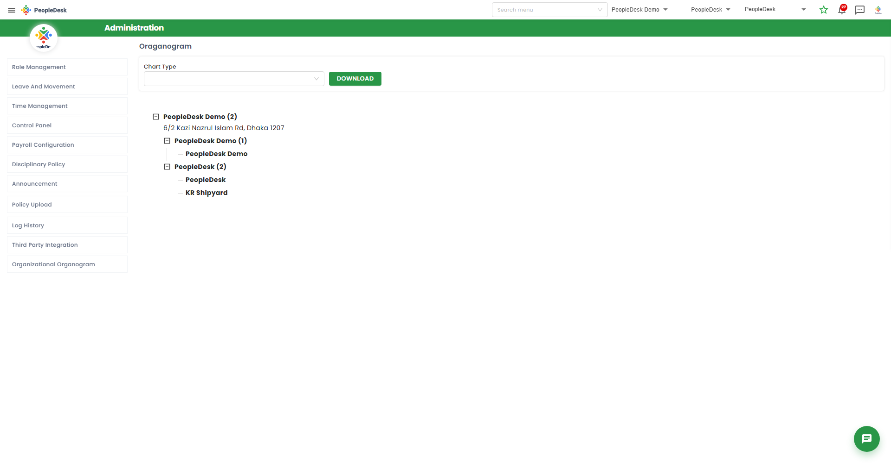

**What it does**: Displays the company's organizational chart ("organogram," a diagram of reporting/company structure) as an expandable tree, showing workplace groups and workplaces nested under the top-level company.

**Key fields / columns**:
- Tree nodes showing entity name and child count in parentheses, e.g. "PeopleDesk Demo (2)", with address shown under the top node (e.g. "6/2 Kazi Nazrul Islam Rd, Dhaka 1207")

**Buttons & actions**:
- **Chart Type** dropdown — choose the format/style of chart to display.
- **DOWNLOAD** — exports the organogram (e.g. as an image or document).
- **Expand/collapse icons** (− / +) on each node — show or hide that branch's children.

**How to use it**:
1. Navigate to Administration > Organizational Organogram > Company Organogram.
2. Select a **Chart Type** if you want a specific export/display format.
3. Click the −/+ icons to expand or collapse branches of the company tree.
4. Click **DOWNLOAD** to save the chart.

**Pro-tip**: Collapse branches you don't need using the − icon to keep large, multi-workplace organograms readable on screen before downloading.

---

#### Role-Based Organogram

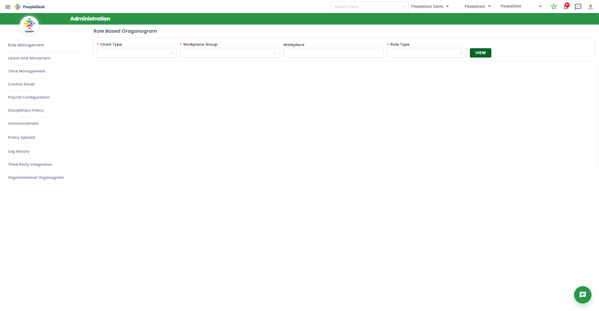

**What it does**: Generates an organizational chart filtered by role type, letting you visualize reporting structure based on job roles rather than raw company hierarchy.

**Key fields / columns**:
- **Chart Type** (required dropdown)
- **Workplace Group** (required dropdown)
- **Workplace** (text/dropdown field)
- **Role Type** (required dropdown)

**Buttons & actions**:
- **VIEW** — generates and displays the role-based organogram using the selected filters.

**How to use it**:
1. Navigate to Administration > Organizational Organogram > Role-Based Organogram.
2. Select a **Chart Type**, **Workplace Group**, **Workplace**, and **Role Type**.
3. Click **VIEW** to render the chart.

**Pro-tip**: All four filters (Chart Type, Workplace Group, Role Type, and effectively Workplace) must be filled in — submitting with any left blank returns "required" validation errors instead of a chart, as shown in the Show screenshot below.

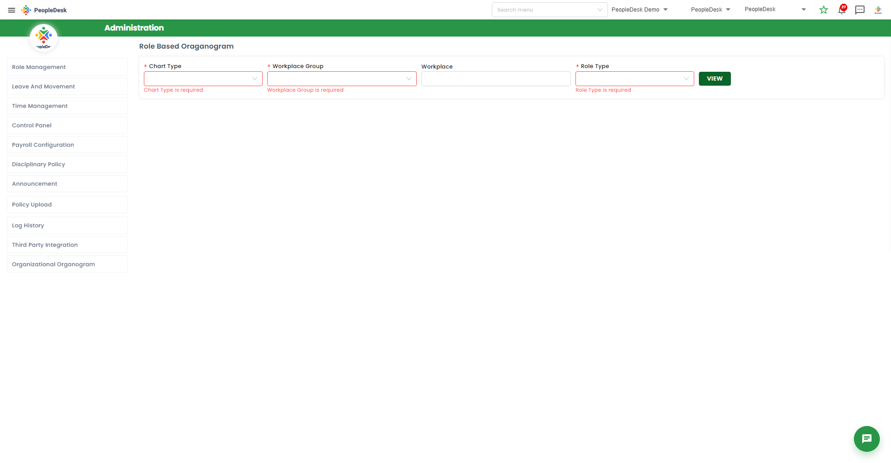

**Show screen**: This is the result of clicking **VIEW** with no filters selected. It is not a chart — it's a validation state showing red-outlined fields and error text: "Chart Type is required," "Workplace Group is required," and "Role Type is required."

---

#### Hierarchical Organogram

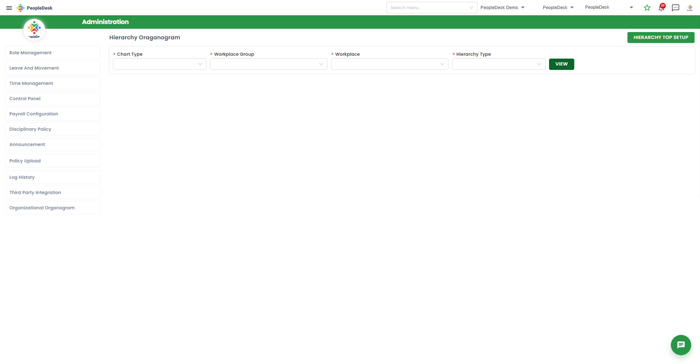

**What it does**: Generates an organizational chart based on a defined reporting hierarchy (e.g. management levels), separate from the role-based or plain company organogram views.

**Key fields / columns**:
- **Chart Type** (required dropdown)
- **Workplace Group** (required dropdown)
- **Workplace** (required dropdown)
- **Hierarchy Type** (required dropdown)

**Buttons & actions**:
- **HIERARCHY TOP SETUP** (top-right) — configures the top-level node(s) of the hierarchy before charts can be generated.
- **VIEW** — generates and displays the hierarchical organogram using the selected filters.

**How to use it**:
1. Navigate to Administration > Organizational Organogram > Hierarchical Organogram.
2. If this is the first time setting up hierarchy, click **HIERARCHY TOP SETUP** to define the top of the structure.
3. Select **Chart Type**, **Workplace Group**, **Workplace**, and **Hierarchy Type**.
4. Click **VIEW** to render the chart.

**Pro-tip**: Configure **HIERARCHY TOP SETUP** first — since Workplace and Hierarchy Type are both required and the chart depends on a defined top node, skipping this step is the most common reason the chart fails to render.

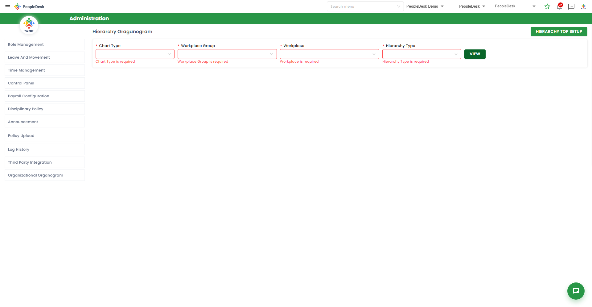

**Show screen**: This is the result of clicking **VIEW** with no filters selected — a validation state, not a chart. It shows red-outlined fields and error text: "Chart Type is required," "Workplace Group is required," "Workplace is required," and "Hierarchy Type is required."

## 6. Approval Module

Where supervisors and approvers review and act on requests submitted elsewhere in the system (leave, movement, loans, expenses, and more).

#### Approval

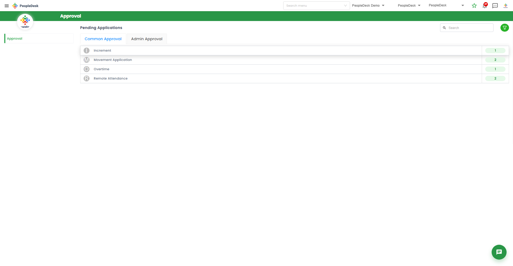

**What it does**: A central inbox listing all pending applications (increments, movement requests, overtime, remote attendance, etc.) that require the logged-in user's approval.

**Key fields / columns**:
- Pending Applications list with category name (Increment, Movement Application, Overtime, Remote Attendance) and a count badge showing how many are pending for each.

**Buttons & actions**:
- "Common Approval" / "Admin Approval" tabs switch between general staff approvals and admin-level approvals.
- Search box to find a specific application type.
- Green circular filter (funnel) icon to filter the pending list.
- Clicking any category row (e.g., "Movement Application") opens the detailed list of pending items in that category for approval/rejection.

**How to use it**: 1. Open the Approval module from the main menu. 2. Choose the "Common Approval" or "Admin Approval" tab depending on what you're authorized to approve. 3. Check the badge counts to see which categories have pending items. 4. Click a category to open and process (approve/reject) the individual requests. 5. Use Search or the filter icon if the list grows long.

**Pro-tip**: Check the "Admin Approval" tab as well as "Common Approval" — some request types (like admin-level changes) only appear under the Admin tab and are easy to miss otherwise.

---

## 7. Employee Self Service Module

The employee-facing side of the system — where staff apply for leave, loans, documents, training, and more themselves, and check their own attendance and payslips.

#### Dashboard

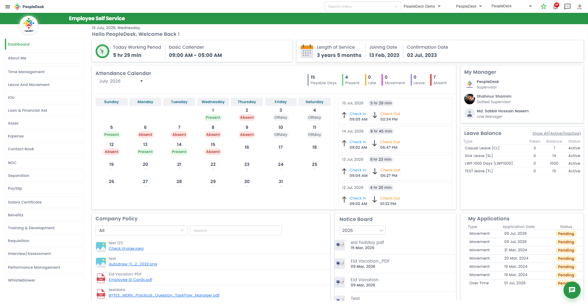

**What it does**: This is your personal landing page in Employee Self Service. It gives you a snapshot of today's attendance, this month's attendance calendar, your leave balance, your reporting line, company notices/policies, and the status of applications you've submitted.

**Key fields / columns**:
- Today Working Period, basic Calender (shift), Length of Service, Joining Date, Confirmation Date
- Attendance Calendar (month selector) with day-by-day Present/Absent/Offday tags and a summary strip: Payable Days, Present, Late, Movement, Leave, Absent
- Check In / Check Out log with worked hours per day
- My Manager card: Supervisor, Dotted Supervisor, Line Manager
- Leave Balance table: Type, Taken, Balance, Status
- Company Policy list (downloadable files)
- Notice Board list (by year)
- My Applications table: Type, Application Date, Status

**Buttons & actions**:
- **Month dropdown** on the Attendance Calendar - switch the calendar to a different month.
- **Show All (Active/Inactive)** link on the Leave Balance card - expands the list to include inactive leave types.
- **All / Search** controls on Company Policy - filter policy documents by category or keyword.
- **Year dropdown** on Notice Board - filter notices by year.
- File links (e.g. "Check image.jpeg", "Employee ID Cards.pdf") - open/download the attached document.
- **Chat bubble icon** (bottom right) - opens the messaging/support widget.

**How to use it**: 1. Log in to see your dashboard automatically. 2. Check the Attendance Calendar to confirm your recent check-ins were recorded correctly. 3. Glance at Leave Balance before planning time off. 4. Scroll to My Applications to see the live status of anything you've submitted (leave, movement, overtime, etc.). 5. Open Notice Board or Company Policy for announcements and reference documents.

**Pro-tip**: Use the My Applications panel as your one-stop status tracker instead of revisiting each individual request page - it lists every pending item across modules in one place.

#### About Me

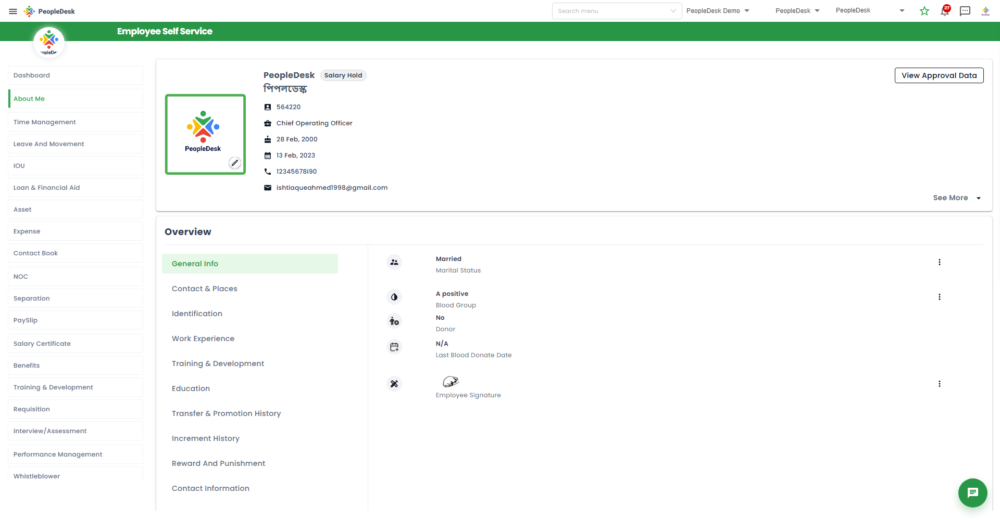

**What it does**: This page is your personal profile - a read-mostly view of the information HR holds about you, organized into tabs so you can drill into specific categories of your record.

**Key fields / columns**:
- Header card: Name, Salary Hold tag, Employee ID, Designation, Date of Birth, Joining Date, Phone, Email
- Overview tabs: General Info, Contact & Places, Identification, Work Experience, Training & Development, Education, Transfer & Promotion History, Increment History, Reward And Punishment, Contact Information
- General Info detail rows: Marital Status, Blood Group, Donor, Last Blood Donate Date, Employee Signature

**Buttons & actions**:
- **View Approval Data** (top right) - shows the approval/change-history behind your profile data.
- **Pencil/edit icon** on the profile photo - upload or change your photo.
- **See More** (bottom of header card) - expands the header card to show additional identity fields.
- **Left-hand tab list** (General Info, Contact & Places, Identification, etc.) - switches the detail panel to that category.
- **Three-dot menu icon** next to each detail row (Marital Status, Blood Group, etc.) - row-level options such as requesting an update to that field.

**How to use it**: 1. Open About Me from the sidebar. 2. Click through the Overview tabs on the left to review each section of your record (Education, Work Experience, etc.). 3. Use the three-dot menu on a field if you need to request a correction. 4. Use View Approval Data to confirm whether a recent change to your profile has been approved.

**Pro-tip**: If any personal detail here is wrong (blood group, contact info, etc.), request the correction from this page rather than waiting for your next HR review - most fields route to your supervisor/HR for approval.

#### Attendance Adjust Req.

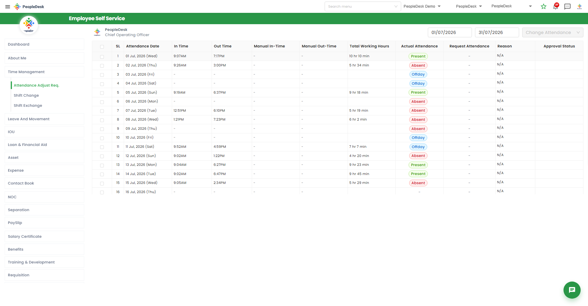

**What it does**: Shows your daily attendance log for a selected date range so you can review your recorded In/Out times and, when needed, request a correction.

**Key fields / columns**: SL, Attendance Date, In Time, Out Time, Manual In-Time, Manual Out-Time, Total Working Hours, Actual Attendance (Present/Absent/Offday), Request Attendance, Reason, Approval Status.

**Buttons & actions**:
- **Date range pickers** (top right, e.g. 01/07/2026 - 31/07/2026) - choose the period you want to review.
- **Change Attendance** dropdown (top right) - opens the request flow to submit a correction for a selected day (select the checkbox next to the date first).
- **Row checkboxes** - select one or more attendance dates to include in a change request.

**How to use it**: 1. Set the From/To dates to the period containing the day you need to fix. 2. Tick the checkbox next to the date(s) with the wrong In/Out time. 3. Open the Change Attendance dropdown and submit your correction with a reason. 4. Track the Approval Status column until it shows Approved.

**Pro-tip**: Submit attendance adjustment requests as soon as you notice a missed punch - the sooner you flag it, the faster your supervisor can approve it before payroll processing.

#### Shift Change

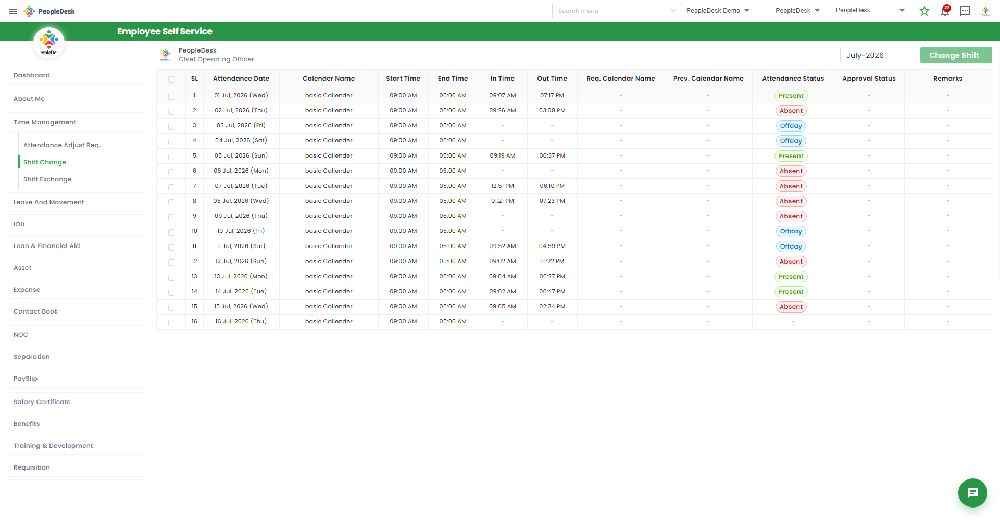

**What it does**: Shows your assigned working calendar (shift) day by day for a selected month, and is where you request a change to your shift/calendar for specific dates.

**Key fields / columns**: SL, Attendance Date, Calender Name, Start Time, End Time, In Time, Out Time, Req. Calendar Name, Prev. Calendar Name, Attendance Status, Approval Status, Remarks.

**Buttons & actions**:
- **Month selector** (e.g. "July-2026", top right) - switch to the month you want to review or change.
- **Change Shift** button (top right) - opens the request form to assign a different calendar to selected date(s).
- **Row checkboxes** - select the day(s) you want to request a shift change for before clicking Change Shift.

**How to use it**: 1. Pick the month you need to adjust. 2. Tick the checkbox(es) for the affected day(s). 3. Click Change Shift and choose the new calendar/shift. 4. Watch the Approval Status column for the outcome.

**Pro-tip**: Check the Req. Calendar Name and Prev. Calendar Name columns after submitting - they let you confirm exactly what change was requested versus your original shift.

#### Shift Exchange

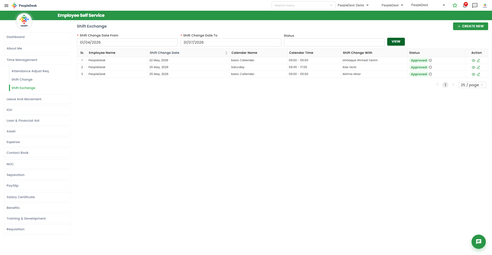

**What it does**: Lets you swap your shift/calendar with a colleague for a specific date - this page lists your past and pending shift exchange requests.

**Key fields / columns**: SL, Employee Name, Shift Change Date, Calendar Name, Calendar Time, Shift Change With, Status, Action.

**Buttons & actions**:
- **Shift Change Date From / To** filters plus **Status** dropdown and **VIEW** button - narrow the list to a date range and/or status.
- **+ CREATE NEW** (top right) - opens the Shift Exchange Request form (see below).
- **Eye icon** in Action column - view the details of that exchange request.
- **Pencil icon** in Action column - edit a request (available while it's still editable/pending).
- **Page size selector** ("25 / page") and pagination arrows - control how many rows are shown.

**How to use it**: 1. Click + CREATE NEW to start a request. 2. Use the date/status filters and VIEW to check the status of requests you've already submitted. 3. Use the eye or pencil icons to review or edit an existing request.

**Create form fields**: Employee (pre-filled, read-only), Shift Change Date, Shift Change With (searchable dropdown, minimum 2 characters), read-only info panel showing Designation, Department, Calender Name and Calender Time, a Remarks box with an attachment-upload button, and a "List of Shift Exchangeable Employee" search panel (columns: SL, Employee Code, Employee Name, Designation, Calendar Name, Calendar) that you can search to find a colleague to swap with. A **CREATE** button (top right) submits the request; the back arrow returns to the list.

**Pro-tip**: Search the "List of Shift Exchangeable Employee" panel first to confirm your intended colleague is actually eligible to swap before filling in the rest of the form - it will show "No Data Found" if nobody matches your search.

#### Leave Application

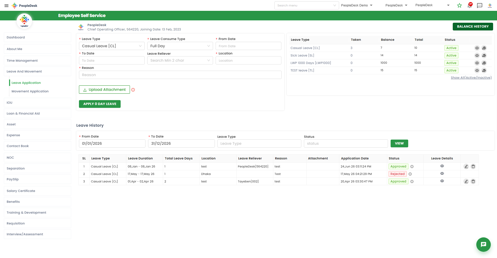

**What it does**: This is where you apply for leave and track the status of every leave request you've made, alongside a live summary of your leave balances by type.

**Key fields / columns**:
- Application form: Leave Type, Leave Consume Type (e.g. Full Day), From Date, To Date, Leave Reliever (searchable), Location, Reason, Upload Attachment
- Leave Balance panel: Leave Type, Taken, Balance, Total, Status
- Leave History filters: From Date, To Date, Leave Type, Status
- Leave History table: SL, Leave Type, Leave Duration, Total Leave Days, Location, Leave Reliever, Reason, Attachment, Application Date, Status, Leave Details

**Buttons & actions**:
- **BALANCE HISTORY** (top right) - view how your leave balance has changed over time.
- **Upload Attachment** - attach supporting documents (e.g. a medical certificate) to your application.
- **APPLY [n] DAY LEAVE** (dynamic button label showing the calculated day count) - submits the leave request.
- **VIEW** (Leave History section) - applies the From/To Date, Leave Type and Status filters to the history table.
- **Eye icon** (Leave Details column) - view full details of a submitted leave.
- **Pencil / trash icons** - edit or delete a leave request (only available on requests that are still editable, e.g. Pending).
- **Eye / balance-history icons** next to each row in the Leave Balance panel - inspect that leave type's rules or history.

**How to use it**: 1. Choose the Leave Type and Leave Consume Type. 2. Set From Date and To Date - the Apply button updates to show the computed number of days. 3. Add a Leave Reliever, Location and Reason, and attach any supporting document. 4. Click Apply to submit. 5. Track approval in the Leave History table below, and check remaining days in the Leave Balance panel before applying again.

**Pro-tip**: Check the Leave Balance panel first - applying for more days than your Balance allows will still submit, but it's worth confirming you have enough days left to avoid a rejection.

#### Movement Application

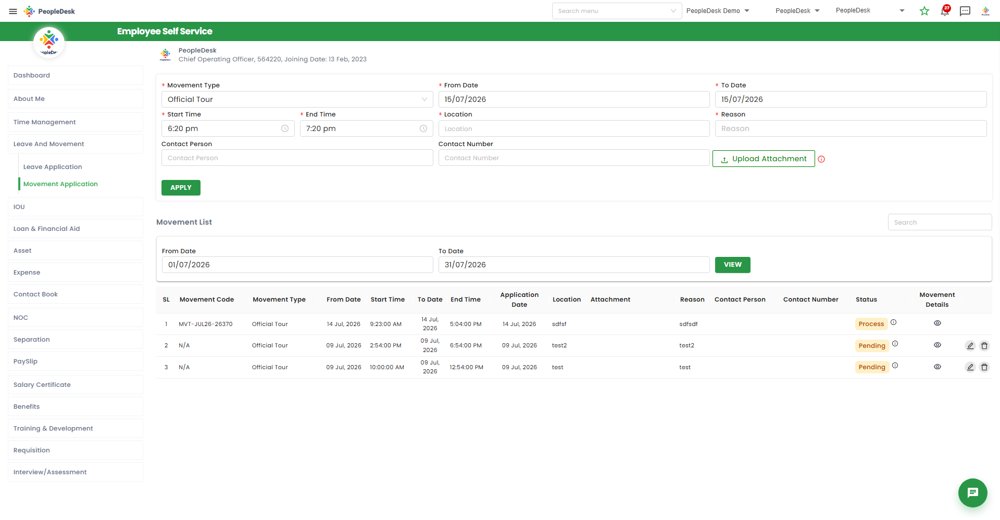

**What it does**: Use this page to request approval to be away from your desk/workplace during working hours (for example an official tour or personal errand), and to see the status of all your movement requests.

**Key fields / columns**:
- Application form: Movement Type (e.g. Official Tour), From Date, To Date, Start Time, End Time, Location, Reason, Contact Person, Contact Number, Upload Attachment
- Movement List filters: From Date, To Date
- Movement List table: SL, Movement Code, Movement Type, From Date, Start Time, To Date, End Time, Application Date, Location, Attachment, Reason, Contact Person, Contact Number, Status, Movement Details

**Buttons & actions**:
- **APPLY** - submits the movement request entered in the form.
- **Upload Attachment** - attach any supporting file to the request.
- **Search box** (Movement List) - quickly filter the list by keyword.
- **VIEW** - applies the From/To Date filter to the Movement List.
- **Eye icon** (Movement Details) - view full details of a movement request.
- **Pencil / trash icons** - edit or delete a request while it's still Pending.

**How to use it**: 1. Select the Movement Type and fill in the From/To Date and Start/End Time. 2. Add Location and Reason, plus a Contact Person and Contact Number if you'll be reachable elsewhere. 3. Click Apply. 4. Use the Movement List filters and VIEW to check the status (Pending/Process/Approved) of your requests.

**Pro-tip**: Fill in Contact Person and Contact Number whenever your movement takes you off-site (e.g. Official Tour) so your supervisor can reach you if needed - it speeds up approval.

#### Application

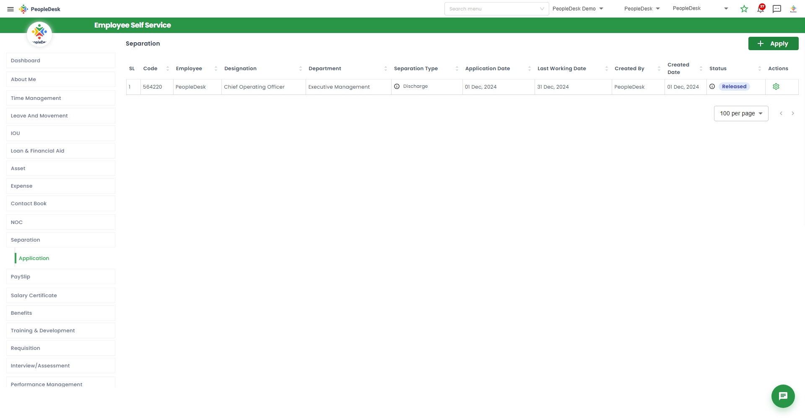

**What it does**: This page is reached from the IOU menu and is meant for submitting IOU ("I Owe You" / cash advance) requests. In this capture, the list screen shown is actually the Separation module's "Application" list (records of exit/discharge applications) rather than the IOU list - both the IOU and Separation sections have a submenu item literally labeled "Application," and this screenshot landed on the Separation one. The genuine IOU request list is what the third screenshot below shows.

**Key fields / columns** (as captured): Code, Employee, Designation, Department, Separation Type, Application Date, Last Working Date, Created By, Created Date, Status, Actions.

**Buttons & actions**:
- **+ Apply** (top right) - opens the create form below to submit a new application.
- **Gear/settings icon** (Actions column) - opens further options for an existing record.
- **100 per page** dropdown and pagination arrows - control how many rows are shown.

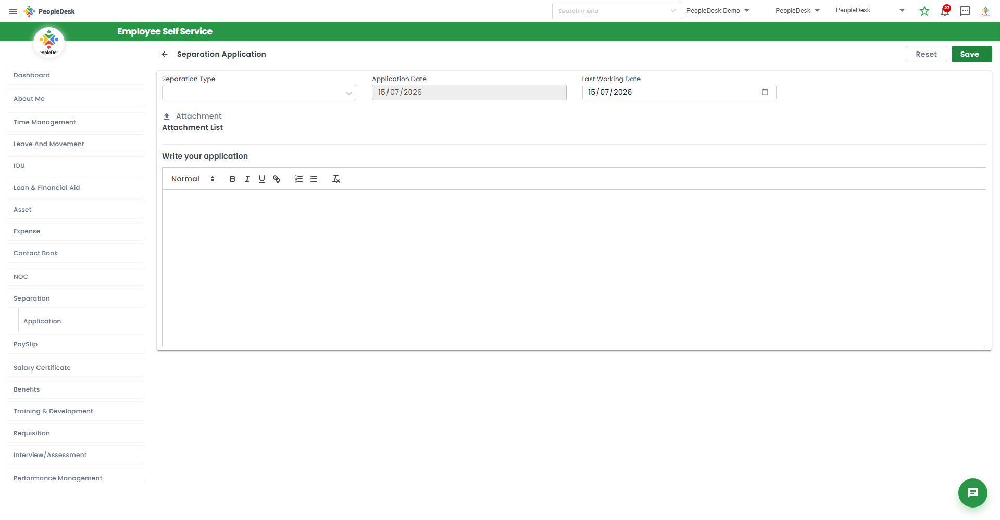

This create screen, titled "Separation Application," asks for: **Separation Type** (dropdown), **Application Date** (defaults to today, read-only), **Last Working Date**, an **Attachment** uploader with an Attachment List, and a rich-text **Write your application** editor (Normal style selector, Bold/Italic/Underline, link, lists, clear-formatting). **Reset** and **Save** buttons sit top right, with a back arrow to return to the list.

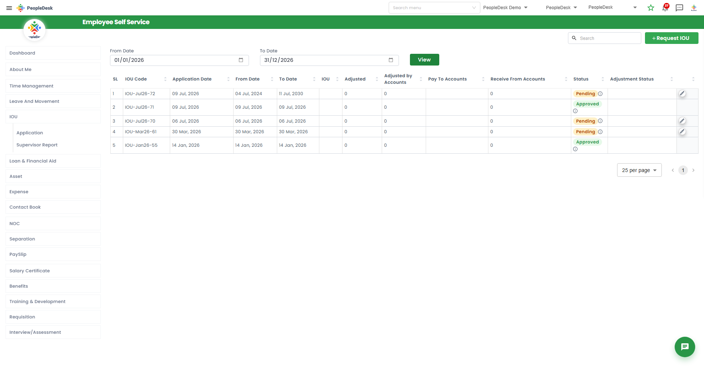

This third screenshot shows the real IOU "Application" page: a list of your IOU requests with columns SL, IOU Code, Application Date, From Date, To Date, IOU, Adjusted, Adjusted by Accounts, Pay To Accounts, Receive From Accounts, Status (Pending/Approved), and Adjustment Status. It includes a **Search** box, **From Date**/**To Date** filters with a **View** button, a **+ Request IOU** button to raise a new advance request, and a pencil icon on Pending rows to edit them.

**How to use it**: 1. Open Application under the IOU section in the sidebar. 2. Click + Request IOU to raise a new advance request. 3. Use the From Date/To Date filters and View to look up past requests. 4. Watch the Status column (Pending/Approved) to track progress.

**Pro-tip**: Because more than one sidebar section can have an "Application" link, glance at the highlighted section heading above it (IOU vs. Separation) before submitting, so you don't accidentally fill in the wrong form.

#### Supervisor Report

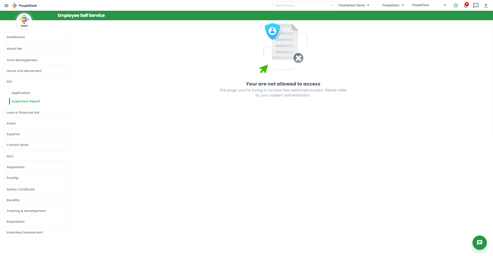

**What it does**: This page is intended to give a supervisor a report view of their team's IOU requests. In this screenshot, however, the account viewing it is not permitted to see it - the screen shows PeopleDesk's "You are not allowed to access" restricted-access message rather than an actual report.

**Key fields / columns**: None visible - only the restricted-access notice is shown ("The page you're trying to access has restricted access. Please refer to your system administrator.").

**Buttons & actions**: No functional buttons appear on this screen besides the standard left-hand navigation sidebar.

**How to use it**: 1. Open Supervisor Report from the IOU section in the sidebar (only meaningful if you supervise other employees and have the relevant permission). 2. If you see the restricted-access message shown here, contact your system administrator to request access rather than trying again from this account.

**Pro-tip**: This page is role-gated - regular employees without direct reports typically won't have access, so seeing "You are not allowed to access" here is expected unless you're a supervisor with reporting staff.

#### Loan Request

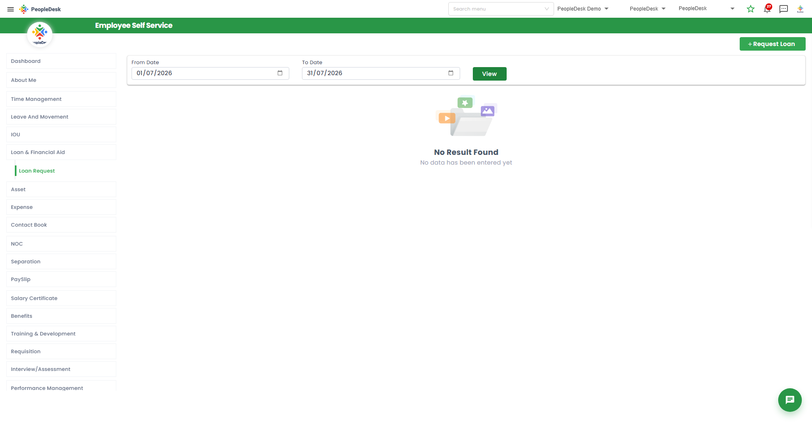

**What it does**: Use this page to request a salary loan/financial aid advance and to view the history of loans you've requested.

**Key fields / columns**: The list is filtered by From Date / To Date; in this screenshot no loan requests exist yet for the selected period, so the table area shows a "No Result Found" empty state instead of data rows.

**Buttons & actions**:
- **+ Request Loan** (top right) - opens the Create Loan Application form.
- **From Date / To Date** fields and **View** button - set the period and reload the list for it.

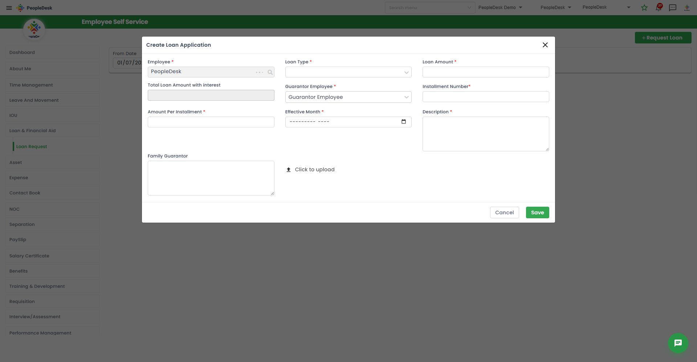

**Create form fields**: Employee (pre-filled), Loan Type (dropdown), Loan Amount, Total Loan Amount with interest (auto-calculated, read-only), Guarantor Employee (dropdown), Installment Number, Amount Per Installment, Effective Month, Description, Family Guarantor (free text), and a "Click to upload" attachment control. **Cancel** and **Save** buttons sit at the bottom of the modal.

This screenshot is identical to the main Loan Request screen above - it shows the same empty "No Result Found" list for the selected date range rather than a distinct detail view, since there is no existing loan record to display.

**How to use it**: 1. Click + Request Loan. 2. Choose the Loan Type and enter the Loan Amount, Installment Number and Effective Month; select a Guarantor Employee. 3. Add a Description and, if required, a Family Guarantor and supporting attachment. 4. Click Save. 5. Use the From Date/To Date filters and View on the main page to check your loan's approval status once submitted.

**Pro-tip**: Confirm your Guarantor Employee is aware of and agrees to the request beforehand - loan applications typically need the guarantor's own approval before HR/Finance will process them.

#### Asset Requisition

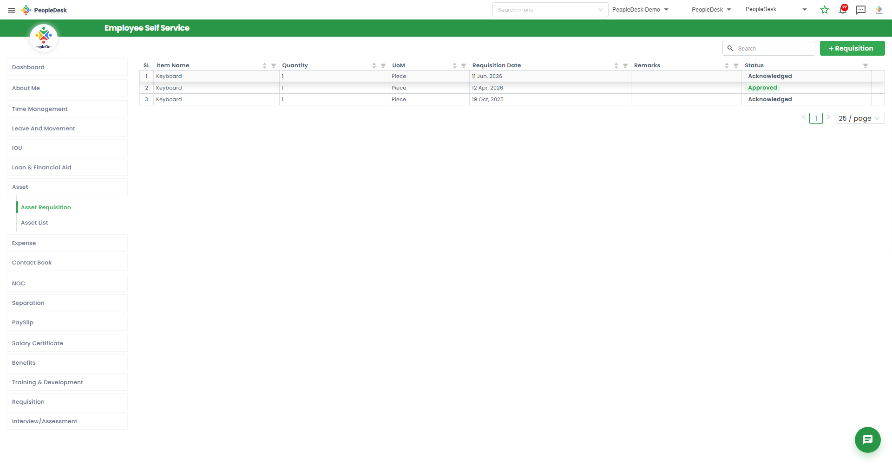

**What it does**: Use this page to request a company asset (like a keyboard or other equipment) you need for work, and to track the status of items you've requested.

**Key fields / columns**: SL, Item Name, Quantity, UoM (unit of measure), Requisition Date, Remarks, Status (Acknowledged/Approved).

**Buttons & actions**:
- **+ Requisition** (top right) - opens the Create Asset Requisition form.
- **Search box** - filter the list by keyword.
- **Column sort/filter icons** (next to Item Name, Quantity, UoM, Requisition Date, Remarks, Status headers) - sort or filter the table by that column.
- **Page size selector** ("25 / page") and pagination arrows.

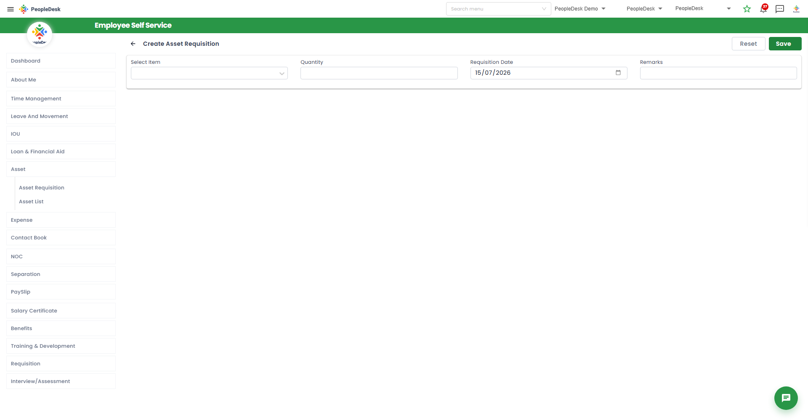

**Create form fields**: Select Item (dropdown), Quantity, Requisition Date (defaults to today), Remarks. **Reset** and **Save** buttons are in the top right, with a back arrow to return to the list.

**How to use it**: 1. Click + Requisition. 2. Select the item you need from Select Item and enter the Quantity required. 3. Adjust the Requisition Date if needed and add any Remarks. 4. Click Save. 5. Return to the list and use Search or the column filters to track the Status of your request.

**Pro-tip**: Add a clear Remarks note (e.g. why you need the item or a preferred spec) - it gives the approver context and can speed up sign-off.

#### Asset List

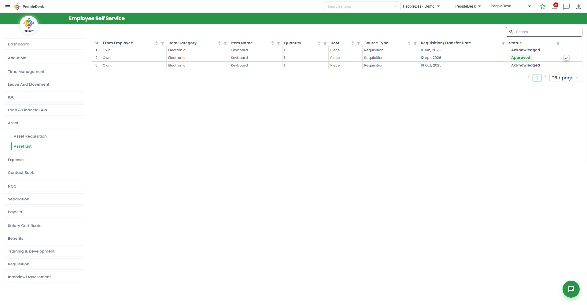

**What it does**: A read-only register of the company assets currently assigned to you, so you always know what equipment you hold and where it came from.

**Key fields / columns**: SL, From Employee, Item Category, Item Name, Quantity, UoM, Source Type (e.g. Requisition), Requisition/Transfer Date, Status.

**Buttons & actions**:
- **Search box** (top right) - filter your assigned assets by keyword.
- **Column sort/filter icons** on each header - sort or filter by that field.
- **Page size selector** and pagination controls.

**How to use it**: 1. Open Asset List from the Asset section in the sidebar. 2. Scan the table to confirm what's currently assigned to you. 3. Use Search or the column filters if you have many assigned items and need to find a specific one.

**Pro-tip**: Cross-check this list against what's physically in your possession periodically - if something is missing from here that you're holding (or vice versa), flag it to admin so the asset register stays accurate.

#### Expense Application

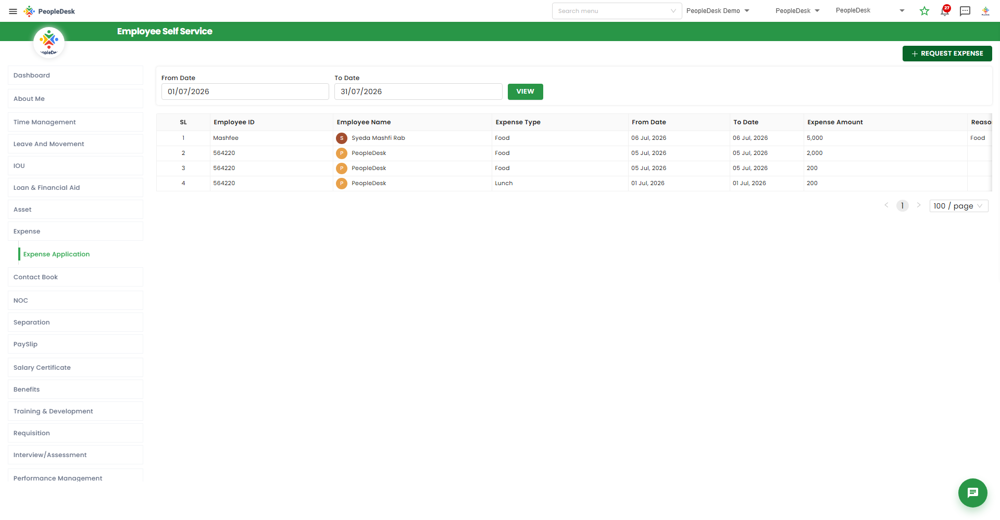

**What it does**: Use this page to submit reimbursement requests for work-related expenses (like meals or travel) and to review the expenses you and others in your approval chain have submitted.

**Key fields / columns**: SL, Employee ID, Employee Name, Expense Type (e.g. Food, Lunch), From Date, To Date, Expense Amount, Reason (column extends beyond the visible area in this screenshot).

**Buttons & actions**:
- **+ REQUEST EXPENSE** (top right) - opens the form to submit a new expense claim.
- **From Date / To Date** fields and **VIEW** button - filter the list to a specific period.
- **Page size selector** ("100 / page") and pagination arrows.

This screenshot is identical to the main Expense Application screen above - it shows the same filtered expense list rather than a distinct detail view.

**How to use it**: 1. Click + Request Expense and fill in the expense details (type, dates, amount, reason). 2. Submit for approval. 3. Use the From Date/To Date filters and View on the main list to review your (and, depending on permissions, others') submitted expenses and their amounts.

**Pro-tip**: Set the From Date/To Date range to cover a full pay period before clicking View so you can see all expenses awaiting reimbursement in that cycle at once.

#### Contact Book

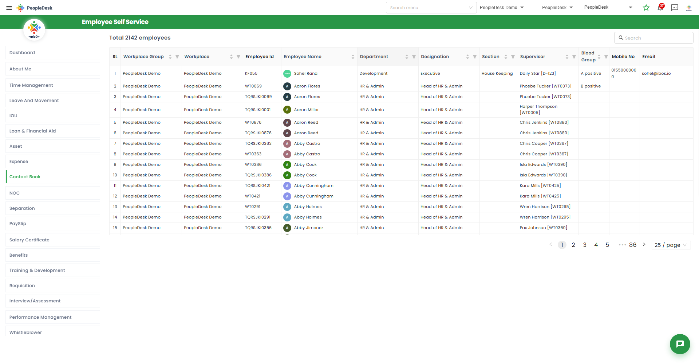

**What it does**: A company-wide directory so you can look up any colleague's contact details, department, designation, and supervisor.

**Key fields / columns**: Workplace Group, Workplace, Employee Id, Employee Name, Department, Designation, Section, Supervisor, Blood Group, Mobile No, Email. The header shows the total employee count (e.g. "Total 2142 employees").

**Buttons & actions**:
- **Search box** (top right) - search the directory by name, ID, or other visible detail.
- **Column sort/filter icons** on each header - sort or filter by that column (e.g. by Department or Workplace).
- **Pagination** (numbered pages plus next arrow) and page-size selector - navigate the full employee list.

**How to use it**: 1. Open Contact Book from the sidebar. 2. Use the Search box to find a specific colleague by name or ID. 3. Use the column filters if you need to narrow the list by Department, Workplace, or another attribute. 4. Note the Mobile No/Email or Supervisor to get in touch or understand reporting lines.

**Pro-tip**: Use the Blood Group column in an emergency - it's a quick way to find a colleague with a matching blood type on-site without going through HR.

#### NOC Application

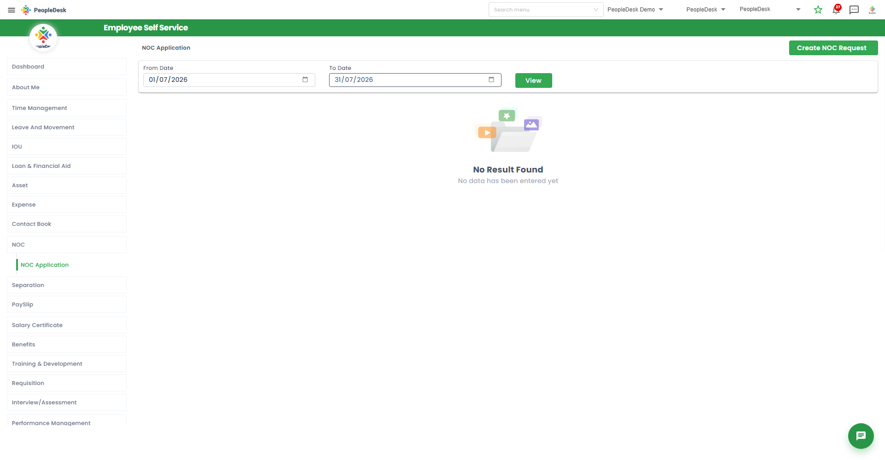

**What it does**: Lets you request a No Objection Certificate (NOC) from the company — for example to support a visa, passport, or travel application — and lets you review the NOC requests you have already submitted.

**Key fields / columns**: 
- From Date
- To Date

**Buttons & actions**:
- **Create NOC Request** (top right, green) — opens the NOC Application Form to submit a new request.
- **View** — applies the From Date / To Date filter and reloads the list of your NOC requests for that period.

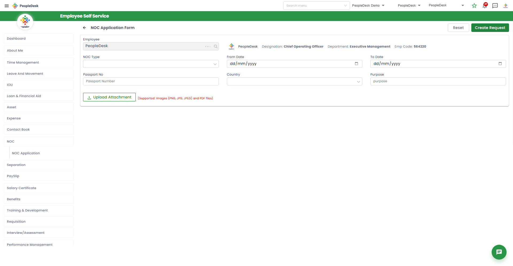

**Create form fields**:
- Employee (pre-filled with your name; shows your photo, Designation, Department, and Emp Code alongside)
- NOC Type (dropdown)
- From Date / To Date
- Passport No
- Country (dropdown)
- Purpose
- Upload Attachment (supports images — PNG, JPG, JPEG — and PDF files)

**Buttons & actions on the form**:
- **Reset** — clears the form back to defaults.
- **Create Request** — submits the NOC application for approval.
- **Upload Attachment** — attach a supporting document such as a scanned passport page.
- Back arrow (top left) — returns to the NOC Application list without saving.

**How to use it**:
1. From the NOC Application list, click **Create NOC Request**.
2. Select the NOC Type and enter your From Date, To Date, Passport No, Country, and Purpose.
3. Upload a supporting attachment if required.
4. Click **Create Request** to submit it for approval.
5. Return to the list and use **View** with a date range to track the status of past requests.

**Pro-tip**: Have your passport number and travel purpose ready before starting the form — both are required fields and the request cannot be created without them.

---

#### Application

**What it does**: This is your Separation page, where you can submit a resignation or separation application and track the status of any separation request you have filed.

**Key fields / columns**:
- SL
- Code
- Employee
- Designation
- Department
- Separation Type
- Application Date
- Last Working Date
- Created By
- Created Date
- Status (e.g. Released)
- Actions (gear icon)

**Buttons & actions**:
- **Apply** (top right, green) — opens the Separation Application form to submit a new request.
- **Actions gear icon** on each row — opens further options for that specific separation record.

**Create form fields**:
- Separation Type (dropdown)
- Application Date (pre-filled with today's date)
- Last Working Date
- Attachment (with an Attachment List area for uploaded files)
- Write your application (rich-text editor with Normal style selector, Bold, Italic, Underline, Link, and list formatting tools)

**Buttons & actions on the form**:
- **Reset** — clears your entries.
- **Save** — submits the separation application.
- Back arrow (top left) — returns to the Application list without saving.

**What it shows**: This screenshot does not show a separation record detail — it actually displays the IOU list page (IOU Code, Application Date, From/To Date, IOU, Adjusted, Pay To/Receive From Accounts, Status, Adjustment Status), which appears to be a mismatched capture rather than a genuine "view" of a separation application.

**How to use it**:
1. Click **Apply** on the Separation page.
2. Choose your Separation Type and confirm the Application Date and Last Working Date.
3. Write a short note explaining your application in the text editor and attach any relevant documents.
4. Click **Save** to submit it to your approver.
5. Track the status (e.g., Pending, Released) from the main Separation list.

**Pro-tip**: Double-check your Last Working Date before saving — it directly affects your final settlement and clearance calculations, so an incorrect date can delay processing.

---

#### PaySlip

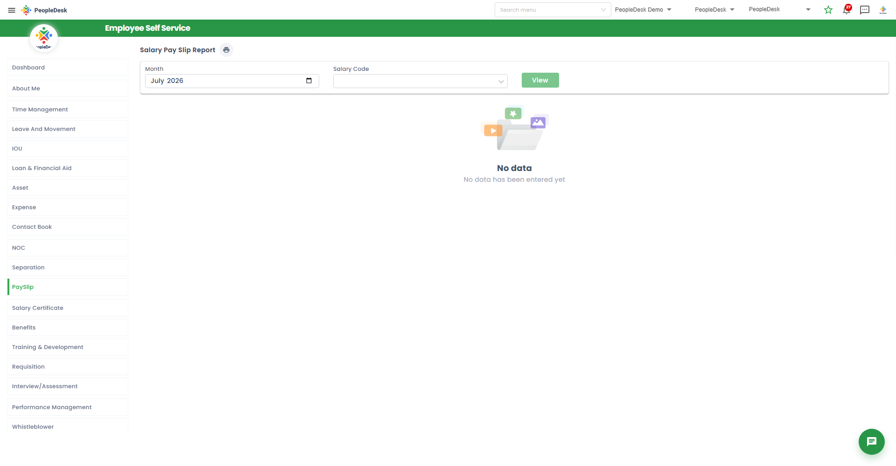

**What it does**: Lets you generate and view your own Salary Pay Slip Report for a chosen month.

**Key fields / columns**:
- Month
- Salary Code

**Buttons & actions**:
- **View** — fetches your pay slip for the selected Month and Salary Code.
- **Print icon** (next to the "Salary Pay Slip Report" heading) — prints the generated pay slip.

**How to use it**:
1. Select the Month you want to view.
2. Choose your Salary Code if prompted (or leave as shown).
3. Click **View** to load your pay slip details.
4. Use the print icon to print or save a copy for your records.

**Pro-tip**: If you see "No data" after clicking View, try a month you know you were paid in — pay slips only appear once payroll has been processed and finalized for that month.

---

#### Salary Certificate Requsition

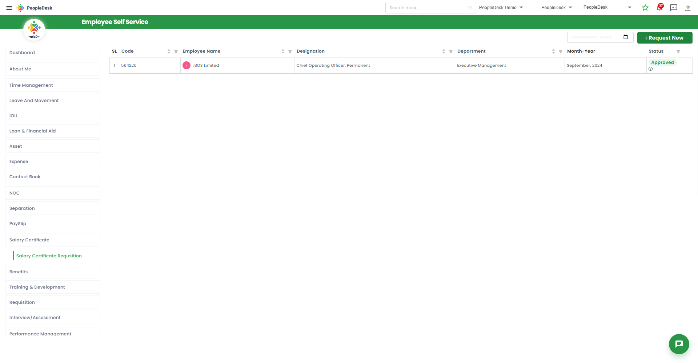

**What it does**: Lets you request an official Salary Certificate (useful for bank loans, visas, or other verification purposes) and view the status of certificates you have already requested.

**Key fields / columns**:
- SL
- Code
- Employee Name
- Designation
- Department
- Month-Year
- Status (e.g. Approved)

**Buttons & actions**:
- **Request New** (top right, green) — opens the Salary Certificate Request form.
- Date filter (top right, next to Request New) — narrows the list by a specific date.
- Column filter icons next to Code, Employee Name, Department, and Status headers — let you filter the list by those fields.

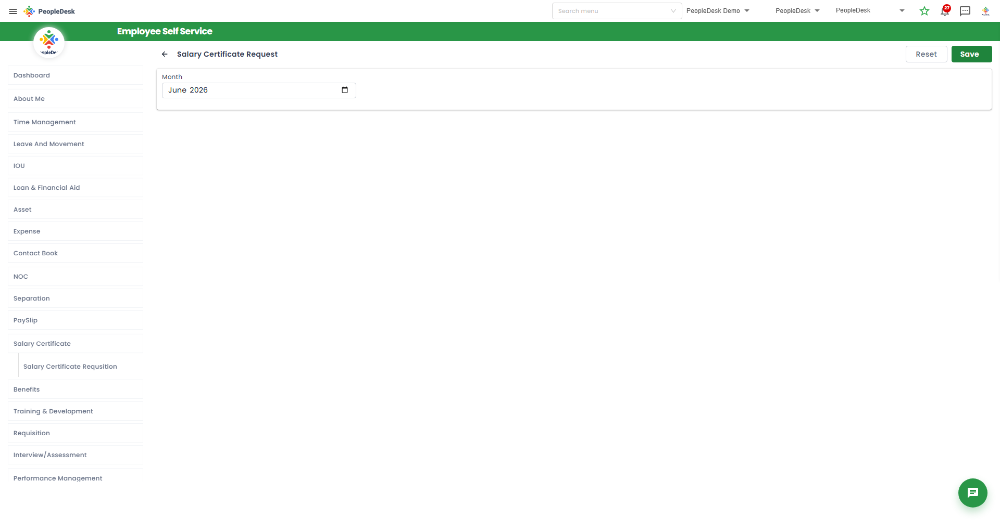

**Create form fields**:
- Month (month/year picker)

**Buttons & actions on the form**:
- **Reset** — clears the selected month.
- **Save** — submits the salary certificate request for the chosen month.
- Back arrow (top left) — returns to the list without saving.

**How to use it**:
1. Click **Request New** on the Salary Certificate Requisition page.
2. Select the Month you need the certificate for.
3. Click **Save** to submit your request.
4. Track the approval status back on the main list.

**Pro-tip**: Request the certificate for the most recently completed month rather than the current one — the current month's salary data may not be finalized yet, which can delay approval.

---

#### Leave Benefits

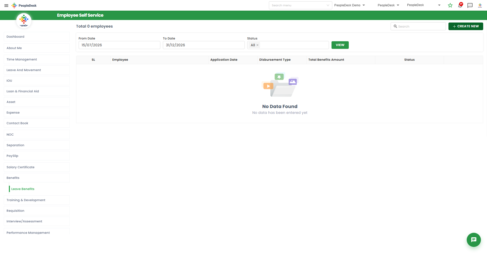

**What it does**: Shows your leave encashment / leave benefit disbursement requests, where unused leave can be converted into a monetary benefit.

**Key fields / columns**:
- From Date / To Date
- Status (filter, defaulting to "All")
- SL, Employee, Application Date, Disbursement Type, Total Benefits Amount, Status (table columns)

**Buttons & actions**:
- **Create New** (top right, green) — opens the leave benefits request form.
- **View** — applies the From Date, To Date, and Status filters to refresh the list.

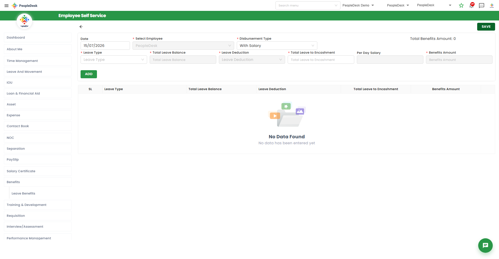

**Create form fields**:
- Date (pre-filled with today's date)
- Select Employee (pre-filled with your name)
- Disbursement Type (e.g. "With Salary")
- Leave Type
- Total Leave Balance
- Leave Deduction
- Total Leave to Encashment
- Per Day Salary
- Benefits Amount
- Total Benefits Amount (running total shown at top right)

**Buttons & actions on the form**:
- **Add** — adds the leave type/encashment line you've configured into the table below.
- **Save** — submits the completed leave benefits request.
- Back arrow (top left) — returns to the list without saving.

**How to use it**:
1. Click **Create New** on the Leave Benefits page.
2. Choose your Disbursement Type and the Leave Type you want to encash.
3. Enter the Total Leave to Encashment and confirm the calculated Benefits Amount.
4. Click **Add** to add the line to the table (repeat for multiple leave types if needed).
5. Click **Save** to submit the request for approval.

**Pro-tip**: Check your Total Leave Balance carefully before entering the amount to encash — you can only encash leave you have actually accrued and not already used.

---

#### Training Requisition

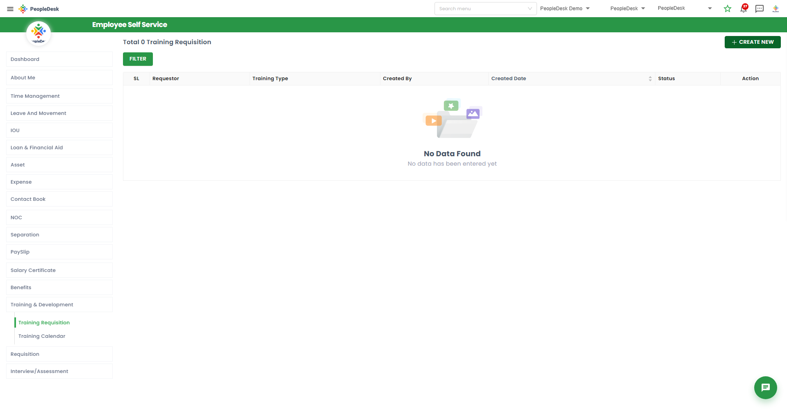

**What it does**: Lets you request to attend a training program and track the status of your training requests.

**Key fields / columns**:
- SL, Requestor, Training Type, Created By, Created Date, Status, Action

**Buttons & actions**:
- **Create New** (top right, green) — opens the training requisition form.
- **Filter** — opens filtering options to narrow the requisition list.

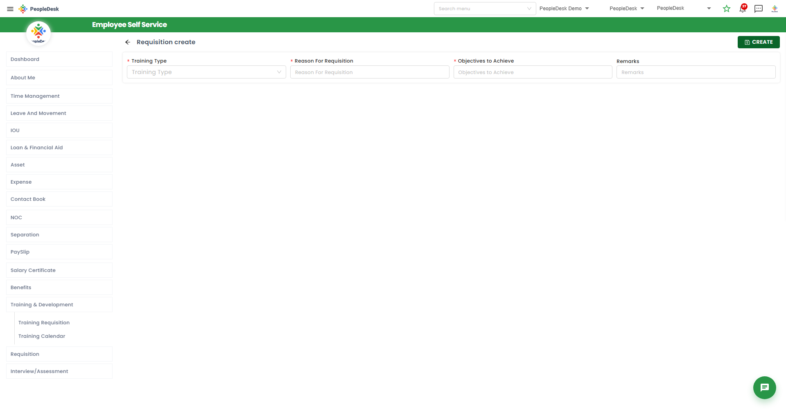

**Create form fields**:
- Training Type (dropdown)
- Reason For Requisition
- Objectives to Achieve
- Remarks

**Buttons & actions on the form**:
- **Create** (top right) — submits the training requisition.
- Back arrow (top left) — returns to the list without saving.

**How to use it**:
1. Click **Create New** on the Training Requisition page.
2. Select the Training Type you want to attend.
3. Explain your Reason For Requisition and the Objectives to Achieve.
4. Add any Remarks if needed.
5. Click **Create** to submit the request for approval.

**Pro-tip**: Be specific in "Objectives to Achieve" — clearly stating how the training will improve your work makes it easier for your manager to approve the request.

---

#### Training Calendar

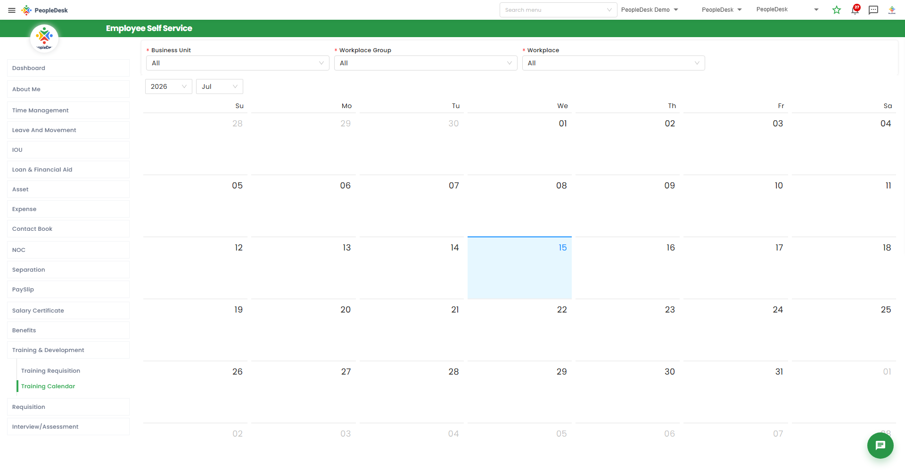

**What it does**: Displays a monthly calendar of scheduled training sessions across the organization so you can see what training is planned and when.

**Key fields / columns**:
- Business Unit (filter)
- Workplace Group (filter)
- Workplace (filter)
- Year and Month selectors
- Calendar grid (Sunday through Saturday)

**Buttons & actions**:
- Business Unit, Workplace Group, and Workplace dropdowns — filter the calendar to a specific unit/location (all default to "All").
- Year and Month dropdowns — navigate to a different month's training calendar.

**How to use it**:
1. Use the Business Unit, Workplace Group, and Workplace filters to narrow down to your area if needed.
2. Select the Year and Month you want to check.
3. Look at the highlighted dates on the calendar for scheduled training sessions.

**Pro-tip**: Check the Training Calendar before submitting a Training Requisition — you may find a relevant session already scheduled, saving you the need to request a new one.

---

#### Employee Requisition

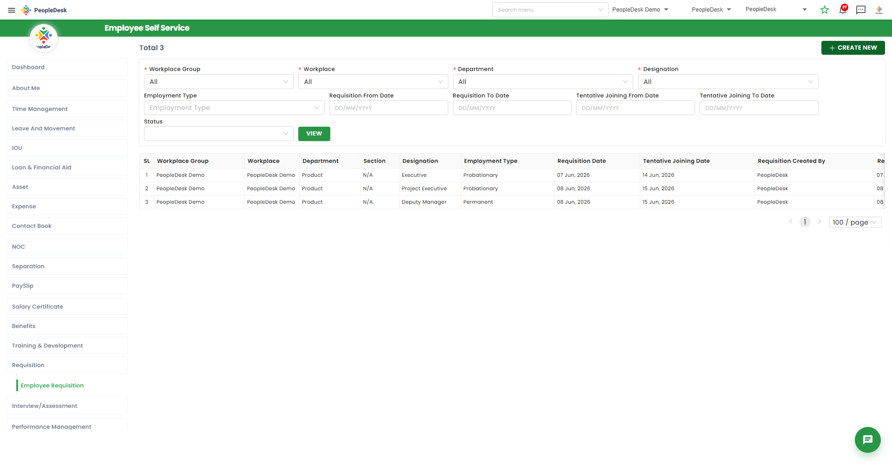

**What it does**: Lets you raise a manpower/hiring requisition when your team needs a new employee, and lets you track requisitions you've submitted.

**Key fields / columns**:
- Workplace Group, Workplace, Department, Designation (filters)
- Employment Type, Requisition From Date, Requisition To Date, Tentative Joining From Date, Tentative Joining To Date, Status (filters)
- Table columns: SL, Workplace Group, Workplace, Department, Section, Designation, Employment Type, Requisition Date, Tentative Joining Date, Requisition Created By, and more (scrolls further right)

**Buttons & actions**:
- **Create New** (top right, green) — opens the Create Requisition form.
- **View** — applies all the selected filters and reloads the requisition list.

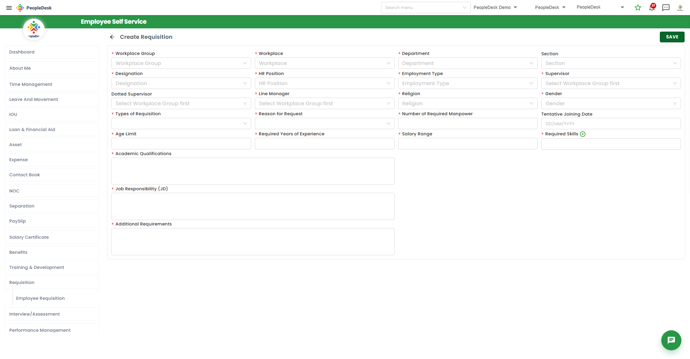

**Create form fields**:
- Workplace Group, Workplace, Department, Section
- Designation, HR Position, Employment Type, Supervisor
- Dotted Supervisor, Line Manager, Religion, Gender
- Types of Requisition, Reason for Request, Number of Required Manpower, Tentative Joining Date
- Age Limit, Required Years of Experience, Salary Range, Required Skills (with an add icon to include more skills)
- Academic Qualifications (text area)
- Job Responsibility (JD) (text area)
- Additional Requirements (text area)

**Buttons & actions on the form**:
- **Save** (top right) — submits the new requisition.
- Back arrow (top left) — returns to the list without saving.

**How to use it**:
1. Click **Create New** on the Employee Requisition page.
2. Fill in the workplace, department, designation, and employment details for the position you need.
3. Specify the number of required manpower, tentative joining date, salary range, and required skills.
4. Add academic qualifications, job responsibilities, and any additional requirements.
5. Click **Save** to submit the requisition for approval.

**Pro-tip**: Fill in Required Skills and Job Responsibility (JD) as thoroughly as possible — a well-detailed requisition speeds up how quickly HR/Recruitment can source the right candidate.

---

#### Interview/Assessment

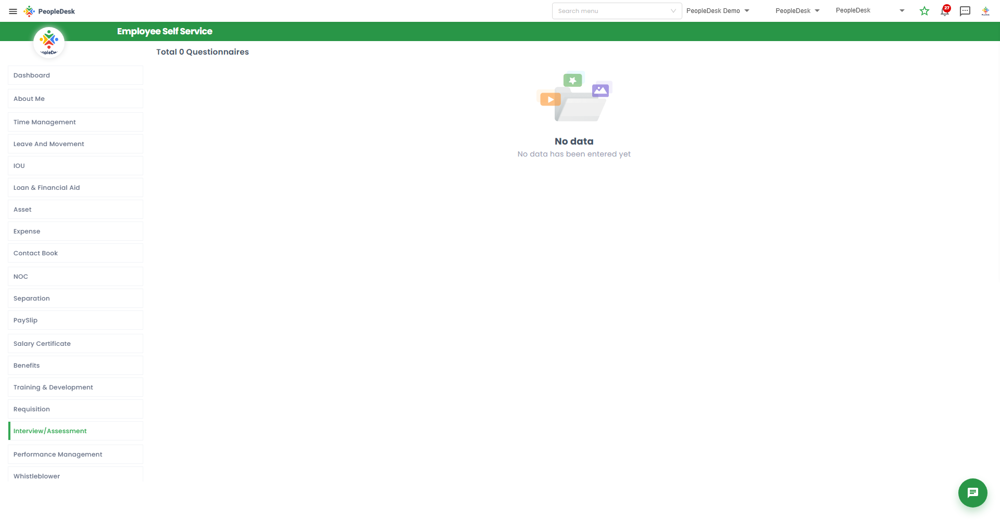

**What it does**: Shows the list of Questionnaires related to interviews or exit assessments assigned to you.

**Key fields / columns**: None populated in this view — the page currently shows "Total 0 Questionnaires."

**Buttons & actions**: No action buttons are visible on this page in its empty state.

**How to use it**:
1. Open the Interview/Assessment page from the left menu.
2. If any questionnaire has been assigned to you (e.g., as part of an exit interview or interview panel), it will appear here for you to complete.

**Pro-tip**: If you were told to complete an interview or exit assessment but don't see it listed, confirm with HR that it has actually been assigned to your account.

---

#### KPI Assessment

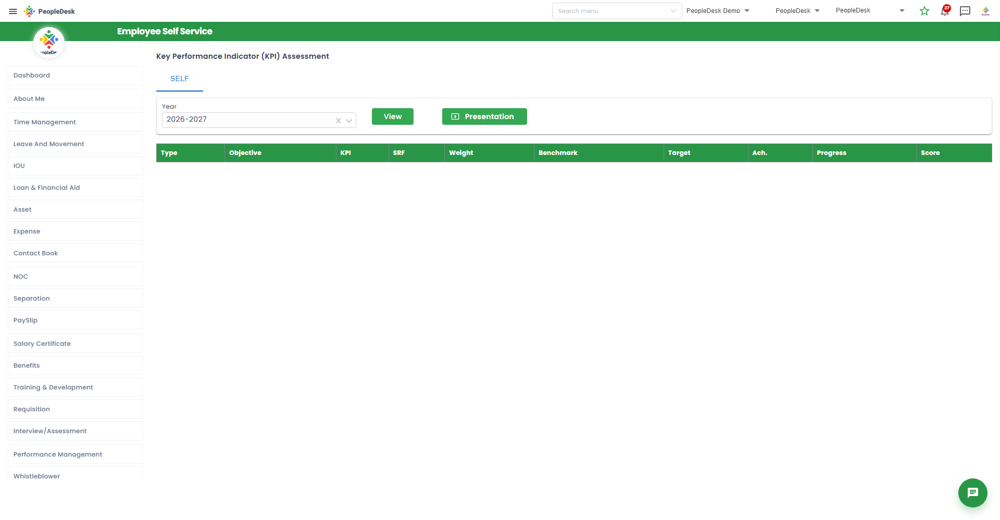

**What it does**: Lets you view your own Key Performance Indicator (KPI) assessment — your objectives, targets, and achievement scores — for a selected appraisal year, under the "SELF" tab.

**Key fields / columns**:
- Year (dropdown, e.g. 2026-2027)
- Table columns: Type, Objective, KPI, SRF, Weight, Benchmark, Target, Ach., Progress, Score

**Buttons & actions**:
- **View** — loads your KPI data for the selected Year.
- **Presentation** — opens a presentation-style view of your KPI results.

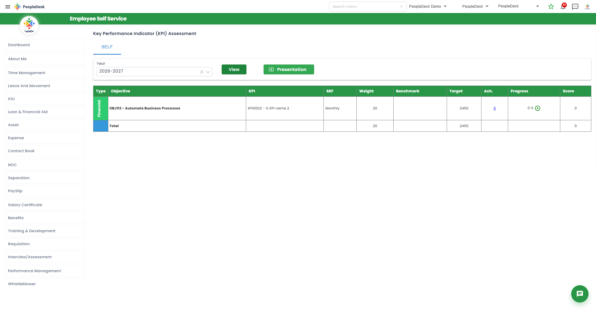

**What it shows**: After clicking View for the 2026-2027 year, the table populates with your actual KPI record: a "Financial" type objective "OBJ112 - Automate Business Processes," KPI "KPI0002 - % KPI name 2," measured Monthly, with a Weight of 20, Target of 2450, current Achievement of 0, Progress of 0%, and a Total row summarizing Weight (20), Target (2450), and Score (0).

**How to use it**:
1. Select the appraisal Year you want to review.
2. Click **View** to load your KPI objectives and current scores.
3. Click the achievement value (shown as a link, e.g. "0") to update your progress if you're expected to self-report achievement.
4. Use **Presentation** for a cleaner, presentation-friendly view of the same data — useful when discussing your performance with your manager.

**Pro-tip**: Update your Achievement figures regularly rather than waiting until year-end — it keeps your Progress percentage accurate and avoids a last-minute scramble during appraisal season.

---

#### BAR Assessment

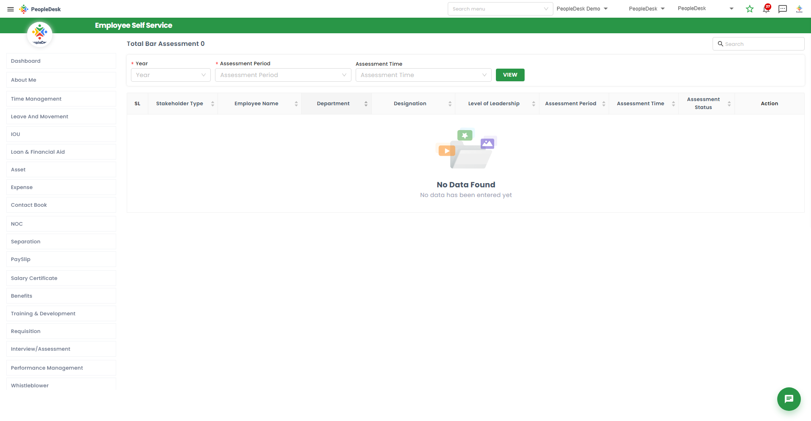

**What it does**: Lets you view your Behaviorally Anchored Rating (BAR) assessments — a structured evaluation of your workplace behaviors — filtered by year and assessment period.

**Key fields / columns**:
- Year (dropdown, required)
- Assessment Period (dropdown, required)
- Assessment Time (dropdown, optional)
- Table columns: SL, Stakeholder Type, Employee Name, Department, Designation, Level of Leadership, Assessment Period, Assessment Time, Assessment Status, Action

**Buttons & actions**:
- **View** — applies the Year/Assessment Period/Assessment Time filters and reloads the assessment list.

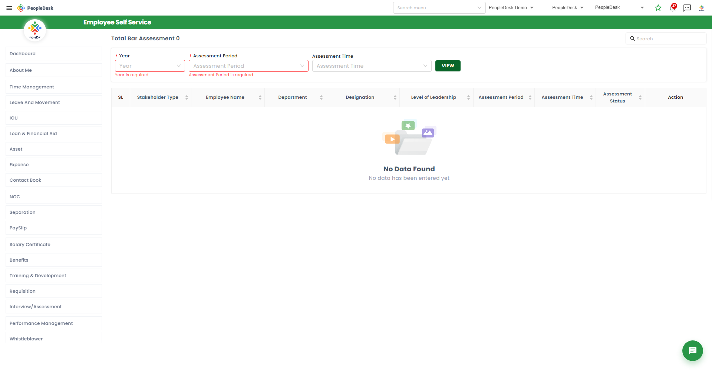

**What it shows**: This is a validation-error state, not a record detail. After clicking **View** without selecting the required filters, the Year and Assessment Period fields are outlined in red with the messages "Year is required" and "Assessment Period is required," and the table still shows "No Data Found."

**How to use it**:
1. Select a Year from the dropdown — this is mandatory.
2. Select an Assessment Period — also mandatory.
3. Optionally narrow further with Assessment Time.
4. Click **View** to load your BAR assessment records.

**Pro-tip**: Always pick both Year and Assessment Period before clicking View — skipping either one triggers a validation error instead of showing your results.

---

#### Whistleblower

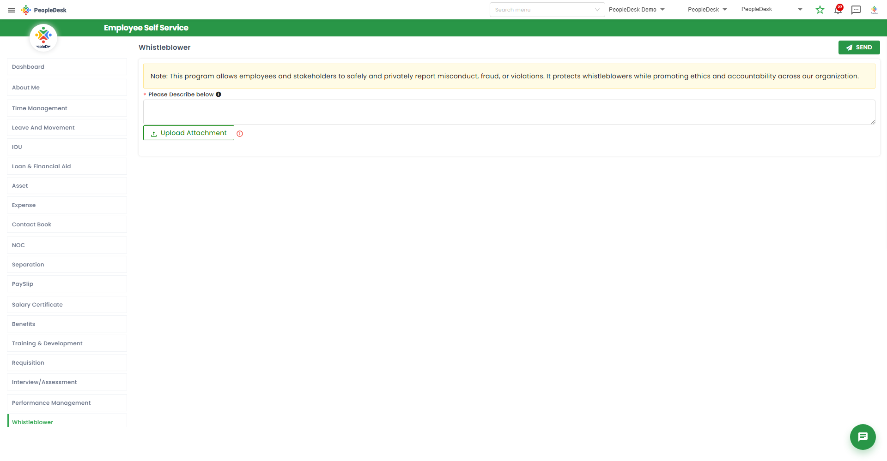

**What it does**: Provides a private, protected channel for you to report misconduct, fraud, or policy violations directly to the organization.

**Key fields / columns**:
- Please Describe below (required text area, with an info icon for guidance)

**Buttons & actions**:
- **Upload Attachment** — attach supporting evidence or documentation to your report (with an info icon noting file requirements).
- **Send** (top right, green) — submits your whistleblower report.

**How to use it**:
1. Open the Whistleblower page from the left menu.
2. Read the note explaining that the program protects whistleblowers while promoting ethics and accountability.
3. Describe the issue you want to report in the text box.
4. Attach any supporting evidence using **Upload Attachment**.
5. Click **Send** to submit your report.

**Pro-tip**: Be as factual and specific as possible in your description (dates, names, events) — a detailed report is easier for the organization to investigate properly.

---

#### Apply For Documents

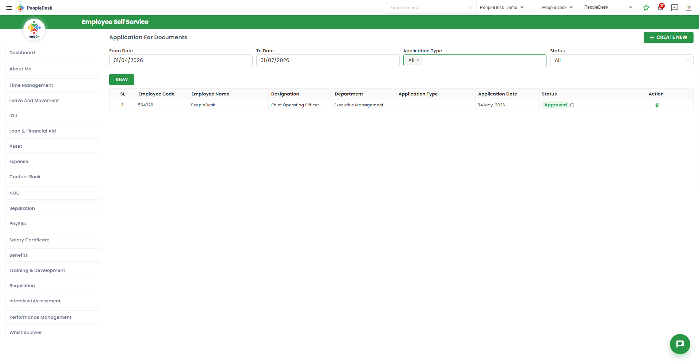

**What it does**: Lets you request official documents from HR (such as certificates or letters) and track the status of documents you've already applied for.

**Key fields / columns**:
- From Date / To Date (filters)
- Application Type (filter, default "All")
- Status (filter, default "All")
- Table columns: SL, Employee Code, Employee Name, Designation, Department, Application Type, Application Date, Status, Action

**Buttons & actions**:
- **Create New** (top right, green) — opens the Application For Documents form.
- **View** — applies the date/type/status filters and reloads the list.
- **Eye icon** (Action column) — lets you view the details of a submitted document application.

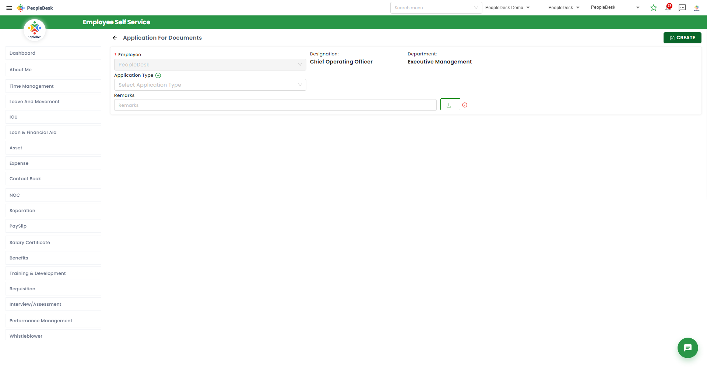

**Create form fields**:
- Employee (pre-filled with your name; Designation and Department displayed alongside)
- Application Type (dropdown, with a "+" icon to add a new type if permitted)
- Remarks
- Upload/attachment icon next to Remarks (with an info icon noting attachment requirements)

**Buttons & actions on the form**:
- **Create** (top right) — submits your document application.
- Back arrow (top left) — returns to the list without saving.

**How to use it**:
1. Click **Create New** on the Apply For Documents page.
2. Select the Application Type for the document you need.
3. Add any Remarks to clarify your request, and attach supporting files if needed.
4. Click **Create** to submit the request.
5. Track the status (e.g., Approved) back on the main list, and use the eye icon to review details.

**Pro-tip**: Use the Remarks field to specify exactly what the document is for (e.g., "for visa application") — it helps HR prepare the correct wording on the certificate the first time.

## 8. Compensation & Benefits Module

Payroll: salary assignment, generation, bonuses, increments, tax, and the reports that go with them.

#### Salary Assign

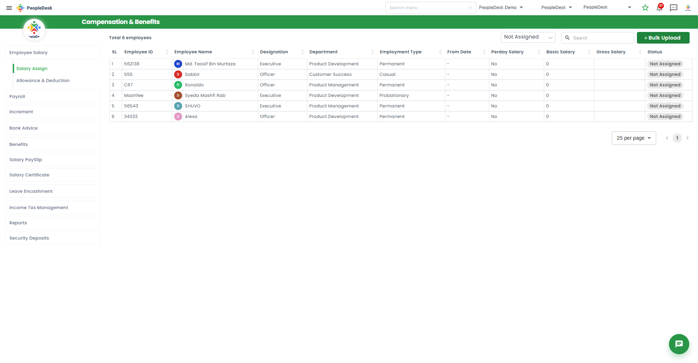

**What it does**: Lists every employee in the system and shows whether a salary structure (basic pay, gross pay) has already been assigned to them. This is the starting point of the payroll setup — an employee cannot be paid until a salary is assigned here.

**Key fields / columns**:
- SL
- Employee ID
- Employee Name
- Designation
- Department
- Employment Type
- From Date
- Perday Salary
- Basic Salary
- Gross Salary
- Status (e.g. "Not Assigned")

**Buttons & actions**:
- **Status filter dropdown** (top left, defaulted to "Not Assigned") — switches the list between assigned and not-assigned employees.
- **Search box** — filters the list by employee name/ID.
- **+ Bulk Upload** (green button) — opens a bulk-upload flow to assign salaries to many employees at once, typically via a spreadsheet template, instead of doing it one by one.
- **Pagination controls** ("25 per page" selector and page arrows) at the bottom of the list.

**How to use it**:
1. Open Compensation & Benefits > Employee Salary > Salary Assign.
2. Use the status dropdown to see which employees still show "Not Assigned."
3. Click an employee's row to open their salary-assignment details (basic salary, gross salary, effective date).
4. For assigning many employees together, click **+ Bulk Upload** and follow the upload template.

**Pro-tip**: Run this page first every time a new batch of employees joins — until "Status" reads something other than "Not Assigned," none of the downstream payroll pages (Salary Generate, Bank Advice, PaySlip) will have anything to work with for that employee.

---

#### Allowance & Deduction

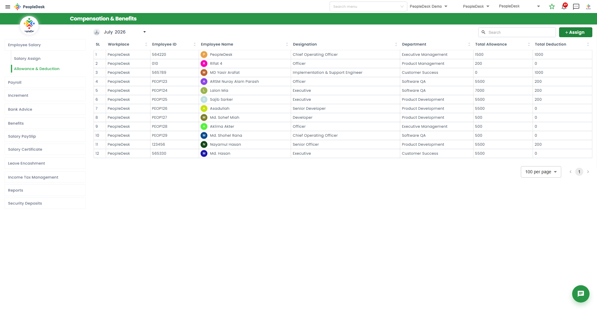

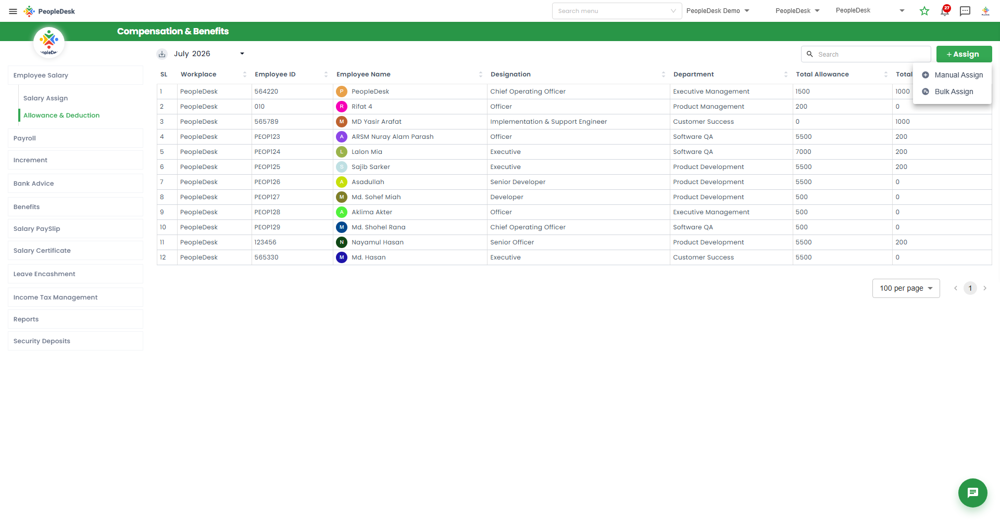

**What it does**: Shows each employee's total recurring allowances (extra pay, e.g. transport or meal allowance) and deductions (amounts subtracted from pay) for the selected payroll month, and lets you assign new allowance/deduction rules.

**Key fields / columns**:
- SL
- Workplace
- Employee ID
- Employee Name
- Designation
- Department
- Total Allowance
- Total Deduction

**Buttons & actions**:
- **Month selector** ("July 2026") — switches which payroll month's totals are displayed.
- **Download icon** (next to the month) — exports the list.
- **Search box** — filters by employee.
- **+ Assign** (green button) — opens a dropdown with two options: **Manual Assign** (set an allowance/deduction for one employee at a time) and **Bulk Assign** (apply the same allowance/deduction rule to many employees at once).
- **Pagination** ("100 per page") at the bottom.

**How to use it**:
1. Open Compensation & Benefits > Employee Salary > Allowance & Deduction.
2. Pick the payroll month you want to review.
3. Click **+ Assign**, then choose **Manual Assign** to set up one employee's allowance/deduction, or **Bulk Assign** to apply the same rule across many employees.
4. Review the Total Allowance / Total Deduction columns to confirm the amounts landed correctly before generating salary for that month.

**Pro-tip**: Set up allowances and deductions before running Salary Generate for the month — Salary Generate pulls these totals in automatically, so fixing them afterward means re-generating the payroll.

---

#### Salary Generate

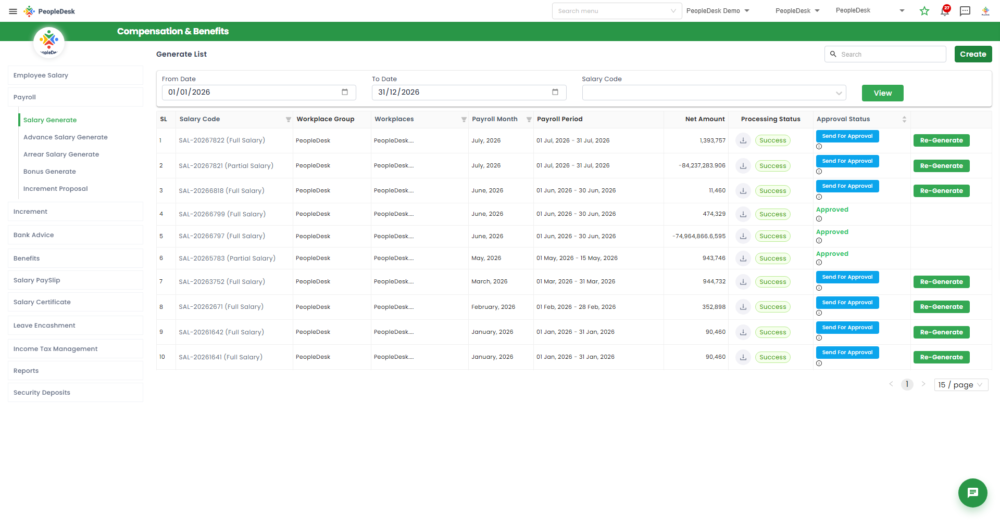

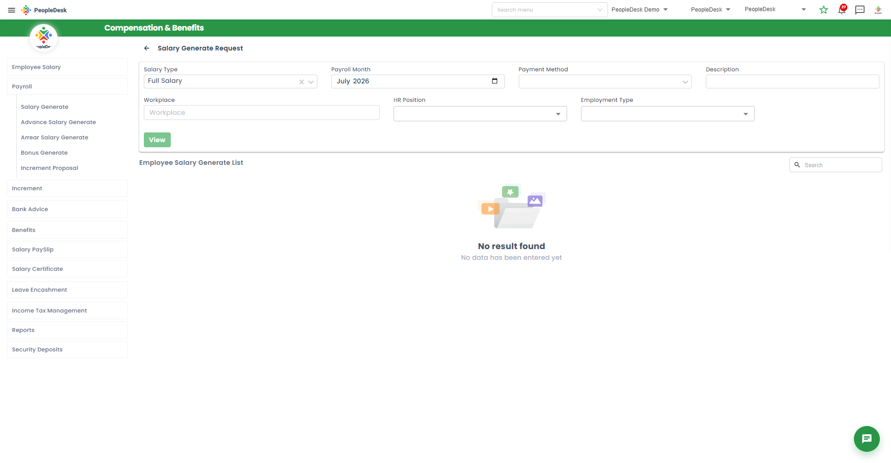

**What it does**: This is the main monthly payroll run screen — it lists every salary batch that has been generated (Full Salary or Partial Salary), its processing/approval status, and lets you start a new payroll generation request.

**Key fields / columns**:
- SL
- Salary Code (e.g. SAL-20267822)
- Workplace Group
- Workplaces
- Payroll Month
- Payroll Period
- Net Amount
- Processing Status (e.g. Success)
- Approval Status (Approved / Send For Approval)

**Buttons & actions**:
- **From Date / To Date** filters, **Salary Code** dropdown, and **View** — narrow the list to a specific date range or salary batch.
- **Search box** — filters the list.
- **Create** (top right) — opens the Salary Generate Request form to run a new payroll batch.
- **Download icon** in each row — downloads that batch's details.
- **Send For Approval** (blue button) — submits a generated, not-yet-approved batch for approval.
- **Re-Generate** (green button) — reruns the salary calculation for that batch (useful after correcting allowance/deduction data).
- Rows already marked **Approved** show no action buttons since they're finalized.

**Create form fields** (Salary Generate Request): Salary Type (e.g. Full Salary), Payroll Month, Payment Method, Description, Workplace, HR Position, Employment Type, plus a **View** button that lists the matching "Employee Salary Generate List" below (shows "No result found" until matching employees exist for the chosen filters).

**How to use it**:
1. Open Compensation & Benefits > Payroll > Salary Generate.
2. Click **Create**, choose the Salary Type, Payroll Month, and optionally narrow by Workplace/HR Position/Employment Type.
3. Click **View** to preview the employees who will be included.
4. Confirm and generate; the new batch appears in the Generate List with a Salary Code.
5. Click **Send For Approval** once you're satisfied with the Net Amount, then track its Approval Status.
6. If numbers look wrong, click **Re-Generate** after fixing the underlying salary/allowance data.

**Pro-tip**: A negative Net Amount (as seen in some Partial Salary rows) is a red flag — it usually means deductions or advance recoveries exceed the employee's earnings for that period; investigate before sending for approval.

---

#### Advance Salary Generate

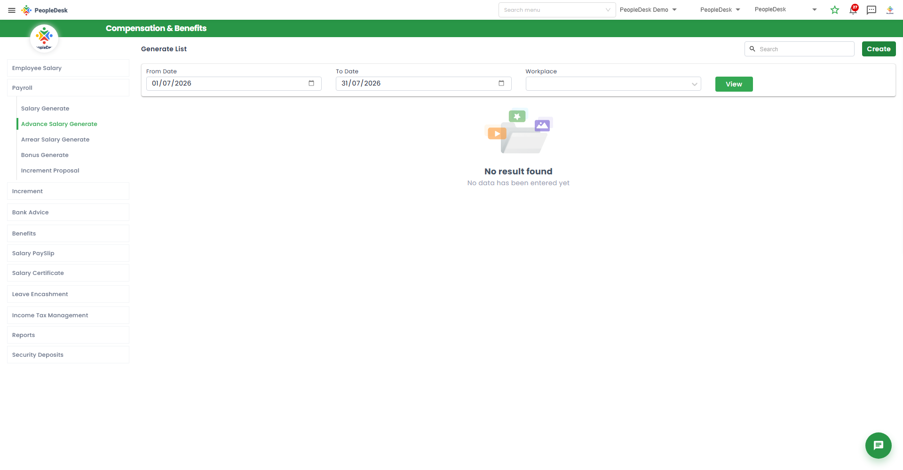

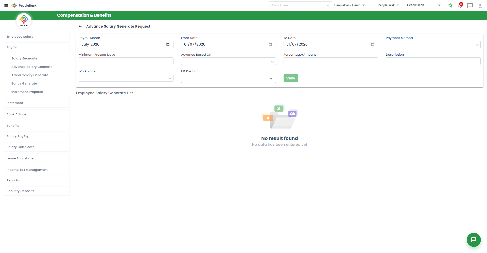

**What it does**: Lets HR/payroll issue an advance salary — pay released to an employee before the normal payroll cycle, to be recovered later — and lists past advance-salary generation batches.

**Key fields / columns**: Generate List table uses the same From Date / To Date / Workplace filters as other payroll lists (list was empty at capture time — "No result found").

**Buttons & actions**:
- **From Date / To Date** and **Workplace** filters with a **View** button — searches existing advance salary batches.
- **Search box** — filters results.
- **Create** (top right) — opens the Advance Salary Generate Request form.

**Create form fields** (Advance Salary Generate Request): Payroll Month, From Date, To Date, Payment Method, Minimum Present Days (attendance threshold to qualify), Advance Based On (dropdown, e.g. basic/gross), Percentage/Amount, Description, Workplace, HR Position, plus a **View** button that lists the matching "Employee Salary Generate List" below (empty until employees match the criteria).

**How to use it**:
1. Open Compensation & Benefits > Payroll > Advance Salary Generate.
2. Click **Create**.
3. Set the Payroll Month and date range, choose what the advance is based on (e.g. percentage of basic salary), and set the Percentage/Amount and Minimum Present Days requirement.
4. Optionally narrow by Workplace/HR Position, then click **View** to see the qualifying employees.
5. Generate the advance; it will appear in the Generate List for approval and later recovery through payroll deductions.

**Pro-tip**: Set "Minimum Present Days" carefully — it prevents employees who have barely worked in the period from qualifying for an advance.

---

#### Arrear Salary Generate

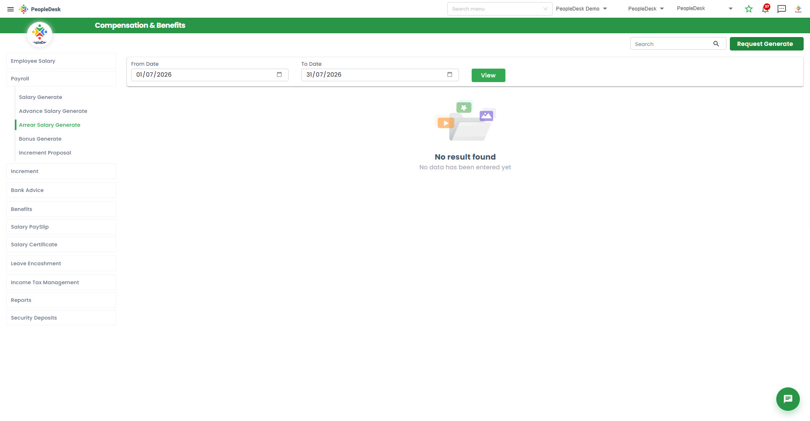

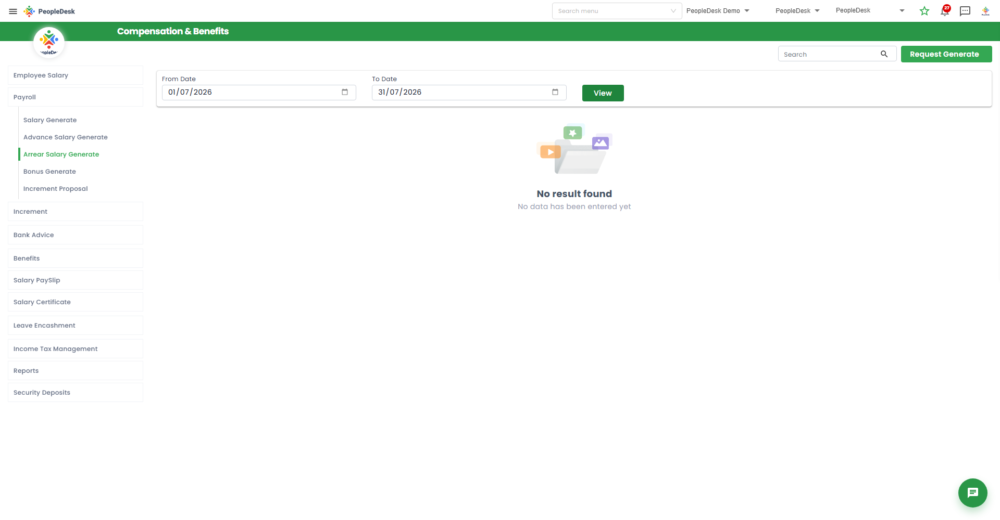

**What it does**: Generates arrear salary — backdated pay owed to an employee (e.g. from a retroactive increment or missed payment) for a chosen date range.

**Key fields / columns**: The list uses From Date / To Date filters; no batches existed at capture time ("No result found").

**Buttons & actions**:
- **From Date / To Date** filters with a **View** button.
- **Search box**.
- **Request Generate** (top right, green) — starts a new arrear salary generation request.

**Show screen**: The second screenshot was captured by clicking **View** again on the same page; it renders identically to the list view above (same filters, same "No result found" state) — no separate detail/record screen appeared because no arrear batch has been generated yet.

**How to use it**:
1. Open Compensation & Benefits > Payroll > Arrear Salary Generate.
2. Click **Request Generate**.
3. Specify the date range the arrear covers and the affected employees/workplace.
4. Submit the request; once processed, it will appear in this list with a status you can track and send for approval.

**Pro-tip**: Use Arrear Salary Generate (not a manual allowance) whenever an increment or correction needs to be applied retroactively — it keeps a clean audit trail of what was owed and for which period.

---

#### Bonus Generate

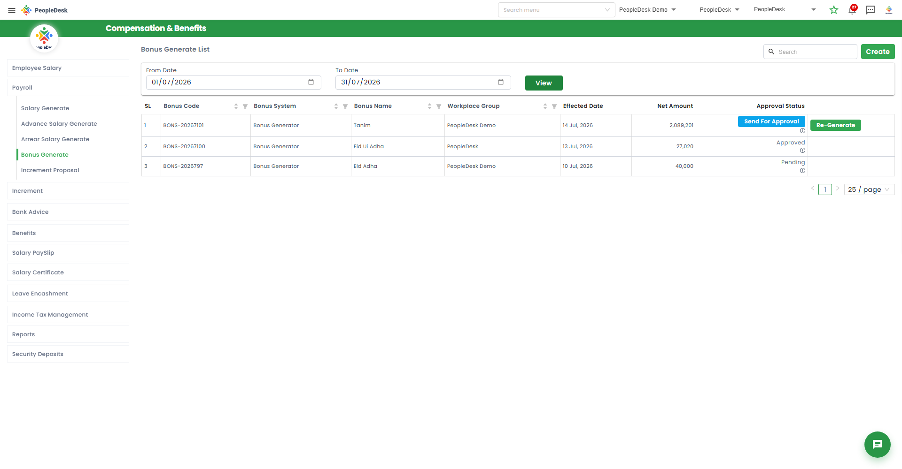

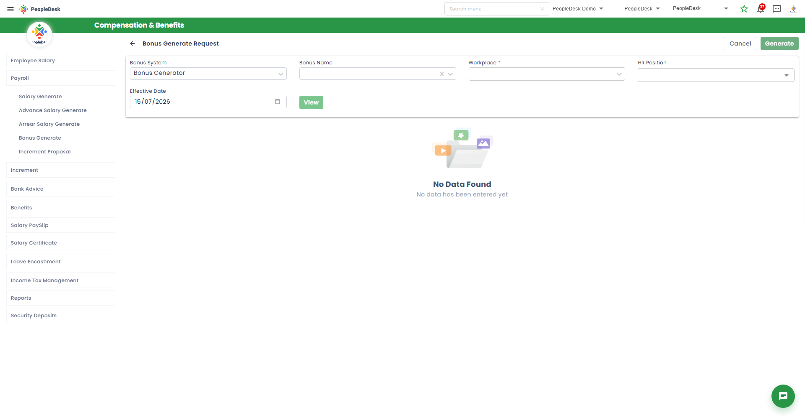

**What it does**: Runs bonus payouts (e.g. festival bonuses like Eid) for employees and tracks each bonus batch through approval.

**Key fields / columns**:
- SL
- Bonus Code
- Bonus System (e.g. Bonus Generator)
- Bonus Name (e.g. "Eid Ul Adha", "Tanim")
- Workplace Group
- Effected Date
- Net Amount
- Approval Status (Send For Approval / Approved / Pending)

**Buttons & actions**:
- **From Date / To Date** filters with a **View** button.
- **Search box**.
- **Create** (top right) — opens the Bonus Generate Request form.
- **Send For Approval** (blue button) — submits a pending bonus batch for approval.
- **Re-Generate** (green button) — recalculates a bonus batch.
- Rows already **Approved** or **Pending** show only their status text (no action button) or await further processing.

**Create form fields** (Bonus Generate Request): Bonus System (dropdown, e.g. Bonus Generator), Bonus Name, Workplace (required), HR Position, Effective Date, plus **Cancel** and **Generate** buttons, and a **View** button that lists matching employees below ("No Data Found" until Workplace and other filters are set).

**How to use it**:
1. Open Compensation & Benefits > Payroll > Bonus Generate.
2. Click **Create**, name the bonus (e.g. "Eid Bonus"), select the Workplace (required) and Effective Date.
3. Click **View** to preview affected employees, then **Generate**.
4. Track the new batch's Approval Status and click **Send For Approval** when ready.

**Pro-tip**: The Workplace field is mandatory on the Bonus Generate form — if **View**/**Generate** appears to do nothing, check that Workplace is filled in first.

---

#### Increment Proposal

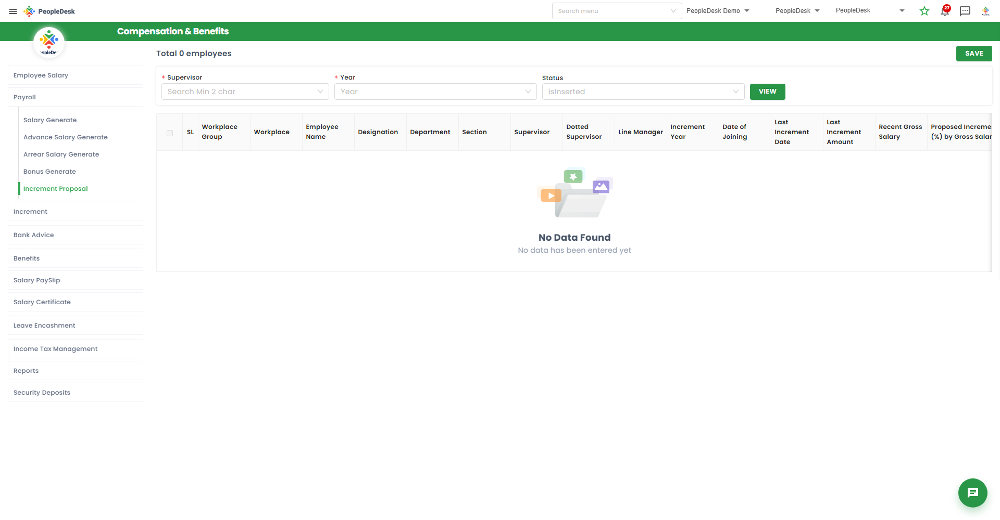

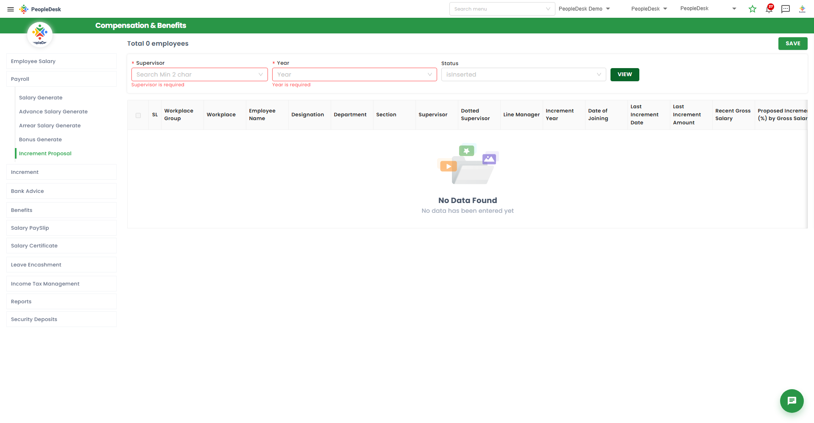

**What it does**: Lets a supervisor propose salary increments for their team for a given year, listing each employee's current gross salary alongside the proposed increment percentage, before it becomes an official increment.

**Key fields / columns**:
- SL, Workplace Group, Workplace
- Employee Name, Designation, Department, Section
- Supervisor, Dotted Supervisor, Line Manager
- Increment Year, Date of Joining
- Last Increment Date, Last Increment Amount
- Recent Gross Salary, Proposed Increment (%) by Gross Salary

**Buttons & actions**:
- **Supervisor** search field (required, minimum 2 characters) — selects whose team's proposals to view.
- **Year** dropdown (required) — the increment year being proposed.
- **Status** dropdown (defaulted to "isInserted") — filters by proposal status.
- **View** (green button) — loads matching proposals.
- **SAVE** (top right) — saves changes made to the proposal list.

**Show screen**: Clicking **View** without filling in the required fields returns a validation error, not a record detail — the screenshot shows **"Supervisor is required"** and **"Year is required"** in red beneath their respective fields, with the table still empty ("No Data Found").

**How to use it**:
1. Open Compensation & Benefits > Payroll > Increment Proposal.
2. Enter a Supervisor name (at least 2 characters) and select a Year — both are mandatory.
3. Click **View** to load that supervisor's team with their current gross salary and last increment history.
4. Enter the Proposed Increment (%) for each employee.
5. Click **SAVE** to store the proposal for further review before it's converted into an actual Increment.

**Pro-tip**: Fill in both Supervisor and Year before clicking View — leaving either blank produces the red "required" validation shown above instead of any data.

---

#### Increment

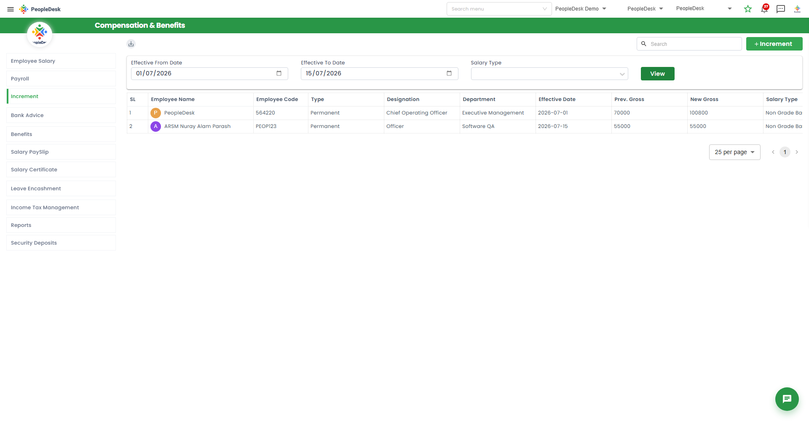

**What it does**: Records finalized salary increments (raises) already applied to employees, showing the change from previous to new gross salary.

**Key fields / columns**:
- SL, Employee Name, Employee Code, Type (e.g. Permanent)
- Designation, Department
- Effective Date
- Prev. Gross, New Gross
- Salary Type

**Buttons & actions**:
- **Effective From Date / Effective To Date** filters and **Salary Type** dropdown, with a **View** button — narrows the list to a date range.
- **Download icon** (top left) — exports the list.
- **Search box**.
- **+ Increment** (top right, green) — records a new increment directly (outside the proposal workflow).

**Show screen**: The second screenshot is the same list rendered again after clicking View — it shows the identical two rows (PeopleDesk Chief Operating Officer and ARSM Nuray Alam Parash, Officer) with no additional detail revealed; there is no separate record-detail popup in this capture.

**How to use it**:
1. Open Compensation & Benefits > Increment.
2. Set the Effective From/To Date range and optionally a Salary Type, then click **View**.
3. Review each employee's Prev. Gross vs. New Gross to confirm the increment amount.
4. Click **+ Increment** to add a new increment record directly for an employee.

**Pro-tip**: Use this page as the audit log of actual pay raises — cross-check its "Prev. Gross" and "New Gross" figures against the Increment Proposal page whenever a raise looks larger or smaller than expected.

---

#### Bank Advice

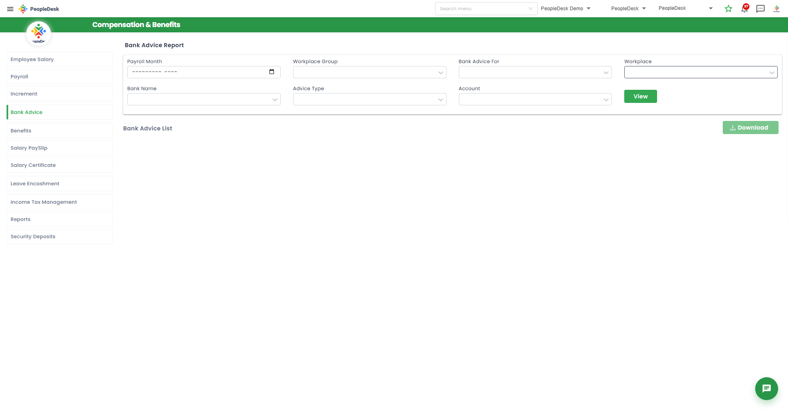

**What it does**: Generates a bank advice — the payment instruction file/report sent to a bank so it can credit employees' salaries into their bank accounts — for a chosen payroll month and bank/account.

**Key fields / columns**: Bank Advice List (below the filters) is where generated advices would be listed; it was empty at capture time.

**Buttons & actions**:
- **Payroll Month** field.
- **Workplace Group** dropdown.
- **Bank Advice For** dropdown.
- **Workplace** dropdown.
- **Bank Name** dropdown.
- **Advice Type** dropdown.
- **Account** dropdown.
- **View** (green button) — runs the search with the above filters.
- **Download** (green button, above the Bank Advice List) — downloads the generated advice list/file.

**Show screen**: Clicking **View** with none of the filters filled in returns validation errors rather than a bank advice record: **"Payroll month is required"**, **"Workplace Group is required"**, **"Workplace is required"**, **"Bank is required"**, **"This Field is required"** (Advice Type), and **"Account is required"** all appear in red beneath their fields, and the Bank Advice List remains empty.

**How to use it**:
1. Open Compensation & Benefits > Bank Advice.
2. Select the Payroll Month, Workplace Group, Workplace, Bank Name, Advice Type, and Account — all are required.
3. Click **View** to generate the Bank Advice List for that combination.
4. Click **Download** to export the advice file to send to the bank.

**Pro-tip**: Every filter on this page is mandatory — if View returns nothing, check for the red "required" messages first rather than assuming there's no data for the month.

---

#### Leave Benefit Payment

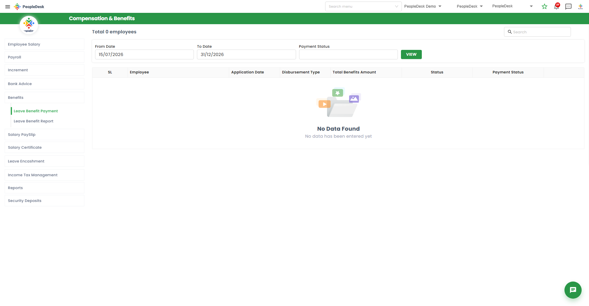

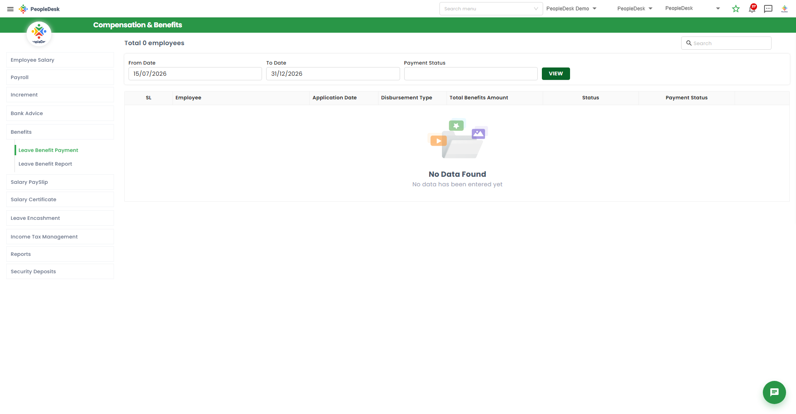

**What it does**: Lists and processes payments for leave benefits — cash disbursements owed to employees for unused/encashable leave — within a chosen date range.

**Key fields / columns**:
- SL, Employee
- Application Date
- Disbursement Type
- Total Benefits Amount
- Status, Payment Status

**Buttons & actions**:
- **From Date / To Date** filters and **Payment Status** field, with a **VIEW** button.
- **Search box** (top right).

**Show screen**: The second screenshot shows the same page after clicking **VIEW** — it still displays "Total 0 employees" and "No Data Found," identical to the initial list, since no leave benefit payments exist for the queried date range.

**How to use it**:
1. Open Compensation & Benefits > Benefits > Leave Benefit Payment.
2. Set the From Date / To Date range and, optionally, a Payment Status.
3. Click **VIEW** to list any pending or completed leave benefit disbursements.
4. Process/pay entries as they appear in the table.

**Pro-tip**: If the list stays at "Total 0 employees" after adjusting the date range, widen the range further back — leave benefit payments are usually tied to leave encashment requests approved earlier.

---

#### Leave Benefit Report

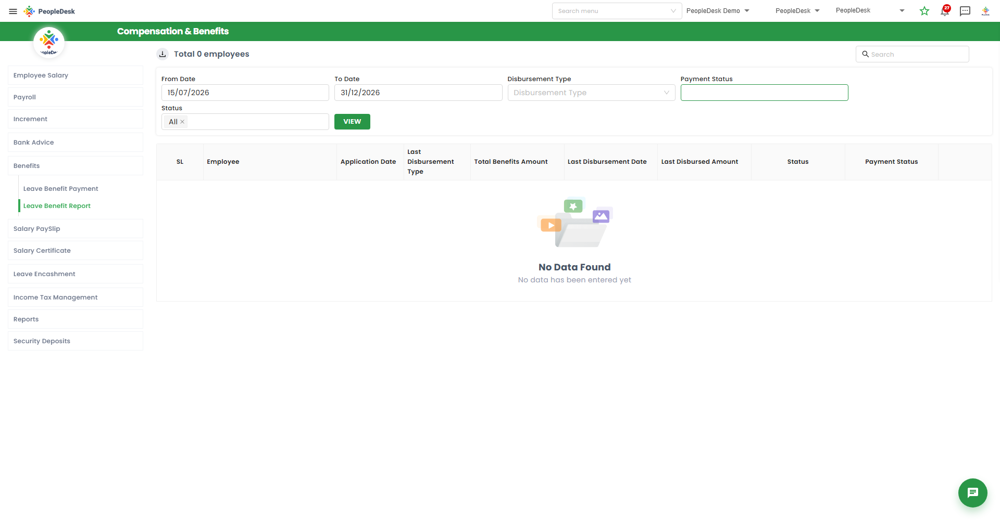

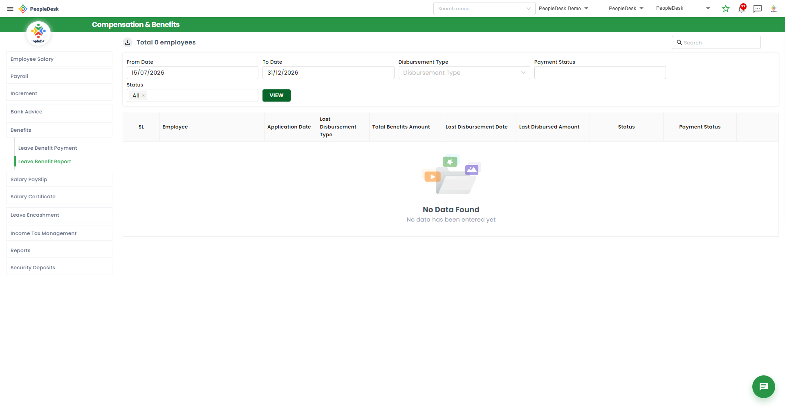

**What it does**: A reporting view of leave benefit disbursement history, showing the last disbursement made to each employee alongside the running total benefits amount.

**Key fields / columns**:
- SL, Employee
- Application Date
- Last Disbursement Type
- Total Benefits Amount
- Last Disbursement Date
- Last Disbursed Amount
- Status, Payment Status

**Buttons & actions**:
- **Download icon** (top left) — exports the report.
- **From Date / To Date** filters, **Disbursement Type** dropdown, **Payment Status** field, **Status** multi-select (defaulted to "All").
- **VIEW** (green button) — runs the report.
- **Search box** (top right).

**Show screen**: Identical to the initial list — clicking **VIEW** again still returns "Total 0 employees" / "No Data Found," since no leave benefit disbursements have been recorded yet for this workplace.

**How to use it**:
1. Open Compensation & Benefits > Benefits > Leave Benefit Report.
2. Adjust the From/To Date, Disbursement Type, Payment Status, or Status filters as needed.
3. Click **VIEW** to pull the disbursement history.
4. Click the **Download** icon to export the report for records or audit.

**Pro-tip**: Use the Status filter (defaulted to "All") to isolate only "Pending" or "Paid" disbursements when reconciling leave benefit payouts at period end.

---

#### PaySlip

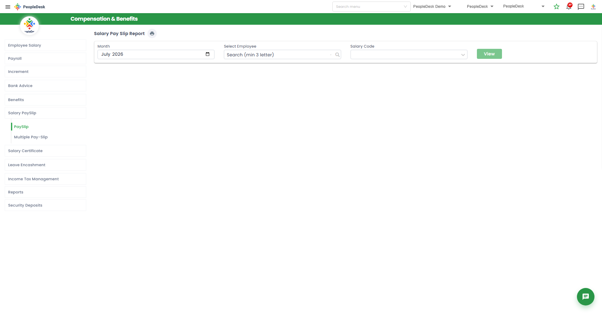

**What it does**: Generates and prints an individual employee's salary pay slip (a formal statement of earnings and deductions) for a chosen month.

**Key fields / columns**:
- Month
- Select Employee (search, minimum 3 letters)
- Salary Code

**Buttons & actions**:
- **Print icon** (next to the "Salary Pay Slip Report" title) — prints the currently displayed pay slip.
- **Month** date picker.
- **Select Employee** search box (type at least 3 letters to search).
- **Salary Code** dropdown.
- **View** (green button) — generates the pay slip for the selected employee and month.

**How to use it**:
1. Open Compensation & Benefits > Salary PaySlip > PaySlip.
2. Choose the Month.
3. Search for and select the Employee (type at least 3 letters).
4. Optionally pick a specific Salary Code, then click **View**.
5. Use the print icon to print or save the pay slip once it renders.

**Pro-tip**: If an employee's name doesn't show up while typing, confirm you've typed at least 3 characters — the search field won't query with fewer.

---

#### Multiple Pay-Slip

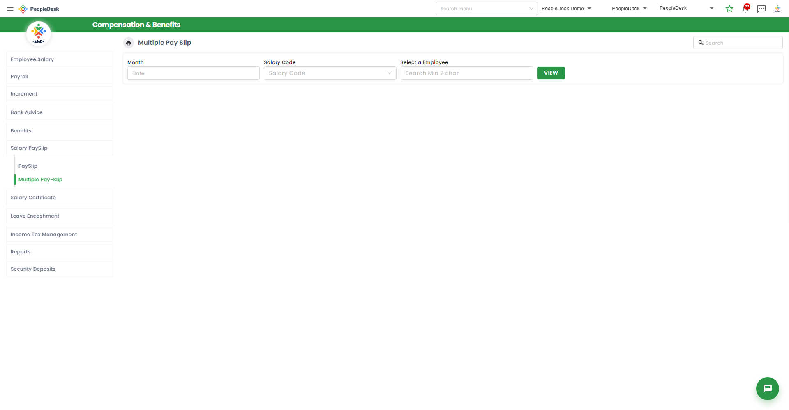

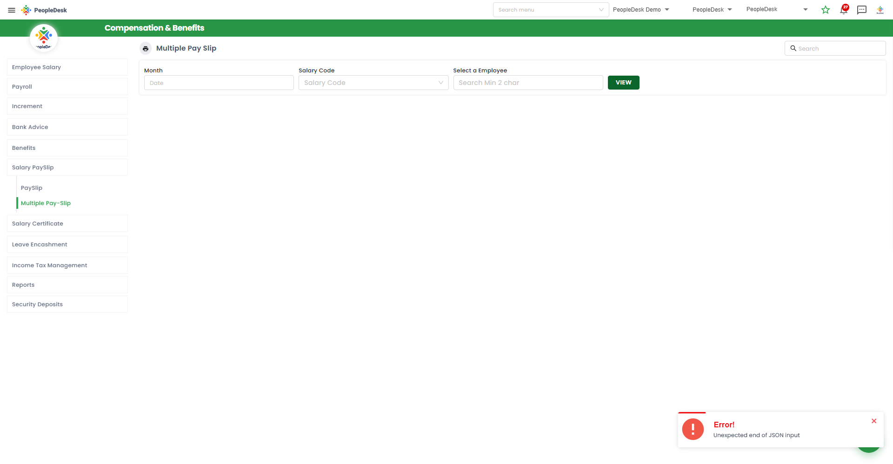

**What it does**: Generates pay slips for multiple employees at once (e.g. an entire department for a given month) instead of one at a time.

**Key fields / columns**:
- Month
- Salary Code
- Select a Employee (search, minimum 2 characters)

**Buttons & actions**:
- **Print icon** (next to the "Multiple Pay Slip" title) — prints the generated batch of pay slips.
- **Month** date picker.
- **Salary Code** dropdown.
- **Select a Employee** search box.
- **VIEW** (green button) — generates the pay slips for the selection.

**Show screen**: Clicking **VIEW** without selecting a Month, Salary Code, or Employee produced a technical error toast rather than any pay slip data: **"Error! Unexpected end of JSON input"** in the bottom-right corner. This indicates the request needs at least one filter populated before it can return results — it is not a genuine pay slip preview.

**How to use it**:
1. Open Compensation & Benefits > Salary PaySlip > Multiple Pay-Slip.
2. Select the Month and/or Salary Code, and optionally search for specific employees.
3. Click **VIEW** to generate the batch of pay slips.
4. Use the print icon to print or export the full batch.

**Pro-tip**: If you see the "Unexpected end of JSON input" error, don't assume the feature is broken — first make sure Month or Salary Code is actually selected before clicking VIEW.

---

#### Salary Certificate

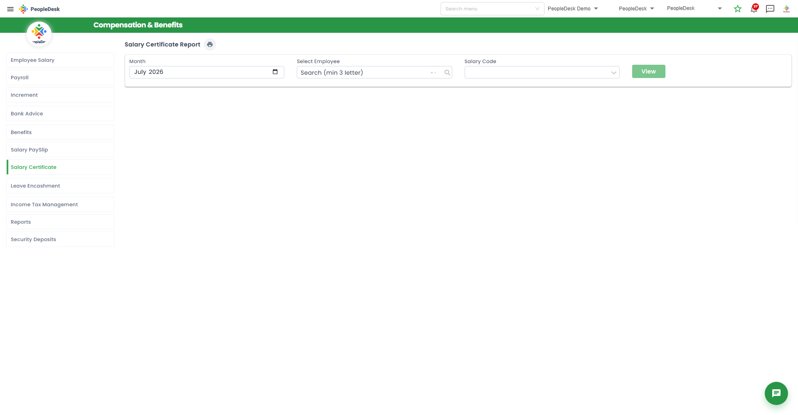

**What it does**: Generates a formal salary certificate document for an employee for a selected month — commonly used for visa, loan, or verification purposes.

**Key fields / columns**:
- Month
- Select Employee (search, minimum 3 letters)
- Salary Code

**Buttons & actions**:
- **Print icon** (next to the "Salary Certificate Report" title) — prints the generated certificate.
- **Month** date picker.
- **Select Employee** search box (minimum 3 letters).
- **Salary Code** dropdown.
- **View** (green button) — generates the certificate for the selected employee/month.

**How to use it**:
1. Open Compensation & Benefits > Salary Certificate.
2. Choose the Month.
3. Search for and select the Employee (at least 3 letters).
4. Optionally choose a Salary Code, then click **View**.
5. Print the certificate using the print icon once it renders.

**Pro-tip**: Generate the certificate only after that month's salary has been approved — certificates pull live salary data, so requesting one too early may show incomplete or unapproved figures.

#### Leave Encashment

**What it does**: This page is reached from the Compensation & Benefits menu's Leave Encashment link, and manages leave encashment (paying employees cash for unused leave days instead of letting them carry over or lapse). Note: the capture for this page actually shows the **Salary Assign** screen (the left sidebar highlights "Salary Assign" under Employee Salary) rather than a dedicated encashment form, listing employees and their salary-assignment status - this is the screen that was on-screen at the time of capture, so treat the fields below as what is actually visible.

**Key fields / columns**: Total employees counter, a status dropdown ("Not Assigned"), and a table with SL, Employee ID, Employee Name, Designation, Department, Employment Type, From Date, Perday Salary, Basic Salary, Gross Salary, and Status.

**Buttons & actions**:
- **Status dropdown ("Not Assigned")** – filters the list by assignment status.
- **Search box** – finds a specific employee by name or ID.
- **+ Bulk Upload** (green) – opens a bulk-upload flow to assign values (e.g., encashment or salary data) for many employees at once via a spreadsheet.
- **Pagination controls** ("25 per page", arrows) – move between pages of the employee list.

**How to use it**: 1. Open Compensation & Benefits > Leave Encashment from the left menu. 2. Use the status dropdown or search box to locate the employees you need. 3. Use **+ Bulk Upload** if you need to process many employees together rather than one at a time.

**Pro-tip**: If the page you land on doesn't look like a dedicated encashment form, check the left sidebar to confirm which sub-page is actually highlighted/active before entering data, so you don't edit the wrong record type.

---

#### Income Tax Assign

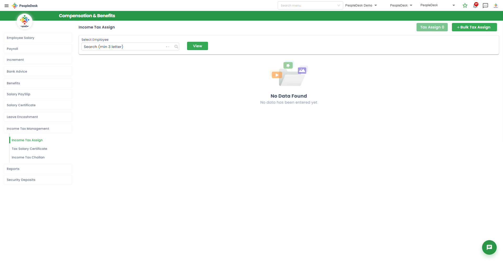

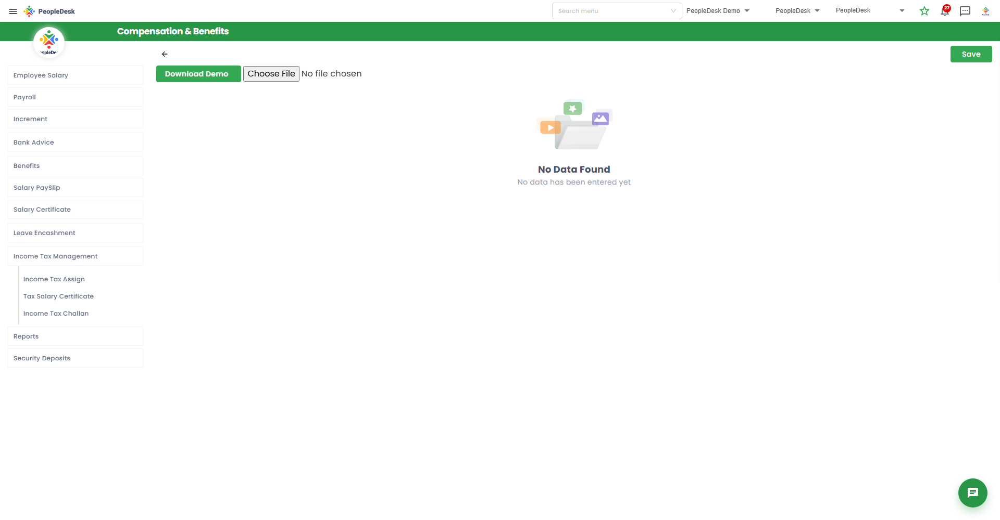

**What it does**: Lets HR/Payroll assign income tax details to individual employees, which then feed into payroll tax deductions and tax certificates.

**Key fields / columns**: Select Employee (search, minimum 3 letters). The results table (empty in this capture, "No Data Found") would list assigned employees once records exist.

**Buttons & actions**:
- **Select Employee search box + View** – looks up an employee and displays their current tax assignment.
- **Tax Assign 0** (light green pill button) – shows a running count of employees already assigned; likely also acts as a filter/tab for assigned records.
- **+ Bulk Tax Assign** (dark green, top right) – opens the bulk assignment screen shown in the second image.

On the **Bulk Tax Assign** screen:
- **Back arrow** – returns to the Income Tax Assign list.
- **Download Demo** – downloads a template spreadsheet showing the expected column layout.
- **Choose File** – select the filled-in spreadsheet to upload.
- **Save** – submits the uploaded file to bulk-assign tax details to the matching employees.

**How to use it**: 1. Go to Income Tax Management > Income Tax Assign. 2. For a single employee, search their name and click **View**. 3. For many employees, click **+ Bulk Tax Assign**, download the demo template, fill it in, choose the file, and click **Save**.

**Pro-tip**: Always download the latest demo template before a bulk upload - column order or required fields can change between releases, and a mismatched template will fail the import.

---

#### Tax Salary Certificate

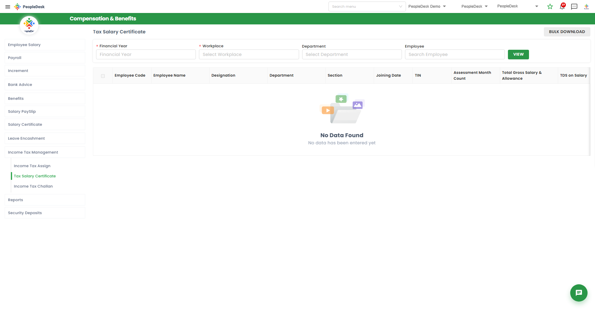

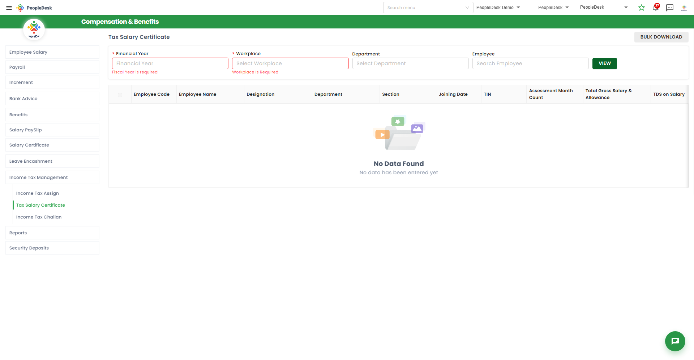

**What it does**: Generates a tax salary certificate report - a statement of an employee's gross salary, allowances, and tax withheld for a given financial year, typically needed for personal income tax filing.

**Key fields / columns**: Filters - Financial Year (required), Workplace (required), Department, Employee. Results table columns - Employee Code, Employee Name, Designation, Department, Section, Joining Date, TIN (Taxpayer Identification Number), Assessment Month Count, Total Gross Salary & Allowance, TDS on Salary (Tax Deducted at Source).

**Buttons & actions**:
- **BULK DOWNLOAD** (top right) – downloads certificates for multiple employees at once (e.g., as a batch of PDFs).
- **VIEW** – runs the report using the selected filters.

**How to use it**: 1. Open Income Tax Management > Tax Salary Certificate. 2. Select the **Financial Year** and **Workplace** (both mandatory), optionally narrow by Department or Employee. 3. Click **VIEW** to list matching employees, or use **BULK DOWNLOAD** to export certificates for everyone in scope.

**Pro-tip**: The second screenshot shows what happens if you click VIEW without filling the required fields - "Fiscal Year is required" and "Workplace Is Required" appear in red under those boxes. Always fill Financial Year and Workplace first to avoid this validation stop.

---

#### Income Tax Challan

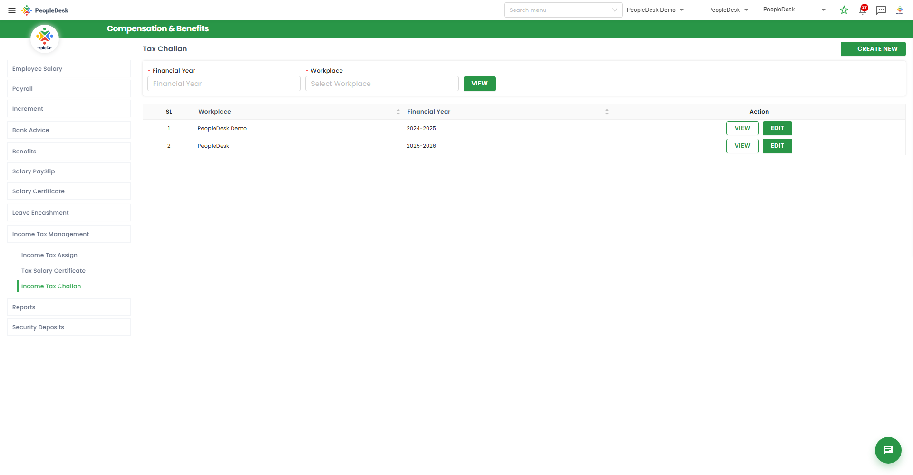

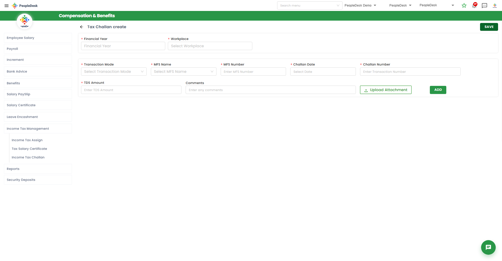

**What it does**: Tracks Tax Challans - the official receipts/records confirming that deducted tax (TDS) has been deposited with the tax authority - grouped by workplace and financial year.

**Key fields / columns**: Filters - Financial Year (required), Workplace (required). List table - SL, Workplace, Financial Year, Action. Two existing records are shown: PeopleDesk Demo (2024-2025) and PeopleDesk (2025-2026).

**Buttons & actions**:
- **VIEW** (filter bar) – filters the challan list by financial year/workplace.
- **+ CREATE NEW** (top right) – opens the Tax Challan create form.
- **VIEW** (per row) – opens the challan record read-only.
- **EDIT** (per row) – opens the challan record for editing.

On the **Tax Challan create** form:
- **Financial Year / Workplace** (required) – identifies which period and entity the challan belongs to.
- **Transaction Mode, MFS Name, MFS Number** (required) – the payment channel used, e.g., a Mobile Financial Service (MFS) like bKash/Nagad, and the transaction/account number used.
- **Challan Date, Challan Number** (required) – the date and reference number printed on the official challan.
- **TDS Amount** (required) – the tax amount deposited.
- **Comments** – free-text notes.
- **Upload Attachment** – attach a scanned copy of the challan receipt.
- **ADD** – adds this challan entry to the form (for multiple entries) before saving.
- **SAVE** (top right) – saves the challan record.

**How to use it**: 1. Open Income Tax Management > Income Tax Challan. 2. To review existing challans, set Financial Year/Workplace and click **VIEW**, then use **VIEW**/**EDIT** on a row. 3. To log a new challan, click **+ CREATE NEW**, fill in the transaction and challan details, optionally upload the receipt, click **ADD**, then **SAVE**.

**Pro-tip**: Upload the scanned challan receipt via **Upload Attachment** at the time of entry - it's much easier to attach proof immediately than to track it down again during a tax audit.

---

#### Salary Summary Report

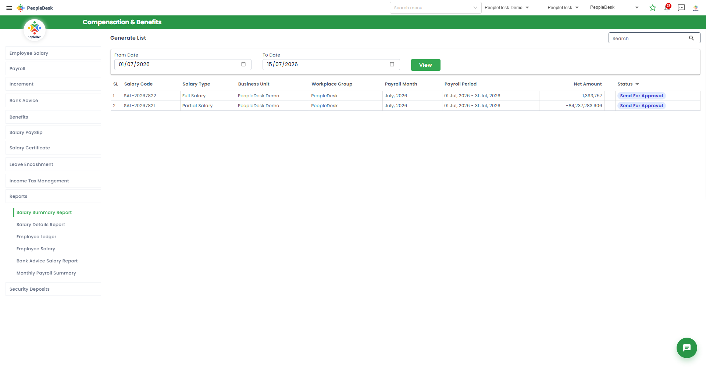

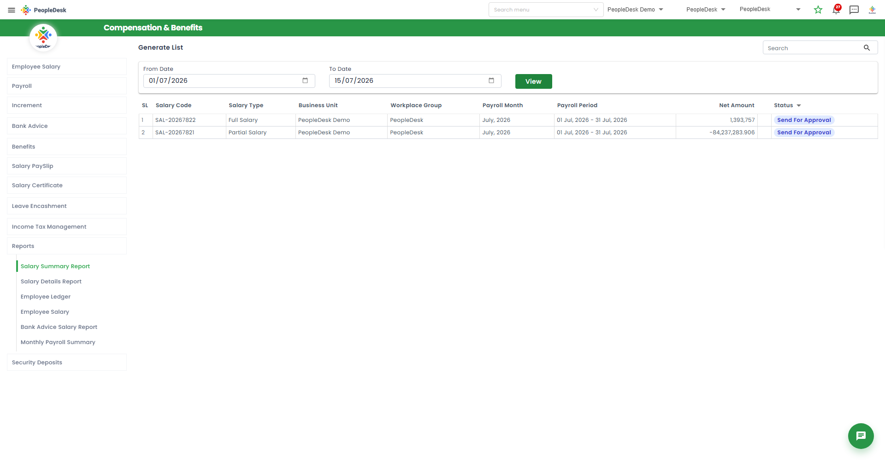

**What it does**: Gives a high-level, per-payroll-run summary of processed salaries - useful for seeing which payroll batches exist and their approval status at a glance.

**Key fields / columns**: Filters - From Date, To Date. Table columns - SL, Salary Code, Salary Type (e.g., Full Salary, Partial Salary), Business Unit, Workplace Group, Payroll Month, Payroll Period, Net Amount, Status (sortable).

**Buttons & actions**:
- **View** – regenerates the list for the chosen date range.
- **Search box** (top right) – filters the generated list further.
- **Status column sort arrow** – reorders rows by approval status.
- **Send For Approval** (blue pill, per row) – submits that payroll batch into the approval workflow.

**How to use it**: 1. Open Reports > Salary Summary Report. 2. Set the From Date/To Date range and click **View**. 3. Review each salary code's Net Amount and Status, and click **Send For Approval** on any batch that still needs to be routed for sign-off.

**Pro-tip**: Watch for negative Net Amount values (as seen on the Partial Salary row) - they usually indicate an adjustment/reversal batch and are worth double-checking before sending for approval.

---

#### Salary Details Report

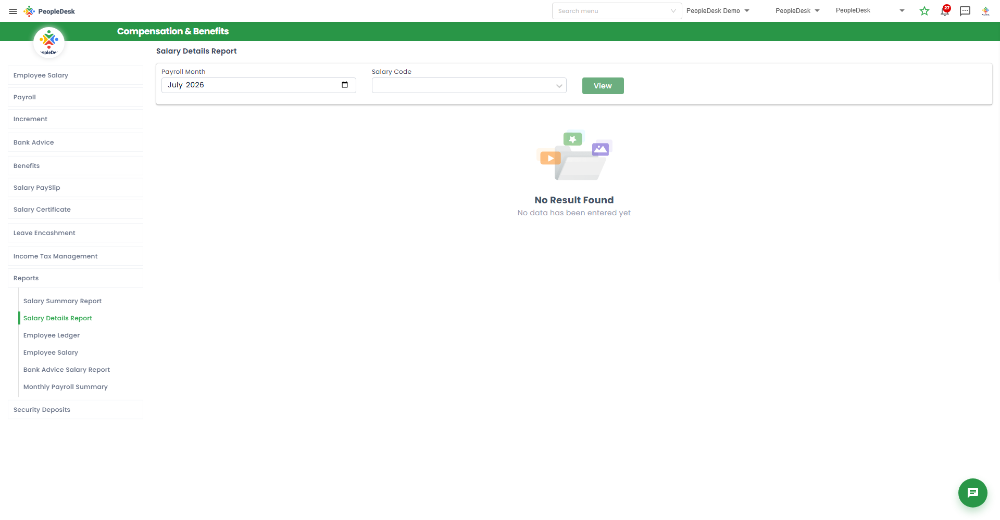

**What it does**: Provides a detailed, per-employee breakdown of a specific payroll run, filtered by payroll month and salary code.

**Key fields / columns**: Payroll Month (date picker, defaults to the current month), Salary Code (dropdown).

**Buttons & actions**:
- **View** – runs the report for the selected Payroll Month and Salary Code.

**How to use it**: 1. Open Reports > Salary Details Report. 2. Confirm or change the Payroll Month. 3. Select a Salary Code from the dropdown. 4. Click **View** to display the detailed breakdown for that payroll run.

**Pro-tip**: If you get "No Result Found" as shown here, double check that a Salary Code has actually been selected - the report needs both filters to return data.

---

#### Employee Ledger

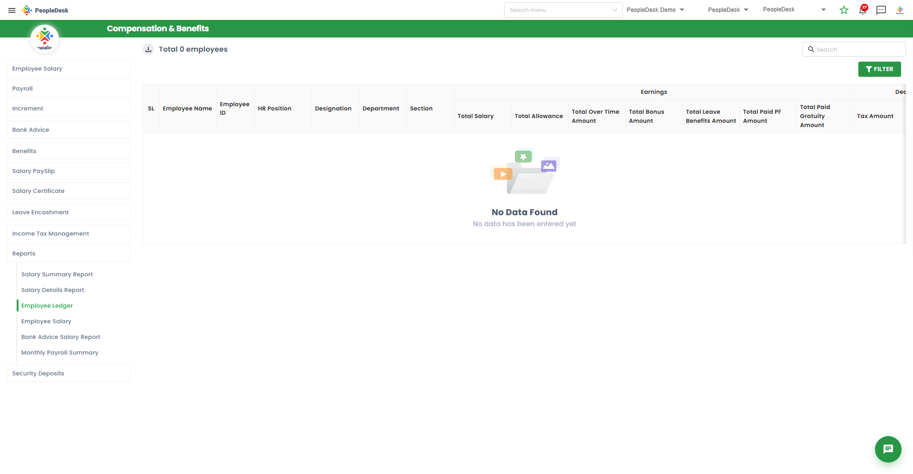

**What it does**: Shows a cumulative financial ledger per employee, totaling their earnings and deductions (salary, allowances, overtime, bonus, leave benefits, provident fund, gratuity, tax, etc.) over a period.

**Key fields / columns**: SL, Employee Name, Employee ID, HR Position, Designation, Department, Section, then an "Earnings" column group with Total Salary, Total Allowance, Total Over Time Amount, Total Bonus Amount, Total Leave Benefits Amount, Total Paid PF Amount (Provident Fund), Total Paid Gratuity Amount, and a Tax Amount column under a (partially cut off) "Deductions" group.

**Buttons & actions**:
- **Download icon** (top left) – exports the ledger.
- **FILTER** (green, top right) – opens filter options to scope the ledger (e.g., by employee, department, or date range).

**How to use it**: 1. Open Reports > Employee Ledger. 2. Click **FILTER** to set the scope of employees/period you want. 3. Review the earnings and deductions totals per employee, and use the download icon to export the ledger for offline analysis.

**Pro-tip**: Because this report combines many earning and deduction categories in one wide table, export it via the download icon and analyze it in a spreadsheet rather than scrolling horizontally on-screen.

---

#### Employee Salary

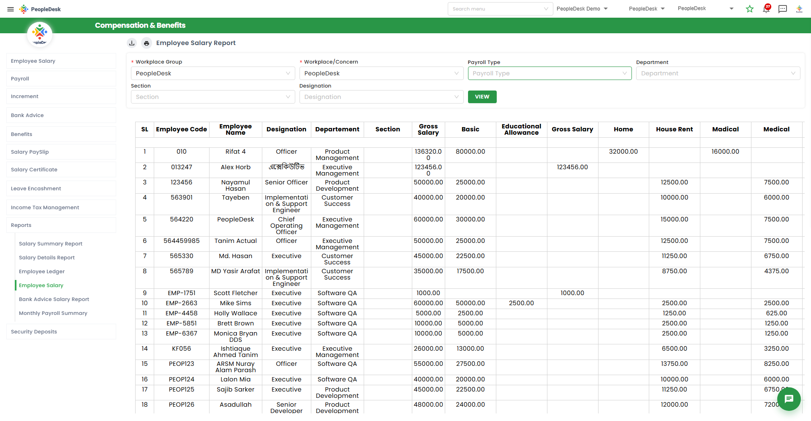

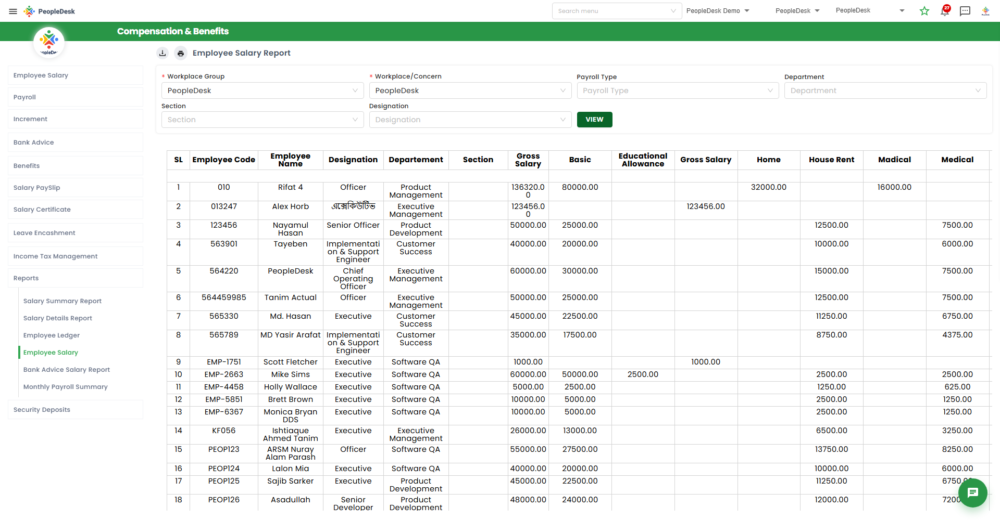

**What it does**: A detailed salary-structure report that breaks down each employee's gross salary into its component parts (basic, allowances, house rent, medical, etc.), filterable by workplace, payroll type, department, section, and designation.

**Key fields / columns**: Filters - Workplace Group (required), Workplace/Concern (required), Payroll Type, Department, Section, Designation. Table columns - SL, Employee Code, Employee Name, Designation, Department, Section, Gross Salary, Basic, Educational Allowance, Gross Salary, Home, House Rent, Madical/Medical, and further salary-component columns extending off-screen.

**Buttons & actions**:
- **Download icon** – exports the report.
- **Print icon** – prints the report.
- **VIEW** – runs the report with the selected filters.

**How to use it**: 1. Open Reports > Employee Salary. 2. Select Workplace Group and Workplace/Concern (both required), and optionally Payroll Type, Department, Section, or Designation. 3. Click **VIEW** to list every employee's salary breakdown. 4. Use the download or print icons to export/print the results.

**Pro-tip**: Both captures of this page show the same populated result set, confirming the filters (Workplace Group/Workplace = PeopleDesk) were already applied - if you see an empty table instead, re-select the two required workplace fields and click **VIEW** again.

---

#### Bank Advice Salary Report

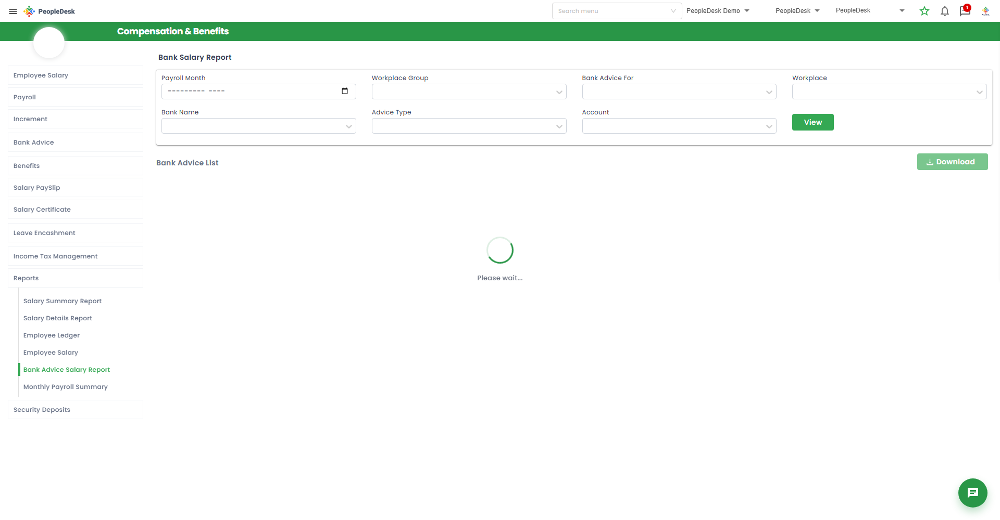

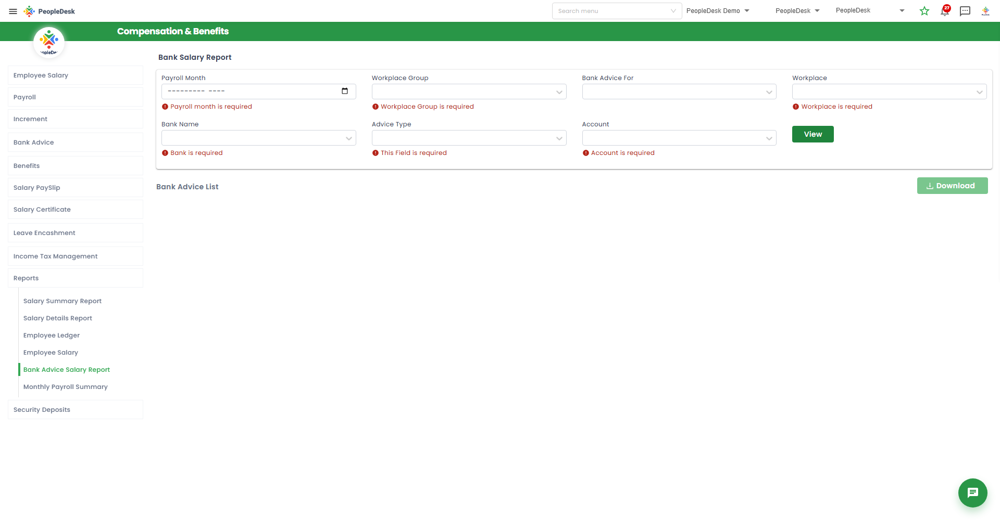

**What it does**: Generates a bank advice - the formal instruction/letter sent to a bank to disburse employee salaries into their accounts - and lists the resulting advices for download.

**Key fields / columns**: Payroll Month, Workplace Group, Bank Advice For, Workplace, Bank Name, Advice Type, Account.

**Buttons & actions**:
- **View** – generates the Bank Advice List using the selected filters.
- **Download** (green, under "Bank Advice List") – downloads the generated bank advice.

**How to use it**: 1. Open Reports > Bank Advice Salary Report. 2. Fill in Payroll Month, Workplace Group, Bank Advice For, Workplace, Bank Name, and Advice Type/Account. 3. Click **View**. 4. Once the list populates, click **Download** to get the bank advice file.

**Pro-tip**: The second screenshot shows exactly what's missing if you click View too early - every field (Payroll month, Workplace Group, Workplace, Bank, Advice Type, Account) turns red with a "required" message. Fill in every filter, not just the date, before clicking View.

---

#### Monthly Payroll Summary

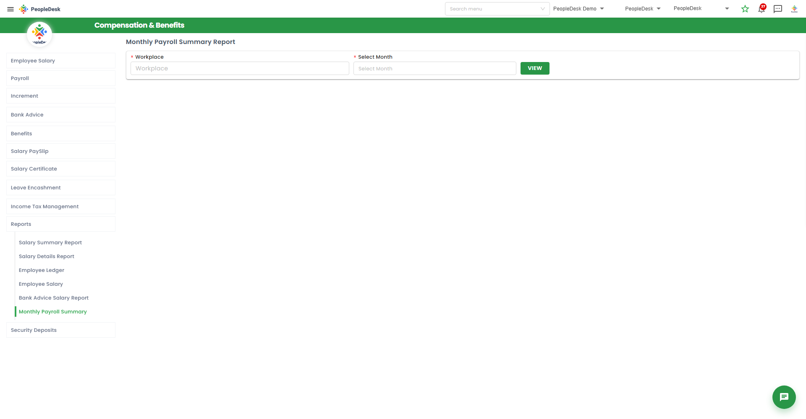

**What it does**: Produces a one-month payroll summary for a chosen workplace, useful as a quick monthly payroll total without the per-employee detail.

**Key fields / columns**: Workplace (required), Select Month (required).

**Buttons & actions**:
- **VIEW** – runs the summary for the chosen workplace and month.

**How to use it**: 1. Open Reports > Monthly Payroll Summary. 2. Select the Workplace. 3. Select the Month. 4. Click **VIEW** to display that month's payroll summary.

**Pro-tip**: As shown in the second screenshot, clicking VIEW with both fields blank simply returns "Workplace is required" and "Month Is Required" - there's no default workplace/month, so always set both before viewing.

---

#### Deposit

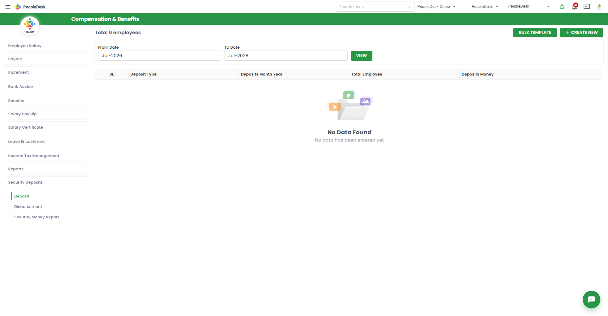

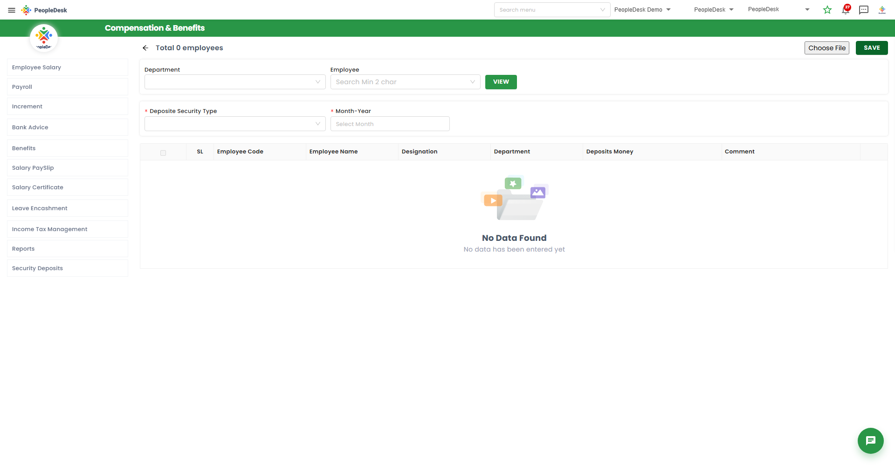

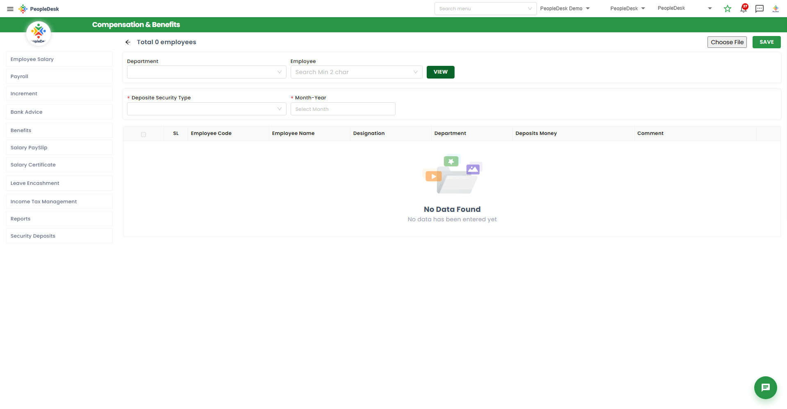

**What it does**: Manages security deposits collected from employees (refundable amounts held by the company, e.g., against equipment or advances), grouped into deposit batches by type and month.

**Key fields / columns**: Filters - From Date, To Date. List table - SL, Deposit Type, Deposits Month Year, Total Employee, Deposits Money.

**Buttons & actions**:
- **BULK TEMPLATE** (top right) – downloads a spreadsheet template for bulk-entering deposits.
- **+ CREATE NEW** (top right) – opens the deposit entry form shown in the second image.
- **VIEW** – filters the deposit batch list by date range.

On the **Deposit create/entry** screen:
- **Back arrow** – returns to the deposit list.
- **Choose File** – select a filled bulk-template spreadsheet to import.
- **SAVE** (top right) – saves the entered/imported deposit data.
- **Department, Employee** filters + **VIEW** – locate a specific employee to add a deposit for.
- **Deposite Security Type** (required) and **Month-Year** (required) – classify and date the deposit batch.
- Table (Employee Code, Employee Name, Designation, Department, Deposits Money, Comment) – lists employees included in this deposit batch, with an amount and optional comment for each.

**How to use it**: 1. Open Security Deposits > Deposit. 2. To review existing deposits, set From/To Date and click **VIEW**. 3. To record new deposits, click **+ CREATE NEW** (or download **BULK TEMPLATE** first for a batch import), choose the Deposit Security Type and Month-Year, add employees with their deposit amounts, and click **SAVE**.

**Pro-tip**: The "Show" view uses the same layout as the create form - if you click into a deposit batch expecting a read-only summary and instead see upload/save controls, you're likely looking at this same entry screen for that batch (currently empty here).

---

#### Disbursement

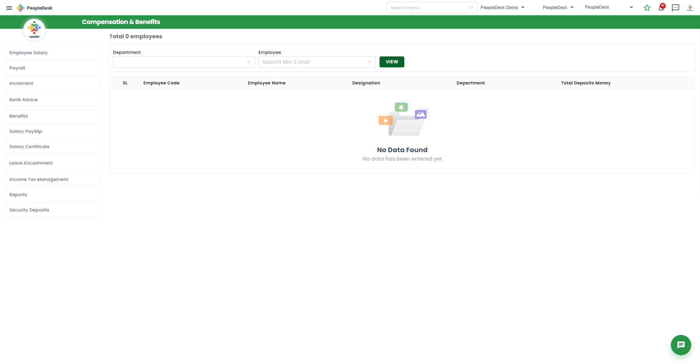

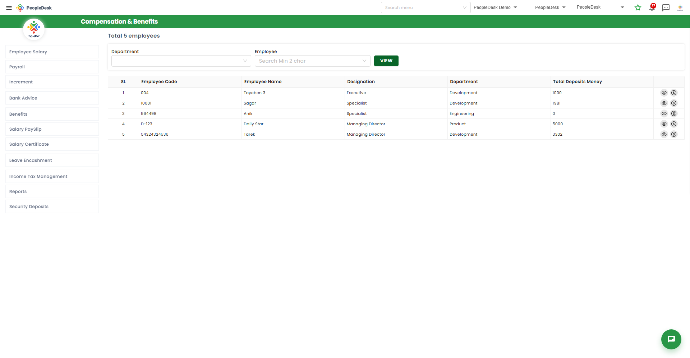

**What it does**: Handles disbursement - paying back previously collected security deposits to employees - and reports how much of each employee's deposit has been disbursed versus retained.

**Key fields / columns**: Filters - Department, Section, Employee, Status. Table - SL, Employee Code, Employee Name, Designation, Department, Section, Total Deposits Money, Disbursement Amount.

**Buttons & actions**:
- **VIEW** – runs the list using the selected filters.
- **Eye icon** (per row) – opens that employee's disbursement detail/record.

**How to use it**: 1. Open Security Deposits > Disbursement. 2. Optionally filter by Department, Section, Employee, or Status. 3. Click **VIEW** to list eligible employees. 4. Click the eye icon on a row to view or process that employee's disbursement.

**Pro-tip**: The second screenshot shows the populated result after filtering/viewing - 5 employees with both Total Deposits Money and Disbursement Amount visible side by side, making it easy to spot who still has an undisbursed balance (e.g., Daily Star shows a Disbursement Amount of 0 against a deposit of 5000).

---

#### Security Money Report

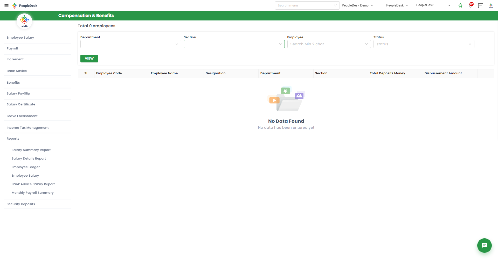

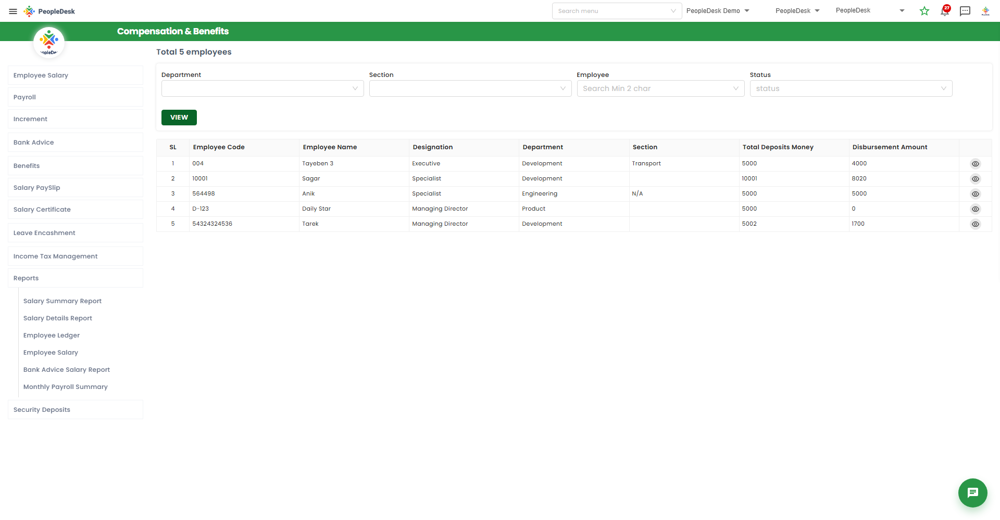

**What it does**: A summary report of all security money (deposits) held per employee, with quick actions to view or disburse each one - essentially the reporting/action hub tying the Deposit and Disbursement pages together.

**Key fields / columns**: Filters - Department, Employee. Table - SL, Employee Code, Employee Name, Designation, Department, Total Deposits Money, plus two action icons per row.

**Buttons & actions**:
- **VIEW** – filters the list by Department/Employee.
- **Eye icon** (per row) – opens that employee's deposit detail.
- **Dollar-sign icon** (per row) – initiates disbursing that employee's held deposit.

**How to use it**: 1. Open Security Deposits > Security Money Report. 2. Optionally filter by Department or Employee and click **VIEW**. 3. Review each employee's Total Deposits Money. 4. Click the eye icon to inspect details, or the dollar-sign icon to disburse funds back to the employee.

**Pro-tip**: Clicking through from this report (via the eye or dollar-sign icon) can land you on a Disbursement-style screen with extra Section/Status filters and a Disbursement Amount column, as shown in the second screenshot - if that drill-down comes back empty, re-check the Department/Section/Status filters on that follow-up screen rather than assuming the employee has no deposit.

## 9. Asset Management Module

Tracking company assets from registration through assignment, maintenance, and lifecycle reporting.

#### Asset Profile

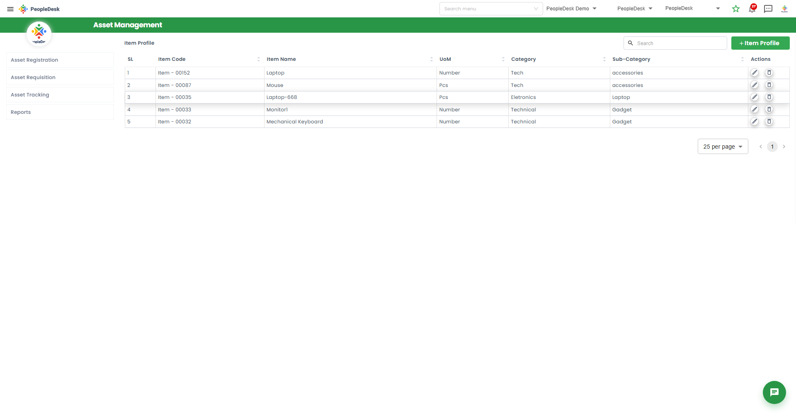

**What it does**: This is the master catalogue of every asset "item type" your organization tracks (the on-screen header reads **Item Profile**) — for example Laptop, Mouse, Monitor, or Mechanical Keyboard. It defines the item before individual physical units of it are registered with serial numbers.

**Key fields / columns**:
- SL (row number)
- Item Code (auto-generated, e.g. Item - 00152)
- Item Name
- UoM (Unit of Measure — Number, Pcs, etc.)
- Category
- Sub-Category
- Actions (edit / delete icons)

**Buttons & actions**:
- **+ Item Profile** (top right, green) — opens the Create Item Profile form to define a new asset item type.
- **Search** box — filters the list as you type an item code or name.
- **Edit** (pencil icon per row) — opens the item for editing.
- **Delete** (trash icon per row) — removes the item type.
- **25 per page** dropdown and page arrows (bottom right) — control pagination.

**How to use it**: 1. Open Asset Management > Asset Registration section, then navigate to the Item Profile page. 2. Click **+ Item Profile** to add a new item type. 3. Use **Search** to quickly locate an existing item. 4. Click the pencil icon to correct details, or the trash icon to remove an unused item type.

**Pro-tip**: Set up Item Category and Sub-Category consistently before creating items — they drive grouping and filtering everywhere else in Asset Management (requisitions, registration, reports).

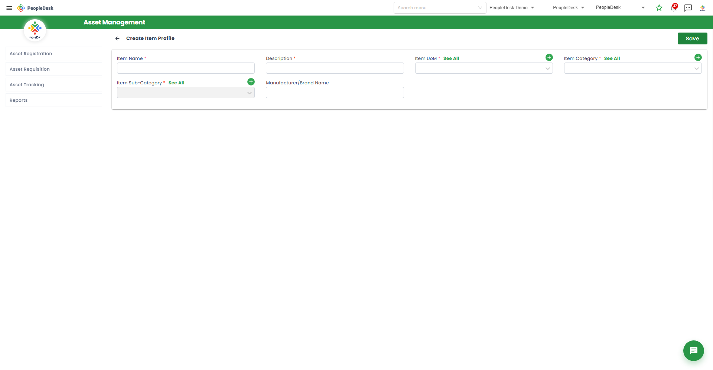

**Create form fields**:
- Item Name * (required)
- Description * (required)
- Item UoM * — dropdown with a **See All** link and a green **+** button to add a new unit of measure inline
- Item Category * — dropdown with **See All** and a green **+** button to add a new category inline
- Item Sub-Category * — dropdown with **See All** and a green **+** button to add a new sub-category inline
- Manufacturer/Brand Name (optional free text)
- **Save** button (top right) commits the new item type.

---

#### Asset Registration

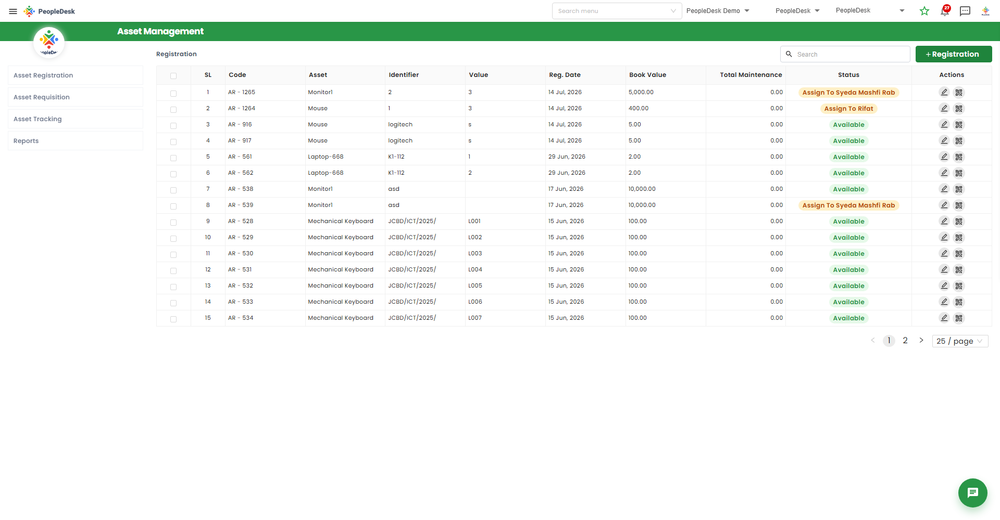

**What it does**: Registers individual physical units of an asset item (e.g. a specific laptop or mouse) with a unique register code, identifier, book value and current status, turning a generic "item" from the Item Profile into a trackable, serialized asset.

**Key fields / columns**:
- SL
- Code (register code, e.g. AR - 1265)
- Asset (item name)
- Identifier (serial/tag number)
- Value (quantity registered under that identifier)
- Reg. Date (registration date)
- Book Value
- Total Maintenance (accumulated maintenance cost)
- Status (Available, or "Assign To [Employee]" when already handed out)
- Actions (edit, QR-code icon per row)

**Buttons & actions**:
- **+ Registration** (top right, green) — opens the Create Registration form to register a new physical asset unit.
- **Search** box — filters the list.
- **Edit** (pencil icon) — edit a registered asset's details.
- **QR/grid icon** — generates or shows a QR/identification code for the asset unit, useful for physical tagging.
- Pagination controls (bottom right, "25 / page", page 1/2 navigation).

**How to use it**: 1. Go to Asset Registration. 2. Click **+ Registration**. 3. Pick the Item, fill in identifier/quantity/rate, click **Add**, then **Save**. 4. Repeat Add for multiple identifiers under one registration if needed. 5. Once saved, the asset appears here as "Available" until assigned.

**Pro-tip**: The Status column doubles as a quick assignment tracker — any row still reading "Available" is free stock ready to hand out via Asset Assign.

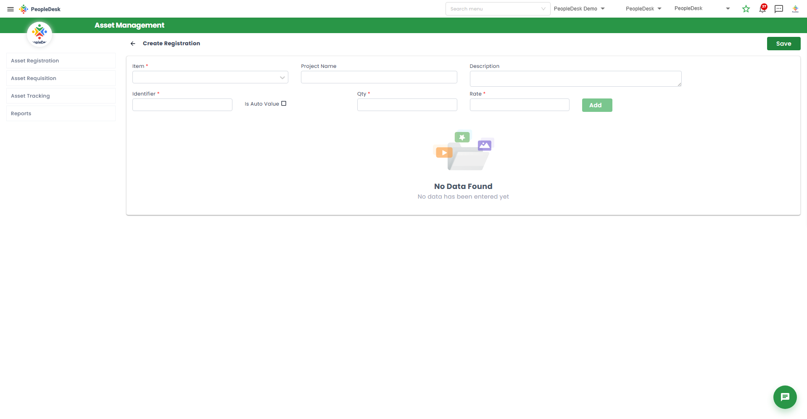

**Create form fields**:
- Item * (dropdown, pulled from Item Profile)
- Project Name (optional)
- Description (optional)
- Identifier * (serial number or tag)
- Is Auto Value (checkbox — lets the system auto-generate the identifier/value instead of manual entry)
- Qty * (required)
- Rate * (required, unit cost)
- **Add** button — adds the line to the registration batch (shown in a table below; starts as "No Data Found" until you add a line)
- **Save** button (top right) commits the whole registration.

---

#### Asset Requisition

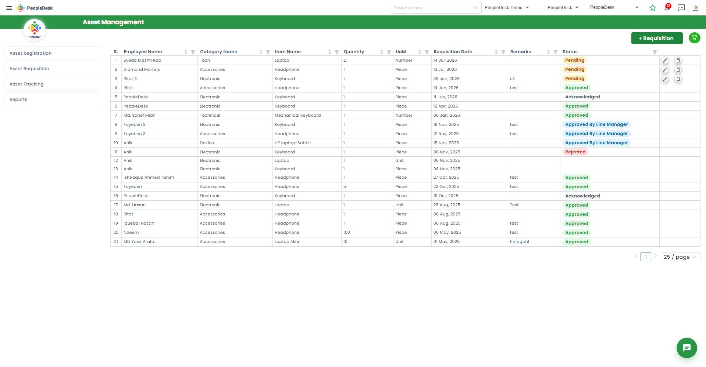

**What it does**: Lets employees request an asset item (e.g. a Laptop or Headphone) and lets approvers track each request through its approval workflow.

**Key fields / columns**:
- SL
- Employee Name
- Category Name
- Item Name
- Quantity
- UoM
- Requisition Date
- Remarks
- Status (Pending, Approved, Acknowledged, Approved By Line Manager, Rejected)
- Actions (edit/delete icons — shown only on rows still Pending)

**Buttons & actions**:
- **+ Requisition** (top right, green) — opens the Create Asset Requisition form.
- **Filter icon** (green circular funnel button, top right) — opens advanced filtering across the list.
- Column-header funnel/sort icons (Employee Name, Category Name, Item Name, Quantity, UoM, Requisition Date, Remarks, Status) — sort or filter by that column.
- **Edit** (pencil) — modify a pending requisition.
- **Delete** (trash) — remove a pending requisition.
- Pagination controls (bottom right).

**How to use it**: 1. Click **+ Requisition**. 2. Search and select the requesting Employee, choose the Item and Quantity, confirm the Requisition Date, add Remarks. 3. Save — the request starts as "Pending". 4. Track its Status here as it moves through approval (Approved, Acknowledged, etc.) or gets Rejected.

**Pro-tip**: Use the column funnel icons instead of scrolling — you can filter directly by Status (e.g. show only "Pending") to quickly see what still needs action.

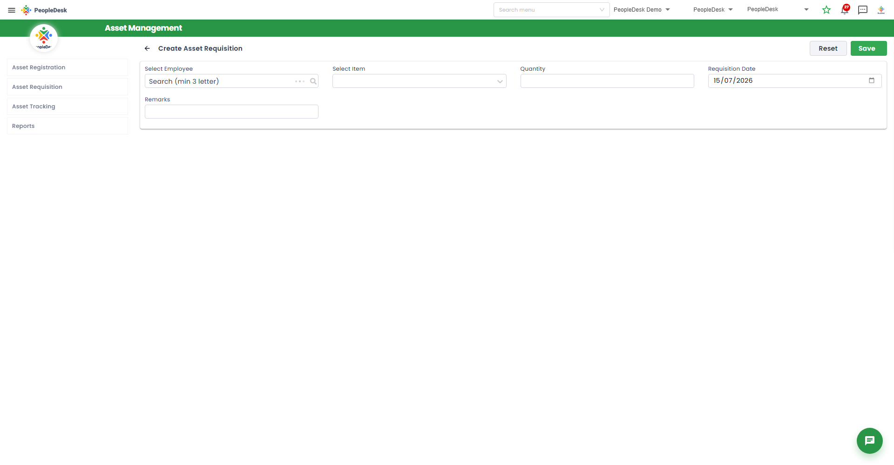

**Create form fields**:
- Select Employee (type-ahead search, "Search (min 3 letter)")
- Select Item (dropdown)
- Quantity
- Requisition Date (defaults to today, date picker)
- Remarks (free text)
- **Reset** button — clears the form.
- **Save** button (top right) — submits the requisition.

---

#### Asset Assign

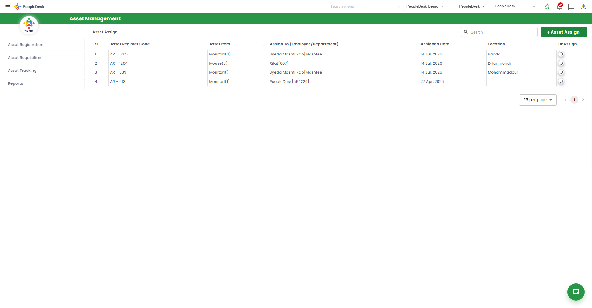

**What it does**: Hands over a registered asset unit to a specific employee (or department) and records where it physically is, and lets you reverse that handover.

**Key fields / columns**:
- SL
- Asset Register Code
- Asset Item (with quantity in brackets)
- Assign To (Employee/Department)
- Assigned Date
- Location
- UnAssign (circular arrow/undo icon per row)

**Buttons & actions**:
- **+ Asset Assign** (top right, green) — opens the Create Asset Assign form.
- **Search** box — filters the list.
- **UnAssign** (undo icon) — returns the asset to available stock, reversing the assignment.
- Pagination controls (bottom right).

**How to use it**: 1. Click **+ Asset Assign**. 2. Choose whether you're assigning to an Employee or a Department, pick the person/department and the Asset Item, set the Assigned Date and optional Location, click **Add**, then **Save**. 3. To take an asset back, click the UnAssign icon on its row.

**Pro-tip**: Always fill in Asset Location — it's what lets you answer "where is this laptop right now" later without chasing the employee.

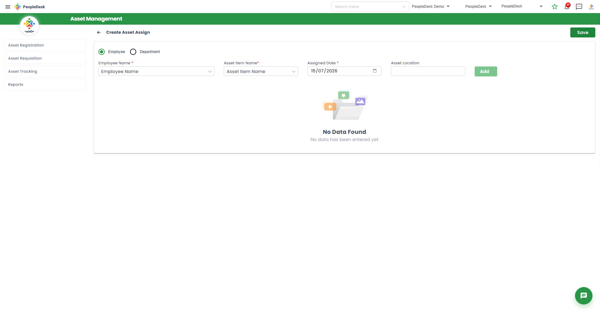

**Create form fields**:
- Employee / Department (radio toggle to choose assignment target)
- Employee Name * (dropdown, shown when "Employee" is selected)
- Asset Item Name * (dropdown)
- Assigned Date * (defaults to today)
- Asset Location (free text)
- **Add** button — adds the line to a pending list (starts as "No Data Found")
- **Save** button (top right) commits the assignment(s).

---

#### Asset Maintenance

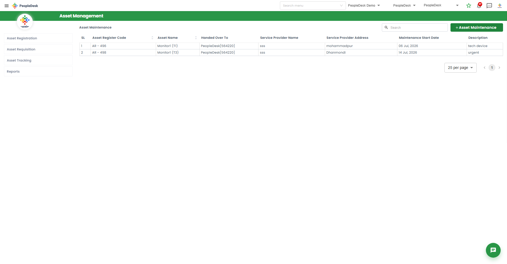

**What it does**: Records when a registered asset is sent out for servicing or repair, who it was handed to, and which external service provider is handling it.

**Key fields / columns**:
- SL
- Asset Register Code
- Asset Name
- Handed Over To
- Service Provider Name
- Service Provider Address
- Maintenance Start Date
- Description

**Buttons & actions**:
- **+ Asset Maintenance** (top right, green) — opens the "Send Asset to Maintenance" form.
- **Search** box — filters the list.
- Pagination controls (bottom right).

**How to use it**: 1. Click **+ Asset Maintenance**. 2. Select the Asset, Maintenance Type, and who it's Handed Over To, fill in the Service Provider details and Start Date. 3. Save — the asset now shows an active maintenance record here (and its maintenance count increments on the Asset Profile/Lifecycle report).

**Pro-tip**: Use the Description field to note the fault being fixed (e.g. "screen flicker") so the maintenance history stays useful for warranty or repeat-issue tracking.

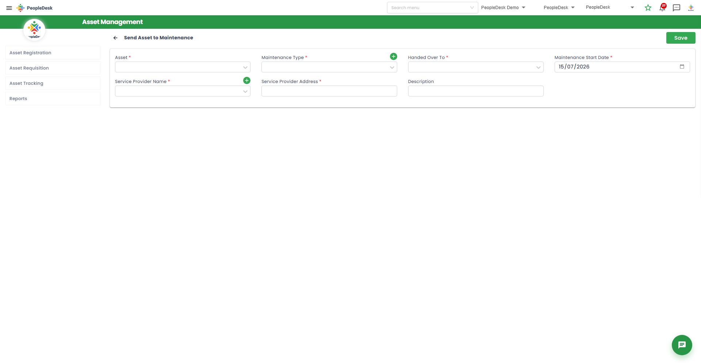

**Create form fields** (titled "Send Asset to Maintenance"):
- Asset * (dropdown)
- Maintenance Type * (dropdown, with a green **+** to add a new type inline)
- Handed Over To * (dropdown)
- Maintenance Start Date * (defaults to today)
- Service Provider Name * (dropdown, with a green **+** to add a new provider inline)
- Service Provider Address * (free text)
- Description (optional)
- **Save** button (top right) commits the maintenance record.

---

#### Asset Lifecycle

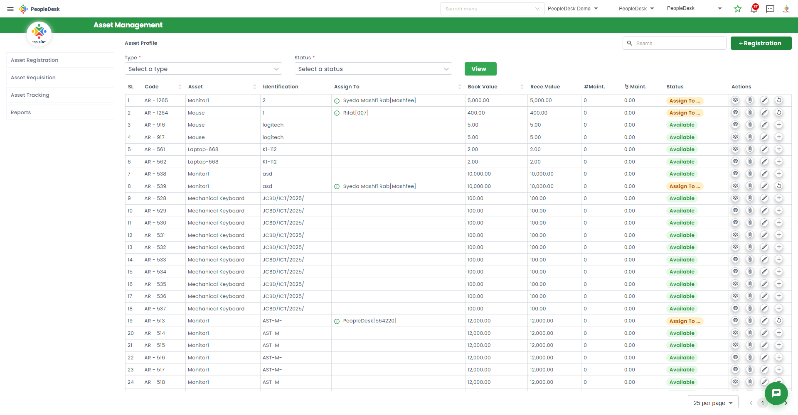

**What it does**: A consolidated asset-tracking report (the on-screen header actually reads "Asset Profile" here) that shows every registered asset's full lifecycle in one place — its book value, recovery value, how many times it's been sent for maintenance, and its current assignment status — filterable by asset Type and Status.

**Key fields / columns**:
- Type * and Status * (filter dropdowns at the top)
- SL, Code, Asset, Identification
- Assign To (shows current holder if assigned)
- Book Value, Rece.Value (recovery/resale value)
- #Maint. (number of maintenance events) and a maintenance-cost icon column
- Status (Available / "Assign To …")
- Actions: view (eye), attachment (paperclip), edit (pencil), and either a history/restore icon (for assigned assets) or a **+** (assign) icon for available ones

**Buttons & actions**:
- **View** button — applies the selected Type/Status filters and refreshes the table.
- **+ Registration** (top right, green) — jumps to the Create Registration form (same as on the Asset Registration page).
- **Search** box — free-text search across the list.
- **Eye icon** — view full asset details.
- **Paperclip icon** — view/attach documents for that asset.
- **Pencil icon** — edit the asset record.
- **History/undo icon** or **+ icon** — reassign or unassign depending on current status.
- Pagination controls (bottom right).

**How to use it**: 1. Open the asset report/lifecycle page. 2. Optionally pick a Type and Status, then click **View** to narrow the list. 3. Scan the Book Value vs. Rece.Value and #Maint. columns to spot assets that are costing more in upkeep than they're worth. 4. Use the row-level action icons to drill into, edit, or reassign any asset.

**Pro-tip**: Because this report combines registration, assignment, and maintenance data in one table, it's the fastest place to audit "which assets are sitting idle vs. still Available" before approving new purchase requisitions.

**Create form**: Clicking **+ Registration** from this page opens the same **Create Registration** form described under Asset Registration — Item *, Project Name, Description, Identifier *, Is Auto Value checkbox, Qty *, Rate *, an **Add** button to stage line items, and a **Save** button to commit.

---

## 10. Performance Management System Module

KPI/KRA and behavioral-factor based performance appraisal — configuration, target-setting, assessment, and reporting.

#### Score Settings

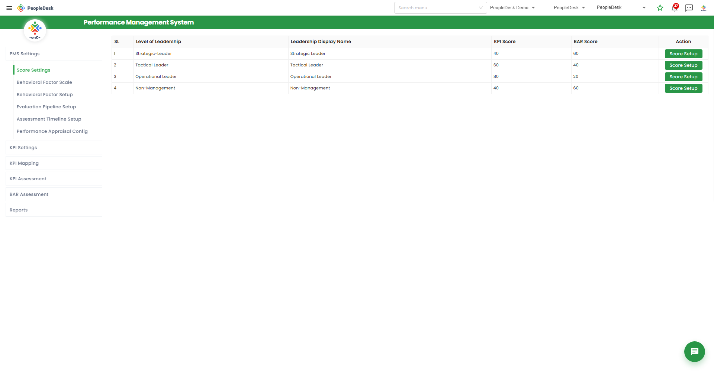

**What it does**: Defines how much weight KPI (Key Performance Indicator) results versus BAR (Behaviorally Anchored Rating) results contribute to an employee's final score, based on their level of leadership.

**Key fields / columns**:
- SL (serial number)
- Level of Leadership
- Leadership Display Name
- KPI Score
- BAR Score
- Action

**Buttons & actions**:
- **Score Setup** (one per row) — opens the scoring configuration for that leadership level so the KPI/BAR score split can be adjusted.

**How to use it**: 1. Locate the leadership level you want to configure (Strategic Leader, Tactical Leader, Operational Leader, or Non-Management). 2. Review the current KPI Score and BAR Score percentages in that row. 3. Click **Score Setup** to change the split.

**Pro-tip**: KPI and BAR scores are typically set to complement each other (e.g. 40/60 or 80/20) so they add up to 100% — keep this in mind when adjusting one side.

---

#### Behavioral Factor Scale

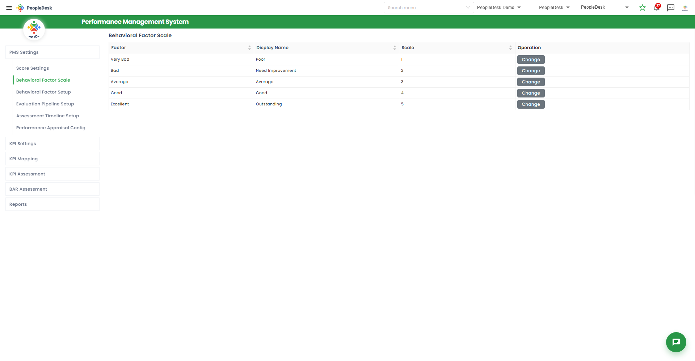

**What it does**: Defines the rating scale (1 to 5) used to score behavioral factors during BAR (Behaviorally Anchored Rating) assessments, mapping each numeric scale value to a descriptive label.

**Key fields / columns**:
- Factor (e.g. Very Bad, Bad, Average, Good, Excellent)
- Display Name (e.g. Poor, Need Improvement, Average, Good, Outstanding)
- Scale (numeric value 1–5)
- Operation

**Buttons & actions**:
- **Change** (one per row) — lets an admin edit the display name or scale value for that factor.

**How to use it**: 1. Review the five default scale bands from Very Bad (1) to Excellent (5). 2. Click **Change** on the row you want to rename or renumber. 3. Save your update so it reflects across all BAR assessment forms.

**Pro-tip**: Keep the Display Name wording consistent with how managers actually talk about performance (e.g. "Outstanding" rather than "Excellent") so ratings feel natural during assessment.

---

#### Behavioral Factor Setup

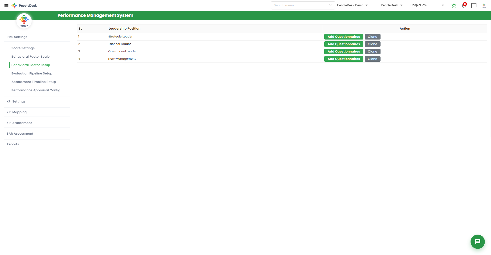

**What it does**: Lets admins attach behavioral questionnaires to each leadership position, which are later used to run BAR assessments for employees at that level.

**Key fields / columns**:
- SL (serial number)
- Leadership Position (Strategic Leader, Tactical Leader, Operational Leader, Non-Management)
- Action

**Buttons & actions**:
- **Add Questionnaires** (one per row) — opens a screen to add or edit the behavioral questions/factors assessed for that leadership position.
- **Clone** (one per row) — copies an existing position's questionnaire set as a starting point for another position, saving setup time.

**How to use it**: 1. Find the leadership position you need to configure. 2. Click **Add Questionnaires** to build out its behavioral factor list, or click **Clone** to duplicate another position's questionnaire. 3. Confirm the questions saved correctly before starting assessments for that group.

**Pro-tip**: Use **Clone** for positions with similar responsibilities (e.g. two management tiers) rather than re-entering the same questions from scratch.

---

#### Evaluation Pipeline Setup

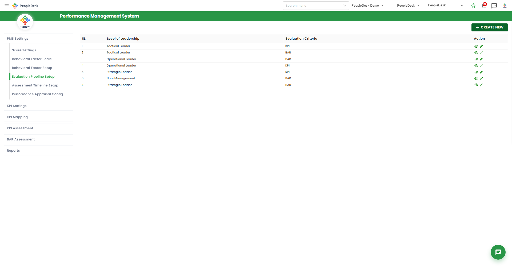

**What it does**: Configures which evaluation criteria (KPI or BAR) apply to each leadership level and which stakeholders contribute to scoring, including their weight in the overall evaluation.

**Key fields / columns**:
- SL
- Level of Leadership
- Evaluation Criteria (KPI or BAR)
- Action

**Buttons & actions**:
- **+ CREATE NEW** (top right) — opens the "Evaluation pipeline Settings" modal to add a new pipeline rule.
- **View** (eye icon, per row) — displays the details of that pipeline entry.
- **Edit** (pencil icon, per row) — opens the entry for editing.

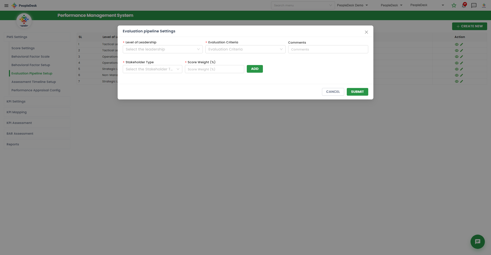

The **Create** modal ("Evaluation pipeline Settings") includes:
- **Level of Leadership** (required dropdown, e.g. Select the leadership)
- **Evaluation Criteria** (required dropdown)
- **Comments** (free text)
- **Stakeholder Type** (required dropdown — who evaluates, e.g. self, supervisor)
- **Score Weight (%)** (required numeric field) plus an **ADD** button to add the stakeholder/weight line to the pipeline
- **CANCEL** and **SUBMIT** buttons to close without saving or save the pipeline rule

**How to use it**: 1. Click **+ CREATE NEW**. 2. Select the Level of Leadership and Evaluation Criteria (KPI or BAR). 3. Add one or more Stakeholder Type + Score Weight (%) rows using **ADD** so every contributor's weight is captured. 4. Optionally add Comments. 5. Click **SUBMIT** to save, or use the eye/pencil icons later to review or adjust existing pipelines.

**Pro-tip**: Make sure all Stakeholder Type weights you add for a leadership level sum to 100% — mismatched weights will cause the final score calculation to be inaccurate.

---

#### Assessment Timeline Setup

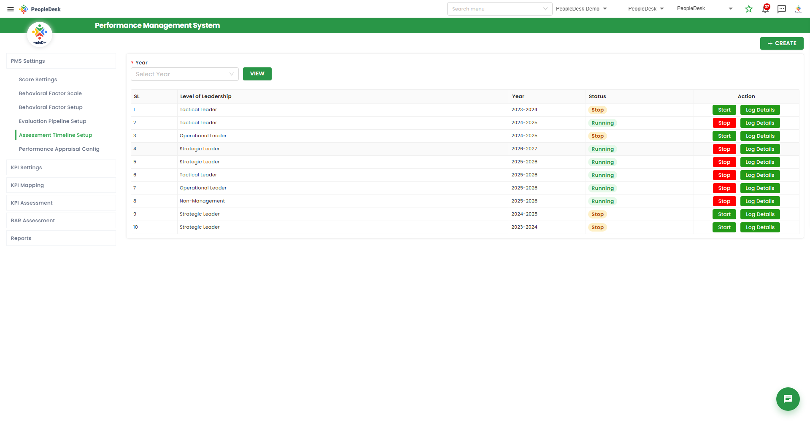

**What it does**: Starts, stops, and tracks the assessment cycle (by year and leadership level) that controls when employees and evaluators can actively submit KPI/BAR assessments.

**Key fields / columns**:
- Year (filter dropdown, with **VIEW** button)
- SL
- Level of Leadership
- Year
- Status (Running or Stop)
- Action

**Buttons & actions**:
- **+ CREATE** (top right) — opens the "Create Assessment Timeline" modal to start a new assessment cycle for a leadership level and year.
- **VIEW** — filters the table to the selected Year.
- **Start** (green, per row) — activates the assessment timeline for that row so evaluations can be submitted.
- **Stop** (red, per row) — ends/pauses that assessment timeline.
- **Log Details** (per row) — opens the activity log for that timeline entry.

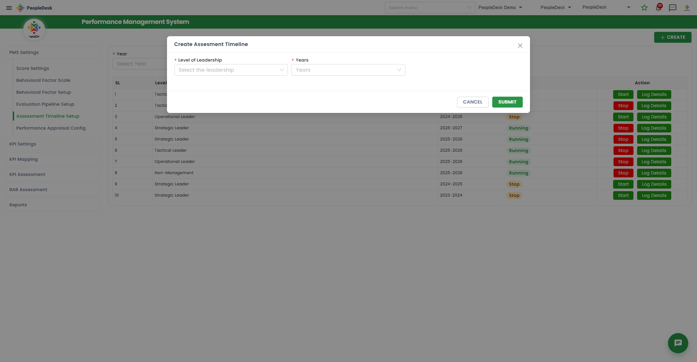

The **Create** modal ("Create Assesment Timeline") includes:
- **Level of Leadership** (required dropdown)
- **Years** (required dropdown)
- **CANCEL** and **SUBMIT** buttons

**What the "_show" screenshot shows**: Clicking **Log Details** on a row returns to the same Assessment Timeline Setup list view shown above (Year filter, the 10-row table with Status and Start/Stop/Log Details actions) — no separate detail panel is visible in this capture.

**How to use it**: 1. Click **+ CREATE**, choose the Level of Leadership and Years, then **SUBMIT** to add a new timeline. 2. Use the Year filter and **VIEW** to narrow the list. 3. Click **Start** to open the assessment window for that leadership level/year, or **Stop** to close it. 4. Click **Log Details** to audit when the timeline was started/stopped and by whom.

**Pro-tip**: Only one timeline per leadership level should typically be "Running" at a time — check the Status column before clicking Start to avoid overlapping active cycles.

---

#### Performance Appraisal Config

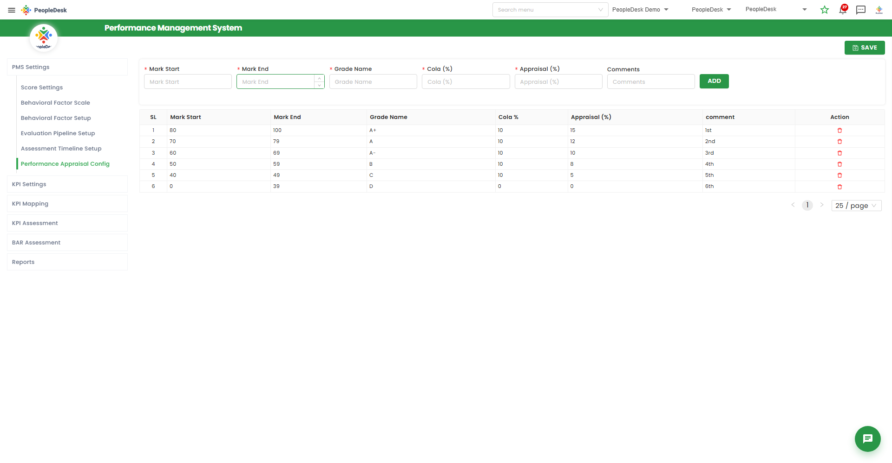

**What it does**: Defines the grading bands used to translate an employee's final performance mark into a letter grade plus associated COLA (Cost of Living Adjustment) and appraisal (salary increment) percentages.

**Key fields / columns**:
- Mark Start / Mark End (score range for the grade)
- Grade Name (A+, A, A-, B, C, D)
- Cola % (Cost of Living Adjustment percentage)
- Appraisal (%) (increment percentage)
- comment (rank label, e.g. 1st, 2nd)
- Action

**Buttons & actions**:
- **SAVE** (top right) — saves all changes made to the grade table.
- **ADD** — adds a new Mark Start/Mark End/Grade Name/Cola/Appraisal/Comments row using the entry fields above the table.
- **Delete** (trash icon, per row) — removes a grading band.
- Pagination controls (page number, "25 / page" selector) at the bottom.

**How to use it**: 1. Enter Mark Start, Mark End, Grade Name, Cola (%), Appraisal (%), and an optional Comment in the input row. 2. Click **ADD** to insert it into the grade table. 3. Click **SAVE** to persist all bands. 4. Use the trash icon to delete an outdated band.

**Pro-tip**: Make sure mark ranges are contiguous with no gaps or overlaps (e.g. 0–39, 40–49, 50–59...) so every possible score maps to exactly one grade.

---

#### Objectives/KRA

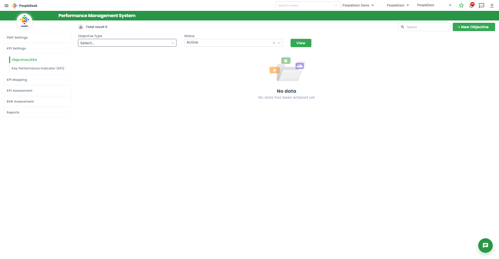

**What it does**: Lists and manages the high-level Objectives / KRAs (Key Result Areas) that KPIs are later linked to, forming the top of the performance-planning hierarchy.

**Key fields / columns**:
- Objective Type (filter)
- Status (filter, defaults to Active)
- (Table would show objective records; currently "No data has been entered yet")

**Buttons & actions**:
- **+ New Objective** (top right) — opens the Create Objectives/KRA form.
- **View** — filters the objective list by the selected Objective Type and Status.
- **Search** box (top right) — searches existing objectives.
- Download/export icon (next to "Total result") — exports the result list.

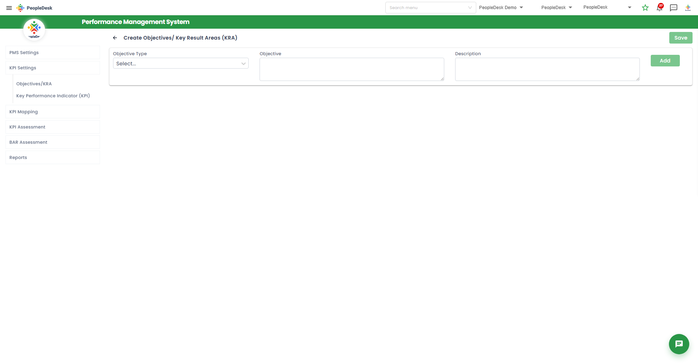

The **Create** page ("Create Objectives/ Key Result Areas (KRA)") includes:
- **Objective Type** (dropdown)
- **Objective** (text area)
- **Description** (text area)
- **Add** button to save the entry, and a **Save** button (top right) to confirm

**How to use it**: 1. Click **+ New Objective**. 2. Choose the Objective Type. 3. Type the Objective name and a Description. 4. Click **Add**, then **Save**. 5. Back on the list page, use Objective Type/Status filters and **View** to find existing objectives.

**Pro-tip**: Write Objectives at a level general enough to cover multiple KPIs (e.g. "Automate Business Processes") — overly specific objectives make KPI mapping harder later.

---

#### Key Performance Indicator (KPI)

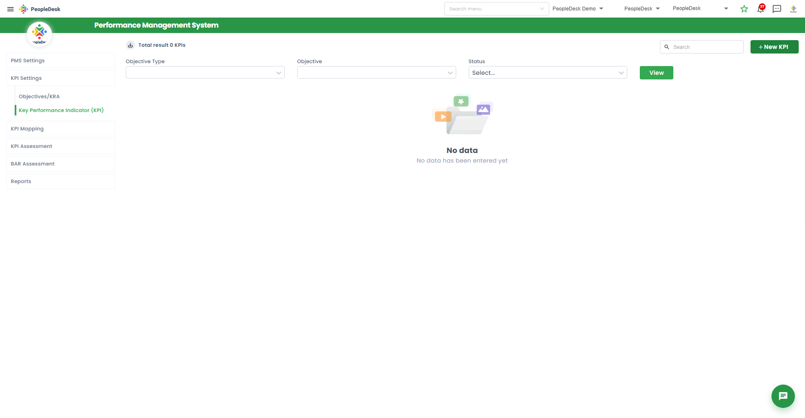

**What it does**: Manages the master list of KPIs (Key Performance Indicators) — the measurable metrics that get linked to Objectives/KRAs and later assigned to employees as targets.

**Key fields / columns**:
- Objective Type (filter)
- Objective (filter)
- Status (filter)
- (Table would list KPI records; currently "No data has been entered yet")

**Buttons & actions**:
- **+ New KPI** (top right) — opens the Create KPI form.
- **View** — applies the Objective Type/Objective/Status filters to the list.
- **Search** box — searches existing KPIs.
- Download/export icon — exports the KPI list.

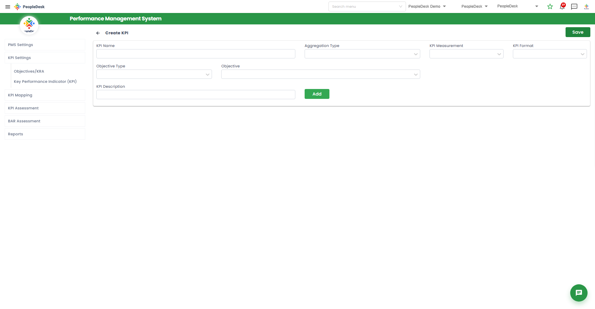

The **Create** page ("Create KPI") includes:
- **KPI Name**
- **Aggregation Type** (dropdown)
- **KPI Measurement** (dropdown)
- **KPI Format** (dropdown)
- **Objective Type** (dropdown)
- **Objective** (dropdown)
- **KPI Description**
- **Add** button, and a **Save** button (top right)

**How to use it**: 1. Click **+ New KPI**. 2. Enter the KPI Name and Description. 3. Set the Aggregation Type, KPI Measurement, and KPI Format so the system knows how to calculate/display results. 4. Link it to an Objective Type and Objective. 5. Click **Add**, then **Save**.

**Pro-tip**: Choose the KPI Format (e.g. percentage, number, currency) carefully at creation time — it determines how targets and achievements are displayed everywhere this KPI is used later.

---

#### Department KPI Mapping

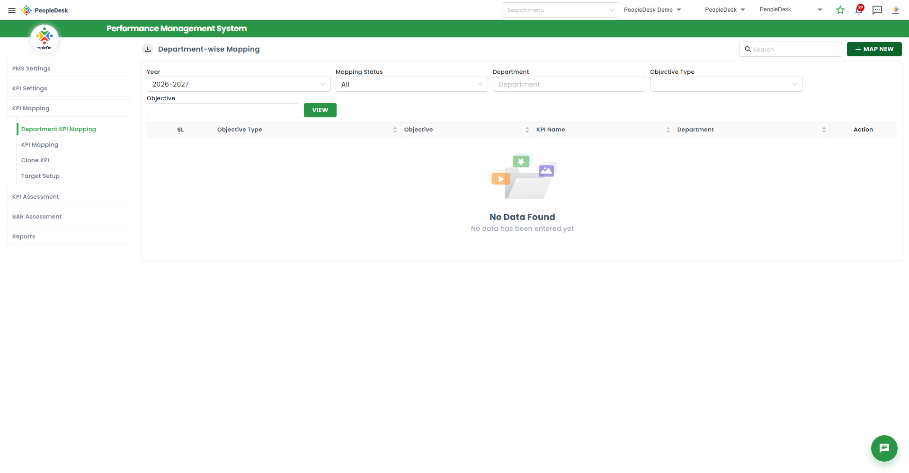

**What it does**: Shows and manages which KPIs are mapped to which departments for a given year, so department-wide targets can be tracked before being cascaded to individual employees.

**Key fields / columns**:
- Year, Mapping Status, Department, Objective Type, Objective (filters)
- SL, Objective Type, Objective, KPI Name, Department, Action (table columns)

**Buttons & actions**:
- **+ MAP NEW** (top right) — opens the form to map a KPI to a department.
- **VIEW** — applies the filters (Year, Mapping Status, Department, Objective Type, Objective) to the list.
- **Search** box — searches existing mappings.
- Download/export icon — exports the mapping list.

**What the "_show" screenshot shows**: It is identical to the main list view — same filters (Year 2026-2027, Mapping Status "All") and the same "No Data Found" empty state, indicating no department-KPI mappings have been created yet for that year.

**How to use it**: 1. Select the Year and optionally Department/Objective Type/Objective. 2. Click **VIEW** to see existing mappings. 3. Click **+ MAP NEW** to map a KPI to a department for the selected year.

**Pro-tip**: Set up Department KPI Mapping before running Target Setup for individual employees — it gives you a department-level baseline to check individual targets against.

---

#### KPI Mapping

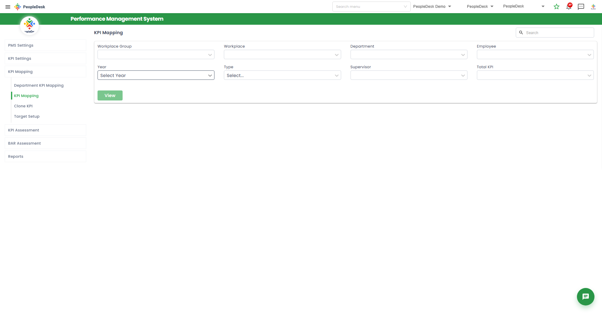

**What it does**: Lets admins search for and review which KPIs are mapped to specific employees, filtered by workplace, department, supervisor, and year.

**Key fields / columns**:
- Workplace Group
- Workplace
- Department
- Employee
- Year
- Type
- Supervisor
- Total KPI

**Buttons & actions**:
- **View** — runs the search using whichever filters above are filled in and displays matching KPI mappings.

**How to use it**: 1. Narrow down using Workplace Group, Workplace, Department, and/or Employee. 2. Select a Year and optionally a Type, Supervisor, or Total KPI value. 3. Click **View** to display the mapped KPI results for the matching employees.

**Pro-tip**: If you only need to check one person's KPI mapping, filling in the Employee field alone (with Year) is usually enough — you don't need every filter populated.

---

#### Clone KPI

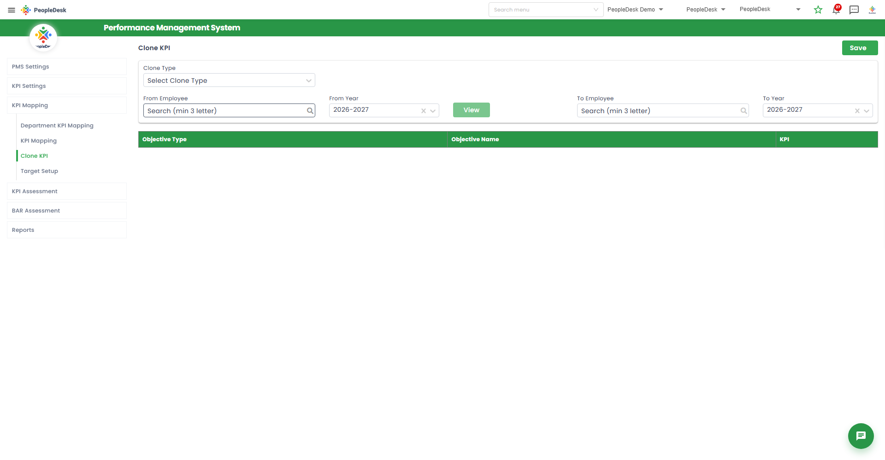

**What it does**: Copies an employee's (or group's) KPI set from one year to another, or from one employee to another, so KPIs don't have to be re-entered manually every cycle.

**Key fields / columns**:
- Clone Type (dropdown — determines what is being cloned)
- From Employee / From Year
- To Employee / To Year
- Result table headers: Objective Type, Objective Name, KPI

**Buttons & actions**:
- **Save** (top right) — saves the clone operation.
- **View** — loads the source employee's KPIs (From Employee/From Year) so they can be previewed before cloning.

**How to use it**: 1. Choose a Clone Type. 2. Search and select the From Employee and From Year. 3. Click **View** to preview that employee's Objective Type/Objective Name/KPI list. 4. Select the To Employee and To Year. 5. Click **Save** to copy the KPI set across.

**Pro-tip**: Use Clone KPI at the start of a new appraisal year to quickly roll over KPIs for employees whose responsibilities haven't changed, then adjust individual targets afterward.

---

#### Target Setup

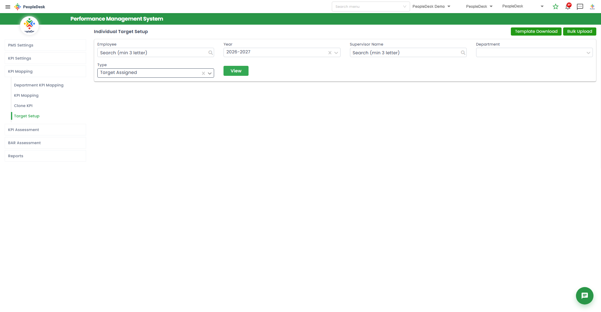

**What it does**: Assigns numeric targets for each mapped KPI to individual employees for a given year, either manually or via bulk upload.

**Key fields / columns**:
- Employee, Year, Supervisor Name, Department, Type (e.g. Target Assigned) — filters

**Buttons & actions**:
- **Template Download** (top right) — downloads a spreadsheet template for bulk target entry.
- **Bulk Upload** (top right) — uploads a completed template to assign targets to many employees at once.
- **View** — applies the filters and lists matching employees/targets.

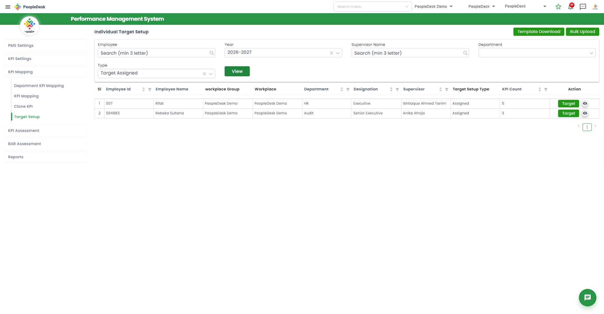

**What the "_show" screenshot shows**: After clicking **View**, a populated results table appears with columns SL, Employee Id, Employee Name, workplace Group, Workplace, Department, Designation, Supervisor, Target Setup Type, KPI Count, and Action. Two employees are listed (e.g. Rifat with 5 KPIs, Rebeka Sultana with 3 KPIs), each with a green **Target** button and an eye (view) icon in the Action column.

**How to use it**: 1. Filter by Employee, Year, Supervisor Name, and/or Department, then click **View**. 2. For each employee row, click **Target** to enter/edit their individual KPI targets, or the eye icon to view them. 3. For many employees at once, click **Template Download**, fill in the spreadsheet, then use **Bulk Upload** to import it.

**Pro-tip**: Use Bulk Upload when rolling out targets to an entire department or workplace at the start of the year — it's much faster than setting targets one employee at a time.

---

#### KPI Assessment

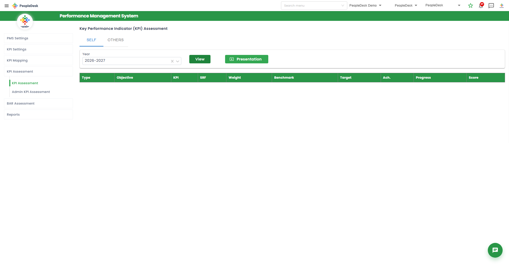

**What it does**: Lets employees record their own achievement (Ach.) against assigned KPI targets for the selected year, either for themselves (SELF tab) or for others they evaluate (OTHERS tab).

**Key fields / columns**:
- Tabs: SELF, OTHERS
- Year (filter)
- Table columns: Type, Objective, KPI, SRF (Score Reporting Frequency, e.g. Monthly), Weight, Benchmark, Target, Ach. (Achievement), Progress, Score

**Buttons & actions**:
- **View** — loads the KPI assessment table for the selected Year.
- **Presentation** — opens a presentation/summary view of the assessment data.

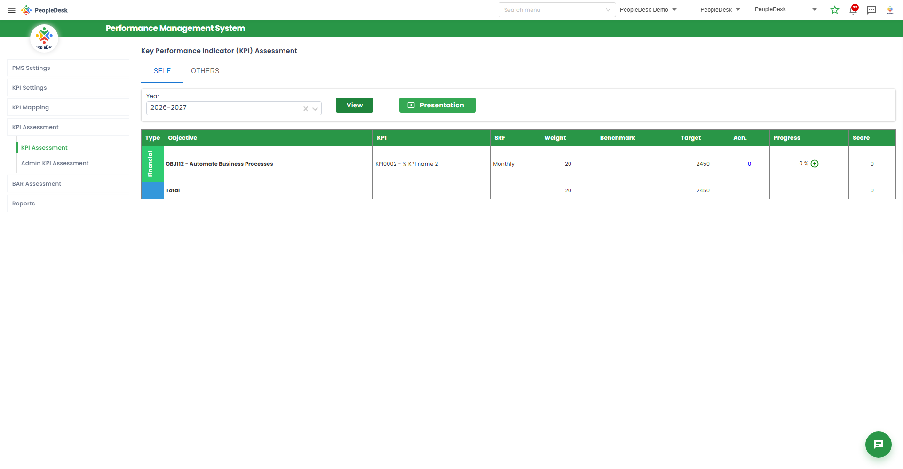

**What the "_show" screenshot shows**: After clicking **View**, the table is populated with one KPI row — Type "Financial", Objective "OBJ112 - Automate Business Processes", KPI "KPI0002 - % KPI name 2", SRF "Monthly", Weight 20, Target 2450, an editable Ach. value (shown as a clickable "0"), Progress "0%" with a plus icon to add an update, and Score 0 — plus a Total row summing Weight, Target, and Score.

**How to use it**: 1. Select the SELF or OTHERS tab depending on whose KPIs you're recording. 2. Choose the Year and click **View**. 3. Click the Ach. value or the "+" icon under Progress to log a new achievement entry against the target. 4. Click **Presentation** for a summarized, presentation-style view of the results.

**Pro-tip**: Update your Achievement figures regularly (per the SRF frequency, e.g. monthly) rather than waiting until year-end — this keeps the Progress % and Score current for reporting.

---

#### Admin KPI Assessment

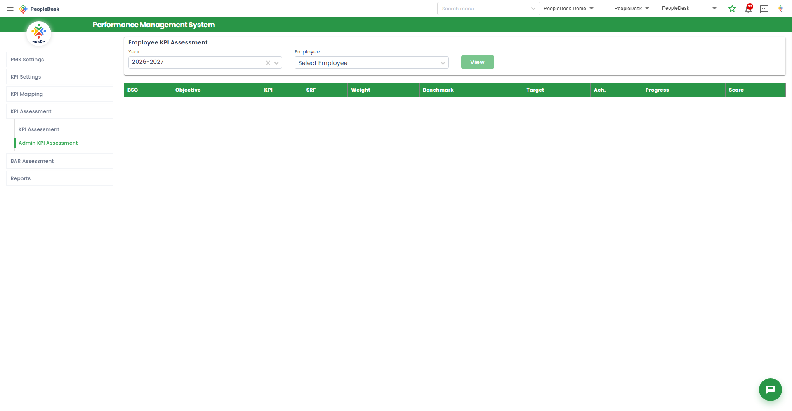

**What it does**: Gives administrators/HR a way to look up and review any employee's KPI assessment data directly, rather than through the employee's own SELF/OTHERS view.

**Key fields / columns**:
- Year (filter)
- Employee (Select Employee dropdown)
- Table columns: BSC (Balanced Scorecard perspective), Objective, KPI, SRF, Weight, Benchmark, Target, Ach., Progress, Score

**Buttons & actions**:
- **View** — loads the selected employee's KPI assessment table for the chosen Year.

**How to use it**: 1. Select the Year. 2. Choose an Employee from the dropdown. 3. Click **View** to display that employee's full KPI assessment breakdown (objectives, targets, achievements, and scores).

**Pro-tip**: Use this page during appraisal review meetings to pull up any employee's KPI data on demand, without needing them to log in and share their own screen.

---

#### BAR Assessment

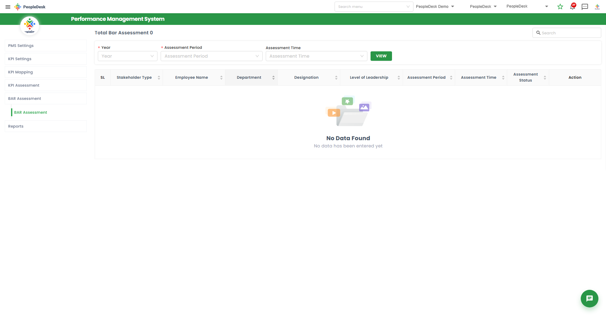

**What it does**: Manages BAR (Behaviorally Anchored Rating) assessments — behavioral evaluations submitted for employees during a defined assessment period.

**Key fields / columns**:
- Year, Assessment Period, Assessment Time (filters)
- Table columns: SL, Stakeholder Type, Employee Name, Department, Designation, Level of Leadership, Assessment Period, Assessment Time, Assessment Status, Action

**Buttons & actions**:
- **VIEW** — loads BAR assessment records matching the selected Year/Assessment Period/Assessment Time.
- **Search** box (top right) — searches within results.

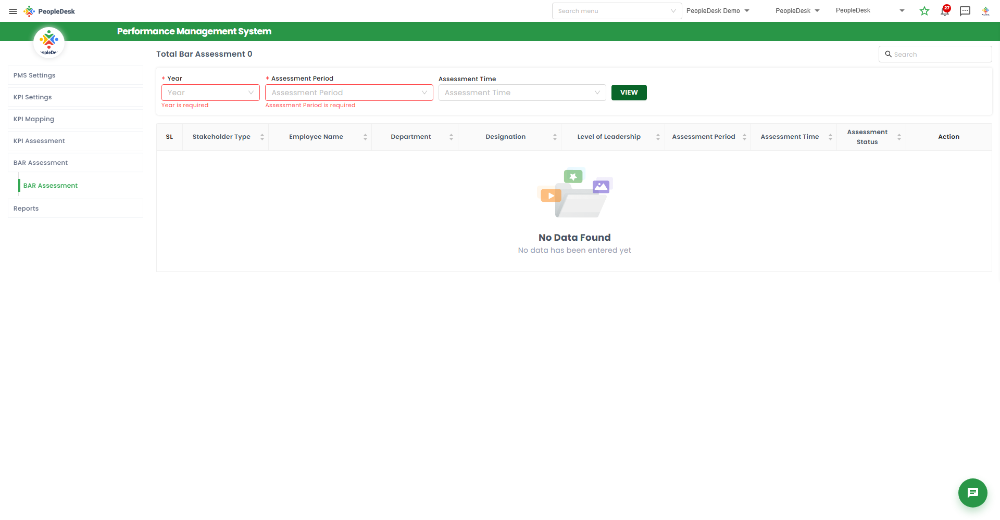

**What the "_show" screenshot shows**: This is a validation-error state, not a detail view. Clicking **VIEW** without selecting the required filters produces red "Year is required" and "Assessment Period is required" messages under those two fields, and the table remains empty ("No Data Found").

**How to use it**: 1. Select a Year (required). 2. Select an Assessment Period (required). 3. Optionally select an Assessment Time. 4. Click **VIEW** to list matching BAR assessment records and their Assessment Status.

**Pro-tip**: Both Year and Assessment Period must be selected before clicking VIEW — if you see red validation text, fill in those two dropdowns first rather than assuming there is no data.

---

#### KPI Target Mismatch

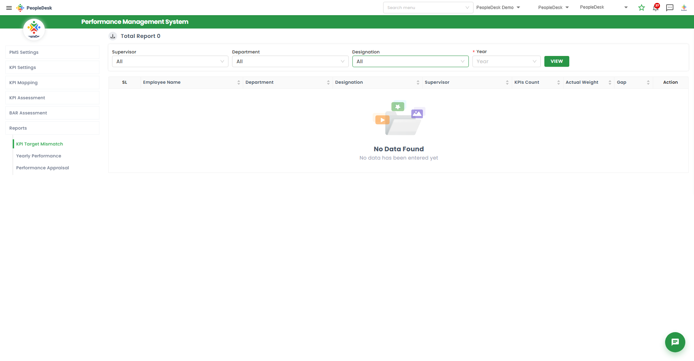

**What it does**: A report that flags employees whose assigned KPI target weights don't add up correctly (a "Gap"), helping admins catch incomplete or miscalibrated target setups.

**Key fields / columns**:
- Supervisor, Department, Designation, Year (required) — filters
- Table columns: SL, Employee Name, Department, Designation, Supervisor, KPIs Count, Actual Weight, Gap, Action

**Buttons & actions**:
- **VIEW** — runs the mismatch report for the selected filters.
- Download/export icon (next to "Total Report") — exports the report.

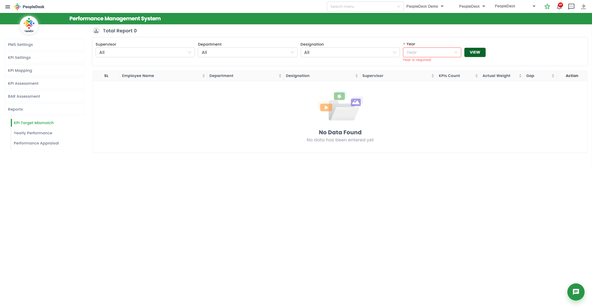

**What the "_show" screenshot shows**: A validation-error state rather than a populated report — clicking **VIEW** without selecting a Year shows a red "Year is required" message under the Year field, and the table stays empty ("No Data Found").

**How to use it**: 1. Optionally filter by Supervisor, Department, or Designation. 2. Select the required Year. 3. Click **VIEW** to list employees whose Actual Weight doesn't match the expected total, along with the size of the Gap.

**Pro-tip**: Run this report right after Target Setup for a new year to catch employees with missing or under-weighted KPI targets before the assessment period starts.

---

#### Yearly Performance

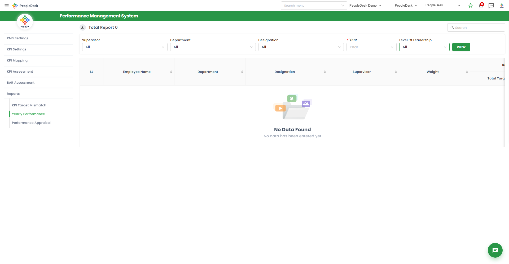

**What it does**: A report summarizing each employee's yearly KPI performance — targets, weights, and results — filterable by supervisor, department, designation, year, and leadership level.

**Key fields / columns**:
- Supervisor, Department, Designation, Year (required), Level Of Leadership — filters
- Table columns: SL, Employee Name, Department, Designation, Supervisor, Weight, and additional KPI/target columns extending further right (e.g. Total Target)

**Buttons & actions**:
- **VIEW** — runs the yearly performance report for the selected filters.
- Download/export icon (next to "Total Report") — exports the report.

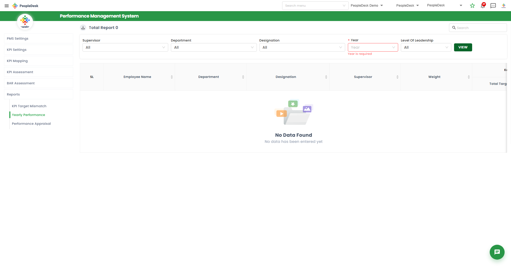

**What the "_show" screenshot shows**: A validation-error state — clicking **VIEW** without selecting a Year shows a red "Year is required" message under the Year field; the table remains empty ("No Data Found").

**How to use it**: 1. Optionally filter by Supervisor, Department, Designation, or Level Of Leadership. 2. Select the required Year. 3. Click **VIEW** to generate the yearly performance breakdown for matching employees.

**Pro-tip**: Combine the Level Of Leadership filter with Year to compare performance trends across a specific management tier rather than the whole company at once.

---

#### Performance Appraisal

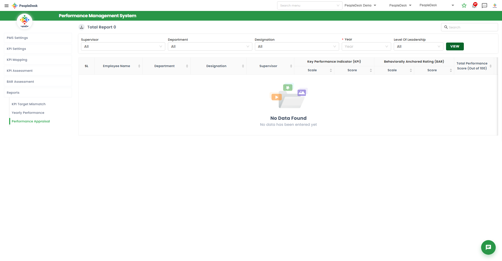

**What it does**: A consolidated report showing each employee's combined KPI and BAR (Behaviorally Anchored Rating) results as a single Total Performance Score out of 100 — the final appraisal output for the year.

**Key fields / columns**:
- Supervisor, Department, Designation, Year (required), Level Of Leadership — filters
- Table columns: SL, Employee Name, Department, Designation, Supervisor, Key Performance Indicator (KPI) — Scale/Score, Behaviorally Anchored Rating (BAR) — Scale/Score, Total Performance Score (Out of 100)

**Buttons & actions**:
- **VIEW** — runs the performance appraisal report for the selected filters.
- Download/export icon (next to "Total Report") — exports the report.

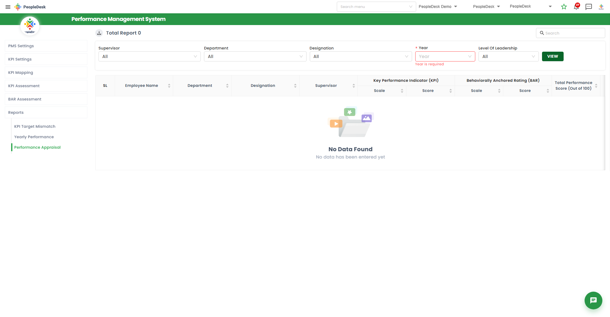

**What the "_show" screenshot shows**: A validation-error state — clicking **VIEW** without selecting a Year shows a red "Year is required" message under the Year field; the table remains empty ("No Data Found").

**How to use it**: 1. Optionally filter by Supervisor, Department, Designation, or Level Of Leadership. 2. Select the required Year. 3. Click **VIEW** to display each employee's KPI Scale/Score, BAR Scale/Score, and combined Total Performance Score out of 100.

**Pro-tip**: This report is the best single place to pull final appraisal numbers for salary/COLA decisions, since it already combines KPI and BAR into one Total Performance Score aligned with the Performance Appraisal Config grade bands.

## 11. Training & Development Module

Planning and tracking employee training — requisitions, plans, calendars, and inventory.

#### Dashboard

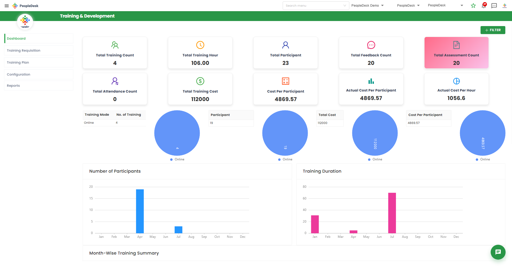

**What it does**: The Training & Development landing page, giving a management-level snapshot of training activity across the organization — counts, hours, costs, and trends by month.

**Key fields / columns**:
- KPI tiles: Total Training Count, Total Training Hour, Total Participant, Total Feedback Count, Total Assessment Count (highlighted), Total Attendance Count, Total Training Cost, Cost Per Participant, Actual Cost Per Participant, Actual Cost Per Hour
- "Training Mode / No. of Training" mini-table (e.g. Online: 4) alongside matching donut charts for Participant, Total Cost, and Cost Per Participant, each broken down by training mode
- **Number of Participants** bar chart (by month, Jan–Dec)
- **Training Duration** bar chart (by month, Jan–Dec)
- **Month-Wise Training Summary** table (below the charts)

**Buttons & actions**:
- **+ FILTER** (top right, green) — narrow the whole dashboard by criteria such as date range, business unit, or workplace.

**How to use it**: 1. Land here from the Training & Development module. 2. Scan the KPI tiles for a quick health check of training spend and participation. 3. Click **+ FILTER** to focus the dashboard on a specific period, workplace, or training mode. 4. Use the monthly bar charts to spot seasonal spikes in training activity or duration.

**Pro-tip**: Compare "Cost Per Participant" against "Actual Cost Per Participant" — a gap between the two usually means budgeted vs. actual training spend are diverging and worth investigating.

---

#### Training Requisition

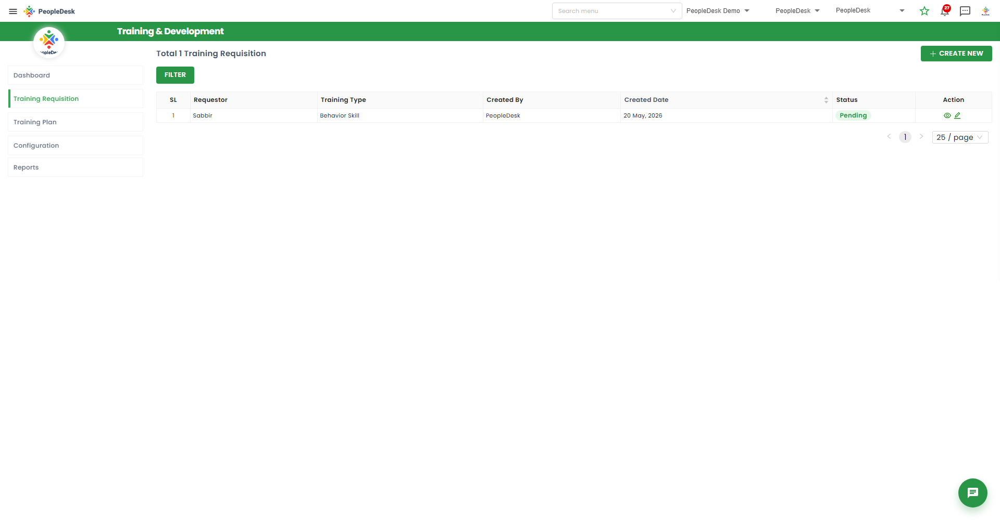

**What it does**: Lets an employee formally request a training (with reason and objectives) and tracks that request's approval status.

**Key fields / columns**:
- SL, Requestor, Training Type, Created By, Created Date, Status (e.g. Pending), Action

**Buttons & actions**:
- **+ CREATE NEW** (top right, green) — opens the Requisition create form.
- **FILTER** (green button, below the header) — filter the requisition list.
- **View** (eye icon, per row) — view the full requisition details.
- **Edit** (pencil icon, per row) — edit the requisition.
- Pagination controls (bottom right, "25 / page").

**How to use it**: 1. Click **+ CREATE NEW**. 2. Select the Employee, Training Type, and fill in the reason and objectives. 3. Submit — it appears in the list as "Pending" until approved. 4. Use **FILTER** or the eye/pencil icons to review or amend existing requests.

**Pro-tip**: A clear "Objectives to Achieve" entry makes it much easier for approvers (and later, the Training Plan) to justify the training's cost.

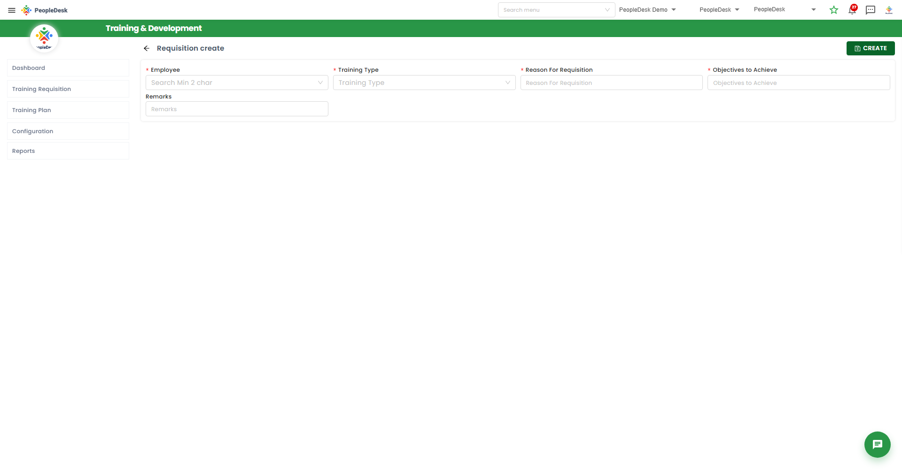

**Create form fields** (titled "Requisition create"):
- Employee * (type-ahead search, "Search Min 2 char")
- Training Type * (dropdown)
- Reason For Requisition * (free text)
- Objectives to Achieve * (free text)
- Remarks (optional)
- **CREATE** button (top right) submits the requisition.

---

#### Training Plan

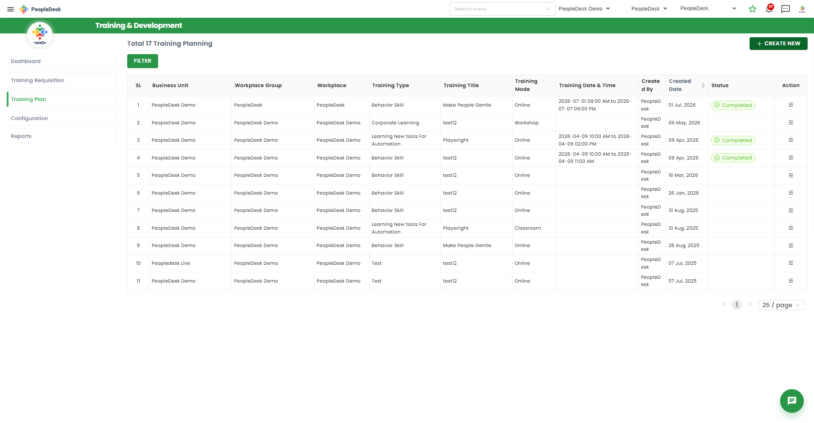

**What it does**: Schedules and manages actual training sessions/events — mapping business unit, workplace, training type/title, mode, and date/time — and tracks whether each session is completed.

**Key fields / columns**:
- SL, Business Unit, Workplace Group, Workplace, Training Type, Training Title, Training Mode, Training Date & Time, Created By, Created Date, Status (e.g. Completed), Action (menu icon)

**Buttons & actions**:
- **+ CREATE NEW** (top right, green) — opens the multi-step Training Plan Create wizard.
- **FILTER** (green button) — filter the training plan list.
- **Action menu icon** (hamburger icon, per row) — opens further row-level actions for that training plan.
- Pagination controls (bottom right).

**How to use it**: 1. Click **+ CREATE NEW**. 2. Work through the 3-step wizard (Basic Info → Cost/Trainer/Participant → Scheduling Info). 3. Save — the plan appears in this list, and its Status updates to "Completed" once the training date passes and it's marked done.

**Pro-tip**: The Training Title field is reusable — set it up once in Configuration > Training Title so recurring sessions (like "Make People Gentle") stay consistently named across plans and reports.

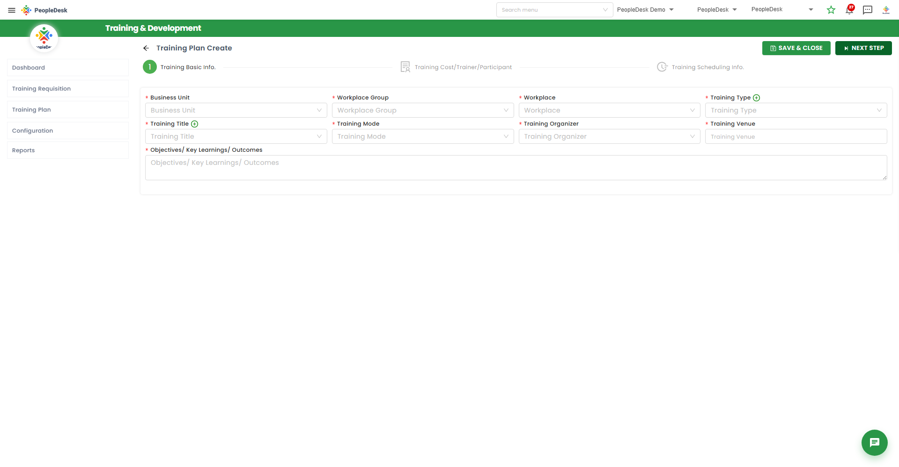

**Create form** (titled "Training Plan Create", a 3-step wizard — this screenshot shows Step 1, "Training Basic Info"):
- Business Unit *, Workplace Group *, Workplace * (dropdowns)
- Training Type * (dropdown, with a green **+** to add a new type inline)
- Training Title * (dropdown, with a green **+** to add a new title inline)
- Training Mode (dropdown)
- Training Organizer (dropdown)
- Training Venue (free text)
- Objectives/ Key Learnings/ Outcomes * (text area)
- **SAVE & CLOSE** button — saves step 1 and exits.
- **NEXT STEP** button — advances to "Training Cost/Trainer/Participant".

---

#### Training Types

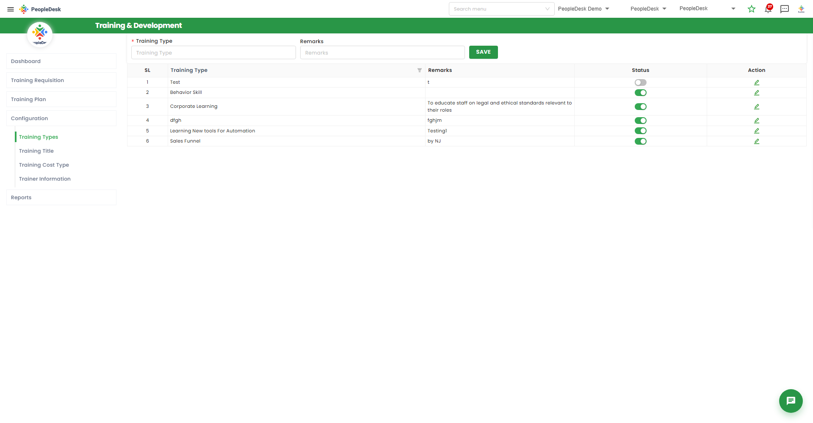

**What it does**: A configuration page for defining the categories of training the organization runs (e.g. Behavior Skill, Corporate Learning), used throughout Training Requisition and Training Plan.

**Key fields / columns**:
- Training Type (input to create new)
- Remarks (input to create new)
- Table: SL, Training Type, Remarks, Status (on/off toggle), Action (edit)

**Buttons & actions**:
- **SAVE** button — adds the new Training Type/Remarks entered above into the table.
- **Status toggle** (per row) — activates or deactivates that training type without deleting it.
- **Edit** (pencil icon, per row) — modify an existing training type's name or remarks.
- Column filter icon on "Training Type" header — filter the list.

**How to use it**: 1. Type a new Training Type name and optional Remarks. 2. Click **SAVE** — it's added to the table below. 3. Toggle Status off to retire a type without losing its history. 4. Click the pencil icon to rename or correct an existing entry.

**Pro-tip**: Turn off (toggle off) types you no longer use rather than deleting — existing Training Plans that reference them will keep working.

---

#### Training Title

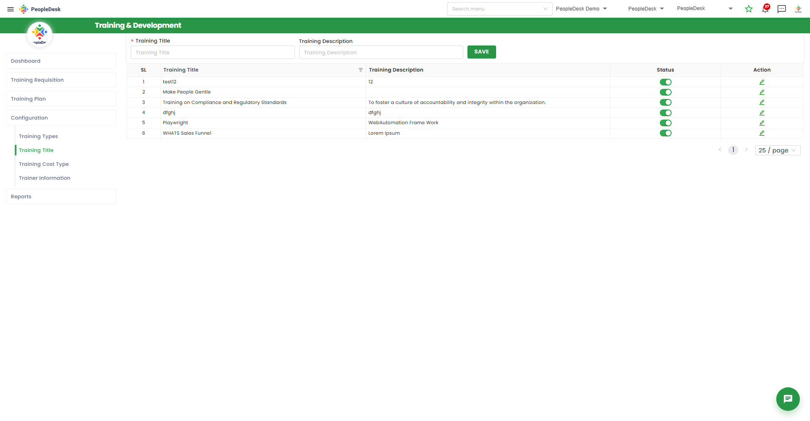

**What it does**: A configuration page for defining specific training session titles (e.g. "Make People Gentle", "Training on Compliance and Regulatory Standards") that get selected when building a Training Plan.

**Key fields / columns**:
- Training Title (input to create new)
- Training Description (input to create new)
- Table: SL, Training Title, Training Description, Status (toggle), Action (edit)

**Buttons & actions**:
- **SAVE** button — adds the new title/description to the table.
- **Status toggle** (per row) — enable/disable a title.
- **Edit** (pencil icon, per row) — edit an existing title's name or description.
- Column filter icon on "Training Title" header.
- Pagination controls (bottom right).

**How to use it**: 1. Enter a Training Title and its Description. 2. Click **SAVE**. 3. The title becomes selectable when creating a Training Plan. 4. Use the pencil icon to fix typos or update the description later.

**Pro-tip**: Write the Description as a one-line summary of what the session covers — it shows up as context wherever the title is picked, saving planners from guessing what "test12" or similarly vague titles mean.

---

#### Training Cost Type

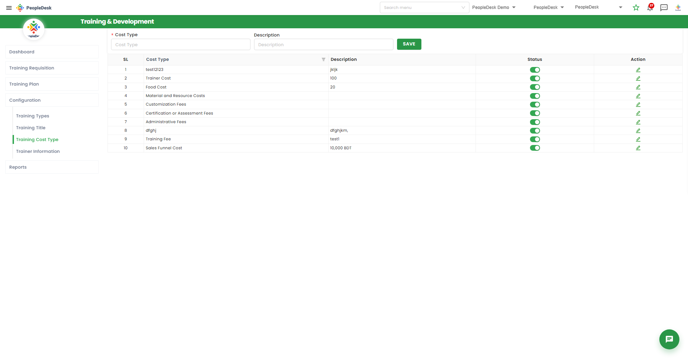

**What it does**: Defines the categories of cost that can be attached to a training (e.g. Trainer Cost, Food Cost, Material and Resource Costs), used when budgeting a Training Plan's Cost/Trainer/Participant step.

**Key fields / columns**:
- Cost Type (input to create new)
- Description (input to create new)
- Table: SL, Cost Type, Description, Status (toggle), Action (edit)

**Buttons & actions**:
- **SAVE** button — adds the new cost type to the table.
- **Status toggle** (per row) — enable/disable a cost type.
- **Edit** (pencil icon, per row) — modify an existing cost type.
- Column filter icon on "Cost Type" header.

**How to use it**: 1. Enter a Cost Type name (e.g. "Venue Rental") and optional Description. 2. Click **SAVE**. 3. It becomes available for selection when costing out a Training Plan. 4. Edit or disable types as your cost structure evolves.

**Pro-tip**: Standardize cost types like "Trainer Cost", "Food Cost", and "Administrative Fees" up front — it makes the dashboard's Total Training Cost and Cost Per Participant figures comparable across every training session.

---

#### Trainer Information

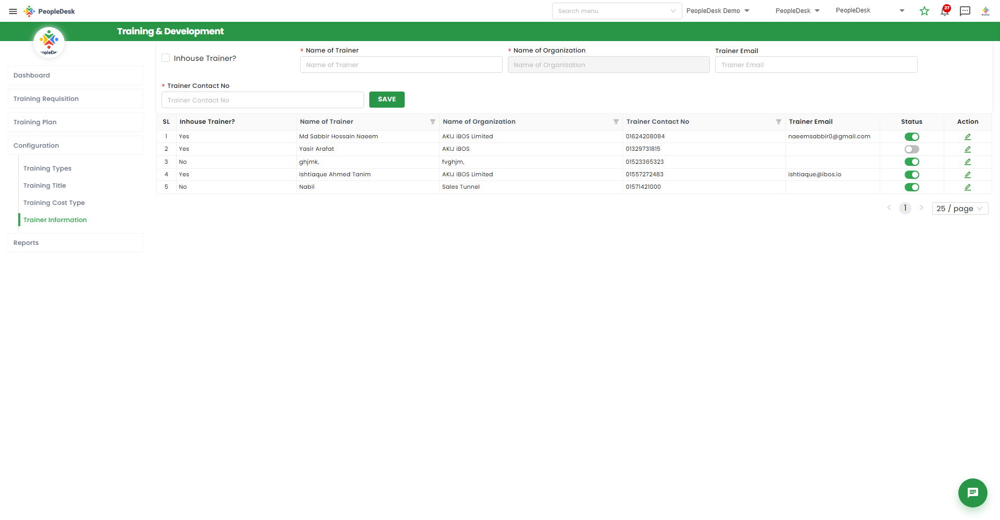

**What it does**: Maintains the roster of trainers — both in-house staff and external/organizational trainers — with their contact details, for assignment to Training Plans.

**Key fields / columns**:
- Inhouse Trainer? (checkbox to create new)
- Name of Trainer *, Name of Organization *, Trainer Email, Trainer Contact No * (inputs to create new)
- Table: SL, Inhouse Trainer? (Yes/No), Name of Trainer, Name of Organization, Trainer Contact No, Trainer Email, Status (toggle), Action (edit)

**Buttons & actions**:
- **SAVE** button — adds the new trainer to the table.
- **Status toggle** (per row) — activate/deactivate a trainer.
- **Edit** (pencil icon, per row) — update a trainer's details.
- Column filter icons on Name of Trainer, Name of Organization, and Trainer Contact No headers.
- Pagination controls (bottom right).

**How to use it**: 1. Check **Inhouse Trainer?** if the trainer is an internal employee, leave unchecked for external trainers. 2. Fill in Name of Trainer, Name of Organization, Trainer Contact No (required) and Trainer Email (optional). 3. Click **SAVE**. 4. Select this trainer later as the "Training Organizer" when scheduling a Training Plan.

**Pro-tip**: Always fill in Trainer Email for external trainers — it's the field most likely to be needed later for sending certificates or feedback forms, and it's easy to forget since it's optional.

---

#### Training Calendar

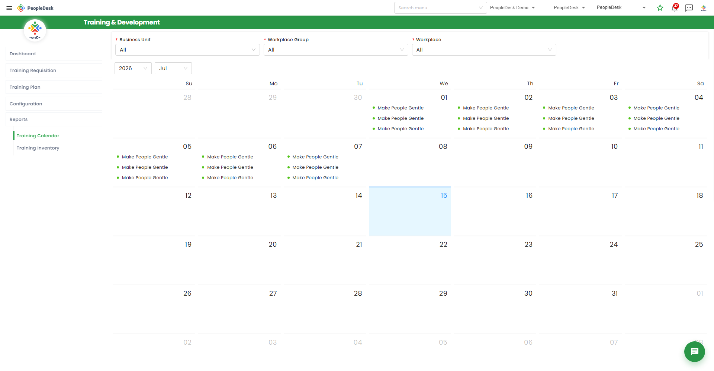

**What it does**: Displays all scheduled training sessions in a month-view calendar, so you can see at a glance which days have training happening and how many sessions overlap.

**Key fields / columns**:
- Business Unit *, Workplace Group *, Workplace * (filter dropdowns, all set to "All" by default)
- Year and Month selectors (e.g. 2026 / Jul)
- Calendar grid (Sunday–Saturday columns) listing each day's scheduled training titles as bullet items (e.g. "Make People Gentle" appearing multiple times on several days)

**Buttons & actions**:
- **Business Unit / Workplace Group / Workplace** dropdowns — scope the calendar to a specific part of the organization.
- **Year** dropdown and **Month** dropdown — jump to a different period.
- Today's date is highlighted (shaded cell) for quick orientation.

**How to use it**: 1. Set Business Unit/Workplace Group/Workplace filters if you only want to see a specific location's trainings. 2. Pick the Year and Month you want to review. 3. Scan the calendar for days with multiple listed sessions to spot scheduling clashes or busy weeks.

**Pro-tip**: If a single day shows several identical entries (e.g. three "Make People Gentle" sessions), that usually means multiple batches/groups are running the same training in parallel — worth checking trainer and venue availability isn't double-booked.

---

#### Training Inventory

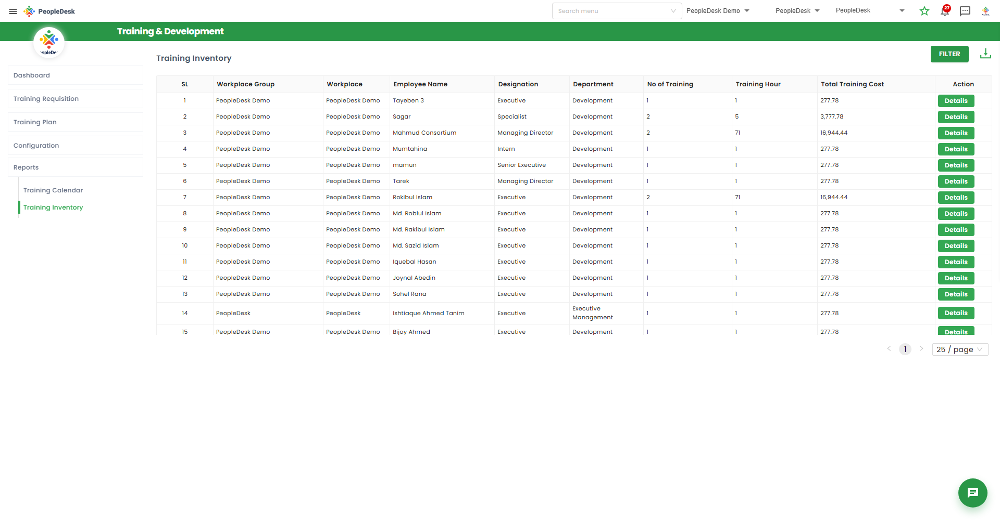

**What it does**: A per-employee report showing how much training each person has received — number of trainings, total hours, and total cost — for workforce training-coverage reporting.

**Key fields / columns**:
- SL, Workplace Group, Workplace, Employee Name, Designation, Department, No of Training, Training Hour, Total Training Cost, Action

**Buttons & actions**:
- **FILTER** (top right, green) — filter the report by employee, workplace, department, or date range.
- **Download/export icon** (top right, next to Filter) — exports the report (e.g. to Excel/CSV).
- **Details** button (green, per row) — drills into that employee's individual training history.
- Pagination controls (bottom right).

**How to use it**: 1. Optionally click **FILTER** to narrow by department or workplace. 2. Scan No of Training / Training Hour / Total Training Cost to see who has received the most (or least) training. 3. Click **Details** on any row to see that employee's session-by-session breakdown. 4. Use the download icon to export the list for offline reporting.

**Pro-tip**: Sort by "No of Training" to quickly identify employees who haven't attended any training yet — useful input for the next Training Plan cycle.

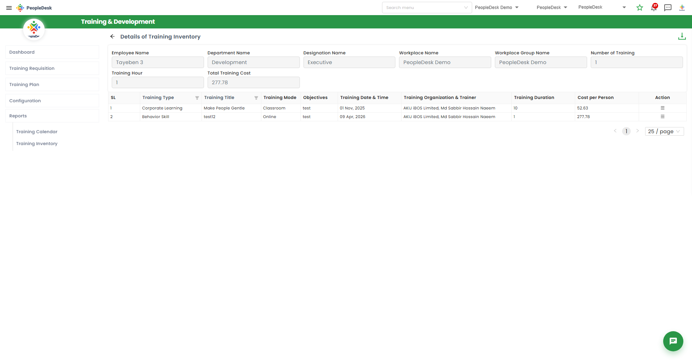

**What it shows**: This is a genuine drill-down detail screen, titled "Details of Training Inventory", opened by clicking **Details** on an employee's row (in this example, Tayeben 3). It displays that employee's summary — Employee Name, Department Name, Designation Name, Workplace Name, Workplace Group Name, Number of Training, Training Hour, Total Training Cost — as read-only fields, followed by a table listing each individual training the employee attended: SL, Training Type, Training Title, Training Mode, Objectives, Training Date & Time, Training Organization & Trainer, Training Duration, Cost per Person, and an Action (menu) icon per row. A download icon (top right) lets you export this individual's training history, and a back arrow returns to the main Training Inventory list.

**How to use it**: 1. From Training Inventory, click **Details** on any employee. 2. Review their summary totals at the top. 3. Scroll the session table to see exactly which trainings drove those totals. 4. Click the download icon to export this employee's record, or the back arrow to return to the list.

**Pro-tip**: Use this detail view before a performance or promotion review — it's the fastest way to confirm exactly which trainings an employee completed, when, and at what cost.

## 12. Retirement Module

The employee off-boarding process: separation, exit interview, clearance, and final settlement.

#### Separation

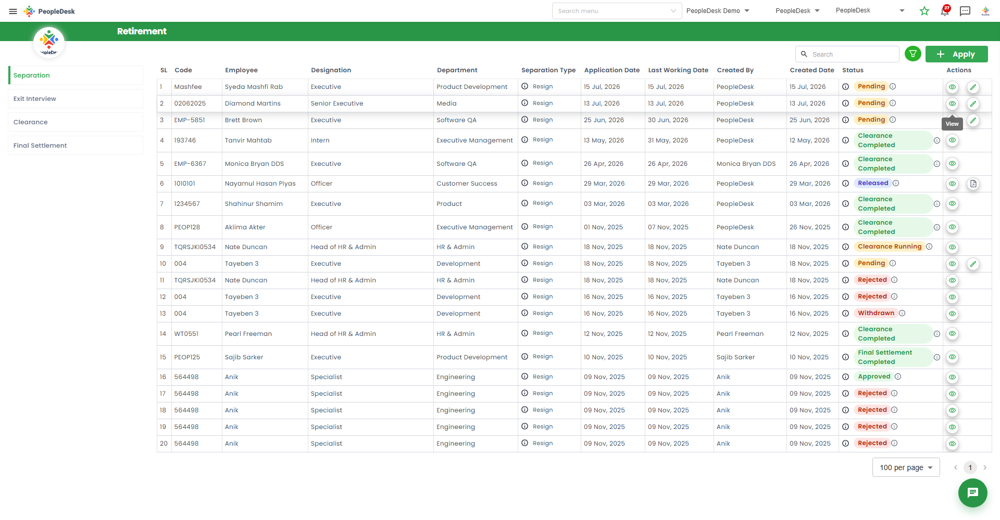

**What it does**: Tracks employee separation (resignation/termination) requests as they move through the offboarding workflow, from application to clearance and final settlement.

**Key fields / columns**: SL, Code, Employee, Designation, Department, Separation Type, Application Date, Last Working Date, Created By, Created Date, Status (e.g., Pending, Clearance Completed, Released, Clearance Running, Rejected, Withdrawn, Final Settlement Completed, Approved), Actions.

**Buttons & actions**:
- "+ Apply" button (top right) opens the Separation Application form to submit a new separation request.
- Search box to find a specific employee's separation record.
- Green filter (funnel) icon to filter the list (e.g., by status or department).
- Per-row "View" (eye) icon opens the separation record's details.
- Per-row Edit (pencil) icon, shown on rows still Pending, to modify the application.
- Info (i) icon next to Separation Type and Status shows extra detail on hover.

**How to use it**: 1. Open Retirement > Separation. 2. Click "+ Apply" to start a new separation request for an employee. 3. Track existing requests' Status column as they move through the workflow. 4. Use View to check details or Edit to update a pending request. 5. Use Search/filter to locate specific records in a long list.

**Pro-tip**: Watch the Status column closely — "Clearance Running" and "Clearance Completed" tell you whether the employee still needs department sign-offs before their Final Settlement can proceed.

---

#### Separation — Create

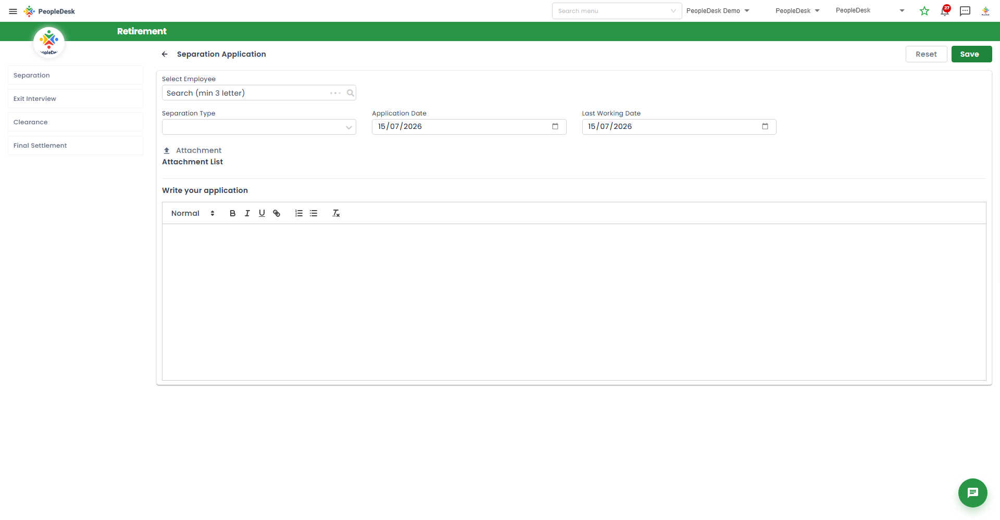

**What it does**: The "Separation Application" form used to formally submit an employee's resignation/termination request.

**Key fields / columns**:
- Select Employee (search, minimum 3 letters)
- Separation Type (dropdown)
- Application Date
- Last Working Date
- Attachment (upload) with Attachment List
- Write your application (rich text editor with formatting toolbar: Normal style, Bold, Italic, Underline, Link, ordered list, unordered list, clear formatting)

**Buttons & actions**:
- Employee search box to select which employee is separating.
- Separation Type dropdown to classify the request (e.g., Resign, Termination).
- Application Date / Last Working Date fields, pre-filled with today's date but editable.
- "Attachment" upload button to attach supporting documents.
- Rich text editor toolbar to format the written application/reason.
- "Reset" button (top right) clears the form.
- "Save" button (top right) submits the separation application.
- Back arrow (top left) returns to the Separation list without saving.

**How to use it**: 1. From the Separation list, click "+ Apply". 2. Search and select the Employee. 3. Choose the Separation Type and confirm the Application Date and Last Working Date. 4. Attach any supporting documents. 5. Write the application details in the text editor. 6. Click "Save" to submit.

**Pro-tip**: Set the Last Working Date carefully before saving — it typically drives when the employee's clearance and final settlement workflow steps are triggered.

---

#### Exit Interview

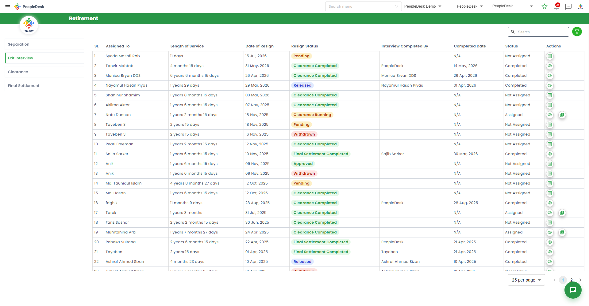

**What it does**: Manages the exit interview step of offboarding, tracking which separating employees have had (or still need) their exit interview completed.

**Key fields / columns**: SL, Assigned To, Length of Service, Date of Resign, Resign Status, Interview Completed By, Completed Date, Status (Not Assigned, Assigned, Completed), Actions.

**Buttons & actions**:
- Search box to find a specific employee's exit interview record.
- Green filter (funnel) icon to filter the list.
- Per-row "View" (eye) icon to review a completed/assigned interview's details.
- Per-row assignment icon (clipboard/checklist) to assign or record the exit interview for that employee.

**How to use it**: 1. Open Retirement > Exit Interview. 2. Find the departing employee via Search or by scanning the list. 3. Check the Status column — "Not Assigned" means the interview hasn't been set up yet. 4. Use the assignment action icon to assign an interviewer, or View to see interview results already completed.

**Pro-tip**: Sort your attention by Status — records still marked "Not Assigned" are the ones that need action first, since "Completed" and "Assigned" rows are already progressing.

---

#### Clearance

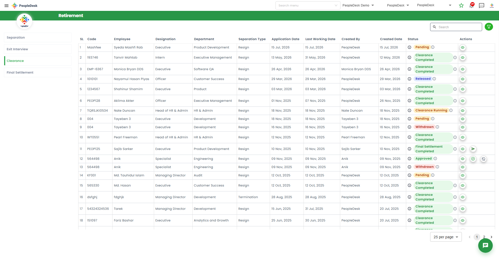

**What it does**: Tracks the department clearance step of offboarding — confirming a separating employee has settled all dues/handovers across departments before final settlement.

**Key fields / columns**: SL, Code, Employee, Designation, Department, Separation Type, Application Date, Last Working Date, Created By, Created Date, Status, Actions.

**Buttons & actions**:
- Search box to find a specific separation/clearance record.
- Green filter (funnel) icon to filter the list.
- Per-row "View" (eye) icon to see clearance details for that employee.
- Additional per-row action icons visible on some rows (e.g., send, approve/checkmark, block) to progress or manage the clearance workflow for that record.

**How to use it**: 1. Open Retirement > Clearance. 2. Locate the separating employee via Search or the list. 3. Click "View" to check clearance progress across departments. 4. Use the additional action icons (where available) to advance, approve, or halt the clearance for that record.

**Pro-tip**: The Status column mirrors what you see on the Separation page (Pending, Clearance Completed, Final Settlement Completed, etc.) — use Clearance specifically when you need to act on the department sign-off step itself.

---

#### Final Settlement

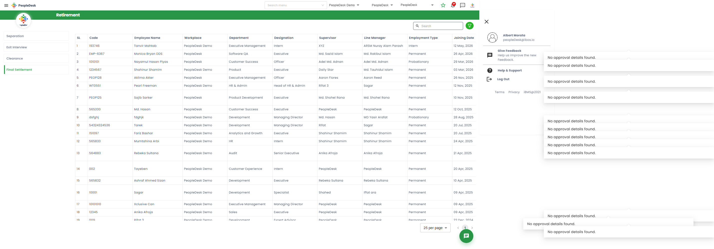

**What it does**: Lists employees who have completed (or are in) the final settlement stage of offboarding, showing their organizational details for settlement processing.

**Key fields / columns**: SL, Code, Employee Name, Workplace, Department, Designation, Supervisor, Line Manager, Employment Type, Joining Date.

**Buttons & actions**:
- Search box to find a specific employee's final settlement record.
- Green filter (funnel) icon to filter the list (e.g., by department or employment type).
- Pagination with "25 / page" size selector at the bottom.
- Clicking an employee's row/name opens their final settlement details.

**How to use it**: 1. Open Retirement > Final Settlement. 2. Use Search or the filter icon to locate the employee whose settlement you need to process. 3. Click into the employee row to view and process their final settlement figures. 4. Page through the list using the pagination controls if there are many records.

**Pro-tip**: Cross-check the Joining Date and Employment Type columns here against the Separation record's Last Working Date — they're the two data points settlement calculations typically depend on most.

## 13. Log Monitor Module

A technical log of application notifications sent by the system.

#### Application Notification Log

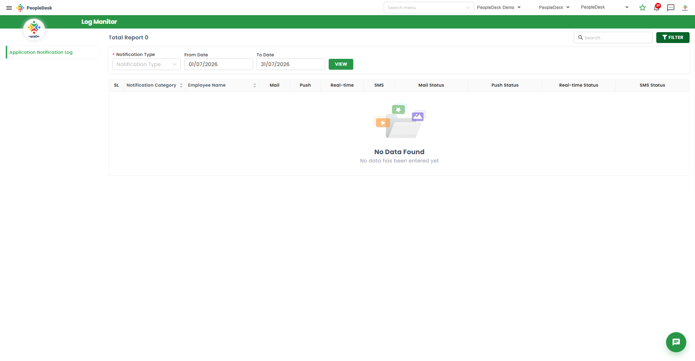

**What it does**: Lets administrators audit whether system notifications (mail, push, SMS, real-time) were successfully delivered for a given notification type and date range.

**Key fields / columns**:
- Notification Type (dropdown, required), From Date, To Date
- Table: SL, Notification Category, Employee Name, Mail, Push, Real-time, SMS, Mail Status, Push Status, Real-time Status, SMS Status

**Buttons & actions**:
- Notification Type dropdown — required field to select which notification category to inspect.
- From Date / To Date fields to set the reporting period (defaults to the current month).
- "VIEW" button runs the search and populates the table.
- Search box (top right) to filter results further.
- "FILTER" button (top right) opens additional filtering options.

**How to use it**: 1. Open Log Monitor > Application Notification Log. 2. Select a Notification Type from the dropdown (this is mandatory). 3. Adjust the From Date / To Date range if needed. 4. Click "VIEW" to load the report. 5. Use Search or FILTER to narrow results if the report is large.

**Pro-tip**: If you click VIEW and get no results or an error, double-check that a Notification Type is selected — it's a required field and the page won't run the report without it.

---

#### Application Notification Log — View Result

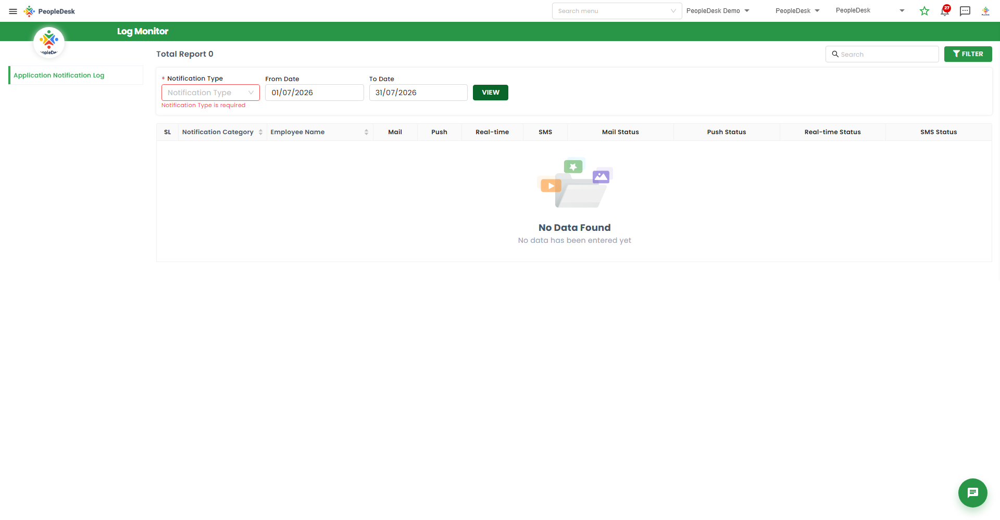

**What it does**: This is not a detail/record view — it is the same Application Notification Log page immediately after clicking "VIEW" without first selecting a Notification Type. The form displays a validation error instead of a report.

**Key fields / columns**: Same filter fields as the main log page (Notification Type, From Date, To Date) and the same empty results table (SL, Notification Category, Employee Name, Mail, Push, Real-time, SMS, and the four status columns).

**Buttons & actions**:
- The Notification Type field is outlined in red with the message "Notification Type is required" underneath, confirming this is a required-field validation, not a genuine record.
- "VIEW", "FILTER", and Search behave the same as on the main log page once a valid Notification Type is chosen.

**How to use it**: 1. If you see this red "Notification Type is required" message, simply select a value from the Notification Type dropdown. 2. Click "VIEW" again to run the report properly.

**Pro-tip**: This validation message is a good reminder that Notification Type is the one mandatory filter on this page — From Date and To Date alone are not enough to run the report.

---

## 14. Benefits Management Module

Provident Fund and Gratuity policy, investment, and reporting.

#### PF Policy

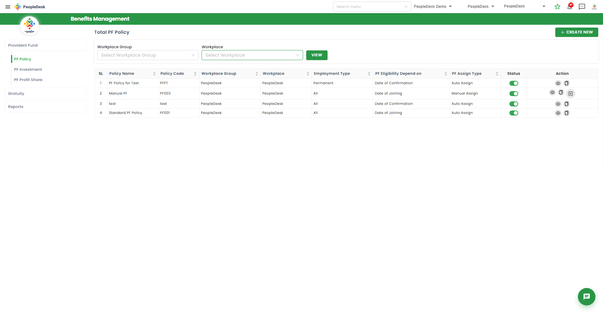

**What it does**: This page lets Admins define and manage Provident Fund (PF) policies — PF is a retirement savings benefit into which both the employee and the employer contribute a percentage of salary each pay period. The list shows every PF policy configured for the organization along with its eligibility rule and contribution assignment method.

**Key fields / columns**:
- Workplace Group, Workplace (filters)
- SL, Policy Name, Policy Code, Workplace Group, Workplace, Employment Type, PF Eligibility Depend on, PF Assign Type, Status, Action

**Buttons & actions**:
- **CREATE NEW** (top right) — opens the PF Policy creation form.
- **Workplace Group / Workplace dropdowns + VIEW** — filter the policy list to a specific workplace group/workplace.
- **Status toggle** (green switch per row) — enables/disables a policy without deleting it.
- **Action column icons** — an eye icon opens/views the policy, a copy icon duplicates it as a starting point for a new policy; one row also shows an extra "+" icon for adding a related item to that policy.

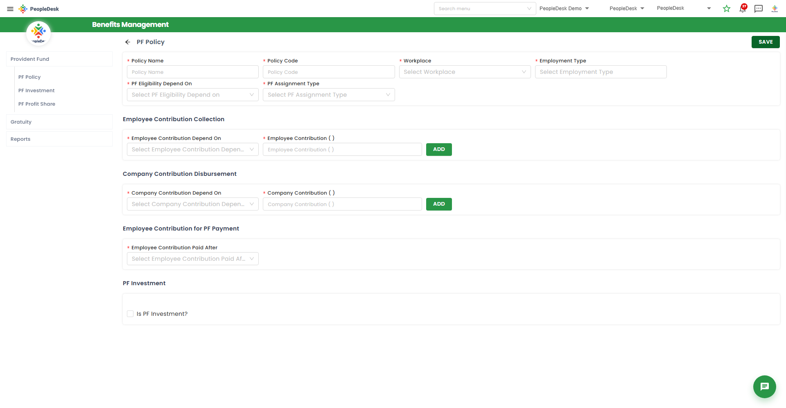

The Create form fields are: Policy Name, Policy Code, Workplace, Employment Type, PF Eligibility Depend on, PF Assignment Type; an **Employee Contribution Collection** block (Employee Contribution Depend On, Employee Contribution, and an **ADD** button to append the rule); a **Company Contribution Disbursement** block (Company Contribution Depend On, Company Contribution, and an **ADD** button); an **Employee Contribution for PF Payment** block (Employee Contribution Paid After); and a **PF Investment** checkbox ("Is PF Investment?"). **SAVE** commits the policy.

**How to use it**:
1. Go to Benefits Management > Provident Fund > PF Policy.
2. Optionally filter by Workplace Group and Workplace, then click VIEW.
3. Click CREATE NEW to add a policy.
4. Enter Policy Name, Policy Code, Workplace, Employment Type, PF Eligibility Depend On, and PF Assignment Type.
5. Set the employee contribution rule and click ADD; set the company contribution rule and click ADD.
6. Choose when the employee contribution is paid after, and tick "Is PF Investment?" if this fund will be invested externally.
7. Click SAVE.

**Pro-tip**: Get the "PF Eligibility Depend On" and contribution percentages right before saving — every later PF Investment, Profit Share, and Annual Statement calculation reads from this policy, so a mistake here cascades into every downstream report.

#### PF Investment

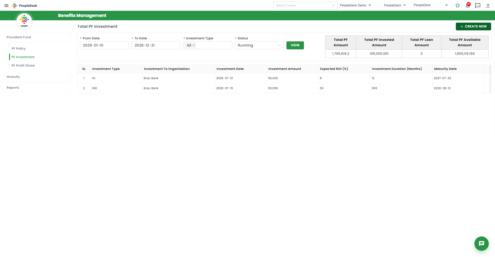

**What it does**: Tracks amounts from the accumulated PF fund that have been placed into external investments (e.g., fixed deposits), and shows running totals of the overall PF corpus, invested amount, loan amount, and available balance.

**Key fields / columns**:
- Filters: From Date, To Date, Investment Type (multi-select), Status (e.g., Running)
- Summary tiles: Total PF Amount, Total PF Invested Amount, Total PF Loan Amount, Total PF Available Amount
- Table: SL, Investment Type, Investment To Organization, Investment Date, Investment Amount, Expected ROI (%), Investment Duration (Months), Maturity Date

**Buttons & actions**:
- **CREATE NEW** (top right) — opens the PF Investment creation form.
- **VIEW** — applies the From/To Date, Investment Type, and Status filters to refresh the list and summary tiles.

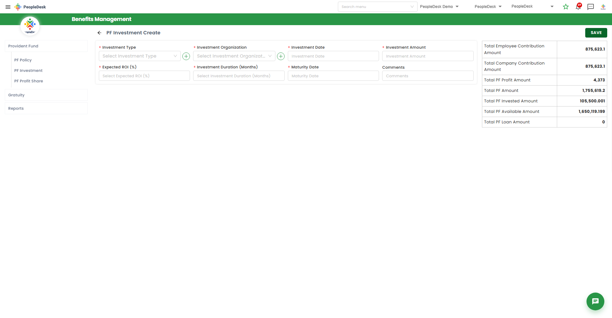

The Create form has: Investment Type and Investment Organization dropdowns, each with a green **+** button beside them to quickly add a new type/organization without leaving the form; Investment Date, Investment Amount, Expected ROI (%), Investment Duration (Months), Maturity Date, and Comments. A right-hand summary panel shows Total Employee Contribution Amount, Total Company Contribution Amount, Total PF Profit Amount, Total PF Amount, Total PF Invested Amount, Total PF Available Amount, and Total PF Loan Amount so you can see how much is available before committing. **SAVE** records the investment.

**How to use it**:
1. Go to Provident Fund > PF Investment.
2. Set From Date, To Date, Investment Type, and Status, then click VIEW to review existing investments.
3. Click CREATE NEW.
4. Select (or use + to add) an Investment Type and Investment Organization.
5. Enter the investment date, amount, expected ROI, duration, and maturity date.
6. Check the summary panel to confirm enough "Total PF Available Amount" remains, then click SAVE.

**Pro-tip**: Check the "Total PF Available Amount" tile before creating a new investment — it already nets out prior investments and loans, so it tells you the real cash still free to invest.

#### PF Profit Share

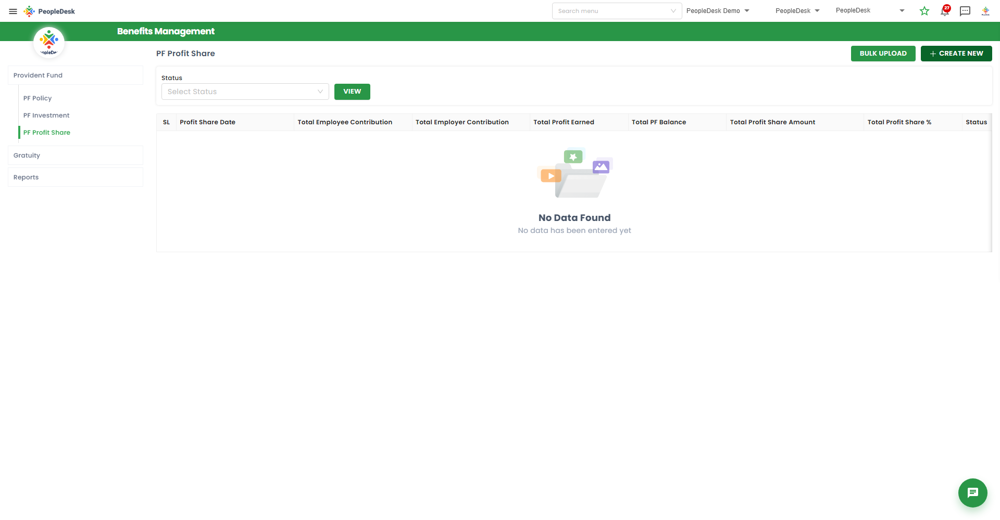

**What it does**: Calculates and distributes the profit earned from PF investments and loan interest back into employees' individual PF balances, then lists each profit-share run.

**Key fields / columns**:
- Status filter
- Table: SL, Profit Share Date, Total Employee Contribution, Total Employer Contribution, Total Profit Earned, Total PF Balance, Total Profit Share Amount, Total Profit Share %, Status

**Buttons & actions**:
- **BULK UPLOAD** (top right) — imports profit-share data from a file instead of calculating manually.
- **CREATE NEW** — opens the profit-share calculation form.
- **VIEW** — applies the Status filter. The list currently shows "No Data Found" (no profit-share runs have been created yet).

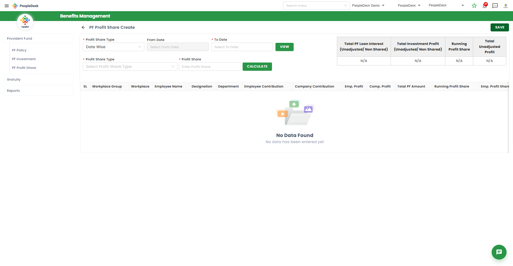

The Create screen lets you pick a **Profit Share Type** (e.g., Date Wise), a From Date and a required To Date, then **VIEW** to pull matching PF balances. A second row lets you choose the Profit Share Type again and enter a **Profit Share** value, with a **CALCULATE** button to compute each employee's share. A right-hand summary shows Total PF Loan Interest (Unadjusted/Non Shared), Total Investment Profit (Unadjusted/Non Shared), Running Profit Share, and Total Unadjusted Profit (all "N/A" until data is calculated). Below is a per-employee results table: Workplace Group, Workplace, Employee Name, Designation, Department, Employee Contribution, Company Contribution, Emp. Profit, Comp. Profit, Total PF Amount, Running Profit Share, Emp. Profit Share. **SAVE** commits the run.

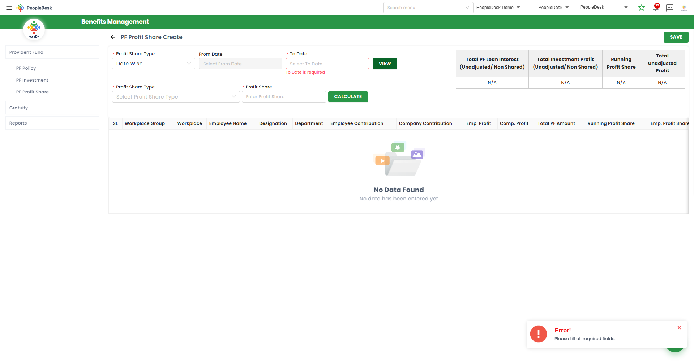

This capture is the same Create screen after clicking VIEW without entering the required To Date — it shows an inline red "To Date is required" message under the field and a red "Error! Please fill all required fields." toast in the bottom-right corner, rather than a separate detail view.

**How to use it**:
1. Go to Provident Fund > PF Profit Share.
2. Filter by Status and click VIEW to see past runs, or click BULK UPLOAD to import one.
3. Click CREATE NEW to start a new calculation.
4. Choose the Profit Share Type, set From Date and To Date, then click VIEW.
5. Set the Profit Share Type/value and click CALCULATE to generate the per-employee breakdown.
6. Review the table and click SAVE.

**Pro-tip**: If the "Please fill all required fields" error appears, check the To Date field first — it is required even when From Date is left blank, and the report will not calculate without it.

#### Gratuity Policy

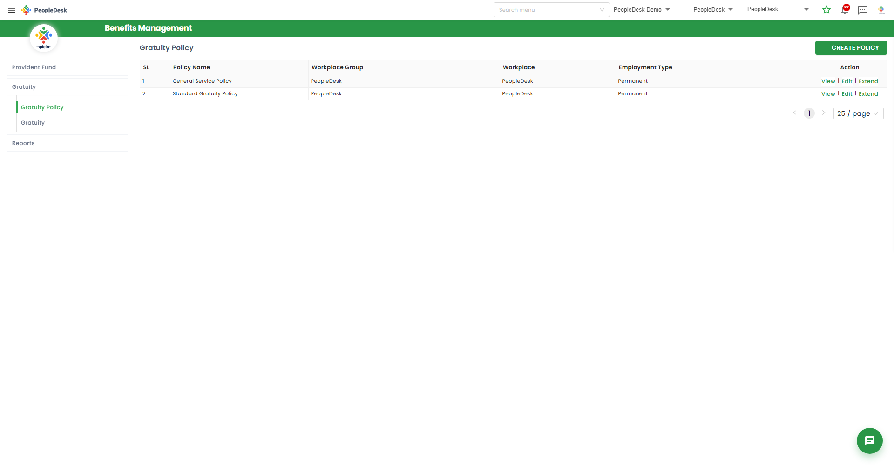

**What it does**: Configures Gratuity policies — Gratuity is a lump-sum, end-of-service benefit paid to an employee based on length of service, typically at exit or retirement. This page lists all configured policies.

**Key fields / columns**:
- SL, Policy Name, Workplace Group, Workplace, Employment Type, Action
- Pagination controls (page number, "25 / page")

**Buttons & actions**:
- **CREATE POLICY** (top right) — opens the Gratuity Policy creation form.
- **View** (per row) — opens the policy for review.
- **Edit** (per row) — modifies an existing policy.
- **Extend** (per row) — adds a further service-length tier/slab to an already-active policy.

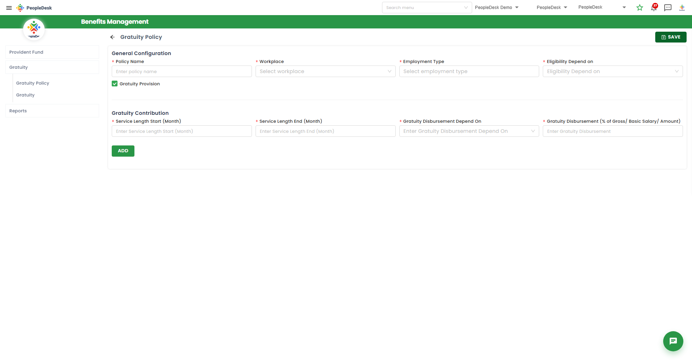

The Create form's **General Configuration** section has Policy Name, Workplace, Employment Type, Eligibility Depend On, and a "Gratuity Provision" checkbox (checked by default). The **Gratuity Contribution** section defines a service-length tier: Service Length Start (Month), Service Length End (Month), Gratuity Disbursement Depend On, and Gratuity Disbursement (% of Gross/Basic Salary/Amount), with an **ADD** button to save that tier and start another. **SAVE** (top right) commits the policy.

**How to use it**:
1. Go to Benefits Management > Gratuity > Gratuity Policy.
2. Review existing policies, or use View/Edit/Extend on a specific row.
3. Click CREATE POLICY to start a new one.
4. Fill in Policy Name, Workplace, Employment Type, and Eligibility Depend On, and confirm Gratuity Provision is enabled.
5. Add one or more service-length tiers (Start Month, End Month, Disbursement Depend On, Disbursement value), clicking ADD after each.
6. Click SAVE.

**Pro-tip**: Use Extend instead of creating a brand-new policy when you only need to add a longer-service tier (e.g., 10+ years) — this preserves the gratuity already accrued under the existing policy rather than starting employees over on a duplicate one.

#### Gratuity

**What it does**: This menu item sits under Gratuity in the sidebar and is meant to show gratuity records/calculations for employees. However, the two screenshots captured for this page (`gratuity.png` and `gratuity_create.png`) are identical to the PF Policy list and PF Policy create screens documented above — the page title reads "Total PF Policy" and the sidebar highlights Provident Fund > PF Policy, not Gratuity. This looks like a screenshot-capture mismatch in the source material rather than the actual Gratuity screen, so no gratuity-specific fields or buttons can be reliably documented from these images.

**How to use it**: For configuring gratuity rules, use the Gratuity Policy page above; re-capture this page's screenshots to document its real fields, columns, and buttons once available.

**Pro-tip**: If you land on this menu item and see a PF Policy screen instead of gratuity data, treat it as a navigation/caching glitch — refresh the page or re-select the Gratuity menu item.

#### PF Investment By Type

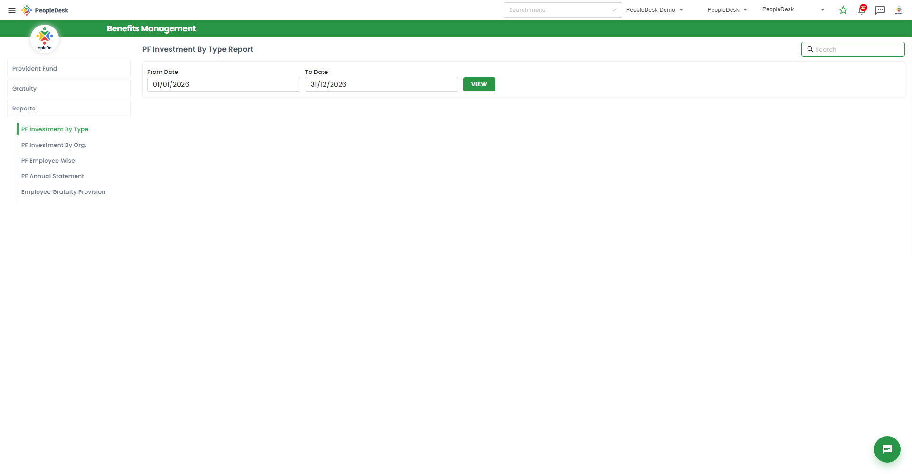

**What it does**: A report that aggregates PF investments by Investment Type (e.g., FD, FDR) over a chosen date range, so Admins can see how PF funds are distributed across investment vehicles.

**Key fields / columns**:
- From Date, To Date
- Table (after running): SL, Investment Type, Total Time of Investment, Total Invested Amount, Total Collected Amount, Action

**Buttons & actions**:
- **VIEW** — runs the report for the selected date range.
- **Action eye icon** (per row, once results are shown) — drills into the underlying investment records for that type.
- A **Search** box (top right) filters the report's own navigation menu.

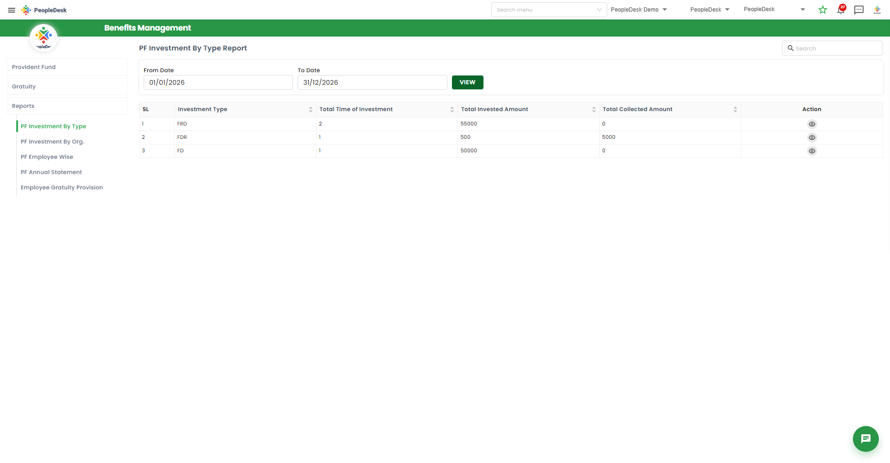

After clicking VIEW, the table populates with rows such as FRD, FDR, and FD, each showing total time of investment, total invested amount, and total collected amount, confirming this is the normal result state of the VIEW action rather than a separate modal.

**How to use it**:
1. Go to Provident Fund > Reports > PF Investment By Type.
2. Set From Date and To Date.
3. Click VIEW to populate the by-type summary table.
4. Click the eye icon on a row to drill into that investment type's details.

**Pro-tip**: Run this report before starting a new PF Profit Share calculation so you know how much return has actually come in per investment type, rather than assuming the expected ROI entered at investment time.

#### PF Investment By Org.

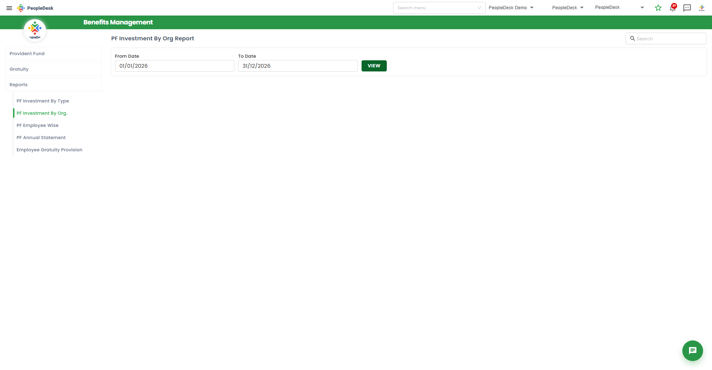

**What it does**: A companion report to PF Investment By Type that aggregates PF investments by the receiving organization (e.g., the bank or institution holding the investment) over a date range.

**Key fields / columns**:
- From Date, To Date

**Buttons & actions**:
- **VIEW** — runs the report for the selected date range.
- **Search** box (top right) filters the report's own navigation menu.

This capture looks identical to the base filter screen — no results table or error message is visible, so either no investment-by-organization data exists for the default date range, or the VIEW click did not register in this capture. No additional fields or columns beyond From Date/To Date and VIEW can be confirmed from the image.

**How to use it**:
1. Go to Provident Fund > Reports > PF Investment By Org.
2. Set From Date and To Date.
3. Click VIEW to generate the organization-wise breakdown.

**Pro-tip**: If VIEW returns no visible rows, double check that PF Investment records exist for the selected date range on the PF Investment page — this report only reflects investments already entered there.

#### PF Employee Wise

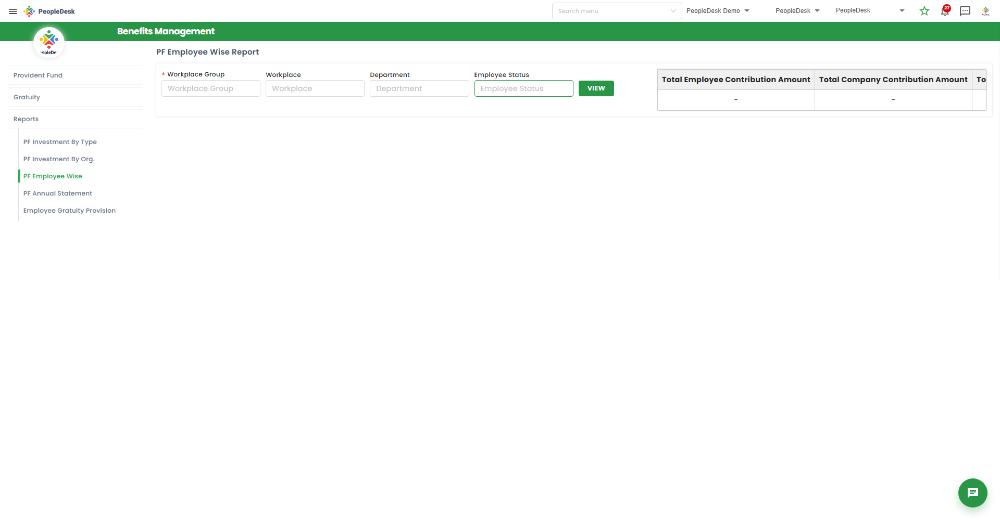

**What it does**: Reports each employee's PF contribution totals, filtered by workplace group, workplace, department, and employee status.

**Key fields / columns**:
- Workplace Group (required), Workplace, Department, Employee Status
- Summary tiles: Total Employee Contribution Amount, Total Company Contribution Amount, and a third total (partially visible, likely Total PF Amount) — all showing "–" with no filters applied

**Buttons & actions**:
- **VIEW** — runs the report using the selected filters.

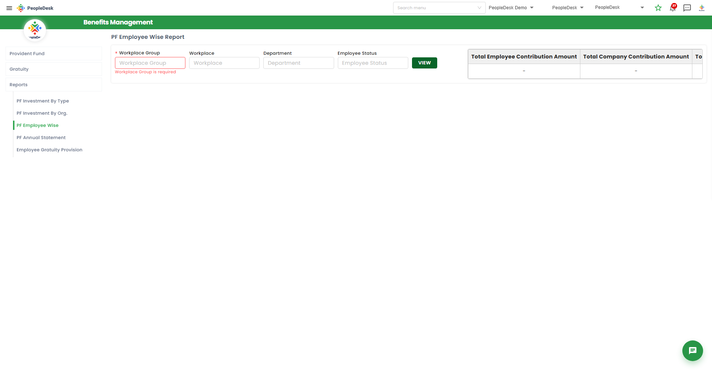

This is the same page after clicking VIEW without selecting a Workplace Group — the field is outlined in red with the message "Workplace Group is required," confirming Workplace Group is mandatory for this report.

**How to use it**:
1. Go to Provident Fund > Reports > PF Employee Wise.
2. Select a Workplace Group (required); optionally narrow by Workplace, Department, and Employee Status.
3. Click VIEW to see contribution totals.

**Pro-tip**: Always pick the Workplace Group first — it's the only mandatory filter, and skipping it blocks the report with a validation error even if the other filters are filled in.

#### PF Annual Statement

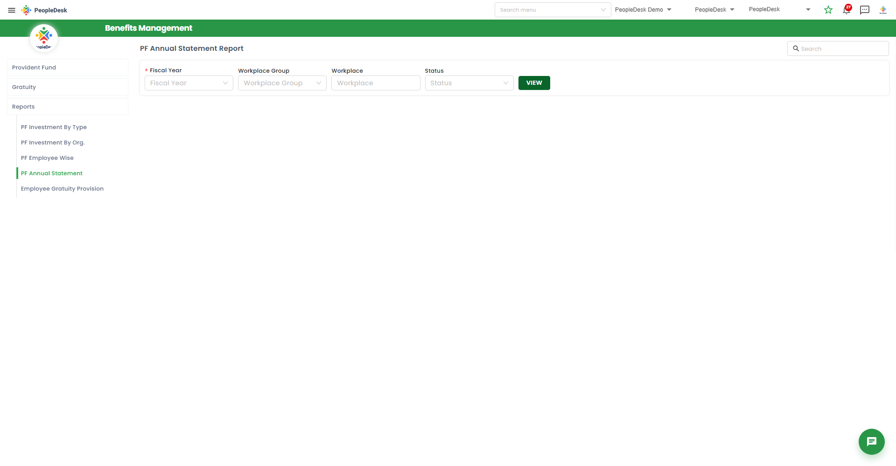

**What it does**: Generates a yearly PF statement for a fiscal year, optionally scoped to a workplace group/workplace and status.

**Key fields / columns**:
- Fiscal Year (required), Workplace Group, Workplace, Status

**Buttons & actions**:
- **VIEW** — runs the annual statement for the selected fiscal year and filters.

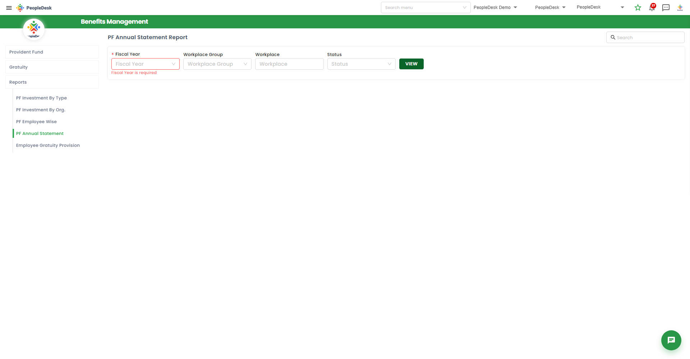

This is the same page after clicking VIEW without selecting a Fiscal Year — the field is outlined in red with "Fiscal Year is required," showing that Fiscal Year is the mandatory filter for this report.

**How to use it**:
1. Go to Provident Fund > Reports > PF Annual Statement.
2. Select the required Fiscal Year; optionally add Workplace Group, Workplace, and Status.
3. Click VIEW to generate the statement.

**Pro-tip**: Run this at year-end (or fiscal year close) as the official PF summary for compliance/audit purposes — but confirm all PF Policy and Investment entries for the year are finalized first, since the statement reflects whatever has been recorded up to that point.

#### Employee Gratuity Provision

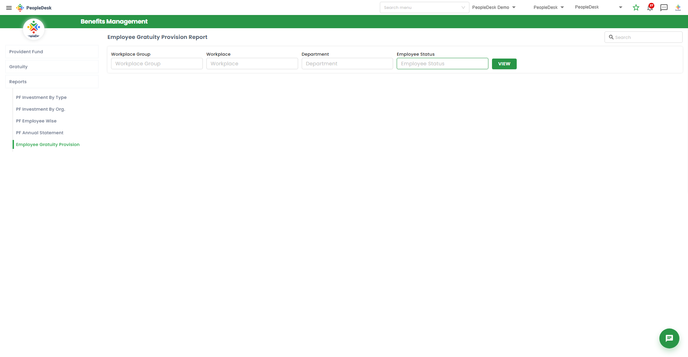

**What it does**: Reports each employee's accrued (provisioned) gratuity liability — the running end-of-service benefit the company owes based on each employee's service length — filterable by workplace group, workplace, department, and employee status.

**Key fields / columns**:
- Filters: Workplace Group, Workplace, Department, Employee Status
- Results table: SL, Workplace Group, Workplace, Department, Employee Code, Employee Name, Designation, Gratuity Start Date, Gratuity Provision Count, Total Gratuity Amount (column partially cut off in the screenshot)

**Buttons & actions**:
- **VIEW** — runs the report using the selected filters.
- **Download icon** (top left of the title, once results are shown) — exports the gratuity provision report.
- Pagination controls at bottom (page 1/2, "25 / page") once results are loaded.

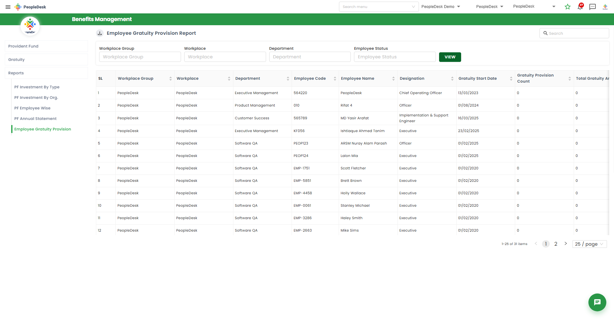

After clicking VIEW, this shows a genuinely populated report: 31 employee records (paginated, 25 per page) listing each employee's workplace, department, designation, gratuity start date, and current gratuity provision count/amount — this is real report output, not a validation error.

**How to use it**:
1. Go to Provident Fund > Reports > Employee Gratuity Provision.
2. Optionally filter by Workplace Group, Workplace, Department, and Employee Status.
3. Click VIEW to list every employee's accrued gratuity provision.
4. Use the download icon to export the report, and the pagination controls to page through all 31+ records.

**Pro-tip**: Reconcile this report's Total Gratuity Amount against your Gratuity Policy tiers periodically — since provision accrues automatically based on service length, a policy misconfiguration (wrong Service Length Start/End) will silently understate or overstate the company's true gratuity liability.

## 15. Loan Management Module

Provident Fund loan processing and lifecycle reporting.

#### PF Loan

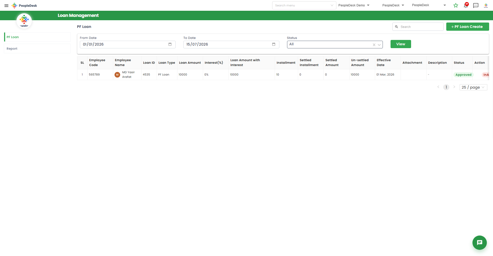

**What it does**: Manages Provident Fund (PF, a retirement savings fund) loans taken by employees against their PF balance — listing all loans and their repayment status.

**Key fields / columns**:
- Filters: From Date, To Date, Status (All)
- Table: SL, Employee Code, Employee Name, Loan ID, Loan Type, Loan Amount, Interest(%), Loan Amount with Interest, Installment, Settled Installment, Settled Amount, Un-settled Amount, Effective Date, Attachment, Description, Status, Action

**Buttons & actions**:
- From Date / To Date fields and Status dropdown to filter the loan list by period and approval state.
- "View" button runs the filtered search.
- Search box (top right) to find a specific loan or employee.
- "+ PF Loan Create" button (top right) opens the form to record a new PF loan.
- Action icons per row (e.g., view/status toggle) to inspect or update an individual loan record.

**How to use it**: 1. Open Loan Management > PF Loan. 2. Set From Date, To Date, and Status to filter the list, then click "View". 3. Use Search to locate a specific employee's loan. 4. Click "+ PF Loan Create" to add a new PF loan for an employee. 5. Use the row Action icons to review or manage an existing loan's status.

**Pro-tip**: Filter by Status (e.g., "Approved" only) before reviewing un-settled amounts — it's faster than scanning the whole mixed list for outstanding balances.

---

#### PF Loan — Create

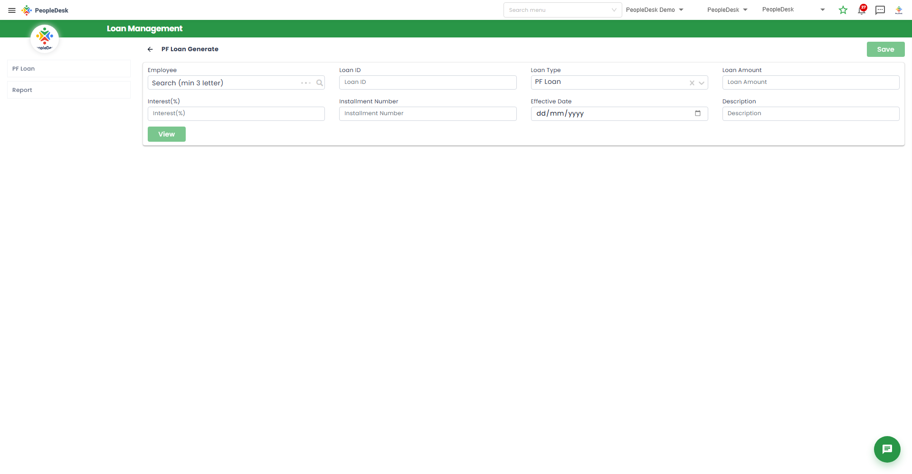

**What it does**: A form ("PF Loan Generate") for issuing a new Provident Fund loan to an employee.

**Key fields / columns**:
- Employee (search, minimum 3 letters)
- Loan ID
- Loan Type (defaults to "PF Loan")
- Loan Amount
- Interest (%)
- Installment Number
- Effective Date
- Description

**Buttons & actions**:
- Employee search box (type at least 3 letters) to look up and select the borrowing employee.
- "View" button (bottom left) to preview/validate entered details.
- "Save" button (top right) to submit and create the loan record.
- Back arrow (top left, next to "PF Loan Generate") returns to the PF Loan list without saving.

**How to use it**: 1. Click "+ PF Loan Create" from the PF Loan list. 2. Search and select the Employee. 3. Enter the Loan Amount, Interest (%), and Installment Number. 4. Set the Effective Date and add an optional Description. 5. Click "Save" to create the loan.

**Pro-tip**: Enter the Interest(%) as 0 for interest-free PF loans — the field is optional-looking but directly affects the "Loan Amount with Interest" shown later in the PF Loan list.

---

#### Pf Loan Lifecycle

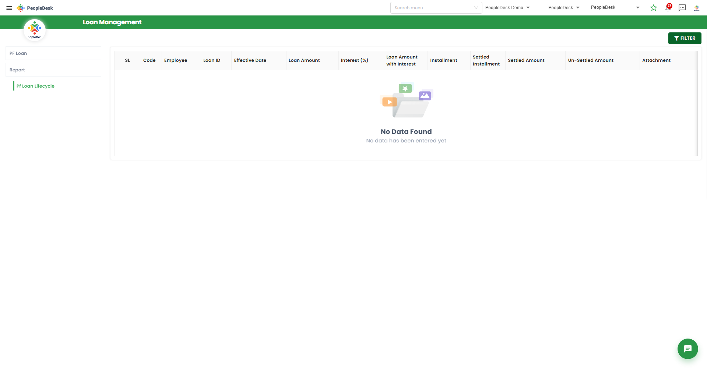

**What it does**: A report view under Loan Management showing the full lifecycle (amount, interest, installments, settlement) of PF loans across employees.

**Key fields / columns**: SL, Code, Employee, Loan ID, Effective Date, Loan Amount, Interest (%), Loan Amount with Interest, Installment, Settled Installment, Settled Amount, Un-Settled Amount, Attachment.

**Buttons & actions**:
- "FILTER" button (top right) to set search criteria (e.g., date range, employee, status) for the report.
- Left sidebar navigation: PF Loan, Report > Pf Loan Lifecycle, letting you switch between the loan list and this lifecycle report.

**How to use it**: 1. Go to Loan Management > Report > Pf Loan Lifecycle. 2. Click "FILTER" to set the criteria you want to report on. 3. Review the resulting lifecycle data for each loan (amount, installments settled vs. outstanding).

**Pro-tip**: If the report shows "No Data Found" as in this example, click "FILTER" first — the report likely needs explicit criteria (such as a date range) before it will return any loans.

---

## 16. 💡 Tips & Best Practices

1. **Set filters before clicking View/Search.** Almost every list and report page requires you to pick a branch, workplace, or date range before results appear — an empty table after clicking View is usually a missing filter, not missing data.
2. **Create master data before daily transactions.** Configure Department, Section, Designation, Employment Type, and similar Administration settings first — Employee Management, Compensation & Benefits, and other modules all depend on this master data being in place.
3. **Use Employee Self Service for anything an employee can request themselves** (leave, loan, expense, documents) rather than having HR enter it on their behalf in Employee Management — this keeps the approval trail (via the Approval module) accurate.
4. **Double-check required fields before submitting a Create form.** Several forms in this system (e.g. Attendance/Employee reports, PF Annual Statement) show red validation messages like "Workplace is required" if you click View/Submit without filling every marked field — fill all fields marked with a red asterisk (*) first.

## 17. ❓ Troubleshooting (Common Issues)

**"A report or list page shows no data."**
Check the required filters at the top of the page (From Date/To Date, Workplace Group, Workplace, Status) — many report pages default to blank filters and show "No Data Found" until you fill them in and click View.

**"I clicked View/Submit and got a red validation message instead of results."**
This is normal, expected behavior — it means one or more required fields (marked with a red asterisk) were left empty. Fill them in and try again.

**"A page shows an unexpected error (e.g. a JSON/technical error toast)."**
A small number of pages in this demo environment surfaced genuine backend errors while this manual was being prepared (for example, the Multiple Pay-Slip page under Compensation & Benefits returned an "Unexpected end of JSON input" error). If you see something similar, treat it as a backend issue rather than something you did wrong, and report it with the exact page and company/branch you were using.

**"A table's rightmost columns are cut off in a screenshot or on my screen."**
Several list pages in this system (especially in Employee Management, e.g. the main Employee list with 20+ columns) are wider than a standard screen. The visible screenshots in this manual may not show every column — scroll the table horizontally on your own screen to see columns like Actions/Edit that may extend past the right edge.

**"I can't find a menu item I expect to see."**
Menu visibility is role-based. If a module or page is missing, check the ☰ hamburger menu for the full list, and ask your administrator to confirm your role has access to that area.

**"The Recruitment tile on the Overview page doesn't do anything."**
In this demo account, Recruitment is not an active module — clicking its tile just reloads the homepage, and it doesn't appear in the real navigation menu. This is expected for accounts where the module isn't licensed/enabled, not a bug you need to troubleshoot.

## 18. A note on this manual's screenshots

This manual was generated by automatically logging in and capturing a screenshot of every page in the system, plus the Create/Edit/View forms where those buttons could be reliably detected. A handful of pages had screenshots that didn't match their expected content exactly (e.g. a page briefly showing another page's data due to a client-side navigation timing issue during capture) — these are called out explicitly in the relevant section rather than silently presented as something they're not. If a screenshot in this manual looks like it doesn't match its heading, that mismatch is noted in the surrounding text.
